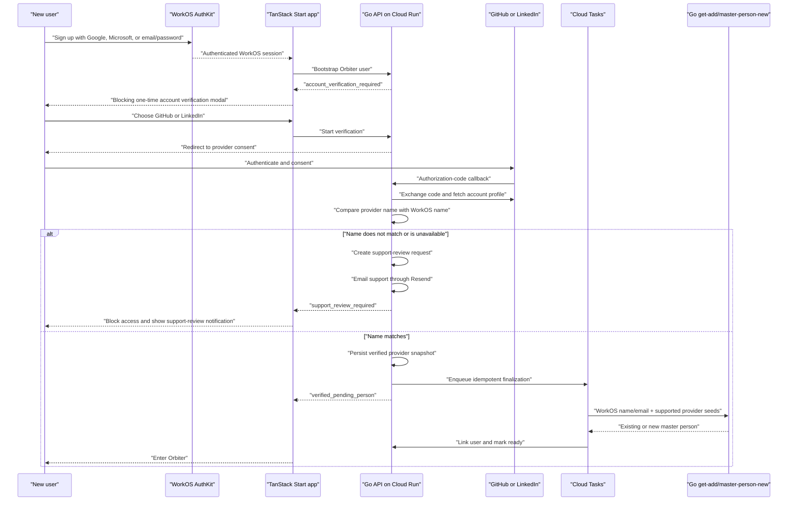

<Note>
  **Scope only — nothing is built.** Drafted 2026-08-12. Product decisions that still need confirmation are listed at the end.
</Note>

## Outcome

After a user signs up through WorkOS AuthKit using Google, Microsoft, or email/password, Orbiter creates the application user but does **not** look for that person in the Orbiter Universe and does **not** begin person enrichment yet.

The new user must connect either GitHub or LinkedIn once. The backend compares the name supplied by WorkOS with the name returned by the selected provider. A normalized match on **either first name or last name** passes. Only a passing comparison may invoke the new Go implementation of `get-add/master-person-new`.

WorkOS remains the source of truth for the user's canonical signup name and email. The verification provider supplements that identity; it does not silently replace the WorkOS name or email.

This is **account verification**, not legal/KYC identity verification. LinkedIn explicitly says its OpenID Connect product does not verify legal identity and must not be marketed that way.

## Approved product decisions

| Decision | Approved behavior |
| --- | --- |
| Name threshold | Pass when either normalized first name **or** normalized last name matches |
| Gate | Mandatory; there is no skip or limited-product bypass |
| Email evidence | An exact verified email match never compensates when neither name part matches |
| Mismatch recovery | Block the user, create a support-review request, email support through Resend, and show a persistent support-review notification |
| Provider emails | Attach every valid, distinct email returned by WorkOS, GitHub, or LinkedIn to the resolved `master_person`, retaining each address's source and verification status |
| Person implementation | Build and call the new Go `get-add/master-person-new`; do not call the current Xano implementation |
| Existing accounts | Pre-launch users are grandfathered; current developer accounts will be wiped and recreated to exercise the new-user flow |
| Support delivery | Use the Resend Email API initially; keep the notification adapter replaceable by Intercom/Fin later |

The first-or-last rule is intentionally permissive. Common first names and surnames create a higher false-match risk than requiring both names; the audit record, one-provider-account-per-user rule, and support workflow are required compensating controls.

## Current-state change

The [current signup flow](/guides/auth/user-signup-process) calls `mvp/workos/new-user-identity` immediately after creating a new `user`. That helper fetches the WorkOS profile and calls `mvp/get-add/master-person-new` before the rest of provisioning completes.

Split that behavior into three stages:

1. **Bootstrap:** validate the WorkOS session, create the `user`, retain the WorkOS identity snapshot, and set `onboarding_status = account_verification_required`.
2. **Verify:** connect GitHub or LinkedIn, fetch that account's identity data, and compare its name with the canonical WorkOS name. No Universe lookup or person enrichment is allowed in this stage.
3. **Finalize:** after a match, invoke the new Go `get-add/master-person-new` idempotently, link the resulting `master_person_id` to the user, attach every provider-returned email with per-address provenance, apply other supported provider fields, and mark the user ready.

Other account bootstrap work—TipTap tokens, personal organization, Knock identity, profile slug, and settings—can continue before verification as long as no code path calls a person get-add or another Universe resolver. Product and private person APIs must reject an incomplete user server-side. The mandatory gate has no skip path.

## User flow



### Modal behavior

- Render it for every authenticated new user whose server-owned status is not complete.
- Make it blocking if verification is mandatory: no close button, no Escape dismissal, and no access to the product behind it.
- Offer two buttons: **Continue with LinkedIn** and **Continue with GitHub**.
- Explain that Orbiter reads basic account identity data to compare the name with the signup name.
- After the provider callback, show one of: `processing`, `support_review_required`, `provider_cancelled`, `provider_unavailable`, or `ready`.
- If finalization fails after a successful match, show a retryable setup state. Never require the user to repeat OAuth merely because the Go person get-add failed.
- On a name mismatch, create a support-review request once, email the support inbox through Resend, and display a persistent notification: **"We couldn't verify this account automatically. Our support team has been notified and will review your account."** Never expose raw OAuth data.
- Meet dialog accessibility requirements: initial focus, focus containment, labelled title/description, keyboard operation, and screen-reader status announcements.

"One time" means one successful verification per user. An unfinished or failed verification should return on the next session; a completed user should never see the modal again.

## Identity and match policy

### Canonical signup identity

Persist the WorkOS profile used at signup:

```json
{
  "workos_user_id": "user_01J...",
  "signup_method": "google | microsoft | password",
  "first_name": "Maya",
  "last_name": "Chen",
  "email": "maya@orbiter.example",
  "email_verified": true
}
```

The final WorkOS field names and `email_verified` availability should be confirmed against the existing AuthKit session/user object. If WorkOS does not expose the signup method or email-verification flag, omit those fields rather than inferring them.

### Approved deterministic match

Use deterministic normalization in Go before any Universe lookup:

1. Unicode-normalize, lowercase, trim, remove punctuation/diacritics, and collapse whitespace.
2. For LinkedIn, pass when normalized `given_name == WorkOS first_name` **or** normalized `family_name == WorkOS last_name`.
3. GitHub returns one free-form `name`, not structured first/last fields. Pass when either normalized WorkOS first name or normalized WorkOS last name appears as a complete token in GitHub's `name`; ignore middle-name tokens.
4. Never use the GitHub `login` handle as a name match.
5. Treat a missing provider name as `insufficient_provider_data`, not a match.
6. Treat email as supporting evidence and useful supplemental data, not a required match: a work signup address often differs from a personal GitHub or LinkedIn address. Even an exact verified email match does **not** pass when neither the first nor last name matches.
7. Do not use fuzzy/LLM matching in the first release. Nicknames and changed names should go through a clearly defined correction or review path.

At least one comparable WorkOS name part and one provider name part must exist. A missing name is `insufficient_provider_data`, not a pass. Persist which part matched (`first`, `last`, or `both`) and the match-rule version for auditability.

### Provider-account uniqueness

Add a unique constraint on `(provider, provider_subject)`. One GitHub or LinkedIn account must not verify multiple Orbiter users unless support performs an audited reassignment. This prevents a person from lending the same provider account to many signups.

## State model and persistence

### User onboarding state

Recommended states:

| Status | Meaning |
| --- | --- |
| `account_verification_required` | New user exists; provider has not passed |
| `oauth_in_progress` | A live provider transaction exists |
| `support_review_required` | Provider returned data but automatic matching failed; access remains blocked and support review is required |
| `verified_pending_person` | Provider passed; finalization is queued/running |
| `person_setup_failed` | Verification is valid; finalization needs retry/support |
| `ready` | `master_person_id` is linked; modal never returns |

Do not derive authorization solely from a frontend flag. Every private API that requires a fully initialized user should enforce `onboarding_status == ready` or an equivalent server-side entitlement.

### `account_verifications`

Suggested fields:

| Field | Purpose |
| --- | --- |
| `id`, `user_id`, `provider` | Verification identity |
| `provider_subject` | Stable GitHub numeric ID or LinkedIn `sub` |
| `status`, `failure_code` | State machine and safe UI error |
| `workos_first_name`, `workos_last_name`, `workos_email` | Immutable comparison snapshot |
| `provider_name`, `provider_first_name`, `provider_last_name` | Provider-returned name data |
| `provider_emails` | All distinct provider emails with `address`, `primary`, `verified`, `visibility`, and source metadata |
| `provider_profile_url`, `provider_avatar_url` | Supplemental identity data |
| `normalized_claims` | Provider-specific non-token JSON snapshot |
| `match_rule_version`, `match_result`, `match_reasons` | Auditable decision |
| `verified_at`, `person_finalized_at`, timestamps | Lifecycle |

Never store OAuth access tokens, authorization codes, client secrets, or LinkedIn ID tokens in `normalized_claims`.

### `oauth_transactions`

Store an expiring, single-use transaction with `state_hash`, `user_id`, provider, redirect target, expiry, consumed time, attempt count, and GitHub PKCE verifier. A database row with a short TTL is sufficient; use Memorystore only if it already exists and durable callback recovery is not required.

### `account_verification_support_reviews`

Create at most one open support-review row per verification. Store `verification_id`, `user_id`, mismatch reason code, status (`open`, `approved`, `rejected`), assigned support user, resolution note, `support_notification_status`, `resend_email_id`, `support_notified_at`, and complete audit timestamps. Do not copy raw provider payloads or tokens into the support row; authorized support tooling may read the redacted verification comparison.

An approval is a privileged override of the automatic name rule. It must record the support actor and reason, transition the user to `verified_pending_person`, and enqueue the same idempotent finalizer used for automatic passes. A rejection leaves the mandatory gate in place. The user cannot edit the canonical WorkOS name through this flow.

## Go API contract

### Start verification

```http
POST /v1/account-verification/oauth/{provider}/start
Authorization: Bearer <Orbiter session>
Content-Type: application/json

{"return_to":"/onboarding/account-verification"}
```

```json
{
  "authorization_url": "https://github.com/login/oauth/authorize?...",
  "expires_at": "2026-08-12T22:10:00Z"
}
```

Validate `return_to` against a fixed same-origin allowlist. Do not accept arbitrary redirect URLs.

### Provider callback

```http
GET /v1/account-verification/oauth/{provider}/callback?code=...&state=...
```

The Go service validates and consumes the transaction, exchanges the code, fetches provider data, runs the name decision, and redirects to the frontend with only a safe result code. No PII, provider token, or detailed provider error belongs in the URL.

### Read status

```http
GET /v1/account-verification/status
Authorization: Bearer <Orbiter session>
```

```json
{
  "status": "verified_pending_person",
  "provider": "linkedin",
  "safe_reason": null,
  "retryable": false
}
```

### Retry finalization

```http
POST /v1/account-verification/finalize
Authorization: Bearer <Orbiter session>
Idempotency-Key: <verification-id>
```

This endpoint may enqueue missing work, but it must never re-run a completed person setup or accept identity fields from the browser.

### Support review

On an automatic mismatch, the callback service creates the support-review row, queues a Resend support email, and shows the user the blocking support-review notification. The user remains blocked while the email is pending, delivered, retried, or being reviewed.

Use a small `SupportReviewNotifier` interface so the first implementation is `ResendSupportReviewNotifier` and a future implementation can create an Intercom/Fin conversation without changing verification logic.

### Temporary Resend support email

1. Verify an Orbiter-owned sending domain/subdomain in Resend.
2. Create a **Sending access** API key restricted to that domain and store it in GCP Secret Manager as `RESEND_API_KEY`; never expose it to TanStack/browser code.
3. Configure `IDENTITY_REVIEW_FROM_EMAIL` and `IDENTITY_REVIEW_TO_EMAIL` outside source control.
4. Send from Go with `POST https://api.resend.com/emails` after the support-review transaction commits.
5. Use `Idempotency-Key: identity-review:<verification_id>`. Resend deduplicates an idempotency key for 24 hours; the database's `support_notified_at`/`resend_email_id` remains the durable dedup guard after that window.
6. Retry transient failures through Cloud Tasks. A Resend failure never approves the user and never creates a second support-review row.
7. Store only the returned Resend message ID and delivery state needed for operations.

Recommended email content:

```json
{
  "from": "Orbiter Identity Review <identity-review@updates.orbiter.example>",
  "to": ["support@orbiter.example"],
  "subject": "Identity verification review required: 0191...",
  "text": "Review verification 0191... for Orbiter user 8271. Provider: github. Automatic result: neither first nor last name matched. Open the internal review record; no OAuth tokens are included."
}
```

Include only the verification ID, internal user ID, provider, safe mismatch reason, and an authenticated internal-review link when one exists. Do not place raw provider JSON, authorization codes, access/ID tokens, secrets, or unnecessary email/name data in the message. If support needs to compare names, it should retrieve the authorized verification record rather than receive the PII in email.

Resend references: [send email and idempotency header](https://resend.com/docs/api-reference/emails/send-email), [API-key permissions](https://resend.com/docs/dashboard/api-keys/introduction), and [domain verification](https://resend.com/docs/dashboard/domains/introduction).

Support tooling needs privileged approve/reject operations, for example:

```http
POST /internal/v1/account-verification/reviews/{review_id}/decision
Authorization: Bearer <support-admin session>
Content-Type: application/json

{"decision":"approved","reason":"Reviewed connected account and signup profile"}
```

This endpoint requires support/admin authorization, immutable audit logging, and idempotent decisions.

## New Go `get-add/master-person-new`

Build a new Go implementation of the person get-add entry point. It replaces the Xano call for this flow; the verification service must not call `mvp/get-add/master-person-new`.

The new request contract should preserve per-address evidence instead of using the legacy Xano-wide `orbiter_verified` boolean:

```json
{
  "idempotency_key": "account-verification:0191...",
  "user_id": 8271,
  "canonical_identity": {
    "full_name": "Maya Chen",
    "first_name": "Maya",
    "last_name": "Chen",
    "email": "maya@orbiter.example",
    "source": "workos"
  },
  "emails": [
    {
      "address": "maya@orbiter.example",
      "source": "workos",
      "primary": true,
      "verified": true
    },
    {
      "address": "maya.github@example.com",
      "source": "github",
      "primary": true,
      "verified": true
    },
    {
      "address": "18400231+maya-chen@users.noreply.github.com",
      "source": "github",
      "primary": false,
      "verified": true
    }
  ],
  "links": [
    {
      "url": "https://github.com/maya-chen",
      "source": "github",
      "verified_account": true
    }
  ],
  "source": {
    "type": "account_verification",
    "verification_id": "0191...",
    "provider": "github",
    "provider_subject": "18400231"
  },
  "enrichment": {
    "queue": false,
    "deep_research": false,
    "cascade_depth": 0,
    "priority_tier": 0
  }
}
```

Rules:

- The canonical name and canonical/primary signup email always come from WorkOS.
- Include every syntactically valid, distinct email returned by WorkOS and the connected provider. Do not discard a GitHub noreply address or an unverified address; preserve `verified`, `primary`, `visibility`, and source metadata on that specific email.
- Deduplicate email addresses case-insensitively. When the same address arrives from multiple sources, retain all provenance while choosing the WorkOS record as canonical.
- Attach all emails to the resulting `master_person`. Never promote an unverified provider address to verified, and never replace the WorkOS canonical signup email with a provider address.
- Add GitHub `html_url` to `links`. LinkedIn's OIDC claims do not include a public LinkedIn profile URL, so LinkedIn verification alone cannot seed a LinkedIn URL.
- Store provider `sub`/ID, login, avatar, locale, company, bio, and other allowed fields in `account_verifications.normalized_claims`.
- After `master_person_id` exists, an `apply-account-verification-source` adapter may copy supported fields—such as avatar and GitHub link—through Go domain writers. Do not extend the person get-add request with unrelated provider fields merely to carry a raw JSON blob.
- Preserve the WorkOS profile picture as the existing fallback. Decide separately whether a provider avatar outranks it.

The finalizer must be idempotent on `verification_id`, and it must accept either `person_created: true` or an existing-person result. A successful pre-API dedup is a valid outcome, not an error.

### Required Go person-gate behavior

The Go implementation must, at minimum:

1. Validate the trusted internal request and its verification provenance.
2. Enforce idempotency on `verification_id`/`idempotency_key`.
3. Normalize and deduplicate every email and link while retaining per-source evidence.
4. Perform a zero-provider-cost local lookup across provider subject bindings, normalized links, and all emails before any paid enrichment.
5. Resolve an existing `master_person` or create the relational and graph identity atomically enough to recover safely from partial failure.
6. Attach all email/link records and bind the provider subject uniquely.
7. Return explicit `master_person_id`, node UUID, `person_created`, and `match_via` fields.
8. Dispatch the new Go person-enrichment pipeline only after the person record/linking transaction succeeds.
9. Emit structured audit/metrics without PII or provider tokens.

Full behavioral parity with the current three-stage Xano Person entry and 13-phase enrichment orchestrator is a separate substantial workstream documented in [Enrichment GCP Migration](/guides/open-work/orbiter-univers-standalone/enrichment-gcp-migration). This verification feature cannot ship until the required Go get-add and downstream enrichment path is production-ready, unless an intentionally reduced v1 person-enrichment contract is separately approved.

## GitHub OAuth setup

Use a GitHub OAuth App for the smallest implementation. GitHub recommends considering a GitHub App in general, but an OAuth App is adequate for a one-time user account read with no repository access.

1. Under the Orbiter-owned GitHub organization, open **Settings → Developer settings → OAuth Apps → New OAuth App**.
2. Create a separate app for local/dev, staging, and production. GitHub OAuth Apps support only one callback URL.
3. Set the homepage URL and exact backend callback, for example `https://api.orbiter.example/v1/account-verification/oauth/github/callback`.
4. Put the Client ID and Client Secret in GCP Secret Manager. Grant access only to the Cloud Run service account.
5. Request only `read:user user:email`. Do not request `repo`, organization, gist, or write scopes.
6. Send the browser to `GET https://github.com/login/oauth/authorize` with `client_id`, exact `redirect_uri`, random `state`, `code_challenge`, `code_challenge_method=S256`, and the two scopes.
7. In the Go callback, validate `state`, then exchange the code at `POST https://github.com/login/oauth/access_token` with `Accept: application/json` and the PKCE verifier.
8. Fetch `GET https://api.github.com/user` and `GET https://api.github.com/user/emails` using the bearer token, GitHub JSON Accept header, and pinned API-version header.
9. Require a person account, a non-empty name, and a passing first-or-last name decision. Capture every valid email returned by `/user/emails`, including primary, secondary, private, noreply, verified, and unverified addresses, with the flags GitHub supplied.
10. Revoke the one-time token through `DELETE /applications/{client_id}/token`, then remove it from memory. Treat a revocation failure as an alert/retry item without losing the already captured verification decision.

Official references: [create an OAuth App](https://docs.github.com/en/apps/oauth-apps/building-oauth-apps/creating-an-oauth-app), [authorization-code flow and PKCE](https://docs.github.com/en/apps/oauth-apps/building-oauth-apps/authorizing-oauth-apps), [OAuth scopes](https://docs.github.com/en/apps/oauth-apps/building-oauth-apps/scopes-for-oauth-apps), [authenticated user](https://docs.github.com/en/rest/users/users#get-the-authenticated-user), [email addresses](https://docs.github.com/en/rest/users/emails#list-email-addresses-for-the-authenticated-user), and [token revocation](https://docs.github.com/en/rest/apps/oauth-applications#delete-an-app-token).

### Representative GitHub responses

Token exchange:

```json
{
  "access_token": "<redacted>",
  "scope": "read:user,user:email",
  "token_type": "bearer"
}
```

`GET /user`:

```json
{
  "login": "maya-chen",
  "id": 18400231,
  "node_id": "U_kgDOB...",
  "avatar_url": "https://avatars.githubusercontent.com/u/18400231?v=4",
  "html_url": "https://github.com/maya-chen",
  "type": "User",
  "site_admin": false,
  "name": "Maya L. Chen",
  "company": "Orbiter",
  "blog": "https://maya.example",
  "location": "Los Angeles, CA",
  "email": null,
  "bio": "Product and data systems",
  "twitter_username": null,
  "public_repos": 23,
  "public_gists": 1,
  "followers": 146,
  "following": 72,
  "created_at": "2015-03-17T18:22:11Z",
  "updated_at": "2026-07-31T09:15:40Z"
}
```

`GET /user/emails`:

```json
[
  {
    "email": "maya.github@example.com",
    "primary": true,
    "verified": true,
    "visibility": "private"
  },
  {
    "email": "18400231+maya-chen@users.noreply.github.com",
    "primary": false,
    "verified": true,
    "visibility": null
  }
]
```

GitHub profile `name` and public `email` may be absent, so the implementation must handle a provider that cannot supply enough name data.

## LinkedIn OpenID Connect setup

Use **Sign in with LinkedIn using OpenID Connect**, not the deprecated legacy `r_liteprofile`/`r_emailaddress` sign-in integration.

1. In the LinkedIn Developer Portal, create an Orbiter application owned by the correct LinkedIn company page.
2. On **Products**, request **Sign in with LinkedIn using OpenID Connect**.
3. On **Auth**, add each exact HTTPS backend callback URL, for example `https://api.orbiter.example/v1/account-verification/oauth/linkedin/callback`.
4. Put the Client ID and Client Secret in GCP Secret Manager and restrict them to the Cloud Run service account.
5. Request exactly `openid profile email` at `GET https://www.linkedin.com/oauth/v2/authorization`, with `response_type=code`, exact `redirect_uri`, and a random `state`.
6. Validate and consume `state`, then exchange the code server-side at `POST https://www.linkedin.com/oauth/v2/accessToken` with `grant_type=authorization_code`.
7. Validate the ID token signature through LinkedIn's discovery/JWKS metadata plus `iss`, `aud`, and `exp`. Fetch `GET https://api.linkedin.com/v2/userinfo` with the access token for the normalized member claims.
8. Pass when either `given_name` or `family_name` matches the corresponding WorkOS name after normalization. Handle `email` and `email_verified` as optional.
9. If LinkedIn returns an email, include it in the person get-add email set with its exact verification flag.
10. Persist the normalized non-token claims, then discard the access token and ID token. No refresh token is needed for a one-time check.

Official references: [LinkedIn OIDC sign-in](https://learn.microsoft.com/en-us/linkedin/consumer/integrations/self-serve/sign-in-with-linkedin-v2) and [LinkedIn authorization-code flow](https://learn.microsoft.com/en-us/linkedin/shared/authentication/authorization-code-flow).

### Representative LinkedIn responses

Token exchange:

```json
{
  "access_token": "<redacted>",
  "expires_in": 5184000,
  "scope": "openid profile email",
  "token_type": "Bearer",
  "id_token": "<redacted-jwt>"
}
```

`GET /v2/userinfo`:

```json
{
  "sub": "aB92xQp7Lm",
  "name": "Maya Chen",
  "given_name": "Maya",
  "family_name": "Chen",
  "picture": "https://media.licdn.com/dms/image/example/profile-displayphoto-shrink_100_100/0/",
  "locale": "en-US",
  "email": "maya.linkedin@example.com",
  "email_verified": true
}
```

LinkedIn documents `email` and `email_verified` as optional. Its OIDC claim list contains no public profile URL, so the backend must not fabricate one from `sub` or the member's name.

## TanStack Start frontend implementation

1. Add `onboarding_status` to the authenticated user/session query.
2. In the authenticated root layout's server-side loader/before-load policy, route incomplete users to an addressable onboarding surface. Present the verification UI as a modal over that surface.
3. Keep the data boundary on the server/API. A client route guard improves UX but is not authorization.
4. Use a same-origin TanStack server function as a typed BFF only if that is already the frontend convention; otherwise call the Go API with the current WorkOS/Orbiter session. Provider callbacks remain public Go routes because they are external callbacks, not browser RPC calls.
5. On provider selection, call the start endpoint and use a full-page redirect to the returned allowlisted URL.
6. On callback landing, refetch verification status and poll only while `verified_pending_person`; use capped exponential backoff and stop on terminal status.
7. For `support_review_required`, keep the modal blocking and show the persistent support-review notification. Show "support has been notified" only after Resend accepts the email; while delivery is retrying, show that the review notification is pending. Do not offer an in-product name-edit bypass.
8. Add analytics for modal shown, provider chosen, provider cancel, mismatch, support contacted, support override, verification pass, finalization failure, and ready—without names, emails, codes, tokens, or raw provider errors.

TanStack reference: [server functions, same-origin behavior, and server-side auth enforcement](https://tanstack.com/start/latest/docs/framework/react/guide/server-functions).

## Go/GCP implementation

Recommended components:

- **Cloud Run:** provider adapters, OAuth start/callback endpoints, match engine, status API, and finalizer handler.
- **Secret Manager:** provider client secrets and configuration; never frontend environment variables.
- **Primary relational database:** onboarding state, verification snapshots, one-time OAuth transactions, and idempotency records.
- **Cloud Tasks:** durable, retryable Go person-get-add finalization and Resend support-email delivery. Use task names derived from `verification_id` for deduplication.
- **Resend:** temporary transactional transport for sending mismatch-review notifications to the support inbox; replace through `SupportReviewNotifier` when Intercom/Fin is deployed.
- **Cloud Logging and Monitoring:** structured safe error codes, latency, pass/mismatch rates, provider failures, queue age, and finalizer retries. Apply field-level log redaction.

Suggested Go packages:

```text
internal/accountverification/
  handler.go
  service.go
  matcher.go
  model.go
  repository.go
  finalizer.go
  provider/
    provider.go
    github.go
    linkedin.go
```

Keep provider response structs provider-specific and map them into one internal `AccountClaims` model. Do not let GitHub/LinkedIn JSON shapes leak into handlers or the person pipeline client.

## Security and privacy requirements

- Random, unguessable, single-use `state`, bound to the logged-in user, provider, callback, and short expiry.
- GitHub S256 PKCE in addition to the confidential-client secret.
- LinkedIn ID-token signature and claim validation using discovery/JWKS metadata.
- Exact callback URLs and allowlisted frontend return paths.
- No OAuth token, authorization code, ID token, client secret, or raw callback query in logs/traces/error trackers.
- Unique provider subject binding and idempotent callback consumption.
- Rate limits per user, IP, and provider; cap repeated starts and callback failures.
- Encrypt retained provider claims at rest if the primary database layer does not already provide adequate field/data encryption.
- Document retention and deletion. Deleting a user should remove the provider snapshot and subject binding.
- Consent copy must state which basic account fields are read and why.
- Provider outages must fail closed: no match means no Universe lookup or enrichment.
- Support override operations must require privileged authorization and preserve actor, reason, and timestamp in an immutable audit trail.

## Failure behavior

| Failure | User behavior | Backend behavior |
| --- | --- | --- |
| User cancels provider | Return to modal; allow retry/other provider | Consume/expire transaction; no person call |
| Missing provider name | Explain provider lacks usable name | Store safe failure code; no person call |
| Name mismatch | Block access and show that support has been notified/review is pending | Create one support-review request, send one idempotent Resend email, and make no person call until an audited support approval |
| Provider email differs | Continue only if either name part matches | Attach every distinct address with provider provenance; keep WorkOS email canonical; email equality alone never passes |
| Resend support email fails | Keep the user blocked and show review notification pending | Retry delivery; preserve the single review row; alert after retry exhaustion |
| Callback replay | Generic expired-link message | Reject consumed state; no duplicate work |
| Provider subject already bound | Support-oriented message | Fail closed and alert; no account takeover |
| Go person get-add fails | Show setup delay/retry state | Keep `verified_pending_person`/`person_setup_failed`; retry idempotently without OAuth |
| Existing person returned | Continue normally | Link returned `master_person_id`; mark ready |

## Testing plan

### Unit tests

- Unicode, punctuation, diacritics, middle names, hyphenated names, compound surnames, swapped tokens, nicknames, missing names, and non-Latin names—including first-only, last-only, both, and neither match outcomes.
- An exact verified email with neither name part matching remains a failure.
- GitHub and LinkedIn response mapping, optional/null fields, wrong account type, and capture of all distinct provider emails with per-address flags.
- State expiry/consumption, redirect allowlist, ID-token claims, and provider subject uniqueness.
- Finalizer idempotency, support-review approval/rejection authorization, Resend notification deduplication/retry, and onboarding state transitions.

### Integration tests

- Provider token exchange and profile fetch against dev applications using recorded, redacted contract fixtures.
- WorkOS bootstrap creates a user without calling the Go person get-add.
- Passing verification queues exactly one finalizer call with the canonical WorkOS name/email plus every provider-returned email.
- Mismatch, cancellation, missing names, callback replay, and duplicate provider subject make zero person-gate calls.
- A mismatch creates exactly one support-review request and one idempotent Resend notification; only an audited support approval may enqueue finalization.
- Resend timeout, 4xx, 5xx, and task replay tests never duplicate the review or unblock the user.
- Finalizer retry after a simulated Go person-get-add timeout does not repeat OAuth or create duplicate people.

### End-to-end cases

1. WorkOS Google signup → LinkedIn match → existing Orbiter person → ready.
2. WorkOS Microsoft signup → GitHub match → new Orbiter person → ready.
3. WorkOS email/password signup → provider name mismatch → mandatory block, Resend support email, reviewed support override.
4. GitHub name missing → switch to LinkedIn.
5. LinkedIn email missing but either first or last name matches → pass and attach the WorkOS email only.
6. GitHub returns primary, secondary, and noreply emails → attach every distinct address with exact source/verification flags.
7. User leaves during OAuth and returns later → modal resumes safely.
8. Existing/grandfathered non-developer user login → no modal.
9. Wiped developer account signs up again → receives the complete mandatory verification flow.

## Acceptance criteria

- A new WorkOS user is persisted before verification but cannot enter gated product features.
- No new-user path calls a Universe resolver, existing-person lookup, Go person get-add, or person enrichment until provider name comparison passes or support records an approved override.
- WorkOS first name, last name, and email remain canonical through finalization.
- Either normalized first name or normalized last name is sufficient for an automatic pass; the comparison part and rule version are audited.
- An email match never passes a verification when neither name part matches.
- Exactly one successful GitHub or LinkedIn provider account is bound to the user.
- The gate is mandatory and has no user-controlled skip path.
- A mismatch/cancel/error generates zero person-gate calls; a mismatch creates one support review and one idempotent Resend support email.
- Every valid distinct email returned by WorkOS and the provider is attached to the resolved `master_person` with its own source, primary, visibility, and verification evidence.
- A passing verification produces one idempotent finalization and supports both an existing-person and new-person result.
- OAuth credentials and tokens never reach the browser, persistent verification JSON, application logs, analytics, or error URLs.
- The modal is accessible, responsive, and never returns after `ready`.
- Monitoring can distinguish provider failures, mismatches, and downstream finalization failures without exposing PII.

## Build plan and estimate

| Phase | Deliverables | Estimate |
| --- | --- | --- |
| 0. Remaining decisions | Resolve retention, existing-user, support-channel, session, and infrastructure questions | 0.5 day |
| 1. Provider registration | Dev/staging/prod apps, callbacks, scopes, secrets, consent copy | 0.5–1 day plus any LinkedIn approval lead time |
| 2. Data and Go OAuth core | Migrations, state machine, repositories, provider adapters, start/callback/status APIs | 3–5 days |
| 3. Match and support review | First-or-last matcher, audit result, review queue, Resend notifier/retries, user review notification, privileged decision API | 2–4 days |
| 4. Go person get-add | New request contract, local dedup, existing/new person resolution, all-email/link writers, graph identity, idempotent result | 5–8 days after shared Go data/graph foundations exist |
| 5. Go enrichment integration | Dispatch into the new Go Person enrichment implementation and prove the required parity contract | Separate Person-pipeline workstream; schedule from the GCP migration plan |
| 6. TanStack UI | Mandatory route gate, modal, callback result surface, polling, support/error states, analytics | 2–3 days |
| 7. QA and hardening | Unit/contract/E2E tests, replay/abuse tests, redaction audit, dashboards and alerts | 3–4 days |
| 8. Rollout | Feature flag, internal cohort, production ramp, runbook, rollback | 1–2 days |

Expected incremental effort for verification, support review, UI, and the Go get-add entry is roughly **17–27 engineer-days**, assuming shared Go database/graph packages and a production-ready downstream Person enrichment service already exist. Building full Go parity for the current Xano Person pipeline is not hidden inside that estimate; it is the Person workstream in the [Enrichment GCP Migration](/guides/open-work/orbiter-univers-standalone/enrichment-gcp-migration), where Person is identified as the long pole.

## Rollout

1. Ship schema and backend code dark behind `account_verification_gate`.
2. Register internal/test accounts and exercise both provider paths in staging.
3. Enable for Orbiter staff/test tenants; watch match rate, missing-name rate, provider errors, and finalizer latency.
4. Enable for a small percentage of **new** signups only.
5. Ramp to all new signups after reviewing false mismatches and support cases.
6. Grandfather all pre-launch users. Wipe the developer accounts and recreate them as new users so they traverse the mandatory gate during rollout QA.
7. Rollback disables the modal for new signups but must not erase verification records or double-run finalizers.

## Open decisions

1. **Provider reuse:** confirm one provider subject may verify only one Orbiter user, with support-only reassignment.
2. **Data retention:** does “all OAuth info” mean normalized allowed profile fields only, or also an encrypted raw response snapshot? If raw is required, how long should it be retained?
3. **Avatar precedence:** WorkOS profile photo, verification-provider photo, or existing `master_person` avatar—which wins when multiple are available?
4. **Resend configuration:** what verified sending domain, from address, and support recipient inbox should production use?
5. **Support operations:** until Intercom/Fin exists, where will support view and approve/reject the database-backed review—a minimal internal page, an admin API client, or another internal tool?
6. **Session topology:** what are the production frontend/API origins, and does the Go API receive a WorkOS access token, an Orbiter JWT, or a shared secure cookie?
7. **Finalizer infrastructure:** are Cloud Tasks and the primary relational store already available in the GCP project, or should this scope include provisioning them?
