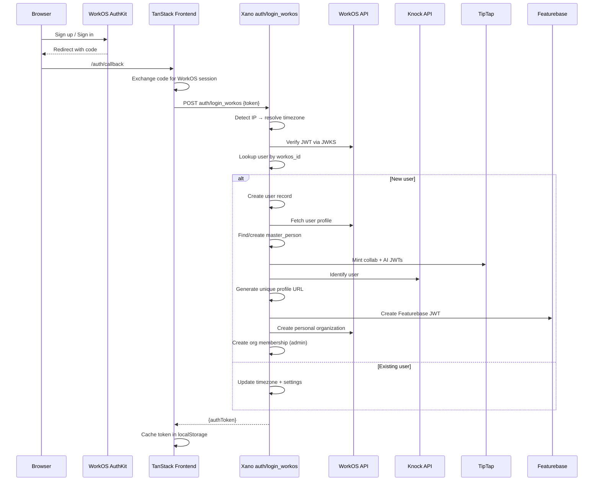

## Overview

When a new user signs up via AuthKit, the frontend obtains a WorkOS access token and sends it to the Xano `auth/login_workos` endpoint. This single endpoint orchestrates the entire account provisioning pipeline: verifying identity, creating the user record, syncing profile data, minting service JWTs, registering with notification services, and bootstrapping a personal organization.

This guide documents every step and sub-function in the flow.

---

## High-Level Sequence



---

## Entry Point: `auth/login_workos`

<Card>
  <strong>POST</strong> <code>https://xh2o-yths-38lt.n7c.xano.io/api:qMCc0ojP/auth/login_workos</code>
  <br />Auth: None (this endpoint *creates* auth tokens)
</Card>

### Input

| Field   | Type   | Required | Description |
|---------|--------|----------|-------------|
| `token` | string | Yes      | WorkOS access token obtained from AuthKit |

### What it does

<Steps>
  <Step title="Resolve timezone from IP">
    Reads `X-Real-Ip` from request headers and calls `util.ip_lookup` to determine the user's IANA timezone (e.g. `America/New_York`).
  </Step>

  <Step title="Validate token">
    Asserts the token is non-empty.
  </Step>

  <Step title="Verify JWT via WorkOS JWKS">
    Calls **get-workos-keys** to retrieve the WorkOS client ID, then uses the `jose` library to verify the RS256 JWT against WorkOS's public JWKS endpoint (`https://api.workos.com/sso/jwks/{clientId}`). This handles key rotation automatically.
  </Step>

  <Step title="Lookup existing user">
    Queries the `user` table by `workos_id` (the JWT `sub` claim).
  </Step>

  <Step title="Branch: new vs. existing user">
    - **New user** — runs the full provisioning pipeline (Steps 6-13 below).
    - **Existing user** — updates `local_timezone` and `settings.working_timezone`, then skips to Step 14.
  </Step>

  <Step title="Create user record">
    Inserts a new row in the `user` table with `workos_id`, `local_timezone`, and `created_at`.
  </Step>

  <Step title="Fetch WorkOS profile">
    Calls **fetch-user-data** to pull the full user profile from the WorkOS User Management API.
  </Step>

  <Step title="Enrich user identity">
    Calls **new-user-identity** which finds or creates a `master_person` record, links it to the user, and seeds the avatar from the WorkOS profile picture.
  </Step>

  <Step title="Mint TipTap JWTs">
    Calls **create-tiptap-jwt** to generate HS256 collaboration and AI JWTs for the TipTap editor, persisting them on the user record.
  </Step>

  <Step title="Register with Knock">
    Calls **knock-user-identify** to upsert the user in Knock's notification system with their name and email.
  </Step>

  <Step title="Generate profile URL">
    Calls **unique-profile-url** to create a URL-safe slug from the user's name (e.g. `john_doe`), appending a random suffix if the slug is already taken.
  </Step>

  <Step title="Create Featurebase JWT">
    Calls **create-featurebase-jwt** to mint an HS256 JWT for the Featurebase feedback widget.
  </Step>

  <Step title="Create personal organization">
    Calls **create-personal-organization** which creates a WorkOS organization, mirrors it in Xano, and assigns the user as `admin`.
  </Step>

  <Step title="Issue auth token">
    Generates a Xano auth token for the user with no expiration.
  </Step>

  <Step title="Post-process: persist timezone">
    Asynchronously calls **add-user-timezone** to add the timezone to the `user-timezones` lookup table if it doesn't already exist.
  </Step>
</Steps>

### Response

```json
{
  "authToken": "eyJhbGciOiJBMjU2S1ci..."
}
```

---

## Function Reference

### 1. `mvp/workos/get-workos-keys`

<Accordion title="Credential retrieval helper">
  **Purpose:** Fetches all WorkOS-related environment variables from the `environment_variables` table and returns them as a key-value map.

  **Inputs:** None

  **How it works:**
  1. Queries `environment_variables` where `name` contains `"workos"`.
  2. Iterates over results, building a flat `{name: value}` object.
  3. Returns the map (includes keys like `workos_api_key`, `workos_client_id`, etc.).

  **Called by:** `auth/login_workos` (for JWKS verification), `fetch-user-data`, and other WorkOS functions.
</Accordion>

---

### 2. `mvp/workos/fetch-user-data`

<Accordion title="Fetch WorkOS user profile by ID">
  **Purpose:** Retrieves a user's full profile from the WorkOS User Management API.

  **Inputs:**

  | Field      | Type   | Required | Description      |
  |------------|--------|----------|------------------|
  | `workos_id`| string | Yes      | WorkOS user ID   |

  **How it works:**
  1. Calls `get-workos-keys` to obtain the API key.
  2. Makes a `GET` request to `https://api.workos.com/user_management/users/{workos_id}`.
  3. Validates the response is `200`; throws `"WorkOS user not found or request failed."` otherwise.
  4. Returns the full WorkOS user object (email, first_name, last_name, profile_picture_url, etc.).
</Accordion>

---

### 3. `mvp/workos/new-user-identity`

<Accordion title="Enrich user and create master_person">
  **Purpose:** Fetches the live WorkOS user, creates a `master_person` record for identity resolution, links it to the user, and seeds the avatar.

  **Inputs:**

  | Field      | Type   | Required | Description      |
  |------------|--------|----------|------------------|
  | `workos_id`| string | No       | WorkOS user ID   |

  **How it works:**
  1. Looks up the `user` record by `workos_id`.
  2. Calls `fetch-user-data` to get the live WorkOS profile.
  3. Extracts `email`, `first_name`, `last_name`, and `profile_picture_url`.
  4. Calls `mvp/get-add/master-person` to find or create a `master_person` record with those details.
  5. Links `master_person_id` onto the `user` record.
  6. **Post-process (async):**
     - Calls `mvp/my/copy-to-my-person` to seed the user's personal contact record.
     - If no `main` avatar exists and WorkOS returned a profile picture, calls `mvp/avatar/replace-avatar` to set it.

  **Returns:** The updated user record with joined `master_person.name`.
</Accordion>

---

### 4. `mvp/tiptap/create-tiptap-jwt`

<Accordion title="Mint TipTap collaboration and AI JWTs">
  **Purpose:** Generates two HS256 JWTs for the TipTap real-time editor — one for collaboration, one for AI features.

  **Inputs:**

  | Field      | Type   | Required | Description      |
  |------------|--------|----------|------------------|
  | `workos_id`| string | No       | WorkOS user ID (used as JWT `sub`) |

  **How it works:**
  1. Fetches the `tiptap_colab_app_secret` from the `environment_variables` table.
  2. Uses the `jose` library to sign two JWTs:
     - **Collab JWT** — signed with the collab secret from the DB.
     - **AI JWT** — signed with `$env.tiptap_ai_app_secret`.
     - Both use `HS256`, issuer `xano-server`, audience `tiptap`.
  3. Persists both JWTs on the `user` record (`tiptap_collab_jwt`, `tiptap_ai_jwt`).

  **Returns:** `{ collabJwt, aiJwt }`
</Accordion>

---

### 5. `mvp/knock/knock-user-identify`

<Accordion title="Upsert user in Knock notification service">
  **Purpose:** Creates or updates a user in [Knock](https://knock.app) so they can receive in-app notifications.

  **Inputs:**

  | Field  | Type   | Required | Description                        |
  |--------|--------|----------|------------------------------------|
  | `email`| string | Yes      | User's primary email               |
  | `name` | string | Yes      | User's full name                   |
  | `uuid` | string | No       | WorkOS user ID (used as Knock ID)  |

  **How it works:**
  1. Fetches the `knock_api_key` from the `environment_variables` table.
  2. Makes a `PUT` request to `https://api.knock.app/v1/users/{uuid}` with `name` and `email`.
  3. Knock upserts the user — creates if new, updates if existing.

  **Returns:** The raw Knock API response.
</Accordion>

---

### 6. `mvp/orbiter_profile/unique-profile-url`

<Accordion title="Generate a unique profile URL slug">
  **Purpose:** Creates a URL-safe profile slug from the user's name, ensuring uniqueness.

  **Inputs:**

  | Field      | Type   | Required | Description      |
  |------------|--------|----------|------------------|
  | `workos_id`| string | Yes      | WorkOS user ID   |

  **How it works:**
  1. Looks up the user by `workos_id` and reads `workos_profile.first_name` / `last_name`.
  2. Builds a base slug: `firstname_lastname` (lowercased).
  3. Checks the `user` table for an existing `orbiter_url` match.
  4. **No collision:** writes the slug and returns it.
  5. **Collision:** enters a loop, appending a random number (1-99) until a unique slug is found (e.g. `john_doe_42`).

  **Returns:** The final unique slug string.
</Accordion>

---

### 7. `featurebase/create-featurebase-jwt`

<Accordion title="Mint a Featurebase feedback widget JWT">
  **Purpose:** Generates an HS256 JWT for the [Featurebase](https://featurebase.app) feedback widget, allowing authenticated in-app feedback.

  **Inputs:**

  | Field    | Type | Required | Description      |
  |----------|------|----------|------------------|
  | `user_id`| int  | Yes      | Xano user ID     |

  **How it works:**
  1. Fetches the user record with joined `master_person` (for name and avatar).
  2. Signs an HS256 JWT with `$env.feature_base_app_secret`:
     - `name`: `master_person.name` (falls back to `orbiter_url`)
     - `userId`: stringified Xano user ID
     - Issuer: `xano-server`, audience: `feature-base`
  3. Persists the JWT on the `user` record as `feature_base_jwt`.

  **Returns:** The signed JWT string.
</Accordion>

---

### 8. `mvp/workos/create-personal-organization`

<Accordion title="Bootstrap a personal organization for the user">
  **Purpose:** Every new user gets a personal organization. This function creates it in both WorkOS and Xano, and assigns the user as admin.

  **Inputs:**

  | Field            | Type   | Required | Description                      |
  |------------------|--------|----------|----------------------------------|
  | `user_id`        | int    | Yes      | Xano user ID                     |
  | `workos_user_id` | string | Yes      | WorkOS user ID                   |
  | `name`           | string | Yes      | Display name (usually user's name) |

  **How it works:**
  1. Calls `mvp/workos/create-organization` to create `"{name}'s Personal Organization"` in WorkOS.
  2. Inserts a row in the `organization` table with `is_personal: true`.
  3. Calls `mvp/workos/create-organization-membership` to add the user as `admin` of the WorkOS org.
  4. Inserts a row in `organization_membership` with `role: "admin"`, `status: "active"`, cross-linking all IDs.

  **Returns:** `{ organization, membership }` — both Xano records.
</Accordion>

---

### 9. `mvp/timezone/add-user-timezone`

<Accordion title="Persist timezone to lookup table">
  **Purpose:** Maintains a global `user-timezones` lookup table. Adds the timezone if it doesn't already exist.

  **Inputs:**

  | Field     | Type   | Required | Description                  |
  |-----------|--------|----------|------------------------------|
  | `timezone`| string | No       | IANA timezone string         |

  **How it works:**
  1. Checks if the timezone already exists in the `user-timezones` table.
  2. If it exists, returns `"Already exists"`.
  3. If not, inserts a new record with `created_at` and the timezone string.

  **Note:** This runs asynchronously in `util.post_process` — it does not block the auth token response.
</Accordion>

---

## Data Created on Sign-Up

After a successful new-user sign-up, the following records are created:

| Table                      | Record                                                        |
|----------------------------|---------------------------------------------------------------|
| `user`                     | Core user record with `workos_id`, timezone, settings, JWTs   |
| `master_person`            | Identity record with name and email                           |
| `my_person`                | Personal contact record (copy of master_person for the user)  |
| `master_avatar`            | Profile picture (if WorkOS provides one)                      |
| `organization`             | Personal organization (`is_personal: true`)                   |
| `organization_membership`  | Admin membership linking user to personal org                 |
| `user-timezones`           | Timezone lookup entry (if new timezone)                       |

## Third-Party Services Touched

| Service      | Action                          | When              |
|--------------|---------------------------------|-------------------|
| **WorkOS**   | JWT verification via JWKS       | Every login       |
| **WorkOS**   | Fetch user profile              | New user only     |
| **WorkOS**   | Create organization             | New user only     |
| **WorkOS**   | Create organization membership  | New user only     |
| **Knock**    | Upsert user (identify)          | New user only     |
| **TipTap**   | JWT minted (no API call)        | New user only     |
| **Featurebase** | JWT minted (no API call)     | New user only     |
