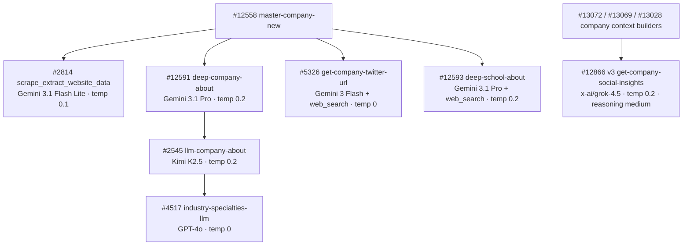

# Company Pipeline — Model Summary

Every OpenRouter model used in the company enrichment pipeline, grouped by model. Update this page when swapping models or after collecting usage data.

---

## `google/gemini-3.1-flash-lite-preview`

| Context Window | Input Cost | Output Cost |
| :-: | :-: | :-: |
| 1,048,576 tokens | \$0.25 / 1M input tokens | \$1.50 / 1M output tokens |

Used for structured JSON extraction from scraped website markdown. Resolves via `$env.LLM_MODEL_JSON_PARSE`.

| Function | Temp | Max Tokens | Timeout | Avg Input Tokens | Avg Output Tokens | Cost/Call | Updated |
| --- | --- | --- | --- | --- | --- | --- | --- |
| `scrape_extract_website_data` #2814 | 0.1 | 4000 | 180s | _TBD_ | _TBD_ | _TBD_ | 2026-04-04 |

---

## `moonshotai/kimi-k2.5`

| Context Window | Input Cost | Output Cost |
| :-: | :-: | :-: |
| 262,144 tokens | \$0.38 / 1M input tokens | \$2.02 / 1M output tokens |

Used for company description copywriting with naming convention enforcement. Live model is `moonshotai/kimi-k2.5` (verified 2026-07-02), provider `sort: throughput` / `allow_fallbacks: true`, reasoning disabled; it replaced `anthropic/claude-sonnet-4.5`, which had replaced `moonshotai/kimi-k2-0905` on 2026-04-05. The catch-path retry re-runs at temperature 0.3.

| Function | Temp | Max Tokens | Timeout | Avg Input Tokens | Avg Output Tokens | Cost/Call | Updated |
| --- | --- | --- | --- | --- | --- | --- | --- |
| `llm-company-about` #2545 | 0.2 | 2000 | 60s | _TBD_ | _TBD_ | _TBD_ | 2026-07-02 |

---

## `google/gemini-3-flash-preview` \+ `openrouter:web_search`

| Context Window | Input Cost | Output Cost |
| :-: | :-: | :-: |
| 1,048,576 tokens | \$0.50 / 1M input tokens | \$3.00 / 1M output tokens |

Web-grounded path used for simple lookups that return a single value. The OpenRouter request uses the `openrouter:web_search` server tool and `provider.data_collection = "deny"`.

| Function | Temp | Max Tokens | Timeout | Avg Input Tokens | Avg Output Tokens | Cost/Call | Updated |
| --- | --- | --- | --- | --- | --- | --- | --- |
| `get-company-twitter-url` #5326 | 0 | 256 | 90s | _TBD_ | _TBD_ | _TBD_ | 2026-06-04 |

---

## `google/gemini-3.1-pro-preview` \+ `openrouter:web_search`

| Context Window | Input Cost | Output Cost |
| :-: | :-: | :-: |
| 1,048,576 tokens | \$2.00 / 1M input tokens | \$12.00 / 1M output tokens |

Used for deep research tasks that require web-grounded search to produce comprehensive school profiles. The OpenRouter request uses the `openrouter:web_search` server tool and `provider.data_collection = "deny"`.

| Function | Temp | Max Tokens | Timeout | Avg Input Tokens | Avg Output Tokens | Cost/Call | Updated |
| --- | --- | --- | --- | --- | --- | --- | --- |
| `deep-school-about` #12593 | 0.2 | — | 90s | _TBD_ | _TBD_ | _TBD_ | 2026-06-04 |

---

## `google/gemini-3.1-pro-preview`

| Context Window | Input Cost | Output Cost |
| :-: | :-: | :-: |
| 1,048,576 tokens | \$2.00 / 1M input tokens | \$12.00 / 1M output tokens |

Used for the deep company-profile writer. Unlike `deep-school-about`, this call does **not** enable the `openrouter:web_search` tool — it writes from the supplied PDL context only. `provider.data_collection = "deny"`.

| Function | Temp | Max Tokens | Timeout | Avg Input Tokens | Avg Output Tokens | Cost/Call | Updated |
| --- | --- | --- | --- | --- | --- | --- | --- |
| `deep-company-about` #12591 | 0.2 | — | 90s | _TBD_ | _TBD_ | _TBD_ | 2026-07-02 |

---

## `openai/gpt-4o`

| Context Window | Input Cost | Output Cost |
| :-: | :-: | :-: |
| 128,000 tokens | \$2.50 / 1M input tokens | \$10.00 / 1M output tokens |

Used for classification tasks requiring high precision and zero creativity.

| Function | Temp | Max Tokens | Timeout | Avg Input Tokens | Avg Output Tokens | Cost/Call | Updated |
| --- | --- | --- | --- | --- | --- | --- | --- |
| `industry-specialties-llm` #4517 | 0 | 4000 | 60s | _TBD_ | _TBD_ | _TBD_ | 2025-12-02 |

---

## `x-ai/grok-4.5`

| Context Window | Input Cost | Output Cost |
| :-: | :-: | :-: |
| 500,000 tokens | \$2.00 / 1M input tokens | \$6.00 / 1M output tokens |

Used by the company social-insights sidecar. Function #12866 is called lazily by company context builders #13072, #13069, and #13028 when `master_company.social_insights` is empty; it is not dispatched directly by the core company-enrichment orchestrator. The request uses native OpenRouter web search, two server-tool steps, a \$0.03 loop threshold, six returned search results, strict ZDR, and `data_collection=deny`.

| Function | Temp | Max Tokens | Timeout | Reasoning | Avg Input Tokens | Avg Output Tokens | Cost/Call | Updated |
| --- | --- | --- | --- | --- | --- | --- | --- | --- |
| `get-company-social-insights` #12866 v3 | 0.2 | 1600 | 90s | medium | _TBD_ | _TBD_ | _TBD_ | 2026-07-11 |

<Note>
  `get-company-social-insights_v2` #13029 is an exact duplicate with no discovered callers. It remains outside the production model registry and diagrams.
</Note>

---

## Pipeline Call Chain

