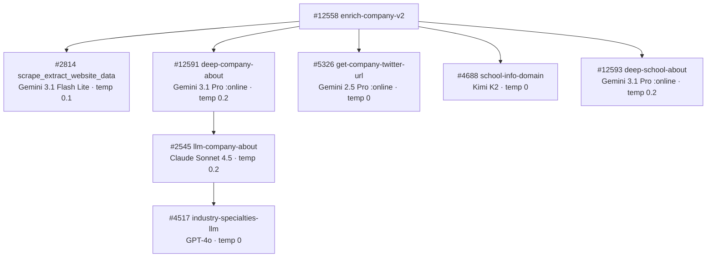

# Company Pipeline — Model Summary

Every OpenRouter model used in the company enrichment pipeline, grouped by model. Update this page when swapping models or after collecting usage data.

---

## `google/gemini-3.1-flash-lite-preview`

| Context Window | Input Cost | Output Cost |
|:---:|:---:|:---:|
| 1,048,576 tokens | $0.25 / 1M input tokens | $1.50 / 1M output tokens |

Used for structured JSON extraction from scraped website markdown. Resolves via `$env.LLM_MODEL_JSON_PARSE`.

| Function | Temp | Max Tokens | Timeout | Avg Input Tokens | Avg Output Tokens | Cost/Call | Updated |
|----------|------|------------|---------|-----------------|------------------|-----------|---------|
| `scrape_extract_website_data` #2814 | 0.1 | 4000 | 180s | _TBD_ | _TBD_ | _TBD_ | 2026-04-04 |

---

## `anthropic/claude-sonnet-4.5`

| Context Window | Input Cost | Output Cost |
|:---:|:---:|:---:|
| 200,000 tokens | $3.00 / 1M input tokens | $15.00 / 1M output tokens |

Used for company description copywriting with naming convention enforcement. Replaced `moonshotai/kimi-k2-0905` on 2026-04-05.

| Function | Temp | Max Tokens | Timeout | Avg Input Tokens | Avg Output Tokens | Cost/Call | Updated |
|----------|------|------------|---------|-----------------|------------------|-----------|---------|
| `llm-company-about` #2545 | 0.2 | — | 30s | _TBD_ | _TBD_ | _TBD_ | 2026-04-06 |

---

## `moonshotai/kimi-k2-0905`

| Context Window | Input Cost | Output Cost |
|:---:|:---:|:---:|
| 131,072 tokens | $0.40 / 1M input tokens | $2.00 / 1M output tokens |

Used for structured extraction where deterministic JSON output is critical.

| Function | Temp | Max Tokens | Timeout | Avg Input Tokens | Avg Output Tokens | Cost/Call | Updated |
|----------|------|------------|---------|-----------------|------------------|-----------|---------|
| `school-info-domain` #4688 | 0 | 1025 | 30s | _TBD_ | _TBD_ | _TBD_ | 2026-02-03 |

---

## `google/gemini-3.1-pro-preview:online`

| Context Window | Input Cost | Output Cost |
|:---:|:---:|:---:|
| 1,048,576 tokens | $2.00 / 1M input tokens | $12.00 / 1M output tokens |

Used for deep research tasks that require web-grounded search to produce comprehensive company/school profiles.

| Function | Temp | Max Tokens | Timeout | Avg Input Tokens | Avg Output Tokens | Cost/Call | Updated |
|----------|------|------------|---------|-----------------|------------------|-----------|---------|
| `deep-company-about` #12591 | 0.2 | — | 90s | _TBD_ | _TBD_ | _TBD_ | 2026-02-23 |
| `deep-school-about` #12593 | 0.2 | — | 90s | _TBD_ | _TBD_ | _TBD_ | 2026-03-19 |

---

## `google/gemini-2.5-pro:online`

| Context Window | Input Cost | Output Cost |
|:---:|:---:|:---:|
| 1,048,576 tokens | $1.25 / 1M input tokens | $10.00 / 1M output tokens |

Used for simple web-grounded lookups that return a single value.

| Function | Temp | Max Tokens | Timeout | Avg Input Tokens | Avg Output Tokens | Cost/Call | Updated |
|----------|------|------------|---------|-----------------|------------------|-----------|---------|
| `get-company-twitter-url` #5326 | 0 | 256 | 90s | _TBD_ | _TBD_ | _TBD_ | 2026-03-19 |

---

## `openai/gpt-4o`

| Context Window | Input Cost | Output Cost |
|:---:|:---:|:---:|
| 128,000 tokens | $2.50 / 1M input tokens | $10.00 / 1M output tokens |

Used for classification tasks requiring high precision and zero creativity.

| Function | Temp | Max Tokens | Timeout | Avg Input Tokens | Avg Output Tokens | Cost/Call | Updated |
|----------|------|------------|---------|-----------------|------------------|-----------|---------|
| `industry-specialties-llm` #4517 | 0 | 4000 | 60s | _TBD_ | _TBD_ | _TBD_ | 2025-12-02 |

---

## Pipeline Call Chain

