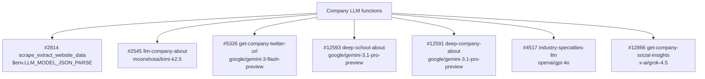

# Company Pipeline — Model Summary

<Note>
Live Xano model IDs and request settings were synchronized on **July 28, 2026** from workspace 3, branch `v1`, using read-only access. Xano is the ground truth. Deleted functions are omitted.
</Note>

## `$env.LLM_MODEL_JSON_PARSE`

<Info>Context: Runtime environment value. No fixed token price is documented for this exact runtime value. The concrete model is not exposed by the read-only workspace context. Keep the Xano environment reference exact; do not guess its value.</Info>

| Function | Model role | Temp | Max Tokens | Timeout | Xano Updated |
| --- | --- | --- | --- | --- | --- |
| `scrape_extract_website_data` #2814 | direct | 0.1 | 4000 | 180 | 2026-06-04 |

---

## `google/gemini-3-flash-preview`

| Context Window | Input Cost | Output Cost |
| :-: | :-: | :-: |
| 1,000,000 tokens | \$0.50 / 1M input tokens | \$3.00 / 1M output tokens |

Pricing verified 2026-07-28. [Source](https://openrouter.ai/google/gemini-3-flash-preview/providers).

| Function | Model role | Temp | Max Tokens | Timeout | Xano Updated |
| --- | --- | --- | --- | --- | --- |
| `get-company-twitter-url` #5326 | direct | 0 | 256 | 90 | 2026-07-19 |

---

## `google/gemini-3.1-pro-preview`

| Context Window | Input Cost | Output Cost |
| :-: | :-: | :-: |
| 1,000,000 tokens | \$2.00 / 1M input tokens | \$12.00 / 1M output tokens |

Pricing verified 2026-07-28. [Source](https://openrouter.ai/google/gemini-3.1-pro-preview/providers).

| Function | Model role | Temp | Max Tokens | Timeout | Xano Updated |
| --- | --- | --- | --- | --- | --- |
| `deep-company-about` #12591 | direct | 0.2 | — | 90 | 2026-06-04 |
| `deep-school-about` #12593 | direct | 0.2 | — | 90 | 2026-06-04 |

---

## `moonshotai/kimi-k2.5`

| Context Window | Input Cost | Output Cost |
| :-: | :-: | :-: |
| 262,144 tokens | \$0.375 / 1M input tokens | \$2.025 / 1M output tokens |

Pricing verified 2026-07-28. [Source](https://openrouter.ai/moonshotai/kimi-k2.5).

| Function | Model role | Temp | Max Tokens | Timeout | Xano Updated |
| --- | --- | --- | --- | --- | --- |
| `llm-company-about` #2545 | direct | 0.2 / 0.3 | 2000 | 60 | 2026-07-14 |

---

## `openai/gpt-4o`

| Context Window | Input Cost | Output Cost |
| :-: | :-: | :-: |
| 128,000 tokens | \$2.50 / 1M input tokens | \$10.00 / 1M output tokens |

Pricing verified 2026-07-28. [Source](https://openrouter.ai/openai/gpt-4o).

| Function | Model role | Temp | Max Tokens | Timeout | Xano Updated |
| --- | --- | --- | --- | --- | --- |
| `industry-specialties-llm` #4517 | direct | 0 | 4000 | 60 | 2026-07-08 |

---

## `x-ai/grok-4.5`

| Context Window | Input Cost | Output Cost |
| :-: | :-: | :-: |
| 500,000 tokens | \$2.00 / 1M input tokens | \$6.00 / 1M output tokens |

Pricing verified 2026-07-28. [Source](https://openrouter.ai/x-ai/grok-4.5).

| Function | Model role | Temp | Max Tokens | Timeout | Xano Updated |
| --- | --- | --- | --- | --- | --- |
| `get-company-social-insights` #12866 → helper #13190 | delegates model call to #13190 | 0.2 | 1600 / 1100 | 90 / 75 | 2026-07-11 |

---

## Function Map

```mermaid
graph TD
    ROOT["Company LLM functions"]
    ROOT --> F2814["#2814 scrape_extract_website_data<br/>$env.LLM_MODEL_JSON_PARSE"]
    ROOT --> F2545["#2545 llm-company-about<br/>moonshotai/kimi-k2.5"]
    ROOT --> F5326["#5326 get-company-twitter-url<br/>google/gemini-3-flash-preview"]
    ROOT --> F12593["#12593 deep-school-about<br/>google/gemini-3.1-pro-preview"]
    ROOT --> F12591["#12591 deep-company-about<br/>google/gemini-3.1-pro-preview"]
    ROOT --> F4517["#4517 industry-specialties-llm<br/>openai/gpt-4o"]
    ROOT --> F12866["#12866 get-company-social-insights<br/>x-ai/grok-4.5"]
```
