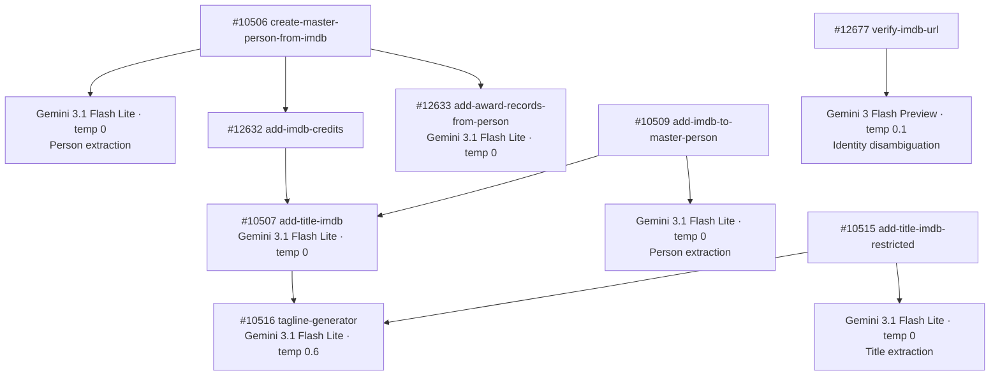

# Film & TV Pipeline — Model Summary

Every OpenRouter model used in the Film & TV enrichment pipeline, grouped by model. Update this page when swapping models or after collecting usage data.

---

## `google/gemini-3.1-flash-lite-preview`

| Context Window | Input Cost | Output Cost |
|:---:|:---:|:---:|
| 1,048,576 tokens | $0.25 / 1M input tokens | $1.50 / 1M output tokens |

Primary model for all IMDB data extraction tasks — person profiles, title metadata, awards parsing, and tagline generation. Replaced `google/gemini-2.5-flash` on 2026-04-06.

| Function | Temp | Max Tokens | Timeout | Avg Input Tokens | Avg Output Tokens | Cost/Call | Updated |
|----------|------|------------|---------|-----------------|------------------|-----------|---------|
| `create-master-person-from-imdb` #10506 (person extraction) | 0 | 16384 | 90s | _TBD_ | _TBD_ | _TBD_ | 2026-04-06 |
| `add-title-imdb` #10507 (title extraction) | 0 | 16384 | 90s | _TBD_ | _TBD_ | _TBD_ | 2026-04-06 |
| `add-imdb-to-master-person` #10509 (person extraction) | 0 | 16384 | 90s | _TBD_ | _TBD_ | _TBD_ | 2026-04-06 |
| `add-title-imdb-restricted` #10515 (title extraction) | 0 | 16384 | 90s | _TBD_ | _TBD_ | _TBD_ | 2026-04-06 |
| `add-award-records-from-person` #12633 (awards extraction) | 0 | 16384 | 90s | _TBD_ | _TBD_ | _TBD_ | 2026-04-06 |
| `tagline-generator` #10516 | 0.6 | 100 | 60s | _TBD_ | _TBD_ | _TBD_ | 2026-04-06 |

---

## `google/gemini-3-flash-preview`

| Context Window | Input Cost | Output Cost |
|:---:|:---:|:---:|
| 1,048,576 tokens | $0.50 / 1M input tokens | $3.00 / 1M output tokens |

Used for IMDB identity disambiguation. Replaced `google/gemini-2.5-flash` on 2026-04-06.

| Function | Temp | Max Tokens | Timeout | Avg Input Tokens | Avg Output Tokens | Cost/Call | Updated |
|----------|------|------------|---------|-----------------|------------------|-----------|---------|
| `verify-imdb-url` #12677 (identity disambiguation) | 0.1 | — | 60s | _TBD_ | _TBD_ | _TBD_ | 2026-04-06 |

---

## Pipeline Call Chain

