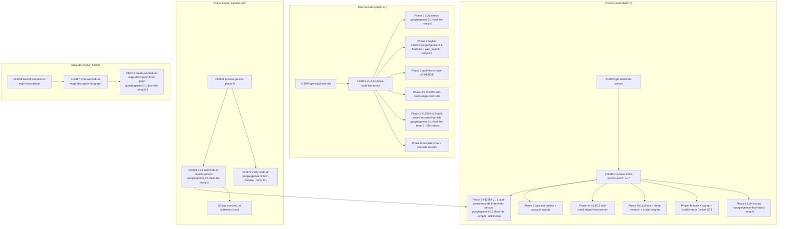

# Film & TV Pipeline — Model Summary

Every OpenRouter model used in the IMDB waterfall pipeline, grouped by model. Last refreshed 2026-05-17 after the Pro→Flash-Lite rollback. **History:** today's morning attempted a bump from `google/gemini-3.1-flash-lite-preview` → `~google/gemini-pro-latest`, but Pro variants returned empty bodies (no `.choices`) on all calls during the fresh sandbox seed run. Rolled back to GA Flash Lite (no `-preview` suffix).

---

## `google/gemini-3.1-flash-lite`

| Context Window | Input Cost | Output Cost |
|:---:|:---:|:---:|
| 1,048,576 tokens | $0.25 / 1M input tokens | $1.50 / 1M output tokens |

Primary model for all IMDB scrape + LLM extraction tasks. The GA release of the flash-lite family (the previous `:preview` suffix was retired during the morning bump cycle).

| Function | Temp | Max Tokens | Timeout | Avg Input Tokens | Avg Output Tokens | Cost/Call | Updated |
|----------|------|------------|---------|-----------------|------------------|-----------|---------|
| `add-imdb-to-master-person` #10509 v1.5 (Phase-8 IMDB scrape + LLM extract) | 0 | 16384 | 90s | _TBD_ | _TBD_ | _TBD_ | 2026-05-17 |
| `add-award-records-from-title` #12879 v1.9 (title awards extract) | 0 | 65536 | 300s | _TBD_ | _TBD_ | _TBD_ | 2026-05-17 |
| `add-award-records-from-imdb-person` #12887 v1.1j (person awards extract) | 0 | 65536 | 300s | _TBD_ | _TBD_ | _TBD_ | 2026-05-17 |
| `run-base-imdb-title-enrich` #12881 v1.4 (Phase 1 title scrape + LLM extract) | 0 | 16384 | 90s | _TBD_ | _TBD_ | _TBD_ | 2026-05-17 |

---

## `google/gemini-3.1-flash-lite` + `openrouter:web_search`

| Context Window | Input Cost | Output Cost |
|:---:|:---:|:---:|
| 1,048,576 tokens | $0.25 / 1M input tokens | $1.50 / 1M output tokens |

Same Flash Lite tier with OpenRouter's `openrouter:web_search` server tool. Used by the tagline generator so it can pull additional context (existing taglines, reviews, marketing angles) beyond the prompt.

| Function | Temp | Max Tokens | Timeout | Avg Input Tokens | Avg Output Tokens | Cost/Call | Updated |
|----------|------|------------|---------|-----------------|------------------|-----------|---------|
| `tagline-generator` #10516 | 0.6 | 100 | 60s | _TBD_ | _TBD_ | _TBD_ | 2026-06-04 |

---

## `~google/gemini-flash-latest`

| Context Window | Input Cost | Output Cost |
|:---:|:---:|:---:|
| 1,048,576 tokens | $0.30 / 1M input tokens | $2.50 / 1M output tokens |

Used by the IMDB person-side orchestrator. The `~` prefix is OpenRouter's auto-resolve-latest selector. Slightly more expensive than `google/gemini-3.1-flash-lite` but tracks the newest GA flash automatically.

| Function | Temp | Max Tokens | Timeout | Avg Input Tokens | Avg Output Tokens | Cost/Call | Updated |
|----------|------|------------|---------|-----------------|------------------|-----------|---------|
| `run-base-imdb-person-enrich` #12880 v1.7 (Phase 1 person scrape + LLM extract) | 0 | 16384 | 90s | _TBD_ | _TBD_ | _TBD_ | 2026-04-22 |

---

## `google/gemini-3-flash-preview`

| Context Window | Input Cost | Output Cost |
|:---:|:---:|:---:|
| 1,048,576 tokens | $0.50 / 1M input tokens | $3.00 / 1M output tokens |

Used for IMDB identity disambiguation when an existing `master_person` doesn't have a verified IMDB URL.

| Function | Temp | Max Tokens | Timeout | Avg Input Tokens | Avg Output Tokens | Cost/Call | Updated |
|----------|------|------------|---------|-----------------|------------------|-----------|---------|
| `verify-imdb-url` #12677 (identity disambiguation, Tavily + LLM) | 0.1 | — | 60s | _TBD_ | _TBD_ | _TBD_ | 2026-04-06 |

---

## `google/gemini-3.1-flash-lite` (description-writer use)

Used for natural-language edge descriptions written onto FalkorDB `WORKED_ON` edges (Person → Film_TV). Cheap + fast since each call is one sentence per edge.

| Function | Temp | Max Tokens | Timeout | Avg Input Tokens | Avg Output Tokens | Cost/Call | Updated |
|----------|------|------------|---------|-----------------|------------------|-----------|---------|
| `create-worked-on-edge-description-from-graph` #13016 | 0.3 | — | 120s | _TBD_ | _TBD_ | _TBD_ | 2026-05-17 |

---

## Pipeline Call Chain

## Models NOT in the IMDB pipeline but referenced via Phase 4b

`#12880` Phase 4b optionally calls three downstream LLM-using functions during person enrichment. These are documented in the **person-pipeline/model-summary** (not here) but worth noting their existence in the call chain:

- `#2537 create-llm-person-bios` — `anthropic/claude-sonnet-4.5` (short + long bios)
- `#12833 deep-person-basic` — `google/gemini-3.1-pro-preview` + `openrouter:web_search` (deep bio via external `orbiter-enrich-…` microservice)
- `#12669 get-social-insights v1.4` — `x-ai/grok-4.3` (social media insights)
