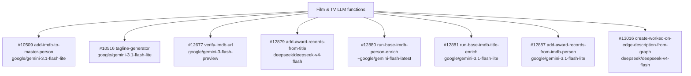

# Film & TV Pipeline — Model Summary

<Note>
Live Xano model IDs and request settings were synchronized on **July 28, 2026** from workspace 3, branch `v1`, using read-only access. Xano is the ground truth. Deleted functions are omitted.
</Note>

## `~google/gemini-flash-latest`

<Info>Context: Runtime-resolved. No fixed token price is documented for this exact runtime value. [Source](https://openrouter.ai/models). OpenRouter resolves this alias at request time. Context and price follow the selected model.</Info>

| Function | Model role | Temp | Max Tokens | Timeout | Xano Updated |
| --- | --- | --- | --- | --- | --- |
| `run-base-imdb-person-enrich` #12880 | direct | 0 | 16384 | 90 | 2026-07-24 |

---

## `deepseek/deepseek-v4-flash`

| Context Window | Input Cost | Output Cost |
| :-: | :-: | :-: |
| 1,000,000 tokens | \$0.09 / 1M input tokens | \$0.18 / 1M output tokens |

Pricing verified 2026-07-28. [Source](https://openrouter.ai/deepseek/deepseek-v4-flash).

| Function | Model role | Temp | Max Tokens | Timeout | Xano Updated |
| --- | --- | --- | --- | --- | --- |
| `add-award-records-from-title` #12879 | direct | 0 | 65536 | 300 | 2026-07-26 |
| `create-worked-on-edge-description-from-graph` #13016 | direct | 0.3 | 300 | 120 | 2026-07-07 |

---

## `google/gemini-3-flash-preview`

| Context Window | Input Cost | Output Cost |
| :-: | :-: | :-: |
| 1,000,000 tokens | \$0.50 / 1M input tokens | \$3.00 / 1M output tokens |

Pricing verified 2026-07-28. [Source](https://openrouter.ai/google/gemini-3-flash-preview/providers).

| Function | Model role | Temp | Max Tokens | Timeout | Xano Updated |
| --- | --- | --- | --- | --- | --- |
| `verify-imdb-url` #12677 | direct | 0.1 | — | 60 | 2026-07-08 |

---

## `google/gemini-3.1-flash-lite`

| Context Window | Input Cost | Output Cost |
| :-: | :-: | :-: |
| 1,000,000 tokens | \$0.25 / 1M input tokens | \$1.50 / 1M output tokens |

Pricing verified 2026-07-28. [Source](https://openrouter.ai/google/gemini-3.1-flash-lite/pricing).

| Function | Model role | Temp | Max Tokens | Timeout | Xano Updated |
| --- | --- | --- | --- | --- | --- |
| `add-imdb-to-master-person` #10509 | direct | 0 | 16384 | 90 | 2026-07-26 |
| `tagline-generator` #10516 | direct | 0.6 | 100 | 60 | 2026-07-03 |
| `run-base-imdb-title-enrich` #12881 | direct | 0 | 16384 | 90 | 2026-07-26 |
| `add-award-records-from-imdb-person` #12887 | direct | 0 | 65536 | 300 | 2026-07-28 |

---

## Function Map

```mermaid
graph TD
    ROOT["Film & TV LLM functions"]
    ROOT --> F10509["#10509 add-imdb-to-master-person<br/>google/gemini-3.1-flash-lite"]
    ROOT --> F10516["#10516 tagline-generator<br/>google/gemini-3.1-flash-lite"]
    ROOT --> F12677["#12677 verify-imdb-url<br/>google/gemini-3-flash-preview"]
    ROOT --> F12879["#12879 add-award-records-from-title<br/>deepseek/deepseek-v4-flash"]
    ROOT --> F12880["#12880 run-base-imdb-person-enrich<br/>~google/gemini-flash-latest"]
    ROOT --> F12881["#12881 run-base-imdb-title-enrich<br/>google/gemini-3.1-flash-lite"]
    ROOT --> F12887["#12887 add-award-records-from-imdb-person<br/>google/gemini-3.1-flash-lite"]
    ROOT --> F13016["#13016 create-worked-on-edge-description-from-graph<br/>deepseek/deepseek-v4-flash"]
```
