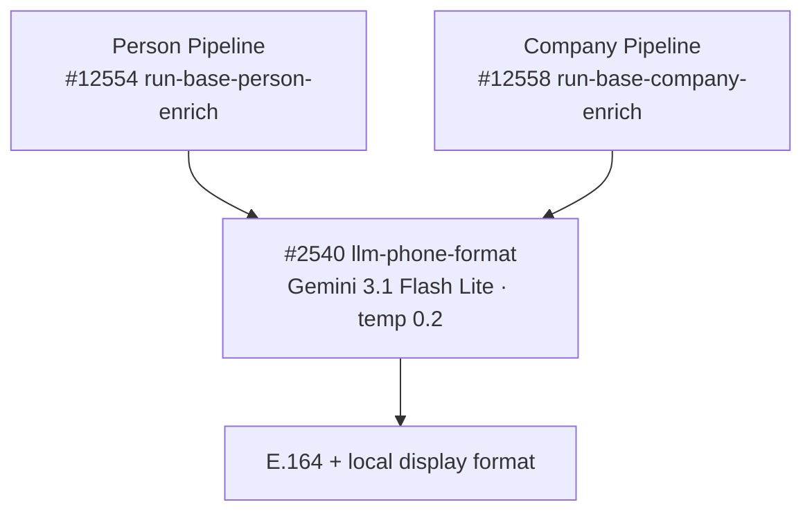

# General — Model Summary

Shared LLM functions that are called from **both** the person and company enrichment pipelines. When an LLM call is used by more than one pipeline, it lives here instead of being duplicated across pipeline-specific pages.

---

## `google/gemini-3.1-flash-lite-preview`

| Context Window | Input Cost | Output Cost |
|:---:|:---:|:---:|
| 1,048,576 tokens | $0.25 / 1M input tokens | $1.50 / 1M output tokens |

Primary model for structured JSON extraction (`$env.LLM_MODEL_JSON_PARSE`). Falls back to `moonshotai/kimi-k2-0905` ($0.40 in / $2.00 out) when the primary returns no choices.

| Function | Temp | Max Tokens | Timeout | Avg Input Tokens | Avg Output Tokens | Cost/Call | Updated |
|----------|------|------------|---------|-----------------|------------------|-----------|---------|
| `llm-phone-format` #2540 | 0.2 | — | 30s | _TBD_ | _TBD_ | _TBD_ | 2026-04-04 |

---

## Pipeline Call Chain

