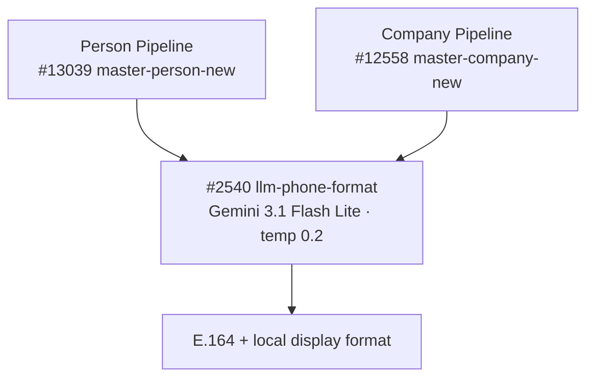

# General — Model Summary

Shared LLM functions that are called from **both** the person and company enrichment pipelines. When an LLM call is used by more than one pipeline, it lives here instead of being duplicated across pipeline-specific pages.

---

## `google/gemini-3.1-flash-lite`

| Context Window | Input Cost | Output Cost |
| :-: | :-: | :-: |
| 1,048,576 tokens | \$0.25 / 1M input tokens | \$1.50 / 1M output tokens |

Hardcoded model for the shared phone-number formatter. `llm-phone-format` #2540 runs a primary \+ a backup call, both pinned to `google/gemini-3.1-flash-lite` (GA; moved off the `-preview` alias), provider `data_collection: deny`.

| Function | Temp | Max Tokens | Timeout | Avg Input Tokens | Avg Output Tokens | Cost/Call | Updated |
| --- | --- | --- | --- | --- | --- | --- | --- |
| `llm-phone-format` #2540 | 0.2 | — | 30s | _TBD_ | _TBD_ | _TBD_ | 2026-07-02 |

---

## Pipeline Call Chain

