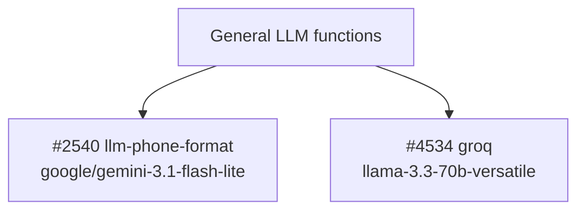

# General — Model Summary

<Note>
Live Xano model IDs and request settings were synchronized on **July 28, 2026** from workspace 3, branch `v1`, using read-only access. Xano is the ground truth. Deleted functions are omitted.
</Note>

## `google/gemini-3.1-flash-lite`

| Context Window | Input Cost | Output Cost |
| :-: | :-: | :-: |
| 1,000,000 tokens | \$0.25 / 1M input tokens | \$1.50 / 1M output tokens |

Pricing verified 2026-07-28. [Source](https://openrouter.ai/google/gemini-3.1-flash-lite/pricing).

| Function | Model role | Temp | Max Tokens | Timeout | Xano Updated |
| --- | --- | --- | --- | --- | --- |
| `llm-phone-format` #2540 | direct | 0.2 | — | 30 | 2026-07-08 |

---

## `llama-3.3-70b-versatile`

<Info>Context: Direct Groq request. No fixed token price is documented for this exact runtime value. This active model string appears in the experimental template/groq function, not an OpenRouter request. OpenRouter pricing is not applicable.</Info>

| Function | Model role | Temp | Max Tokens | Timeout | Xano Updated |
| --- | --- | --- | --- | --- | --- |
| `groq` #4534 | experimental direct Groq template | — | — | — | 2026-04-05 |

---

## Function Map

```mermaid
graph TD
    ROOT["General LLM functions"]
    ROOT --> F2540["#2540 llm-phone-format<br/>google/gemini-3.1-flash-lite"]
    ROOT --> F4534["#4534 groq<br/>llama-3.3-70b-versatile"]
```
