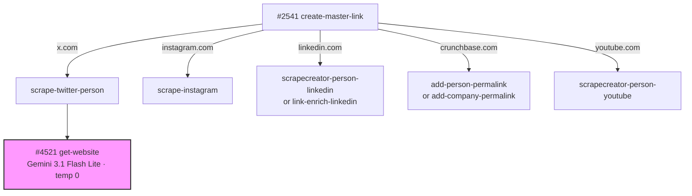

# Link URL Pipeline — Model Summary

Every OpenRouter model used in the Link URL enrichment pipeline, grouped by model. Update this page when swapping models or after collecting usage data.

<Info>
The `create-master-link` orchestrator (#2541) routes URLs by domain and triggers async enrichment sub-functions. Many of those sub-functions (e.g., `create-llm-person-bios`, `llm-company-about`, `industry-specialties-llm`) are documented in the [Company Pipeline](/guides/enrichment/company-pipeline/model-summary) and [Person Pipeline](/guides/enrichment/person-pipeline/model-summary) model summaries.

Only functions with **direct** OpenRouter calls unique to this pipeline are listed below.
</Info>

---

## `google/gemini-3.1-flash-lite-preview`

| Context Window | Input Cost | Output Cost |
|:---:|:---:|:---:|
| 1,048,576 tokens | $0.25 / 1M input tokens | $1.50 / 1M output tokens |

Used to extract the primary company website URL from raw Twitter profile scrape data. Resolves via `$env.LLM_MODEL_JSON_PARSE`.

| Function | Temp | Max Tokens | Timeout | Avg Input Tokens | Avg Output Tokens | Cost/Call | Updated |
|----------|------|------------|---------|-----------------|------------------|-----------|---------|
| `get-website` #4521 (Twitter website extraction) | 0 | 1000 | 60s | _TBD_ | _TBD_ | _TBD_ | 2026-03-28 |

---

## Pipeline Call Chain

<Note>
The pink node indicates the only function in this pipeline with a **direct** OpenRouter LLM call. All other enrichment sub-functions either use external APIs (Tavily, ScrapeCreator) or call functions already documented in other pipeline pages.
</Note>
