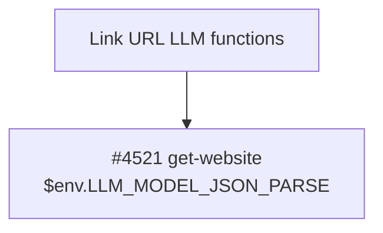

# Link URL Pipeline — Model Summary

<Note>
Live Xano model IDs and request settings were synchronized on **July 28, 2026** from workspace 3, branch `v1`, using read-only access. Xano is the ground truth. Deleted functions are omitted.
</Note>

## `$env.LLM_MODEL_JSON_PARSE`

<Info>Context: Runtime environment value. No fixed token price is documented for this exact runtime value. The concrete model is not exposed by the read-only workspace context. Keep the Xano environment reference exact; do not guess its value.</Info>

| Function | Model role | Temp | Max Tokens | Timeout | Xano Updated |
| --- | --- | --- | --- | --- | --- |
| `get-website` #4521 | direct | 0 | 1000 | 60 | 2026-06-04 |

---

## Function Map

```mermaid
graph TD
    ROOT["Link URL LLM functions"]
    ROOT --> F4521["#4521 get-website<br/>$env.LLM_MODEL_JSON_PARSE"]
```
