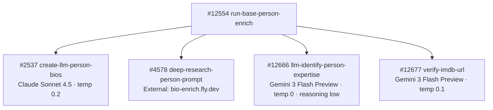

# Person Pipeline — Model Summary

Every OpenRouter model used in the person enrichment pipeline, grouped by model. Update this page when swapping models or after collecting usage data.

---

## `anthropic/claude-sonnet-4.5`

| Context Window | Input Cost | Output Cost |
|:---:|:---:|:---:|
| 1,000,000 tokens | $3.00 / 1M input tokens | $15.00 / 1M output tokens |

Used for biography generation with naming convention enforcement. Replaced `google/gemini-3.1-flash-lite-preview` on 2026-04-05.

| Function | Temp | Max Tokens | Timeout | Avg Input Tokens | Avg Output Tokens | Cost/Call | Updated |
|----------|------|------------|---------|-----------------|------------------|-----------|---------|
| `create-llm-person-bios` #2537 (short bio 229 char) | 0.2 | — | 30s | _TBD_ | _TBD_ | _TBD_ | 2026-04-06 |
| `create-llm-person-bios` #2537 (long bio 500 char) | 0.2 | — | 30s | _TBD_ | _TBD_ | _TBD_ | 2026-04-06 |

---

## `google/gemini-3-flash-preview`

| Context Window | Input Cost | Output Cost |
|:---:|:---:|:---:|
| 1,048,576 tokens | $0.50 / 1M input tokens | $3.00 / 1M output tokens |

Used for expertise signal extraction and IMDB identity disambiguation. Replaced `anthropic/claude-sonnet-4` (expertise) on 2026-04-05 and `google/gemini-2.5-flash` (verify-imdb-url) on 2026-04-06.

| Function | Temp | Max Tokens | Timeout | Reasoning | Avg Input Tokens | Avg Output Tokens | Cost/Call | Updated |
|----------|------|------------|---------|-----------|-----------------|------------------|-----------|---------|
| `llm-identify-person-expertise` #12666 | 0 | — | 30s | effort: low | _TBD_ | _TBD_ | _TBD_ | 2026-04-05 |
| `verify-imdb-url` #12677 | 0.1 | — | 60s | — | _TBD_ | _TBD_ | _TBD_ | 2026-04-06 |

---

## External LLM Service (not OpenRouter)

<Note>
`mvp/enrich/deep-research-person-prompt` (#4578) calls `https://bio-enrich.fly.dev/enrich` — an external microservice that runs the LLM call internally. It does not call OpenRouter directly from Xano.
</Note>

---

## Pipeline Call Chain

