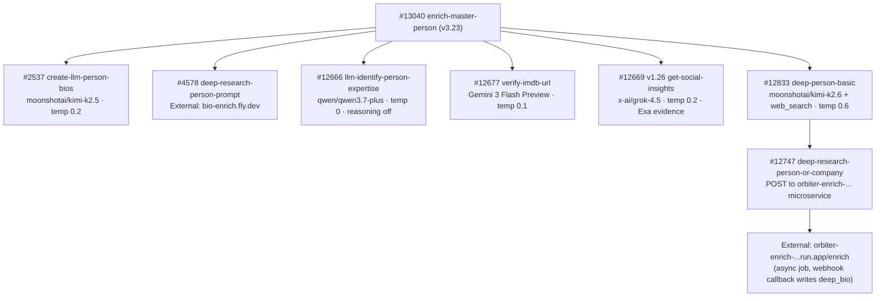

# Person Pipeline — Model Summary

Every OpenRouter model used in the person enrichment pipeline, grouped by model. Update this page when swapping models or after collecting usage data.

---

## `moonshotai/kimi-k2.5`

| Context Window | Input Cost | Output Cost |
| :-: | :-: | :-: |
| 262,144 tokens | \$0.38 / 1M input tokens | \$2.02 / 1M output tokens |

Used for biography generation with naming convention enforcement. The Crunchbase parser is documented under Gemini below.

| Function | Temp | Max Tokens | Timeout | Avg Input Tokens | Avg Output Tokens | Cost/Call | Updated |
| --- | --- | --- | --- | --- | --- | --- | --- |
| `create-llm-person-bios` #2537 (short bio 229 char) | 0.2 | 2000 | 60s | _TBD_ | _TBD_ | _TBD_ | 2026-06-30 |
| `create-llm-person-bios` #2537 (long bio 500 char) | 0.2 | 2000 | 60s | _TBD_ | _TBD_ | _TBD_ | 2026-06-30 |
---

## `google/gemini-3-flash-preview`

| Context Window | Input Cost | Output Cost |
| :-: | :-: | :-: |
| 1,048,576 tokens | \$0.50 / 1M input tokens | \$3.00 / 1M output tokens |

Used for IMDB identity disambiguation. Replaced `google/gemini-2.5-flash` (verify-imdb-url) on 2026-04-06. `llm-identify-person-expertise` #12666 used this model historically, moved to Gemini 3.1 Flash Lite on 2026-06-19, then moved to Qwen3.7 Plus on 2026-07-03.

| Function | Temp | Max Tokens | Timeout | Reasoning | Avg Input Tokens | Avg Output Tokens | Cost/Call | Updated |
| --- | --- | --- | --- | --- | --- | --- | --- | --- |
| `verify-imdb-url` #12677 | 0.1 | — | 60s | — | _TBD_ | _TBD_ | _TBD_ | 2026-04-06 |

---

## `google/gemini-3.1-flash-lite`

| Context Window | Input Cost | Output Cost |
| :-: | :-: | :-: |
| 1,048,576 tokens | \$0.25 / 1M input tokens | \$1.50 / 1M output tokens |

Used for structured name parsing and primary Crunchbase person-page parsing. `name-format` #2649 (v3.4, 2026-05-30) runs strict `json_schema` structured output with the response-healing plugin and `require_parameters: true`. `parse-cb-person` #2677 v1.3 uses bounded structured-output attempts, reasoning disabled, and a Qwen3.7 Plus fallback only after the Gemini attempt fails.

| Function | Temp | Max Tokens | Timeout | Reasoning | Avg Input Tokens | Avg Output Tokens | Cost/Call | Updated |
| --- | --- | --- | --- | --- | --- | --- | --- | --- |
| `name-format` #2649 | 0 | 500 | — | — | _TBD_ | _TBD_ | _TBD_ | 2026-05-30 |
| `parse-cb-person` #2677 (primary) | 0.1 | 4000 | 45s | disabled | _TBD_ | _TBD_ | _TBD_ | 2026-07-10 |

---

## `qwen/qwen3.7-plus`

| Context Window | Input Cost | Output Cost |
| :-: | :-: | :-: |
| 1,000,000 tokens | \$0.32 / 1M input tokens | \$1.28 / 1M output tokens |

Used for the person expertise chain and as the failure-only fallback for Crunchbase person-page parsing. `llm-identify-person-expertise` #12666 moved here on 2026-07-03 after dry-run A/B tests against Gemini 3.1 Flash Lite and GLM 5.2; its results feed `resolve-person-expertise-v2` #12926. `parse-cb-person` #2677 v1.3 retries the same extraction prompt once on Qwen only after the primary Gemini response fails guarded decoding.

| Function | Temp | Max Tokens | Timeout | Reasoning | Avg Input Tokens | Avg Output Tokens | Cost/Call | Updated |
| --- | --- | --- | --- | --- | --- | --- | --- | --- |
| `llm-identify-person-expertise` #12666 | 0 | 2500 | 40s | disabled | _TBD_ | _TBD_ | _TBD_ | 2026-07-03 |
| `resolve-person-expertise-v2` #12926 | 0.2 / 0 | — | 25s / 20s | — | _TBD_ | _TBD_ | _TBD_ | 2026-07-03 |
| `parse-cb-person` #2677 (fallback only) | 0.1 | 4000 | 45s | disabled | _TBD_ | _TBD_ | _TBD_ | 2026-07-10 |

---

## `x-ai/grok-4.5`

| Context Window | Input Cost | Output Cost |
| :-: | :-: | :-: |
| 500,000 tokens | \$2.00 / 1M input tokens | \$6.00 / 1M output tokens |

Used for evidence-backed social insights about a person. `get-social-insights` prefetches two bounded Exa evidence sets, then delegates tool-free JSON synthesis to `openrouter-grok45-social-call` #13190 v2.1. The primary Grok 4.5 attempt uses medium reasoning; one compressed low-reasoning retry is allowed after semantic validation fails. Pricing and context are from the [OpenRouter Grok 4.5 model card](https://openrouter.ai/x-ai/grok-4.5).

| Function | Temp | Max Tokens | Timeout | Reasoning | Avg Input Tokens | Avg Output Tokens | Cost/Call | Updated |
| --- | --- | --- | --- | --- | --- | --- | --- | --- |
| `get-social-insights` #12669 v1.26 → helper #13190 v2.1 (person social insights \+ audited profile URL discovery) | 0.2 | 1600 primary / 1100 retry | 90s primary / 75s retry | medium primary / low retry | _TBD_ | _TBD_ | _TBD_ | 2026-07-13 |

---

## `moonshotai/kimi-k2.6` \+ `openrouter:web_search` / `web_fetch`

| Context Window | Input Cost | Output Cost |
| :-: | :-: | :-: |
| 262,144 tokens | \$0.66 / 1M input tokens | \$3.41 / 1M output tokens |

Used for deep-research person bios via the external `orbiter-enrich-…` microservice. Kimi was retired on 2026-05-17 after external-service parse crashes, then **reinstated provider-pinned in #12833 v4** — `provider_order: ["moonshotai", "fireworks"]` with `allow_fallbacks: false` (unpinned routing was what leaked raw tool-call tokens). Live spec (v4.1, 2026-06-04): temperature 0.6, `top_p` 0.9, `max_tokens` 16,000, reasoning capped at 8,000, tools `openrouter:web_search` (native engine, 6 per call / 24 total) and `openrouter:web_fetch` (6,000 content tokens). Canonical pipeline doc: [Deep Research Bio](/guides/enrichment/waterfall/deep-research-bio).

Architecturally the LLM call is dispatched ASYNCHRONOUSLY: `#12833 deep-person-basic` calls `#12747 deep-research-person-or-company`, which POSTs the prompt \+ model to `orbiter-enrich-20506320032.us-east4.run.app/enrich`, gets back a `job_id`, registers it in `profile_enrichment_job`, and returns. The external service owns up to three bounded transient-provider retries (malformed/empty JSON, 429, 5xx, or transport errors) within a 270-second request budget, then sends one final callback for the original job. That callback writes `master_person.deep_bio` through `/api:nFBFWRKy/enrich-profile`.

| Function | Temp | Max Tokens | Timeout | Avg Input Tokens | Avg Output Tokens | Cost/Call | Updated |
| --- | --- | --- | --- | --- | --- | --- | --- |
| `deep-person-basic` #12833 (kicks off async deep-bio job) | 0.6 | 16000 | — | _TBD_ | _TBD_ | _TBD_ | 2026-06-04 |

---

## External LLM Service (not OpenRouter directly)

<Note>
  `mvp/enrich/deep-research-person-prompt` (#4578) calls `https://bio-enrich.fly.dev/enrich` — an external microservice that runs the LLM call internally. It does not call OpenRouter directly from Xano. **Separately**, `#12747 deep-research-person-or-company` calls a different external service at `https://orbiter-enrich-20506320032.us-east4.run.app/enrich` — see the Kimi K2.6 section above for details.
</Note>

---

## Pipeline Call Chain

