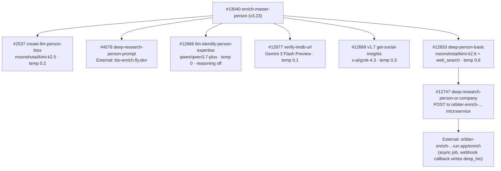

# Person Pipeline — Model Summary

Every OpenRouter model used in the person enrichment pipeline, grouped by model. Update this page when swapping models or after collecting usage data.

---

## `moonshotai/kimi-k2.5`

| Context Window | Input Cost | Output Cost |
| :-: | :-: | :-: |
| 262,144 tokens | \$0.38 / 1M input tokens | \$2.02 / 1M output tokens |

Used for biography generation with naming convention enforcement. Model changed to `moonshotai/kimi-k2.5` on 2026-05-30 (#2537 v3, provider `sort: throughput` / `allow_fallbacks: true`, backup model = same); it replaced `anthropic/claude-sonnet-4.5`, which had replaced `google/gemini-3.1-flash-lite-preview` on 2026-04-05. Reasoning is disabled on both calls. Current function version: **v4.6 (2026-06-30)** — recent-success debounce, clean optional-skip when `about_person` context is missing, investment-thesis fallback context (pairs with the #13040 v3.23 post-thesis retry), example names removed from prompts.

| Function | Temp | Max Tokens | Timeout | Avg Input Tokens | Avg Output Tokens | Cost/Call | Updated |
| --- | --- | --- | --- | --- | --- | --- | --- |
| `create-llm-person-bios` #2537 (short bio 229 char) | 0.2 | 2000 | 60s | _TBD_ | _TBD_ | _TBD_ | 2026-06-30 |
| `create-llm-person-bios` #2537 (long bio 500 char) | 0.2 | 2000 | 60s | _TBD_ | _TBD_ | _TBD_ | 2026-06-30 |

---

## `google/gemini-3-flash-preview`

| Context Window | Input Cost | Output Cost |
| :-: | :-: | :-: |
| 1,048,576 tokens | \$0.50 / 1M input tokens | \$3.00 / 1M output tokens |

Used for IMDB identity disambiguation. Replaced `google/gemini-2.5-flash` (verify-imdb-url) on 2026-04-06. `llm-identify-person-expertise` #12666 used this model historically, moved to Gemini 3.1 Flash Lite on 2026-06-19, then moved to Qwen3.7 Plus on 2026-07-03.

| Function | Temp | Max Tokens | Timeout | Reasoning | Avg Input Tokens | Avg Output Tokens | Cost/Call | Updated |
| --- | --- | --- | --- | --- | --- | --- | --- | --- |
| `verify-imdb-url` #12677 | 0.1 | — | 60s | — | _TBD_ | _TBD_ | _TBD_ | 2026-04-06 |

---

## `google/gemini-3.1-flash-lite`

| Context Window | Input Cost | Output Cost |
| :-: | :-: | :-: |
| 1,048,576 tokens | \$0.25 / 1M input tokens | \$1.50 / 1M output tokens |

Used for structured name parsing. `name-format` #2649 (v3.4, 2026-05-30) runs strict `json_schema` structured output with the response-healing plugin and `require_parameters: true`. `llm-identify-person-expertise` #12666 used this model from 2026-06-19 to 2026-07-03, then moved to Qwen3.7 Plus; Gemini embeddings still power the expertise KNN through `expert_embeddings`, but that is not an OpenRouter chat call.

| Function | Temp | Max Tokens | Timeout | Reasoning | Avg Input Tokens | Avg Output Tokens | Cost/Call | Updated |
| --- | --- | --- | --- | --- | --- | --- | --- | --- |
| `name-format` #2649 | 0 | 500 | — | — | _TBD_ | _TBD_ | _TBD_ | 2026-05-30 |

---

## `qwen/qwen3.7-plus`

| Context Window | Input Cost | Output Cost |
| :-: | :-: | :-: |
| 1,000,000 tokens | \$0.32 / 1M input tokens | \$1.28 / 1M output tokens |

Used for the person expertise chain. `llm-identify-person-expertise` #12666 moved here on 2026-07-03 after dry-run A/B tests against Gemini 3.1 Flash Lite and GLM 5.2; its v5 prompt still emits per-signal `start_year`/`end_year`, and results feed `resolve-person-expertise-v2` #12926. #12926's OpenRouter chat calls also moved here the same day: one blurb-generation call per signal, plus a second adjudication call only in the 0.15–0.25 vector-distance guard band. The person's existing `HAS_EXPERTISE` edges are cleared before rewrite; `resolve-person-expertise` #12668 is legacy, no longer in the call path.

| Function | Temp | Max Tokens | Timeout | Reasoning | Avg Input Tokens | Avg Output Tokens | Cost/Call | Updated |
| --- | --- | --- | --- | --- | --- | --- | --- | --- |
| `llm-identify-person-expertise` #12666 | 0 | 2500 | 40s | disabled | _TBD_ | _TBD_ | _TBD_ | 2026-07-03 |
| `resolve-person-expertise-v2` #12926 | 0.2 / 0 | — | 25s / 20s | — | _TBD_ | _TBD_ | _TBD_ | 2026-07-03 |

---

## `x-ai/grok-4.3`

| Context Window | Input Cost | Output Cost |
| :-: | :-: | :-: |
| 1,000,000 tokens | \$1.25 / 1M input tokens | \$2.50 / 1M output tokens |

Used for X/Twitter-grounded social media insights about a person. Grok 4.3 replaced Grok 3 on 2026-05-17 after diagnostic output showed OpenRouter returning a 404 with `"Grok 3 is deprecated. xAI recommends switching to Grok 4.3 (https://openrouter.ai/x-ai/grok-4.3)"`.

| Function | Temp | Max Tokens | Timeout | Avg Input Tokens | Avg Output Tokens | Cost/Call | Updated |
| --- | --- | --- | --- | --- | --- | --- | --- |
| `get-social-insights` #12669 v1.7 (person social insights \+ new profile URL discovery; `NO_INSIGHTS` counts as a clean empty success since v1.7) | 0.3 | — | 120s | _TBD_ | _TBD_ | _TBD_ | 2026-06-25 |

---

## `moonshotai/kimi-k2.6` \+ `openrouter:web_search` / `web_fetch`

| Context Window | Input Cost | Output Cost |
| :-: | :-: | :-: |
| 262,144 tokens | \$0.66 / 1M input tokens | \$3.41 / 1M output tokens |

Used for deep-research person bios via the external `orbiter-enrich-…` microservice. Kimi was retired on 2026-05-17 after external-service parse crashes, then **reinstated provider-pinned in #12833 v4** — `provider_order: ["moonshotai", "fireworks"]` with `allow_fallbacks: false` (unpinned routing was what leaked raw tool-call tokens). Live spec (v4.1, 2026-06-04): temperature 0.6, `top_p` 0.9, `max_tokens` 16,000, reasoning capped at 8,000, tools `openrouter:web_search` (native engine, 6 per call / 24 total) and `openrouter:web_fetch` (6,000 content tokens). Canonical pipeline doc: [Deep Research Bio](/guides/enrichment/waterfall/deep-research-bio).

Architecturally the LLM call is dispatched ASYNCHRONOUSLY: `#12833 deep-person-basic` calls `#12747 deep-research-person-or-company`, which POSTs the prompt \+ model to `orbiter-enrich-20506320032.us-east4.run.app/enrich`, gets back a `job_id`, registers it in `profile_enrichment_job`, and returns. The external service runs the LLM call and webhooks the result back to `/api:nFBFWRKy/enrich-profile` which writes `master_person.deep_bio`.

| Function | Temp | Max Tokens | Timeout | Avg Input Tokens | Avg Output Tokens | Cost/Call | Updated |
| --- | --- | --- | --- | --- | --- | --- | --- |
| `deep-person-basic` #12833 (kicks off async deep-bio job) | 0.6 | 16000 | — | _TBD_ | _TBD_ | _TBD_ | 2026-06-04 |

---

## External LLM Service (not OpenRouter directly)

<Note>
  `mvp/enrich/deep-research-person-prompt` (#4578) calls `https://bio-enrich.fly.dev/enrich` — an external microservice that runs the LLM call internally. It does not call OpenRouter directly from Xano. **Separately**, `#12747 deep-research-person-or-company` calls a different external service at `https://orbiter-enrich-20506320032.us-east4.run.app/enrich` — see the Kimi K2.6 section above for details.
</Note>

---

## Pipeline Call Chain

