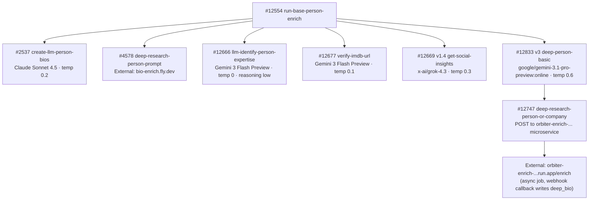

# Person Pipeline — Model Summary

Every OpenRouter model used in the person enrichment pipeline, grouped by model. Update this page when swapping models or after collecting usage data.

---

## `anthropic/claude-sonnet-4.5`

| Context Window | Input Cost | Output Cost |
|:---:|:---:|:---:|
| 1,000,000 tokens | $3.00 / 1M input tokens | $15.00 / 1M output tokens |

Used for biography generation with naming convention enforcement. Replaced `google/gemini-3.1-flash-lite-preview` on 2026-04-05.

| Function | Temp | Max Tokens | Timeout | Avg Input Tokens | Avg Output Tokens | Cost/Call | Updated |
|----------|------|------------|---------|-----------------|------------------|-----------|---------|
| `create-llm-person-bios` #2537 (short bio 229 char) | 0.2 | — | 30s | _TBD_ | _TBD_ | _TBD_ | 2026-04-06 |
| `create-llm-person-bios` #2537 (long bio 500 char) | 0.2 | — | 30s | _TBD_ | _TBD_ | _TBD_ | 2026-04-06 |

---

## `google/gemini-3-flash-preview`

| Context Window | Input Cost | Output Cost |
|:---:|:---:|:---:|
| 1,048,576 tokens | $0.50 / 1M input tokens | $3.00 / 1M output tokens |

Used for expertise signal extraction and IMDB identity disambiguation. Replaced `anthropic/claude-sonnet-4` (expertise) on 2026-04-05 and `google/gemini-2.5-flash` (verify-imdb-url) on 2026-04-06.

| Function | Temp | Max Tokens | Timeout | Reasoning | Avg Input Tokens | Avg Output Tokens | Cost/Call | Updated |
|----------|------|------------|---------|-----------|-----------------|------------------|-----------|---------|
| `llm-identify-person-expertise` #12666 | 0 | — | 30s | effort: low | _TBD_ | _TBD_ | _TBD_ | 2026-04-05 |
| `verify-imdb-url` #12677 | 0.1 | — | 60s | — | _TBD_ | _TBD_ | _TBD_ | 2026-04-06 |

---

## `x-ai/grok-4.3`

| Context Window | Input Cost | Output Cost |
|:---:|:---:|:---:|
| 256,000 tokens | $5.00 / 1M input tokens | $15.00 / 1M output tokens |

Used for X/Twitter-grounded social media insights about a person. Grok 4.3 replaced Grok 3 on 2026-05-17 after diagnostic output showed OpenRouter returning a 404 with `"Grok 3 is deprecated. xAI recommends switching to Grok 4.3 (https://openrouter.ai/x-ai/grok-4.3)"`.

| Function | Temp | Max Tokens | Timeout | Avg Input Tokens | Avg Output Tokens | Cost/Call | Updated |
|----------|------|------------|---------|-----------------|------------------|-----------|---------|
| `get-social-insights` #12669 v1.4 (person social insights + new profile URL discovery) | 0.3 | — | 120s | _TBD_ | _TBD_ | _TBD_ | 2026-05-17 |

---

## `google/gemini-3.1-pro-preview:online`

| Context Window | Input Cost | Output Cost |
|:---:|:---:|:---:|
| 1,048,576 tokens | $1.25 / 1M input tokens | $5.00 / 1M output tokens |

Used for deep-research person bios via the external `orbiter-enrich-…` microservice. `:online` adds OpenRouter web search grounding. Replaced `moonshotai/kimi-k2.6:online` on 2026-05-17 after Kimi was repeatedly crashing the external service with Python parse errors (`object of type 'NoneType' has no len()`, JSON `Expecting value` errors).

Architecturally the LLM call is dispatched ASYNCHRONOUSLY: `#12833 deep-person-basic` calls `#12747 deep-research-person-or-company`, which POSTs the prompt + model to `orbiter-enrich-20506320032.us-east4.run.app/enrich`, gets back a `job_id`, registers it in `profile_enrichment_job`, and returns. The external service runs the LLM call and webhooks the result back to `/api:nFBFWRKy/enrich-profile` which writes `master_person.deep_bio`.

| Function | Temp | Max Tokens | Timeout | Avg Input Tokens | Avg Output Tokens | Cost/Call | Updated |
|----------|------|------------|---------|-----------------|------------------|-----------|---------|
| `deep-person-basic` #12833 v3 (kicks off async deep-bio job) | 0.6 | 16000 | — | _TBD_ | _TBD_ | _TBD_ | 2026-05-17 |

---

## External LLM Service (not OpenRouter directly)

<Note>
`mvp/enrich/deep-research-person-prompt` (#4578) calls `https://bio-enrich.fly.dev/enrich` — an external microservice that runs the LLM call internally. It does not call OpenRouter directly from Xano. **Separately**, `#12747 deep-research-person-or-company` calls a different external service at `https://orbiter-enrich-20506320032.us-east4.run.app/enrich` — see the Pro Preview section above for details.
</Note>

---

## Pipeline Call Chain

