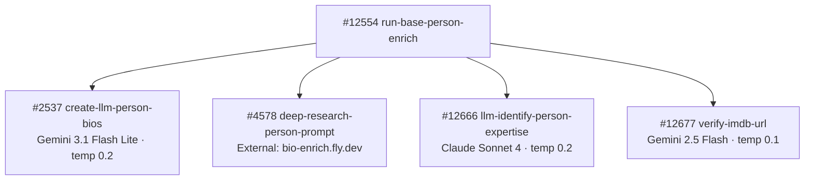

# Person Pipeline — Model Summary

Every OpenRouter model used in the person enrichment pipeline, grouped by model. Update this page when swapping models or after collecting usage data.

---

## `google/gemini-3.1-flash-lite-preview`

| Context Window | Input Cost | Output Cost |
|:---:|:---:|:---:|
| 1,048,576 tokens | $0.25 / 1M input tokens | $1.50 / 1M output tokens |

Primary model for biography generation (`$env.LLM_MODEL_JSON_PARSE`). Falls back to `moonshotai/kimi-k2-0905` ($0.40 in / $2.00 out) when the primary returns no choices.

| Function | Temp | Max Tokens | Timeout | Avg Input Tokens | Avg Output Tokens | Cost/Call | Updated |
|----------|------|------------|---------|-----------------|------------------|-----------|---------|
| `create-llm-person-bios` #2537 (short bio 229 char) | 0.2 | — | 30s | _TBD_ | _TBD_ | _TBD_ | 2026-04-01 |
| `create-llm-person-bios` #2537 (long bio 500 char) | 0.2 | — | 30s | _TBD_ | _TBD_ | _TBD_ | 2026-04-01 |

---

## `anthropic/claude-sonnet-4`

| Context Window | Input Cost | Output Cost |
|:---:|:---:|:---:|
| 200,000 tokens | $3.00 / 1M input tokens | $15.00 / 1M output tokens |

Used for expertise identification requiring nuanced reasoning about career trajectories and domain specialization.

| Function | Temp | Max Tokens | Timeout | Avg Input Tokens | Avg Output Tokens | Cost/Call | Updated |
|----------|------|------------|---------|-----------------|------------------|-----------|---------|
| `llm-identify-person-expertise` #12666 | 0.2 | — | 30s | _TBD_ | _TBD_ | _TBD_ | 2026-04-03 |

---

## `google/gemini-2.5-flash`

| Context Window | Input Cost | Output Cost |
|:---:|:---:|:---:|
| 1,048,576 tokens | $0.30 / 1M input tokens | $2.50 / 1M output tokens |

Used for fast identity disambiguation against IMDB search results.

| Function | Temp | Max Tokens | Timeout | Avg Input Tokens | Avg Output Tokens | Cost/Call | Updated |
|----------|------|------------|---------|-----------------|------------------|-----------|---------|
| `verify-imdb-url` #12677 | 0.1 | — | 60s | _TBD_ | _TBD_ | _TBD_ | 2026-03-02 |

---

## External LLM Service (not OpenRouter)

<Note>
`mvp/enrich/deep-research-person-prompt` (#4578) calls `https://bio-enrich.fly.dev/enrich` — an external microservice that runs the LLM call internally. It does not call OpenRouter directly from Xano.
</Note>

---

## Pipeline Call Chain

