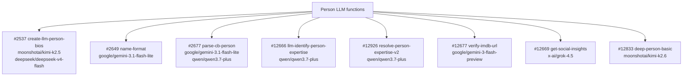

# Person Pipeline — Model Summary

<Note>
Live Xano model IDs and request settings were synchronized on **July 28, 2026** from workspace 3, branch `v1`, using read-only access. Xano is the ground truth. Deleted functions are omitted.
</Note>

## `deepseek/deepseek-v4-flash`

| Context Window | Input Cost | Output Cost |
| :-: | :-: | :-: |
| 1,000,000 tokens | \$0.09 / 1M input tokens | \$0.18 / 1M output tokens |

Pricing verified 2026-07-28. [Source](https://openrouter.ai/deepseek/deepseek-v4-flash).

| Function | Model role | Temp | Max Tokens | Timeout | Xano Updated |
| --- | --- | --- | --- | --- | --- |
| `create-llm-person-bios` #2537 | repair fallback | 0.2 / 0.1 | 2000 | 60 | 2026-07-25 |

---

## `google/gemini-3-flash-preview`

| Context Window | Input Cost | Output Cost |
| :-: | :-: | :-: |
| 1,000,000 tokens | \$0.50 / 1M input tokens | \$3.00 / 1M output tokens |

Pricing verified 2026-07-28. [Source](https://openrouter.ai/google/gemini-3-flash-preview/providers).

| Function | Model role | Temp | Max Tokens | Timeout | Xano Updated |
| --- | --- | --- | --- | --- | --- |
| `verify-imdb-url` #12677 | direct | 0.1 | — | 60 | 2026-07-08 |

---

## `google/gemini-3.1-flash-lite`

| Context Window | Input Cost | Output Cost |
| :-: | :-: | :-: |
| 1,000,000 tokens | \$0.25 / 1M input tokens | \$1.50 / 1M output tokens |

Pricing verified 2026-07-28. [Source](https://openrouter.ai/google/gemini-3.1-flash-lite/pricing).

| Function | Model role | Temp | Max Tokens | Timeout | Xano Updated |
| --- | --- | --- | --- | --- | --- |
| `name-format` #2649 | direct | 0 | 500 | 30 | 2026-07-08 |
| `parse-cb-person` #2677 | primary parser | 0.1 | 4000 | 45 | 2026-07-27 |

---

## `moonshotai/kimi-k2.5`

| Context Window | Input Cost | Output Cost |
| :-: | :-: | :-: |
| 262,144 tokens | \$0.375 / 1M input tokens | \$2.025 / 1M output tokens |

Pricing verified 2026-07-28. [Source](https://openrouter.ai/moonshotai/kimi-k2.5).

| Function | Model role | Temp | Max Tokens | Timeout | Xano Updated |
| --- | --- | --- | --- | --- | --- |
| `create-llm-person-bios` #2537 | primary biography writer | 0.2 / 0.1 | 2000 | 60 | 2026-07-25 |

---

## `moonshotai/kimi-k2.6`

| Context Window | Input Cost | Output Cost |
| :-: | :-: | :-: |
| 262,144 tokens | \$0.60 / 1M input tokens | \$3.41 / 1M output tokens |

Pricing verified 2026-07-28. [Source](https://openrouter.ai/moonshotai/kimi-k2.6).

| Function | Model role | Temp | Max Tokens | Timeout | Xano Updated |
| --- | --- | --- | --- | --- | --- |
| `deep-person-basic` #12833 | delegated async research job | 0.3 | 16000 | async external job | 2026-07-28 |

---

## `qwen/qwen3.7-plus`

| Context Window | Input Cost | Output Cost |
| :-: | :-: | :-: |
| 1,000,000 tokens | \$0.32 / 1M input tokens | \$1.28 / 1M output tokens |

Pricing verified 2026-07-28. [Source](https://openrouter.ai/qwen/qwen3.7-plus).

| Function | Model role | Temp | Max Tokens | Timeout | Xano Updated |
| --- | --- | --- | --- | --- | --- |
| `parse-cb-person` #2677 | failure-only fallback | 0.1 | 4000 | 45 | 2026-07-27 |
| `llm-identify-person-expertise` #12666 | direct | 0 | 2500 | 40 | 2026-07-27 |
| `resolve-person-expertise-v2` #12926 | direct | 0 | 2500 | 60 | 2026-07-27 |

---

## `x-ai/grok-4.5`

| Context Window | Input Cost | Output Cost |
| :-: | :-: | :-: |
| 500,000 tokens | \$2.00 / 1M input tokens | \$6.00 / 1M output tokens |

Pricing verified 2026-07-28. [Source](https://openrouter.ai/x-ai/grok-4.5).

| Function | Model role | Temp | Max Tokens | Timeout | Xano Updated |
| --- | --- | --- | --- | --- | --- |
| `get-social-insights` #12669 → helper #13190 | delegates model call to #13190 | 0.2 | 1600 / 1100 | 90 / 75 | 2026-07-11 |

---

## Function Map

```mermaid
graph TD
    ROOT["Person LLM functions"]
    ROOT --> F2537["#2537 create-llm-person-bios<br/>moonshotai/kimi-k2.5<br/>deepseek/deepseek-v4-flash"]
    ROOT --> F2649["#2649 name-format<br/>google/gemini-3.1-flash-lite"]
    ROOT --> F2677["#2677 parse-cb-person<br/>google/gemini-3.1-flash-lite<br/>qwen/qwen3.7-plus"]
    ROOT --> F12666["#12666 llm-identify-person-expertise<br/>qwen/qwen3.7-plus"]
    ROOT --> F12926["#12926 resolve-person-expertise-v2<br/>qwen/qwen3.7-plus"]
    ROOT --> F12677["#12677 verify-imdb-url<br/>google/gemini-3-flash-preview"]
    ROOT --> F12669["#12669 get-social-insights<br/>x-ai/grok-4.5"]
    ROOT --> F12833["#12833 deep-person-basic<br/>moonshotai/kimi-k2.6"]
```
