The enrichment waterfall is the sequence of functions that fires when a new entity enters the system. It starts with a single input (a domain, a LinkedIn URL, a name) and cascades outward — creating records, enriching from external APIs, discovering related entities, and queueing them for their own enrichment.

This page documents both the **company waterfall** and the **person waterfall**, using Resend (`resend.com`) and its founder Zeno Rocha as running examples.

---

## Core Concepts

### Cascade Depth

Every entity in the system has a **cascade depth** — the number of hops from the original seed entity.

| Depth | Meaning | Behavior |
|:-----:|---------|----------|
| **0** | Seed entity (the one the user asked for) | Enriched immediately, all APIs called |
| **1** | Direct discovery (e.g. a founder's current employer) | Queued, external APIs skipped in `get-add` |
| **2** | Secondary discovery (e.g. an investor found on a depth-1 company) | Queued, lower priority |
| **3+** | Tertiary and beyond | Queued, lowest priority |

When `cascade_depth > 0`, the `get-add` functions skip external API calls (PDL, Enrich Layer) entirely. The entity is created from whatever data is already available (Fundable, input params) and queued for later enrichment.

### Priority Tiers

Queue entries are ranked by business importance:

| Tier | Description | Examples |
|:----:|-------------|----------|
| **1** | Current employer, founders | The company a person works at now |
| **2** | Past employers, VC firms | Previous jobs, investment firms |
| **3** | Schools, angel investors | Educational institutions, individual investors |
| **4** | Everything else | Certification issuers, volunteer orgs, publishers |

When a queue entry already exists and a new reference arrives with a better (lower) tier, the tier is upgraded. The `count` field tracks how many times the entity was referenced.

### Queue Tables

```text
queue_enrich_company — #583
```

| Field | Type | Description |
|-------|------|-------------|
| `master_company_id` | int | FK to `master_company` |
| `processing` | bool | Lock flag for the queue worker |
| `count` | int | How many times this entity was queued (default 1) |
| `cascade_depth` | int | Hops from seed entity |
| `priority_tier` | int | 1-4, lower = more important |
| `source_function` | text | Which function queued it (e.g. `resolve-investors-edges`) |
| `source_entity_id` | int | The `master_person_id` or `master_company_id` that spawned this |

```text
queue_enrich_person — #582
```

Same schema with `master_person_id` instead of `master_company_id`, plus a `deep_research` boolean flag.

---

## Company Waterfall

The company waterfall begins when any function calls `mvp/get-add/master-company`. Here's the full flow, using **resend.com** as the example input.

### Entry Point

```text
mvp/get-add/master-company — #12558
```

Called with:
```json
{
  "domain": "resend.com",
  "profile_url": "https://www.linkedin.com/company/resend",
  "company_name": "Resend",
  "cascade_depth": 0,
  "priority_tier": 1
}
```

### Phase 1: Input Cleanup (Sections 2a-2d)

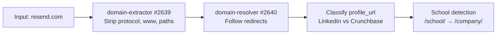

The raw input is normalized:
- **Domain extraction**: `https://www.resend.com/pricing` becomes `resend.com`
- **Redirect resolution**: If `resend.com` redirected from an old domain, both are tracked (`$varDomain` + `$varOriginalDomain`)
- **Profile classification**: LinkedIn URLs are stored in `$varLinkedInUrl`, Crunchbase in `$varCrunchbaseUrl`
- **School detection**: LinkedIn `/school/` URLs are flagged and rewritten to `/company/`

### Phase 2: Dedup Cascade (Sections 3 → 5 → 7 → 8)

Before creating anything, the function runs a **four-layer dedup check** to find existing records:

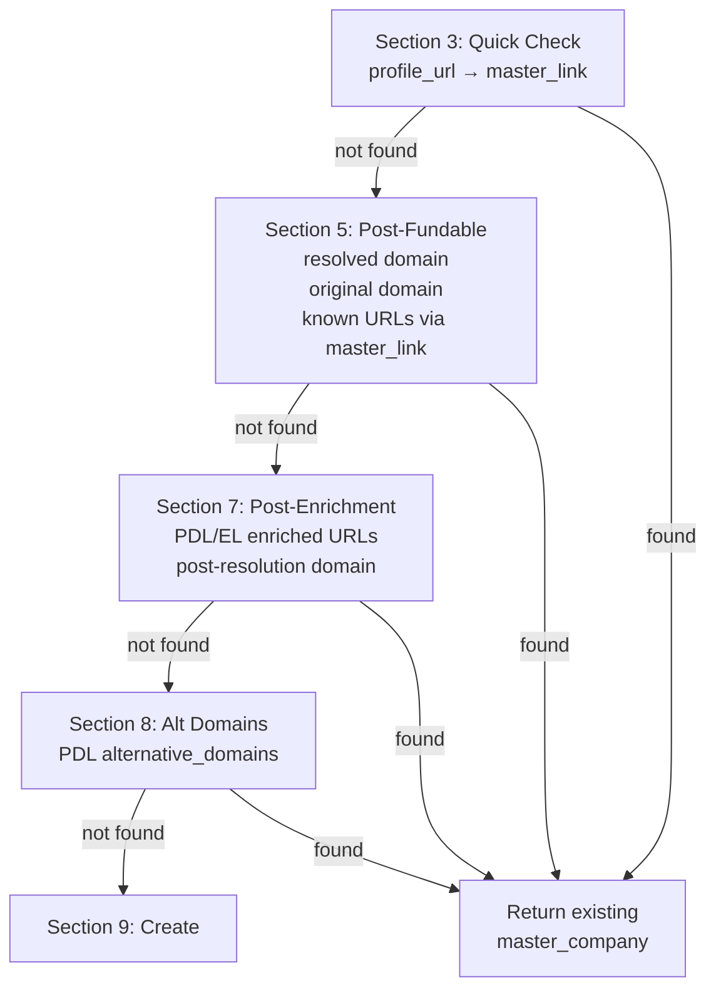

Each check queries `master_company` by domain or `master_link` by URL. If a match is found at any layer, the existing company is returned immediately — no new record is created.

For `resend.com`, assuming it's the first time:
1. **Section 3**: No `master_link` for `linkedin.com/company/resend` yet
2. **Section 5**: No `master_company` with `company_domain = resend.com` yet
3. **Section 7**: PDL/EL enriched URLs checked — still nothing
4. **Section 8**: PDL `alternative_domains` checked — still nothing
5. Falls through to **Section 9: Create**

### Phase 3: External API Enrichment (Sections 4, 6)

Between dedup layers, external APIs are called to gather data:

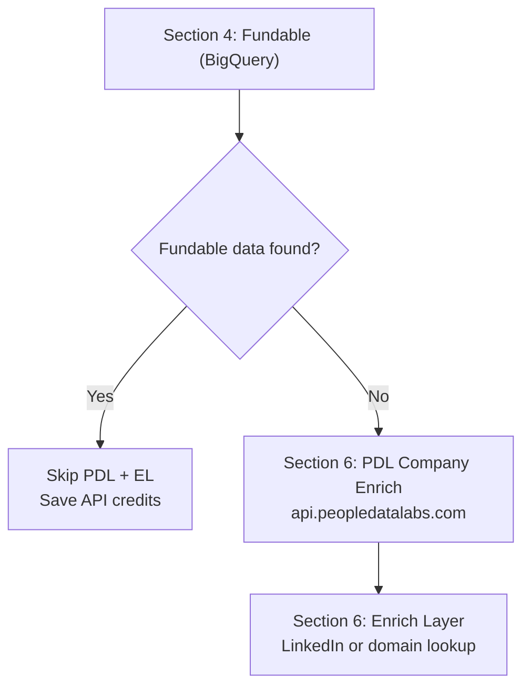

**Fundable** (Section 4) always runs first — it's our own BigQuery dataset, zero external API cost. If Fundable returns data for `resend.com`, PDL and Enrich Layer are skipped entirely (v1.7 optimization).

**When `cascade_depth > 0`**: Both PDL and Enrich Layer are skipped regardless. The entity is created from Fundable data + input params only.

For `resend.com` at depth 0 with no Fundable match:

| API | Endpoint | Data Retrieved |
|-----|----------|----------------|
| **Fundable** | BigQuery | domain, company name, LinkedIn, Crunchbase, Pitchbook, funding rounds, founded date |
| **PDL** | `/v5/company/enrich?website=resend.com` | display_name, profiles, alternative_domains, industry, size, website |
| **Enrich Layer** | `company-linkedin` or `company-domain` | name, industry, categories, specialties, description, HQ address, banner image |

### Phase 4: Record Creation (Section 9)

With all enrichment data gathered and no existing match found:

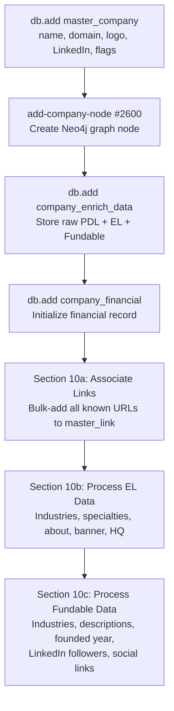

For `resend.com`, this creates:
- **master_company** record with `company_name: "Resend"`, `company_domain: "resend.com"`, logo from logo.dev
- **Company node** in the Neo4j graph
- **company_enrich_data** storing raw API responses
- **master_link** entries for LinkedIn, Crunchbase, Pitchbook, domain, PDL profiles
- **Industries and specialties** from EL + Fundable
- **About/descriptions** from EL tagline, description + Fundable short/long/crunchbase descriptions
- **HQ address** from both EL and Fundable
- **LinkedIn follower count** from Fundable

### Phase 5: Enrichment Dispatch (Section 11)

The final routing decision depends on cascade depth and queue flag:

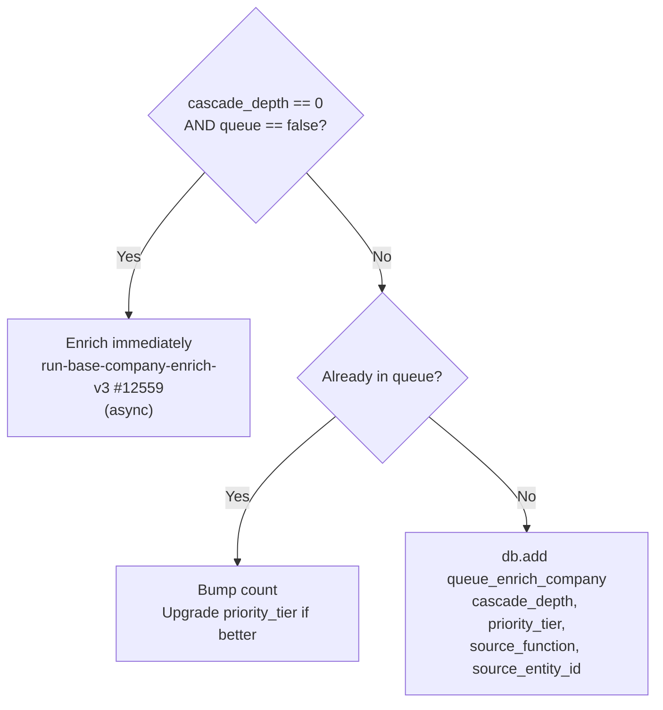

For `resend.com` at depth 0: **immediate enrichment** fires asynchronously. This triggers the full company enrichment pipeline (LLM bios, social scraping, website analysis, etc.).

For a depth-1 company discovered during person enrichment: **queued** with the source function and priority tier recorded.

### Phase 6: Name Correction (Section 12)

A final pass checks if PDL returned a `display_name` that differs from the current `company_name`. If so, the canonical PDL name wins. This catches cases where the input name was informal or incomplete.

---

## Enrichment Queue Processing

Queued entities are processed by cron jobs that pull from the queue tables in priority order.

### Queue Upsert Pattern

When a company is queued multiple times (e.g. discovered as an employer by two different people), the system uses an **upsert** pattern:

1. Check if `queue_enrich_company` already has an entry for this `master_company_id`
2. If **yes**: increment `count`, upgrade `priority_tier` to the better (lower) value
3. If **no**: insert new queue entry with all metadata

This means a company discovered once as a tier-4 publisher and again as a tier-1 current employer will be upgraded to tier 1 — it gets enriched sooner because someone important works there.

### Queue Entry Lifecycle

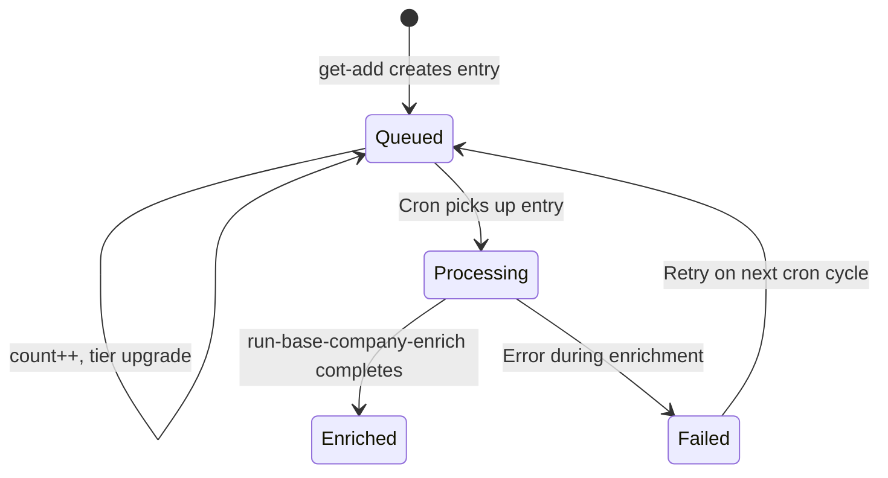

---

## Cascade Example: resend.com at Depth 0

Here's what happens end-to-end when `resend.com` enters as a seed entity:

```
Depth 0: resend.com
├── get-add/master-company (immediate enrichment)
│   └── run-base-company-enrich-v3 (async)
│       ├── LLM bios, social scraping, website analysis
│       └── Discovers people (founders, executives)
│           ├── get-add/master-person (cascade_depth: 1)
│           │   └── Queued to queue_enrich_person (tier 1)
│           │       └── When processed:
│           │           ├── resolve-edges-work discovers employers
│           │           │   └── get-add/master-company (cascade_depth: 2)
│           │           │       └── Queued to queue_enrich_company (tier 2)
│           │           └── resolve-investors-edges discovers VCs
│           │               └── get-add/master-company (cascade_depth: 2)
│           │                   └── Queued to queue_enrich_company (tier 2)
│           └── Discovers investors
│               └── get-add/master-person (cascade_depth: 1)
│                   └── Queued to queue_enrich_person (tier 3)
```

Each hop increments `cascade_depth`. External APIs are only called at depth 0 during the `get-add` phase. Deeper entities rely on Fundable data and input params, then get fully enriched when the queue processes them.

---

## Kill Switch

```text
mvp/stop/check-kill-switch-company
```

A safety valve that can be toggled to halt all new entity creation. When active:

- **Existing companies**: Still returned via local-only lookup (domain + URLs)
- **New companies**: Blocked entirely — no API calls, no records created
- **Logged**: Every blocked entity is recorded in `log_crash` with the input data for later processing

The kill switch runs in **Section 3b**, before any external API calls. This ensures zero API spend when the switch is on.

---

## Person Waterfall

The person waterfall begins when any function calls `mvp/get-add/master-person`. Here's the full flow, using **Zeno Rocha** (founder of Resend) as the example — entered with just a LinkedIn URL.

### Entry Point

```text
mvp/get-add/master-person — #12553
```

Called with:
```json
{
  "links": ["https://www.linkedin.com/in/zeno-rocha-6270a914"],
  "cascade_depth": 0,
  "priority_tier": 1
}
```

At depth 0, first_name and last_name are typically empty — the pipeline discovers the name from external APIs and parses it via LLM.

### Phase 1: Name Parsing from Input (Section 1)

If a `full_name` is provided (common at depth > 0 when the name comes from Fundable data), the function immediately calls the name-format LLM to split it:

```text
mvp/format/name-format — #2649
```

This LLM-powered function (Groq Llama 3.3, Gemini 2.5 Pro fallback) parses a full name into structured fields:

```json
{
  "full_name": "Zeno Rocha",
  "first_name": "Zeno",
  "middle_name": null,
  "last_name": "Rocha",
  "suffix": null,
  "nickname": null
}
```

The result is saved as `$inputNameFormat` for later use as a fallback.

### Phase 2: Dedup Cascade (Sections 3 → 5 → 7)

Before creating anything, the function checks for existing records:

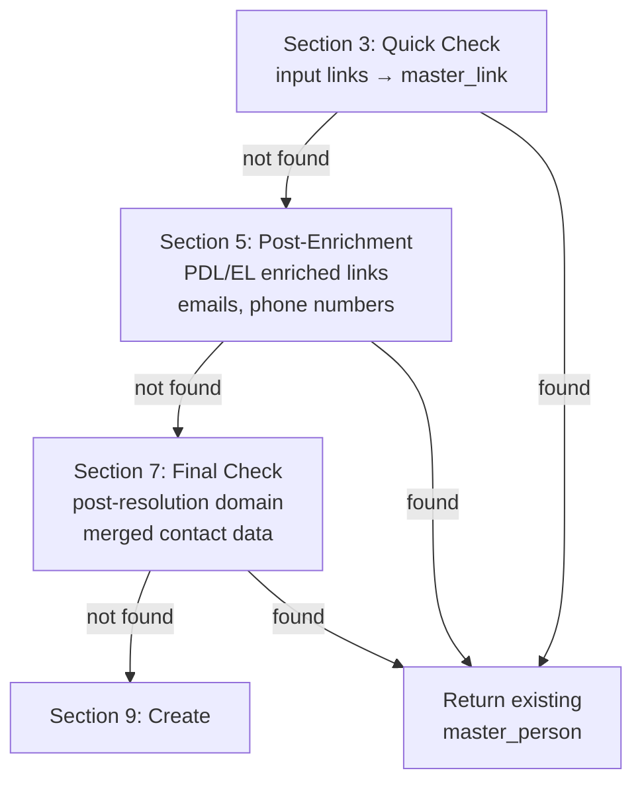

For Zeno Rocha on first entry — no existing `master_link` for his LinkedIn URL, so all checks pass through to create.

### Phase 3: External API Enrichment (Sections 4, 6)

When `cascade_depth == 0`, both external APIs are called:

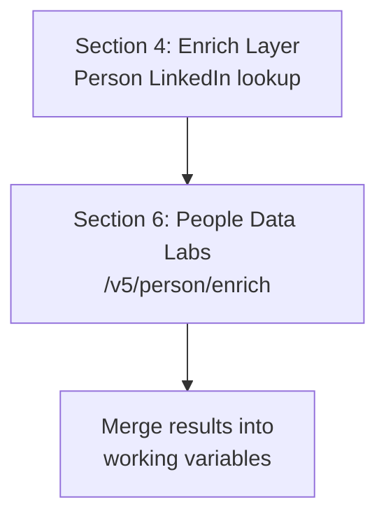

**When `cascade_depth > 0`**: Both PDL and Enrich Layer are **skipped entirely**. The person is created from whatever data was passed in (name, links, company) and queued for later enrichment.

| API | Endpoint | Data Retrieved |
|-----|----------|----------------|
| **Enrich Layer** | Person LinkedIn lookup | Full name, avatar, headline, current company, location |
| **PDL** | `/v5/person/enrich` | Full name, emails, phones, profiles, work history, education |

For Zeno at depth 0, PDL returns his full profile — name, work history at Resend and Liferay, education at UNIRIO and PUCPR, social profiles, and contact info.

### Phase 4: Name Resolution

After enrichment, the function resolves the best name using a multi-source fallback chain:

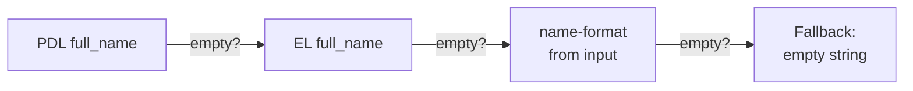

The resolved name is then parsed through a **lambda** (`$parsedName`) that extracts `_fn`, `_ln`, `_mn`, `_suffix`, `_nick` — using non-colliding key names to avoid a Xano naming collision where `first_name`/`last_name` as data keys would resolve to the function's empty input parameters instead of the expression values.

### Phase 5: Record Creation (Section 9)

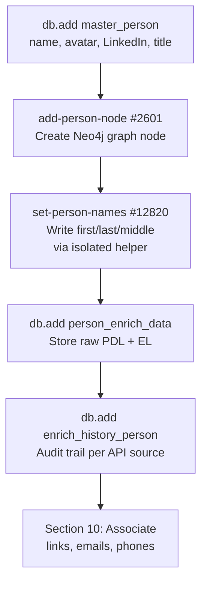

The `set-person-names` helper function (v2.9) writes name fields in an isolated scope — its inputs are named `fn`, `ln`, `mn` instead of `first_name`, `last_name`, which avoids Xano's naming collision bug. Without this helper, db.edit silently writes empty strings because the data keys collide with the parent function's input parameter names.

For Zeno Rocha, this creates:
- **master_person** with `name: "Zeno Rocha"`, `first_name: "Zeno"`, `last_name: "Rocha"`, avatar, LinkedIn URL
- **Person node** in Neo4j graph
- **person_enrich_data** storing raw PDL + EL responses
- **master_link** entries for all known profile URLs
- **master_email** and **master_phone** entries from PDL

### Phase 6: Enrichment Dispatch (Section 11)

Same routing logic as the company waterfall:

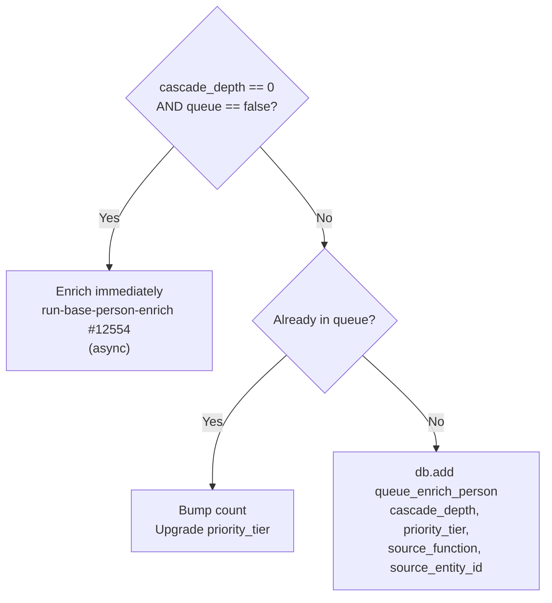

For Zeno at depth 0: **immediate enrichment** fires asynchronously.

---

## Person Enrichment Phases

```text
mvp/enrich/run-base-person-enrich — #12554
```

The person enrichment pipeline runs in 11 phases. Each phase passes independently — failures are logged but don't block later phases. Here's how it played out for Zeno Rocha:

| Phase | Function | What It Does | Zeno's Result |
|:-----:|----------|-------------|---------------|
| **1** | PDL person enrich | Fetch/refresh PDL data | PDL profile loaded |
| **2** | EL person enrich | Fetch/refresh Enrich Layer data | EL profile loaded |
| **3** | resolve-edges-work | Discover employers from work history | **Resend** created (depth 0, immediate enrichment) |
| **4** | resolve-edges-skills | Extract skills from profile | Skills extracted |
| **5** | resolve-edges-certifications | Extract certifications | Certifications extracted |
| **6** | resolve-edges-education | Discover schools from education history | **YC, Berkeley, UNIRIO, PUCPR** queued (depth 1, tier 3) |
| **7** | resolve-investors-edges | Discover investors from Fundable | **SV Angel** + 7 angel investors queued |
| **8** | Social scraping | Twitter/X profile analysis | Social insights generated |
| **9** | LLM bios | Generate bio and bio_500 | LLM-written bios |
| **10** | resolve-edges-projects | Discover projects and publications | **Turbo Excel, yfdpco2.com** queued (depth 1, tier 4) |
| **11** | complete-person-enrich | Flip visibility, mark complete | `visibility: true` |

### Phase 3 Detail: Resend Discovery

When phase 3 (resolve-edges-work) processes Zeno's work history, it finds **Resend** as his current employer. Because Zeno is depth 0, Resend is created at **depth 0** with **immediate enrichment** — this triggers the full company waterfall documented above, including:

- Fundable lookup (finds Resend's Fundable org ID)
- PDL + EL **skipped** (Fundable data exists — v1.7 optimization)
- Company node, enrich data, industries, about, links all created
- `run-base-company-enrich-v3` fires async — discovers Resend's institutional investors (Polar, Accel, Charm, Fuel Capital, Gradient, Cavalry Ventures) and queues them

### Phase 7 Detail: Investor Discovery

Phase 7 (resolve-investors-edges) queries Fundable for Resend's investors and creates person records for each:

| Investor | Source | Queue Tier | Why |
|----------|--------|:----------:|-----|
| Bu Kinoshita | process-yc-people (co-founder) | **1** | YC co-founder gets highest priority |
| Diana Hu | process-yc-people (YC partner) | **2** | YC partner, high value |
| Guillermo Rauch | resolve-investors-edges | **3** | Angel investor |
| Dylan Field | resolve-investors-edges | **3** | Angel investor |
| Paul Copplestone | resolve-investors-edges | **3** | Angel investor |
| Alana Goyal | resolve-investors-edges | **3** | Angel investor |
| Calvin French-Owen | resolve-investors-edges | **3** | Angel investor |
| Lachy Groom | resolve-investors-edges | **3** | Angel investor |
| Elad Gil | resolve-investors-edges | **3** | Angel investor |

All 9 investors are created at **depth 1** with external APIs skipped — their names and LinkedIn URLs come from Fundable data. Each is queued to `queue_enrich_person` for full enrichment later.

---

## Cascade Example: Zeno Rocha at Depth 0

Here's the complete cascade from the sandbox run — one LinkedIn URL generated **10 people** and **19 companies**:

```
Depth 0: Zeno Rocha (linkedin.com/in/zeno-rocha-6270a914)
├── get-add/master-person → person #1 (immediate enrichment)
│   └── run-base-person-enrich (11 phases)
│
│       Phase 3: resolve-edges-work
│       ├── Resend (company #1) → depth 0, immediate enrichment
│       │   └── run-base-company-enrich-v3
│       │       └── resolve-investors-edges (institutional)
│       │           ├── Polar (#14) → queued depth 0, tier 4
│       │           ├── Accel (#15) → queued depth 0, tier 4
│       │           ├── Charm (#16) → queued depth 0, tier 4
│       │           ├── Fuel Capital (#17) → queued depth 0, tier 4
│       │           ├── Gradient (#18) → queued depth 0, tier 4
│       │           └── Cavalry Ventures (#19) → queued depth 0, tier 4
│       ├── WorkOS (#7) → queued depth 1, tier 2
│       ├── Liferay (#8) → queued depth 1, tier 2
│       ├── Globo (#9) → queued depth 1, tier 2
│       ├── Petrobras (#10) → queued depth 1, tier 2
│       └── Caos (#11) → queued depth 1, tier 2
│
│       Phase 6: resolve-edges-education
│       ├── Y Combinator (#2) → queued depth 1, tier 3
│       ├── UC Berkeley (#3) → queued depth 1, tier 3
│       ├── UNIRIO (#4) → queued depth 1, tier 3
│       └── PUCPR (#5) → queued depth 1, tier 3
│
│       Phase 7: resolve-investors-edges (angel)
│       ├── Bu Kinoshita (person #2) → queued depth 1, tier 1
│       ├── Diana Hu (person #3) → queued depth 1, tier 2
│       ├── Guillermo Rauch (#4) → queued depth 1, tier 3
│       ├── Dylan Field (#5) → queued depth 1, tier 3
│       ├── Paul Copplestone (#6) → queued depth 1, tier 3
│       ├── Alana Goyal (#7) → queued depth 1, tier 3
│       ├── Calvin French-Owen (#8) → queued depth 1, tier 3
│       ├── Lachy Groom (#9) → queued depth 1, tier 3
│       └── Elad Gil (#10) → queued depth 1, tier 3
│
│       Phase 10: resolve-edges-projects-publications
│       ├── Turbo Excel (#12) → queued depth 1, tier 4
│       └── yfdpco2.com (#13) → queued depth 1, tier 4
```

### Final Queue State

After Zeno's enrichment completes, the queues contain:

**queue_enrich_person** (9 entries):

| Person | Tier | Source | Depth |
|--------|:----:|--------|:-----:|
| Bu Kinoshita | **1** | process-yc-people | 1 |
| Diana Hu | **2** | process-yc-people | 1 |
| Guillermo Rauch | **3** | resolve-investors-edges | 1 |
| Dylan Field | **3** | resolve-investors-edges | 1 |
| Paul Copplestone | **3** | resolve-investors-edges | 1 |
| Alana Goyal | **3** | resolve-investors-edges | 1 |
| Calvin French-Owen | **3** | resolve-investors-edges | 1 |
| Lachy Groom | **3** | resolve-investors-edges | 1 |
| Elad Gil | **3** | resolve-investors-edges | 1 |

**queue_enrich_company** (18 entries):

| Company | Tier | Source | Depth |
|---------|:----:|--------|:-----:|
| SV Angel | **2** | resolve-investors-edges | 1 |
| WorkOS | **2** | resolve-edges-work | 1 |
| Liferay | **2** | resolve-edges-work | 1 |
| Globo | **2** | resolve-edges-work | 1 |
| Petrobras | **2** | resolve-edges-work | 1 |
| Caos | **2** | resolve-edges-work | 1 |
| Y Combinator | **3** | resolve-edges-education | 1 |
| UC Berkeley | **3** | resolve-edges-education | 1 |
| UNIRIO | **3** | resolve-edges-education | 1 |
| PUCPR | **3** | resolve-edges-education | 1 |
| Polar | **4** | _(from Resend's enrichment)_ | 0 |
| Accel | **4** | _(from Resend's enrichment)_ | 0 |
| Charm | **4** | _(from Resend's enrichment)_ | 0 |
| Fuel Capital | **4** | _(from Resend's enrichment)_ | 0 |
| Gradient | **4** | _(from Resend's enrichment)_ | 0 |
| Cavalry Ventures | **4** | _(from Resend's enrichment)_ | 0 |
| Turbo Excel | **4** | resolve-edges-projects | 1 |
| yfdpco2.com | **4** | resolve-edges-projects | 1 |

When the queue worker processes these in priority order, each entity will trigger its own enrichment — potentially discovering more entities and queueing them at depth 2, continuing the cascade.
