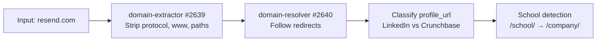
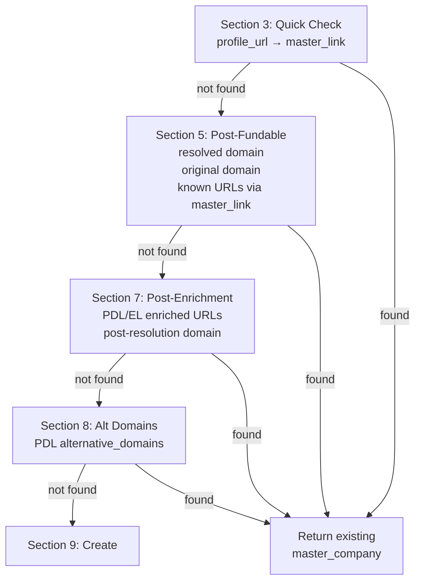
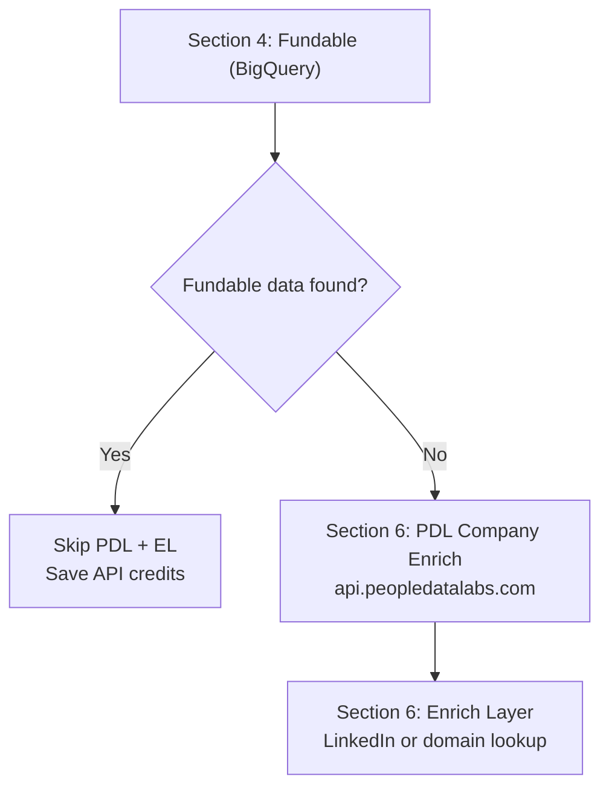
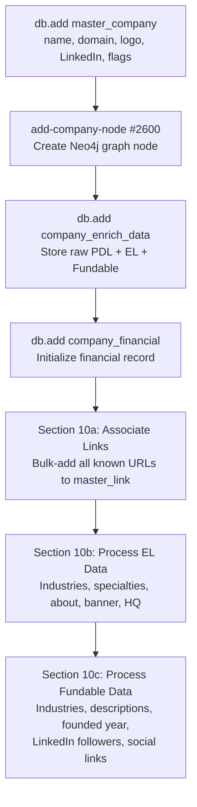
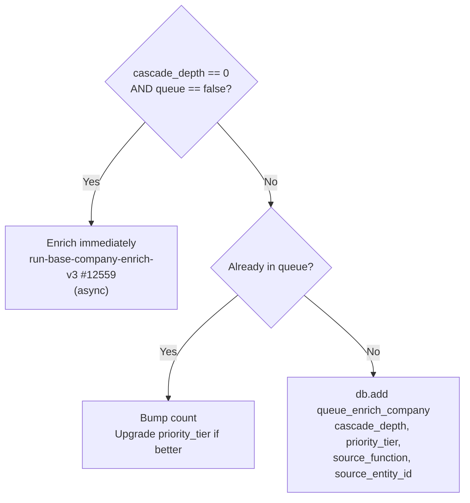
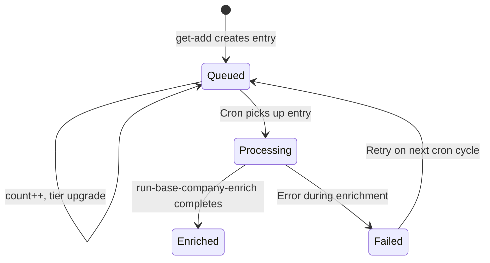

The enrichment waterfall is the sequence of functions that fires when a new entity enters the system. It starts with a single input (a domain, a LinkedIn URL, a name) and cascades outward — creating records, enriching from external APIs, discovering related entities, and queueing them for their own enrichment.

This page documents the **company waterfall** first. The person waterfall will be added in a future session.

---

## Core Concepts

### Cascade Depth

Every entity in the system has a **cascade depth** — the number of hops from the original seed entity.

| Depth | Meaning | Behavior |
|:-----:|---------|----------|
| **0** | Seed entity (the one the user asked for) | Enriched immediately, all APIs called |
| **1** | Direct discovery (e.g. a founder's current employer) | Queued, external APIs skipped in `get-add` |
| **2** | Secondary discovery (e.g. an investor found on a depth-1 company) | Queued, lower priority |
| **3+** | Tertiary and beyond | Queued, lowest priority |

When `cascade_depth > 0`, the `get-add` functions skip external API calls (PDL, Enrich Layer) entirely. The entity is created from whatever data is already available (Fundable, input params) and queued for later enrichment.

### Priority Tiers

Queue entries are ranked by business importance:

| Tier | Description | Examples |
|:----:|-------------|----------|
| **1** | Current employer, founders | The company a person works at now |
| **2** | Past employers, VC firms | Previous jobs, investment firms |
| **3** | Schools, angel investors | Educational institutions, individual investors |
| **4** | Everything else | Certification issuers, volunteer orgs, publishers |

When a queue entry already exists and a new reference arrives with a better (lower) tier, the tier is upgraded. The `count` field tracks how many times the entity was referenced.

### Queue Tables

```text
queue_enrich_company — #583
```

| Field | Type | Description |
|-------|------|-------------|
| `master_company_id` | int | FK to `master_company` |
| `processing` | bool | Lock flag for the queue worker |
| `count` | int | How many times this entity was queued (default 1) |
| `cascade_depth` | int | Hops from seed entity |
| `priority_tier` | int | 1-4, lower = more important |
| `source_function` | text | Which function queued it (e.g. `resolve-investors-edges`) |
| `source_entity_id` | int | The `master_person_id` or `master_company_id` that spawned this |

```text
queue_enrich_person — #582
```

Same schema with `master_person_id` instead of `master_company_id`, plus a `deep_research` boolean flag.

---

## Company Waterfall

The company waterfall begins when any function calls `mvp/get-add/master-company`. Here's the full flow, using **resend.com** as the example input.

### Entry Point

```text
mvp/get-add/master-company — #12558
```

Called with:
```json
{
  "domain": "resend.com",
  "profile_url": "https://www.linkedin.com/company/resend",
  "company_name": "Resend",
  "cascade_depth": 0,
  "priority_tier": 1
}
```

### Phase 1: Input Cleanup (Sections 2a-2d)



The raw input is normalized:
- **Domain extraction**: `https://www.resend.com/pricing` becomes `resend.com`
- **Redirect resolution**: If `resend.com` redirected from an old domain, both are tracked (`$varDomain` + `$varOriginalDomain`)
- **Profile classification**: LinkedIn URLs are stored in `$varLinkedInUrl`, Crunchbase in `$varCrunchbaseUrl`
- **School detection**: LinkedIn `/school/` URLs are flagged and rewritten to `/company/`

### Phase 2: Dedup Cascade (Sections 3 → 5 → 7 → 8)

Before creating anything, the function runs a **four-layer dedup check** to find existing records:



Each check queries `master_company` by domain or `master_link` by URL. If a match is found at any layer, the existing company is returned immediately — no new record is created.

For `resend.com`, assuming it's the first time:
1. **Section 3**: No `master_link` for `linkedin.com/company/resend` yet
2. **Section 5**: No `master_company` with `company_domain = resend.com` yet
3. **Section 7**: PDL/EL enriched URLs checked — still nothing
4. **Section 8**: PDL `alternative_domains` checked — still nothing
5. Falls through to **Section 9: Create**

### Phase 3: External API Enrichment (Sections 4, 6)

Between dedup layers, external APIs are called to gather data:



**Fundable** (Section 4) always runs first — it's our own BigQuery dataset, zero external API cost. If Fundable returns data for `resend.com`, PDL and Enrich Layer are skipped entirely (v1.7 optimization).

**When `cascade_depth > 0`**: Both PDL and Enrich Layer are skipped regardless. The entity is created from Fundable data + input params only.

For `resend.com` at depth 0 with no Fundable match:

| API | Endpoint | Data Retrieved |
|-----|----------|----------------|
| **Fundable** | BigQuery | domain, company name, LinkedIn, Crunchbase, Pitchbook, funding rounds, founded date |
| **PDL** | `/v5/company/enrich?website=resend.com` | display_name, profiles, alternative_domains, industry, size, website |
| **Enrich Layer** | `company-linkedin` or `company-domain` | name, industry, categories, specialties, description, HQ address, banner image |

### Phase 4: Record Creation (Section 9)

With all enrichment data gathered and no existing match found:



For `resend.com`, this creates:
- **master_company** record with `company_name: "Resend"`, `company_domain: "resend.com"`, logo from logo.dev
- **Company node** in the Neo4j graph
- **company_enrich_data** storing raw API responses
- **master_link** entries for LinkedIn, Crunchbase, Pitchbook, domain, PDL profiles
- **Industries and specialties** from EL + Fundable
- **About/descriptions** from EL tagline, description + Fundable short/long/crunchbase descriptions
- **HQ address** from both EL and Fundable
- **LinkedIn follower count** from Fundable

### Phase 5: Enrichment Dispatch (Section 11)

The final routing decision depends on cascade depth and queue flag:



For `resend.com` at depth 0: **immediate enrichment** fires asynchronously. This triggers the full company enrichment pipeline (LLM bios, social scraping, website analysis, etc.).

For a depth-1 company discovered during person enrichment: **queued** with the source function and priority tier recorded.

### Phase 6: Name Correction (Section 12)

A final pass checks if PDL returned a `display_name` that differs from the current `company_name`. If so, the canonical PDL name wins. This catches cases where the input name was informal or incomplete.

---

## Enrichment Queue Processing

Queued entities are processed by cron jobs that pull from the queue tables in priority order.

### Queue Upsert Pattern

When a company is queued multiple times (e.g. discovered as an employer by two different people), the system uses an **upsert** pattern:

1. Check if `queue_enrich_company` already has an entry for this `master_company_id`
2. If **yes**: increment `count`, upgrade `priority_tier` to the better (lower) value
3. If **no**: insert new queue entry with all metadata

This means a company discovered once as a tier-4 publisher and again as a tier-1 current employer will be upgraded to tier 1 — it gets enriched sooner because someone important works there.

### Queue Entry Lifecycle



---

## Cascade Example: resend.com at Depth 0

Here's what happens end-to-end when `resend.com` enters as a seed entity:

```
Depth 0: resend.com
├── get-add/master-company (immediate enrichment)
│   └── run-base-company-enrich-v3 (async)
│       ├── LLM bios, social scraping, website analysis
│       └── Discovers people (founders, executives)
│           ├── get-add/master-person (cascade_depth: 1)
│           │   └── Queued to queue_enrich_person (tier 1)
│           │       └── When processed:
│           │           ├── resolve-edges-work discovers employers
│           │           │   └── get-add/master-company (cascade_depth: 2)
│           │           │       └── Queued to queue_enrich_company (tier 2)
│           │           └── resolve-investors-edges discovers VCs
│           │               └── get-add/master-company (cascade_depth: 2)
│           │                   └── Queued to queue_enrich_company (tier 2)
│           └── Discovers investors
│               └── get-add/master-person (cascade_depth: 1)
│                   └── Queued to queue_enrich_person (tier 3)
```

Each hop increments `cascade_depth`. External APIs are only called at depth 0 during the `get-add` phase. Deeper entities rely on Fundable data and input params, then get fully enriched when the queue processes them.

---

## Kill Switch

```text
mvp/stop/check-kill-switch-company
```

A safety valve that can be toggled to halt all new entity creation. When active:

- **Existing companies**: Still returned via local-only lookup (domain + URLs)
- **New companies**: Blocked entirely — no API calls, no records created
- **Logged**: Every blocked entity is recorded in `log_crash` with the input data for later processing

The kill switch runs in **Section 3b**, before any external API calls. This ensures zero API spend when the switch is on.

---

<Note>
**Coming next**: The person waterfall (`get-add/master-person` → `run-base-person-enrich`) will be documented in a follow-up session, including the name-format LLM pipeline and the `set-person-names` helper that bypasses the Xano naming collision.
</Note>
