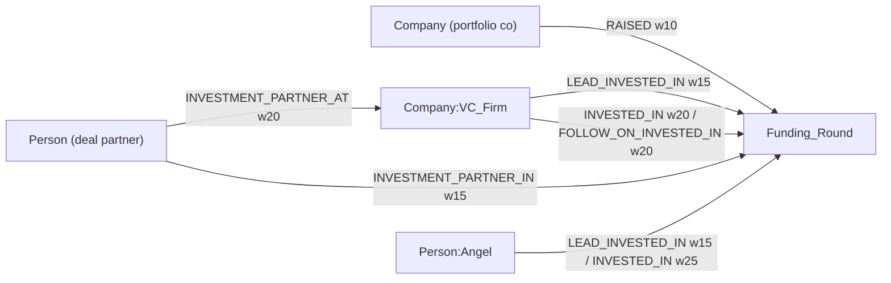

The Company Enrichment Waterfall uses the canonical graph edge definitions in [Ontology → Edge Types](/guides/ontology/edges). Write-side Cypher lives on [Cyphers → Company Pipeline](/guides/cyphers/company-pipeline) and [Cyphers → Funding](/guides/cyphers/funding); canonical weights are on [Edge Weights](/guides/ontology/edge-weights) (**lower = stronger**; hub-node edges sit Weak or below; never sub-1 — the same shared scale as the [IMDB](/guides/enrichment/waterfall/imdb-edges) and [music](/guides/enrichment/waterfall/music-edges) edges).

This page is the **pipeline-scoped catalog**: which edges this pipeline emits, at what weight, from which writer — including a per-edge **live status**, because one whole edge family was unreachable from the live pipeline between 2026-06-23 and the 2026-07-02 repair (see the [investor edge set](#investor-edge-set-12702)). Edge patterns, properties, and examples should be edited only in the ontology source of truth. Writer internals live on [Company Functions](/guides/enrichment/waterfall/company-functions); node MERGE keys on [Company Nodes](/guides/enrichment/waterfall/company-nodes).

<Note>
  Ground truth: [Edge Types](/guides/ontology/edges) \+ [Edge Weights](/guides/ontology/edge-weights). Live status reflects the extraction audit of workspace 3 branch `v1`, verified 2026-07-02.
</Note>

## Expertise edges

### SPECIALIZES\_IN

`(Entity:Company)-[:SPECIALIZES_IN]->(Entity)` — the target is normally a `SubDomainExpertise` node, but the KNN runs over the `Entity`-label `expert_embeddings` index, so a `DomainExpertise` node can also be matched. Written by `resolve-company-specialties` (#12746, step 12 of orchestrator #12992) at **every** depth, rebuilt destructively per run (`MATCH (c)-[r:SPECIALIZES_IN]->() DELETE r` before the loop).

Two weight rules — the score is a vector **distance** (lower = closer):

- **Matched** to an existing node: `weight = min(round(10 + match_score × 160), 50)` — 10 at distance 0, capped at 50 near the 0.25 create threshold. The older `× 80` formula still cited elsewhere is superseded for this edge (the person-side `HAS_EXPERTISE` formula is unchanged at × 80).
- **Created** node (specialty minted a new `SubDomainExpertise`): fixed `weight = 10` (2026-06-19 fix — a freshly minted node perfectly represents the domain, so the edge is strongest).

ON MATCH within a run, colliding specialties pipe-concatenate `r.specialty` and keep the **lower** weight/`match_score`. The edge carries no `uuid` and no `created_at` — it is keyed on the `(company_uuid, expertise_uuid)` endpoint pair, which is why the [description writer](#edge-descriptions) keys on the same pair (like the IMDB trio, unlike music's `e.uuid` keying).

### HAS\_SUBDOMAIN

`(Entity:DomainExpertise)-[:HAS_SUBDOMAIN]->(Entity:SubDomainExpertise)` · weight **100** — a **deliberate hub-damping value, not closeness**: taxonomy edges must never shorten a path between two people on the lower-is-stronger scale. Written by `attach-subdomain-parent` (#13142) from #12746's create branch after each verified node CREATE, with the parent picked by the #13141 LLM resolver (never auto-creates a domain; throws after 3 failed attempts since v1.3). A NONE verdict flags the node `parent_unresolved` instead. #12746 v1.8 then dual-writes the relational FK (`sub_domain_expertise.domain_expertise_id`) via an exact-name lookup. Detail \+ backfill history: [Cyphers → Expertise](/guides/cyphers/expertise); weight rationale: [Edge Weights → Weight audit](/guides/ontology/edge-weights#weight-audit--applied-adjustments).

Re-runs are MERGE-idempotent per `(domain, sub)` pair — but a later run with a different resolver verdict can add a second parent edge without removing the first (dedup is per-pair, not per-child).

## Funding edges

### RAISED

`(Company)-[:RAISED]->(Funding_Round)` · weight **10**. Written by `add-fundable-deal-node` (#12701) from the per-deal cascade (#12856), after the `Funding_Round` node MERGE (node key = the Fundable deal id — see [Company Nodes](/guides/enrichment/waterfall/company-nodes)). Edge `created_at` coalesces to the deal's **announced date** (epoch millis at UTC midnight) when present, else write time; `uuid` is deterministic (`<companyNodeUuid>-<dealId>`). Silently skipped when the raising company has no graph node yet. Cypher: [Cyphers → Funding](/guides/cyphers/funding). The investor-side edges below fire from the same cascade — live again since the 2026-07-02 repair.

### Investor edge set (#12702)

<Note>
  **Repaired — v1.12 (2026-07-02, sandbox-verified).** `resolve-investors-edges` (#12702) and its caller `cascade-deal-participants` (#12856 v1.6) now read `cascade_depth` as a **nullable input via `first_notnull`** — an explicit seed `0` survives, the seed gate is satisfiable, and every edge in this section (plus the co-investor / partner / angel queueing beside it) fires from seed deals; an omitted depth still fails closed to 1. A 2026-07-02 sandbox run of a synthetic seed deal produced `Funding_Round` \+ `RAISED` w10 \+ `LEAD_INVESTED_IN` w15 \+ `INVESTED_IN` w20, the `queue_enrich_company` / `queue_enrich_person` upserts (count-increment, no duplicate rows), zero SKIP rows, and idempotent MERGEs on re-run. **Historical window:** from v1.11 (2026-06-23) until the fix, a `first_notempty` depth coercion made #12702 self-skip on every invocation — deals processed in that window materialized `Funding_Round` \+ `RAISED` only and have `processed_at` stamped; re-cascading them requires nulling `fundable_deals.processed_at` (open backfill candidate).
</Note>

For each institutional investment on the deal, #12702 adds the `VC_Firm` label to the investor's Company node and MERGEs one of:

- `(Company:VC_Firm)-[:LEAD_INVESTED_IN]->(Funding_Round)` · weight **15** · `is_lead_investor: true` — lead detection is the Fundable `lead_investor` column, no inference.
- `(Company:VC_Firm)-[:INVESTED_IN]->(Funding_Round)` · weight **20** — non-lead with no earlier round detected.
- `(Company:VC_Firm)-[:FOLLOW_ON_INVESTED_IN]->(Funding_Round)` · weight **20** — non-lead where an `OPTIONAL MATCH` finds an earlier round the same firm backed (lexicographic `announced_date` compare on ISO strings; strict `<` so re-runs don't self-count).

Each institutional investment's deal partners get a pair from one Cypher: `(Person)-[:INVESTMENT_PARTNER_IN]->(Funding_Round)` · weight **15**, and `(Person)-[:INVESTMENT_PARTNER_AT]->(Company:VC_Firm)` · weight **20** (partners get no `Angel` label since v1.10). Angels (phase 2) get the `Angel` label plus `LEAD_INVESTED_IN` · weight **15** or `INVESTED_IN` · weight **25** — note the angel `INVESTED_IN` is 25 vs institutional 20, and angels get no follow-on detection. All edges MERGE on the (source, type, target) triple with `created_at` coalesced and deterministic uuids (`<srcUuid>-<frUuid>`, partner-at: `
-<vc>-deal_partner`). Full Cypher: [Cyphers → Funding](/guides/cyphers/funding).

The pre-drift docs omitted `FOLLOW_ON_INVESTED_IN` and `INVESTMENT_PARTNER_AT` from this set entirely. Type-flip hazard: a lead/non-lead change or a later `INVESTED_IN → FOLLOW_ON_INVESTED_IN` reclassification MERGEs a second edge of the new type without deleting the old one.

**Xano artifact — do not reimplement.** #12701/#12702 splice names and descriptions into Twig-templated Cypher with no single-quote escaping (an apostrophe in an org name crashes the item). Parameterize queries in a port.

## Work-history edges (Exa path)

Written by the shared `mvp/edges/create-work-edges` (#2800), invoked synchronously from orchestrator #12992's Step-7 Exa C-suite loop **after** `master-person-from-exa` (#12997) returns — the loop body, not the helper, owns `work_experience` rows and edge creation. #2800 collapses work experience, classifies titles, and MERGEs per company:

- `(Person)-[:WORKS_AT]->(Company)` · weight = `seniority_rank`, **\+20 when past** (no current role) — the 5–40 range documented in [Edge Weights → WORKS\_AT buckets](/guides/ontology/edge-weights#works_at-weight-buckets). **There is no `HAS_WORKED_AT` edge** — the old company doc named one; past roles live on `WORKS_AT` at the \+20 buckets.
- Title-classified alternatives: `FOUNDED` · weight **5**, `BOARD_MEMBER_OF` · weight **8**, `ADVISOR_TO` · weight **12**, `INVESTED_IN` `(Person)→(Company)` · weight **15**, `MEMBER_OF` · weight **20**.

Every edge stamps `r.uuid = coalesce(r.uuid, randomUUID())`, `created_at` coalesce, `valid_from`/`valid_to`. `write_descriptions` is omitted by this caller (defaults true via `first_notnull`), so the [work-edge description trios](#edge-descriptions) run inline on this path.

## YC founding & mentorship edges

Written by `process-yc-people` (#12700), the seed-only tail of phase 3 (#12799).

### FOUNDED / WAS\_FOUNDED

- **Multi-founder companies** use a hub pattern, idempotent by delete-then-CREATE each run: `(Person)-[:FOUNDED]->(cf:Entity:contextFounded)` · weight **5** per founder, plus `(cf)-[:WAS_FOUNDED]->(Company)` · weight **0**. The `contextFounded` hub node carries an LLM founding narrative \+ embedding — if the narrative or embedding call fails, **no founding edges are written that run**.
- **Single founder**: direct `MERGE (Person)-[:FOUNDED]->(Company)` · weight **5** (description "founded" vs the hub's "co-founded").

`WAS_FOUNDED` is still written live by #12700 but is flagged for purge in the [§3.6 weight audit](/guides/ontology/edge-weights#weight-audit--applied-adjustments) (`tool/backfill-purge-was-founded` #13064).

### MENTOR

`(Person YC partner)-[:MENTOR]->(Person founder)` · weight **14** · `source: 'inferred'`, `domain: 'accelerator'`. MERGEd per founder when the YC partner resolved, in both founder-count branches.

**As-built (flagged):** the MERGE key includes the edge props `company_uuid` **and** `valid_from`, and `valid_from` derives from `master_company.founded ?? 1970` — if `founded` changes between runs, a **duplicate MENTOR edge is minted** under the new `valid_from` and the old one is never swept (MENTOR edges are excluded from the founding-hub delete pass).

## Location edges

Written by the shared `location-nodes-edges-company` (#4528), driven by `add-company-locations` (#1924, orchestrator step 14) draining unprocessed `master_address` rows. Exactly one of four Cypher variants fires per address, keyed on which of city/region resolved:

- `(Company)-[:LOCATED_IN]->(City or Region/State)` · weight **70**; direct `(Company)-[:LOCATED_IN]->(Country)` (no city/region) · weight **80**. `LOCATED_IN` is the only variant that stamps `valid_from` (`Y-m` of write time).
- `(City)-[:IN_REGION]->(Region/State)` · weight **25**.
- `(Region or City)-[:IN_COUNTRY]->(Country)` · weight **50** (description has a United-States/plural-name CASE).

All MATCH endpoints by `uuid` first — if any endpoint uuid is missing (company without `node_uuid`, stale relational location row) the whole variant **no-ops silently**, and #1924 still flips `path_triples_added: true`, so that address is never retried into the graph. Weights per the [§3.6 audit](/guides/ontology/edge-weights#weight-audit--applied-adjustments) (`LOCATED_IN` was 10/50 pre-audit); Cypher: [Cyphers → Company Pipeline](/guides/cyphers/company-pipeline).

## SAME\_AS

None — this pipeline writes no identity bridges. (Contrast with the [music pipeline](/guides/enrichment/waterfall/music-edges#identity-bridges), where `SAME_AS` at weight 1 bridges `Music_Label→Company` and `Music_Artist→master_person`.)

## Edge descriptions

**SPECIALIZES\_IN** gets LLM descriptions via `write-company-specialty-description-to-graph` (#13144) → `create-company-specialty-description-from-graph` (#13143), called synchronously after **every** edge MERGE in both branches of #12746. Model `deepseek/deepseek-v4-flash` (reasoning off), keyed on the `(company_uuid, expertise_uuid)` pair with skip marker `e.description_generated_at`. **GOOD-or-null envelope**: a null/empty generation writes neither description nor marker (edge stays retry-eligible); an OpenRouter out-of-credits classification **throws** and propagates through #12746, aborting the specialty run mid-loop. Prompt \+ model config are cross-linked, never duplicated: [LLM system prompts](/guides/enrichment/company-pipeline/llm-system-prompts) · [model summary](/guides/enrichment/company-pipeline/model-summary) · [all models](/guides/enrichment/all-models-summary).

Two flags on this path: **(1)** #12746's destructive edge clear wipes every marker each resolve run, so descriptions regenerate (fresh LLM spend) on every run — the marker's practical effect is within-run dedup when specialties collapse onto one edge; **(2)** #13144's header claims a company-side backfill drain, but **no company-side backfill function exists** in workspace 3 (the person-side analog #13021 does) — edges written outside a resolve run have no catch-up mechanism.

**Work-history edges** use the shared person-pipeline trios, called inline by #2800: #13003 → #13008 for `WORKS_AT`, and #13009 → #13010 for `BOARD_MEMBER_OF` / `ADVISOR_TO` / `INVESTED_IN` / `MEMBER_OF` — each try_catch-wrapped so a failed LLM call never blocks the edge. Coverage detail: [Edge audit → description coverage](/guides/robert-mark/edge-audit); model migration: [Refactor Edge Descriptions](/guides/robert-mark/refactor-edge-descriptions).

**Everything else** — `RAISED`, the investor set, `FOUNDED`/`WAS_FOUNDED`/`MENTOR`, and the location edges — carries **inline templated description strings** written in the edge Cypher itself (e.g. `"<VC> led the <Co> <TYPE> funding round."`), not LLM output.

**Xano artifact — do not reimplement.** #13143/#13144 build their Cypher inside `api.lambda` with `JSON.stringify` quoting to dodge the XanoScript serializer and quote-injection — in a port, parameterize the query. #13143 also invokes the LLM even when the edge MATCH returns zero rows (an omission, not a contract) — a port should short-circuit to null.

## Summary — company edges at a glance

| Edge | Pattern | Weight | Writer(s) | Live status |
| --- | --- | :-: | --- | --- |
| `SPECIALIZES_IN` | `(Company)→(SubDomainExpertise / DomainExpertise)` | 10–50 formula / 10 fixed (created) | #12746 | ✅ Live |
| `HAS_SUBDOMAIN` | `(DomainExpertise)→(SubDomainExpertise)` | 100 | #13142 via #12746 | ✅ Live |
| `RAISED` | `(Company)→(Funding_Round)` | 10 | #12701 via #12856 | ✅ Live |
| `LEAD_INVESTED_IN` | `(Company:VC_Firm / Person:Angel)→(Funding_Round)` | 15 | #12702 | ✅ Live (repaired v1.12, 2026-07-02) |
| `INVESTED_IN` (institutional) | `(Company:VC_Firm)→(Funding_Round)` | 20 | #12702 | ✅ Live (repaired v1.12, 2026-07-02) |
| `INVESTED_IN` (angel) | `(Person:Angel)→(Funding_Round)` | 25 | #12702 | ✅ Live (repaired v1.12, 2026-07-02) |
| `FOLLOW_ON_INVESTED_IN` | `(Company:VC_Firm)→(Funding_Round)` | 20 | #12702 | ✅ Live (repaired v1.12, 2026-07-02) |
| `INVESTMENT_PARTNER_IN` | `(Person)→(Funding_Round)` | 15 | #12702 | ✅ Live (repaired v1.12, 2026-07-02) |
| `INVESTMENT_PARTNER_AT` | `(Person)→(Company:VC_Firm)` | 20 | #12702 | ✅ Live (repaired v1.12, 2026-07-02) |
| `WORKS_AT` | `(Person)→(Company)` | 5–40 (rank \+20 past) | #2800 | ✅ Live |
| `FOUNDED` | `(Person)→(Company / contextFounded)` | 5 | #2800 / #12700 | ✅ Live |
| `WAS_FOUNDED` | `(contextFounded)→(Company)` | 0 | #12700 | ✅ Live (§3.6 flags for purge) |
| `BOARD_MEMBER_OF` | `(Person)→(Company)` | 8 | #2800 | ✅ Live |
| `ADVISOR_TO` | `(Person)→(Company)` | 12 | #2800 | ✅ Live |
| `INVESTED_IN` (work-derived) | `(Person)→(Company)` | 15 | #2800 | ✅ Live |
| `MEMBER_OF` | `(Person)→(Company)` | 20 | #2800 | ✅ Live |
| `MENTOR` | `(Person)→(Person)` | 14 | #12700 | ✅ Live (dup risk on `valid_from`) |
| `LOCATED_IN` | `(Company)→(City/Region)` · `→(Country)` | 70 / 80 | #4528 via #1924 | ✅ Live |
| `IN_REGION` | `(City)→(Region/State)` | 25 | #4528 | ✅ Live |
| `IN_COUNTRY` | `(Region/City)→(Country)` | 50 | #4528 | ✅ Live |
| `SAME_AS` | — | — | — | Not emitted by this pipeline |

<Note>
  **§3.6 edge-weight audit (2026-05-31)** re-set several of this pipeline's write values: `LEAD_INVESTED_IN` 30 → **15**, `FOLLOW_ON_INVESTED_IN` 25 → **20**, `LOCATED_IN` 10/50 → **70/80**, `HAS_SUBDOMAIN` `null` → **100**. Fix-forward is live in all creators; existing rows are reweighted by `tool/backfill-edge-weights` (#13063). Before→after detail: [Edge Weights → Weight audit](/guides/ontology/edge-weights#weight-audit--applied-adjustments).
</Note>
