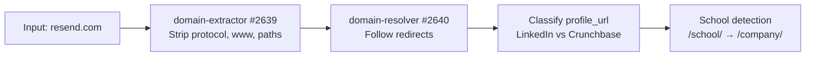
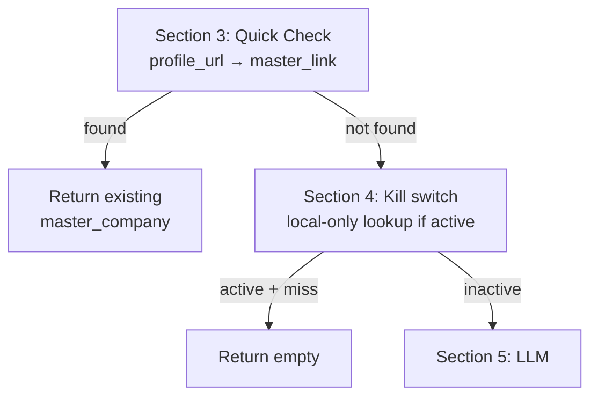
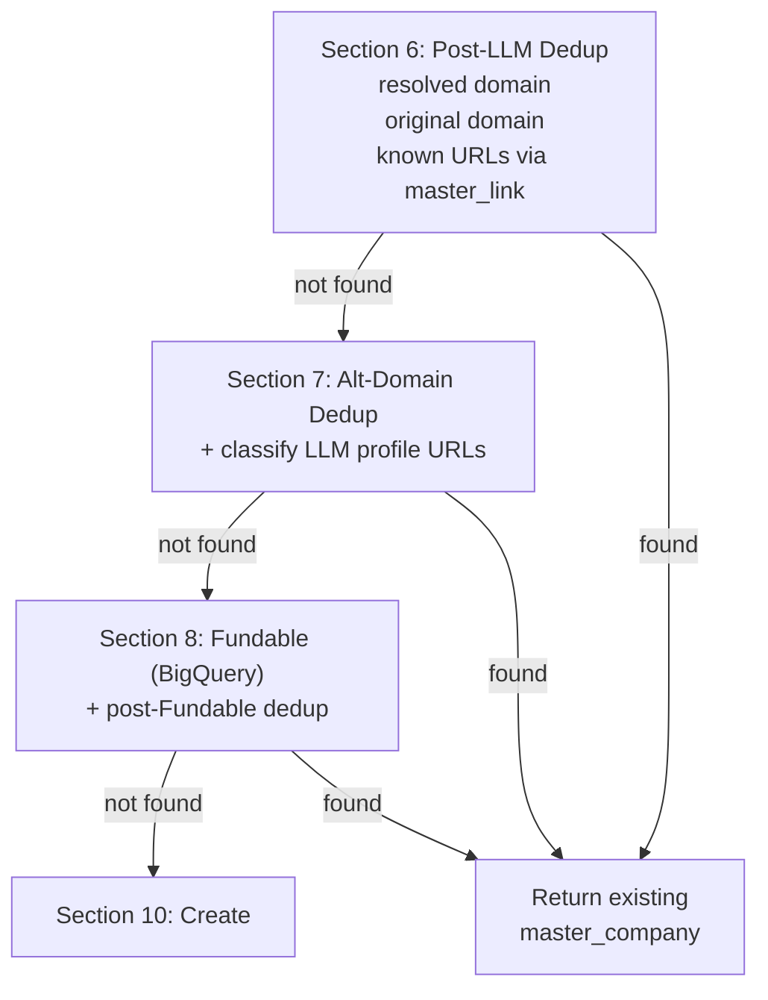
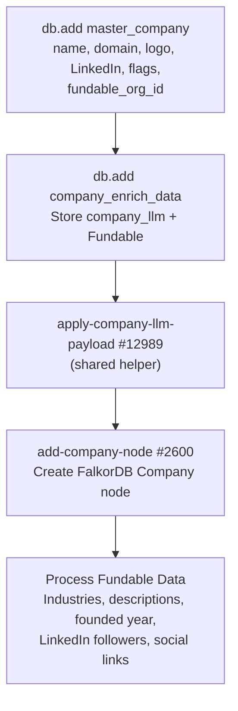

The company waterfall begins when any function calls `mvp/get-add/master-company-new`. This page walks through the full flow using **resend.com** as the running example. See [Core Concepts](/guides/enrichment/waterfall/core-concepts) for shared mechanics (cascade depth, priority tiers, queue tables).

---

## Entry Point

```text
mvp/get-add/master-company-new — #12558
```

**Current version:** v2.13 (2026-06-04) — canonical-domain correction replaces known directory/source domains such as TeaserClub, Tracxn, Magnitt, and VentureCapitalArchive with the LLM-confirmed company domain, and `is_vc` is now derived from company-type / investment-firm evidence instead of Fundable's broad `is_investor` flag. v2.11 (2026-06-03) added exact Fundable-org targeting through `source_entity_type: "fundable_organizations"` + `source_entity_uuid`. v2.10 (2026-06-02) added `hold_downstream` for bounded QA/backfill creates. v2.7 (2026-06-01) migrated active waterfall writers/callers to canonical `source` strings while keeping legacy `data_source_id` inputs unused for compatibility. v2.6 (2026-05-12) switched Section 11 dispatch from `run-base-company-enrich-v3` (#12814, deprecated) to `enrich-master-company` (#12992). v2.5 extracted Section 10a/10b + the inline `company_financial` create into `mvp/enrich/apply-company-llm-payload` (#12989). v2.4 removed PDL and Enrich Layer entirely — `new-company-enrichment` (#12974) is now the sole semi-structured LLM enrichment.

Called with:
```json
{
  "domain": "resend.com",
  "profile_url": "https://www.linkedin.com/company/resend",
  "company_name": "Resend",
  "cascade_depth": 0,
  "priority_tier": 1
}
```

---

## Phase 1: Input Cleanup (Section 2)



The raw input is normalized:
- **Domain extraction**: `https://www.resend.com/pricing` becomes `resend.com`
- **Redirect resolution**: If `resend.com` redirected from an old domain, both are tracked (`$varDomain` + `$varOriginalDomain`)
- **Profile classification**: LinkedIn URLs are stored in `$varLinkedInUrl`, Crunchbase in `$varCrunchbaseUrl`
- **School detection**: LinkedIn `/school/` URLs are flagged and rewritten to `/company/`

---

## Phase 2: Quick Check + Kill Switch (Sections 3 + 4)

Before any LLM call, the function runs a fast-exit dedup and the kill-switch check:



- **Section 3**: Look up the incoming `profile_url` in `master_link`. If it already points to a `master_company`, return immediately — no LLM, no Fundable, no external calls.
- **Section 4**: Read the `kill_switch_company` env var. When the switch is on, the function still answers from local rows but writes zero external-API requests.

---

## Phase 3: LLM Enrichment (Section 5)

```text
mvp/enrich/new-company-enrichment — #12974
```

**Current version:** v1.4 (2026-05-12). Two-stage company enrichment:

1. **Stage 1** — LLM enrichment via OpenRouter (Gemini Flash with `openrouter:web_search` by default; escalates to Claude Sonnet 4.6 with `openrouter:web_search` when overall confidence < 0.7). All chat requests include `provider.data_collection = "deny"`.
2. **Stage 2** — Deterministic profile discovery via Serper. Batch `site:` search across LinkedIn, X/Twitter, Facebook, Instagram, YouTube, Crunchbase, Wellfound. Merged into `data.profiles` after canonical-URL filtering.

The system prompt mirrors [`/guides/open-work/new-company-enrichment`](/guides/open-work/new-company-enrichment) in the Mintlify docs. Response shape: `{ data, model_used, escalated, gemini_confidence }`.

The LLM call now runs **before** the Fundable lookup so any LinkedIn / Crunchbase URLs the LLM discovers can feed Fundable's matcher.

Recent versions added `went_public_on` (IPO date) + `stock_link` (TradingView URL) (v1.4), tightened profile filtering at both prompt and merge layers (v1.3), strengthened profile-verification (v1.2), and added `is_school` boolean (v1.1).

`apply-company-llm-payload` (#12989) now does a deterministic URL filter before writing LLM / Serper profiles: canonical company/org profile URLs are allowed, but social handles must match company/domain signals. v1.3 (2026-06-03) specifically blocks short aliases from satisfying social-handle matching so broad names like `Yoshi` do not accept unrelated handles.

---

## Phase 4: Post-LLM Dedup + Fundable (Sections 6 → 7 → 8)



Each dedup layer queries `master_company` by domain or `master_link` by URL. If a match is found at any layer, the existing company is returned immediately.

**Fundable** (Section 8) is our own BigQuery dataset — zero external-API cost. The `fundable_org_id` it returns is written onto `master_company` and reused everywhere downstream (Phase 5, Phase 7, Signal NFX, investment thesis). When a caller passes an exact Fundable org id through `source_entity_type: "fundable_organizations"` + `source_entity_uuid`, `mvp/funding/fundable-lookup` (#12698) checks that exact id before domain, LinkedIn, or Crunchbase matching.

When the incoming domain is a known directory or data-source host, the LLM-confirmed canonical domain wins before record creation. Directory URLs may still be retained as source/profile links, but they are filtered from official website links and cannot overwrite `master_company.company_domain`.

**When `cascade_depth > 0`**: the entity still goes through all sections, but Section 11 forces it into the queue regardless of the `queue` input.

For `resend.com` at depth 0 with no Fundable match:

| API | Endpoint | Data Retrieved |
|-----|----------|----------------|
| **new-company-enrichment** | OpenRouter (Gemini Flash / Claude Sonnet) + Serper | display_name, legal_name, aliases, profiles, industry, size, headquarters, other_locations, financial signals, summary, headline |
| **Fundable** | BigQuery | `fundable_org_id`, company name, LinkedIn, Crunchbase, Pitchbook, funding rounds, founded date |

---

## Phase 5: Record Creation (Section 10)

With LLM + Fundable data gathered and no existing match found:



For `resend.com`, this creates:
- **master_company** record with `company_name: "Resend"`, `company_domain: "resend.com"`, logo from logo.dev, `fundable_org_id` if Fundable matched
- **company_enrich_data** storing `company_llm` (full LLM payload) + `fundable` (BigQuery response or `"no_data"`)
- **company_financial** (created inside the helper) with `company_type`, `is_public`, `ticker`, `stock_label`, `primary_exchange`, `stock_link`, `went_public_on`, `funding_total`, `revenue`
- **master_link** entries for LinkedIn, Crunchbase, domain, plus every LLM-discovered + Serper-augmented social URL (`source: "Company_LLM"`)
- **Industries and specialties** from the LLM payload (`industry.primary` / `industry.secondary` / `tags`) + Fundable
- **About/descriptions** from LLM `headline` + `summary` (`source: "Company_LLM"`) + Fundable (`source: "Fundable"`)
- **HQ address** + **other office locations** from the LLM `headquarters` + `other_locations` blocks
- **Contact email + phone** from LLM `email_address` / `phone_number`
- **Company node** in the FalkorDB graph (after the helper has populated the relational tables)

<Note>
**Single source of truth for LLM → relational mapping.** `mvp/enrich/apply-company-llm-payload` (#12989) is called from two places: here (Section 10b/c on fresh creates) and from `enrich-master-company` Step 3 (backfilled records whose LLM payload was just freshly populated). The helper is idempotent — scalar writes use `first_notempty` so existing values are preserved. v1.5 (2026-06-04) also uses Fundable as a deterministic financial fallback: when the LLM omits funding totals or round counts, `fundable.total_raised` and `fundable.num_funding_rounds` populate `company_financial.funding_total` and `total_rounds_raised`.
</Note>

---

## Phase 6: Enrichment Dispatch (Section 11)

The final routing decision depends on cascade depth and queue flag:


For `resend.com` at depth 0 with `queue: false`: **immediate enrichment** fires asynchronously via `enrich-master-company`. For a depth-1 company discovered during person enrichment: **queued** with the source function, source entity (id + uuid + type), and priority tier recorded via `mvp/queue/upsert-enrich-company`.

<Info>
A `!debug.stop` line still sits in front of the dispatch (kept from v2.4's sandbox-smoke gating). The `!` prefix disables it; remove the `!` to gate `enrich-master-company` again during a future debug session.
</Info>

---

## enrich-master-company — 15-Step Gated Orchestrator

```text
mvp/enrich/enrich-master-company — #12992
```

**Current version:** v4.6 (2026-06-09). Seed-company Exa founders / C-suite are now direct-enriched instead of queued to `queue_enrich_person`: after the seed-scoped person is created, the orchestrator dispatches `enrich-master-person` #13040 with `current_company_only: true` and `cascade_depth: 1`. That person run only resolves current companies, and those companies become depth-1 queue leaves. v4.5 (2026-06-04) made accepted Exa work-history rows match the seed's domain, root domain, LinkedIn company profile, exact name, alias, or conservative prefix before person creation. v4.4 (2026-06-03) had queued seed-company Exa founders / C-suite at `priority_tier: 1`; v4.6 replaces that queue path with direct current-company-only enrichment. v4.3 made the company waterfall non-recursive: deeper companies can fetch and save Exa C-suite / founder responses, but do not process those matches into people. v4.2 gated Exa people expansion to `cascade_depth == 0`. Source-text migration replaced active `data_source_id` writes/dedup checks with canonical `source` strings; legacy `data_source_id` inputs remain unused for compatibility. v4 (2026-05-12, last modified 2026-05-14) replaced `run-base-company-enrich-v3` (#12814, deprecated). Input/output contract identical to v3.5.

Every step is wrapped in its own `try_catch` — failures append a `log_crash` row with `note: "CRASH: {step}"` and flip `$hasCrash = true`, but later steps still run. The orchestrator opens with a **60-second debounce** (skip + log if a prior run for the same `master_company_id` with `source: "Base Company Enrich"` fired within the last 60s — prevents duplicate `enrich_history_company` rows from back-to-back triggers). Setup writes one base `enrich_history_company` row (`source: "Base Company Enrich"`, `processing: true`) and exits early with `EARLY RETURN: no company_enrich_data row` when the company has no enrich-data row yet. If the company is a VC discovered through funding-round investor resolution (`source_function: "resolve-investors-edges"` or `source: "Funding Rounds"` at depth > 0), the orchestrator marks the base history row complete and returns without full company enrichment.

| # | Step | What It Does |
|:-:|------|-------------|
| — | **Debounce + Setup** (inline) | 60s debounce check on `enrich_history_company`. Then `db.add enrich_history_company`, load `master_company` + `company_enrich_data`, guard early-return when enrich-data row missing. |
| 1+2 | **LLM preflight** | When `company_enrich_data.company_llm.data` is empty, run `mvp/enrich/new-company-enrichment` (#12974) and write the response onto `company_enrich_data.company_llm`. Logs an extra `enrich_history_company` row with `source: "Company_LLM"`. Sets `$llmRan = true` only when this path fires. |
| 3 | **Apply LLM payload** | Only when `$llmRan` is true. Calls `mvp/enrich/apply-company-llm-payload` (#12989) — shared helper that fans the LLM payload out to `master_company`, `company_financial`, industries, specialties, links, abouts, addresses, contacts. Same helper used by fresh creates in `get-add/master-company-new`. |
| 4 | **Fundable re-lookup** | Only when `master_company.fundable_org_id` is null. Tries `fundable_organizations` by domain → LinkedIn (LLM-discovered) → Crunchbase (LLM-discovered). On match: write `fundable_org_id` back and mirror `master_company_id` + `master_company_node_uuid` onto the Fundable row. A Fundable `is_investor` match alone does not flip `master_company.is_vc`; VC status is classified in `get-add/master-company-new` from investment-firm evidence. |
| 5 | **Signal NFX scrape** | Only when `fundable_org_id` set AND `signal_nfx_json` empty AND `is_vc`. Calls `mvp/investor/get-signal-nfx-data-company` (#12991). |
| 6 | **Investment thesis** | Only when `fundable_org_id` set AND `is_vc` AND (no `investment_theses` row OR `updated_at` > 30 days old). Calls `thesis/build-investment-thesis-in-gcp` (#12978). |
| 7 | **Get C-Suite & Founders via Exa** | Calls `mvp/enrich/get-exa-company-c-suite` (#12988) with `expand_companies: true` when `company_enrich_data.exa_c_suite` is empty. At seed depth (`cascade_depth == 0`) it first filters matches to the seed company, then processes only seed-scoped rows into `master_person`, biographies, avatar, work history, `HAS_WORKED_AT` edges, and deep-person-basic. It then direct-dispatches `enrich-master-person` #13040 with `current_company_only: true`, `cascade_depth: 1`, and `deep_research: false`. It does **not** write `queue_enrich_person` for these Exa C-suite people. At depth > 0 it saves the Exa response only and logs `SAVED: C-suite/founder Exa response only; people expansion gated to seed depth`. |
| 8 | **process-company-phase-3** #12799 — YC (v1.2) | YC detection/scrape + YC data processing always remain available, but `process-yc-people` is seed-company only. Depth > 0 logs `SKIP: YC people gated to seed company depth`. YC founders queue at tier 1; YC primary partner currently queues at tier 2. |
| 9 | **process-company-phase-5** #12809 — Fundable backfill | Lookup + industries + abouts + address + links + follower counts from Fundable. |
| 10 | **process-company-phase-6** #12810 — Link res + financial | Canonicalize profile URLs; populate `company_financial`. |
| 11 | **process-company-phase-7** #12813 — Deals (v1.2) | Seed-company only. At `cascade_depth == 0`, calls `add-all-fundable-deals` #12703 and walks both `fundable_deals WHERE organization_id=X` (rounds this org raised) and `fundable_institutional_investments WHERE organization_id=X` (rounds this org invested in), routing each through `mvp/investor/cascade-deal-participants` #12856. Creates Funding_Round nodes, RAISED + INVESTED_IN / LEAD_INVESTED_IN / INVESTMENT_PARTNER_IN edges, and writes IPO/exit signal to `company_financial.is_public` on the target org. At depth > 0 it logs `SKIP: Fundable deal fanout gated to seed company depth`. |
| 12 | **resolve-company-specialties** #12746 | Reads specialties from `speciality_join`, embeds each, vector-searches against `SubDomainExpertise` nodes, matches or creates new nodes, creates `SPECIALIZES_IN` FalkorDB edges (weight = `min(round(10 + match_score*80), 50)`). Writes new `SubDomainExpertise` nodes back to `sub_domain_expertise` table. |
| 13 | **llm-company-about** (`mvp/about/llm-company-about`) | LLM-generated company description → `master_company.company_about`. |
| 14 | **add-company-locations** (`mvp/address/add-company-locations`) | Resolve HQ + office addresses and write to location tables. |
| 15 | **update-company-node** #4659 (v1.6) | FalkorDB Company-node property sync. v1.6 reads `company_enrich_data.company_llm.data` and writes `business_model`, `primary_product_name` / `_category`, `other_product_names` / `_categories`, `target_customers`, `is_acquired`, `acquired_by`, `acquired_date`, `acquired_ticker`, plus `went_public_on` + `stock_link` (sourced from `company_financial`). |
| — | **Finalize** (inline) | Edit `enrich_history_company`: `enrich_success: true` + `processing: false` if no crashes; else `enrich_success: false` + `source: "Base Company Enrich"`. Writes one `qa_passed: true` row to `log_crash` on clean completion. |

<Note>
**v4 vs v3.5: what's new.** v4 adds gated pre-phase steps (LLM preflight → apply payload → Fundable re-lookup → Signal NFX → investment thesis → Exa C-Suite + person loop) in front of the existing v3 phase chain. v4.2 through v4.6 make that person loop seed-only, seed-scoped, and direct-enriched in current-company-only mode. The later phase chain still runs for normal company enrichment, but YC people and Fundable deal fanout are seed-company only. PDL + Enrich Layer were already gone in v3.5; v4 inherits that.
</Note>

---

## Active pipeline functions

Every function in the live company waterfall, grouped by role.

### Quick copy — entry + orchestration

```text
mvp/get-add/master-company-new             #12558
mvp/enrich/enrich-master-company  #12992
mvp/enrich/apply-company-llm-payload   #12989
mvp/enrich/new-company-enrichment      #12974
mvp/queue/upsert-enrich-company        (queue dispatcher)
```

### Quick copy — v4 gated steps (pre-phase)

```text
mvp/enrich/get-exa-company-c-suite          #12988
mvp/get-add/master-person-from-exa          #12997
mvp/enrich/enrich-master-person             #13040
mvp/investor/get-signal-nfx-data-company    #12991
mvp/investor/parse-signal-nfx-company       #12990
thesis/build-investment-thesis-in-gcp       #12978
```

### Quick copy — phase chain (steps 8–15)

```text
mvp/enrich/process-company-phase-3   #12799
mvp/enrich/process-company-phase-5   #12809
mvp/enrich/process-company-phase-6   #12810
mvp/enrich/process-company-phase-7   #12813
mvp/funding/add-all-fundable-deals   #12703
mvp/investor/cascade-deal-participants #12856
mvp/expertise/resolve-company-specialties #12746
mvp/node/update-company-node         #4659
```

---

## Cascade Example: resend.com at Depth 0 (Company Seed)

Here's what happens end-to-end when `resend.com` enters as a seed entity:

```
Depth 0: resend.com
├── get-add/master-company-new
│   ├── Section 3: profile_url quick check → miss
│   ├── Section 4: kill switch off
│   ├── Section 5: new-company-enrichment (LLM + Serper)
│   ├── Sections 6–8: dedup → Fundable lookup
│   ├── Section 10: db.add master_company + company_enrich_data
│   │              + apply-company-llm-payload (relational fanout)
│   │              + add-company-node (FalkorDB)
│   └── Section 11: dispatch async enrich-master-company
│
└── enrich-master-company (async)
    ├── Step 1+2: LLM already populated by get-add → skipped
    ├── Step 3:   skipped (only fires when LLM just ran)
    ├── Step 4:   Fundable re-lookup if fundable_org_id null
    ├── Steps 5–6: Signal NFX + investment thesis (VC-only, gated)
    ├── Step 7:   Exa C-Suite — seed company only
    │             → master-person-from-exa (cascade_depth: 1)
    │                ├── bios, avatar, work_experience rows
    │                ├── create-work-edges (HAS_WORKED_AT)
    │                └── enrich-master-person(current_company_only=true)
    │                    → current companies only → queue_enrich_company(depth 1)
    ├── Steps 8–11: YC, Fundable backfill, Link res, Deals
    │              └── add-all-fundable-deals v2.0 → cascade-deal-participants
    │                  per round → Funding_Round nodes + RAISED + INVESTED_IN
    │                  + LEAD_INVESTED_IN + INVESTMENT_PARTNER_IN edges
    │                  → portfolio cos + investors queued at depth 1
    ├── Steps 12–13: specialties, company-about
    ├── Steps 14–15: locations, FalkorDB Company node sync
    └── Finalize: enrich_history_company.enrich_success = true
```

Seed company enrichment can create a direct depth-1 wave, but downstream fanout is gated. External APIs are called at depth 0 during both `get-add` (LLM + Fundable) and the orchestrator's pre-phase steps (Exa, Signal NFX, investment thesis). Seed-company Exa C-suite people are enriched immediately, but only their current companies are resolved and queued. Deeper companies may save provider responses and enrich company data, but Exa people, YC people, and Fundable deal fanout stay seed-only.

---

## Bounded Cascade Example: Person Investor at Depth 0

Here's what happens when a person who invested in a company enters as a seed entity under the current non-recursive policy.

```text
Depth 0: Person investor
├── get-add/master-person-new #13039
│   └── enrich-master-person #13040
│       ├── Phase 3: Process PDL
│       │   └── primary current employer
│       │       → get-add/master-company-new(queue=true, cascade_depth=1, tier=1)
│       │       → queue_enrich_company leaf, not inline full enrichment
│       │
│       └── Phase 9: Investor Pipeline
│           └── seed-person only: foreach angel investment
│               → cascade-deal-participants #12856
│               ├── portfolio company → queue_enrich_company(depth 1, tier 2)
│               ├── Funding_Round node + RAISED / INVESTED_IN edges
│               ├── co-angels → queue_enrich_person(depth 1, tier 1)
│               ├── VC firms → queue_enrich_company(depth 1, tier 2)
│               └── VC partners → queue_enrich_person(depth 1, tier 1)
│
└── Later queue runs
    ├── depth-1 people can enrich and add work-history companies as leaves
    ├── depth-1 companies can enrich their own company data
    ├── depth-1 companies save Exa C-suite responses but do not create people
    ├── company YC people and deal fanout stay gated to seed-company depth
    └── VC firms discovered from funding rounds suppress full company enrichment
```

**Impact analysis:**

- **Seed cost:** one full person enrichment and one direct investment-network pass when the person is an angel.
- **Direct fanout:** current employer, portfolio companies, co-angels, VC firms, and VC partners are queued as depth-1 candidates.
- **No recursive investment closure:** when a queued portfolio company or VC firm processes later, it does not discover every other round and then recurse into every investor on those rounds.
- **Idempotency:** queue upsert semantics still collapse repeated discoveries into one row with `count++`, best `priority_tier`, and best/lower `cascade_depth`.
