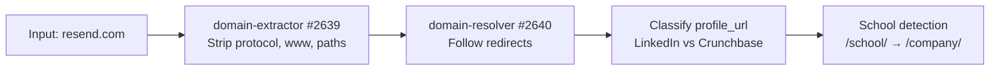
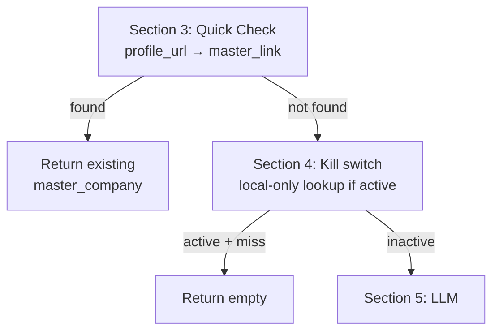
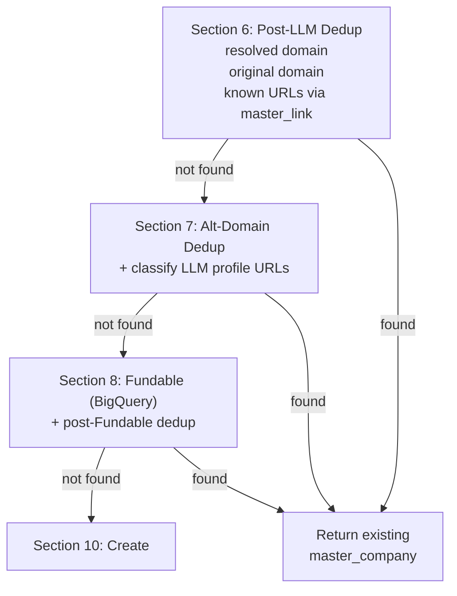
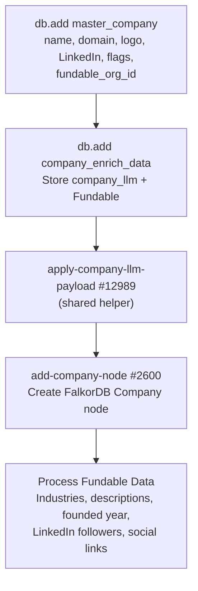

The company waterfall begins when any function calls `mvp/get-add/master-company-new`. This page walks through the full flow using **resend.com** as the running example. See [Core Concepts](/guides/enrichment/waterfall/core-concepts) for shared mechanics (cascade depth, priority tiers, queue tables).

---

## Entry Point

```text
mvp/get-add/master-company-new — #12558
```

**Current version:** v2.7 (2026-06-01) — Company source-text migration: active waterfall writers/callers now use canonical `source` strings and keep legacy `data_source_id` inputs unused for compatibility. v2.6 (2026-05-12) — Section 11 dispatch switched from `run-base-company-enrich-v3` (#12814, deprecated) to `enrich-master-company` (#12992). v2.5 (2026-05-12) extracted Section 10a/10b + the inline `company_financial` create into the shared helper `mvp/enrich/apply-company-llm-payload` (#12989). v2.4 (2026-05-11) removed PDL and Enrich Layer entirely — `new-company-enrichment` (#12974) is now the sole semi-structured LLM enrichment. Section numbers were re-ordered: 5 = LLM, 6 = post-LLM dedup, 7 = alt-domain dedup, 8 = Fundable, 10 = create, 11 = dispatch.

Called with:
```json
{
  "domain": "resend.com",
  "profile_url": "https://www.linkedin.com/company/resend",
  "company_name": "Resend",
  "cascade_depth": 0,
  "priority_tier": 1
}
```

---

## Phase 1: Input Cleanup (Section 2)



The raw input is normalized:
- **Domain extraction**: `https://www.resend.com/pricing` becomes `resend.com`
- **Redirect resolution**: If `resend.com` redirected from an old domain, both are tracked (`$varDomain` + `$varOriginalDomain`)
- **Profile classification**: LinkedIn URLs are stored in `$varLinkedInUrl`, Crunchbase in `$varCrunchbaseUrl`
- **School detection**: LinkedIn `/school/` URLs are flagged and rewritten to `/company/`

---

## Phase 2: Quick Check + Kill Switch (Sections 3 + 4)

Before any LLM call, the function runs a fast-exit dedup and the kill-switch check:



- **Section 3**: Look up the incoming `profile_url` in `master_link`. If it already points to a `master_company`, return immediately — no LLM, no Fundable, no external calls.
- **Section 4**: Read the `kill_switch_company` env var. When the switch is on, the function still answers from local rows but writes zero external-API requests.

---

## Phase 3: LLM Enrichment (Section 5)

```text
mvp/enrich/new-company-enrichment — #12974
```

**Current version:** v1.4 (2026-05-12). Two-stage company enrichment:

1. **Stage 1** — LLM enrichment via OpenRouter (Gemini Flash `:online` by default; escalates to Claude Sonnet 4.6 `:online` when overall confidence < 0.7).
2. **Stage 2** — Deterministic profile discovery via Serper. Batch `site:` search across LinkedIn, X/Twitter, Facebook, Instagram, YouTube, Crunchbase, Wellfound. Merged into `data.profiles` after canonical-URL filtering.

The system prompt mirrors [`/guides/open-work/new-company-enrichment`](/guides/open-work/new-company-enrichment) in the Mintlify docs. Response shape: `{ data, model_used, escalated, gemini_confidence }`.

The LLM call now runs **before** the Fundable lookup so any LinkedIn / Crunchbase URLs the LLM discovers can feed Fundable's matcher.

Recent versions added `went_public_on` (IPO date) + `stock_link` (TradingView URL) (v1.4), tightened profile filtering at both prompt and merge layers (v1.3), strengthened profile-verification (v1.2), and added `is_school` boolean (v1.1).

---

## Phase 4: Post-LLM Dedup + Fundable (Sections 6 → 7 → 8)



Each dedup layer queries `master_company` by domain or `master_link` by URL. If a match is found at any layer, the existing company is returned immediately.

**Fundable** (Section 8) is our own BigQuery dataset — zero external-API cost. The `fundable_org_id` it returns is written onto `master_company` and reused everywhere downstream (Phase 5, Phase 7, Signal NFX, investment thesis).

**When `cascade_depth > 0`**: the entity still goes through all sections, but Section 11 forces it into the queue regardless of the `queue` input.

For `resend.com` at depth 0 with no Fundable match:

| API | Endpoint | Data Retrieved |
|-----|----------|----------------|
| **new-company-enrichment** | OpenRouter (Gemini Flash / Claude Sonnet) + Serper | display_name, legal_name, aliases, profiles, industry, size, headquarters, other_locations, financial signals, summary, headline |
| **Fundable** | BigQuery | `fundable_org_id`, company name, LinkedIn, Crunchbase, Pitchbook, funding rounds, founded date |

---

## Phase 5: Record Creation (Section 10)

With LLM + Fundable data gathered and no existing match found:



For `resend.com`, this creates:
- **master_company** record with `company_name: "Resend"`, `company_domain: "resend.com"`, logo from logo.dev, `fundable_org_id` if Fundable matched
- **company_enrich_data** storing `company_llm` (full LLM payload) + `fundable` (BigQuery response or `"no_data"`)
- **company_financial** (created inside the helper) with `company_type`, `is_public`, `ticker`, `stock_label`, `primary_exchange`, `stock_link`, `went_public_on`, `funding_total`, `revenue`
- **master_link** entries for LinkedIn, Crunchbase, domain, plus every LLM-discovered + Serper-augmented social URL (`source: "Company_LLM"`)
- **Industries and specialties** from the LLM payload (`industry.primary` / `industry.secondary` / `tags`) + Fundable
- **About/descriptions** from LLM `headline` + `summary` (`source: "Company_LLM"`) + Fundable (`source: "Fundable"`)
- **HQ address** + **other office locations** from the LLM `headquarters` + `other_locations` blocks
- **Contact email + phone** from LLM `email_address` / `phone_number`
- **Company node** in the FalkorDB graph (after the helper has populated the relational tables)

<Note>
**Single source of truth for LLM → relational mapping.** `mvp/enrich/apply-company-llm-payload` (#12989) is called from two places: here (Section 10b/c on fresh creates) and from `enrich-master-company` Step 3 (backfilled records whose LLM payload was just freshly populated). The helper is idempotent — scalar writes use `first_notempty` so existing values are preserved, and `is_school` / `is_vc` only ever escalate to true.
</Note>

---

## Phase 6: Enrichment Dispatch (Section 11)

The final routing decision depends on cascade depth and queue flag:


For `resend.com` at depth 0 with `queue: false`: **immediate enrichment** fires asynchronously via `enrich-master-company`. For a depth-1 company discovered during person enrichment: **queued** with the source function, source entity (id + uuid + type), and priority tier recorded via `mvp/queue/upsert-enrich-company`.

<Info>
A `!debug.stop` line still sits in front of the dispatch (kept from v2.4's sandbox-smoke gating). The `!` prefix disables it; remove the `!` to gate `enrich-master-company` again during a future debug session.
</Info>

---

## enrich-master-company — 15-Step Gated Orchestrator

```text
mvp/enrich/enrich-master-company — #12992
```

**Current version:** v4.2 (2026-06-01). Source-text migration replaced active `data_source_id` writes/dedup checks with canonical `source` strings; legacy `data_source_id` inputs remain unused for compatibility. v4 (2026-05-12, last modified 2026-05-14) replaced `run-base-company-enrich-v3` (#12814, deprecated). Input/output contract identical to v3.5.

Every step is wrapped in its own `try_catch` — failures append a `log_crash` row with `note: "CRASH: {step}"` and flip `$hasCrash = true`, but later steps still run. The orchestrator opens with a **60-second debounce** (skip + log if a prior run for the same `master_company_id` with `source: "Base Company Enrich"` fired within the last 60s — prevents duplicate `enrich_history_company` rows from back-to-back triggers). Setup writes one base `enrich_history_company` row (`source: "Base Company Enrich"`, `processing: true`) and exits early with `EARLY RETURN: no company_enrich_data row` when the company has no enrich-data row yet.

| # | Step | What It Does |
|:-:|------|-------------|
| — | **Debounce + Setup** (inline) | 60s debounce check on `enrich_history_company`. Then `db.add enrich_history_company`, load `master_company` + `company_enrich_data`, guard early-return when enrich-data row missing. |
| 1+2 | **LLM preflight** | When `company_enrich_data.company_llm.data` is empty, run `mvp/enrich/new-company-enrichment` (#12974) and write the response onto `company_enrich_data.company_llm`. Logs an extra `enrich_history_company` row with `source: "Company_LLM"`. Sets `$llmRan = true` only when this path fires. |
| 3 | **Apply LLM payload** | Only when `$llmRan` is true. Calls `mvp/enrich/apply-company-llm-payload` (#12989) — shared helper that fans the LLM payload out to `master_company`, `company_financial`, industries, specialties, links, abouts, addresses, contacts. Same helper used by fresh creates in `get-add/master-company-new`. |
| 4 | **Fundable re-lookup** | Only when `master_company.fundable_org_id` is null. Tries `fundable_organizations` by domain → LinkedIn (LLM-discovered) → Crunchbase (LLM-discovered). On match: write `fundable_org_id` back, mirror `master_company_id` + `master_company_node_uuid` onto the Fundable row, and set `master_company.is_vc = true` when the Fundable row is an investor. |
| 5 | **Signal NFX scrape** | Only when `fundable_org_id` set AND `signal_nfx_json` empty AND `is_vc`. Calls `mvp/investor/get-signal-nfx-data-company` (#12991). |
| 6 | **Investment thesis** | Only when `fundable_org_id` set AND `is_vc` AND (no `investment_theses` row OR `updated_at` > 30 days old). Calls `thesis/build-investment-thesis-in-gcp` (#12978). |
| 7 | **Get C-Suite & Founders via Exa** | Only when `company_enrich_data.exa_c_suite` empty. Calls `mvp/enrich/get-exa-company-c-suite` (#12988) with `expand_companies: true`. For each match: `mvp/get-add/master-person-from-exa` (#12997, `source: "Exa"`) → biographies (highlights + summary, `source: "Exa"`) → `mvp/enrich/find-avatar` + `replace-avatar` (`source: "Serpa.dev"`, when action == `"updated"`) → loop `workHistory` and `db.add work_experience` rows (`source: "Exa"`) (matching the master company name flags the row to the current `master_company_id`) → `mvp/edges/create-work-edges` → `mvp/deep-research/deep-person-basic` → `mvp/queue/upsert-enrich-person` (tier 4, `deep_research: false`). |
| 8 | **process-company-phase-3** #12799 — YC (v1.1) | YC detection/scrape + YC data processing + `process-yc-people` (receives `cascade_depth` so YC batch-mates inherit the tree). |
| 9 | **process-company-phase-5** #12809 — Fundable backfill | Lookup + industries + abouts + address + links + follower counts from Fundable. |
| 10 | **process-company-phase-6** #12810 — Link res + financial | Canonicalize profile URLs; populate `company_financial`. |
| 11 | **process-company-phase-7** #12813 — Deals (v1.1) | Calls `add-all-fundable-deals` #12703 (v2.0). Walks **both** `fundable_deals WHERE organization_id=X` (rounds this org raised) **and** `fundable_institutional_investments WHERE organization_id=X` (rounds this org invested in), routing each through `mvp/investor/cascade-deal-participants` #12856 (v1.2, 2026-05-12 — staleness-gated re-cascade). Creates Funding_Round nodes, RAISED + INVESTED_IN / LEAD_INVESTED_IN / INVESTMENT_PARTNER_IN edges, and writes the IPO/exit signal to `company_financial.is_public` on the target org. |
| 12 | **resolve-company-specialties** #12746 | Reads specialties from `speciality_join`, embeds each, vector-searches against `SubDomainExpertise` nodes, matches or creates new nodes, creates `SPECIALIZES_IN` FalkorDB edges (weight = `min(round(10 + match_score*80), 50)`). Writes new `SubDomainExpertise` nodes back to `sub_domain_expertise` table. |
| 13 | **llm-company-about** (`mvp/about/llm-company-about`) | LLM-generated company description → `master_company.company_about`. |
| 14 | **add-company-locations** (`mvp/address/add-company-locations`) | Resolve HQ + office addresses and write to location tables. |
| 15 | **update-company-node** #4659 (v1.6) | FalkorDB Company-node property sync. v1.6 reads `company_enrich_data.company_llm.data` and writes `business_model`, `primary_product_name` / `_category`, `other_product_names` / `_categories`, `target_customers`, `is_acquired`, `acquired_by`, `acquired_date`, `acquired_ticker`, plus `went_public_on` + `stock_link` (sourced from `company_financial`). |
| — | **Finalize** (inline) | Edit `enrich_history_company`: `enrich_success: true` + `processing: false` if no crashes; else `enrich_success: false` + `source: "Base Company Enrich"`. Writes one `qa_passed: true` row to `log_crash` on clean completion. |

<Note>
**v4 vs v3.5 — what's new.** v4 adds five gated pre-phase steps (LLM preflight → apply payload → Fundable re-lookup → Signal NFX → investment thesis → Exa C-Suite + person loop) in front of the existing v3 phase chain. The phase chain itself (steps 8–15 above) is structurally identical to v3.5 — same per-step `try_catch`, same canonical `source` tagging, same finalize. v3.5 had a single always-on Exa step at the top (`#12988` writing to `exa_c_suite`); v4 promotes that into a full create-person sub-loop. PDL + Enrich Layer were already gone in v3.5 — v4 inherits that.
</Note>

---

## Active pipeline functions

Every function in the live company waterfall, grouped by role.

### Quick copy — entry + orchestration

```text
mvp/get-add/master-company-new             #12558
mvp/enrich/enrich-master-company  #12992
mvp/enrich/apply-company-llm-payload   #12989
mvp/enrich/new-company-enrichment      #12974
mvp/queue/upsert-enrich-company        (queue dispatcher)
```

### Quick copy — v4 gated steps (pre-phase)

```text
mvp/enrich/get-exa-company-c-suite          #12988
mvp/get-add/master-person-from-exa          #12997
mvp/investor/get-signal-nfx-data-company    #12991
mvp/investor/parse-signal-nfx-company       #12990
thesis/build-investment-thesis-in-gcp       #12978
```

### Quick copy — phase chain (steps 8–15)

```text
mvp/enrich/process-company-phase-3   #12799
mvp/enrich/process-company-phase-5   #12809
mvp/enrich/process-company-phase-6   #12810
mvp/enrich/process-company-phase-7   #12813
mvp/funding/add-all-fundable-deals   #12703
mvp/investor/cascade-deal-participants #12856
mvp/expertise/resolve-company-specialties #12746
mvp/node/update-company-node         #4659
```

---

## Cascade Example: resend.com at Depth 0 (Company Seed)

Here's what happens end-to-end when `resend.com` enters as a seed entity:

```
Depth 0: resend.com
├── get-add/master-company-new
│   ├── Section 3: profile_url quick check → miss
│   ├── Section 4: kill switch off
│   ├── Section 5: new-company-enrichment (LLM + Serper)
│   ├── Sections 6–8: dedup → Fundable lookup
│   ├── Section 10: db.add master_company + company_enrich_data
│   │              + apply-company-llm-payload (relational fanout)
│   │              + add-company-node (FalkorDB)
│   └── Section 11: dispatch async enrich-master-company
│
└── enrich-master-company (async)
    ├── Step 1+2: LLM already populated by get-add → skipped
    ├── Step 3:   skipped (only fires when LLM just ran)
    ├── Step 4:   Fundable re-lookup if fundable_org_id null
    ├── Steps 5–6: Signal NFX + investment thesis (VC-only, gated)
    ├── Step 7:   Exa C-Suite — for each founder/key employee
    │             → master-person-from-exa (cascade_depth: 0)
    │                ├── bios, avatar, work_experience rows
    │                ├── create-work-edges (HAS_WORKED_AT)
    │                └── upsert-enrich-person (tier 4)
    ├── Steps 8–11: YC, Fundable backfill, Link res, Deals
    │              └── add-all-fundable-deals v2.0 → cascade-deal-participants
    │                  per round → Funding_Round nodes + RAISED + INVESTED_IN
    │                  + LEAD_INVESTED_IN + INVESTMENT_PARTNER_IN edges
    │                  → portfolio cos + investors queued at depth 1
    ├── Steps 12–13: specialties, company-about
    ├── Steps 14–15: locations, FalkorDB Company node sync
    └── Finalize: enrich_history_company.enrich_success = true
```

Each cascade hop increments `cascade_depth`. External APIs are called at depth 0 during both `get-add` (LLM + Fundable) and the orchestrator's pre-phase steps (Exa, Signal NFX, investment thesis). Deeper entities go straight to the queue and get fully enriched when their cron processes them.

---

## Cascade Example: Person Investor at Depth 0 (Full Bloom-Out)

Here's what happens when a person who invested in a company enters as a seed entity. The bloom-out spans two CRON cycles: Phase 9 fires the cascade helper for each of the person's angel investments immediately, then the portfolio companies' own enrichment later discovers every other round they raised.

```
Depth 0: Person (investor)
├── get-add/master-person-new #13039 (immediate enrichment)
│   └── run-base-person-enrich (all phases, async)
│       ├── Phase 3: Process PDL → identifies current employer
│       │   └── get-add/master-company-new (cascade_depth: 0, queue: false)
│       │       └── Immediate enrich via enrich-master-company
│       │
│       └── Phase 9 (v3.0): Investor Pipeline + Deal Cascade
│           └── Fundable data: Person invested in SpaceX Series C (2021)
│               └── foreach angel investment → cascade-deal-participants #12856 (v1.2)
│                   ├── SpaceX portfolio co (cascade_depth: 1, tier 2) → queue_enrich_company
│                   ├── IPO signal → company_financial.is_public (if SpaceX exits)
│                   ├── Funding_Round node + RAISED edge (this round only, for now)
│                   └── resolve-investors-edges on THIS round:
│                       ├── Co-angels on Series C → queue_enrich_person (tier 3)
│                       ├── VC firms on Series C → queue_enrich_company (tier 2)
│                       └── VC partners (institutional_investments_person)
│                           → queue_enrich_person (tier 2)
│
│       └── When SpaceX processes via CRON → enrich-master-company
│           └── Step 11: add-all-fundable-deals v2.0 (target-side + investor-side)
│               └── cascade-deal-participants on EACH SpaceX round
│                   ├── Series A (2005), Series B (2008), C, D, … [all rounds]
│                   └── Each round:
│                       ├── Funding_Round node + RAISED edge
│                       ├── All co-investors on that round
│                       │   (Sequoia, Valor, GV, Salesforce Ventures, Khosla, …)
│                       └── All VC partners tied to those firms on that round
│                           → queue_enrich_company / queue_enrich_person (depth 2)
│
└── Bloom-out complete when all CRON cycles finish
    Net result: Single person seed → 1 company (depth 0) + portfolio + co-investors (depth 1)
                → Every SpaceX round surfaced as its own Funding_Round node
                → Every investor (firm + partner) on every round (depth 2)
                → IPO/exit signal set on any portfolio co that went public
                → Full transitive closure of company + investor graph
```

**Impact Analysis:**
- **Depth 0 cost**: 1 person (all phases, external APIs)
- **Depth 1 cost**: Portfolio companies (tier 2) + co-angels (tier 3) + VC firms (tier 2) + VC partners (tier 2) surfaced directly by Phase 9's cascade helper — queued, process when CRON runs
- **Depth 2 cost**: When each depth-1 portfolio co processes, `add-all-fundable-deals` v2.0 surfaces every round it raised + every investor on those rounds — ~5-10 investor companies and ~30-50 investor people per portfolio co, all queued at tier 2
- **Total entities created**: ~40-60 companies + people from a single person seed
- **API spend**: Only depth 0 person calls external APIs; all depth-1 and depth-2 entities use Fundable + cached LLM payloads until their turn in the queue
- **Idempotency**: Queue upsert semantics mean the same VC firm surfacing via a co-angel AND via a portfolio co gets one queue entry with `count` incremented and best-tier held. `cascade-deal-participants` v1.2 adds a staleness gate so a deal only re-cascades when the underlying Fundable rows have actually changed.
