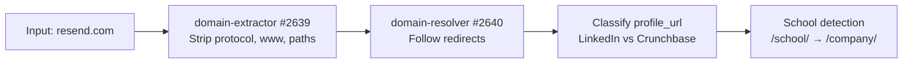
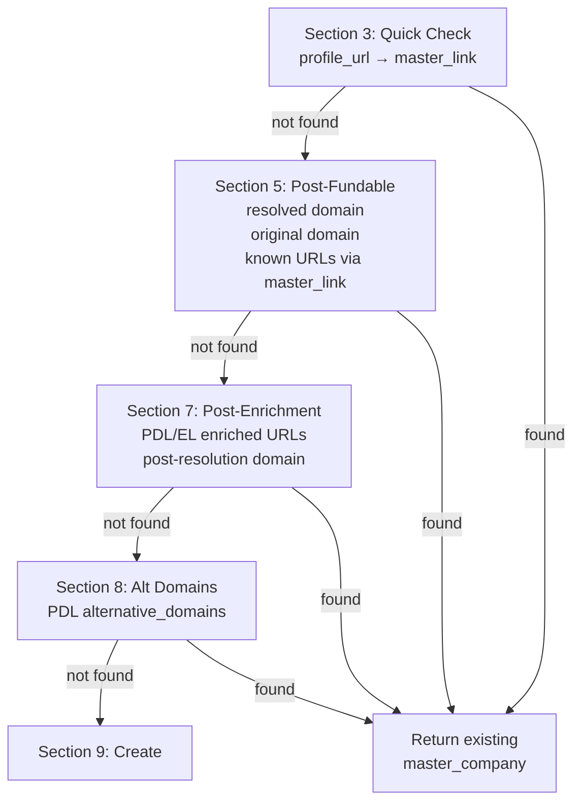
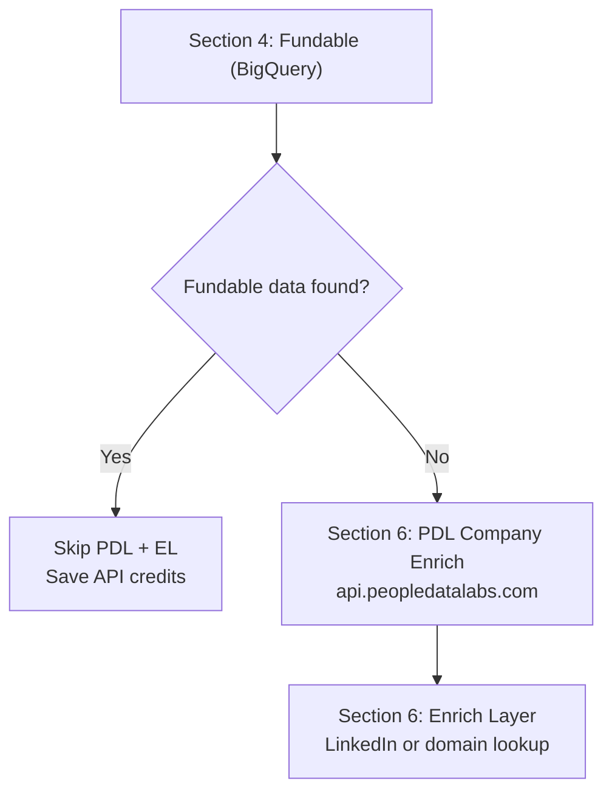
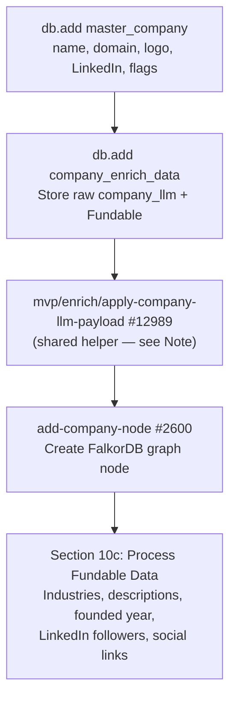
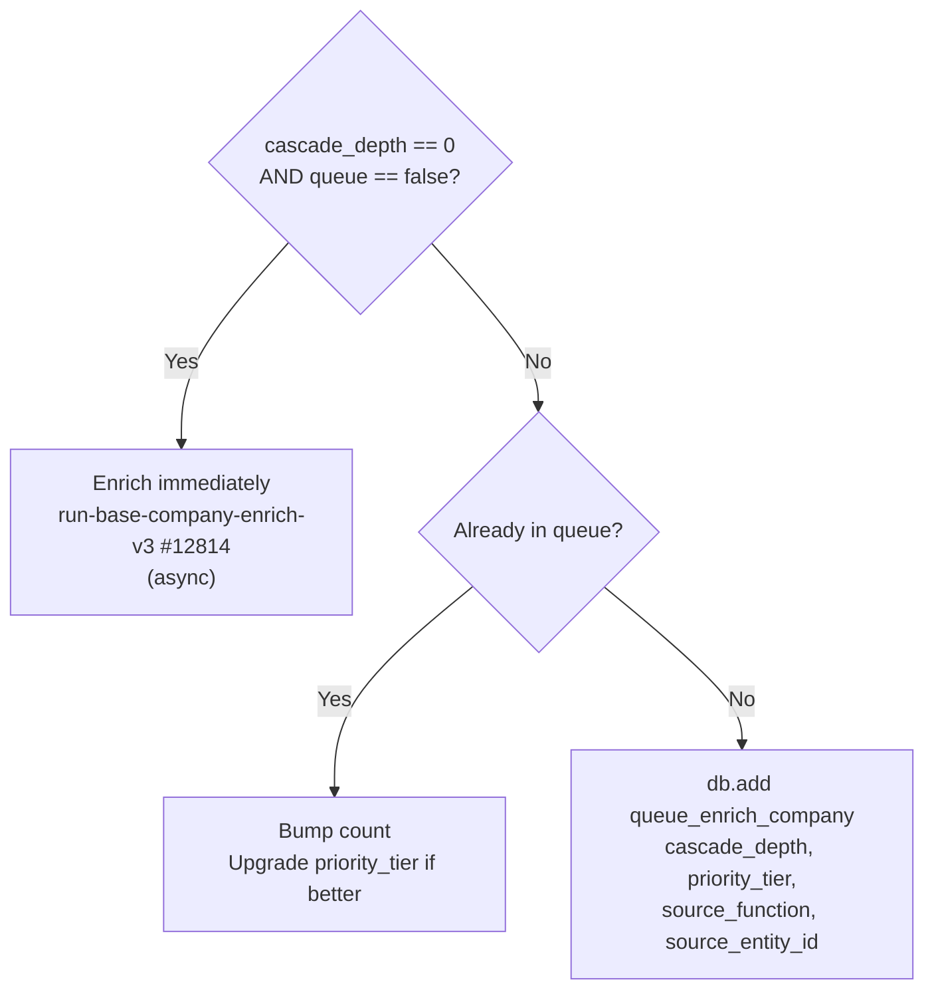

The company waterfall begins when any function calls `mvp/get-add/master-company`. This page walks through the full flow using **resend.com** as the running example. See [Core Concepts](/guides/enrichment/waterfall/core-concepts) for shared mechanics (cascade depth, priority tiers, queue tables).

---

## Entry Point

```text
mvp/get-add/master-company — #12558
```

**Current version:** v1.9 (2026-04-13) — removed deprecated `funding_round_data_raw` write. See function description in Xano for the full changelog (v1.5 through v1.9).

Called with:
```json
{
  "domain": "resend.com",
  "profile_url": "https://www.linkedin.com/company/resend",
  "company_name": "Resend",
  "cascade_depth": 0,
  "priority_tier": 1
}
```

---

## Phase 1: Input Cleanup (Sections 2a-2d)



The raw input is normalized:
- **Domain extraction**: `https://www.resend.com/pricing` becomes `resend.com`
- **Redirect resolution**: If `resend.com` redirected from an old domain, both are tracked (`$varDomain` + `$varOriginalDomain`)
- **Profile classification**: LinkedIn URLs are stored in `$varLinkedInUrl`, Crunchbase in `$varCrunchbaseUrl`
- **School detection**: LinkedIn `/school/` URLs are flagged and rewritten to `/company/`

---

## Phase 2: Dedup Cascade (Sections 3 → 5 → 7 → 8)

Before creating anything, the function runs a **four-layer dedup check** to find existing records:



Each check queries `master_company` by domain or `master_link` by URL. If a match is found at any layer, the existing company is returned immediately — no new record is created.

For `resend.com`, assuming it's the first time:
1. **Section 3**: No `master_link` for `linkedin.com/company/resend` yet
2. **Section 5**: No `master_company` with `company_domain = resend.com` yet
3. **Section 7**: PDL/EL enriched URLs checked — still nothing
4. **Section 8**: PDL `alternative_domains` checked — still nothing
5. Falls through to **Section 9: Create**

---

## Phase 3: External API Enrichment (Sections 4, 6)

Between dedup layers, external APIs are called to gather data:



**Fundable** (Section 4) always runs first — it's our own BigQuery dataset, zero external API cost. If Fundable returns data for `resend.com`, PDL and Enrich Layer are skipped entirely (v1.7 optimization).

**When `cascade_depth > 0`**: Both PDL and Enrich Layer are skipped regardless. The entity is created from Fundable data + input params only.

For `resend.com` at depth 0 with no Fundable match:

| API | Endpoint | Data Retrieved |
|-----|----------|----------------|
| **Fundable** | BigQuery | domain, company name, LinkedIn, Crunchbase, Pitchbook, funding rounds, founded date |
| **PDL** | `/v5/company/enrich?website=resend.com` | display_name, profiles, alternative_domains, industry, size, website |
| **Enrich Layer** | `company-linkedin` or `company-domain` | name, industry, categories, specialties, description, HQ address, banner image |

---

## Phase 4: Record Creation (Section 9)

With all enrichment data gathered and no existing match found:



For `resend.com`, this creates:
- **master_company** record with `company_name: "Resend"`, `company_domain: "resend.com"`, logo from logo.dev
- **company_enrich_data** storing the raw `company_llm` payload + Fundable response
- **company_financial** (created inside the helper) with `company_type`, `is_public`, `ticker`, `stock_label`, `primary_exchange`, `stock_link`, `went_public_on`, `funding_total`, `revenue`
- **master_link** entries for LinkedIn, Crunchbase, domain, plus every LLM-discovered + Serper-augmented social URL (`data_source_id: 100`)
- **Industries and specialties** from the LLM payload (`industry.primary` / `industry.secondary` / `tags`) plus Fundable
- **About/descriptions** from LLM `headline` + `summary`, plus Fundable
- **HQ address** + **other office locations** from the LLM `headquarters` + `other_locations` blocks
- **Contact email + phone** from LLM `email_address` / `phone_number`
- **Company node** in the FalkorDB graph (after the helper has populated the relational tables)

<Note>
**v2.5 (2026-05-12)** — Section 10a (Associate Links) + Section 10b (Process LLM Enrich) + the inline `db.add company_financial` create were extracted into `mvp/enrich/apply-company-llm-payload` (#12989). The helper is now the single source of truth for "translate `company_enrich_data.company_llm` into relational tables." Both fresh creates (here) and the upcoming `run-base-company-enrich-v4` step 3 (backfilled records) call the same helper. Section 10c (Fundable processing) stays inline because it reads from `company_enrich_data.fundable`, not `company_llm`.

As of v1.9 (2026-04-13), the deprecated `funding_round_data_raw` field write was removed — funding data flows exclusively through `add-all-fundable-deals` and the Fundable deal nodes.
</Note>

---

## Phase 5: Enrichment Dispatch (Section 11)

The final routing decision depends on cascade depth and queue flag:



For `resend.com` at depth 0: **immediate enrichment** fires asynchronously. This triggers the full company enrichment pipeline (LLM bios, social scraping, website analysis, etc.).

For a depth-1 company discovered during person enrichment: **queued** with the source function and priority tier recorded.

<Info>
v1.8 (2026-04-13) fixed a bug where `$companyAdded` was never set to true, so enrichment/queue never fired on fresh creates. All new companies now correctly reach Section 11.
</Info>

---

## Phase 6: Name Correction (Section 12)

A final pass checks if PDL returned a `display_name` that differs from the current `company_name`. If so, the canonical PDL name wins. This catches cases where the input name was informal or incomplete.

---

## run-base-company-enrich-v3 Phases

```text
mvp/enrich/run-base-company-enrich-v3 — #12814
```

**Current version:** v3.5 (2026-05-11) — **Removed Phase 1 (PDL) and Phase 2 (Enrich Layer) entirely.** Removed the PDL/EL-driven name-correction step. Added `mvp/enrich/get-exa-company-c-suite` #12988 as a new always-on first step that writes Exa founder/key-employee results to `company_enrich_data.exa_c_suite`. `enrich_history_company.data_source_id` updated from `78` (Base Company Enrich) to `101` (Exa) — the orchestrator's history row is now tagged by primary external source. v3.4 (2026-04-15) removed stale XanoScript comment about `resolve-company-specialties` wiring. v3.1 (2026-04-13) added `cascade_depth` input passed to `process-yc-people` and `add-all-fundable-deals`.

The orchestrator runs these steps in order. Every step is wrapped in its own `try_catch` — failures append a `log_crash` row with `note: "CRASH: {step}"` and flip `$hasCrash = true`, but later steps still run. The final `enrich_history_company` row records `enrich_success: true` only when no step crashed.

| # | Step | What It Does |
|:-:|------|-------------|
| — | **Setup** (inline) | `db.add enrich_history_company` (`data_source_id: 101`, `processing: true`); load `master_company`. |
| 1 | **get-exa-company-c-suite** #12988 | **Exa founder + key-employee search.** Always runs. Inputs: `master_company.company_name`, `linkedin_url`, `company_domain`, `expand_companies: true`. Writes the response (matches, expanded company history, education, costs) to `company_enrich_data.exa_c_suite` when the enrich-data row exists. Followed by the `company_enrich_data` early-return guard — if no enrich-data row exists, logs `EARLY RETURN` to `log_crash` and returns. |
| 2 | **process-company-phase-3** #12799 — YC (v1.1) | YC detection/scrape + YC data processing + `process-yc-people` (receives `cascade_depth` so YC batch-mates inherit the tree). |
| 3 | **process-company-phase-5** #12809 — Fundable backfill | Lookup + industries + abouts + address + links + follower counts from Fundable. |
| 4 | **process-company-phase-6** #12810 — Link res + financial | Canonicalize profile URLs; populate `company_financial`. |
| 5 | **process-company-phase-7** #12813 — Deals (v1.1) | Calls `add-all-fundable-deals` #12703 (v2.0, 2026-04-19). Walks **both** `fundable_deals WHERE organization_id=X` (rounds this org raised) **and** `fundable_institutional_investments WHERE organization_id=X` (rounds this org invested in), routing each through `mvp/investor/cascade-deal-participants` #12856 — single source of truth for deal cascade shared with `process-person-phase-9` v3.0. Creates Funding_Round nodes, RAISED + INVESTED_IN / LEAD_INVESTED_IN / INVESTMENT_PARTNER_IN edges, and writes the IPO/exit signal to `company_financial.is_public` on the target org. |
| 6 | **resolve-company-specialties** #12746 | Reads specialties from `speciality_join`, embeds each, vector-searches against `SubDomainExpertise` nodes, matches or creates new nodes, creates `SPECIALIZES_IN` FalkorDB edges (weight = `min(round(10 + match_score*80), 50)`). Writes new `SubDomainExpertise` nodes back to `sub_domain_expertise` table. |
| 7 | **llm-company-about** (`mvp/about/llm-company-about`) | LLM-generated company description → `master_company.company_about`. |
| 8 | **add-company-locations** (`mvp/address/add-company-locations`) | Resolve HQ + office addresses and write to location tables. |
| 9 | **update-company-node** (`mvp/node/update-company-node`) | FalkorDB Company node property sync (final graph pass). |
| — | **Finalize** (inline) | Edit `enrich_history_company`: `enrich_success: true` + `processing: false` if no crashes; else `enrich_success: false`. Writes one `qa_passed: true` row to `log_crash` on clean completion. |

<Note>
**v3.5 removed PDL + Enrich Layer + name correction.** Prior versions ran `process-company-phase-1` (PDL, fn 12797) and `process-company-phase-2` (Enrich Layer, fn 12798) at the top of the orchestrator — both are gone. The inline name-correction step that resolved `master_company.company_name` from `company_enrich_data.people_data_labs.display_name` (with EL fallback) was also removed. The `people_data_labs` and `enrich_layer` JSON columns still exist on `company_enrich_data` but are no longer being populated by this orchestrator. Note: `get-add/master-company` still calls PDL + Enrich Layer at initial create time — only the post-create orchestrator was changed.
</Note>


---

## Cascade Example: resend.com at Depth 0 (Company Seed)

Here's what happens end-to-end when `resend.com` enters as a seed entity:

```
Depth 0: resend.com
├── get-add/master-company (immediate enrichment)
│   └── run-base-company-enrich-v3 (async)
│       ├── LLM bios, social scraping, website analysis
│       └── Discovers people (founders, executives)
│           ├── get-add/master-person (cascade_depth: 1)
│           │   └── Queued to queue_enrich_person (tier 1)
│           │       └── When processed:
│           │           ├── resolve-edges-work discovers employers
│           │           │   └── get-add/master-company (cascade_depth: 2)
│           │           │       └── Queued to queue_enrich_company (tier 2)
│           │           └── resolve-investors-edges discovers VCs
│           │               └── get-add/master-company (cascade_depth: 2)
│           │                   └── Queued to queue_enrich_company (tier 2)
│           └── Discovers investors
│               └── get-add/master-person (cascade_depth: 1)
│                   └── Queued to queue_enrich_person (tier 3)
```

Each hop increments `cascade_depth`. External APIs are only called at depth 0 during the `get-add` phase. Deeper entities rely on Fundable data and input params, then get fully enriched when the queue processes them.

---

## Cascade Example: Person Investor at Depth 0 (Full Bloom-Out)

Here's what happens when a person who invested in a company enters as a seed entity. The bloom-out spans two CRON cycles: Phase 9 fires the cascade helper for each of the person's angel investments immediately, then SpaceX's own enrichment later discovers every other round it raised.

```
Depth 0: Person (investor)
├── get-add/master-person (immediate enrichment)
│   └── run-base-person-enrich (all 12 phases, async)
│       ├── Phase 3: Process PDL → identifies current employer
│       │   └── get-add/master-company (cascade_depth: 0, queue: false)
│       │       └── Immediate enrich
│       │
│       └── Phase 9 (v3.0): Investor Pipeline + Deal Cascade
│           └── Fundable data contains: Person invested in SpaceX Series C (2021)
│               └── foreach angel investment → cascade-deal-participants #12856
│                   ├── SpaceX portfolio co (cascade_depth: 1, tier 2) → queue_enrich_company
│                   ├── IPO signal → company_financial.is_public (if SpaceX exits)
│                   ├── Funding_Round node + RAISED edge (this round only, for now)
│                   └── resolve-investors-edges on THIS round:
│                       ├── Co-angels on Series C → queue_enrich_person (tier 3)
│                       ├── VC firms on Series C → queue_enrich_company (tier 2)
│                       └── VC partners (institutional_investments_person)
│                           → queue_enrich_person (tier 2)
│
│       └── When SpaceX processes via CRON → run-base-company-enrich-v3
│           └── Phase 7: add-all-fundable-deals v2.0 (target-side + investor-side)
│               └── cascade-deal-participants on EACH SpaceX round
│                   ├── Series A (2005), Series B (2008), Series C, Series D, … [all rounds]
│                   └── Each round:
│                       ├── Funding_Round node + RAISED edge
│                       ├── All co-investors on that round
│                       │   (Sequoia, Valor, GV, Salesforce Ventures, Khosla, …)
│                       └── All VC partners tied to those firms on that round
│                           → queue_enrich_company / queue_enrich_person (depth 2)
│
└── Bloom-out complete when all CRON cycles finish
    Net result: Single person seed → 1 company (depth 0) + portfolio + co-investors (depth 1)
                → Every SpaceX round surfaced as its own Funding_Round node
                → Every investor (firm + partner) on every round (depth 2)
                → IPO/exit signal set on any portfolio co that went public
                → Full transitive closure of company + investor graph
```

**Impact Analysis:**
- **Depth 0 cost**: 1 person (all phases, PDL + EL + external APIs)
- **Depth 1 cost**: Portfolio companies (tier 2) + co-angels (tier 3) + VC firms (tier 2) + VC partners (tier 2) surfaced directly by Phase 9's cascade helper — queued, process when CRON runs
- **Depth 2 cost**: When each depth-1 portfolio co processes, `add-all-fundable-deals` v2.0 surfaces every round it raised + every investor on those rounds — ~5-10 investor companies and ~30-50 investor people per portfolio co, all queued at tier 2
- **Total entities created**: ~40-60 companies + people from a single person seed
- **API spend**: Only depth 0 person calls external APIs; all depth-1 and depth-2 entities use Fundable data only until their turn in the queue
- **Idempotency**: Queue upsert semantics mean the same VC firm surfacing via a co-angel AND via a portfolio co gets one queue entry with `count` incremented and best-tier held
