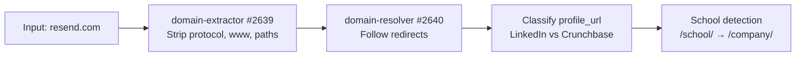
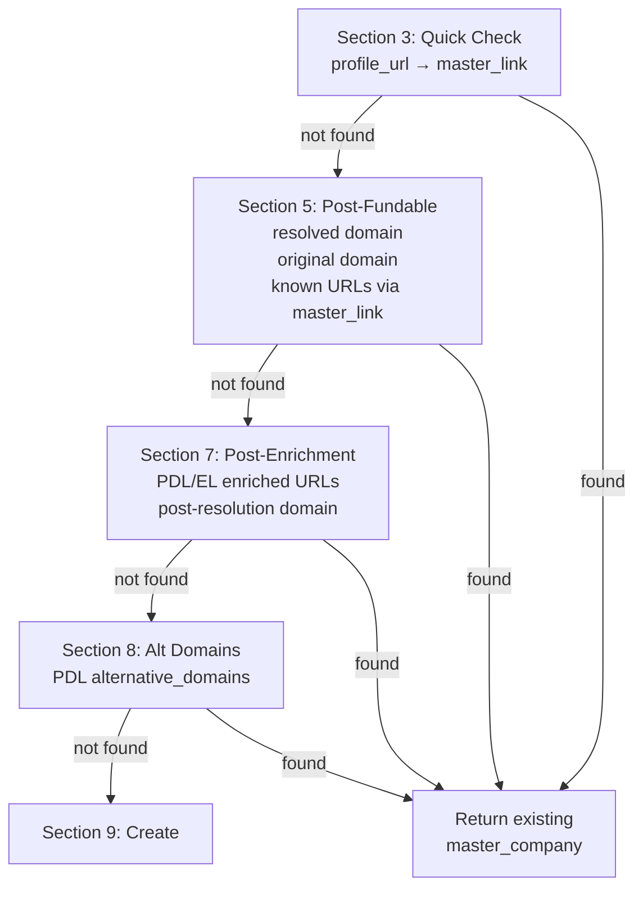
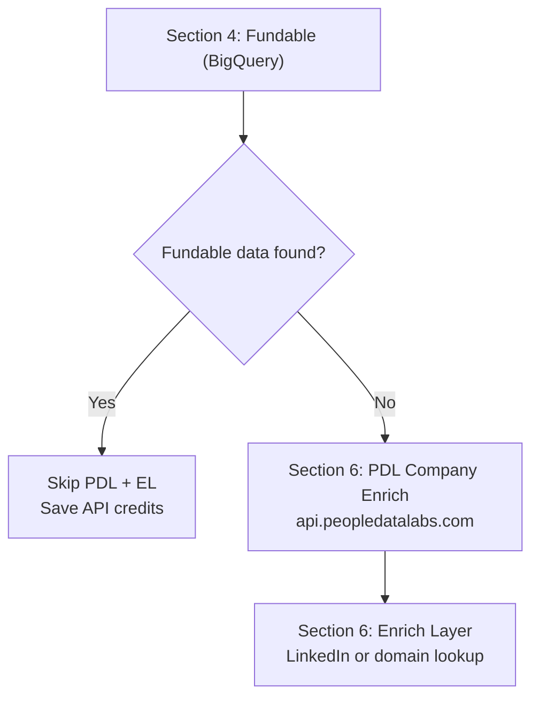
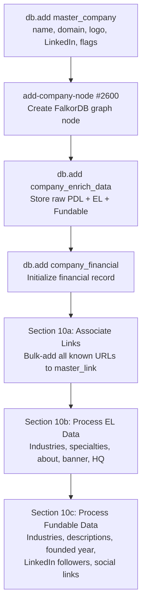
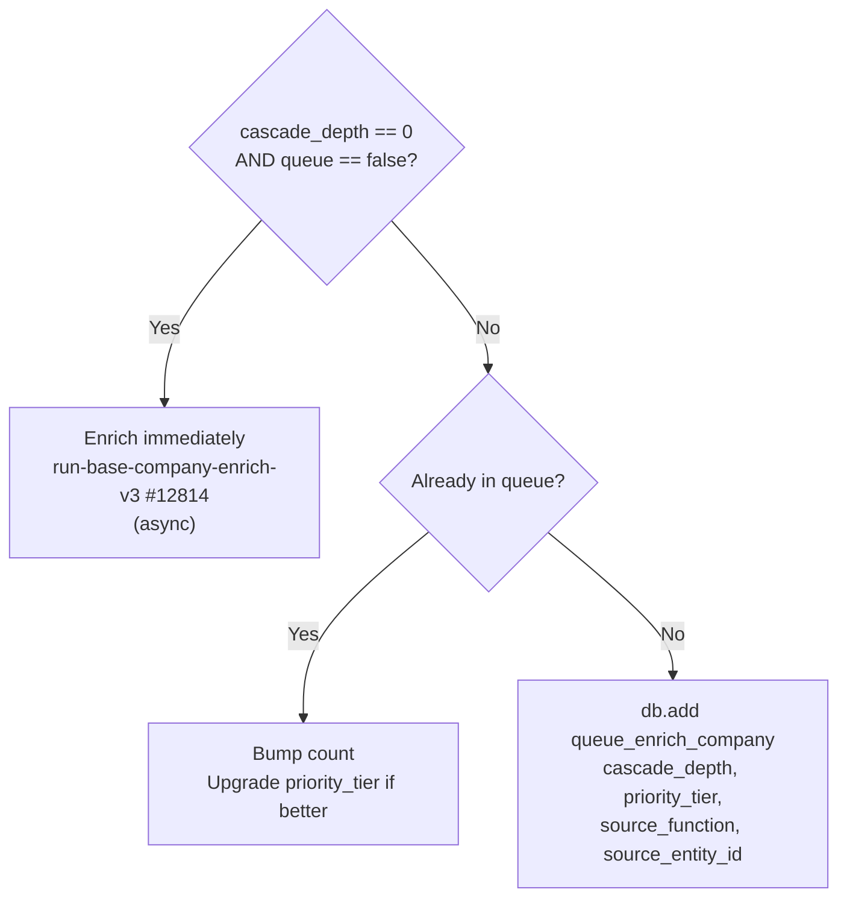

The company waterfall begins when any function calls `mvp/get-add/master-company`. This page walks through the full flow using **resend.com** as the running example. See [Core Concepts](/guides/enrichment/waterfall/core-concepts) for shared mechanics (cascade depth, priority tiers, queue tables).

---

## Entry Point

```text
mvp/get-add/master-company — #12558
```

**Current version:** v1.9 (2026-04-13) — removed deprecated `funding_round_data_raw` write. See function description in Xano for the full changelog (v1.5 through v1.9).

Called with:
```json
{
  "domain": "resend.com",
  "profile_url": "https://www.linkedin.com/company/resend",
  "company_name": "Resend",
  "cascade_depth": 0,
  "priority_tier": 1
}
```

---

## Phase 1: Input Cleanup (Sections 2a-2d)



The raw input is normalized:
- **Domain extraction**: `https://www.resend.com/pricing` becomes `resend.com`
- **Redirect resolution**: If `resend.com` redirected from an old domain, both are tracked (`$varDomain` + `$varOriginalDomain`)
- **Profile classification**: LinkedIn URLs are stored in `$varLinkedInUrl`, Crunchbase in `$varCrunchbaseUrl`
- **School detection**: LinkedIn `/school/` URLs are flagged and rewritten to `/company/`

---

## Phase 2: Dedup Cascade (Sections 3 → 5 → 7 → 8)

Before creating anything, the function runs a **four-layer dedup check** to find existing records:



Each check queries `master_company` by domain or `master_link` by URL. If a match is found at any layer, the existing company is returned immediately — no new record is created.

For `resend.com`, assuming it's the first time:
1. **Section 3**: No `master_link` for `linkedin.com/company/resend` yet
2. **Section 5**: No `master_company` with `company_domain = resend.com` yet
3. **Section 7**: PDL/EL enriched URLs checked — still nothing
4. **Section 8**: PDL `alternative_domains` checked — still nothing
5. Falls through to **Section 9: Create**

---

## Phase 3: External API Enrichment (Sections 4, 6)

Between dedup layers, external APIs are called to gather data:



**Fundable** (Section 4) always runs first — it's our own BigQuery dataset, zero external API cost. If Fundable returns data for `resend.com`, PDL and Enrich Layer are skipped entirely (v1.7 optimization).

**When `cascade_depth > 0`**: Both PDL and Enrich Layer are skipped regardless. The entity is created from Fundable data + input params only.

For `resend.com` at depth 0 with no Fundable match:

| API | Endpoint | Data Retrieved |
|-----|----------|----------------|
| **Fundable** | BigQuery | domain, company name, LinkedIn, Crunchbase, Pitchbook, funding rounds, founded date |
| **PDL** | `/v5/company/enrich?website=resend.com` | display_name, profiles, alternative_domains, industry, size, website |
| **Enrich Layer** | `company-linkedin` or `company-domain` | name, industry, categories, specialties, description, HQ address, banner image |

---

## Phase 4: Record Creation (Section 9)

With all enrichment data gathered and no existing match found:



For `resend.com`, this creates:
- **master_company** record with `company_name: "Resend"`, `company_domain: "resend.com"`, logo from logo.dev
- **Company node** in the FalkorDB graph
- **company_enrich_data** storing raw API responses
- **master_link** entries for LinkedIn, Crunchbase, Pitchbook, domain, PDL profiles
- **Industries and specialties** from EL + Fundable
- **About/descriptions** from EL tagline, description + Fundable short/long/crunchbase descriptions
- **HQ address** from both EL and Fundable
- **LinkedIn follower count** from Fundable

<Note>
As of v1.9 (2026-04-13), the deprecated `funding_round_data_raw` field write was removed — funding data now flows exclusively through `add-all-fundable-deals` and the Fundable deal nodes.
</Note>

---

## Phase 5: Enrichment Dispatch (Section 11)

The final routing decision depends on cascade depth and queue flag:



For `resend.com` at depth 0: **immediate enrichment** fires asynchronously. This triggers the full company enrichment pipeline (LLM bios, social scraping, website analysis, etc.).

For a depth-1 company discovered during person enrichment: **queued** with the source function and priority tier recorded.

<Info>
v1.8 (2026-04-13) fixed a bug where `$companyAdded` was never set to true, so enrichment/queue never fired on fresh creates. All new companies now correctly reach Section 11.
</Info>

---

## Phase 6: Name Correction (Section 12)

A final pass checks if PDL returned a `display_name` that differs from the current `company_name`. If so, the canonical PDL name wins. This catches cases where the input name was informal or incomplete.

---

## run-base-company-enrich-v3 Phases

```text
mvp/enrich/run-base-company-enrich-v3 — #12814
```

**Current version:** v3.4 (2026-04-15) — removed stale XanoScript comment about `resolve-company-specialties` needing manual wiring (it's been wired in as step 7 all along). v3.3 (2026-04-13) also skips Phase 2 (EL) when Fundable data exists; v3.2 skipped Phase 1 (PDL) when `fundable_org_id` is set. v3.1 added `cascade_depth` input passed to `process-yc-people` and `add-all-fundable-deals`.

The orchestrator runs these steps in order. Every step is wrapped in its own `try_catch` — failures append a `log_crash` row with `note: "CRASH: {step}"` and flip `$hasCrash = true`, but later steps still run. The final `enrich_history_company` row records `enrich_success: true` only when no step crashed.

| # | Step | What It Does |
|:-:|------|-------------|
| — | **Setup** (inline) | `db.add enrich_history_company` (`data_source_id: 78`, `processing: true`); load `master_company` + `company_enrich_data`. Early-returns if `company_enrich_data` missing (logs `EARLY RETURN` to `log_crash`). |
| 1 | **process-company-phase-1** #12797 — PDL | Domain redirect check + PDL data processing. **Skipped when `master_company.fundable_org_id` is set** (v3.2, 2026-04-13) — logs `SKIP phase-1 (PDL) — Fundable data exists, fundable_org_id: {id}`. |
| 2 | **process-company-phase-2** #12798 — Enrich Layer | EL backfill (currently disabled) + EL data processing. **Skipped when `fundable_org_id` is set** (v3.3, 2026-04-13) — logs `SKIP phase-2 (EL) — Fundable data exists`. |
| 3 | **process-company-phase-3** #12799 — YC (v1.1) | YC detection/scrape + YC data processing + `process-yc-people` (receives `cascade_depth` so YC batch-mates inherit the tree). |
| 4 | **process-company-phase-5** #12809 — Fundable backfill | Lookup + industries + abouts + address + links + follower counts from Fundable. |
| 5 | **process-company-phase-6** #12810 — Link res + financial | Canonicalize profile URLs; populate `company_financial`. |
| 6 | **process-company-phase-7** #12813 — Deals (v1.1) | Calls `add-all-fundable-deals` #12703 → creates funding round nodes + investor edges (which call `resolve-investors-edges` #12702 with `cascade_depth`). |
| 7 | **resolve-company-specialties** #12746 | Reads specialties from `speciality_join`, embeds each, vector-searches against `SubDomainExpertise` nodes, matches or creates new nodes, creates `SPECIALIZES_IN` FalkorDB edges (weight = `min(round(10 + match_score*80), 50)`). Writes new `SubDomainExpertise` nodes back to `sub_domain_expertise` table. |
| 8 | **llm-company-about** (`mvp/about/llm-company-about`) | LLM-generated company description → `master_company.company_about`. |
| 9 | **Name correction** (inline try_catch) | If PDL `display_name` exists and differs from `company_name`, overwrite; else if EL `name` exists and differs, fall back to EL. |
| 10 | **add-company-locations** (`mvp/address/add-company-locations`) | Resolve HQ + office addresses and write to location tables. |
| 11 | **update-company-node** (`mvp/node/update-company-node`) | FalkorDB Company node property sync (final graph pass). |
| — | **Finalize** (inline) | Edit `enrich_history_company`: `enrich_success: true` + `processing: false` if no crashes; else `enrich_success: false`. Writes one `qa_passed: true` row to `log_crash` on clean completion. |


---

## Cascade Example: resend.com at Depth 0

Here's what happens end-to-end when `resend.com` enters as a seed entity:

```
Depth 0: resend.com
├── get-add/master-company (immediate enrichment)
│   └── run-base-company-enrich-v3 (async)
│       ├── LLM bios, social scraping, website analysis
│       └── Discovers people (founders, executives)
│           ├── get-add/master-person (cascade_depth: 1)
│           │   └── Queued to queue_enrich_person (tier 1)
│           │       └── When processed:
│           │           ├── resolve-edges-work discovers employers
│           │           │   └── get-add/master-company (cascade_depth: 2)
│           │           │       └── Queued to queue_enrich_company (tier 2)
│           │           └── resolve-investors-edges discovers VCs
│           │               └── get-add/master-company (cascade_depth: 2)
│           │                   └── Queued to queue_enrich_company (tier 2)
│           └── Discovers investors
│               └── get-add/master-person (cascade_depth: 1)
│                   └── Queued to queue_enrich_person (tier 3)
```

Each hop increments `cascade_depth`. External APIs are only called at depth 0 during the `get-add` phase. Deeper entities rely on Fundable data and input params, then get fully enriched when the queue processes them.
