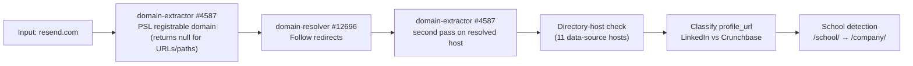
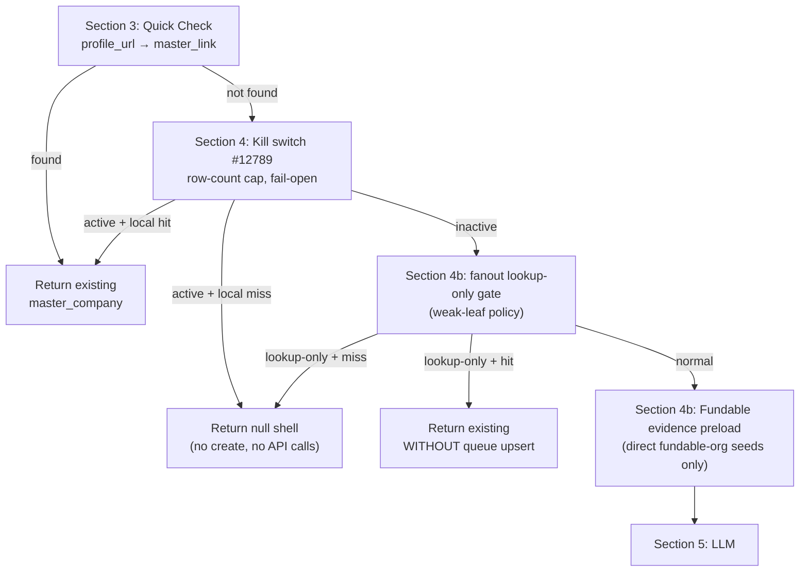
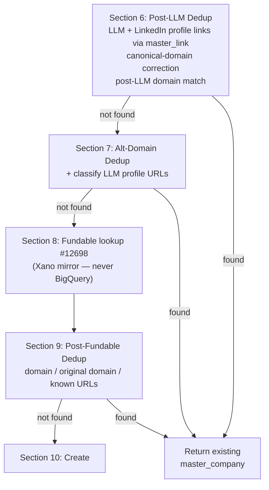
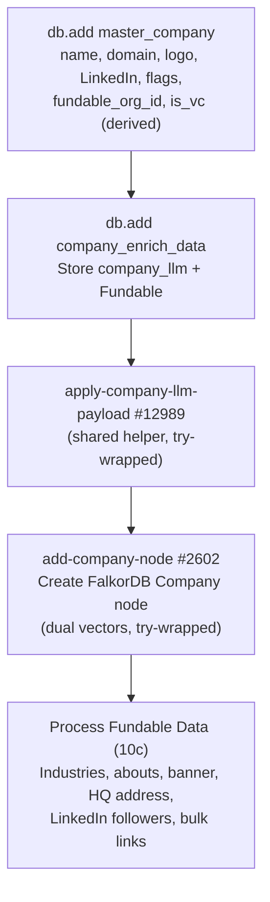
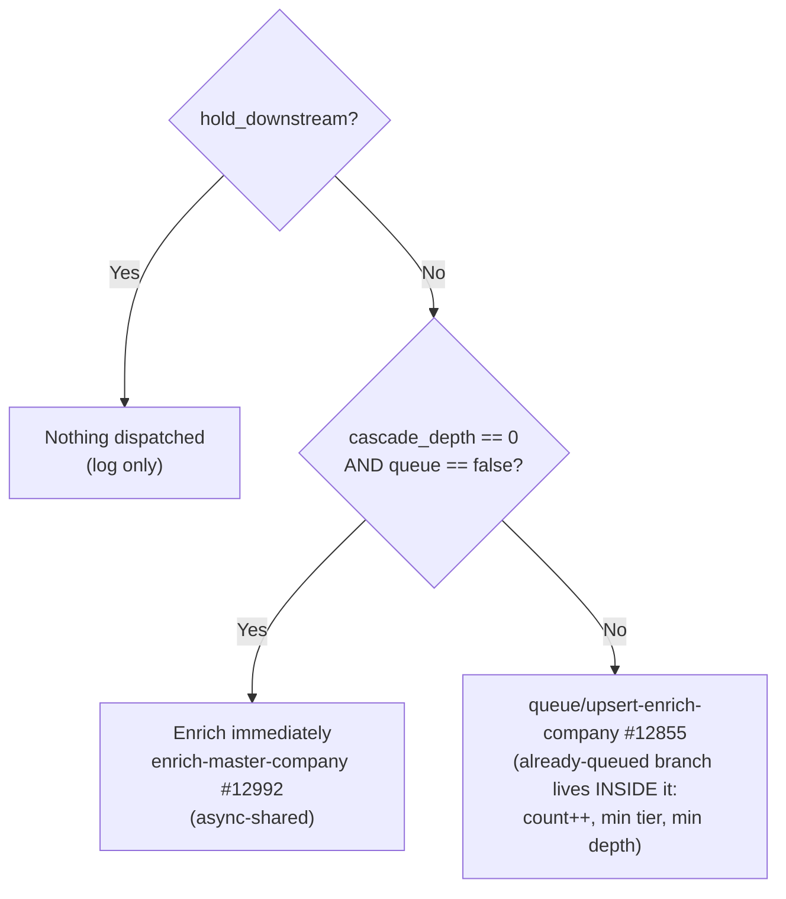

Every company enters the waterfall through **one synchronous get-add gate** — there is no queue-first path. The gate dedups, sources (LLM \+ Fundable), and creates inline; seeds dispatch the [15-step orchestrator](/guides/enrichment/waterfall/company-waterfall#enrich-master-company--15-step-gated-orchestrator) immediately (async), while cascade leaves discovered at depth \> 0 land in the queue for [Company Waterfall Crons](/guides/enrichment/waterfall/company-crons) to drain. Architecture spec: [Company Waterfall overview](/guides/enrichment/waterfall/company-waterfall) · function roster: [Company Waterfall Functions](/guides/enrichment/waterfall/company-functions) · table schemas: [Company Waterfall Tables](/guides/enrichment/waterfall/company-tables).

<Card icon="play">
  ```text
  mvp/get-add/master-company-new — #12558
  ```

  <div style={{border: "2px solid #3b82f6", borderRadius: "8px", padding: "14px 16px", margin: "12px 0 16px", background: "rgba(59, 130, 246, 0.06)"}}>
    <div style={{fontSize: "0.78rem", fontWeight: 800, letterSpacing: "0.08em", textTransform: "uppercase", color: "#1d4ed8", marginBottom: "8px"}}>Live inputs</div>
    <ul style={{margin: 0, paddingLeft: "1.2rem"}}>
      <li><code>domain</code> — Domain seed; normalized, redirect-resolved, used for local dedup, LLM identity, and Fundable lookup.</li>
      <li><code>profile_url</code> — LinkedIn or Crunchbase profile URL seed; checked first against <code>master_link</code> and then fed into enrichment/dedup.</li>
      <li><code>company_name</code> — Name hint for placeholder blocking, LLM identity, display-name fallback, and source matching.</li>
      <li><code>data_source_id</code> — Legacy numeric provenance input retained for compatibility; new attribution should use text <code>source</code>.</li>
      <li><code>source</code> — Business attribution string for records created from this call, such as <code>User Input</code>, <code>Fundable</code>, or <code>Company_LLM</code>.</li>
      <li><code>is_vc</code> — Legacy hint; the live gate derives VC status from domain and evidence instead of trusting this input.</li>
      <li><code>is_school</code> — School hint used with domain/profile evidence when creating the company row and node label.</li>
      <li><code>queue</code> — Forces queued enrichment instead of immediate <code>enrich-master-company</code> dispatch.</li>
      <li><code>hold_downstream</code> — QA/backfill containment; creates or returns the company but suppresses enrich and queue fan-out.</li>
      <li><code>return_fast</code> — Skips the synchronous LLM preflight on fresh creates so the async orchestrator owns the LLM waterfall.</li>
      <li><code>lookup_only</code> — Fan-out governor flag; match existing companies only, never create a new shell.</li>
      <li><code>allow_create</code> — Explicit create permission; <code>false</code> makes weak leaf calls lookup-only.</li>
      <li><code>cascade_depth</code> — Waterfall depth control; depth greater than 0 forces the queue path.</li>
      <li><code>priority_tier</code> — Queue priority hint passed into <code>queue_enrich_company</code>; lower tiers are processed first.</li>
      <li><code>source_function</code>, <code>source_entity_id</code>, <code>source_entity_uuid</code>, <code>source_entity_type</code> — Trace the upstream function/entity that discovered this company.</li>
      <li><code>seeded_by_user</code> — User id for the person or operator who seeded this company.</li>
    </ul>
  </div>

  **v2.18 (2026-06-23) \+ unversioned 2026-06-25/2026-06-29 changes — THE entry point.** Get-or-create for `master_company`: placeholder/employment-status guard (self-employed/freelance/stealth-type slugs return null before any work) → domain cleanup (#4587 → #12696 → #4587 again, then the 11-host directory-source check) → §3 profile-URL quick-check dedup → kill switch #12789 (ON = local-lookup-only, ALL new creation blocked) → fan-out governor lookup-only gate → Fundable evidence preload (v2.12 `source_urls`/`source_facts`) → §5 **sync** LLM preflight #12974 (skipped when `return_fast: true`; Fundable §8 still runs) → post-LLM link/domain dedup \+ canonical-domain correction \+ conservative `is_vc` classification (incl. the 2026-06-29 `.vc`-TLD evidence rule) → alt-domain dedup → Fundable lookup #12698 → post-Fundable dedup ladder → create: `master_company` row \+ `company_enrich_data` \+ apply payload #12989 \+ Company node #2602 \+ Fundable fanout → §11 dispatch (exactly one): `hold_downstream` → nothing; depth 0 \+ no queue → **async** #12992; else **sync** queue upsert #12855.

  The 2026-06-25 fan-out governor turns weak-source calls lookup-only (explicit `lookup_only` / `allow_create: false`, all `resolve-edges-work` at depth\>0, the weak edge resolvers at depth\>0, `process-person-phase-3` at depth\>1, `cascade-deal-participants` at depth\>0): match without spawning work, or return a null shell instead of creating. **As-built (flagged):** the §11 queue path coerces an explicit `priority_tier: 0` to 4 (`first_notempty:4`). **Xano artifact — do not reimplement:** the dead `is_vc` input, the dead `$modelUsed` hoist, and the §6a `"https://www."` double-prefix link lookup. The old page's `!debug.stop` note is stale — removed in v2.18. The full section-by-section walkthrough follows below.
</Card>

## Calling contract

**Current version:** v2.18 (2026-06-23) plus unversioned 2026-06-25 (fan-out governor: `lookup_only` / `allow_create` / weak-leaf and depth-2\+ create blocks) and 2026-06-29 (`return_fast`, `.vc`-TLD VC evidence at create time) changes. THE single entry point of the company waterfall — every caller (app, person pipeline, deal cascade, Exa employer resolution) routes through it. The full version log is in [Historical reference](#historical-reference).

Called with:

```json
{
  "domain": "resend.com",
  "profile_url": "https://www.linkedin.com/company/resend",
  "company_name": "Resend",
  "cascade_depth": 0,
  "priority_tier": 1
}
```

## Phase 0: Placeholder guard (Section 0)

Before anything else, a blocklist lambda normalizes the LinkedIn `/company/` slug and `company_name` and rejects placeholder employers (`self employed`, `freelance`, `stealth startup community`, `unknown company`, …) and incomplete LinkedIn company URLs. A hit logs a `qa_passed: true` crash row and **returns null** — no row, no node.

## Phase 1: Input cleanup (Section 2)



The raw input is normalized:

- **Domain extraction**: `www.resend.com` becomes `resend.com` — via `npm:psl` registrable-domain parsing. **URL-shaped input (`https://…`, paths, query strings) returns `null`**, not a stripped host; callers rely on null-on-URL to blank the domain rather than persist junk.
- **Redirect resolution**: if `resend.com` redirected from an old domain, both are tracked (`$varDomain` \+ `$varOriginalDomain`), then the extractor runs again on the resolved host.
- **Directory-host check** (v2.13): 11 known directory/data-source hosts (TeaserClub, PitchBook, Tracxn, Magnitt, VentureCapitalArchive, …) flag the source domain so the canonical-domain correction in Section 6 can replace it.
- **Profile classification**: LinkedIn URLs → `$varLinkedInUrl`, Crunchbase → `$varCrunchbaseUrl`; LinkedIn `/school/` URLs are flagged and rewritten to `/company/`.

## Phase 2: Quick check, kill switch, governor gates (Sections 3–4b)



- **Section 3**: look up the incoming `profile_url` (raw, trailing-`/` trimmed) in `master_link`. A hit best-name-corrects the row, runs the queue gate, and returns immediately — no LLM, no Fundable.
- **Section 4 — kill switch**: `check-kill-switch-company` #12789 is **not a boolean env var** — it reads a row in the `environment_variables` TABLE and compares the total `master_company` row count against that numeric cap (`count >= value` ⇒ active; set the value to 0 to force ON). It is **fail-open**: any error in the check logs one crash row and returns OFF. When active, the gate answers from a local-only 4-key ladder (domain → original domain → LinkedIn link → Crunchbase link) and blocks all new creation — zero external calls.
- **Section 4b — fan-out lookup-only gate** (2026-06-25 governor): weak-source calls (explicit `lookup_only`, `allow_create: false`, work-edge resolvers at depth \> 0, deal-cascade leaves) run the same local ladder; a hit returns the existing company **without any queue upsert or enrich dispatch** — weak sources link but never spawn work. A miss returns a null shell.
- **Section 4b — Fundable evidence preload** (v2.12): when the caller passed an exact Fundable org id (`source_entity_type: "fundable_organizations"`), the org row is preloaded into `source_urls` / `source_facts` for the LLM stage.

## Phase 3: LLM enrichment (Section 5)

```text
mvp/enrich/new-company-enrichment — #12974
```

**Current version:** v1.17 (2026-06-04). Two-stage company enrichment, pure compute — zero writes:

1. **Stage 1** — web-grounded LLM research via OpenRouter: tier-1 `google/gemini-3.1-flash-lite` with the `openrouter:web_search` tool; **escalates to `anthropic/claude-sonnet-4.6`** when the tier-1 response fails to parse, `_meta.confidence.overall` is missing or non-numeric, **or** \< 0.7 — not only on low scores. All chat requests include `provider.data_collection = "deny"`.
2. **Stage 2** — deterministic profile discovery via Serper: one batch of 7 `site:` queries (LinkedIn, X/Twitter, Facebook, Instagram, YouTube, Crunchbase, Wellfound), merged into `data.profiles` after canonical-URL \+ identity-gate filtering, one URL per platform.

Response shape: `{ data, model_used, escalated, gemini_confidence }` — callers persist the **whole envelope** and must check `data._error`. Inputs `source_urls` / `source_facts` (v1.10–v1.15) carry exact evidence pages and deterministic fact overrides from the Fundable preload. The gate: this stage is **skipped when `return_fast` is true** (the async orchestrator then owns the LLM waterfall) and requires at least one identity hint (domain, LinkedIn, source\_urls, or source\_facts). Prompt \+ models: [system prompts](/guides/enrichment/company-pipeline/llm-system-prompts) · [model summary](/guides/enrichment/company-pipeline/model-summary).

`apply-company-llm-payload` #12989 (v1.8) does a deterministic URL/social-handle filter before writing LLM/Serper profiles: canonical company/org profile URLs are allowed, but social handles must match company/domain signals; short aliases (\< 8 slug chars) never satisfy handle matching; an exact-known LinkedIn suppresses all other LinkedIn candidates. v1.8 (2026-07-02) fixed the filter's angel.co platform regex (`(?:wellfound\.com|angel\.co)`) — angel.co profiles previously never passed and were silently dropped.

## Phase 4: Post-LLM dedup \+ Fundable (Sections 6 → 7 → 8 → 9)



- **Section 6** dedups on the LLM-discovered profile links plus the input LinkedIn URL (via `master_link`), then runs the **canonical-domain correction** ladder (v2.13/v2.14): directory-source domains are replaced by the LLM-confirmed domain or first alt-domain, or **cleared to null** — a directory host is never persisted as `company_domain`. Then the **conservative `is_vc` classification** lambda: any `.vc`-TLD host among LLM/input/Fundable domains, or investment-firm evidence in the company-type/industry/tags blob, sets `$effectiveIsVc`. Fundable `is_investor` alone does NOT flip it.
- **Section 7** dedups each LLM alt-domain and classifies LLM profile URLs into the LinkedIn/Crunchbase slots.
- **Section 8 — Fundable**: `mvp/funding/fundable-lookup` #12698 reads the **local Xano `fundable_organizations` mirror** (the legacy BigQuery response shape is emulated; **no BigQuery query happens here** — BigQuery is only touched by the mirror-ingestion substrate). Precedence: exact `fundable_org_id` (when the caller passed `source_entity_type: "fundable_organizations"` \+ `source_entity_uuid`) \> domain \> original domain \> LinkedIn \> Crunchbase. The returned `fundable_org_id` is written onto `master_company` and reused everywhere downstream (phases 5–7, Signal NFX, thesis).
- **Section 9** (post-Fundable) dedups on the resolved domain, the original pre-redirect domain, and the known URLs (LinkedIn/Crunchbase/Pitchbook) coalesced from Fundable.

**When `cascade_depth > 0`**: the entity still goes through all sections, but Section 11 forces it into the queue regardless of the `queue` input.

For `resend.com` at depth 0 with no Fundable match:

| API | Endpoint | Data Retrieved |
| --- | --- | --- |
| **new-company-enrichment** | OpenRouter (`gemini-3.1-flash-lite` / `claude-sonnet-4.6`) \+ Serper | display\_name, legal\_name, aliases, profiles, industry, size, headquarters, other\_locations, financial signals, summary, headline |
| **Fundable** | Xano mirror of the BigQuery dataset | `fundable_org_id`, company name, LinkedIn, Crunchbase, Pitchbook, abouts, links |

## Phase 5: Record creation (Section 10)



For `resend.com`, this creates:

- **master\_company** record with `company_name: "Resend"`, `company_domain: "resend.com"`, logo URL from logo.dev, `is_vc` from the derived evidence lambda, `fundable_org_id` if Fundable matched
- **company\_enrich\_data** storing `company_llm` (full LLM envelope) \+ `fundable` (mirror row or the literal string `"no_data"`)
- **company\_financial** (created inside the helper) with `company_type`, `is_public`, `ticker`, `stock_label`, `primary_exchange`, `stock_link`, `went_public_on`, `funding_total`, `total_rounds_raised`, `revenue`
- **master\_link** entries for the canonical, identity-gated profile URLs (one per platform, `source: "Company_LLM"`)
- **Industries and specialties** from the LLM payload (`industry.primary` / `industry.secondary` / `tags`) \+ Fundable
- **About/descriptions** from LLM `headline` \+ `summary` (`source: "Company_LLM"`) \+ Fundable (`source: "Fundable"`)
- **HQ address** \+ **other office locations** from the LLM `headquarters` \+ `other_locations` blocks (geocoded via Radar)
- **Contact email \+ phone** from LLM `email_address` / `phone_number`
- **Company node** in the FalkorDB graph (dual 1536 \+ 3072 vectors; failure is tolerated — the row survives without a node, flagged for backfill)

<Note>
  **Single source of truth for LLM → relational mapping.** `mvp/enrich/apply-company-llm-payload` #12989 is called from two places: here (Section 10 on fresh creates) and from `enrich-master-company` Step 3 (records whose LLM payload was just freshly populated). The `master_company` scalar writes are preserve-existing (`existing |first_notempty: LLM` — LLM only fills blanks), and `is_school`/`is_vc` are escalate-only. **Since v1.8 (2026-07-02) the `company_financial` upsert is preserve-existing per field too**: `company_type` coalesces new → stored row → the `"Privately Held"` constant; `ticker`/`stock_label`/`primary_exchange`/`stock_link`/`went_public_on` coalesce against the existing row; `is_public` is escalate-preserving; the `funding_total` and `revenue` objects coalesce against existing values, with the v1.6 VC-payload suppression applied **after** the coalesce (a Venture Capital Firm payload still forces `funding_total` null — fund size is not company financing). `total_rounds_raised` comes _exclusively_ from `fundable.num_funding_rounds` (no LLM rounds field is ever read); `funding_total` = LLM `funding.total_raised_usd`, falling back (`first_notempty` — null/0/empty all fall through) to `round(fundable.total_raised × 1,000,000)` when that is finite and \> 0 (v1.5 deterministic Fundable fallback). *History: through v1.7 the upsert was an LLM-wins direct write — a later sparser payload overwrote previously-set columns with null; repaired 2026-07-02.*
</Note>

## Phase 6: Enrichment dispatch (Section 11)

The final routing decision — exactly one branch fires:



For `resend.com` at depth 0 with `queue: false`: **immediate enrichment** fires asynchronously via `enrich-master-company`. For a depth-1 company discovered during person enrichment: **queued** with the source function, source entity (id \+ uuid \+ type), and priority tier recorded via `mvp/queue/upsert-enrich-company` — note the `$effectiveTier = priority_tier|first_notempty:4` coercion on this path (tier 0 → 4). For QA/backfill creates with `hold_downstream: true`: **nothing** is dispatched or queued.

---

## Historical reference

<Accordion title="Entry-point version log — mvp/get-add/master-company-new #12558">
  - **2026-06-29 (unversioned)** — `return_fast` (skip the sync LLM preflight; async orchestrator owns the LLM waterfall); `.vc`-TLD domains count as VC evidence at create time.
  - **2026-06-25 (unversioned)** — fan-out governor: `lookup_only` / `allow_create` inputs; all `resolve-edges-work` calls at depth \> 0, weak edge resolvers at depth \> 0, `process-person-phase-3` at depth \> 1, and `cascade-deal-participants` at depth \> 0 become lookup-only (match, never create, never queue).
  - **v2.18 (2026-06-23)** — removed the `!debug.stop` in front of the Section-11 dispatch; direct async dispatch.
  - **v2.17 / v2.15** — `hold_downstream` enforced with `first_notnull:false` on every queue/enrich gate; `suppress_downstream` threaded onto Fundable bulk-links (also set whenever depth \> 0).
  - **v2.16** — smoke immediate-enrich branch (`source_entity_type: "investment_thesis_smoke_test"` / the load-bearing `source_function` typo).
  - **v2.14** — directory hosts are never persisted as `company_domain` (cleared to null when no LLM/alt domain exists).
  - **v2.13 (2026-06-04)** — canonical-domain correction replaces known directory/source domains (TeaserClub, Tracxn, Magnitt, VentureCapitalArchive, …) with the LLM-confirmed domain; `is_vc` derived from company-type / investment-firm evidence instead of Fundable's broad `is_investor` flag.
  - **v2.12** — Fundable evidence preload (`source_urls` / `source_facts`) for direct fundable-org seeds.
  - **v2.11 (2026-06-03)** — exact Fundable-org targeting via `source_entity_type: "fundable_organizations"` \+ `source_entity_uuid`; kill switch ON blocks ALL new creation including direct Fundable seeds.
  - **v2.10 (2026-06-02)** — `hold_downstream` for bounded QA/backfill creates.
  - **v2.7 (2026-05-23)** — `$modelUsed` hoist (now dead code). The source-string migration (canonical `source` strings; `data_source_id` kept unused for compatibility) landed separately — the old doc mislabeled it as v2.7.
  - **v2.6 (2026-05-12)** — Section-11 dispatch switched from `run-base-company-enrich-v3` #12814 (deprecated) to `enrich-master-company` #12992.
  - **v2.5** — extracted Section 10a/10b \+ the inline `company_financial` create into `apply-company-llm-payload` #12989.
  - **v2.4** — removed PDL and Enrich Layer entirely; `new-company-enrichment` #12974 became the sole LLM enrichment.
  - **2026-05-31** — placeholder/employment-status guard (Section 0).
</Accordion>
