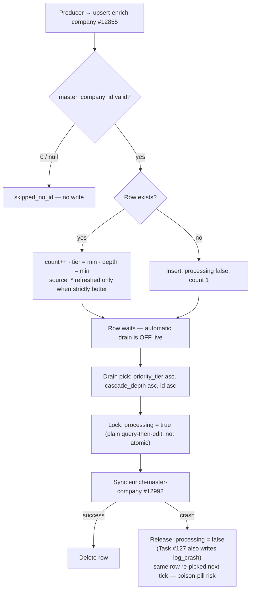

The Xano storage layer for the [Company Waterfall](/guides/enrichment/waterfall/company-waterfall). Two structural differences from the [IMDB](/guides/enrichment/waterfall/imdb-tables) and [Music](/guides/enrichment/waterfall/music-tables) storage layers matter for a rebuild:

1. **The queue is FK-keyed, not URL-keyed.** `queue_enrich_company` is keyed on `master_company_id` because the [entry gate](/guides/enrichment/waterfall/company-waterfall) (`master-company-new` #12558) creates the `master_company` row **and** its graph node synchronously before anything is queued — the queue defers only the enrichment orchestrator (#12992). In IMDB, discoveries happen before the underlying row exists, so its queues key on the normalized `imdb_url` instead.
2. **Almost nothing is DB-unique.** Outside primary keys (and two Fundable people slugs), there are **no unique indexes anywhere** in this family. All dedup is procedural — query-before-write inside specific writer functions. A Go rebuild must reproduce the exact code-level dedup keys documented below; adding unique constraints changes live behavior (concurrent writers CAN race duplicates today).

This page closes the **"Company table schemas (missing)"** gap called out in the [GCP migration plan](/guides/open-work/orbiter-univers-standalone/enrichment-gcp-migration). Function behavior lives on [Company Waterfall Functions](/guides/enrichment/waterfall/company-functions); graph writes on [Nodes](/guides/enrichment/waterfall/company-nodes) and [Edges](/guides/enrichment/waterfall/company-edges). Schemas verified against live workspace 3 (branch v1), audit date 2026-07-02.

## Table inventory

**Core pipeline**

| Table | Xano ID | Role |
| --- | :-: | --- |
| `master_company` | **#142** | Canonical company record — one row per resolved company, mirrored to a FalkorDB `Entity:Company` node via `node_uuid` |
| `company_enrich_data` | **#485** | Per-company raw-payload store — one row per company, every provider response lands in a JSON column (with the load-bearing `"no_data"` sentinel) |
| `enrich_history_company` | **#404** | Append-mostly attempt log — one row per enrichment attempt, `processing`/`enrich_success` lifecycle, doubles as the 60s debounce marker |
| `queue_enrich_company` | **#583** | The single company work queue — one row per `master_company` awaiting the orchestrator, FK-keyed on `master_company_id` |

**Financial / investor**

| Table | Xano ID | Role |
| --- | :-: | --- |
| `company_financial` | **#287** | Financial facts for the side-panel financial tab (funding, rounds, IPO, revenue) |
| `investor_profile_company` | **#478** | VC-firm investor profile from Signal NFX \+ the thesis mirror — its mere existence participates in `is_vc` classification |
| `investment_thesis` | **#709** | Declared \+ derived investment thesis (shared person/company table; GCP Cloud Run builder) |

**About / tags / taxonomy**

| Table | Xano ID | Role |
| --- | :-: | --- |
| `about_company` | **#366** | Append-only deduped about-text corpus (md5-hashed) — the LLM context for `llm-company-about` |
| `industry_join` / `industry` | **#307** / **#192** | Company↔industry tag join \+ lookup |
| `keyword_join` / `keyword` | **#306** / **#199** | Tag join \+ lookup — **no live company-side writer** (historical residue; person pipeline still writes it) |
| `speciality_join` / `specialty` | **#456** / **#455** | Company↔specialty tag join \+ lookup — note the join table's `speciality` spelling vs the `specialty` lookup |
| `sub_domain_expertise` / `domain_expertise` | **#654** / **#459** | Relational mirror of `SubDomainExpertise` graph nodes \+ the parent-domain lookup for the FK dual-write |

**Shared identity substrate** (company linkage via the direct nullable `master_company_id` FK)

| Table | Xano ID | Role |
| --- | :-: | --- |
| `master_link` | **#166** | Normalized URLs (profile \+ social links) — the profile-URL dedup key of the entry gate |
| `master_address` | **#164** | Radar-geocoded addresses; `path_triples_added` gates the graph-location drain |
| `master_email` | **#155** | Contact emails |
| `master_phone` | **#151** | LLM-formatted phone numbers |

The `my_company_*_join` tables (#314–#317) join a **user's** `my_company` row to these identity rows — written by app/UI flows, never by the enrichment waterfall.

**Logs \+ infrastructure**

| Table | Xano ID | Role |
| --- | :-: | --- |
| `log_enrichment_company` | **#632** | Get-add progress tracer — one row per #12558 invocation (NOT an error log despite its columns) |
| `log_queue_company` | **#640** | **ORPHANED** — zero live writers (name search \+ body grep of every queue producer/consumer). Retained for audit only |
| `log_crash` | **#542** | Shared per-phase observability (person, company, film & TV, music) |
| `environment_variables` | **#272** | Shared config table — holds the `kill_switch_company` **count-cap** row read by #12789 |

**Fundable BigQuery mirror family** — 18 tables (#666–#681, plus Xano-native #723 and #626), documented in [their own section below](#fundable-mirror-family).

<Note>
  **`log_crash` is shared infrastructure, not company-specific.** Company-relevant `phase` enum values: `phase-3`, `phase-5`, `phase-6`, `phase-7` (live-reachable — written by the phase functions). `phase-1` / `phase-2` writers (#12797/#12798) still exist but have had **no live caller** since the v3.5 PDL/EnrichLayer removal (2026-05-11). There is no company `phase-4` (person-side value) — the company chain is 3, 5, 6, 7 by construction. The entry gate (#12558) and orchestrator (#12992) omit `phase` entirely; their step identity lives in `note` \+ `function_name` (company strings: `mvp/get-add/master-company` — note, NOT `…-new` — `mvp/enrich/enrich-master-company`, `process-company-phase-3`…`-7`, `process-company-queue`).

  **Fixed (2026-07-02):** cron Task #127's catch block no longer sets `phase: "queue"` on its `log_crash` rows. That value is **not in the strict enum**, so the pre-fix write could make the crash logger itself fail — inside a catch block that would swallow the crash row *and* skip the `processing: false` release that follows it, wedging the queue row (it never fired live: the task ships `active = false`). A Go port should log with a valid enum value (or extend the enum), not resurrect the string.
</Note>

---

## Conventions & indexes

The conventions on this family — and where they deliberately (or accidentally) diverge from the [IMDB conventions](/guides/enrichment/waterfall/imdb-tables#conventions--indexes) the Music tables mirror:

- **`id`** int, primary key (Xano-native tables). Fundable mirror tables use **uuid** PKs (BigQuery-native ids) — mixed key types are deliberate. The bridge columns between the two worlds are `master_company.fundable_org_id` (text, soft FK → mirror uuid PK) and `fundable_organizations.master_company_id` (int, tableref → #142).
- **`created_at`** timestamp, not null, default `now` — access **private** on most tables. **Xano artifact — do not reimplement:** because the column is hidden, every pipeline write passes `created_at: "now"` with `enforce_hidden_fields = false`. In Go, just set the timestamp.
- **`updated_at`** timestamp, nullable — every pipeline `db.edit` stamps `updated_at: now` (one known exception: the Fundable `founded` backfill edit in #12558).
- **Provenance is dual-column** on the identity tables (`about_company`, `master_link`, `master_address`, `master_email`, `master_phone`): legacy `data_source_id` (int FK → `data_source` #161) **plus** canonical `source` (text) since the 2026-05-23 source-text migration. Live writers stamp only `source` (`"Company_LLM"`, `"Fundable"`, …); `data_source_id` inputs are still accepted by the helpers but **dropped on write**. The tag joins (`industry_join`, `keyword_join`, `speciality_join`) carry no provenance columns at all.
- **Text fields** carry Xano write-time `trim` validators (known exception: `master_company.logo`). A Go port must trim on write for parity.
- **JSON provider misses** store the literal string `"no_data"` inside json columns — a load-bearing sentinel, not a null (see [company_enrich_data](#company_enrich_data-485)). Port the sentinel.
- **No unique indexes** — the headline deviation. IMDB enforces `unique(imdb_url)` at the queue layer and Music adds `unique(mbid)` everywhere; the company family enforces uniqueness **only in code** (query-before-write in the sanctioned writers). Duplicate rows have been observed live (queue, 2026-04-19) — which is why raw `db.add queue_enrich_company` was banned in favor of the #12855 upsert.
- **Hot lookup keys are largely unindexed** — parity note, flag for the rebuilt store: no index on `master_company.company_domain` (the primary dedup key, ≥8 lookup sites in #12558 alone), `company_enrich_data.master_company_id`, `company_financial.master_company_id`, `investor_profile_company.master_company_id`, `queue_enrich_company.master_company_id`, or the queue's `processing`/`priority_tier` pickup path (every drain pick is a scan — no IMDB-style composite `btree(processing, priority_tier, cascade_depth)`). The one well-indexed table is `investment_thesis` (btrees on both FK sides). `enrich_history_company` has a `master_company_id` btree; `company_enrich_data` does not.
- **Default index** otherwise: `btree(created_at desc)` on nearly every table (exceptions: `sub_domain_expertise` and `domain_expertise` have primary-key-only indexes).

---

## `queue_enrich_company` (#583)

The single company work queue — one row per `master_company` awaiting `enrich-master-company` #12992. FK-keyed on `master_company_id`: by the time a row is queued, the company row and its graph node already exist. Tier/queue-at rules live on the [overview page](/guides/enrichment/waterfall/company-waterfall#priority-tiers).

| Field | Type | Null / default | Notes |
| --- | --- | --- | --- |
| `id` | int | PK |  |
| `created_at` | timestamp | not null, `now` | Access private |
| `master_company_id` | int | not null, `0`, tableref → #142 | Logical key — **no unique index**; dedup enforced only by #12855 |
| `processing` | bool | not null | Advisory lock — drain sets `true` on pickup, `false` on failure, deletes the row on success |
| `count` | int | not null, `1` | Discovery-pressure tally — \+1 on every re-discovery, never reset, never used for ordering |
| `cascade_depth` | int | not null, `0` | Hops from seed (0 = seed, 1 = direct discovery, 2 = secondary). Only ever **decreases** (min-promotion, v1.1) |
| `priority_tier` | int | not null, `4` | 1 = founders / current employer · 2 = past employers / VCs · 3 = schools / angels · 4 = cert issuers / volunteer orgs / publishers. Only ever **improves** (min) |
| `source_function` | text | nullable, `""` | Which function queued this entity |
| `source_entity_id` | int | nullable, `0` | Numeric spawning-entity id; `0` when UUID-identified |
| `source_entity_uuid` | text | nullable, `""` | Text/UUID spawning-entity id (e.g. `fundable_organizations.id`) |
| `source_entity_type` | text | nullable, `""` | `master_person` / `master_company` / `fundable_person` / `fundable_company` … |

**Indexes:** primary `id` · btree `created_at desc`. Nothing else — no unique on `master_company_id`, no pickup index (drain picks scan).

### Upsert semantics (sole sanctioned writer: `upsert-enrich-company` #12855, v1.1)

Every producer routes through #12855 — the "already in queue?" branch lives **inside** it, not in callers (the old doc's mermaid implied otherwise):

1. **Guard** — `master_company_id` null/missing/`0` → return `{action: "skipped_no_id"}`, no write.
2. **Coercion** — `cascade_depth` defaults through `first_notempty:0`; `priority_tier` through `first_notnull:4` (fixed 2026-07-03). An explicit `priority_tier: 0` / `1` is now stored — tier 0 is reachable, and the re-upsert applies count→tier escalation (drop 1 per 3 re-references, floor 0). *History: through 2026-07-02 this was `first_notempty:4`, which coerced an explicit 0 → 4.*
3. **Existing row (update):** `count = count \+ 1` unconditionally; `priority_tier = min(existing, incoming)` (null/`''` fallback 4); `cascade_depth = min(existing, incoming)` (fallback 99 — so a later depth-0 request upgrades a depth-1 leaf). The four `source_*` fields are replaced **only** when the incoming request strictly improves depth (or ties depth with strictly better tier), and even then each field keeps the existing value against an empty incoming one — sticky-until-improved, not insert-only.
4. **No row (insert):** `processing: false`, `count: 1`, effective depth/tier, raw `source_*` inputs. The inserted response variant omits `cascade_depth`/`priority_tier` keys (asymmetric with the updated variant).

Because there is no unique constraint, two concurrent inserts can still race a duplicate row — the app-level get-then-write is the only guard (exactly what was observed in sandbox on 2026-04-19).

### Drain lifecycle

<Warning>
  **Nothing drains this queue automatically today.** The only scheduled drain, cron **Task #127 `process-company-queue`**, ships `active = false` (verified live 2026-07-02). When active it processes **one row per 600s tick** (max 6 companies/hour), sorted `priority_tier asc, cascade_depth asc, id asc`, dispatching `{master_company_id, cascade_depth}` synchronously into #12992 and deleting the row only after success. Queue rows accumulate until an operator manually runs the batch drain.
</Warning>

- **Operator batch drain** — `process-enrichment-queue` #12816 (v1.1) serves **both** person and company queues: kill-switch checks first, then ≤100 unprocessed candidates sorted by `priority_tier asc` only, filtered in memory on `max_tier` / `max_depth` / `min_count`, sliced to `max_items` (default 10), then the same lock → sync #12992 → delete pattern per row. Failures only increment a stats counter — **no `log_crash` row** (unlike Task #127). Supports `dry_run` (fully read-only; dry runs still increment the processed counter). Callers should pass `min_count: 0` explicitly — an omitted value can null-break the filter. **Xano artifact — do not reimplement:** the filter predicate is built by string concatenation into a `lambda_filter`; in Go these are three plain numeric comparisons.
- **Kill switch** — `check-kill-switch-company` #12789 is not an on/off env var: it reads the `kill_switch_company` **row in the `environment_variables` table (#272)** and returns true when the total `master_company` row count has reached that cap (set the value to 0 to force ON, very high to force OFF). Fail-open: any error in the check logs one `log_crash` row and returns false. #12816 honors it for the company section (blocking enrichment of already-existing queued companies, not just creation); Task #127 performs **no** kill-switch check of its own.
- **At-least-once processing** — rows are deleted only after the orchestrator completes; a crash mid-run leaves partial work done and the row released for retry. Idempotency rests on #12992's 60s debounce, emptiness-gated payload writes, and MERGE-based graph writes. There is **no retry counter, no dead-letter, and no reaper** for rows stuck `processing: true` (a killed consumer wedges its row forever), and a deterministically-crashing row is re-picked every tick — head-of-line blocking of the whole queue.
- **Legacy tool** — `tool/run-company_queue` #12672 still exists and still targets the **deprecated** pre-v4 orchestrator (#4513), drops `cascade_depth`, locks rows *after* running them, and never deletes or releases them (permanent `processing = true` tombstones invisible to both live drains). **Xano artifact — do not reimplement** — the entire tool is historical.

---

## `master_company` (#142)

Canonical company record. One row per resolved company; mirrored to a FalkorDB `Entity:Company` node via `node_uuid` (property schema is canonical in the [ontology](/guides/ontology/nodes); the node writers are on the [nodes page](/guides/enrichment/waterfall/company-nodes)). Autocomplete fields: `id`, `company_name`.

| # | Field | Type | Null / default | Notes |
| :-: | --- | --- | --- | --- |
| 1 | `id` | int | PK |  |
| 2 | `created_at` | timestamp | not null, `now` | Access **private** — hence the `enforce_hidden_fields = false` convention on writes |
| 3 | `updated_at` | timestamp | nullable | Stamped `now` on every pipeline edit (exception: the Fundable `founded` backfill) |
| 4 | `node_uuid` | text | nullable, trim | Graph Company node uuid — minted by `randomUUID()` inside the node-create Cypher, written back only when the falkor response carries it. **Null = row without graph node** (crash-logged "needs backfill" state). Never a lookup key |
| 5 | `label` | text | not null, `"Company"` | Constant discriminator |
| 6 | `visibility` | bool | not null | Created `false`; copied onto the graph node. No promotion-to-true writer found in the pipeline (app-side, unverified) |
| 7 | `company_name` | text | nullable, trim | From input/LLM `name`; existing rows get non-destructive best-name corrections at 7 dedup-hit sites in #12558 |
| 8 | `logo` | text | nullable, **no trim** | Create: `https://img.logo.dev/{domain}?token=…` when domain present, else null (token hardcoded in the writer, not an env var). #2602 overwrites with a static placeholder on null-domain rows |
| 9 | `banner` | text | nullable, trim | **Orphan** — the EnrichLayer banner write was dropped in v2.4 (2026-05-11); no current pipeline writer found |
| 10 | `company_domain` | text | nullable, trim | Normalized apex domain (no scheme/www/path) — the **primary procedural dedup key**. NOT indexed, NOT unique |
| 11 | `alternative_domains` | text list | not null, `[]`, trim | LLM `alt_domains` minus primary, plus the pre-redirect original domain (`unique` \+ `filter_empty`). Candidates are matched **against** `company_domain` of existing rows; nothing queries into this list |
| 12 | `linkedin_url` | text | nullable, trim | Only `/company/` or `/school/` URLs accepted (person `/in/` profiles dropped); `/school/` rewritten to `/company/` (which also flips `is_school`) |
| 13 | `tagline` | text | nullable, trim | Create: LLM `headline`; overwritten by #2545 (≤174 chars, clamped) |
| 14 | `about` | text | nullable, trim | #2545 `description_short` — ONE paragraph ≤229 chars. Despite the name, this is the **short** text |
| 15 | `about_500` | text | nullable, trim | #2545 `description_long` — 2–3 paragraphs, ≤500 chars incl. line breaks |
| 16 | `social_insights` | text list | nullable, trim | **Orphan** — writer not found |
| 17 | `founded` | int | nullable | Create: LLM `founded_year`; post-create backfill from the Fundable payload when available |
| 18 | `employees` | object | nullable | Children: `employee_range`, `employees_citation`, `employees_citation_url` (all text). LLM `size` object written verbatim — unknown extra keys are dropped by the object schema |
| 19 | `is_school` | bool | not null | See [column conventions](#column-conventions) |
| 20 | `is_vc` | bool | not null | See [column conventions](#column-conventions) — multi-writer, escalate-mostly |
| 21 | `personal_website` | bool | not null | Created `false`; **orphan** — no setter-to-true found |
| 22 | `owner_id` | int | nullable, FK → `user` #125 | **Orphan** in the pipeline — presumed app-side ownership |
| 23 | `data_source_id` | int | nullable, FK → `data_source` #161 | **Legacy** — accepted as a #12558 input but only forwarded to dispatch; the column is never written by the current pipeline |
| 24 | `last_enrich` | timestamp | nullable | **Orphan** — pre-v4 bookkeeping, zero mentions in #12558/#12992 |
| 25 | `last_about_processed` | timestamp | nullable | Stamped by #2545 after saving tagline/about/about_500; its reprocess guard compares the newest `about_company.created_at` against it |
| 26 | `fundable_org_id` | text | nullable, trim | **Soft FK** (text, no tableref) holding the uuid PK of the matched `fundable_organizations` row. Gates Signal NFX, thesis build, and phase-7 deal fanout |
| 27 | `social_insights_updated_at` | timestamp | nullable | **Orphan** — writer not found |
| 28 | `aliases` | text list | nullable, trim | Create: LLM `aliases`; backfilled by #12989 |
| 29 | `legal_name` | text | nullable, trim | Create: LLM; #12989 backfill on existing rows |
| 30 | `seeded_by_user` | int | nullable, FK → `user` #125 | Written **raw** (no coercion) — an omitted input lands null. **No longer read by phase-7** — the seed-marker gate was removed 2026-07-03 (depth 0 alone now gates fanout); retained for provenance |
| 31 | `source` | text | nullable, trim | Row provenance — `first_notempty` default `"Base Company Enrich"`. Read by the orchestrator's investor-skip gate (`"User Input"`, `"ScrapeCreators Linkedin"`, `"Funding Rounds"`); **no longer read by the phase-7 fanout gate** (removed 2026-07-03) — do not conflate with `enrich_history_company.source` |

**Indexes:** primary `id` · btree `created_at desc` · search index `fuzzy-company` on `company_name` (english). **Notable absences:** no index on `company_domain`, `node_uuid`, `fundable_org_id`, or `linkedin_url`; no unique constraint beyond the PK.

### Dedup ladder (procedural — no DB backstop)

A row is deduped in #12558 by, in order (kill-switch and fan-out-governor variants reorder subsets):

1. `master_link` hit on the incoming/LLM/Fundable **profile URL** → row via `master_link.master_company_id`;
2. `company_domain` equality against the **resolved** (post-redirect) domain;
3. `company_domain` equality against the **original pre-redirect** domain;
4. `company_domain` equality against each LLM **alt-domain**.

`fundable_org_id` is never a row-dedup key, and `node_uuid` is never a lookup key. Two calls passing the ladder simultaneously **will** double-create — merge tooling (#12955–#12957) exists precisely because duplicates happen.

### Column conventions

- **`node_uuid`** — generated in FalkorDB, written back after node CREATE; also mirrored onto `fundable_organizations.master_company_node_uuid` when the row has a `fundable_org_id`. Because the node write is a plain `CREATE` (not MERGE), idempotency relies on `node_uuid` already being set — re-invoking node creation for the same row would mint a duplicate graph node.
- **`company_domain`** — input → `domain-extractor` #4587 → `domain-resolver` #12696 (redirect resolution; the original redirected domain is retained in `alternative_domains`) → post-LLM re-extract → a belt-and-braces scheme/www strip at the `db.add`. Directory/profile hosts (PitchBook, Tracxn, …) are never persisted — the LLM-confirmed official domain wins or the candidate is **cleared to null**. Null-domain companies legitimately exist.
- **`is_vc`** — multi-writer, escalate-mostly: create-time conservative evidence in #12558 (`.vc` apex on any candidate domain \+ a VC-vocabulary regex over LLM/Fundable classification fields; Fundable `is_investor` alone is deliberately NOT sufficient); orchestrator repairs in #12992 v4.9–v4.17 (conservative Fundable-evidence copy, Signal-proof re-assert, and **one downgrade site that writes `is_vc: false`**); a Step-15.5 re-assert after node sync when Signal JSON or an `investor_profile_company` row exists. The node writer #2602's null-domain fallback **no longer sets `is_vc: true`** (repaired v1.7, 2026-07-02 — the placeholder logo stays); rows mislabeled by the pre-v1.7 branch are NOT backfilled — backfill **declined 2026-07-02** (accepted as historical, per Mark).
- **`is_school`** — escalated true by caller input, a LinkedIn `/school/` URL, a `.edu` apex, or the LLM flag; adds the `School` node label (checked before `VC_Firm`). #12989 only escalates to true, never down.
- **`fundable_org_id`** — set at create from the Fundable lookup or by the orchestrator's Step-4 re-lookup (domain → LLM-discovered LinkedIn → LLM-discovered Crunchbase); on set, the Fundable row is back-mirrored with `master_company_id` \+ `master_company_node_uuid`.

---

## `company_enrich_data` (#485)

Per-company raw-payload store. **Exactly one writer creates rows** — #12558 Section 10, fresh-create path only (`created_at`, `master_company_id`, `fundable` = payload or `"no_data"`, `company_llm` = LLM envelope or `{}` on LLM crash). Any `master_company` without this row makes the orchestrator and every gated phase early-return/skip.

| Column | Type | Live writer | Gate / notes |
| --- | --- | --- | --- |
| `id` / `created_at` / `updated_at` | int / timestamp | — | `updated_at` set `now` on every payload edit |
| `master_company_id` | int, default `0`, FK → #142 | #12558 create | Lookup key for ALL pipeline reads — **not indexed** (contrast #404, which is) |
| `fundable` | json | #12558 create; phase-5 #12809 backfill | Create always writes (payload or `"no_data"`). Phase-5 retries **only when empty** — a stored `"no_data"` is NOT empty, so a prior miss permanently retires phase-5 |
| `company_llm` | json | #12558 create; #12992 Step 1\+2 | Full `new-company-enrichment` envelope `{data, model_used, escalated, gemini_confidence}`; `{}` when the create-time LLM crashed. The Step-1\+2 gate checks `company_llm.data` emptiness, so a `{}` crash payload **is** retried |
| `exa_c_suite` | json | #12992 Step 7 | Only when empty (missing-row guard since v4.13). Since #12988 v1.1 (2026-06-25) stores the title-narrowed, slug-filtered, contents-enriched match envelope, not the raw response — pre-cutover rows retain the older broader payload (fetch-once). Deprecated #12814 overwrites unconditionally |
| `yc_data` | json | #4628 via phase-3 | Gate: empty **or** `"no_data"` (a YC miss IS retried on every run — asymmetric with `fundable`). Partner LLM JSON merged into `primary_yc_partner` by a second edit |
| `yc_partner_page` | json | #4628 | Raw Firecrawl scrape of the YC partner profile page |
| `signal_nfx_scrape` | json | #12991 | VC-gated via #12992 Step 5; Firecrawl scrape of the signal.nfx.com page |
| `signal_nfx_json` | json | #12991 | LLM-parsed Signal profile (via #12990); its presence force-repairs `is_vc = true` in the orchestrator |
| `people_data_labs` / `enrich_layer` | json | deprecated phase-1 #12797 only | Reachable only via the deprecated #4513 chain; `enrich_layer` uses the `"no_data"` sentinel |
| `website_scrape`, `about_page`, `linkedin_profile`, `enrich_data`, `pitchbook_crunchbase_leads`, `crunchbase_page`, `contactout`, `scrapin` | json | **none found** | Legacy/import-era columns — confirm before dropping in a rebuild |

**Indexes:** primary `id` · btree `created_at desc` only.

### The `"no_data"` sentinel (load-bearing — do not "fix")

`fundable`, `enrich_layer`, and `yc_data` store the literal JSON **string** `"no_data"` on provider miss. Consumers check it explicitly, and the retry semantics are deliberately **asymmetric**: `yc_data == "no_data"` allows a YC re-scrape, while a `fundable` `"no_data"` blocks the phase-5 retry forever (its gate is emptiness-only). A Go port must preserve both the sentinel and the asymmetry.

### Merge caveat

The company-merge collapse helper (#12955) merges survivor\+duplicate rows first-not-empty-per-column — **but only for the original 13 JSON columns**. `company_llm`, `exa_c_suite`, `signal_nfx_scrape`, and `signal_nfx_json` are absent from its merged output, so duplicates' values for those four columns can be dropped on company merge.

---

## `enrich_history_company` (#404)

Append-mostly attempt log — "record of every enrichment attempt, successful or not". Also the pipeline's **debounce surface**: the `processing: true` add doubles as the debounce marker.

| Column | Type | Null / default | Notes |
| --- | --- | --- | --- |
| `id` | int | PK |  |
| `created_at` | timestamp | not null, `now` | Private; read by the debounce queries |
| `enrich_success` | bool | not null | Explicit literal on every write (add false → edit terminal) |
| `master_company_id` | int | nullable, `0`, FK → #142 | #12558's Company_LLM/Fundable rows are added with **null** here (see lifecycle) |
| `last_updated` | date | nullable | Some writers set `"now"`; no reader found |
| `data_source_id` | int | not null, `0`, FK → #161 | Legacy attribution — live v4-chain writers leave it 0 and use `source` |
| `data` | json | not null | Raw provider payload echo on success; `{}` on add |
| `processing` | bool | not null | In-flight marker: add `true` → terminal edit `false` |
| `processing_time` | int | nullable | Dead — only writer sets null; nothing computes a duration |
| `source` | text | not null, `""`, trim | Canonical source string (inventory below) |

**Indexes:** primary `id` · btree `created_at desc` · btree `master_company_id asc`.

### Source-string inventory (verified writers)

| `source` | Writer | Lifecycle |
| --- | --- | --- |
| `"Base Company Enrich"` | #12992 (the live orchestrator) | Add `{enrich_success: false, processing: true}` after the 60s debounce → terminal edit `{enrich_success, processing: false}`. The investor-skip path closes `{enrich_success: true}` and returns early; the missing-enrich-data path closes `{enrich_success: false}` |
| `"Company_LLM"` | #12558 §5 (create-time LLM preflight); #12992 Step 1\+2 | #12558: add with **`master_company_id: null`** → terminal edit; the id is backfilled only on the fresh-create branch. #12992: single terminal add after a successful preflight run |
| `"Fundable"` | #12558 §8 (create-time lookup); phase-5 #12809 | Same add→edit pattern; #12558's row also starts with null `master_company_id` |
| `"Signal NFX"` | #12991 | **30-day dedup on row existence** (success or not — a failed attempt suppresses retries for 30 days). Every early-exit still closes the row |
| `"YC"` | #4628 (success path) | Single terminal add. The Firecrawl-miss path adds a row with **neither `source` nor `data_source_id`** — unattributable |
| `"Funding Rounds"` | phase-7 #12813 | Only when a fundable org exists (depth-0 fanout; seed-marker gate removed 2026-07-03) |
| `"Crunchbase"` | #2812 | Single terminal add; `processing` never set |
| *(data_source_id only: 101 / 78 / 91 / 94 / 2)* | deprecated-but-callable writers (#12814, #4513, #12797, #4691) | Legacy rows with empty `source` — both row shapes exist in the live table |

### Lifecycle contract

1. In-flight writers add the row **first** (`enrich_success: false, processing: true`, before any external call), then edit the **same row by id** to its terminal state. Payload echo goes into `data` on success only; #12992's final edits do NOT write `data`.
2. **60s debounce key:** #12992 skips entirely (logging a `qa_passed: true` "DUPLICATE TRIGGER" crash row) when a `source == "Base Company Enrich"` row for the company exists with `created_at > now − 60s`. #12991 uses the same pattern with a 30-day window.
3. **Orphaned null-id rows:** when post-LLM or post-Fundable dedup in #12558 matches an *existing* company and returns early, its two create-time history rows remain terminal but unattributable (`master_company_id: null`).
4. **Reaper gap:** if the runtime dies outside try/catch (async kill, timeout), the `processing: true` row is never closed — **no task sweeps stale processing rows** (same gap as the queue lock). A rebuild should add a reaper; parity note only.

---

## `company_financial` (#287)

Financial facts for the company side-panel. Row identity = `master_company_id` **by convention only** (no unique index; every writer does lookup-then-upsert).

| # | Column | Type | Null / default | Notes |
| :-: | --- | --- | --- | --- |
| 1–3 | `id` / `created_at` / `updated_at` | — | — | `created_at` private |
| 4 | `master_company_id` | int | nullable, FK → #142 | Not indexed, not unique |
| 5 | `company_type` | text | nullable, **`"Privately Held"`** | Schema-level default is load-bearing (see writer contract) |
| 6 | `yc_batch` | text | nullable, `""` | Written by phase-3 via `yc-batch-name` |
| 7 | `funding_total` | object | — | Children: `value` int, `currency` text (default `""`), `value_usd` int |
| 8 | `total_rounds_raised` | int | nullable | Fundable `num_funding_rounds` only — the LLM payload never feeds this |
| 9 | `is_public` | bool | not null, no default | Writers always supply a computed bool |
| 10 | `went_public_on` | date | nullable | Pulled into the graph node by `update-company-node` |
| 11–14 | `stock_label` / `ticker` / `primary_exchange` / `stock_link` | text | nullable, `""` | `ticker` and `stock_label` both receive the LLM ticker (`"NASDAQ:ADBE"`); `primary_exchange` = its prefix; `stock_link` is a TradingView symbol URL constructed deterministically from the ticker (`https://www.tradingview.com/symbols/NASDAQ-ADBE/`), populated only for currently-trading Public Company payloads |
| 15–17 | `acquired_by_permalink` / `acquirer_master_company_id` / `acquisition_price` | — | — | **Legacy** — no live writer (acquirer FK only touched by merge repoint) |
| 18 | `revenue` | object | — | Children: `revenue_usd` int, `revenue_citation` text, **`reveue_citation_url`** text (live schema TYPO — keep byte-identical), `revenue_display` text |
| 19–21 | `acquired_triple_added` / `rounds_added` / `rounds_processing` | bool | — | **Legacy** — no live writer |
| 22 | `funding_summary` | text | nullable, `""` | **Legacy** — no live writer |

**Indexes:** primary `id` · btree `created_at desc` (no `master_company_id` index).

### Writer matrix

| Function | Op | Fields written | Gate |
| --- | --- | --- | --- |
| `apply-company-llm-payload` #12989 §5 | add_or_edit — **preserve-existing per field since v1.8 (2026-07-02)** | `company_type`, `is_public`, `ticker`, `stock_label`, `primary_exchange`, `stock_link`, `went_public_on`, `funding_total`, `total_rounds_raised`, `revenue` | Only when `company_llm.data` non-empty. Called from #12558 §10 (fresh creates) and #12992 Step 3 |
| phase-6 #12810 | edit-else-add — **fill-empty/escalate-only since v1.1 (2026-07-02)** | `funding_total` (only when Fundable total \> 0, existing empty, and not `is_vc`), `total_rounds_raised` (fill-forward), `is_public` (escalate-only) | Only when a `fundable_organizations` row backlinks this company |
| phase-3 #12799 (YC block) | edit-else-add | `yc_batch`, `company_type: "Private - VC Funded"` (force-write) | Only when `yc_data.batch` non-empty |
| `cascade-deal-participants` #12856 | edit only | `is_public: true` | Escalate-only (false→true), when the portfolio org's `ipo_status == "public"`. Its catch is silent — a failed write produces no observability |
| merge repoint #12957 | edit | FK repoints | Company merges only |

### Overwrite-vs-preserve precedence (orchestrator order)

1. **Step 3 — #12989 v1.8 (2026-07-02) is preserve-existing per field.** `company_type` coalesces new → stored row → the `"Privately Held"` constant; `ticker` / `stock_label` / `primary_exchange` / `stock_link` / `went_public_on` coalesce against the existing row; `is_public` is escalate-preserving; the `funding_total` and `revenue` objects coalesce against the existing values, with the v1.6 VC suppression applied **after** the coalesce (a `"Venture Capital Firm"` payload still forces `funding_total` null — fund size/AUM is not company financing). `funding_total`'s deterministic Fundable fallback stands: LLM `funding.total_raised_usd` `|first_notempty:` `round(fundable.total_raised × 1,000,000)` when finite and \> 0 (v1.5). *History: through v1.7 the §5 upsert was an unconditional LLM-wins write — a sparser re-run nulled stored values; repaired 2026-07-02.*
2. **Step 8 — phase-3 YC** force-writes `company_type: "Private - VC Funded"` over the LLM type for YC companies (unchanged).
3. **Step 10 — phase-6 #12810 v1.1 (2026-07-02) is fill-empty/escalate-only.** `funding_total` is written from the Fundable view only when the Fundable total is \> 0 **and** the existing value is empty **and** the company is not `is_vc` — no 0-stamps, no overwrite of non-empty values, no undo of #12989's VC suppression. `total_rounds_raised` is fill-forward; `is_public` is escalate-only, so it never reverts phase-7 IPO flips. The phase's early `$masterCompany` fetch is load-bearing (the `is_vc` read). *History: pre-v1.1 the write was an unconditional overwrite — its `total_raised || 0` lambda stamped `funding_total.value = 0` over LLM values and re-introduced totals on VC firms; repaired 2026-07-02.* (The old doc's phase-6 claim — "canonicalize profile URLs" — was wrong: #12810 has zero profile-URL logic; it is the domain-only Fundable back-link repair plus this financial fill.)
4. **Deal cascade** — #12856's `is_public` write is a pure one-way escalation (safe to re-run).

**Xano artifact — do not reimplement:** #12989's revenue object writes keys (`revenue_usd_low`, `revenue_usd_high`, `is_estimate`) that don't exist in the schema children, and never writes the schema's citation/display keys. Model the **schema**, record the mismatch, don't copy the code keys.

---

## `investor_profile_company` (#478)

VC-firm profile facts. Row identity = `master_company_id` by convention (no unique index, no FK index).

| Column | Type | Null / default | Notes |
| --- | --- | --- | --- |
| `id` / `created_at` / `updated_at` | — | — |  |
| `master_company_id` | int | **not null**, `0`, FK → #142 |  |
| `location` | text | nullable, `""` |  |
| `exits` | text | nullable, **`"null"`** | ⚠️ default is the literal 4-char string `"null"` — preserve the quirk |
| `investment_range` | text | nullable, `""` |  |
| `investment_sweet_spot` | text | nullable, `""` |  |
| `investment_stages` | text | nullable, `""` | #12991 falls back `investment_stages` → `stages` on the parsed Signal JSON |
| `derived_thesis_summary` | text | nullable, `""` | Mirror of the thesis derived summary |

**Writers:** `get-signal-nfx-data-company` #12991 (upsert of the five Signal fields after a successful scrape \+ parse — straight overwrite, no preserve; the same block also flips `master_company.is_vc = true` and mirrors onto `permalink_company` when that row exists) · `build-investment-thesis-in-gcp` #12978 (upserts `derived_thesis_summary` when non-empty and not rejected) · legacy `enrich-firm` #2709 (permalink-driven; live callers unverified).

**Read role in classification:** the orchestrator's **Step 15.5** re-asserts `master_company.is_vc = true` after node sync when `signal_nfx_json` is non-empty **or** a #478 row exists — the mere existence of a row here participates in investor classification.

---

## `investment_thesis` (#709)

<Warning>
  The live table is **`investment_thesis`** — the old company page called it `investment_theses`, which does not exist. Update any queries or code referencing the plural name.
</Warning>

Shared person/company thesis table — exactly one FK side is real per row; **the absent side is written as `0`, not null** (all `WHERE master_company_id == X` consumers implicitly rely on this — do not "fix" silently). 60 columns, grouped:

| Group | Columns |
| --- | --- |
| Identity / classification | `id`, `created_at`, `updated_at`, `node_uuid` (GCP `thesis_id`), `master_person_id` (FK → #139), `master_company_id` (FK → #142), `firm_name`, `investor_type` (`vc_fund` / `angel` / `family_office` / `corporate_vc` / `syndicate` / `other`) |
| Quantitative / portfolio | `industries`, `stage_focus`, `geography` (json) · `check_size_min` / `_max` / `_sweet_spot` (decimal) · `total_deals_count`, `lead_deals_count` (int), `lead_ratio` (decimal) · `frequent_co_investors`, `partner_deal_attribution`, `sector_evolution_timeline`, `recent_36mo_focus`, `deal_size_stats`, `geographic_distribution` (json) · `last_lead_date`, `last_investment_date` (date) |
| Narrative/vector pairs | 6 dimensions × declared/derived × narrative/vector = **24 columns**: `{founder_fit, problem_market, competitive_moat, traction_momentum, business_model, expansion_roadmap}` → `<dim>_declared_narrative` / `_declared_vector` / `_derived_narrative` / `_derived_vector` |
| Summaries / meta | `declared_thesis_summary`, `derived_thesis_summary` (text) · `declared_vs_derived_delta`, `implicit_lenses`, `thesis_drift_signals`, `partner_specialization` (json) · `syndicate_tier` (text) · `data_sources` (json) · `last_validated_date` (date) |

**Indexes:** primary `id` · btree `master_person_id asc` · btree `master_company_id asc` · btree `created_at desc` — the only table in this family with both FK lookup paths indexed.

**Current writer — `build-investment-thesis-in-gcp` #12978** (called by #12992 Step 6): gathers investor context, POSTs to the GCP Cloud Run thesis builder (180s timeout, one retry), then upserts **only** the identity fields, deal stats, both summaries, and `last_validated_date` — the canonical Xano firm name always wins over the GCP-returned one, and a firm-name mismatch **rejects** the thesis (nulls `node_uuid`/declared summary, replaces the derived summary with a rejection sentence, logs `qa_passed: false`). #12978 does **not** write the 24 narrative/vector columns, check sizes, or the derived-analytics json — the GCP service presumably fills those directly (unverifiable from XanoScript; confirm against the Go service source). The legacy direct-LLM builder #12916 wrote essentially the whole row and upserted on the FK directly — different mechanics, not in the live chain.

**Rebuild gate** (verified in #12992 Step 6, runs only for `fundable_org_id` \+ `is_vc` companies): rebuild when (1) no row exists, (2) `derived_thesis_summary` is empty (v4.11 — a crash/empty write must not suppress forever), or (3) `(updated_at, falling back to created_at) < now − 30d`. The old doc's "no row OR updated_at > 30 days" understated conditions 2 and the `created_at` fallback.

---

## About, tags & taxonomy joins

Cross-cutting: **no unique indexes** anywhere in this group (dedup is query-before-add in each writer — the exact keys below are the contract); the tag joins carry **no provenance columns**; and **`keyword_join` (#306) has no live company-side writer** — company keyword rows are historical residue (the person pipeline still writes the table; merge tooling still dedups it).

| Table | ID | Live writer | Code dedup key | Notes |
| --- | :-: | --- | --- | --- |
| `about_company` | #366 | `add-company-about` #2538 | `(master_company_id, hash)` — `hash` = lowercase-hex md5 of the **emoji-stripped** text | Append-only corpus by design (a 1-char change = new row); URL-only abouts rejected. `data_source_id` accepted but never written |
| `industry_join` | #307 | `add-company-industry-array` #2547 (arrays); `add-industry` #137 (single) | #2547 v1.1 (2026-07-02): per-company name-level, **case-insensitive**, against the real addon-nested existing set (lambda extraction) \+ an intra-batch added-set tracker — re-runs and repeated names in one call no longer duplicate join rows. #137: none — always inserts a join row | ⚠️ Asymmetry: #137 stores lookup rows as-given, which #2547's lowercased `db.get` then never matches — duplicate mixed-case `industry` lookup rows are live behavior; flag, don't silently merge. Pre-v1.1 #2547's dedup never fired — historical duplicate `industry_join` rows are NOT cleaned — backfill declined 2026-07-02 (accepted as historical, per Mark) |
| `keyword_join` | #306 | **none** (company side) | — | Historical residue only |
| `speciality_join` | #456 | `add-company-specialty-array` #2548 | Per-company specialty-**name**, **case-SENSITIVE** exact, plus an intra-batch added-this-run set | Note the spelling: the join table is `speciality_join`; the lookup is `specialty` (#455, original casing preserved). Columns declared nullable \+ required \+ default `"0"` simultaneously — treat as NOT-NULL int with 0 sentinel |
| `sub_domain_expertise` | #654 | `resolve-company-specialties` #12746 (CREATE branch) | None at insert — dedup lives upstream in the **graph** decision (vector match → LLM adjudication → exact-name guard); a failed node-create verify writes **no** relational row | See below |
| `master_link` | #166 | `add-bulk-company-links` #2446 → `create-master-link` | `(master_company_id, normalized link_url)` — normalize: rtrim `/` → `twitter.com`→`x.com` → lowercase | Per-link errors are silently swallowed (no log). `suppress_downstream` passes through via `first_notnull:false` (explicit false survives) |
| `master_address` | #164 | `add-company-address` #2451 | `(master_company_id, city, state_region)` — from the **Radar-geocoded** result, not the raw string | Existing row with street detail → skip; without → enriched in place. `path_triples_added` (bool) gates the graph-location drain #1924. **Xano artifact — do not reimplement:** the edit branch reads `timeZone` non-null-safely (can throw on timezone-less geocodes) while the insert branch is safe — implement one null-safe read |
| `master_email` | #155 | `add-company-contact-email` #2710 | `(email_address, master_company_id)` — email lowercased by the input validator | Writer sets `email_type: "other"` (not the schema default `"work"`), `share_publicly: true` |
| `master_phone` | #151 | `add-company-phones` #2450 | `(master_company_id, phone_number)` where the number is the **LLM-formatted** E.164 result, not the raw input | Writer sets `phone_type: "main"` (not the schema default `"mobile"`). Per-phone crashes log to `log_enrichment_company` #632, not `log_crash` |

### `sub_domain_expertise` (#654) — the taxonomy mirror

| Column | Type | Null / default | Notes |
| --- | --- | --- | --- |
| `id` | int | PK |  |
| `created_at` | timestamp | nullable, `now` | Column added 2026-07-01 — legacy rows null |
| `node_uuid` | text | nullable, `""` | Graph `SubDomainExpertise` uuid (from the CREATE Cypher) |
| `domain_expertise_id` | int | not null, `0`, FK → `domain_expertise` #459 | **`0` = unparented** (not null) |
| `name` | text | not null, `""` | Specialty string, **original casing** |
| `description` | text | nullable, `""` | LLM blurb (generic-domain description) |

**Indexes:** primary `id` only — not even a `created_at` btree.

Rows are appended only when #12746's CREATE branch mints a new graph node (and its uuid verifies). `domain_expertise_id` is set **post-hoc** — the v1.8 **FK dual-write**: after `attach-subdomain-parent` #13142 resolves a parent domain on the graph (`HAS_SUBDOMAIN`, weight 100), an exact-name `db.get` against `domain_expertise` backfills the FK; a name-lookup miss leaves it 0 with no log. Rows are never deleted, even though every #12746 run clears and rebuilds the company's `SPECIALIZES_IN` edges — the relational mirror is append-only. Other writers (person resolver, taxonomy seeding) live outside this waterfall.

---

## Log tables

### `log_enrichment_company` (#632)

Get-add progress tracer — one row per `master-company-new` invocation (including pure lookups), `stack_status` advanced at section milestones. Despite the `error_description` / `error_message` columns it is **not** an error log: live code writes them `""` at START and never populates them afterwards (exception: `add-company-phones` #2450 logs its per-phone crashes here).

Columns: `id`, `created_at`, `master_company_id` (nullable — null on the START row, backfilled at each milestone edit), `stack_status` (text), `error_description`, `error_message`, `last_log` (json — START row only: `{company_domain, company_profile}`). Milestones in order: `"START get-add/master-company_v3"` (the `_v3` label is stale, baked into live code) → `"start LLM enrich"` → `"LLM enrich complete"` → `"fundable data done"` → `"company NODE ADDED!"` → `"initiate RUN-BASE"`. A row frozen at START with null `master_company_id` means "resolved to existing / rejected", not a crash.

### `log_queue_company` (#640) — ORPHANED

`id`, `created_at`, `master_company_id` (FK → #142), `status` (text). **No live writer exists** — verified by name search plus body grep of every queue producer, consumer, orchestrator, and phase function. Most plausibly an early revision of Task #127 wrote here and the reference was dropped. Do not port; candidate for the "retained for audit only" deprecation treatment.

---

## Fundable mirror family

Tables tagged `fundable` mirror the Fundable **BigQuery** dataset into Xano. The pipeline **never queries BigQuery at enrich time** — `fundable-lookup` #12698 and every phase read the Xano mirror; BigQuery is touched only by the ingestion substrate (`get-add-fundable-records` #12689 → `_upsert-org` #12691 / `_upsert-person` #12692). See [Company Waterfall Functions](/guides/enrichment/waterfall/company-functions) for the substrate.

Cross-cutting contract for a Go implementer:

- **uuid PKs everywhere** (BigQuery-native ids), with uuid FKs between mirror tables. The bridges back to Xano are `int` (`master_company_id` → #142, `master_person_id` → #139).
- **Backlink columns** — `fundable_organizations.master_company_id` \+ `master_company_node_uuid`, and `fundable_people.master_person_id` \+ `master_person_node_uuid` — are written when a match binds (create-time lookup or the orchestrator's Step-4 re-lookup). **Neither backlink is indexed**: reverse lookups are seq scans; the hot direction is `master_company.fundable_org_id` → mirror PK.
- **No composite uniqueness on the join tables** (#678, #679, #673, #674, #676, #677, #681) — dedup is the loader's job.
- **Two Xano-added pipeline-state columns on `fundable_deals`** (`funding_round_node_uuid`, `processed_at`) are not BigQuery data — a re-sync **must preserve them** (`processed_at` null-vs-set is the graph-materialization gate).
- `num_employees` is **text** (range strings like `"11-50"` — don't parse as int); `total_raised` / `latest_valuation_usd` are in **USD millions**.
- Unique indexes on nullable text slugs permit multiple nulls; only non-null collisions reject.

### `fundable_organizations` (#666)

Companies AND institutional investors, discriminated by `is_investor`. Carries the master_company backlink.

| # | Column | Type | Notes |
| :-: | --- | --- | --- |
| 1 | `id` | uuid | PK (BigQuery-native) |
| 2 | `crunchbase` | text | Crunchbase permalink — the `_upsert-org` upsert key |
| 3–4 | `name` / `legal_name` | text |  |
| 5–6 | `crunchbase_full_description` / `crunchbase_about` | text |  |
| 7 | `operating_status` | text | `active` / `closed` / null |
| 8 | `acquired` | bool |  |
| 9 | `company_type` | text | `non_profit` / `for_profit` / null |
| 10–11 | `short_description` / `long_description` | text |  |
| 12–14 | `country_code` / `region` / `address` | text |  |
| 15 | `founded_date` | timestamp |  |
| 16 | `ipo_status` | text | `private` / `public` / `delisted` / null — drives the cascade's `is_public` flip |
| 17 | `website` | text |  |
| 18 | `domain` | text | **Indexed** — primary lookup key in #12698 |
| 19–21 | `linkedin` / `linkedin_url` / `crunchbase_url` | text | `linkedin_url` \+ `crunchbase_url` **indexed** lookup keys |
| 22–24 | `pitchbook_url` / `facebook` / `twitter` | text |  |
| 25–26 | `contact_email` / `contact_phone` | text |  |
| 27 | `image` | text | Logo/profile image URL |
| 28 | `num_employees` | **text** | Range strings — do not parse as int |
| 29–30 | `num_funding_rounds` / `num_investors` | int |  |
| 31 | `total_raised` | decimal | **USD millions**, excludes secondaries |
| 32–34 | `latest_valuation_usd` / `latest_valuation_date` / `latest_valuation_type` | decimal / timestamp / text | Valuation in USD millions; `pre_money` / `post_money` |
| 35–36 | `created_at` / `updated_at` | timestamp |  |
| 37 | `is_investor` | bool | True = institutional investor. Broad flag — deliberately NOT sufficient alone to flip `master_company.is_vc` |
| 38 | `investment_stage` | text | Investors only |
| 39 | `master_company_id` | int | **Backlink**, tableref → #142 — NOT indexed |
| 40 | `master_company_node_uuid` | text | **Backlink** to the graph Company node uuid — NOT indexed |

**Indexes:** primary `id` · btree `domain` · btree `linkedin_url` · btree `crunchbase_url` (none unique — duplicate rows per key are possible; dedup is the lookup function's job).

### `fundable_people` (#667)

Founders, execs, angels, investor personnel. The only tables in the family with DB-enforced uniqueness.

| Column | Type | Notes |
| --- | --- | --- |
| `id` | uuid | PK |
| `name` | text |  |
| `linkedin_person_id` / `linkedin_person_url` | text | Slug — **UNIQUE index** (nullable; multiple nulls allowed) |
| `crunchbase_person_id` / `crunchbase_person_url` | text | Permalink — **UNIQUE index** |
| `x_id` / `x_url`, `tracxn_person_id` / `_url`, `cb_insights_person_id` / `_url`, `pitchbook_person_id` / `_url` | text | Cross-provider ids |
| `crunchbase_title` / `linkedin_title` | text |  |
| `followers` / `connections` | int | LinkedIn |
| `about`, `location`, `country_code`, `city` | text |  |
| `profile_image_url` / `banner_image_url` | text |  |
| `email` / `phone` | text |  |
| `created_at` / `updated_at` | timestamp |  |
| `master_person_id` | int | **Backlink**, tableref → #139 — NOT indexed |
| `master_person_node_uuid` | text | **Backlink** — NOT indexed |

**Indexes:** primary `id` · **unique** `linkedin_person_id` · **unique** `crunchbase_person_id` — upsert-by-slug is DB-safe (`_upsert-person` keys crunchbase → linkedin → blind insert).

### `fundable_deals` (#671)

One row per financing — and the graph-materialization work queue for `Funding_Round` nodes.

| Column | Type | Notes |
| --- | --- | --- |
| `id` | uuid | PK (one financing) |
| `organization_id` | uuid | FK → #666 (the org that raised) — **btree** (phase-7 fanout walks this) |
| `canonical_deal_id` | uuid | Groups multiple financings into one deal — **btree**; joins `fundable_articles.canonical_deal_id`; intentionally no tableref (grouping key, not a row FK) |
| `size_usd` / `size` | decimal | USD amount / original currency |
| `financing_type` | text | `SEED`, `SERIES_A`, `EQUITY`, … |
| `currency` | text |  |
| `extension` / `pre` | bool | Extension round / pre-Series |
| `intermediate` | text | `+`, `1`, `2`, `3` |
| `date` | timestamp | Financing date |
| `short_description` / `long_description` | text |  |
| `created_at` / `updated_at` | timestamp |  |
| `funding_round_node_uuid` | text | **Xano-added** — uuid of the `Funding_Round` graph node once materialized |
| `processed_at` | timestamp | **Xano-added** — stamped by `cascade-deal-participants` #12856 (v1.8, 2026-07-02) **only when #12701 reports the `Funding_Round` node materialized** (`funding_round_node_uuid` non-null); a node-write failure now leaves it **null** \+ logs a crash so #12703 retries (through v1.7 the stamp was unconditional, making node-write failures un-reprocessable). **Null = needs processing; non-null = skip** — the re-run idempotency gate. ⚠️ Deals processed 2026-06-23 → 2026-07-02 (the #12702 self-skip window) are stamped but carry **no investor edges** — nulling this field would force a re-cascade — backfill declined 2026-07-02 (accepted as historical, per Mark) |

**Indexes:** primary `id` · btree `organization_id` · btree `canonical_deal_id`.

### `fundable_institutional_investments` (#678)

Investor org → deal join. `id` (uuid PK) · `organization_id` (uuid FK → #666, **the investor org**, btree) · `deal_id` (uuid FK → #671, btree) · `lead_investor` (bool — drives `LEAD_INVESTED_IN` vs `INVESTED_IN` downstream) · `personnel` (text **list** — personnel names) · `fund` (text **list** — fund names) · `created_at` / `updated_at`. No unique (org, deal) pair — duplicates possible at DB level.

### `fundable_angel_investments` (#679)

Angel person → deal join. `id` (uuid PK) · `person_id` (uuid FK → #667, btree) · `deal_id` (uuid FK → #671, btree) · `lead_investor` (bool) · `created_at` / `updated_at`. No unique pair constraint.

### Roster — remaining Fundable tables

| # | Table | One-line role | Key fields / indexes |
| :-: | --- | --- | --- |
| 668 | `fundable_linkedin_company` | LinkedIn company reference rows | unique `linkedin_company_id` (original LinkedIn text id) |
| 669 | `fundable_linkedin_education` | LinkedIn school reference rows | unique `linkedin_education_id` |
| 670 | `fundable_industry_classifications` | Industry taxonomy (industry \+ parent super-category) | unique (`industry_permalink`, `super_category_permalink`) |
| 672 | `fundable_valuations` | Per-org valuation history | `organization_id` (FK → 666, btree), `valuation_usd` (USD millions), `valuation_type` |
| 673 | `fundable_organization_associations` | Person↔org role join (founder/CEO/key-person, current vs past, investor vs company side) | btree `person_id`, btree `organization_id`; bools `is_founder` / `is_ceo` / `is_key_person` / `is_current` / `is_investor`, `title` |
| 674 | `fundable_organization_industries` | Org→industry join, permalink-keyed to #670 | btree `organization_id`, btree `industry_permalink` (joins on non-PK permalink — intentionally no tableref) |
| 675 | `fundable_linkedin_person` | Full LinkedIn profile snapshot — **one-to-one** with `fundable_people` | unique `linkedin_slug`, **unique `person_id`** (FK → 667) |
| 676 | `fundable_linkedin_positions` | LinkedIn work-history rows | btree `person_id`, btree `linkedin_company_id`; `end_date` null = current |
| 677 | `fundable_linkedin_person_education` | LinkedIn education-history rows | btree `person_id`, btree `linkedin_education_id`; `end_year` null = ongoing |
| 680 | `fundable_articles` | Press articles evidencing deals, grouped by canonical deal | btree `canonical_deal_id` (references **deals.canonical_deal_id**, the grouping key, NOT `deals.id`); `source_priority`, `is_primary` |
| 681 | `fundable_institutional_investments_person` | Personnel join: which fundable person worked an institutional investment | btree `institutional_investment_id` (FK → 678), btree `person_id` (FK → 667) |
| 723 | `fundable_organization_enrichment_attempts` | **Xano-native (int PK — not a mirror)** LLM attempt audit for fundable orgs | `fundable_org_id` (uuid FK → 666), `signal_tier`, `model_id`, snapshots, `deal_count_at_call` (gates re-runs as deals arrive), `outcome`, token/cost columns; btrees on `created_at desc`, `fundable_org_id`, `outcome` |
| 626 | `missing_fundable_rounds` | **Xano-native (int PK — not a mirror)** log of rounds a master_company has that Fundable is missing | `master_company_id` (int FK → #142), `missing_funding_rounds` (text list) |

**Xano artifact — do not reimplement:** on the mirror tables, `nullable: false, default: ""` on timestamp/bool columns (`founded_date`, `acquired`, `lead_investor`, …) means "no explicit default" at the metadata level, not an empty-string sentinel — treat them as nullable-in-practice columns populated by the sync.
