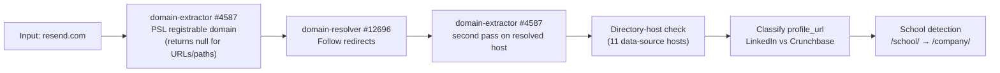
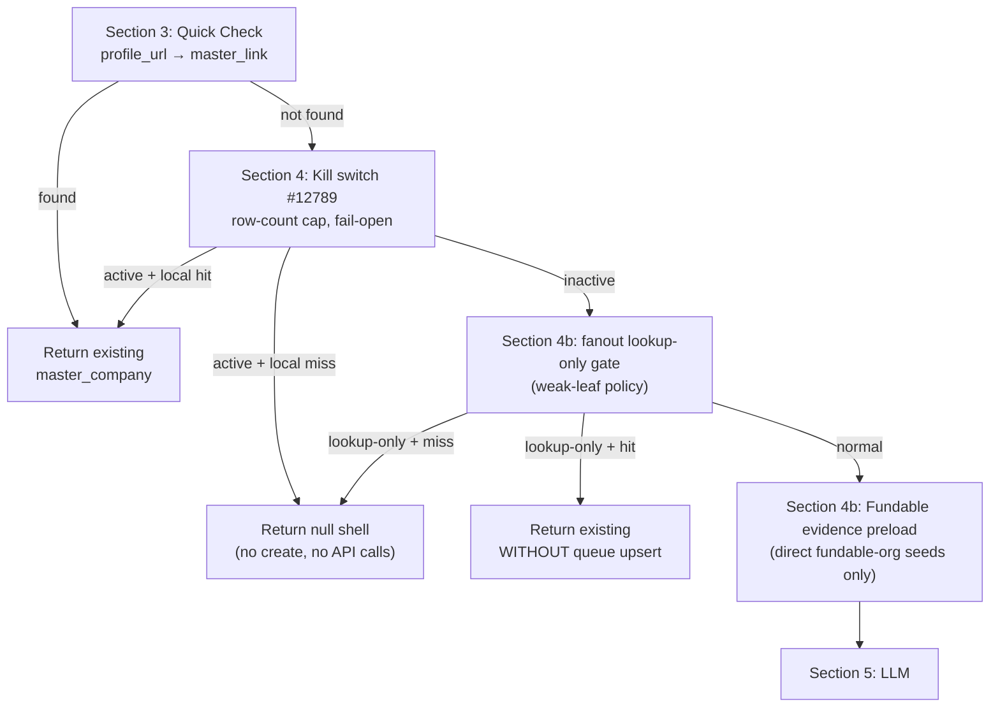
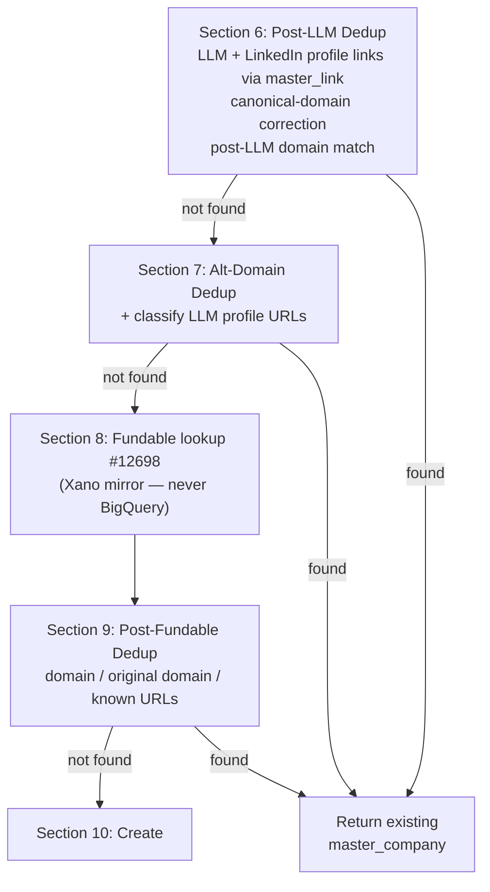
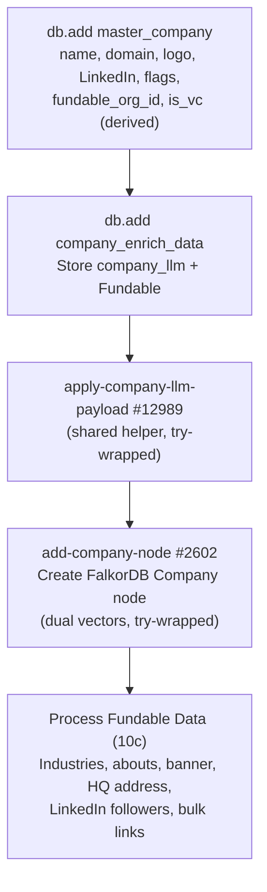
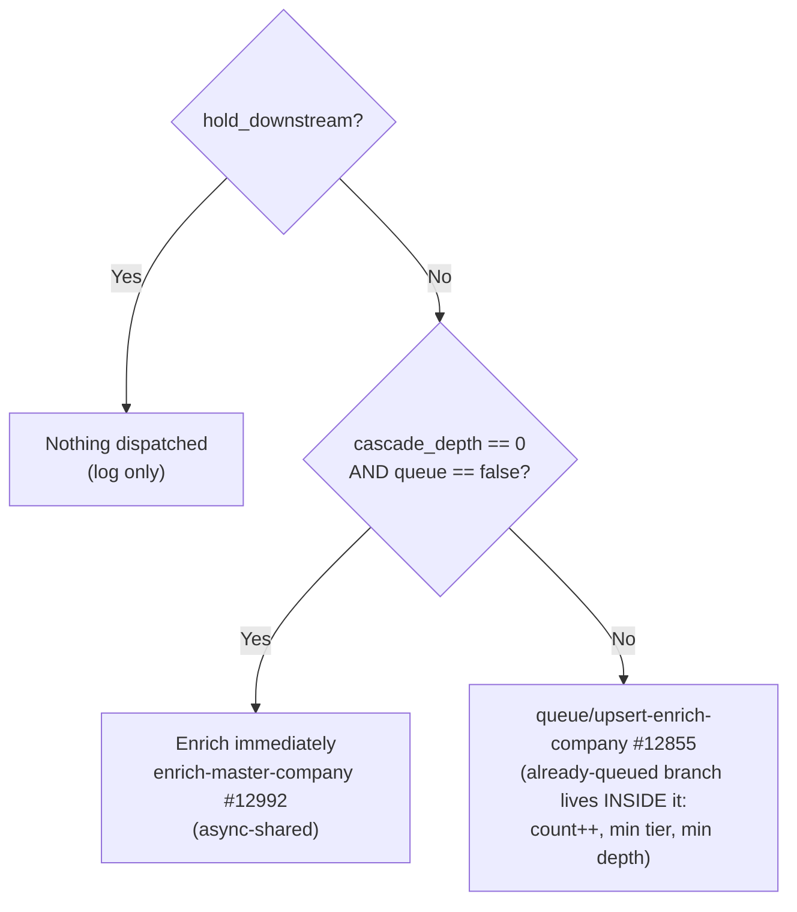

Get-add-driven company enrichment with multi-provider sourcing (LLM \+ Serper \+ Fundable \+ Exa \+ Signal NFX \+ YC), a **non-recursive depth-capped cascade**, a single priority-tiered queue, and upsert dedup. This page is the architecture spec: source contract, depth model, tiers, queue semantics, the entry-gate walkthrough, the 15-step orchestrator, seed flows, cascade examples, and loop prevention. The live function inventory, table schemas, and graph node \+ edge references live on the companion pages below.

It differs structurally from the [IMDB](/guides/enrichment/waterfall/imdb-waterfall) and [Music](/guides/enrichment/waterfall/music-waterfall) waterfalls: instead of queue-first processing, everything enters through a synchronous **get-add entry gate** (`mvp/get-add/master-company-new` #12558) that dedups, sources, and creates inline — seeds dispatch the orchestrator immediately (async), while the queue exists only to drain **cascade leaves** discovered at depth \> 0. See [Core Concepts](/guides/enrichment/waterfall/core-concepts) for shared mechanics (cascade depth, priority tiers, queue tables).

<Note>
  **Status: LIVE** (workspace 3, branch `v1`; last full live-code audit 2026-07-02). Entry gate #12558 is at **v2.18 \+ unversioned 2026-06-25/29 changes** (fan-out governor, `return_fast`, `.vc` evidence); orchestrator #12992 is at **v4.17** (2026-06-29). **The queue cron (Task #127 `process-company-queue`) ships `active = false`** — queued depth-1 leaves do NOT drain automatically today; an operator must run `mvp/queue/process-enrichment-queue` #12816 or flip the cron in the Xano UI.
</Note>

<CardGroup cols={2}>
  <Card title="Company Waterfall Functions" icon="diagram-project" href="/guides/enrichment/waterfall/company-functions">
    Every function, cron, and tool in the live pipeline, grouped by role — the entry gate, orchestrator, LLM stage, gated pre-phases, phase chain, deal cascade, graph writers, and queue infrastructure.
  </Card>

  <Card title="Company Waterfall Tables" icon="table" href="/guides/enrichment/waterfall/company-tables">
    Xano tables \+ queues — `master_company`, `company_enrich_data`, `queue_enrich_company`, the financial/investor tables, and the Fundable mirror family, with field-by-field schemas.
  </Card>

  <Card title="Company Nodes" icon="circle-nodes" href="/guides/enrichment/waterfall/company-nodes">
    Graph node catalog — `Company`, `Funding_Round`, `SubDomainExpertise`, and the shared `Person` node, with MERGE keys and writers. Canonical schemas live in the ontology.
  </Card>

  <Card title="Company Edges" icon="share-nodes" href="/guides/enrichment/waterfall/company-edges">
    Graph edge catalog — `SPECIALIZES_IN`, `RAISED`, the investor-edge family, `WORKS_AT`, `MENTOR`, and location edges, with patterns \+ weights.
  </Card>
</CardGroup>

---

## Source contract — multi-provider layer

Unlike IMDB (one scrape provider) and Music (one JSON API), the company waterfall composes **many providers**, each with its own gate. The natural keys are the **canonical domain** (PSL registrable domain via `domain-extractor` #4587 — which returns **null** for URL-shaped input; only bare hostnames are reduced) and **profile URLs** in `master_link` (trailing-`/` trimmed, `//linkedin` → `//www.linkedin`). There is no unique-index backstop — dedup is the app-level ladder in #12558.

| Provider | Function | What it does | Gate / debounce | Retry / terminal |
|---|---|---|---|---|
| OpenRouter LLM | `new-company-enrichment` #12974 (v1.17) | Two-stage web-grounded research: tier-1 `google/gemini-3.1-flash-lite` (temp 0, `openrouter:web_search`, 180 s), **escalating to `anthropic/claude-sonnet-4.6`** (temp 0.2, 240 s) when the tier-1 response fails to parse, `_meta.confidence.overall` is missing/non-numeric, **or** \< 0.7. Zero writes — callers persist the whole envelope. | `company_llm.data` empty (orchestrator); skipped in the entry gate when `return_fast` | No retry; LLM transport failure is uncaught; callers must check `data._error` |
| Serper | inside #12974 \+ `find-avatar` | Batch of 7 `site:` profile-discovery queries (LinkedIn, X, Facebook, Instagram, YouTube, Crunchbase, Wellfound), 30 s | runs with every LLM stage | try_catch → silent `[]` on failure |
| Fundable (internal) | `fundable-lookup` #12698 (v1.1) | **Reads the local Xano `fundable_organizations` mirror — never BigQuery.** Precedence: exact `fundable_org_id` \> domain \> original domain \> LinkedIn \> Crunchbase. Zero network, zero cost. BigQuery is touched only by the mirror-ingestion substrate (#12689/#12690). | always runs in §8 of the entry gate; re-lookup in orchestrator Step 4 only when `fundable_org_id` empty | n/a (local read) |
| Exa | `get-exa-company-c-suite` #12988 (v1.1) | People-category search (founders/C-suite, `numResults: 6`, 60 s) \+ `/contents` org expansion; returns a title-filtered, slug-filtered, enriched envelope | **fetch-once**: `exa_c_suite` empty (a zero-match envelope permanently satisfies the gate) | no retry, no status check; throw bubbles to the orchestrator's catch |
| Signal NFX | `get-signal-nfx-data-company` #12991 (v1.3) | Brave URL discovery (accepts only `signal.nfx.com/investors/` URLs) → Firecrawl scrape (4 attempts, 2 s constant sleep, `soft_fail`) → LLM parse #12990 → `investor_profile_company` upsert \+ `is_vc = true` flip | `fundable_org_id` set AND `is_vc` AND `signal_nfx_json` empty; **30-day debounce** on `enrich_history_company` source `"Signal NFX"`. **No depth gate** — any-depth VCs trigger it. | scrape failure persists a structured failure object; parse-null defers via the 30-day window |
| YC | `scrape_yc_data` #4628 \+ `process-yc-people` #12700 | Firecrawl search/scrape of the YC page (48 h cache) \+ LLM extraction; founders/partner resolution; Groq founder-LinkedIn lookup #12563 (direct Groq API, not OpenRouter) | `yc_data` empty or `"no_data"` (a `"no_data"` result **retries on every run**); people are seed-only | Firecrawl retry-once-in-catch; founders with no LinkedIn URL are dropped entirely |
| GCP thesis service | `build-investment-thesis-in-gcp` #12978 | POST `{gcp_backend_url}/v1/outcomes/investment-thesis/build` (Cloud Run, 180 s, no auth header) after `gather-investor-context-v3` #12911 (36-month deal window, all-time fallback) | `fundable_org_id` AND `is_vc` AND (no `investment_thesis` row OR empty `derived_thesis_summary` OR \> 30 d stale, `updated_at` → `created_at` fallback) | exactly one immediate retry on non-200; both fail → `badrequest` |
| logo.dev | inline in #12558 §10 | Logo URL **string constructed, never fetched** (publishable token), only when a domain exists | create only | n/a |
| Radar | `radar-maps-search-address` #2000 via #2451 | Forward geocode for HQ/office addresses (upstream of step 14's graph drain) | address fanout paths | first result or null |

Models and prompts are cross-linked, never duplicated: [Company model summary](/guides/enrichment/company-pipeline/model-summary) · [Company system prompts](/guides/enrichment/company-pipeline/llm-system-prompts) · [All models summary](/guides/enrichment/all-models-summary).

<Note>
  **Rebuild-spec gaps (per the [GCP migration plan](/guides/open-work/orbiter-univers-standalone/enrichment-gcp-migration#what-already-exists-vs-what-the-spec-must-add)):** four open-question themes remain for the Go port. (1) **Xano coercion semantics** — the `first_notempty`-on-0 family (tier `0 → 4` in the queue upsert; depth `0 → 1` in the deal cascade, which is the suspected cause of the #12702 self-skip) needs runtime confirmation and an explicit parity-vs-intent decision. (2) **Provider request/response schemas** still to snapshot verbatim (Exa, Serper, Brave, Firecrawl, the GCP thesis payload, the BigQuery mirror queries). (3) **Concurrency double-create window** — two calls passing the dedup ladder simultaneously WILL double-create; no unique index on `company_domain` / `link_url` is verified. (4) **Orphaned columns/tables** — `log_queue_company` #640 has no live writer; several `master_company` / `company_enrich_data` columns have no discoverable writer. Full inventory on [Company Functions → Deviations](/guides/enrichment/waterfall/company-functions#deviations-deprecated--orphaned).
</Note>

## Depth model

The company cascade is non-recursive by construction — depth only ever increases, and fanout privileges shrink with it.

| Depth | Meaning | Behavior |
|:--:|---|---|
| **0** | Seed (user / smoke / direct) | Full pipeline: LLM \+ Fundable \+ Exa **people expansion** \+ YC **people** \+ deal fanout (deal fanout additionally requires a **seed marker** — `is_vc`, `seeded_by_user == 1`, or source `"User Input"` / `"ScrapeCreators Linkedin"`) |
| **1** | Direct discovery from a seed | Company data fully enriched (LLM, Fundable, Signal, thesis, specialties, about, locations, node sync). Exa responses **saved but not processed into people**; YC people and deal fanout skipped |
| **2\+** | Transitive (weak-edge sources) | **Lookup-only / create-blocked** for governor-listed sources (the 2026-06-25 fan-out governor): all `resolve-edges-work` at depth \> 0, weak edge resolvers (volunteering/education/projects-publications/certifications/honor) at depth \> 0, `process-person-phase-3` at depth \> 1, `cascade-deal-participants` at depth \> 0 — these **match existing companies but never mint new ones and never queue work** |

**Effective depth (v4.7 repair semantics):** the orchestrator and phase 7 both compute `effective depth = max(input depth, deepest queue_enrich_company.cascade_depth for the company)`. A stale or direct async invocation passing `cascade_depth: 0` for a company actually queued at depth 1 **cannot** reclassify a leaf as a seed. The repair is upgrade-only.

<Check>
  **Why non-recursive?** One seed VC's deal fanout walks up to 25 raised \+ 25 invested rounds; each round exposes a portfolio company, co-investors, partners, and angels. If each of those recursed into *their* rounds and investors, a single seed would mint the entire investment graph. Instead: portfolio companies are created `hold_downstream` (never queued), investor resolution is seed-gated, queued depth-1 leaves enrich only themselves, and depth-2\+ weak-edge discoveries are lookup-only.
</Check>

## Priority tiers

`queue_enrich_company` (table #583) tier vocabulary — 1 = highest, **4 = effective default**: `1` founders / current employer · `2` past employers / VCs · `3` schools / angels · `4` cert issuers / volunteer orgs / publishers.

| Tier | Who queues it | Live status |
|:--:|---|---|
| **1** | Current employer of an enriched person — person phase-3 calls #12558 with `queue: true, cascade_depth: 1, priority_tier: 1` | live |
| **2** | VC firms from `resolve-investors-edges` #12702 (depth 1) | as-written; **dead live** — #12702 self-skips (see [Cascade examples](#bounded-cascade-example-person-investor-at-depth-0)) |
| — | Portfolio companies from deal fanout | **NOT queued** — created via get-add with `hold_downstream: true, queue: false` at depth `effective+1` (2 in practice), tier 2 passed but never used |
| **4** | Any §11 queue path without an explicit tier — `priority_tier\|first_notempty:4` also **coerces an explicit tier 0 → 4** | live (load-bearing coercion) |

Adjacent person-queue tiers written by this pipeline: **YC founders → T1**, **YC partner → T2** (both `queue: true`, depth `input+1`, via `master-person-new`); Exa C-suite people are **direct-dispatched** (`enrich-master-person` async at depth `effective+1`, `current_company_only: true`) — no `queue_enrich_person` row; co-angels / VC partners → T1 as written in #12702, dead live.

### Upsert on duplicate

When the same `master_company_id` is enqueued twice, `upsert-enrich-company` #12855 (the **single source of truth for all queue writes** — the already-queued branch lives *inside* it, not in callers):

- `count++` on **every** duplicate request (a request tally, not an attempt counter)
- `priority_tier = min(existing, incoming)` — only ever improves (fallback 4 when null/`''`)
- `cascade_depth = min(existing, incoming)` — a later seed-level request **promotes** a leaf row to depth 0 (fallback 99)
- `source_*` metadata: set on insert; on update replaced **only when the incoming request strictly improves depth (or ties depth with strictly better tier)**, per-field `first_notempty` against the existing value — sticky-until-improved
- One row per company enforced in application code only (get-then-branch; no unique index)

## Queue & upsert semantics

- **Natural key is `master_company_id`** — unlike IMDB's URL-keyed queues, the company row always exists *before* it is queued (the entry gate creates it first). Guard: id 0/null/missing → `skipped_no_id`, no write.
- **Sync-enrich branch:** at §11 of the entry gate, `cascade_depth == 0 && queue == false && !hold_downstream` → dispatch `enrich-master-company` #12992 **async-shared** immediately. No queue row. (v2.18 removed the `!debug.stop` that used to sit in front of this dispatch — the old doc's Info box about it is stale and gone.)
- **Forced queue at depth \> 0:** `queue || cascade_depth > 0` always routes to the queue upsert — a depth-1 discovery can never trigger inline full enrichment.
- **Governor flags on the entry gate:** `hold_downstream` (no dispatch, no queue row, Fundable bulk-link downstream suppressed — read with `first_notnull:false` so explicit `false` survives), `lookup_only` / `allow_create: false` (match-only; miss returns a null shell), `return_fast` (skips only the synchronous §5 LLM preflight; dedup, Fundable, create, dispatch all still run — the async orchestrator owns the LLM waterfall).
- **`first_notempty` defaults are load-bearing (and violate the house `first_notnull` rule):** the §11 tier coercion (`0 → 4`) and the deal-cascade depth coercion (`0 → 1` in #12856/#12702) are live behavior a parity port must reproduce — flagged, not fixed.
- **Drain layer:** Task #127 (cron, **`active = false` live**) picks **one** row per 600 s tick — `priority_tier asc, cascade_depth asc, id asc` — locks it (`processing: true`, non-atomic), runs #12992 synchronously, deletes on success, releases \+ `log_crash` on failure (no retry counter — a deterministically-crashing row head-of-line blocks the queue). Operator batch drain #12816 serves both queues with tier/depth/count filters and `dry_run`. Legacy tool #12672 targets the deprecated #4513 orchestrator — historical only.

Full field-by-field schemas: [Company Waterfall Tables](/guides/enrichment/waterfall/company-tables).

---

## Entry point — get-add/master-company-new

```text
mvp/get-add/master-company-new — #12558
```

**Current version:** v2.18 (2026-06-23) plus unversioned 2026-06-25 (fan-out governor: `lookup_only` / `allow_create` / weak-leaf and depth-2\+ create blocks) and 2026-06-29 (`return_fast`, `.vc`-TLD VC evidence at create time) changes. THE single entry point of the company waterfall — every caller (app, person pipeline, deal cascade, Exa employer resolution) routes through it. The full version log is in [Historical reference](#historical-reference).

Called with:
```json
{
  "domain": "resend.com",
  "profile_url": "https://www.linkedin.com/company/resend",
  "company_name": "Resend",
  "cascade_depth": 0,
  "priority_tier": 1
}
```

### Phase 0: Placeholder guard (Section 0)

Before anything else, a blocklist lambda normalizes the LinkedIn `/company/` slug and `company_name` and rejects placeholder employers (`self employed`, `freelance`, `stealth startup community`, `unknown company`, …) and incomplete LinkedIn company URLs. A hit logs a `qa_passed: true` crash row and **returns null** — no row, no node.

### Phase 1: Input cleanup (Section 2)



The raw input is normalized:
- **Domain extraction**: `www.resend.com` becomes `resend.com` — via `npm:psl` registrable-domain parsing. **URL-shaped input (`https://…`, paths, query strings) returns `null`**, not a stripped host; callers rely on null-on-URL to blank the domain rather than persist junk.
- **Redirect resolution**: if `resend.com` redirected from an old domain, both are tracked (`$varDomain` \+ `$varOriginalDomain`), then the extractor runs again on the resolved host.
- **Directory-host check** (v2.13): 11 known directory/data-source hosts (TeaserClub, PitchBook, Tracxn, Magnitt, VentureCapitalArchive, …) flag the source domain so the canonical-domain correction in Section 6 can replace it.
- **Profile classification**: LinkedIn URLs → `$varLinkedInUrl`, Crunchbase → `$varCrunchbaseUrl`; LinkedIn `/school/` URLs are flagged and rewritten to `/company/`.

### Phase 2: Quick check, kill switch, governor gates (Sections 3–4b)



- **Section 3**: look up the incoming `profile_url` (raw, trailing-`/` trimmed) in `master_link`. A hit best-name-corrects the row, runs the queue gate, and returns immediately — no LLM, no Fundable.
- **Section 4 — kill switch**: `check-kill-switch-company` #12789 is **not a boolean env var** — it reads a row in the `environment_variables` TABLE and compares the total `master_company` row count against that numeric cap (`count >= value` ⇒ active; set the value to 0 to force ON). It is **fail-open**: any error in the check logs one crash row and returns OFF. When active, the gate answers from a local-only 4-key ladder (domain → original domain → LinkedIn link → Crunchbase link) and blocks all new creation — zero external calls.
- **Section 4b — fan-out lookup-only gate** (2026-06-25 governor): weak-source calls (explicit `lookup_only`, `allow_create: false`, work-edge resolvers at depth \> 0, deal-cascade leaves) run the same local ladder; a hit returns the existing company **without any queue upsert or enrich dispatch** — weak sources link but never spawn work. A miss returns a null shell.
- **Section 4b — Fundable evidence preload** (v2.12): when the caller passed an exact Fundable org id (`source_entity_type: "fundable_organizations"`), the org row is preloaded into `source_urls` / `source_facts` for the LLM stage.

### Phase 3: LLM enrichment (Section 5)

```text
mvp/enrich/new-company-enrichment — #12974
```

**Current version:** v1.17 (2026-06-04). Two-stage company enrichment, pure compute — zero writes:

1. **Stage 1** — web-grounded LLM research via OpenRouter: tier-1 `google/gemini-3.1-flash-lite` with the `openrouter:web_search` tool; **escalates to `anthropic/claude-sonnet-4.6`** when the tier-1 response fails to parse, `_meta.confidence.overall` is missing or non-numeric, **or** \< 0.7 — not only on low scores. All chat requests include `provider.data_collection = "deny"`.
2. **Stage 2** — deterministic profile discovery via Serper: one batch of 7 `site:` queries (LinkedIn, X/Twitter, Facebook, Instagram, YouTube, Crunchbase, Wellfound), merged into `data.profiles` after canonical-URL \+ identity-gate filtering, one URL per platform.

Response shape: `{ data, model_used, escalated, gemini_confidence }` — callers persist the **whole envelope** and must check `data._error`. Inputs `source_urls` / `source_facts` (v1.10–v1.15) carry exact evidence pages and deterministic fact overrides from the Fundable preload. The gate: this stage is **skipped when `return_fast` is true** (the async orchestrator then owns the LLM waterfall) and requires at least one identity hint (domain, LinkedIn, source_urls, or source_facts). Prompt \+ models: [system prompts](/guides/enrichment/company-pipeline/llm-system-prompts) · [model summary](/guides/enrichment/company-pipeline/model-summary).

`apply-company-llm-payload` #12989 (v1.7) does a deterministic URL/social-handle filter before writing LLM/Serper profiles: canonical company/org profile URLs are allowed, but social handles must match company/domain signals; short aliases (\< 8 slug chars) never satisfy handle matching; an exact-known LinkedIn suppresses all other LinkedIn candidates.

### Phase 4: Post-LLM dedup \+ Fundable (Sections 6 → 7 → 8 → 9)



- **Section 6** dedups on the LLM-discovered profile links plus the input LinkedIn URL (via `master_link`), then runs the **canonical-domain correction** ladder (v2.13/v2.14): directory-source domains are replaced by the LLM-confirmed domain or first alt-domain, or **cleared to null** — a directory host is never persisted as `company_domain`. Then the **conservative `is_vc` classification** lambda: any `.vc`-TLD host among LLM/input/Fundable domains, or investment-firm evidence in the company-type/industry/tags blob, sets `$effectiveIsVc`. Fundable `is_investor` alone does NOT flip it.
- **Section 7** dedups each LLM alt-domain and classifies LLM profile URLs into the LinkedIn/Crunchbase slots.
- **Section 8 — Fundable**: `mvp/funding/fundable-lookup` #12698 reads the **local Xano `fundable_organizations` mirror** (the legacy BigQuery response shape is emulated; **no BigQuery query happens here** — BigQuery is only touched by the mirror-ingestion substrate). Precedence: exact `fundable_org_id` (when the caller passed `source_entity_type: "fundable_organizations"` \+ `source_entity_uuid`) \> domain \> original domain \> LinkedIn \> Crunchbase. The returned `fundable_org_id` is written onto `master_company` and reused everywhere downstream (phases 5–7, Signal NFX, thesis).
- **Section 9** (post-Fundable) dedups on the resolved domain, the original pre-redirect domain, and the known URLs (LinkedIn/Crunchbase/Pitchbook) coalesced from Fundable.

**When `cascade_depth > 0`**: the entity still goes through all sections, but Section 11 forces it into the queue regardless of the `queue` input.

For `resend.com` at depth 0 with no Fundable match:

| API | Endpoint | Data Retrieved |
|-----|----------|----------------|
| **new-company-enrichment** | OpenRouter (`gemini-3.1-flash-lite` / `claude-sonnet-4.6`) \+ Serper | display_name, legal_name, aliases, profiles, industry, size, headquarters, other_locations, financial signals, summary, headline |
| **Fundable** | Xano mirror of the BigQuery dataset | `fundable_org_id`, company name, LinkedIn, Crunchbase, Pitchbook, abouts, links |

### Phase 5: Record creation (Section 10)



For `resend.com`, this creates:
- **master_company** record with `company_name: "Resend"`, `company_domain: "resend.com"`, logo URL from logo.dev, `is_vc` from the derived evidence lambda, `fundable_org_id` if Fundable matched
- **company_enrich_data** storing `company_llm` (full LLM envelope) \+ `fundable` (mirror row or the literal string `"no_data"`)
- **company_financial** (created inside the helper) with `company_type`, `is_public`, `ticker`, `stock_label`, `primary_exchange`, `stock_link`, `went_public_on`, `funding_total`, `total_rounds_raised`, `revenue`
- **master_link** entries for the canonical, identity-gated profile URLs (one per platform, `source: "Company_LLM"`)
- **Industries and specialties** from the LLM payload (`industry.primary` / `industry.secondary` / `tags`) \+ Fundable
- **About/descriptions** from LLM `headline` \+ `summary` (`source: "Company_LLM"`) \+ Fundable (`source: "Fundable"`)
- **HQ address** \+ **other office locations** from the LLM `headquarters` \+ `other_locations` blocks (geocoded via Radar)
- **Contact email \+ phone** from LLM `email_address` / `phone_number`
- **Company node** in the FalkorDB graph (dual 1536 \+ 3072 vectors; failure is tolerated — the row survives without a node, flagged for backfill)

<Note>
  **Single source of truth for LLM → relational mapping.** `mvp/enrich/apply-company-llm-payload` #12989 is called from two places: here (Section 10 on fresh creates) and from `enrich-master-company` Step 3 (records whose LLM payload was just freshly populated). The `master_company` scalar writes are preserve-existing (`existing |first_notempty: LLM` — LLM only fills blanks), and `is_school`/`is_vc` are escalate-only. **As-built (flagged):** the `company_financial` upsert is **NOT** preserve-existing — every field is an LLM-wins direct write, so a later sparser payload overwrites previously-set columns with null. `total_rounds_raised` comes *exclusively* from `fundable.num_funding_rounds` (no LLM rounds field is ever read); `funding_total` = LLM `funding.total_raised_usd`, falling back (`first_notempty` — null/0/empty all fall through) to `round(fundable.total_raised × 1,000,000)` when that is finite and \> 0 (v1.5 deterministic Fundable fallback), then forced null for Venture Capital Firm payloads (v1.6 — fund size is not company financing).
</Note>

### Phase 6: Enrichment dispatch (Section 11)

The final routing decision — exactly one branch fires:



For `resend.com` at depth 0 with `queue: false`: **immediate enrichment** fires asynchronously via `enrich-master-company`. For a depth-1 company discovered during person enrichment: **queued** with the source function, source entity (id \+ uuid \+ type), and priority tier recorded via `mvp/queue/upsert-enrich-company` — note the `$effectiveTier = priority_tier|first_notempty:4` coercion on this path (tier 0 → 4). For QA/backfill creates with `hold_downstream: true`: **nothing** is dispatched or queued.

---

## enrich-master-company — 15-step gated orchestrator

```text
mvp/enrich/enrich-master-company — #12992
```

**Current version:** v4.17 (2026-06-29). Every gated step is wrapped in its own `try_catch` — failures append a `log_crash` row with `note: "CRASH: {step}"` and flip `$hasCrash = true`, but later steps still run. Exceptions: the inner per-person C-suite loop catch and the avatar WARN catch log but do **not** set `$hasCrash`, and the inline repair blocks (post-Step-4 `.vc`, 4.5, post-Step-5, 15.5, finalize) are unprotected — a throw there aborts the run and leaves the base history row stuck at `processing: true`.

The orchestrator opens with a **60-second debounce** (a prior run for the same `master_company_id` with `source: "Base Company Enrich"` within 60 s → one `qa_passed: true` log row, return null — *before* the base history row is written). It then repairs depth (**effective depth = max(input, deepest queue-row depth)**), and applies the **VC-via-funding-rounds suppression**: a VC that entered via funding-round investor resolution (queue `source_function == "resolve-investors-edges"`, or `master_company.source == "Funding Rounds"` at depth \> 0) marks its history row complete and returns without full enrichment.

| # | Step | What It Does |
|:-:|------|-------------|
| — | **Debounce \+ setup** (inline) | 60 s debounce (log `qa_passed: true`, return before any write). `db.add enrich_history_company` base row. Load `master_company` \+ deepest queue row → **effective-depth repair** (v4.7/v4.8). **VC-funding-round suppression** early return. Guard early-return when the `company_enrich_data` row is missing. |
| 1\+2 | **LLM preflight** | When `company_enrich_data.company_llm.data` is empty, run `new-company-enrichment` #12974 and write the **whole response envelope** onto `company_enrich_data.company_llm`. Logs an extra history row (`source: "Company_LLM"`). Sets `$llmRan = true` only when this fires. |
| 3 | **Apply LLM payload** | Only when `$llmRan`. Calls `apply-company-llm-payload` #12989 — the same shared helper used by fresh creates (see the Phase-5 Note, including the `company_financial` overwrite flag). |
| 4 | **Fundable re-lookup** | Only when `fundable_org_id` is empty. Tries `fundable_organizations` by domain → LinkedIn (LLM-discovered) → Crunchbase (LLM-discovered). On match: bidirectional backlink (`fundable_org_id` \+ `master_company_id`/`node_uuid` mirror), then the **conservative VC-evidence lambda** (`.vc` host, `is_investor` \+ fund-identity regexes, VC-fund description evidence, and the v4.16 operating-corporate veto) — escalate-only here. |
| — | **Post-Step-4 `.vc` repair** (inline, v4.17) | A `.vc` `company_domain` alone flips `is_vc: true`, regardless of Fundable state. |
| 4.5 | **Investor-classification repair** (v4.9–v4.17) | When `fundable_org_id` already existed: re-run the evidence lambda. True \+ currently false → escalate. **False \+ currently true → DOWNGRADE `is_vc: false`** — the only place in the pipeline that unsets it (pulls corporate strategic investors out of the Signal/thesis paths). |
| 5 | **Signal NFX scrape** | Only when `fundable_org_id` set AND `is_vc` AND `signal_nfx_json` empty. Calls #12991 (30-day debounce, Brave → Firecrawl → parse, `investor_profile_company` upsert). **No depth gate.** |
| — | **Post-Step-5 signal-proof repair** (inline, v4.9) | Non-empty `signal_nfx_json` with `is_vc == false` → force true (existing Signal JSON is investor proof; unlocks the thesis gate). |
| 6 | **Investment thesis** | Only when `fundable_org_id` set AND `is_vc` AND (no `investment_thesis` row OR **empty `derived_thesis_summary`** (v4.11) OR \> 30 d stale, `updated_at → created_at` fallback). Calls `build-investment-thesis-in-gcp` #12978 → GCP Cloud Run. |
| 7 | **Get C-Suite & Founders via Exa** | Fetch-once: calls #12988 (`expand_companies: true`, null-safe reads, v4.15 name-derivation fallback) when `exa_c_suite` is empty and saves the filtered envelope. **People expansion is seed-only** (effective depth 0): per match, *in this step's loop after #12997 returns* — person upsert → bios ×2 → avatar (**only when `action == "updated"`**) → seed-scoped `work_experience` rows → `create-work-edges` #2800 (**`WORKS_AT`** \+ FOUNDED/BOARD_MEMBER_OF/ADVISOR_TO/INVESTED_IN/MEMBER_OF — there is no `HAS_WORKED_AT` edge) → `deep-person-basic` → **async** `enrich-master-person` (`cascade_depth: effective+1`, `current_company_only: true`, no `queue_enrich_person` row). At depth \> 0 it saves the envelope only and logs `SAVED: C-suite/founder Exa response only; people expansion gated to seed depth`. |
| 8 | **process-company-phase-3** #12799 — YC | YC detection (Fundable deal ∩ YC org) → Firecrawl scrape \+ LLM extract → relational fanout, at any depth. `process-yc-people` #12700 is **seed-only** (founders → person queue T1, partner → T2, both `queue: true`; FOUNDED/WAS_FOUNDED/MENTOR edges). Depth \> 0 logs `SKIP: YC people gated to seed company depth`. |
| 9 | **process-company-phase-5** #12809 — Fundable backfill | **Once-ever**: gated on `company_enrich_data.fundable` empty; a miss writes the `"no_data"` sentinel and permanently retires the phase. Live effect is lookup \+ abouts \+ links \+ backlink (the industries/HQ/follower/banner branches are dead under the v1.1 mapped lookup shape). |
| 10 | **process-company-phase-6** #12810 — Back-link \+ financial | Domain-only Fundable back-link repair (when `fundable_org_id` empty) \+ `company_financial` upsert of `funding_total` / `total_rounds_raised` / `is_public`. **As-built (flagged):** the financial write is an **unconditional overwrite** (including 0/false), re-stomping LLM-derived values on every run. There is **no profile-URL canonicalization** in this phase (the old doc's claim was wrong). |
| 11 | **process-company-phase-7** #12813 — Deals | **Depth 0 AND a seed marker required** (`is_vc` / `seeded_by_user == 1` / source `"User Input"` / `"ScrapeCreators Linkedin"`) — plain depth-0 companies are SKIPped. Repairs depth from the queue row (v1.3). Calls `add-all-fundable-deals` #12703 (v2.1: **25 raised \+ 25 invested caps** per invocation, `"fanout capped"` log on overflow) → `cascade-deal-participants` #12856 per deal (staleness gate on `processed_at`; portfolio co ensured `hold_downstream`; IPO flip; `Funding_Round` \+ `RAISED`; investor edges — see the [flagged self-skip](#bounded-cascade-example-person-investor-at-depth-0)). |
| 12 | **resolve-company-specialties** #12746 (v1.8) | **Destructive rebuild**: deletes ALL of the company's `SPECIALIZES_IN` edges, then per specialty (top 15 by frequency): blurb LLM → Gemini 3072 embedding → KNN over `expert_embeddings` → 0.15/0.25 guard band with LLM adjudication → exact-name guard → MERGE edge with `weight = min(round(10 + match_score*160), 50)`; **created** nodes get fixed weight 10, a `sub_domain_expertise` row, parent attach via #13142 (`HAS_SUBDOMAIN {weight: 100}` or `parent_unresolved` flag) \+ relational FK dual-write. Edge descriptions via #13144 after every MERGE. Cypher: [company pipeline](/guides/cyphers/company-pipeline). |
| 13 | **llm-company-about** #2545 | LLM (kimi-k2.5) writes `tagline`, `about` (≤ 229), `about_500` (≤ 500) onto `master_company` (there is no `company_about` column), then `industry-specialties-llm` #4517 (gpt-4o) classifies the about into industries \+ specialties join rows. |
| 14 | **add-company-locations** #1924 | **Drains already-geocoded `master_address` rows** (`path_triples_added: false`) into City/Region/Country nodes \+ `LOCATED_IN`/`IN_REGION`/`IN_COUNTRY` edges via #4528. No address resolution happens here — geocoding lives upstream (#2451 \+ Radar #2000). |
| 15 | **update-company-node** #4659 (v1.8) | Full FalkorDB Company-node property SET sync (pruned via clean-my-json2, dual 1536 \+ 3072 vectors, single attempt) — business model, products, target customers, acquisition fields, `went_public_on` \+ `stock_link`. |
| 15.5 | **is_vc re-assert** (inline, v4.10) | If `signal_nfx_json` is non-empty OR an `investor_profile_company` row exists (with the in-memory `is_vc`) → force `is_vc: true`, overriding any stale false written by phases 8–15. |
| — | **Finalize** (inline) | Edit the base history row: `enrich_success ↔ !$hasCrash`, `processing: false`. One bare `qa_passed: true` `log_crash` marker on clean completion. |

<Note>
  **v4 vs v3.5: what's new.** v4 adds gated pre-phase steps (LLM preflight → apply payload → Fundable re-lookup → Signal NFX → investment thesis → Exa C-Suite \+ person loop) in front of the v3 phase chain. v4.2–v4.5 made the person loop seed-only, seed-scoped, and direct-enriched in current-company-only mode. Then: **v4.7** effective-depth repair from queue context · **v4.8** queue-context query-single · **v4.9** investor-classification repair \+ signal-proof repair · **v4.10** Step 15.5 re-assert · **v4.11** thesis rebuild on empty summary · **v4.12** debounce rows `qa_passed: true` · **v4.13** Step-7 missing-row/null-safe guards · **v4.14** conservative VC-evidence lambda · **v4.15** Exa company-name derivation · **v4.16** operating-corporate veto (the Hyundai fix) · **v4.17** `.vc`-domain \+ VC-fund-description evidence. PDL \+ Enrich Layer were already gone in v3.5; v4 inherits that.
</Note>

The full function roster with per-function version history (including the quick-copy path groups that used to live on this page) is on [Company Waterfall Functions](/guides/enrichment/waterfall/company-functions).

---

## Seed flows

### Seed company (depth 0)

<Steps>
  <Step title="Entry gate — dedup ladder + sourcing">
    `get-add/master-company-new` #12558: placeholder guard → input cleanup → quick-check dedup → kill switch → governor gates → LLM preflight (#12974, skipped on `return_fast`) → post-LLM dedup \+ canonical-domain correction → Fundable mirror lookup → post-Fundable dedup.
  </Step>
  <Step title="Create row + node + relational fanout">
    `db.add master_company` \+ `company_enrich_data`, `apply-company-llm-payload` #12989, `add-company-node` #2602 (dual vectors), Fundable fanout (industries, abouts, banner, HQ address, followers, bulk links).
  </Step>
  <Step title="Dispatch">
    Depth 0 \+ `queue: false` \+ no hold → **async** `enrich-master-company` #12992 at depth 0. The orchestrator runs all 15 steps with seed privileges: Exa people expansion, YC people, and (with a seed marker) deal fanout.
  </Step>
</Steps>

### Queued depth-1 processing

<Steps>
  <Step title="Row enters the queue">
    A depth-1 discovery (e.g. a person's current employer) routes through the §11 queue gate → `upsert-enrich-company` #12855 (single row per company, count\+\+/tier/depth promotion on duplicates).
  </Step>
  <Step title="Drain picks one row">
    Task #127 (**inactive live**) or operator #12816: lock `processing: true` → run #12992 **synchronously** with the row's `cascade_depth` → delete on success, release \+ log on crash.
  </Step>
  <Step title="Leaf-scoped enrichment">
    Effective depth ≥ 1: company data fully enriches (LLM, Fundable, Signal, thesis, specialties, about, locations, node sync), Exa responses are **saved but not processed into people**, YC people and deal fanout are SKIPped.
  </Step>
</Steps>

### Depth-2+ policy

Depth-2\+ companies are never queued by the live paths — they exist only as **lookup-only / hold_downstream leaves**: the fan-out governor blocks creation for weak-edge sources (work-edge resolvers, deal-cascade participants), and the deal cascade creates portfolio companies with `hold_downstream: true` at depth `effective+1` — linked, never queued, never dispatched.

---

## Cascade example: resend.com at depth 0 (company seed)

Here's what happens end-to-end when `resend.com` enters as a seed entity:

```
Depth 0: resend.com
├── get-add/master-company-new #12558
│   ├── Section 0: placeholder guard → pass
│   ├── Section 2: domain-extractor #4587 → domain-resolver #12696 → directory check
│   ├── Section 3: profile_url quick check → miss
│   ├── Section 4: kill switch #12789 (row-count cap) → off
│   ├── Section 4b: fanout governor → normal seed; no direct Fundable org
│   ├── Section 5: new-company-enrichment #12974 (gemini-3.1-flash-lite → claude-sonnet-4.6; Serper ×7)
│   ├── Sections 6–9: post-LLM dedup → Fundable mirror lookup → post-Fundable dedup → miss
│   ├── Section 10: db.add master_company + company_enrich_data
│   │              + apply-company-llm-payload #12989 (relational fanout)
│   │              + add-company-node #2602 (FalkorDB, dual vectors)
│   │              + Fundable fanout (10c)
│   └── Section 11: depth 0 + queue=false → dispatch async enrich-master-company
│
└── enrich-master-company #12992 (async, v4.17)
    ├── Debounce (60s) → depth repair → VC suppression check → enrich-data guard
    ├── Step 1+2: LLM already populated by get-add → skipped
    ├── Step 3:   skipped (only fires when LLM just ran)
    ├── Step 4/4.5: Fundable re-lookup + investor-classification repair (.vc rule)
    ├── Steps 5–6: Signal NFX + investment thesis (VC-only, gated)
    ├── Step 7:   Exa C-Suite #12988 → save filtered envelope; people expansion (seed only)
    │             per match, in THIS loop (after master-person-from-exa returns):
    │             ├── master-person-from-exa #12997 (person upsert; employer = seed)
    │             ├── bios ×2 · avatar (only when action == "updated")
    │             ├── seed-scoped work_experience rows
    │             ├── create-work-edges #2800 (WORKS_AT + FOUNDED/BOARD_MEMBER_OF/…)
    │             ├── deep-person-basic
    │             └── enrich-master-person (async, depth 1, current_company_only=true)
    │                 → current employer only → queue_enrich_company leaf (depth 1, T1)
    ├── Step 8:   YC — founders → person queue T1, partner → T2 (seed-only)
    ├── Steps 9–10: Fundable backfill (once-ever) + back-link/financial overwrite
    ├── Step 11:  Deals — depth 0 AND seed marker required
    │             └── add-all-fundable-deals #12703 v2.1 (25 raised + 25 invested caps)
    │                 per deal → cascade-deal-participants #12856
    │                 ├── portfolio co via get-add (hold_downstream — NOT queued)
    │                 ├── Funding_Round node + RAISED edge (#12701, weight 10)
    │                 └── resolve-investors-edges #12702 → SELF-SKIPS live (see below)
    ├── Steps 12–13: specialties (destructive SPECIALIZES_IN rebuild), company-about
    ├── Steps 14–15: locations drain, Company-node sync #4659
    ├── Step 15.5: is_vc re-assert
    └── Finalize: enrich_history_company.enrich_success = true
```

Seed company enrichment can create a direct depth-1 wave, but downstream fanout is gated. External APIs are called at depth 0 during both `get-add` (LLM \+ Serper) and the orchestrator's pre-phase steps (Exa, Signal NFX, investment thesis — Fundable is a local mirror read). Seed-company Exa C-suite people are enriched immediately, but only their current companies are resolved and queued. Deeper companies may save provider responses and enrich company data, but Exa people, YC people, and Fundable deal fanout stay seed-only — and deal fanout additionally requires a seed marker.

## Bounded cascade example: person investor at depth 0

Here's what happens when a person who invested in companies enters as a seed entity under the current non-recursive policy.

```text
Depth 0: Person investor
├── get-add/master-person-new #13039
│   └── enrich-master-person #13040
│       ├── Phase 3: primary current employer
│       │   → get-add/master-company-new(queue=true, cascade_depth=1, tier=1)
│       │   → queue_enrich_company leaf, not inline full enrichment
│       │
│       └── Phase 9: Investor Pipeline (seed-person only)
│           └── foreach angel investment → cascade-deal-participants #12856
│               ├── processed_at staleness gate (angel-only changes do NOT bust it)
│               ├── portfolio company → get-add hold_downstream
│               │   (depth effective+1 — created/linked local-only, NOT queued)
│               ├── Funding_Round node + RAISED edge (weight 10)
│               └── resolve-investors-edges #12702 (as written):
│                   ├── co-angels → queue_enrich_person(depth 1, tier 1)
│                   ├── VC firms → queue_enrich_company(depth 1, tier 2)
│                   ├── VC partners → queue_enrich_person(depth 1, tier 1)
│                   └── LEAD_INVESTED_IN / INVESTED_IN / FOLLOW_ON_INVESTED_IN
│                       / INVESTMENT_PARTNER_IN / INVESTMENT_PARTNER_AT edges
│
└── Later queue runs (cron #127 ships active=false — operator drain #12816 only)
    ├── depth-1 people can enrich and resolve current employers as leaves
    ├── depth-1 companies enrich their own company data
    ├── depth-1 companies save Exa C-suite responses but do not create people
    ├── YC people + deal fanout stay gated to seed depth (+ seed marker)
    └── VC firms discovered from funding rounds suppress full company enrichment
```

**As-built (flagged):** the entire `resolve-investors-edges` #12702 branch above is the **as-written contract, and it is dead code live**. Since v1.11 (2026-06-23), both #12856 and #12702 default depth via `cascade_depth|first_notempty:1` — and Xano's `first_notempty` treats an explicit `0` as empty, so every seed call's depth 0 coerces to 1, the `effectiveDepth == 0` gate is unsatisfiable, and #12702 self-skips on **every** invocation (logging `SKIP: resolve-investors-edges gated to seed depth` with `data.cascade_depth: 1`). Net live behavior: deal cascade materializes **`Funding_Round` \+ `RAISED` only** — no investor/partner/angel edges, no co-investor queueing — and the portfolio company is created at depth 2, `hold_downstream`, not queued. A Go port must decide explicitly between strict parity (reproduce the coercion) and the intended contract (a nullable depth input). Edge weights and Cypher: [Company Edges](/guides/enrichment/waterfall/company-edges) · [funding cyphers](/guides/cyphers/funding).

**Impact analysis:**

- **Seed cost:** one full person enrichment and one direct investment-network pass when the person is an angel.
- **Direct fanout (as-built):** the current employer is queued at depth 1 / tier 1; portfolio companies are linked but **not** queued; co-angels, VC firms, and VC partners are not queued while the #12702 self-skip stands.
- **No recursive investment closure:** when a queued company processes later, it does not discover every other round and recurse into every investor on those rounds (deal fanout needs depth 0 \+ a seed marker).
- **Idempotency:** queue upsert semantics collapse repeated discoveries into one row with `count++`, best `priority_tier`, and best/lowest `cascade_depth`.

---

## Loop prevention (eight layers)

1. **Dedup ladder in the entry gate:** quick-check (§3), kill-switch/fanout local ladders, post-LLM link \+ domain (§6/§7), post-Fundable domain/original-domain/known-URLs (§9) — an existing company is returned, never re-created.
2. **Queue upsert:** duplicate `master_company_id` → `count++`, min-tier, min-depth. Single row per company (app-level).
3. **Seed-only fanout gates** (effective depth 0): Exa people expansion, YC people, and deal fanout — deal fanout additionally requires a seed marker.
4. **Depth-2\+ create blocks / lookup-only leaves:** the 2026-06-25 fan-out governor makes weak-edge sources match-only at depth \> 0; portfolio companies are created `hold_downstream` and never queued.
5. **VC-via-funding-rounds suppression:** VCs that entered through investor resolution skip the entire orchestrator (early return, history row marked clean).
6. **60 s debounce** on the orchestrator (per company, `source: "Base Company Enrich"`).
7. **Kill switch (row-count cap):** `check-kill-switch-company` #12789 — `master_company` count vs a cap in the `environment_variables` table; fail-open; when active, zero external calls and no new creation anywhere (including direct Fundable seeds).
8. **Cron single-row tick:** Task #127 processes at most one queue row per 600 s (currently `active = false` — the manual-drain state is itself the hardest stop).

---

## Implementation notes captured during build

- **The `!debug.stop` dispatch gate is gone** — removed in #12558 v2.18; Section 11 dispatches directly. (The old page's Info box about it was stale and has been dropped.)
- **`first_notempty`-on-0 is load-bearing in three places** and violates the house `first_notnull` rule: `$effectiveTier` in #12558 §11 and #12855 coerces tier 0 → 4; `cascade_depth|first_notempty:1` in #12856/#12702 coerces seed depth 0 → 1 (the self-skip). Parity = keep; intent = fix with nullable inputs. Decide explicitly.
- **`$modelUsed` is dead code** in both #12558 (v2.7 hoist) and #12992 (v4.1) — assigned from the LLM response, never consumed. **Xano artifact — do not reimplement.**
- **`lowPriorityLeaf`** in the fan-out governor lambda is computed but never OR'd into `lookupOnly` — the "tier ≥ 4 weak-leaf" policy in the header comment is NOT active. Implement what the code does. **Xano artifact — do not reimplement.**
- **The `.edu` school check relies on `&&` binding tighter than `||`** — write it with explicit parentheses.
- **Smoke-test typo is load-bearing:** the immediate-enrich smoke gate compares `source_function` exactly to `"seed-invetment-thesis-smoke-test"` — callers must reproduce the typo.
- **§6a double-prefix quirk:** the post-LLM link dedup prepends `https://www.` to values that may already be absolute URLs — it can only match bare-host profile strings. Preserve for parity, flagged. **Xano artifact — do not reimplement** as a pattern.
- **String-built `lambda_filter` predicates** in #12816 (`"return $this.priority_tier <= " ~ …`) are a code-gen workaround — plain comparisons in Go; note the null-`min_count` fragility they cause (callers should pass `min_count: 0` explicitly). **Xano artifact — do not reimplement.**
- **`{}|set:` object chains and `== false` comparisons** throughout are serializer workarounds (inline literals corrupt; bare truthy filter-chains don't evaluate) — plain structs and boolean logic in Go. **Xano artifact — do not reimplement.**
- **Kill-switch crash note contains a literal `u2014`** (mangled em-dash escape) — string-exact parity only if goldens demand it.
- **Task #127's catch writes `log_crash.phase: "queue"`** — an out-of-enum value against the strict `phase` enum; verify before porting the crash write.
- **As-built (flagged):** `add-company-node` #2602's null-domain fallback sets **`is_vc: true` \+ a placeholder logo on every company without a domain** — it looks accidental but is live; port as-is or raise before changing (details on [Company Nodes](/guides/enrichment/waterfall/company-nodes)).
- **Whole-envelope persistence is a contract:** `company_enrich_data.company_llm` and `.exa_c_suite` store the entire callee response envelope (not `.data`/`.matches`); every downstream reader path-drills into it.
- **Legacy tool #12672** (`tool/run-company_queue`) targets the deprecated #4513 orchestrator, drops `cascade_depth`, inverts the lock, and leaves permanent `processing: true` tombstones. **Xano artifact — do not reimplement.**

---

## Motivation

A single company exposes **people** (founders, C-suite via Exa and YC), each of whom exposes employers; a company with a Fundable org exposes **funding rounds**, each of which exposes a portfolio company, co-investors, partners, and angels — each of whom exposes more rounds. Without a bounded cascade, one seed VC would mint its entire portfolio universe and every co-investor's portfolio behind it.

The company waterfall solves this the same way IMDB and Music do — **a get-or-create gate, a depth-capped non-recursive cascade, a priority-tiered queue, and upsert dedup** — with the structural twist that the entry gate itself performs the sourcing (LLM \+ Fundable) synchronously, so a seed returns with a fully-created, dedup-safe company row before the async orchestrator even starts.

**Goal:**

- From a seed **company**: create the canonical `master_company` \+ graph node, enrich it from every provider, resolve its founders/C-suite into people (current employer only), attach YC context, materialize its funding rounds, and resolve its specialty taxonomy — without recursing into the investor graph.
- From a seed **person investor**: enrich the person, queue their current employer, and materialize their investment rounds as `Funding_Round` \+ `RAISED` — with investor-network expansion explicitly gated (and currently self-skipped, flagged above).

---

## Historical reference

<Accordion title="Entry-point version log — mvp/get-add/master-company-new #12558">
  - **2026-06-29 (unversioned)** — `return_fast` (skip the sync LLM preflight; async orchestrator owns the LLM waterfall); `.vc`-TLD domains count as VC evidence at create time.
  - **2026-06-25 (unversioned)** — fan-out governor: `lookup_only` / `allow_create` inputs; all `resolve-edges-work` calls at depth \> 0, weak edge resolvers at depth \> 0, `process-person-phase-3` at depth \> 1, and `cascade-deal-participants` at depth \> 0 become lookup-only (match, never create, never queue).
  - **v2.18 (2026-06-23)** — removed the `!debug.stop` in front of the Section-11 dispatch; direct async dispatch.
  - **v2.17 / v2.15** — `hold_downstream` enforced with `first_notnull:false` on every queue/enrich gate; `suppress_downstream` threaded onto Fundable bulk-links (also set whenever depth \> 0).
  - **v2.16** — smoke immediate-enrich branch (`source_entity_type: "investment_thesis_smoke_test"` / the load-bearing `source_function` typo).
  - **v2.14** — directory hosts are never persisted as `company_domain` (cleared to null when no LLM/alt domain exists).
  - **v2.13 (2026-06-04)** — canonical-domain correction replaces known directory/source domains (TeaserClub, Tracxn, Magnitt, VentureCapitalArchive, …) with the LLM-confirmed domain; `is_vc` derived from company-type / investment-firm evidence instead of Fundable's broad `is_investor` flag.
  - **v2.12** — Fundable evidence preload (`source_urls` / `source_facts`) for direct fundable-org seeds.
  - **v2.11 (2026-06-03)** — exact Fundable-org targeting via `source_entity_type: "fundable_organizations"` \+ `source_entity_uuid`; kill switch ON blocks ALL new creation including direct Fundable seeds.
  - **v2.10 (2026-06-02)** — `hold_downstream` for bounded QA/backfill creates.
  - **v2.7 (2026-05-23)** — `$modelUsed` hoist (now dead code). The source-string migration (canonical `source` strings; `data_source_id` kept unused for compatibility) landed separately — the old doc mislabeled it as v2.7.
  - **v2.6 (2026-05-12)** — Section-11 dispatch switched from `run-base-company-enrich-v3` #12814 (deprecated) to `enrich-master-company` #12992.
  - **v2.5** — extracted Section 10a/10b \+ the inline `company_financial` create into `apply-company-llm-payload` #12989.
  - **v2.4** — removed PDL and Enrich Layer entirely; `new-company-enrichment` #12974 became the sole LLM enrichment.
  - **2026-05-31** — placeholder/employment-status guard (Section 0).
</Accordion>

<Accordion title="Orchestrator v4 version log — mvp/enrich/enrich-master-company #12992">
  - **v4 (2026-05-12)** — replaced `run-base-company-enrich-v3` #12814 (deprecated); input/output contract identical to v3.5. Gated pre-phase steps added in front of the v3 phase chain.
  - **v4.2** — Exa people expansion gated to `cascade_depth == 0`.
  - **v4.3** — non-recursive waterfall: deeper companies fetch and save Exa responses but do not process matches into people.
  - **v4.4 → v4.5 (2026-06-09)** — v4.4 queued seed Exa people at tier 1; v4.5 replaced the queue path with **direct dispatch**: `enrich-master-person` async-shared with `current_company_only: true`, `deep_research: false`, depth `effective+1` — no `queue_enrich_person` writes. Seed-scope work-history matching (domain / root domain / LinkedIn profile / exact name / alias / conservative prefix) gates person creation. (The code header has no v4.6 entry — the old doc's v4.6 label was the v4.5 change.)
  - **v4.7 / v4.8 (2026-06-…)** — defensive effective-depth repair from the deepest queue row; queue context read via query-single.
  - **v4.9** — investor-classification repair (Step 4.5) \+ post-Step-5 signal-proof repair.
  - **v4.10** — Step 15.5: is_vc re-assert after the node update.
  - **v4.11** — thesis rebuild when `derived_thesis_summary` is empty.
  - **v4.12** — debounce log rows `qa_passed: true`.
  - **v4.13** — Step-7 guards: skip when `company_enrich_data` missing; null-safe LinkedIn/domain reads.
  - **v4.14 → v4.17 (…2026-06-29)** — conservative VC-evidence lambda; Exa company-name derivation fallback (v4.15); operating-corporate veto (v4.16, the Hyundai fix); `.vc`-domain \+ venture-capital-fund-description evidence (v4.17).
</Accordion>
