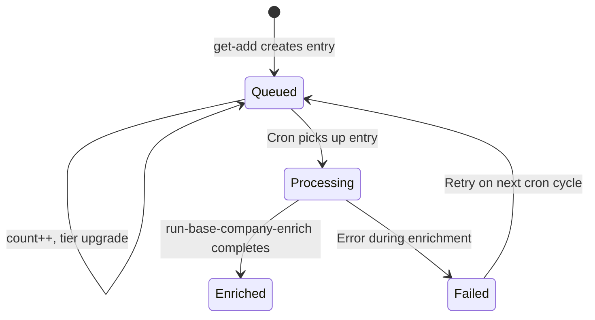

The enrichment waterfall is the sequence of functions that fires when a new entity enters the system. It starts with a single input (a domain, a LinkedIn URL, a name) and cascades outward — creating records, enriching from external APIs, discovering related entities, and queueing them for their own enrichment.

This page documents the **shared mechanics** that apply to both the company and person pipelines. See [Company Enrichment Phases](/guides/enrichment/waterfall/company-enrichment-phases) and [Person Enrichment Phases](/guides/enrichment/waterfall/person-enrichment-phases) for the pipeline-specific flow.

---

## Cascade Depth

Every entity in the system has a **cascade depth** — the number of hops from the original seed entity.

| Depth | Meaning | Behavior |
|:-----:|---------|----------|
| **0** | Seed entity (the one the user asked for) | Enriched immediately, all APIs called |
| **1** | Direct discovery (e.g. a founder's current employer) | Queued, external APIs skipped in `get-add` |
| **2** | Secondary discovery (e.g. an investor found on a depth-1 company) | Queued, lower priority |
| **3+** | Tertiary and beyond | Queued, lowest priority |

When `cascade_depth > 0`, the `get-add` functions skip external API calls (PDL, Enrich Layer) entirely. The entity is created from whatever data is already available (Fundable, input params) and queued for later enrichment.

---

## Priority Tiers

Queue entries are ranked by business importance:

| Tier | Description | Examples |
|:----:|-------------|----------|
| **1** | Current employer, founders | The company a person works at now |
| **2** | Past employers, VC firms | Previous jobs, investment firms |
| **3** | Schools, angel investors | Educational institutions, individual investors |
| **4** | Everything else | Certification issuers, volunteer orgs, publishers |

When a queue entry already exists and a new reference arrives with a better (lower) tier, the tier is upgraded. The `count` field tracks how many times the entity was referenced.

---

## Queue Tables

```text
queue_enrich_company — #583
```

| Field | Type | Description |
|-------|------|-------------|
| `master_company_id` | int | FK to `master_company` |
| `processing` | bool | Lock flag for the queue worker |
| `count` | int | How many times this entity was queued (default 1) |
| `cascade_depth` | int | Hops from seed entity |
| `priority_tier` | int | 1-4, lower = more important |
| `source_function` | text | Which function queued it (e.g. `resolve-investors-edges`) |
| `source_entity_id` | int | The `master_person_id` or `master_company_id` that spawned this |

```text
queue_enrich_person — #582
```

Same schema with `master_person_id` instead of `master_company_id`, plus a `deep_research` boolean flag.

---

## Enrichment Queue Processing

Queued entities are processed by cron jobs that pull from the queue tables in priority order.

### Queue Upsert Pattern

When a company is queued multiple times (e.g. discovered as an employer by two different people), the system uses an **upsert** pattern:

1. Check if `queue_enrich_company` already has an entry for this `master_company_id`
2. If **yes**: increment `count`, upgrade `priority_tier` to the better (lower) value
3. If **no**: insert new queue entry with all metadata

This means a company discovered once as a tier-4 publisher and again as a tier-1 current employer will be upgraded to tier 1 — it gets enriched sooner because someone important works there.

### Queue Entry Lifecycle



---

## Kill Switch

```text
mvp/stop/check-kill-switch-company
```

A safety valve that can be toggled to halt all new entity creation. When active:

- **Existing companies**: Still returned via local-only lookup (domain + URLs)
- **New companies**: Blocked entirely — no API calls, no records created
- **Logged**: Every blocked entity is recorded in `log_crash` with the input data for later processing

The kill switch runs in **Section 3b**, before any external API calls. This ensures zero API spend when the switch is on.

The person pipeline has the equivalent `mvp/stop/check-kill-switch-person` — blocked persons are saved to `kill_switch_blocked_people` for later reprocessing.

---

## Per-Phase Crash Logging

Both orchestrators write per-phase observability into `log_crash` using a dedicated `phase` enum field (added 2026-04-14, `run-base-person-enrich` v3.2). Each phase wraps its work in a `try_catch` so a failure in one phase is logged but does not block later phases.

Rows written per phase:
- `qa_passed: true` when the phase completes cleanly
- `qa_passed: false` + stack trace when the phase throws, with `phase` set to the phase name (e.g. `resolve-edges-work`, `llm-bios`)

This lets the QA dashboards filter crashes by exact phase rather than scanning unstructured messages.
