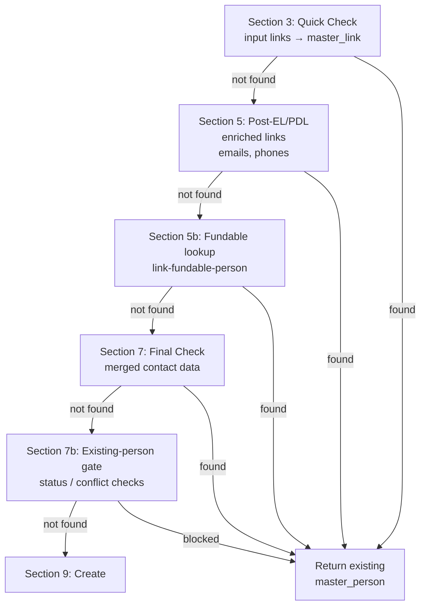
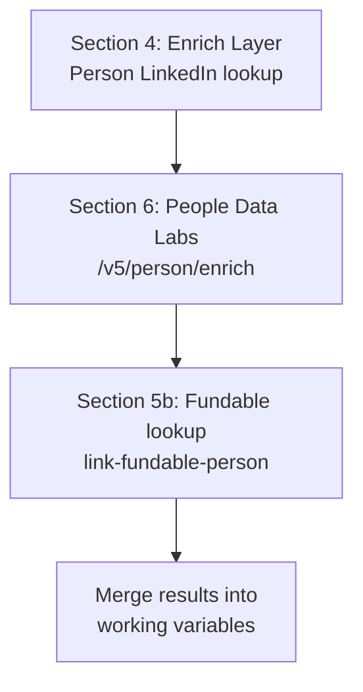
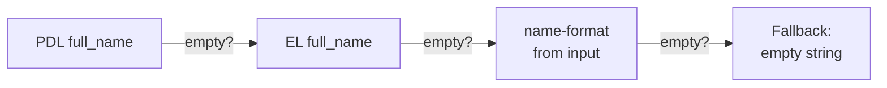
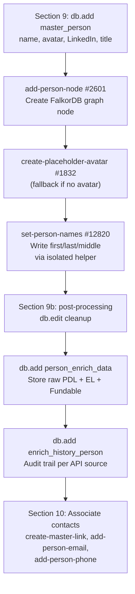
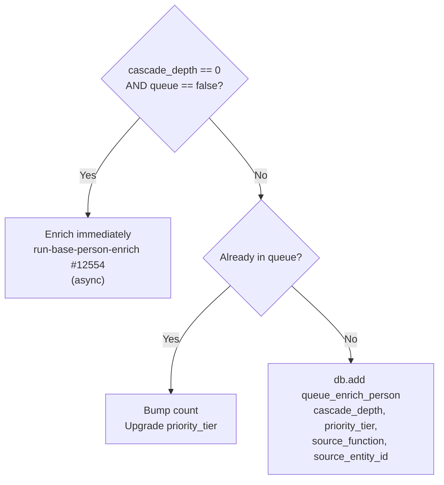

The person waterfall begins when any function calls `mvp/get-add/master-person`. This page walks through the full flow using **Zeno Rocha** (founder of Resend) as the running example — entered with just a LinkedIn URL. See [Core Concepts](/guides/enrichment/waterfall/core-concepts) for shared mechanics (cascade depth, priority tiers, queue tables).

---

## Entry Point

```text
mvp/get-add/master-person — #12553
```

**Current version:** v2.9 (2026-04-13) — calls helper function `mvp/format/set-person-names` to write `first_name` / `last_name` via `db.edit` in an isolated scope, working around a Xano naming-collision bug. See function description in Xano for the v2.1 → v2.9 changelog.

Called with:
```json
{
  "links": ["https://www.linkedin.com/in/zeno-rocha-6270a914"],
  "cascade_depth": 0,
  "priority_tier": 1
}
```

At depth 0, `first_name` and `last_name` are typically empty — the pipeline discovers the name from external APIs and parses it via LLM.

---

## Phase 1: Name Parsing from Input (Section 1)

If a `full_name` is provided (common at depth > 0 when the name comes from Fundable data), the function immediately calls the name-format LLM to split it:

```text
mvp/format/name-format — #2649
```

This LLM-powered function (Groq Llama 3.3, Gemini 2.5 Pro fallback) parses a full name into structured fields:

```json
{
  "full_name": "Zeno Rocha",
  "first_name": "Zeno",
  "middle_name": null,
  "last_name": "Rocha",
  "suffix": null,
  "nickname": null
}
```

The result is saved as `$inputNameFormat` for later use as a fallback.

---

## Phase 2: Kill Switch (Section 2b)

```text
mvp/stop/check-kill-switch-v2
```

Before any external API call, the kill switch is checked (v2.1, 2026-04-13). When active:
- Existing persons are still returned via local-only lookup (links/emails/phones).
- New persons are saved to `kill_switch_blocked_people` for later reprocessing — zero external API spend.

Returns early if the switch is on.

---

## Phase 3: Dedup Cascade (Sections 3 → 5 → 5b → 7 → 7b)

Before creating anything, the function checks for existing records:



For Zeno Rocha on first entry — no existing `master_link` for his LinkedIn URL, so all checks pass through to create.

---

## Phase 4: External API Enrichment (Sections 4, 6) + Fundable

When `cascade_depth == 0`, both external APIs are called; Fundable is also queried to link any matching `fundable_people` record.



**When `cascade_depth > 0`** (v2.2, 2026-04-13): Both PDL and Enrich Layer are **skipped entirely**. The person is created from whatever data was passed in (name, links, company) + Fundable if a match exists, and queued for later enrichment.

| API | Endpoint | Data Retrieved |
|-----|----------|----------------|
| **Enrich Layer** | `api/enrich_layer/person-linkedin` | Full name, avatar, headline, current company, location |
| **PDL** | `/v5/person/enrich` | Full name, emails, phones, profiles, work history, education |
| **Fundable** | `mvp/fundable/link-fundable-person` | Matches by LinkedIn / CB / X URL, links `fundable_people.master_person_id` |

For Zeno at depth 0, PDL returns his full profile — name, work history at Resend and Liferay, education at UNIRIO and PUCPR, social profiles, and contact info.

---

## Phase 5: Name Resolution

After enrichment, the function resolves the best name using a multi-source fallback chain:



The resolved name is then parsed through a **lambda** (`$parsedName`) that extracts `_fn`, `_ln`, `_mn`, `_suffix`, `_nick` — using non-colliding key names to avoid a Xano naming collision where `first_name`/`last_name` as data keys would resolve to the function's empty input parameters instead of the expression values.

---

## Phase 6: Record Creation (Sections 9 → 9b → 10)



```text
mvp/format/set-person-names — #12820
```

The `set-person-names` helper (v1.0, 2026-04-13) writes name fields in an isolated scope — its inputs are named `fn`, `ln`, `mn`, `sfx`, `nick` instead of `first_name`, `last_name`, which avoids Xano's naming collision bug. Without this helper, `db.edit` silently writes empty strings because the data keys collide with the parent function's input parameter names.

```text
mvp/avatar/create-placeholder-avatar — #1832
```

When neither Enrich Layer nor PDL returns an avatar URL, `add-person-node` fans out to `create-placeholder-avatar` (v1.2, 2026-04-12). It builds a [UI Avatars](/guides/third-party-apis/ui-avatars) URL from the person's initials, converts the result to webp, uploads it to Google Cloud Storage, and creates a `master_avatar` record. The v1.2 dedup fix returns existing URLs on re-runs instead of re-uploading.

For Zeno Rocha, this creates:
- **master_person** with `name: "Zeno Rocha"`, `first_name: "Zeno"`, `last_name: "Rocha"`, avatar, LinkedIn URL
- **Person node** in FalkorDB graph
- **master_avatar** (placeholder if no real avatar was returned by EL/PDL)
- **person_enrich_data** storing raw PDL + EL responses
- **master_link** entries for all known profile URLs
- **master_email** and **master_phone** entries from PDL

---

## Phase 7: Enrichment Dispatch (Sections 11 → 12)

Same routing logic as the company waterfall:



For Zeno at depth 0: **immediate enrichment** fires asynchronously.

---

## run-base-person-enrich Phases

```text
mvp/enrich/run-base-person-enrich — #12554
```

**Current version:** v3.2 (2026-04-14) — refactored orchestrator. Each phase was moved out of inline sections into its own `process-person-phase-N` function, and each is wrapped in a try_catch that writes per-phase `qa_passed` / `CRASH: phase-N` rows into `log_crash` using a dedicated `phase` enum field for clean dashboard filtering.

A stale-dispatch guard at the top returns early with a `log_crash` entry if the `master_person` row has been deleted since the async fire.

Each phase passes independently — failures are logged but don't block later phases.

| # | Sub-function | What It Does |
|:-:|--------------|-------------|
| **—** | **Setup** (inline) | Upsert `enrich_history_person` row (`data_source_id: 79`), load `person_enrich_data`, copy PDL `sex` onto `master_person`. |
| **1** | `process-person-phase-1` #12822 | **Enrich Layer API** — LinkedIn path with email fallback, 30-day dedup, history record (`data_source_id: 94`). |
| **2** | `process-person-phase-2` #12823 | **Primary Location** — cascade EL → LinkedIn → PDL, call `add-person-primary-location`. |
| **3** | `process-person-phase-3` #12824 | **Process PDL** — skills, interests, languages, education, work, certs, bios. **v3 (2026-04-15):** primary-current-company call now hard-codes `cascade_depth: 0` in addition to `queue: false`, so PDL+EL and `run-base-company-enrich-v3` always fire for the current employer regardless of the enclosing person's depth. v2 (2026-04-14) introduced the primary-current-company enrichment step. |
| **4** | `process-person-phase-4` #12825 | **Process Enrich Layer Data** — call `process-enrich-layer`, mark EL history complete (`data_source_id: 94`). |
| **5** | `process-person-phase-5` #12826 | **Fundable People Linking** — match via LinkedIn / CB / X URLs, link `fundable_people.master_person_id`. |
| **6** | `process-person-phase-6` #12827 | **LLM Bios & Deep Research** — `create-llm-person-bios`; conditional `deep-research-person-prompt` when `deep_research=true`. |
| **7** | `process-person-phase-7` #12828 | **Resolve Edges** — all 6 edge types: `resolve-edges-education` #12560, `resolve-edges-work` #12562, `resolve-edges-certifications` #12578, `resolve-edges-projects-publications` #12579, `resolve-edges-honor` #4574, `resolve-edges-volunteering` #4575. |
| **8** | `process-person-phase-8` #12829 | **Expertise, IMDB & Angel Detection** — `llm-identify-person-expertise`, IMDB verify/link, angel flag from expertise `subdomain 22`. |
| **9** | `process-person-phase-9` #12830 | **Investor Pipeline** — Signal NFX scrape, `person-extract-cb-signal`, Fundable investor data, `investor_profile_person` upsert. |
| **10** | `process-person-phase-10` #12831 | **Deal Nodes & Investor Edges** — loop `fundable_angel_investments`, ensure target + VC orgs have `master_company`, `link-fundable-org`. |
| **11** | `process-person-phase-11` #12832 | **Complete Enrichment** — call `complete-person-enrich` to finalize (flip visibility, mark `enrich_success`). |

<Note>
All `resolve-edges-*` functions called by Phase 7 were upgraded in April 2026 to accept `cascade_depth` and pass `queue: true` + `priority_tier` + `source_function` + `source_entity_id` to every `get-add/master-company` and `get-add/master-person` call. This is what makes the cascade traceable in the queue tables.

Most recent: `resolve-edges-work` v1.3 (2026-04-14, `|first_notnull:0` fix), `resolve-edges-certifications` v2.1 (2026-04-14, added missing `master_person_id` input).
</Note>

### Phase 3 Detail: Primary Current Company Auto-Enrichment

As of v3 of `process-person-phase-3` (2026-04-15), once PDL is processed the phase immediately finds the person's best current role and calls `get-add/master-company` with `cascade_depth: 0` and `queue: false` hard-coded — this **always enriches the primary current employer synchronously**, even when the enclosing person was itself discovered deeper in the cascade. v2 (2026-04-14) introduced this step but propagated the enclosing `cascade_depth`, so downstream people's current companies were still being queued; v3 fixes that.

For Zeno Rocha, this means **Resend** is created and fully enriched during Phase 3 — before Phase 7 runs. This triggers the full company waterfall documented in [Company Enrichment Phases](/guides/enrichment/waterfall/company-enrichment-phases), including:

- Fundable lookup (finds Resend's Fundable org ID)
- PDL + EL **skipped** (Fundable data exists — `run-base-company-enrich-v3` v3.2/v3.3 optimization)
- Company node, enrich data, industries, about, links all created
- `run-base-company-enrich-v3` fires async — later discovers Resend's institutional investors (Polar, Accel, Charm, Fuel Capital, Gradient, Cavalry Ventures) and queues them

### Phase 7 Detail: Edge Resolution

Phase 7 runs all six `resolve-edges-*` functions sequentially. Zeno's work-history sub-call (`resolve-edges-work` v1.3) skips Resend (already enriched in Phase 3) but queues his past employers. Education resolution queues YC, Berkeley, UNIRIO, and PUCPR at tier 3.

### Phase 9/10 Detail: Investor Discovery

The investor pipeline runs across phases 9 and 10. Phase 9 handles Signal NFX / Crunchbase signal extraction and upserts `investor_profile_person`; Phase 10 loops `fundable_angel_investments` and ensures each target + VC organization has a `master_company` row (via `get-add/master-company` with cascade metadata). This is how the 9 angel investors around Zeno get discovered and queued:

| Investor | Source | Queue Tier | Why |
|----------|--------|:----------:|-----|
| Bu Kinoshita | process-yc-people (co-founder) | **1** | YC co-founder gets highest priority |
| Diana Hu | process-yc-people (YC partner) | **2** | YC partner, high value |
| Guillermo Rauch | resolve-investors-edges | **3** | Angel investor |
| Dylan Field | resolve-investors-edges | **3** | Angel investor |
| Paul Copplestone | resolve-investors-edges | **3** | Angel investor |
| Alana Goyal | resolve-investors-edges | **3** | Angel investor |
| Calvin French-Owen | resolve-investors-edges | **3** | Angel investor |
| Lachy Groom | resolve-investors-edges | **3** | Angel investor |
| Elad Gil | resolve-investors-edges | **3** | Angel investor |

All 9 investors are created at **depth 1** with external APIs skipped — their names and LinkedIn URLs come from Fundable data. Each is queued to `queue_enrich_person` for full enrichment later.

---

## Cascade Example: Zeno Rocha at Depth 0

Here's the complete cascade from the sandbox run — one LinkedIn URL generated **10 people** and **19 companies**:

```
Depth 0: Zeno Rocha (linkedin.com/in/zeno-rocha-6270a914)
├── get-add/master-person → person #1 (immediate enrichment)
│   └── run-base-person-enrich (11 phases)
│
│       Phase 3 (process-person-phase-3 v3) — Process PDL
│       │   + auto-enrich primary current company (cascade_depth=0, queue=false)
│       └── Resend (company #1) → depth 0, immediate enrichment
│           └── run-base-company-enrich-v3
│               └── Phase 7 (process-company-phase-7) — add-all-fundable-deals
│                   └── resolve-investors-edges (institutional)
│                       ├── Polar (#14) → queued depth 0, tier 4
│                       ├── Accel (#15) → queued depth 0, tier 4
│                       ├── Charm (#16) → queued depth 0, tier 4
│                       ├── Fuel Capital (#17) → queued depth 0, tier 4
│                       ├── Gradient (#18) → queued depth 0, tier 4
│                       └── Cavalry Ventures (#19) → queued depth 0, tier 4
│
│       Phase 7 (process-person-phase-7) — Resolve Edges
│       ├── resolve-edges-work (past employers)
│       │   ├── WorkOS (#7) → queued depth 1, tier 2
│       │   ├── Liferay (#8) → queued depth 1, tier 2
│       │   ├── Globo (#9) → queued depth 1, tier 2
│       │   ├── Petrobras (#10) → queued depth 1, tier 2
│       │   └── Caos (#11) → queued depth 1, tier 2
│       ├── resolve-edges-education
│       │   ├── Y Combinator (#2) → queued depth 1, tier 3
│       │   ├── UC Berkeley (#3) → queued depth 1, tier 3
│       │   ├── UNIRIO (#4) → queued depth 1, tier 3
│       │   └── PUCPR (#5) → queued depth 1, tier 3
│       └── resolve-edges-projects-publications
│           ├── Turbo Excel (#12) → queued depth 1, tier 4
│           └── yfdpco2.com (#13) → queued depth 1, tier 4
│
│       Phase 9 + 10 (process-person-phase-9/10) — Investor Pipeline + Deals
│       ├── Bu Kinoshita (person #2) → queued depth 1, tier 1
│       ├── Diana Hu (person #3) → queued depth 1, tier 2
│       ├── Guillermo Rauch (#4) → queued depth 1, tier 3
│       ├── Dylan Field (#5) → queued depth 1, tier 3
│       ├── Paul Copplestone (#6) → queued depth 1, tier 3
│       ├── Alana Goyal (#7) → queued depth 1, tier 3
│       ├── Calvin French-Owen (#8) → queued depth 1, tier 3
│       ├── Lachy Groom (#9) → queued depth 1, tier 3
│       └── Elad Gil (#10) → queued depth 1, tier 3
│
│       Phase 11 (process-person-phase-11) — Complete enrichment
│       └── complete-person-enrich → visibility: true
```

### Final Queue State

After Zeno's enrichment completes, the queues contain:

**queue_enrich_person** (9 entries):

| Person | Tier | Source (`source_function`) | Depth |
|--------|:----:|---------------------------|:-----:|
| Bu Kinoshita | **1** | process-yc-people | 1 |
| Diana Hu | **2** | process-yc-people | 1 |
| Guillermo Rauch | **3** | resolve-investors-edges | 1 |
| Dylan Field | **3** | resolve-investors-edges | 1 |
| Paul Copplestone | **3** | resolve-investors-edges | 1 |
| Alana Goyal | **3** | resolve-investors-edges | 1 |
| Calvin French-Owen | **3** | resolve-investors-edges | 1 |
| Lachy Groom | **3** | resolve-investors-edges | 1 |
| Elad Gil | **3** | resolve-investors-edges | 1 |

**queue_enrich_company** (18 entries):

| Company | Tier | Source | Depth |
|---------|:----:|--------|:-----:|
| SV Angel | **2** | resolve-investors-edges | 1 |
| WorkOS | **2** | resolve-edges-work | 1 |
| Liferay | **2** | resolve-edges-work | 1 |
| Globo | **2** | resolve-edges-work | 1 |
| Petrobras | **2** | resolve-edges-work | 1 |
| Caos | **2** | resolve-edges-work | 1 |
| Y Combinator | **3** | resolve-edges-education | 1 |
| UC Berkeley | **3** | resolve-edges-education | 1 |
| UNIRIO | **3** | resolve-edges-education | 1 |
| PUCPR | **3** | resolve-edges-education | 1 |
| Polar | **4** | _(from Resend's enrichment)_ | 0 |
| Accel | **4** | _(from Resend's enrichment)_ | 0 |
| Charm | **4** | _(from Resend's enrichment)_ | 0 |
| Fuel Capital | **4** | _(from Resend's enrichment)_ | 0 |
| Gradient | **4** | _(from Resend's enrichment)_ | 0 |
| Cavalry Ventures | **4** | _(from Resend's enrichment)_ | 0 |
| Turbo Excel | **4** | resolve-edges-projects | 1 |
| yfdpco2.com | **4** | resolve-edges-projects | 1 |

When the queue worker processes these in priority order, each entity will trigger its own enrichment — potentially discovering more entities and queueing them at depth 2, continuing the cascade.
