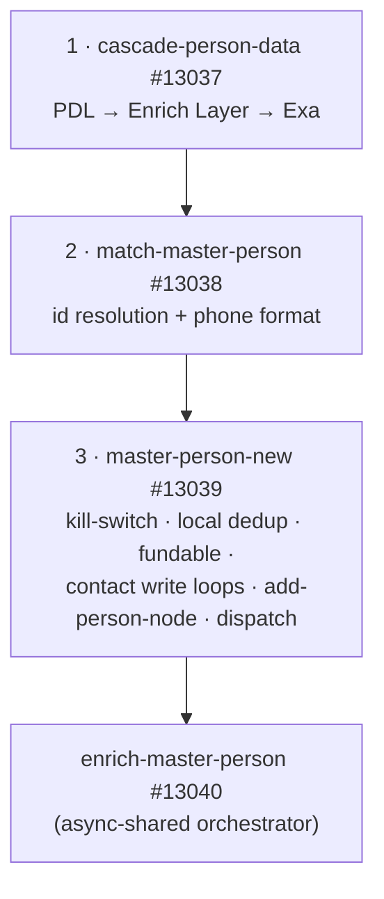
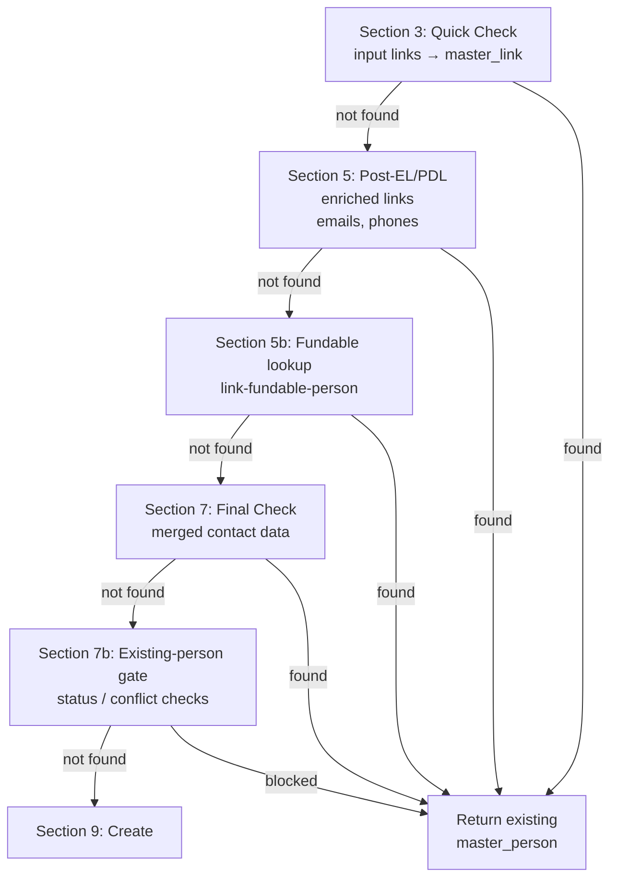
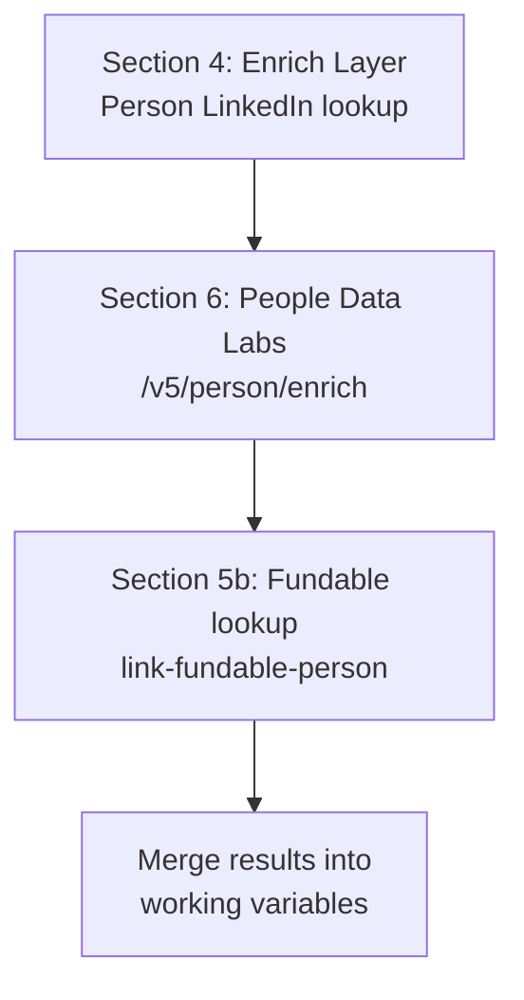
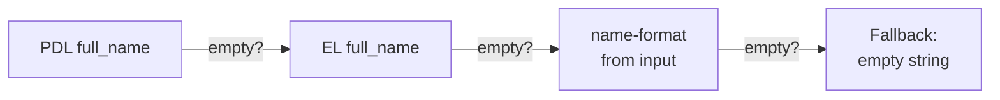
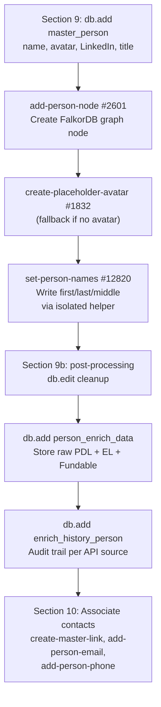
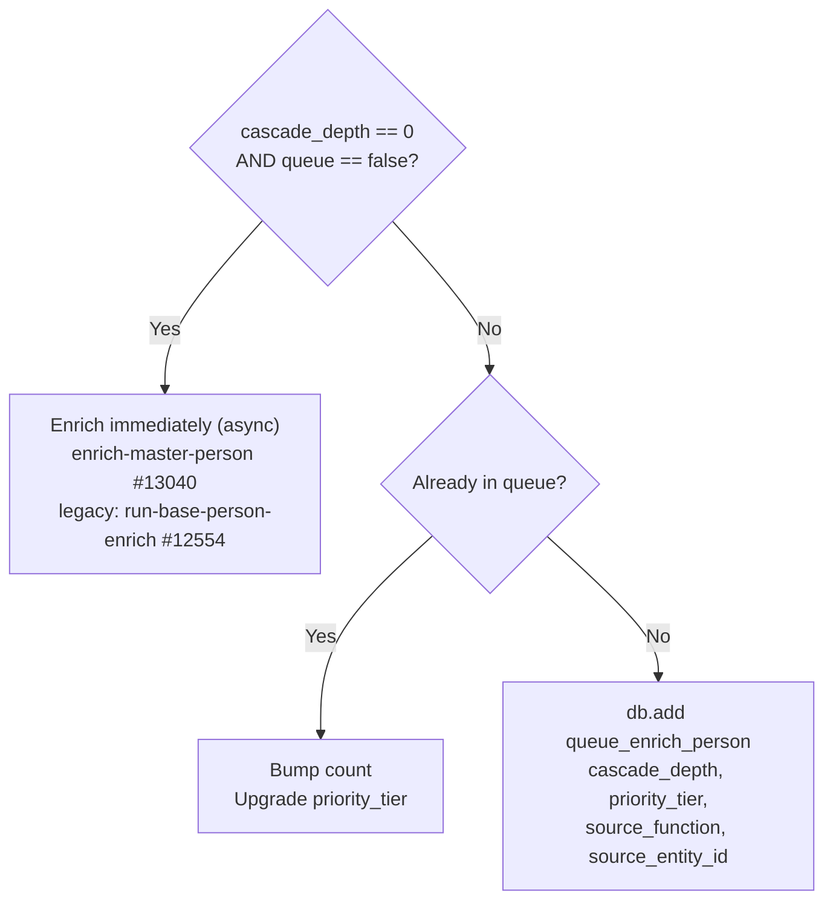

The person waterfall begins when any function calls the master-person get-add. This page walks through the full flow using **Zeno Rocha** (founder of Resend) as the running example — entered with just a LinkedIn URL. See [Core Concepts](/guides/enrichment/waterfall/core-concepts) for shared mechanics (cascade depth, priority tiers, queue tables).

<Note>
**New architecture (May 2026).** The original monolith `mvp/get-add/master-person` #12553 is being replaced by a refactored sibling, **`mvp/get-add/master-person-new` #13039** — same input/response shape, a drop-in swap once verified. It splits the get-add into three composable stages and dispatches a new orchestrator, **`mvp/enrich/enrich-master-person` #13040** (successor to `run-base-person-enrich` #12554). The phase sub-functions (`process-person-phase-*`) are **shared** between both orchestrators, so the phase reference below applies to both. Sections marked _(legacy)_ describe the #12553/#12554 path, which behaves identically except where noted.
</Note>

---

## Pipeline Architecture (master-person-new)

```text
mvp/get-add/master-person-new — #13039   (v1.7, 2026-05-30)
```

The refactored entry point splits the old monolith into three composable stages, then dispatches the orchestrator:



| Stage | Function | Responsibility |
|-------|----------|----------------|
| 1 | `mvp/enrich/cascade-person-data` #13037 | Gathers raw enrichment in order: PDL → Enrich Layer (`api/enrich_layer/person-linkedin`, `person-email`) → Exa (`get-exa-profile`). Returns deduped `el_links` and a `needs_full_enrich` flag when sources are thin. |
| 2 | `mvp/resolve/match-master-person` #13038 | Resolves the `master_person` id from links / emails / phones and formats phone numbers via `llm-phone-format`. No graph writes. |
| 3 | `mvp/get-add/master-person-new` #13039 | Kill-switch → **pre-API local dedup** (v1.6: links/emails/`linkedin_url`) → Fundable lookup → contact write loops (`add-person-email`, `create-master-link`, `add-person-phone`) → `add-person-node` #2601 (graph Person node) → downstream dispatch. When `needs_full_enrich`, also fires `enrich/full-enrich-reverse-email-lookup` #13036 (async; FullEnrich webhook #8594 writes back into `person_enrich_data.full_enrich`). |

**Downstream dispatch (final section).** When the person is new and not queued (`cascade_depth == 0` and `queue == false`), #13039 fires **`enrich-master-person` #13040** in **async-shared** mode (`master_person_id`, `deep_research`, `cascade_depth`). Otherwise it upserts `queue_enrich_person`. A `hold_downstream` input skips the dispatch and logs a `log_crash` note instead.

<Warning>
**Sandbox WIP:** the immediate-dispatch branch currently contains a `debug.stop "HOLD!!"` **immediately before** the `enrich-master-person` call, so the synchronous enrichment path is halted for debugging. Remove the `debug.stop` to restore live dispatch.
</Warning>

---

## Entry Point _(live: #13039 — migrated 2026-06-01)_

```
mvp/get-add/master-person-new — #13039
```

<Note>
  **Migrated 2026-06-01.** All function callers and the V2 Master Persons `POST master-persons` endpoint now invoke `mvp/get-add/master-person-new` (#13039) — the phase-split refactor (cascade `#13037` → match `#13038` → write / create / downstream dispatch). The previous entry point `mvp/get-add/master-person` (#12553) is **deprecated** and pending retirement. See [person-pipeline-polish](/guides/robert-mark/person-pipeline-polish) for the version timeline and the #12553 → #13039 divergences.
</Note>

Called with:
```json
{
  "links": ["https://www.linkedin.com/in/zeno-rocha-6270a914"],
  "cascade_depth": 0,
  "priority_tier": 1
}
```

At depth 0, `first_name` and `last_name` are typically empty — the pipeline discovers the name from external APIs and parses it via LLM.

---

## Phase 1: Name Parsing from Input (Section 1)

If a `full_name` is provided (common at depth > 0 when the name comes from Fundable data), the function immediately calls the name-format LLM to split it:

```text
mvp/format/name-format — #2649
```

This LLM-powered function (Groq Llama 3.3, Gemini 2.5 Pro fallback) parses a full name into structured fields:

```json
{
  "full_name": "Zeno Rocha",
  "first_name": "Zeno",
  "middle_name": null,
  "last_name": "Rocha",
  "suffix": null,
  "nickname": null
}
```

The result is saved as `$inputNameFormat` for later use as a fallback.

---

## Phase 2: Kill Switch (Section 2b)

```text
mvp/stop/check-kill-switch-v2
```

Before any external API call, the kill switch is checked (v2.1, 2026-04-13). When active:
- Existing persons are still returned via local-only lookup (links/emails/phones).
- New persons are saved to `kill_switch_blocked_people` for later reprocessing — zero external API spend.

Returns early if the switch is on.

---

## Phase 3: Dedup Cascade (Sections 3 → 5 → 5b → 7 → 7b)

Before creating anything, the function checks for existing records:



For Zeno Rocha on first entry — no existing `master_link` for his LinkedIn URL, so all checks pass through to create.

---

## Phase 4: External API Enrichment (Sections 4, 6) + Fundable

When `cascade_depth == 0`, both external APIs are called; Fundable is also queried to link any matching `fundable_people` record.



**When `cascade_depth > 0`** (v2.2, 2026-04-13): Both PDL and Enrich Layer are **skipped entirely**. The person is created from whatever data was passed in (name, links, company) + Fundable if a match exists, and queued for later enrichment.

| API | Endpoint | Data Retrieved |
|-----|----------|----------------|
| **Enrich Layer** | `api/enrich_layer/person-linkedin` | Full name, avatar, headline, current company, location |
| **PDL** | `/v5/person/enrich` | Full name, emails, phones, profiles, work history, education |
| **Fundable** | `mvp/fundable/link-fundable-person` | Matches by LinkedIn / CB / X URL, links `fundable_people.master_person_id` |

For Zeno at depth 0, PDL returns his full profile — name, work history at Resend and Liferay, education at UNIRIO and PUCPR, social profiles, and contact info.

---

## Phase 5: Name Resolution

After enrichment, the function resolves the best name using a multi-source fallback chain:



The resolved name is then parsed through a **lambda** (`$parsedName`) that extracts `_fn`, `_ln`, `_mn`, `_suffix`, `_nick` — using non-colliding key names to avoid a Xano naming collision where `first_name`/`last_name` as data keys would resolve to the function's empty input parameters instead of the expression values.

---

## Phase 6: Record Creation (Sections 9 → 9b → 10)



```text
mvp/format/set-person-names — #12820
```

The `set-person-names` helper (v1.0, 2026-04-13) writes name fields in an isolated scope — its inputs are named `fn`, `ln`, `mn`, `sfx`, `nick` instead of `first_name`, `last_name`, which avoids Xano's naming collision bug. Without this helper, `db.edit` silently writes empty strings because the data keys collide with the parent function's input parameter names.

```text
mvp/avatar/create-placeholder-avatar — #1832
```

When neither Enrich Layer nor PDL returns an avatar URL, `add-person-node` fans out to `create-placeholder-avatar` (v1.2, 2026-04-12). It builds a [UI Avatars](/guides/third-party-apis/ui-avatars) URL from the person's initials, converts the result to webp, uploads it to Google Cloud Storage, and creates a `master_avatar` record. The v1.2 dedup fix returns existing URLs on re-runs instead of re-uploading.

For Zeno Rocha, this creates:
- **master_person** with `name: "Zeno Rocha"`, `first_name: "Zeno"`, `last_name: "Rocha"`, avatar, LinkedIn URL
- **Person node** in FalkorDB graph
- **master_avatar** (placeholder if no real avatar was returned by EL/PDL)
- **person_enrich_data** storing raw PDL + EL responses
- **master_link** entries for all known profile URLs
- **master_email** and **master_phone** entries from PDL

---

## Phase 7: Enrichment Dispatch (Sections 11 → 12)

Same routing logic as the company waterfall:



For Zeno at depth 0: **immediate enrichment** fires asynchronously.

---

## Orchestrator Phases

```text
mvp/enrich/enrich-master-person   — #13040   (v3.9, 2026-06-01)   ← new orchestrator, dispatched by master-person-new
mvp/enrich/run-base-person-enrich — #12554   (source sweep, 2026-06-01)   ← legacy orchestrator, dispatched by master-person
```

Both orchestrators run the **same shared `process-person-phase-*` sub-functions**, each wrapped in a `try_catch` that writes per-phase `qa_passed` / `CRASH: phase-N` rows to `log_crash` (using the dedicated `phase` enum field). Current behavior:

- **Source-keyed history (v3.9).** Debounce + upsert key on `enrich_history_person.source == "Master Person Enrich"` instead of the legacy numeric source id. New setup rows write source text only; legacy `data_source_id` inputs remain unused for compatibility.
- **Completion marker (v3.8).** A final step flips `enrich_history_person.processing = false` regardless of crash state — the FullEnrich webhook (#8594) polls this flag to detect orchestrator completion before applying `process-full-enrich`.
- **Phase 4b — Exa profile (v3.5).** Runs `process-person-exa-profile` #13031 between Phase 4 and Phase 5 (bios, avatar replacement, work_experience rows; idempotent — no-ops when `person_enrich_data.exa` is empty).
- **RocketReach removed (v3.7).** The former Phase 4c and its helpers (`process-person-rocket-reach` #13033, `get-rocketreach-person` #13032) are gone.

**Legacy baseline:** `run-base-person-enrich` v3.4 (2026-04-24) added **Phase 12** (`mvp/format/resolve-temp-name` #12890) as a final cleanup pass that replaces any remaining `temp_{uuid}` placeholder names on `master_person` with real data, either by scanning `enrich_history_person` (priority: PDL → EL → Twitter → Fundable → CB) or by parsing the LinkedIn URL slug. The 2026-06-01 source sweep keeps that behavior but keys the scan by source text.

A stale-dispatch guard at the top returns early with a `log_crash` entry if the `master_person` row has been deleted since the async fire.

**60s debounce (source-keyed).** Immediately after the stale-dispatch guard, a second early-return checks for any `enrich_history_person` row with the same `master_person_id` + `source == "Master Person Enrich"` + `updated_at > now - 60_000`. If found, logs `"DUPLICATE TRIGGER, debounced (60s window)"` and returns null — no phases re-run. The setup row is upsert-style on (master_person_id, source), so the key is `updated_at` (touched on every re-run) rather than `created_at` (frozen at first write). Caveat: a manual force re-run within 60s is also blocked — null the row's `updated_at` to override.

Each phase passes independently — failures are logged but don't block later phases.

| # | Sub-function | What It Does |
|:-:|--------------|-------------|
| **—** | **Setup** (inline) | Upsert `enrich_history_person` row — keyed on `source = "Master Person Enrich"` in #13040 and #12554, load `person_enrich_data`, copy PDL `sex` onto `master_person`. |
| **0** | `process-person-phase-0` #12857 | **PDL Backfill** (v3.3, 2026-04-20) — re-fetches PDL into `person_enrich_data.pdl` before Phase 1 when it is missing. |
| **1** | `process-person-phase-1` #12822 | **Enrich Layer API** — LinkedIn path with email fallback, 30-day dedup, history record (`source: "Enrich Layer"`). |
| **2** | `process-person-phase-2` #12823 | **Primary Location** — cascade EL → LinkedIn → PDL, call `add-person-primary-location`. |
| **3** | `process-person-phase-3` #12824 | **Process PDL** — skills, interests, languages, education, work, certs, bios. **v3 (2026-04-15):** primary-current-company call now hard-codes `cascade_depth: 0` in addition to `queue: false`, so the current company get-add enrichment and `enrich-master-company` always fire for the current employer regardless of the enclosing person's depth. v2 (2026-04-14) introduced the primary-current-company enrichment step. |
| **4** | `process-person-phase-4` #12825 | **Process Enrich Layer Data** — call `process-enrich-layer`, mark EL history complete (`source: "Enrich Layer"`). |
| **4b** | `process-person-exa-profile` #13031 | **Process Exa Profile** (#13040 only, v3.5, 2026-05-24) — turns `person_enrich_data.exa` into bio rows, an avatar replacement, and `work_experience` rows. Idempotent — no-ops when `exa` is empty. |
| **5** | `process-person-phase-5` #12826 | **Fundable People Linking** — match via LinkedIn / CB / X URLs, link `fundable_people.master_person_id`. |
| **6** | `process-person-phase-6` #12827 | **LLM Bios & Deep Research** — `create-llm-person-bios`; conditional `deep-research-person-prompt` when `deep_research=true`. |
| **7** | `process-person-phase-7` #12828 | **Resolve Edges** — all 6 edge types: `resolve-edges-education` #12560, `resolve-edges-work` #12562, `resolve-edges-certifications` #12578, `resolve-edges-projects-publications` #12579, `resolve-edges-honor` #4574, `resolve-edges-volunteering` #4575. |
| **8** | `process-person-phase-8` #12829 | **Expertise, IMDB & Angel Detection** — `llm-identify-person-expertise`, IMDB verify/link, angel flag from expertise `subdomain 22`. |
| **9** | `process-person-phase-9` #12830 | **Investor Pipeline + Deal Cascade** — Signal NFX scrape, `person-extract-cb-signal`, Fundable investor data, `investor_profile_person` upsert. **v3.0 (2026-04-19):** each angel investment now cascades through `mvp/investor/cascade-deal-participants` #12856 — portfolio company, co-angels, VC firms, VC partners (via `fundable_institutional_investments_person`), Funding_Round node, RAISED + INVESTED_IN edges, and IPO/exit signal to `company_financial.is_public`. |
| **10** | `process-person-phase-10` #12831 | **Stub (deprecated).** v2.0 (2026-04-19) reduced this to a no-op — deal cascade is fully owned by Phase 9 v3.0. Kept in the orchestrator call chain during transition; safe to drop later. |
| **11** | `process-person-phase-11` #12832 | **Complete Enrichment** — call `complete-person-enrich` to finalize (flip visibility, mark `enrich_success`). |
| **12** | `mvp/format/resolve-temp-name` #12890 | **Resolve Temp Name** — if `master_person.name` (or `first_name`) still starts with `temp_`, scan `enrich_history_person` for a usable name (priority: `People Data Labs` → `Enrich Layer` → `Twitter` → `Fundable` → `Crunchbase`) and fall back to parsing the LinkedIn URL slug. When a candidate is found, it passes through `name-format` + `set-person-names` to overwrite the placeholder. A sanity-check rejects LLM output whose letters don't overlap the input (guards against transient garbage). Added in v3.4 (2026-04-24); source-keyed in the 2026-06-01 migration. |

<Note>
All Phase 7 `resolve-edges-*` functions were upgraded in April 2026 to accept `cascade_depth` and pass `queue: true` + `priority_tier` + `source_function` + `source_entity_id` to every `get-add/master-company-new` and `get-add/master-person-new` (#13039) call. This makes the cascade traceable in the queue tables.

Most recent: `run-base-person-enrich` v3.4 (2026-04-24, Phase 12 — `resolve-temp-name` cleanup), `process-person-phase-9` v3.0 (2026-04-19, deal cascade via `cascade-deal-participants`), `process-person-phase-10` v2.0 (2026-04-19, reduced to no-op stub — phase-9 owns the cascade), `resolve-edges-work` v1.3 (2026-04-14, `|first_notnull:0` fix), `resolve-edges-certifications` v2.1 (2026-04-14, added missing `master_person_id` input).
</Note>

<Check>
**Graph node timestamp coverage (audited 2026-06-01).** Every node create/update reachable from this flow now stamps `created_at` on create and `updated_at` on update — verified across `add-person-node` #2601, the Phase 7 `resolve-edges-*` writers (`Certification`, `Project`, `Publication`, `Honor`, `Organization`), Phase 8 expertise (`SubDomainExpertise`) + IMDB (`Film_TV`, `Film_TV_Award`), Phase 9 funding (`Funding_Round`, `VC_Firm` label), Phase 2/3 location (`Country`/`Region`/`City`) + `Company`, and the `create-work-edges` #2800 Person/Company stub-`MERGE` (patched 2026-06-01). The orchestration / data functions (`master-person-new` #13039, `enrich-master-person` #13040, `cascade-person-data` #13037, `match-master-person` #13038, `process-person-exa-profile` #13031) perform **no** graph-node Cypher — they delegate to the leaf writers. Full per-function record: [Node Types → Timestamp coverage audit](/guides/ontology/nodes#timestamp-coverage-audit).
</Check>

### Phase 3 Detail: Primary Current Company Auto-Enrichment

As of v3 of `process-person-phase-3` (2026-04-15), once PDL is processed the phase immediately finds the person's best current role and calls `get-add/master-company-new` with `cascade_depth: 0` and `queue: false` hard-coded — this **always enriches the primary current employer synchronously**, even when the enclosing person was itself discovered deeper in the cascade. v2 (2026-04-14) introduced this step but propagated the enclosing `cascade_depth`, so downstream people's current companies were still being queued; v3 fixes that.

For Zeno Rocha, this means **Resend** is created and fully enriched during Phase 3 — before Phase 7 runs. This triggers the full company waterfall documented in [Company Enrichment Phases](/guides/enrichment/waterfall/company-enrichment-phases), including:

- Fundable lookup (finds Resend's Fundable org ID)
- `new-company-enrichment` fires inside `get-add/master-company-new` at initial create time
- Company node, enrich data, industries, about, links all created
- `enrich-master-company` fires async — the orchestrator opens with LLM preflight / Fundable re-lookup gates, then `get-exa-company-c-suite` (Exa founder + key-employee search) and the existing company phase chain. Later discovers Resend's institutional investors (Polar, Accel, Charm, Fuel Capital, Gradient, Cavalry Ventures) and queues them.

### Phase 7 Detail: Edge Resolution

Phase 7 runs all six `resolve-edges-*` functions sequentially. Zeno's work-history sub-call (`resolve-edges-work` v1.3) skips Resend (already enriched in Phase 3) but queues his past employers. Education resolution queues YC, Berkeley, UNIRIO, and PUCPR at tier 3.

### Phase 9 Detail: Investor & Deal Discovery (v3.0)

As of **v3.0 (2026-04-19)**, Phase 9 owns the full deal cascade. In addition to Signal NFX / Crunchbase signal extraction and the `investor_profile_person` upsert, it now loops `fundable_angel_investments` for the person and routes **each deal** through `mvp/investor/cascade-deal-participants` #12856.

The cascade helper handles one fundable deal end-to-end:

1. **Portfolio company** — `get-add/master-company-new` for the deal's target org (queued at **depth+1, tier 2**, `source_function: "cascade-deal-participants"`). Writes `master_company_id` back onto `fundable_organizations` for future lookups.
2. **IPO / exit signal** — when `fundable_organizations.ipo_status == "public"`, sets `company_financial.is_public = true` for the portfolio company (initialized upstream in `get-add/master-company-new` Section 9).
3. **Funding_Round node** — `add-fundable-deal-node` materializes the round as a graph node with a `RAISED` edge from the portfolio company.
4. **Co-investors + partners** — `resolve-investors-edges` #12702 walks both sides of the deal:
   - `fundable_angel_investments` → every **other angel** on the deal (people)
   - `fundable_institutional_investments` → every **VC firm** on the deal (companies)
   - `fundable_institutional_investments_person` → every **VC partner** tied to each firm on that deal (people)
   - All queued at **depth+1**, with the correct `LEAD_INVESTED_IN` / `INVESTED_IN` / `FOLLOW_ON_INVESTED_IN` / `INVESTMENT_PARTNER_IN` / `INVESTMENT_PARTNER_AT` edges in FalkorDB.

The same helper is called on the company side from `process-company-phase-7` → `add-all-fundable-deals` v2.0 (#12703), which walks both `fundable_deals WHERE organization_id=X` (rounds the org raised) **and** `fundable_institutional_investments WHERE organization_id=X` (rounds the org invested in). One cascade helper, one source of truth for deal fanout — whether entering from the angel-person side or the VC-firm-company side.

Example: for Zeno, each of his angel investments pulls in the portfolio company + every other investor (angel or VC) on that round + every partner at the VC firms — at depth 1, queued for later enrichment. Here is the subset discovered via `resolve-investors-edges` on Zeno's pre-v3.0 run:

| Investor | Source | Queue Tier | Why |
|----------|--------|:----------:|-----|
| Bu Kinoshita | process-yc-people (co-founder) | **1** | YC co-founder gets highest priority |
| Diana Hu | process-yc-people (YC partner) | **2** | YC partner, high value |
| Guillermo Rauch | resolve-investors-edges | **3** | Angel investor |
| Dylan Field | resolve-investors-edges | **3** | Angel investor |
| Paul Copplestone | resolve-investors-edges | **3** | Angel investor |
| Alana Goyal | resolve-investors-edges | **3** | Angel investor |
| Calvin French-Owen | resolve-investors-edges | **3** | Angel investor |
| Lachy Groom | resolve-investors-edges | **3** | Angel investor |
| Elad Gil | resolve-investors-edges | **3** | Angel investor |

All 9 investors are created at **depth 1** with external APIs skipped — their names and LinkedIn URLs come from Fundable data. Each is queued to `queue_enrich_person` for full enrichment later.

In v3.0, the same loop **also** pulls in the deal's portfolio company + VC firms + VC partners (institutional_investments_person), and writes the IPO signal to `company_financial.is_public` when the target org has exited via IPO. Queue metadata is stamped with `source_function: "cascade-deal-participants"` and `source_entity_id: master_person_id` for full traceability.

### Phase 10 Detail: Stub (v2.0, 2026-04-19)

Prior to v2.0 this phase had its own loop over `fundable_angel_investments` that queued target companies (tier 3) and VC firms (tier 2) at depth 1. That logic was a strict subset of what Phase 9 v3.0 now handles through `cascade-deal-participants`, so Phase 10 was reduced to a no-op stub. It's kept in the `run-base-person-enrich` call chain during the transition — safe to remove from the orchestrator in a later pass.

---

## Cascade Example: Zeno Rocha at Depth 0

Here's the complete cascade from the sandbox run — one LinkedIn URL generated **10 people** and **19 companies**:

```
Depth 0: Zeno Rocha (linkedin.com/in/zeno-rocha-6270a914)
├── get-add/master-person-new #13039 → person #1 (immediate enrichment)
│   └── enrich-master-person #13040 (legacy: run-base-person-enrich) — phases 0–12
│
│       Phase 3 (process-person-phase-3 v3) — Process PDL
│       │   + auto-enrich primary current company (cascade_depth=0, queue=false)
│       └── Resend (company #1) → depth 0, immediate enrichment
│           └── enrich-master-company #12992
│               └── Phase 7 (process-company-phase-7) — add-all-fundable-deals
│                   └── resolve-investors-edges (institutional)
│                       ├── Polar (#14) → queued depth 0, tier 4
│                       ├── Accel (#15) → queued depth 0, tier 4
│                       ├── Charm (#16) → queued depth 0, tier 4
│                       ├── Fuel Capital (#17) → queued depth 0, tier 4
│                       ├── Gradient (#18) → queued depth 0, tier 4
│                       └── Cavalry Ventures (#19) → queued depth 0, tier 4
│
│       Phase 7 (process-person-phase-7) — Resolve Edges
│       ├── resolve-edges-work (past employers)
│       │   ├── WorkOS (#7) → queued depth 1, tier 2
│       │   ├── Liferay (#8) → queued depth 1, tier 2
│       │   ├── Globo (#9) → queued depth 1, tier 2
│       │   ├── Petrobras (#10) → queued depth 1, tier 2
│       │   └── Caos (#11) → queued depth 1, tier 2
│       ├── resolve-edges-education
│       │   ├── Y Combinator (#2) → queued depth 1, tier 3
│       │   ├── UC Berkeley (#3) → queued depth 1, tier 3
│       │   ├── UNIRIO (#4) → queued depth 1, tier 3
│       │   └── PUCPR (#5) → queued depth 1, tier 3
│       └── resolve-edges-projects-publications
│           ├── Turbo Excel (#12) → queued depth 1, tier 4
│           └── yfdpco2.com (#13) → queued depth 1, tier 4
│
│       Phase 9 (process-person-phase-9 v3.0) — Investor Pipeline + Deal Cascade
│       ├── Signal NFX + CB extraction → investor_profile_person
│       └── foreach angel investment → cascade-deal-participants #12856
│           ├── Portfolio co (target org) → queued depth 1, tier 2
│           ├── IPO signal → company_financial.is_public (if applicable)
│           ├── Funding_Round node + RAISED edge (add-fundable-deal-node)
│           └── resolve-investors-edges walks the deal:
│               ├── Co-angels → queued depth 1, tier 3
│               ├── VC firms → queued depth 1, tier 2
│               └── VC partners (institutional_investments_person) → queued depth 1, tier 2
│       (for Zeno, this surfaced 9 investor people; v3.0 also now surfaces
│        co-investor VCs + their partners on those same rounds)
│
│       Phase 10 (process-person-phase-10 v2.0) — No-op stub (cascade owned by Phase 9)
│
│       Phase 11 (process-person-phase-11) — Complete enrichment
│       └── complete-person-enrich → visibility: true
│
│       Phase 12 (mvp/format/resolve-temp-name) — Temp name cleanup
│       └── (Zeno's name is already set; this is a no-op for him. Only fires
│            when an earlier phase left the placeholder temp_{uuid} in place.)
```

### Final Queue State

After Zeno's enrichment completes, the queues contain:

**queue_enrich_person** (9 entries):

| Person | Tier | Source (`source_function`) | Depth |
|--------|:----:|---------------------------|:-----:|
| Bu Kinoshita | **1** | process-yc-people | 1 |
| Diana Hu | **2** | process-yc-people | 1 |
| Guillermo Rauch | **3** | resolve-investors-edges | 1 |
| Dylan Field | **3** | resolve-investors-edges | 1 |
| Paul Copplestone | **3** | resolve-investors-edges | 1 |
| Alana Goyal | **3** | resolve-investors-edges | 1 |
| Calvin French-Owen | **3** | resolve-investors-edges | 1 |
| Lachy Groom | **3** | resolve-investors-edges | 1 |
| Elad Gil | **3** | resolve-investors-edges | 1 |

**queue_enrich_company** (18 entries):

| Company | Tier | Source | Depth |
|---------|:----:|--------|:-----:|
| SV Angel | **2** | resolve-investors-edges | 1 |
| WorkOS | **2** | resolve-edges-work | 1 |
| Liferay | **2** | resolve-edges-work | 1 |
| Globo | **2** | resolve-edges-work | 1 |
| Petrobras | **2** | resolve-edges-work | 1 |
| Caos | **2** | resolve-edges-work | 1 |
| Y Combinator | **3** | resolve-edges-education | 1 |
| UC Berkeley | **3** | resolve-edges-education | 1 |
| UNIRIO | **3** | resolve-edges-education | 1 |
| PUCPR | **3** | resolve-edges-education | 1 |
| Polar | **4** | _(from Resend's enrichment)_ | 0 |
| Accel | **4** | _(from Resend's enrichment)_ | 0 |
| Charm | **4** | _(from Resend's enrichment)_ | 0 |
| Fuel Capital | **4** | _(from Resend's enrichment)_ | 0 |
| Gradient | **4** | _(from Resend's enrichment)_ | 0 |
| Cavalry Ventures | **4** | _(from Resend's enrichment)_ | 0 |
| Turbo Excel | **4** | resolve-edges-projects | 1 |
| yfdpco2.com | **4** | resolve-edges-projects | 1 |

When the queue worker processes these in priority order, each entity will trigger its own enrichment — potentially discovering more entities and queueing them at depth 2, continuing the cascade.
