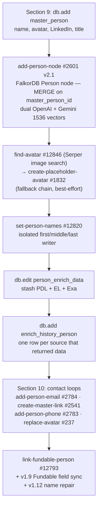
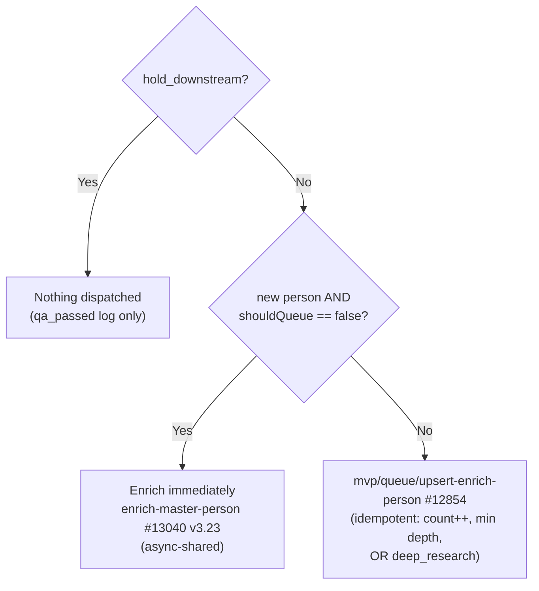

Every person enters the waterfall through **one synchronous get-add gate** — `mvp/get-add/master-person-new` #13039. The gate parses, dedups (twice — a cheap pre-API pass, then a 4-tier post-cascade resolution), enriches via the PDL → Enrich Layer → Exa cascade, and creates inline; new depth-0 people with `queue == false` dispatch the [phase orchestrator](/guides/enrichment/waterfall/person-functions) immediately (async), while cascade leaves discovered at depth \> 0 land in `queue_enrich_person` for [Person Waterfall Crons](/guides/enrichment/waterfall/person-crons) to drain. Architecture spec: [Person Waterfall overview](/guides/enrichment/waterfall/person-waterfall) · function roster: [Person Waterfall Functions](/guides/enrichment/waterfall/person-functions) · table schemas: [Person Waterfall Tables](/guides/enrichment/waterfall/person-tables).

## Live Xano function inventory

**Audit source:** Xano workspace `3`, branch `v1`, refreshed 2026-07-08. The inventory starts from the live entry gate `#13039`, orchestrator `#13040`, queue drainer `#12816`, FullEnrich tier `#13036` / `#13049`, and company C-suite seed path `#12997`, then includes active literal `function.run` callees plus production sidecars called out in the live Person roster. Legacy/deprecated/sandbox functions are excluded. Adjacent Company, IMDB, and Music waterfalls are listed only as explicit handoff targets, not recursively expanded.

| Area | Function | Used for |
| --- | --- | --- |
| Entry gate, cascade, and FullEnrich | `mvp/get-add/master-person-new` #13039 | single synchronous person get-add gate |
| Entry gate, cascade, and FullEnrich | `mvp/format/name-format` #2649 | name parsing/repair helper |
| Entry gate, cascade, and FullEnrich | `mvp/stop/check-kill-switch-v2` #4617 | person kill switch |
| Entry gate, cascade, and FullEnrich | `mvp/enrich/cascade-person-data` #13037 | PDL -> Enrich Layer -> Exa provider cascade |
| Entry gate, cascade, and FullEnrich | `api/enrich_layer/person-email` #12734 | Enrich Layer email lookup |
| Entry gate, cascade, and FullEnrich | `api/enrich_layer/person-linkedin` #12612 | Enrich Layer LinkedIn lookup |
| Entry gate, cascade, and FullEnrich | `api/exa/fiber-person-email` #13179 | Exa Fiber email fallback |
| Entry gate, cascade, and FullEnrich | `mvp/enrich/get-exa-profile` #12936 | Exa profile fallback |
| Entry gate, cascade, and FullEnrich | `mvp/resolve/match-master-person` #13038 | four-tier person resolver |
| Entry gate, cascade, and FullEnrich | `mvp/phones/llm-phone-format` #2540 | phone normalization for resolver/write paths |
| Entry gate, cascade, and FullEnrich | `mvp/fundable/link-fundable-person` #12793 | Fundable person linkback |
| Entry gate, cascade, and FullEnrich | `mvp/queue/upsert-enrich-person` #12854 | single queue upsert writer |
| Entry gate, cascade, and FullEnrich | `mvp/queue/process-enrichment-queue` #12816 | shared manual queue drainer; person branch calls #13040 |
| Entry gate, cascade, and FullEnrich | `mvp/stop/check-kill-switch-company` #12789 | company guard inside the shared manual queue drainer |
| Entry gate, cascade, and FullEnrich | `enrich/full-enrich-reverse-email-lookup` #13036 | async FullEnrich reverse-email launch |
| Entry gate, cascade, and FullEnrich | `webhook/contact-finished` endpoint #8594 | FullEnrich webhook writeback entry |
| Entry gate, cascade, and FullEnrich | `mvp/enrich/process-full-enrich` #13049 | FullEnrich payload applier and force rerun |
| Entry gate, cascade, and FullEnrich | `mvp/get-add/master-person-from-exa` #12997 | company C-suite person seed helper |
| Orchestrator and phase chain | `mvp/enrich/enrich-master-person` #13040 | person orchestrator |
| Orchestrator and phase chain | `mvp/enrich/process-person-phase-0` #12857 | PDL backfill phase |
| Orchestrator and phase chain | `mvp/enrich/process-person-phase-1` #12822 | Enrich Layer fallback phase |
| Orchestrator and phase chain | `mvp/enrich/process-person-phase-2` #12823 | primary-location phase |
| Orchestrator and phase chain | `mvp/enrich/process-person-phase-3` #12824 | PDL detail/write phase |
| Orchestrator and phase chain | `mvp/enrich/process-person-phase-4` #12825 | Enrich Layer detail phase |
| Orchestrator and phase chain | `mvp/enrich/process-enrich-layer` #12615 | Enrich Layer payload processor |
| Orchestrator and phase chain | `mvp/enrich/process-person-exa-profile` #13031 | Exa profile processor |
| Orchestrator and phase chain | `mvp/enrich/process-person-phase-5` #12826 | live no-op compatibility phase |
| Orchestrator and phase chain | `mvp/enrich/process-person-phase-6` #12827 | bios/deep-research phase |
| Orchestrator and phase chain | `mvp/enrich/process-person-phase-7` #12828 | edge resolver phase |
| Orchestrator and phase chain | `mvp/enrich/process-person-phase-8` #12829 | expertise + IMDB trigger phase |
| Orchestrator and phase chain | `mvp/enrich/process-person-phase-9` #12830 | investor/deal/thesis phase |
| Orchestrator and phase chain | `mvp/enrich/process-person-phase-10` #12831 | compatibility phase |
| Orchestrator and phase chain | `mvp/enrich/process-person-phase-11` #12832 | closeout phase |
| Orchestrator and phase chain | `mvp/enrich/complete-person-enrich` #12590 | final visibility/node closeout |
| Orchestrator and phase chain | `mvp/format/resolve-temp-name` #12890 | temp-name resolver |
| Person graph, contact, and media helpers | `mvp/node/add-person-node` #2601 | Person node create |
| Person graph, contact, and media helpers | `mvp/node/update-person-node` #2758 | Person node update |
| Person graph, contact, and media helpers | `mvp/format/set-person-names` #12820 | canonical name-field writer |
| Person graph, contact, and media helpers | `mvp/enrich/find-avatar` #12846 | Serper avatar finder |
| Person graph, contact, and media helpers | `mvp/avatar/create-placeholder-avatar` #1832 | placeholder avatar generator |
| Person graph, contact, and media helpers | `mvp/avatar/replace-avatar` #237 | avatar replacement helper |
| Person graph, contact, and media helpers | `mvp/google-storage/upload-file` #12725 | GCS upload helper |
| Person graph, contact, and media helpers | `mvp/google-storage/get-google-storage-keys` #12728 | GCS credentials helper |
| Person graph, contact, and media helpers | `mvp/avatar/convert-image-url-to-webp` #12756 | image conversion helper |
| Person graph, contact, and media helpers | `mvp/google-storage/generate-avatar-file-path` #12738 | avatar path helper |
| Person graph, contact, and media helpers | `mvp/google-storage/get-file-path-from-url` #12733 | GCS file-path extraction |
| Person graph, contact, and media helpers | `mvp/google-storage/delete-file` #12731 | stale GCS file delete |
| Person graph, contact, and media helpers | `mvp/tools/generate-random-values` #12739 | storage-path random suffix helper |
| Person graph, contact, and media helpers | `mvp/format/remove-emojis` #2523 | emoji cleanup helper |
| Person graph, contact, and media helpers | `mvp/format/clean-my-json2` #2806 | JSON cleanup helper |
| Person graph, contact, and media helpers | `mvp/falkor/send-cypher` #2815 | FalkorDB Cypher execution helper |
| Person graph, contact, and media helpers | `vectors/create-vectors-string` #4676 | OpenAI string-vector helper |
| Person graph, contact, and media helpers | `vectors/create-gemini-vectors-string` #13125 | Gemini string-vector helper |
| Person graph, contact, and media helpers | `mvp/bios/add-person-biography` #2536 | biography row writer |
| Person graph, contact, and media helpers | `mvp/bios/create-llm-person-bios` #2537 | LLM bio generator |
| Person graph, contact, and media helpers | `mvp/email/add-person-email` #2784 | email writer |
| Person graph, contact, and media helpers | `mvp/email/classify-email_v2` #2756 | email classifier used by #2784 |
| Person graph, contact, and media helpers | `mvp/phone/add-person-phone` #2783 | phone writer |
| Person graph, contact, and media helpers | `mvp/link/create-master-link` #2541 | master link writer and bounded downstream dispatcher |
| Person graph, contact, and media helpers | `mvp/address/add-person-primary-location` #2766 | person primary-location writer |
| Person graph, contact, and media helpers | `mvp/maps/radar-maps-search-address` #2000 | Radar address search |
| Person graph, contact, and media helpers | `mvp/node/primary-location-nodes-edges_v2` #4690 | person location graph nodes/edges |
| Provider detail writers | `mvp/format/pdl-date-format` #12565 | PDL date normalization |
| Provider detail writers | `mvp/certifications/add-certification-record` #2787 | certification record writer |
| Provider detail writers | `mvp/education/add-education-record` #2788 | education record writer |
| Provider detail writers | `mvp/honors/add-honor-record` #12609 | honor record writer |
| Provider detail writers | `mvp/project/add-project-record` #12610 | project record writer |
| Provider detail writers | `mvp/publications/add-publication-record` #12611 | publication record writer |
| Provider detail writers | `mvp/interest/add-person-interest` #12557 | interest writer |
| Provider detail writers | `mvp/language/add-language-array` #2094 | language writer |
| Provider detail writers | `mvp/skills/add-person-skills` #1459 | skill writer |
| Provider detail writers | `mvp/volunteering/add-volunteering-record` #12574 | volunteering record writer |
| Provider detail writers | `mvp/work/add-position-record` #12608 | work-position row writer |
| Provider detail writers | `mvp/linkedin/add-followers` #2785 | LinkedIn follower count writer |
| Provider detail writers | `mvp/work/add-roles-to-join` #2242 | work role join writer |
| Provider detail writers | `mvp/work/llm-roles-reduction` #2243 | noisy-role reduction helper used by #2242 |
| Provider detail writers | `mvp/roles/add-roles` #10510 | normalized role writer |
| Edge resolvers and company handoffs | `mvp/resolve/resolve-edges-education` #12560 | education edge resolver |
| Edge resolvers and company handoffs | `mvp/edges/create-education-edges` #1898 | education graph edge writer |
| Edge resolvers and company handoffs | `mvp/education/get-school-domain` #12561 | school-domain lookup |
| Edge resolvers and company handoffs | `mvp/resolve/resolve-edges-work` #12562 | work edge resolver |
| Edge resolvers and company handoffs | `mvp/edges/create-work-edges` #2800 | work/investor/member edge writer |
| Edge resolvers and company handoffs | `mvp/work/collapse-work-experience` #1860 | work-experience collapse helper |
| Edge resolvers and company handoffs | `enrich/write-work-edge-description-to-graph` #13008 | work-edge description writer |
| Edge resolvers and company handoffs | `enrich/create-work-edge-description-from-graph` #13003 | work-edge description generator |
| Edge resolvers and company handoffs | `enrich/write-relationship-edge-description-to-graph` #13010 | relationship-edge description writer |
| Edge resolvers and company handoffs | `enrich/create-relationship-edge-description-from-graph` #13009 | relationship-edge description generator |
| Edge resolvers and company handoffs | `mvp/resolve/resolve-edges-certifications` #12578 | certification edge resolver |
| Edge resolvers and company handoffs | `mvp/resolve/resolve-edges-projects-publications` #12579 | project/publication edge resolver |
| Edge resolvers and company handoffs | `mvp/resolve/resolve-edges-honor` #4574 | honor edge resolver |
| Edge resolvers and company handoffs | `mvp/honor/find-honor-issuer` #4586 | honor issuer lookup |
| Edge resolvers and company handoffs | `mvp/resolve/resolve-edges-volunteering` #4575 | volunteering edge resolver |
| Edge resolvers and company handoffs | `mvp/work/choose-best-current-role` #12621 | current-role chooser |
| Edge resolvers and company handoffs | `mvp/work/add-employment-current` #4552 | current-employment writer |
| Edge resolvers and company handoffs | `mvp/work/best-current-role` #4540 | current-role LLM fallback |
| Edge resolvers and company handoffs | `mvp/get-add/master-company-new` #12558 | adjacent Company get-add handoff target; Company is not expanded here |
| Edge resolvers and company handoffs | `mvp/enrich/enrich-master-company` #12992 | adjacent Company orchestrator handoff target; Company is not expanded here |
| Edge resolvers and company handoffs | `mvp/queue/upsert-enrich-company` #12855 | adjacent Company queue handoff target; Company is not expanded here |
| Expertise chain | `mvp/expertise/llm-identify-person-expertise` #12666 | expertise extraction and film/music flags |
| Expertise chain | `mvp/context/full-person-context` #12667 | full person context helper |
| Expertise chain | `mvp/expertise/resolve-person-expertise-v2` #12926 | expertise resolver |
| Expertise chain | `mvp/expertise/upsert-person-has-expertise` #12925 | relational expertise join upsert |
| Expertise chain | `mvp/expertise/attach-subdomain-parent` #13142 | expertise parent-domain attachment |
| Expertise chain | `mvp/expertise/resolve-parent-domain` #13141 | parent-domain resolver |
| Expertise chain | `enrich/write-expertise-edge-description-to-graph` #13020 | HAS_EXPERTISE edge description writer |
| Expertise chain | `vectors/create-gemini-vectors` #13114 | Gemini vector helper |
| Expertise chain | `mvp/format/generate-edge-description` #13181 | deterministic edge text helper |
| Expertise chain | `mvp/format/normalize-edge-description` #13180 | edge-description normalization |
| Adjacent IMDB and Music handoffs | `mvp/imdb/verify-imdb-url` #12677 | IMDB reverse verifier called from phase 8 |
| Adjacent IMDB and Music handoffs | `mvp/imdb/add-imdb-to-master-person` #10509 | IMDB attach target called from phase 8 |
| Adjacent IMDB and Music handoffs | `mb/reverse/detect-and-enter-artist` #13171 | Music reverse bridge target called from phase 8b |
| Deep research, social insights, and investment | `mvp/enrich/deep-research-person-prompt` #4578 | deep-research launcher |
| Deep research, social insights, and investment | `mvp/social/social-insights/get-social-insights` #12669 | social-insights sidecar |
| Deep research, social insights, and investment | `mvp/deep-research/deep-person-basic` #12833 | deep person research helper |
| Deep research, social insights, and investment | `mvp/enrich/deep-research-person-or-company` #12747 | deep-research service wrapper |
| Deep research, social insights, and investment | `mvp/investor/get-signal-nfx-data` #2769 | Signal NFX person scrape workflow |
| Deep research, social insights, and investment | `mvp/firecrawl/scrape` #4515 | scrape helper |
| Deep research, social insights, and investment | `mvp/investor/parse-signal-nfx` #2668 | Signal NFX parser |
| Deep research, social insights, and investment | `mvp/investor/person-extract-cb-signal` #2687 | Crunchbase/Fundable person overlay |
| Deep research, social insights, and investment | `thesis/build-investment-thesis-in-gcp` #12978 | GCP investment-thesis builder wrapper |
| Deep research, social insights, and investment | `mvp/file/get-gcp-url-key` #12977 | GCP backend URL/key lookup |
| Deep research, social insights, and investment | `thesis/gather-investor-context-v3` #12911 | investor context gatherer |
| Seed and cron wrappers | `batch-seed-fundable-person` #12853 | inactive Fundable person seed function called by Task #155 |
| Seed and cron wrappers | `process-person-queue` Task #126 | inactive queue-drain cron wrapper around #13040 |

**Active inventory count:** 122 Xano functions plus endpoint `#8594` and Task `#126` as the queue-drain wrapper. Inactive one-shot seed/backfill tasks remain catalogued on [Person Waterfall Crons](/guides/enrichment/waterfall/person-crons), but legacy/deprecated/sandbox functions are not part of this entry-path inventory.

<Card icon="play">
  ```text
  mvp/get-add/master-person-new — #13039
  ```

  <div style={{border: "2px solid #3b82f6", borderRadius: "8px", padding: "14px 16px", margin: "12px 0 16px", background: "rgba(59, 130, 246, 0.06)"}}>
  <div style={{fontSize: "0.78rem", fontWeight: 800, letterSpacing: "0.08em", textTransform: "uppercase", color: "#1d4ed8", marginBottom: "8px"}}>Live inputs</div>

  <ul style={{margin: 0, paddingLeft: "1.2rem"}}>
    <li><code>links</code> — Profile and contact URLs; LinkedIn links become the main identity candidate and all accepted links are written through <code>create-master-link</code>.</li>
    <li><code>phone\_numbers</code> — Phone seeds; formatted by the resolver before match/write.</li>
    <li><code>email</code> — Lowercased email seeds; drive PDL, Enrich Layer email lookup, FullEnrich fallback, and <code>master\_email</code> writes.</li>
    <li><code>full\_name</code> — Name hint; split by <code>name-format</code> before provider lookup and used as a fallback display name.</li>
    <li><code>company\_name</code>, <code>title</code>, <code>user\_id</code> — Context hints from the caller for identity, role, and originating user attribution.</li>
    <li><code>queue</code> — Forces queue routing instead of immediate orchestration.</li>
    <li><code>deep\_research</code> — Carries the Deep Research Bio request into the person orchestrator or queue row.</li>
    <li><code>cascade\_depth</code> — Waterfall depth control; depth greater than 0 skips the paid provider cascade and queues the leaf.</li>
    <li><code>priority\_tier</code> — Queue priority hint passed into <code>queue\_enrich\_person</code>; lower tiers are processed first.</li>
    <li><code>source\_function</code>, <code>source\_entity\_id</code>, <code>source\_entity\_uuid</code>, <code>source\_entity\_type</code> — Trace the upstream function/entity that discovered this person.</li>
    <li><code>is\_c\_suite</code> — Marks company-seeded C-suite people for bounded current-company handling.</li>
    <li><code>source</code> — Business attribution string written to contact/link rows, such as <code>User Input</code> or <code>Enrich Layer</code>.</li>
    <li><code>hold\_downstream</code> — QA/backfill containment; stores local data but suppresses downstream enrich/queue fan-out.</li>
    <li><code>data\_source</code> — Xano environment selector for async FullEnrich webhook writeback, such as <code>live</code> or <code>sandbox</code>.</li>
    <li><code>orbiter\_verified</code> — Marks caller-supplied emails as Orbiter-verified when writing <code>master\_email</code>.</li>
  </ul>
</div>

  **v1.13 (2026-06-30) — THE entry point.** Get-or-create for `master_person`: audit row \+ LLM name split #2649 → kill switch `check-kill-switch-v2` #4617 (ON = local-lookup-only, all new creation blocked; blocks audited to `log_crash` #542 only since v1.13) → **pre-API local dedup** (v1.6) → provider cascade #13037 (PDL → Enrich Layer → PDL retry → Exa; **depth-0 only**) → 4-tier resolution #13038 → either the existing-person path (attach new contacts, return) or the new-person path (`master_person` row \+ graph node #2601 \+ name writes #12820 \+ `person_enrich_data` stash \+ contact write loops \+ Fundable link/sync) → downstream dispatch (exactly one): `hold_downstream` → nothing; new \+ depth 0 \+ `queue == false` → **async** `enrich-master-person` #13040; else queue upsert #12854. When the cascade reports thin email-only data (`needs_full_enrich`), it also fires the async [FullEnrich tier](#fullenrich-async-tier) #13036.

  **v1.10 (2026-06-23):** every `create-master-link` call carries `suppress_downstream: true` whenever `hold_downstream` is set or `cascade_depth > 0` — contained paths store profile links without launching the async platform scrapers. _(The old walkthrough's `debug.stop` row before the #13040 dispatch is stale — removed in v1.8, 2026-06-01.)_ The full section-by-section walkthrough follows below.
</Card>

## Calling contract

**Current version:** v1.13 (2026-06-30). THE single get-add of the person waterfall — every function caller and the V2 `POST /master-persons` endpoint were repointed to it on 2026-06-01; the other ways person work starts (queue drain, C-suite dispatch, adjacent pipelines, seed tasks) are [catalogued below](#other-ways-person-work-starts). The full version log is in [Historical reference](#historical-reference).

Called with (a Zeno Rocha depth-0 seed):

```json
{
  "links": ["https://www.linkedin.com/in/zeno-rocha-6270a914"],
  "cascade_depth": 0,
  "priority_tier": 1
}
```

At depth 0 the caller usually has no parsed name — #13039 takes only `full_name` (there are no `first_name` / `last_name` inputs); the pipeline discovers the name from the providers and parses it via LLM. The full live input surface (verified 2026-07-02):

| Input | Type | Purpose |
| --- | --- | --- |
| `links`, `email`, `phone_numbers` | lists | Contact seeds — the first `linkedin.com` link becomes the candidate LinkedIn URL; emails are lowercased and drive PDL, the EL email path, and FullEnrich; phones are formatted per-number by `llm-phone-format` #2540 inside #13038 |
| `full_name`, `company_name`, `title`, `user_id` | text / int | Identity hints — `full_name` is split by `name-format` #2649 before anything else |
| `queue`, `cascade_depth`, `priority_tier` | bool / int | Routing — depth \> 0 skips the provider cascade AND forces the queue path; the queue row defaults to tier 4 when unset |
| `deep_research` | bool | Threaded to #13040 → [Deep Research Bio](/guides/enrichment/waterfall/deep-research-bio) |
| `source_function`, `source_entity_id`, `source_entity_uuid`, `source_entity_type` | text / int | Cascade traceability, stamped onto the queue row |
| `is_c_suite` | bool | Set by the company-seed Exa C-suite path |
| `source` / `data_source` | text | Business attribution / Xano environment selector — never overlapping ([Source attribution rules](#source-attribution-rules)) |
| `hold_downstream`, `orbiter_verified` | bool | QA isolation ([Source attribution rules](#source-attribution-rules)) / verified flag on **user-supplied** emails only (v1.4) |

<Note>
  The section numbers below are #13039's internal sections (strict order — earlier stops are cheaper), **not** the orchestrator's phases 0–12, which run inside #13040 after the dispatch and live on [Person Waterfall Functions](/guides/enrichment/waterfall/person-functions).
</Note>

## Phase 1: Boilerplate \+ name parsing (Section 1)

- Insert the `log_enrichment_person` #579 audit row — `stack_status` is updated at every section boundary ("begin person enrich" → "name format done" → "BEGIN cascade" → … → "Person NODE Added!!" or "pre-API dedup hit — skipped cascade").
- If `full_name` is provided (common at depth \> 0 when the name comes from Fundable data), call the name-split LLM immediately:

```text
mvp/format/name-format — #2649
```

**v3.4 (2026-05-30):** `google/gemini-3.1-flash-lite` via OpenRouter with **strict `json_schema` structured output** \+ the response-healing plugin, temperature 0, max\_tokens 500, `require_parameters: true`. v3.4 fixed the v3.2/v3.3 array-literal schema regression (schemas rebuilt with `|push` chains). _(The old page's Groq Llama 3.3 / Gemini 2.5 Pro claim is stale — the live model has been `gemini-3.1-flash-lite` structured output since v3.4.)_ It splits a full name into `first_name` / `middle_name` / `last_name` / `suffix` / `nickname`, saved as `$inputNameFormat` for later use as a name fallback. Full config \+ prompt: [model summary](/guides/enrichment/person-pipeline/model-summary) · [system prompts](/guides/enrichment/person-pipeline/llm-system-prompts). Finally, a candidate LinkedIn URL is pulled out of `input.links` (`array.find icontains: "linkedin.com"`).

## Phase 2: Kill switch (Section 2)

```text
mvp/stop/check-kill-switch-v2 — #4617
```

**Headerless — stable since 2026-03-19.** Not a boolean env var: it compares the total `master_person` row count against the `kill_switch_person` row in the `environment_variables` **table** (`count >= value` ⇒ active; live threshold 10,000). It is **fail-open** — any error in the check writes one `log_crash` row and returns OFF.

When active:

- Existing persons are still returned via a local-only lookup across `master_link`, `master_email`, `master_phone`, and `master_person.linkedin_url` — **zero external API spend**.
- New persons are **blocked**, and the block is audited in `log_crash` #542 only. _(The `kill_switch_blocked_people` side-write is gone — table #611 was deprecated 2026-06-30 when v1.13 removed it; no reprocessing task ever existed or drained that table. A legacy predecessor `mvp/stop/check-kill-switch` #2774 also still exists live but is not the pipeline gate.)_

## Phase 3: Pre-API local dedup (v1.6)

The fastest cache lookup, between the kill switch and the cascade. Skips the cascade entirely when:

- Any `input.links` entry matches `master_link.link_url` (after URL normalization)
- Any `input.email` matches `master_email.email_address`
- The extracted `$linkedinUrl` matches `master_person.linkedin_url` directly

On hit: attach the new `input.email` / `input.links` / `input.phone_numbers` via #2784 / #2541 / #2783, write a `log_crash` row with `match_via` \+ `note: "pre-API dedup hit — skipped cascade"`, and return. Saves the PDL \+ Enrich Layer calls on repeat-person lookups. Phones are **not** checked here (LLM-format cost); they still match in Section 5.

## Phase 4: Provider cascade \+ Fundable

```text
mvp/enrich/cascade-person-data — #13037
```

**v1.4 (2026-06-01).** Runs only when the pre-API dedup misses **and** `cascade_depth == 0`. Pure data fetch — no DB writes except a `log_crash` on a caught exception:

```text
PDL /v5/person/enrich (email + first/last + linkedin if any)
  │
  │  if pdl.status == 404  ($pdlEmail404 = true)
  │  — or 200 with empty data.experience (v1.4: thin data continues) —
  ▼
Enrich Layer (Tier 2)
  ├── email present       → #12734 api/enrich_layer/person-email   ($usedElEmail = true)
  └── elseif linkedin     → #12612 api/enrich_layer/person-linkedin
  │
  │  if EL returned a public_identifier OR linkedin_profile_url → $elLinkedinUrl
  ▼
PDL retry  /v5/person/enrich  (profile = $elLinkedinUrl)
  │  promote retry → $pdl iff status == 200 AND likelihood > 5
  │
  │  if $pdlEmail404 AND linkedin available AND $pdl.data still empty
  ▼
#12936 mvp/enrich/get-exa-profile  (Exa Tier 3)
  │
  │  if $usedElEmail AND $elLinkedinUrl is empty
  ▼
needs_full_enrich = true   (caller dispatches FullEnrich after person_enrich_data is created)
```

The cascade returns one object — the provider payloads plus `el_links` (LinkedIn \+ Twitter \+ Facebook URLs, deduped), `el_profile_pic`, `linkedin_url`, `input_email_source`, and `needs_full_enrich`. **v1.4** treats a PDL 200 with empty `experience` as thin data, so it continues through EL / retry / Exa instead of stopping. Every tier is wrapped in its own `try_catch` — an Enrich Layer failure doesn't block Exa; failures write `log_crash` and continue. The EL email path uses `lookup_depth=deep&enrich_profile=enrich` (heuristic resolution beyond EL's cache) and rebuilds the LinkedIn URL from `public_identifier`; Exa runs a `people`-category name search (5 results) and slug-filters to the candidate's LinkedIn. The Exa payload is **stashed only** — processing into bios / avatar / `work_experience` happens later in orchestrator Phase 4b (`process-person-exa-profile` #13031).

**What's NOT in the cascade:** no name/phone-only resolution (all tiers require an email or a LinkedIn URL — a phone-only seed falls back to the thin-record path), and no second-pass verification of an EL-derived LinkedIn URL (a wrong EL URL propagates to `master_person.linkedin_url` — watch `log_crash`). Env vars: `PEOPLE_DATA_LABS` (Tier 1), `ENRICH_LAYER` (Tier 2), `exa` (Tier 3).

**Fundable (Section 5b).** The merged link set is checked against `fundable_people` (LinkedIn / Crunchbase / X URLs). On a match: `link-fundable-person` #12793 sets `fundable_people.master_person_id` (an isolated one-step helper — dodges a Xano `db.edit` scope issue); **v1.9** writes every Fundable profile URL (LinkedIn / Crunchbase / X / Tracxn / CB Insights / PitchBook) as `master_link` rows with `source: "Fundable"` and processes direct Fundable person fields (email, phone, profile image, `about`, title snippets); **v1.12** repairs the master display name from `fundable_people.name` so weak PDL/Exa name parses do not become canonical.

**When `cascade_depth > 0`:** PDL and Enrich Layer are skipped entirely — the person is created from whatever was passed in \+ Fundable if a match exists, and queued; external spend on cascade leaves is deferred to the queue drain.

## Phase 5: Resolution — match-master-person

```text
mvp/resolve/match-master-person — #13038
```

**v1.0 (2026-05-26, unchanged since creation).** After the cascade collects all known links / emails / phones, the resolver walks four lookups in order and returns the first match:

1. `master_link.link_url` (after URL normalization)
2. `master_email.email_address`
3. `master_phone.phone_number` — **name-aware** (first OR last name must agree), with a phone-conflict error path
4. `master_person.linkedin_url` — direct-column fallback, catching persons with no `master_link` row

Returns `{master_person_id, match_via, status, message, formatted_phones}` — every supplied phone is formatted via `llm-phone-format` #2540 internally, and it does **not** skip once a match is found, because the caller reuses the formatted list for the downstream writes (no double-LLM). No graph writes. `match_via != null` routes to the existing-person path (Section 7); no match routes to the new-person create (Section 9).

## Phase 6: Existing-person path (Section 7)

When `match_via != null`, new inputs \+ enrichment-discovered data are attached to the matched person, then the function returns:

- `add-person-email` #2784 for input emails (with `orbiter_verified`) \+ PDL-discovered emails
- `create-master-link` #2541 for EL links (`source: "Enrich Layer"`), input links (per-URL source override), PDL links (`source: "People Data Labs"`) — with `suppress_downstream` on contained paths (v1.10)
- `add-person-phone` #2783 for input phones \+ PDL phones; `db.edit person_enrich_data` merging `exa` \+ `enrich_layer_data`
- `replace-avatar` #237 if EL surfaced a `profile_pic_url` (text-source attribution — v4.2 dropped the legacy `data_source` int input)
- `log_crash` with `qa_passed: true, match_via: <key>`; `upsert-enrich-person` #12854 when `queue: true` or `cascade_depth > 0`
- **return** — the function exits here. Existing-person matches do **not** dispatch FullEnrich, and re-runs re-attach inputs without refreshing it. **v1.11 exception:** an investment-thesis smoke-task hit at depth 0 \+ `queue: false` dispatches #13040 anyway, so the smoke seed still gets a thesis-rebuild path.

## Phase 7: New-person path — record creation (Sections 9 → 10)



The best name is resolved through a multi-source fallback chain — PDL `full_name` → EL `full_name` → the Phase-1 `name-format` result → empty string — then parsed by a lambda into non-colliding keys (`_fn`, `_ln`, `_mn`, `_suffix`, `_nick`). The odd key names dodge a legacy Xano naming collision inherited from the #12553 monolith, whose `first_name` / `last_name` input parameters shadowed same-named data keys and silently resolved them to the (empty) inputs instead of the expression values — #13039 no longer declares those inputs but keeps the non-colliding keys and the isolated #12820 writer. When no source produced a name, the row gets a `temp_{uuid}` placeholder, repaired later by orchestrator Phase 12 (`resolve-temp-name` #12890).

```text
mvp/node/add-person-node — #2601
mvp/format/set-person-names — #12820
mvp/avatar/create-placeholder-avatar — #1832
```

**`add-person-node` #2601 v2.1 (2026-06-25):** FalkorDB `Person` node writer — `MERGE` keyed on `master_person_id` (idempotent on retries), dual embeddings (OpenAI 1536 `name_embedding` \+ Gemini 1536 `embeddings` via helper #13125, Gemini gated so a miss still creates the node), a **3-retry falkor loop**, and an idempotent `person_enrich_data` shell. Avatar chain: Serper image search via `find-avatar` #12846 (which resolves `temp_` names via #12890 first) → placeholder fallback. **v2.0 (2026-06-22)** made the Serper `replace-avatar` step best-effort (try/catch, non-blocking); **v2.1** returns a safe `$nodeUuid` so a falkor timeout can't throw after a logged non-fatal miss. Node schema is canonical in the ontology — see [Person Nodes](/guides/enrichment/waterfall/person-nodes).

**`set-person-names` #12820 v1.0 (2026-04-13):** the **single writer** for `master_person` name fields — its inputs are named `fn` / `ln` / `mn` / `sfx` / `nick`, sidestepping the same naming-collision bug (without it, `db.edit` silently writes empty strings). Writes only when `person_id > 0` and at least a first or last name is non-empty.

**`create-placeholder-avatar` #1832 v1.3 (2026-05-25):** when neither Serper nor the providers produced an avatar — builds a [UI Avatars](/guides/third-party-apis/ui-avatars) initials image, converts to webp, uploads to GCS, inserts `master_avatar` with text `source: "UI Avatars"` (the #237 v3\+ text-attribution scheme), and dedups by `original_source_url` (re-runs return the existing URL).

Sections 9–10 also stash the raw PDL \+ EL \+ Exa payloads on **person\_enrich\_data**, write one **enrich\_history\_person** row per source that returned data (`"People Data Labs"`, `"Enrich Layer"`), and run the contact write loops (#2784 / #2541 / #2783 \+ #237) for every known profile URL and contact. Field-by-field schemas: [Person Waterfall Tables](/guides/enrichment/waterfall/person-tables).

## Phase 8: Downstream dispatch (Sections 11 → 12)

The final routing decision — exactly one branch fires (`shouldQueue = input.queue OR cascade_depth > 0`):



For Zeno at depth 0 with `queue: false`: **immediate enrichment** fires asynchronously — `enrich-master-person` #13040 (v3.23, 2026-06-30) with `master_person_id`, `deep_research`, `cascade_depth`. For a depth-1 person discovered during a deal cascade: **queued** via `upsert-enrich-person` #12854 (v1.1) with the source function \+ source entity (id \+ uuid \+ type) and priority tier recorded — the already-queued branch lives inside the upsert (count\+\+, min tier, min depth, `deep_research` OR-ed). For QA/backfill creates with `hold_downstream: true`: **nothing** is dispatched or queued, and a `qa_passed` skip row is logged. Queue schema \+ drain: [Person Waterfall Tables](/guides/enrichment/waterfall/person-tables) · [Person Waterfall Crons](/guides/enrichment/waterfall/person-crons).

---

## FullEnrich async tier

When the cascade reports `needs_full_enrich: true` (the EL-via-email path returned no LinkedIn URL), #13039 dispatches the FullEnrich reverse-email lookup **after** the `person_enrich_data` row is created. Three conditions must all hold — `cascadeResult.needs_full_enrich == true`, `input.email|first` non-empty, and `personEnrichData.id` resolved — and it fires **only on the new-person creation path**.

```text
#13039 (after person_enrich_data created; needs_full_enrich == true)
  ▼
enrich/full-enrich-reverse-email-lookup #13036  (async-shared)
  │  POST https://app.fullenrich.com/api/v2/contact/reverse/email/bulk
  │    webhook_url = $env.FULL_ENRICH_WEBHOOK_URL
  │    name        = "ped__{person_enrich_data_id}__{data_source}__{email}"
  │    custom      = { person_enrich_data_id, data_source,
  │                    current_company_only, cascade_depth }      ← v1.4
  │  (returns immediately with FullEnrich's enrichment_id)
  ▼
… time passes (seconds to minutes) …
  ▼
FullEnrich POST → api:8hTTyqsU/webhook/contact-finished — #8594 (v1.9)
  │  per item:
  │    1. refuse when custom.data_source is empty          ← v1.8 guard
  │    2. db.set_datasource via literal live/staging/sandbox branch
  │    3. wait for enrich_history_person.processing == false
  │       (30 s grace / 30-min deadline)                    ← v1.7
  │    4. db.edit person_enrich_data { full_enrich: item } by id
  │    5. mvp/enrich/process-full-enrich #13049             ← apply + re-run
  ▼
#13049 → linkedin_url backfill + temp_-name repair (#2649)
       + PDL re-fire / EL fallback stashes
       + employment.all[] → master-company-new resolution + work_experience rows
       → re-dispatch enrich-master-person #13040 with force_run = true
```

**Why async \+ threaded `data_source`:** the POST returns an `enrichment_id` immediately and the profile arrives via webhook — blocking the gate on it would wreck p95 latency. The webhook is a fresh HTTP request that defaults to the `live` data source, so the dispatch threads `data_source` through `custom` and the webhook `db.set_datasource`s with a **literal** `"live"` / `"staging"` / `"sandbox"` per branch (Xano won't accept a `$var` reference there). **#13039 v1.7 (2026-05-30)** auto-detects the data source from `runtime_metadata` when the input is empty (explicit input wins), and **#8594 v1.8** refuses any item with an empty `custom.data_source` — both guards exist because a sandbox invocation once passed an empty `data_source` and the webhook's live-default writeback corrupted the wrong `master_person` (the Carl→Robert incident, 2026-05-30). `person_enrich_data.full_enrich` lands **after** #13039 returns — consumers must read the table (or ride the #13049 re-run), never #13039's synchronous response.

<Card icon="globe">
  ```text
  enrich/full-enrich-reverse-email-lookup — #13036
  webhook/contact-finished — #8594
  mvp/enrich/process-full-enrich — #13049
  ```

  **#13036 v1.4 (2026-06-09):** async dispatcher — encodes `person_enrich_data_id` \+ `data_source` in **both** the `name` field and `custom` so the webhook can route the writeback; v1.4 adds `current_company_only` \+ `cascade_depth` to `custom` for bounded C-suite cascades.

  **#8594 v1.9 (2026-06-09):** webhook receiver (API group `Full Enrich`, group 1280, canonical `8hTTyqsU`). The **v1.7** wait-loop polls the orchestrator's `enrich_history_person.processing` completion marker so the writeback never races a live run; **v1.8** is the empty-`data_source` refusal guard; **v1.9** threads the C-suite fields through to #13049. Response counters: `{matched_ped, processed, wait_timeouts, skipped, refused_no_data_source}`. _(The old `email_enrich_fallback` branch and its `matched_eef` counter were **dropped in v1.6** (2026-05-30) — no table named `email_enrich_fallback` exists in workspace 3.)_

  **#13049 v1.9 (2026-06-09):** the applier — see the tree above; the `force_run: true` re-dispatch bypasses #13040's 60 s debounce, and v1.9 filters `employment.all[]` to current roles under `current_company_only` (companies resolve via `master-company-new`, never the legacy company get-add).
</Card>

---

## HTTP entry point — V2 Master Persons

The public HTTP entry is `POST /master-persons` — **endpoint #7977** on API group 350 (canonical `WKgay2AU`, base URL `https://xh2o-yths-38lt.n7c.xano.io/api:WKgay2AU`). It requires **Bearer authentication** plus the standard `X-Data-Source` / `X-Branch` headers, and was repointed to #13039 on the 2026-06-01 migration day. Contract (from the live swagger, 2026-07-02):

| Field | Type | Required | Notes |
| --- | --- | :-: | --- |
| `full_name` | text | ✅ | Split by #2649 inside the gate |
| `email` | email\[\] | ✅ | Array of email strings |
| `profile_url` | text | — | LinkedIn / profile URL |
| `company_domain`, `company_name`, `title`, `note` | text | — | Employer / title hints \+ free-text note |
| `master_company_id`, `master_person_id` | int | — | Pre-resolved ids — **supplying `master_person_id` short-circuits the gate**: the endpoint attaches the new emails / phones / note to that existing person and never calls #13039; leave it empty to run the create path |
| `phone_array` | object | — | **Quirk:** set the array of phone-number objects under a `"phone"` key inside this JSON input (per the live endpoint doc) |

```bash
curl -X POST https://xh2o-yths-38lt.n7c.xano.io/api:WKgay2AU/master-persons \
  -H "Content-Type: application/json" \
  -H "X-Data-Source: live" \
  -H "X-Branch: v1" \
  -H "Authorization: Bearer YOUR_AUTH_TOKEN" \
  -d '{
    "full_name": "Zeno Rocha",
    "email": ["zeno@resend.com"],
    "profile_url": "https://www.linkedin.com/in/zeno-rocha-6270a914"
  }'
```

#7977 is the **only** public person entry — the QA group (#209) contains no person endpoint.

## Other ways person work starts

Most of what follows funnels through #13039 or dispatches the orchestrator #13040 directly — but two adjacent gates mint `master_person` rows themselves: the C-suite helper #12997 upserts the person (kill-switch-gated) before #12992 dispatches #13040, and the IMDB orchestrator #12880 creates `master_person` \+ `master_link` rows in its own Phase 3. Music person-resolution routes through #13039 (v2.6).

### Queue drain — Task #126 \+ manual

`process-person-queue` **Task #126** drains `queue_enrich_person` #582 one row per 600 s tick and calls #13040 with the stored `master_person_id` / `deep_research` / `cascade_depth`. It **ships `active = false`**; in practice the queue is drained manually via `mvp/queue/process-enrichment-queue` #12816 (v1.1, 2026-06-03 — routed through the gated orchestrators so depth gates apply to queued leaves) or "Run Now" on the task. Tick mechanics — including the `phase: "queue"` crash-logger bug, fixed on #126 on 2026-07-02 — are on [Person Waterfall Crons](/guides/enrichment/waterfall/person-crons).

### Company-seed C-suite dispatch (`current_company_only`)

When `enrich-master-company` #12992 (v4.17, 2026-06-29) Step 7 accepts Exa C-suite/founder matches for a **seed** company — the step is **depth-0-gated** (v4.2) and non-recursive (v4.3: deeper companies stash Exa but never process people) — each person goes through `mvp/get-add/master-person-from-exa` **#12997 v1.9 (2026-06-25)**: normalized-LinkedIn dedup, **kill-switch-gated create** (#4617 is called twice — company-resolve containment \+ the person-create gate), `add-person-node` #2601 \+ `create-master-link` #2541, `is_c_suite: true`. **v1.7:** new Exa leaves start `visibility = false`; **v1.8:** employer resolution is lookup-only (`master-company-new` with `lookup_only: true`, `allow_create: false`); **v1.9:** guarantees a `person_enrich_data` shell and backfills empty `exa` payloads from the match.

#12997 writes **no work rows and no edges** — after the upsert, #12992 direct-dispatches `enrich-master-person` #13040 async with `{cascade_depth: depth+1, deep_research: false, current_company_only: true}` (since v4.5, 2026-06-09), and the work rows \+ `WORKS_AT`-family edges materialize inside that run (Phase 3 PDL \+ Phase 4b from the stashed Exa). _(The old page's `HAS_WORKED_AT` edge is a ghost — no such writer exists anywhere in workspace 3; the work-edge writer #2800 emits the `WORKS_AT` family. See [Person Edges](/guides/enrichment/waterfall/person-edges).)_ In this mode the person run filters PDL / Enrich Layer / Exa / FullEnrich employment arrays to **current roles only**, and Phase 7 broad edge resolution is skipped entirely (#12828 v1.2) — company-born people cannot spawn a new graph wave.

### Adjacent pipelines that mint people

- **IMDB (Film & TV):** `run-base-imdb-person-enrich` #12880 (v1.8), drained from `queue_imdb_person` #706 by Task #159, creates `master_person` \+ `master_link` \+ avatar \+ LLM bios \+ credit edges for film/TV people. Gates \+ contract: [IMDB Waterfall Entry Points](/guides/enrichment/waterfall/imdb-entry-points).
- **Music:** `mb/run-person-resolution` #13121 (v2.7, 2026-07-02) resolves `Music_Artist` → `master_person` `SAME_AS` bridges (canonical weight **1**); since **v2.6**, MB people with no social match still **mint/link a `master_person` via #13039** plus the music profile helper #13159. Queue `queue_person_resolution` #751 is drained by Task #182 (inactive; live bridges were created by manual runs). See [Music Waterfall Functions](/guides/enrichment/waterfall/music-functions).
- **C-suite dispatch** (above) — the third person-creating pipeline, gated inside #12997.

### Seed \+ backfill flows

All ship inactive; every one routes through #13039 or the queue upsert #12854 — none bypass the gate. `seed-fundable-people` **Task #155** batch-seeds `fundable_people` rows with no `master_person_id` via `batch-seed-fundable-person` #12853 (cap 5,000/run); `backfill-divergent-lp-fundable-people` **Task #179** seeds divergent-LP fundable people (batch 24, depth 0 / tier 1, `deep_research: true`); `mvp/task/backfill-empty-pdl-people` **Task #156** re-queues `master_person` rows whose PDL stash is empty (depth 0 / tier 1 via #12854); and `seed-invetment-thesis-smoke-test` **Task #185** is the sandbox-only Fundable smoke seed (100 people, depth 0 / tier 2, async-shared #13039 — pairs with the v1.11 re-dispatch safety).

---

## Source attribution rules

The `source` text written to `master_link`, `master_email`, `master_phone`, and `master_avatar` records where each row originated:

| Source value | When |
| --- | --- |
| `"People Data Labs"` | URL came from PDL `profiles[]`, OR a caller-supplied URL also appears in the PDL response |
| `"Enrich Layer"` | URL or avatar came from the EL fallback (#12734 or #12612) |
| `"Fundable"` | Profile URL synced from a matched `fundable_people` row (v1.9) |
| `$input.source` | Caller-supplied data not confirmed by any enrichment provider |
| `null` | Cascade ran but nothing resolved (`cascade_depth > 0` or all providers empty) |

EL links are written **first** in the `create-master-link` loops (Sections 7 \+ 10), so EL wins attribution when a URL appears in multiple sources (#2541 dedups on normalized URL — first writer wins). `$inputEmailSource` is the email-specific override: PDL initial status ≠ 404 → `"People Data Labs"`; PDL 404 \+ EL returned a LinkedIn → `"Enrich Layer"`; otherwise null. It affects email writes only.

### `source` vs `data_source` (the confusingly-similar inputs)

| Input | Type | What it's for | Where it goes |
| --- | --- | --- | --- |
| `source` | text | **Business attribution.** Values like `"People Data Labs"`, `"Hubspot"`, `"User Input"`. | Written to `master_link.source`, `master_email.source`, `master_phone.source`. |
| `data_source` | text | **Xano database environment selector.** Values `"live"` / `"staging"` / `"sandbox"`. | Never written to any business table; only threaded to the FullEnrich webhook so it can `db.set_datasource` before the writeback. |

These never overlap — `source` can be `"People Data Labs"` while `data_source` is `"sandbox"`. _(The legacy `data_source` **table** #161 is no longer an input to the entry point — the `data_source_id` input was dropped in v1.4 — but FK columns referencing it remain on older tables like `master_link` and `master_email`.)_

### `orbiter_verified`

When the caller passes `orbiter_verified: true`, **only the user-supplied input emails** are marked `master_email.orbiter_verified = true`. PDL-discovered emails always stay `false` — they aren't user-verified. Wired through `add-person-email` #2784 v1.2.

### `hold_downstream` \+ `suppress_downstream`

Pass `hold_downstream: true` to skip BOTH the direct #13040 dispatch AND the queue path — a `qa_passed` skip row is logged to `log_crash`. Use it to run #13039 in isolation while step-debugging. Since **`create-master-link` #2541 v1.3 (2026-06-22)** the scraper fan-out is contained too: a `suppress_downstream` input guards **all 9 async scraper dispatch sites** (LinkedIn / Twitter / Instagram / Crunchbase / YouTube …), and **#13039 v1.10** passes it whenever `hold_downstream` is set or `cascade_depth > 0`. _(The old note that "platform scrapers still fire because they are table-level triggers" is stale — contained paths now store links silently. `scrape-twitter-person` is #2106 v1.10, 2026-06-30: Twitter-expanded companies are leaf/local-only.)_

### Observability — `match_via`

Every `log_crash` row from a successful dedup carries `data.match_via` showing exactly which key resolved the person: `master_link` (normalized input URL hit), `master_email` (input email hit), `master_phone` (formatted phone hit AND first/last name agreed), `master_person.linkedin_url` (fallback — only the direct column held the URL, no `master_link` row), or `null` (no match → new person created). Pre-API dedup hits log the same keys with `note: "pre-API dedup hit — skipped cascade"`. `log_enrichment_person` #579 carries the per-section `stack_status` trail for each invocation.

---

## Historical reference

<Accordion title="Entry-point version log — mvp/get-add/master-person-new #13039">
  - **v1.13 (2026-06-30)** — removed the legacy blocked-person side-write; `log_crash` #542 is the sole kill-switch audit trail (`kill_switch_blocked_people` #611 deprecated).
  - **v1.12 (2026-06-30)** — Fundable match repairs the master display name from `fundable_people.name`.
  - **v1.11 (2026-06-23)** — smoke-seed safety: an existing-person hit from the investment-thesis smoke task at depth 0 \+ `queue: false` still dispatches #13040.
  - **v1.10 (2026-06-23)** — `suppress_downstream: true` on every `create-master-link` call when `hold_downstream` or `cascade_depth > 0`.
  - **v1.9 (2026-06-01)** — Fundable direct-field sync: all Fundable profile URLs as `master_link` (`source: "Fundable"`) \+ direct person fields (email, phone, avatar, about/title snippets).
  - **v1.8 (2026-06-01)** — removed the temporary `debug.stop` "HOLD!!" before the immediate #13040 dispatch.
  - **v1.7 (2026-05-30)** — `data_source` auto-detect from `runtime_metadata` for the FullEnrich dispatch (Carl→Robert incident fix; pairs with #8594 v1.8).
  - **v1.6 (2026-05-27)** — **pre-API local dedup** between kill switch and cascade.
  - **v1.4 / v1.5 (2026-05-27)** — dropped the `data_source_id` input (table #161 legacy) \+ added `orbiter_verified`; consumes the cascade's `el_links` array directly (LinkedIn \+ Twitter \+ Facebook, deduped) instead of just the EL LinkedIn URL.
  - **v1.1–v1.3 (2026-05-26)** — per-source `enrich_history_person` rows (`"People Data Labs"` / `"Enrich Layer"`); async FullEnrich dispatch on `needs_full_enrich`; `data_source` input threaded to #13036 for webhook routing.
  - **v1.0 (2026-05-26)** — initial phase-split extract; behaviorally identical to #12553 v3.21.
</Accordion>

<Accordion title="Migration from the #12553 monolith (complete — and both legacy functions deleted)">
  - **2026-06-01 — migration complete.** All **19 function callers**, the **V2 Master Persons `POST /master-persons`** endpoint (#7977), and the archived `auth/login_clerk` endpoint were repointed from `mvp/get-add/master-person` #12553 → #13039.
  - **#12553 is retired AND deleted** from workspace 3 — `getFunction` returns not-found (verified 2026-07-02); nothing can call it. The one QA-group test endpoint that was "still to repoint" no longer exists either — the QA group (#209) contains no person endpoint at all.
  - **`run-base-person-enrich` #12554 is deleted too.** Only frozen archaeology copies remain (`_BACKUP2` #12821, v2.1 2026-04-13; `_BACKUP` #12727, 2026-03-31). `enrich-master-person` #13040 is the **only** person orchestrator — the phase sub-functions are no longer "shared between two orchestrators."
  - **Divergences that made #13039 more than a rename** (v1.1\+): the PDL retry via the EL-derived LinkedIn URL, the FullEnrich async fallback, the `el_links` array writing all EL-discovered link types, the pre-API local dedup, and #13040 replacing #12554 in the downstream dispatch.
  - **2026-05-30 — RocketReach retired.** The Tier 2 RocketReach lookup and the Phase 4c processing helpers (#13033 / #13032) were removed across the gate lineage and the orchestrator (v3.7); the `person_enrich_data.rocket_reach` column was dropped. Tier numbering compacted (old Tier 3 → Tier 2, old Tier 4 → Tier 3).
  - The historical migration procedure (parity runs with `hold_downstream: true`, then the `function.run` swap) is preserved in [person-pipeline-polish](/guides/robert-mark/person-pipeline-polish); full changelogs are recoverable via `git log` on the old person-enrichment-phases page.
</Accordion>
