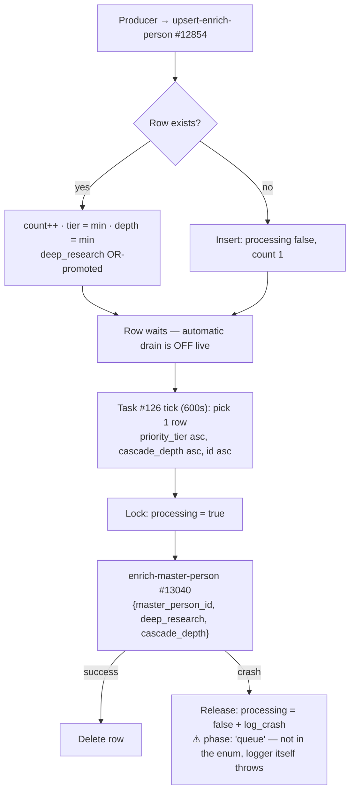

The Xano storage layer for the [Person Waterfall](/guides/enrichment/waterfall/person-waterfall) — the oldest and richest enrichment family. These are the tables the [IMDB conventions](/guides/enrichment/waterfall/imdb-tables#conventions--indexes) were later codified against and the [Company](/guides/enrichment/waterfall/company-tables) layer consciously mirrors. Three structural facts matter for a rebuild:

1. **The queue is FK-keyed, not URL-keyed.** `queue_enrich_person` keys on `master_person_id` because the [entry gate](/guides/enrichment/waterfall/person-entry-points) (`master-person-new` #13039) creates the `master_person` row **and** its graph node synchronously before anything is queued — the queue defers only the orchestrator (#13040). In IMDB and Music, discoveries happen before the underlying row exists, so their queues key on the normalized `imdb_url` / `mbid`.
2. **One JSON column per provider.** `person_enrich_data` predates the later "raw payload in a field named `json`" convention — every provider gets its own named JSON column, and the phase functions gate on per-column emptiness.
3. **Almost nothing is DB-unique.** Outside primary keys there is exactly **one** unique index among the waterfall-owned tables — `person_has_expertise (master_person_id, expertise_node_uuid)`; the Fundable BigQuery mirrors carry their own loader-side unique slug indexes (`linkedin_person_id` / `crunchbase_person_id` on #667). Everything else is procedural dedup: query-before-write inside sanctioned writers. A rebuild must reproduce the exact code-level dedup keys documented below; concurrent writers CAN race duplicates today (which is why the person merge tooling exists).

Function behavior lives on [Person Waterfall Functions](/guides/enrichment/waterfall/person-functions); graph writes on [Nodes](/guides/enrichment/waterfall/person-nodes) and [Edges](/guides/enrichment/waterfall/person-edges); the queue's (inactive) drain on [Crons](/guides/enrichment/waterfall/person-crons). Schemas verified against live workspace 3 (branch v1), audit date 2026-07-02.

## Table inventory

**Core pipeline**

| Table | Xano ID | Role |
| --- | :-: | --- |
| `master_person` | **#139** | Canonical person record — one row per resolved person, mirrored to a FalkorDB `Person` node via `node_uuid` |
| `person_enrich_data` | **#500** | Per-person raw-payload stash — one JSON column per provider, written before phase processing |
| `enrich_history_person` | **#160** | Attempt log \+ the orchestrator's debounce and completion surface (`source`-keyed since #13040 v3.8) |
| `queue_enrich_person` | **#582** | The single person work queue — FK-keyed on `master_person_id`, written only by `upsert-enrich-person` #12854, drained (in theory) by Task #126 |

**Contact & identity**

| Table | Xano ID | Role |
| --- | :-: | --- |
| `master_link` | **#166** | Normalized profile/social URLs (people \+ companies) — pre-API dedup key \+ the scraper fan-out trigger |
| `master_email` | **#155** | Emails with type / sharing / verification flags |
| `master_phone` | **#151** | LLM-formatted phone numbers (E.164 \+ local display) |
| `master_avatar` | **#227** | Avatar rows with source-priority replacement |

**Experience & biography sources**

| Table | Xano ID | Role |
| --- | :-: | --- |
| `work_experience` | **#147** | Work rows from every provider — the phase-7 `resolve-edges-work` input |
| `education_experience` | **#230** | Education rows — the phase-7 `resolve-edges-education` input |
| `about_person` | **#365** | Biography/about source corpus — the LLM-bio context |

**Investor / funding**

| Table | Xano ID | Role |
| --- | :-: | --- |
| `investor_profile_person` | **#475** | Person-side investor profile — summaries, sectors, ranges, thesis mirror |
| `investment_thesis` | **#709** | Shared person/company thesis rows — person side built by the **late** phase-9 pass (`build_investment_thesis = true`) |
| `fundable_people` | **#667** | Fundable BigQuery person mirror \+ the `master_person_id` backlink |
| `fundable_angel_investments` | **#679** | Angel person→deal join — the phase-9 deal-cascade input |

**Expertise**

| Table | Xano ID | Role |
| --- | :-: | --- |
| `person_has_expertise` | **#711** | Relational projection of `HAS_EXPERTISE` graph edges — the waterfall-owned tables' **only** unique constraint |
| `expertise_join` | **#469** | Legacy person↔domain join, no live writer — **still load-bearing**: phase 8 reads it for `is_angel` |

**Logs & infrastructure**

| Table | Xano ID | Role |
| --- | :-: | --- |
| `log_crash` | **#542** | Shared per-phase observability \+ the canonical kill-switch audit trail — written by every orchestrator, phase, and task |
| `log_enrichment_person` | **#579** | Get-add progress tracer — one row per #13039 invocation |
| `environment_variables` | **#272** | Shared operator-managed config table — holds the `kill_switch_person`**count-cap** row read by #4617 |
| `backfill_cursor` | **#708** | Cursor state for temp backfill tasks (last processed `master_person` id per key) |

**Deprecated / legacy** — `kill_switch_blocked_people` **#611** (deprecated 2026-06-30), `data_source` **#161** (legacy-referenced), `deep_biography` **#591** (superseded deep-research ledger) — [their own section below](#deprecated--legacy-tables).

**Adjacent (documented elsewhere, cross-linked)** — `profile_enrichment_job` **#686** ([Deep Research Bio](/guides/enrichment/waterfall/deep-research-bio)), `queue_person_resolution` **#751** (music person-resolution), and the 18-table [Fundable mirror family](/guides/enrichment/waterfall/company-tables#fundable-mirror-family) — [see below](#adjacent-tables-cross-linked).

<Note>
  **`log_crash` is shared infrastructure, not person-specific.** Person-relevant `phase` enum values: `phase-0` through `phase-12` — one per orchestrator phase, written by the per-phase `try_catch` wrappers in `enrich-master-person` #13040 v3.23 (exception: phase 4b — `phase-4b` is not in the enum, so its crash rows omit the `phase` field and are found by `function_name` instead) — plus `webhook_post_process` (the deep-research webhook #8303 v1.1 fan-out). `phase` is a **strict enum — values outside the list fail at runtime.** The entry gate #13039 omits `phase` entirely; its step identity lives in `note` \+ `function_name`.

  **NOT fixed on the person side (verified 2026-07-02):** cron **Task #126**'s catch block still writes `log_crash` with `phase: "queue"` — not in the enum — so a queue-item crash would make the crash logger itself throw, swallowing the crash row _and_ skipping the `processing: false` release that follows it (wedging the queue row). The identical defect was repaired on company Task #127 on 2026-07-02; #126 (last updated 2026-06-02) did **not** get the fix. The broken path is latent rather than historical: the task ships `active = false`, and its manual "Run Now" drains have not yet hit a queue-item crash.

  **Since 2026-06-30 `log_crash` is also the canonical kill-switch audit trail:** #13039 v1.13 removed the `kill_switch_blocked_people` side-write — blocked-person events land here and nowhere else.
</Note>

---

## Conventions & indexes

The person tables predate the conventions the [IMDB tables](/guides/enrichment/waterfall/imdb-tables#conventions--indexes) codified (and the [Music tables](/guides/enrichment/waterfall/music-tables#conventions-mirrored-from-live-imdb-tables) mirror), so read this as "what the elder family actually does" — including deviations a rebuild must knowingly reproduce or knowingly fix:

- **`id`** int, primary key, everywhere.
- **`created_at`** timestamp, not null, default `now` — access **private** on most tables. **Xano artifact — do not reimplement:** because the column is hidden, pipeline writes pass `created_at: "now"` with `enforce_hidden_fields = false`. In a port, just set the timestamp.
- **`updated_at`** timestamp, nullable, app-managed — omissions to know: `queue_enrich_person` #582 and `master_avatar` #227 lack it on the write path, and the append-only/legacy tables (`log_crash` #542, `log_enrichment_person` #579, `expertise_join` #469, `kill_switch_blocked_people` #611) never had it.
- **Raw payloads** are Xano `json` typed but live in **one named column per provider** (`people_data_labs`, `enrich_layer_data`, `exa`, …) — not the later single-field-named-`json` convention. Phase gates test per-column emptiness; there is no `"no_data"` sentinel on the person side (contrast the [company store](/guides/enrichment/waterfall/company-tables)).
- **Provenance is dual-column** on the identity/source tables: legacy `data_source_id` (int FK → `data_source` #161) **plus** canonical `source` (text). Live writers stamp only `source` (`"People Data Labs"`, `"Enrich Layer"`, `"Fundable"`, `"UI Avatars"`, …); the int column is legacy residue.
- **Text fields** carry write-time `trim` validators; `master_email.email_address` additionally lowercases.
- **Bool flags** are not null, default `false`, verbed names — with two defaulted-**true** exceptions to port carefully: `master_avatar.is_placeholder` (real avatars must explicitly write `false`) and `master_phone.connected_only` (required).
- **FKs** are int with a Xano `tableref`; the default is inconsistent by column age (newer = `0` unset, older = nullable, no default). Treat `0` and null both as "unset".
- **Unique-key policy:** exactly one unique index among the waterfall-owned tables — `person_has_expertise (master_person_id, expertise_node_uuid)` (the Fundable mirrors #667 etc. have loader-side unique slugs). Queue idempotency, person dedup, contact dedup: all procedural.
- **Default index** otherwise: `btree(created_at desc)` on nearly every table. Well-indexed exceptions: `master_link` (btrees on **both** FK sides), `master_avatar` (`master_person_id`), `master_email` (search index on `email_address`, `full_name`), `person_has_expertise` (five btrees \+ the unique pair).

**The three index gaps** — the headline parity notes for a rebuilt store, all verified live 2026-07-02:

1. **`master_person` #139 has no index on `linkedin_url` or `node_uuid`** — despite `linkedin_url` being a dedup-lookup key at multiple sites (the #13039 v1.6 pre-API dedup, the #13038 tier-4 fallback, #12997's normalized-LinkedIn dedup) and `node_uuid` being the graph bridge. Every one of those lookups is a sequential scan today.
2. **`person_enrich_data` #500 has no index on `master_person_id`** — PK \+ `created_at` only, so every phase read of the payload stash scans.
3. **`queue_enrich_person` #582 has no `unique(master_person_id)`** — queue idempotency lives entirely in `upsert-enrich-person` #12854. There is also no worker-pickup index (no IMDB-style composite `btree(processing, priority_tier, cascade_depth)`); every drain pick is a scan.

One more parity aside: `enrich_history_person` #160 lacks the `master_person_id` btree its company twin (`enrich_history_company` #404) has — the orchestrator's debounce query scans.

---

## `queue_enrich_person` (#582)

The single person work queue — one row per `master_person` awaiting `enrich-master-person` #13040. FK-keyed on `master_person_id`: by the time a row is queued, the person row and its graph node already exist. Tier and depth rules live on the [overview page](/guides/enrichment/waterfall/person-waterfall#priority-tiers); the shared queue mechanics on [Core Concepts](/guides/enrichment/waterfall/core-concepts).

| Field | Type | Null / default | Notes |
| --- | --- | --- | --- |
| `id` | int | PK |  |
| `created_at` | timestamp | not null, `now` | Access private |
| `master_person_id` | int | not null, `0`, tableref → #139 | Logical key — **no unique index**; dedup enforced only by #12854 |
| `processing` | bool | not null | Advisory lock — drain sets `true` on pickup, `false` on failure, deletes the row on success |
| `deep_research` | bool | not null | Deep-research request flag — **OR-promoted** on upsert, passed into #13040 by the drain (see [Deep Research Bio](/guides/enrichment/waterfall/deep-research-bio)) |
| `count` | int | not null, `1` | Discovery-pressure tally — \+1 on every re-discovery, never reset |
| `cascade_depth` | int | not null, `0` | Hops from seed (0 = seed, 1 = direct discovery, 2 = secondary). Min-promoted on upsert |
| `priority_tier` | int | not null, `4` | 1 = current employer / founders · 2 = past employers / VCs · 3 = schools / angels · 4 = cert issuers / volunteer orgs / contributors. Min-promoted on upsert |
| `source_function` | text | nullable, `""` | Which function queued this entity (e.g. `resolve-investors-edges`, `process-yc-people`) |
| `source_entity_id` | int | nullable, `0` | Numeric spawning-entity id; `0` when UUID-identified |
| `source_entity_uuid` | text | nullable, `""` | Text/UUID spawning-entity id (e.g. `fundable_people.id`) |
| `source_entity_type` | text | nullable, `""` | `master_person` / `master_company` / `fundable_person` / `fundable_company` … |

**Indexes:** primary `id` · btree `created_at desc`. Nothing else — no unique on `master_person_id`, no pickup index.

### Upsert semantics (sole sanctioned writer: `upsert-enrich-person` #12854, v1.1)

Every producer routes through #12854 (v1.1, 2026-06-03) — raw `db.add queue_enrich_person` is banned, exactly like the company family's #12855 rule:

- **Existing row:** `count + 1`; `cascade_depth = min(existing, incoming)` (a later depth-0 request upgrades a depth-1 leaf); `priority_tier = min(existing, incoming)`; `deep_research` is **OR-promoted** — once requested, a deep-research flag survives every subsequent shallow re-queue.
- **No row:** insert with `processing: false`, `count: 1`, the caller's depth/tier/`source_*` metadata.
- Because there is no unique constraint, two concurrent upserts can still race a duplicate row — the get-then-write inside #12854 is the only guard.

### Who writes here (post-containment)

The 2026-06-23 containment sweep removed **all** company enqueueing from person runs — person enrichment no longer writes `queue_enrich_company` at all. The full story is on the [overview](/guides/enrichment/waterfall/person-waterfall); the queue-facing consequence is that `queue_enrich_person` rows now come from a short producer list:

| Producer | What it queues | Depth / tier |
| --- | --- | --- |
| `master-person-new` #13039 | Any call with `queue: true` or `cascade_depth > 0` (existing **and** new people) upserts instead of direct-dispatching | Caller-specified |
| `resolve-investors-edges` #12702 (opt-in deal cascade) | Co-angels \+ VC partners on a seed person's deals — **only** when phase 9 ran with `allow_investor_network_cascade: true` at depth 0 | Depth 1, tier 1 |
| Company-waterfall seed-only people fanout | YC founders / partner, Fundable investor partners discovered by a **seed company** run | Depth 1, tiers 1–2 |
| Seed / backfill tasks | Task #155 `seed-fundable-people` (via #12853) · Task #156 `backfill-empty-pdl-people` · Task #179 divergent-LP seeding — all routed through #12854 | Depth 0, tier 1 |

Deliberately **not** here: company-seed Exa C-suite people (direct-dispatched into #13040 with `current_company_only: true`), music-resolved people (minted synchronously via #13039 by #13121), and film & TV people (their own `queue_imdb_person` #706).

### Drain lifecycle

<Warning>
  **Nothing drains this queue automatically today.** The only scheduled drain, cron **Task #126 `process-person-queue`**, ships `active = false` (verified live 2026-07-02; freq 600s, datasource live). When active it processes **one row per tick** (max 6 people/hour), sorted `priority_tier asc, cascade_depth asc, id asc`, locking `processing = true`, dispatching `{master_person_id, deep_research, cascade_depth}` into #13040, and deleting the row only after success. Its failure path is **broken as stored** — the catch writes `log_crash` with `phase: "queue"`, which the strict enum rejects (fixed on company Task #127 2026-07-02; #126 not patched). Full task card: [Person Waterfall Crons](/guides/enrichment/waterfall/person-crons).
</Warning>

- **Operator batch drain** — `process-enrichment-queue` #12816 (v1.1, 2026-06-03) serves **both** the person and company queues: kill-switch checks first, candidate pick by `priority_tier asc`, `max_tier` / `max_depth` / `min_count` filters, then the same lock → sync orchestrator → delete pattern, routed through the gated orchestrators so depth policy applies to queued leaves. The full calling contract (incl. the `min_count: 0` null-break trap) is on [Company Waterfall Tables](/guides/enrichment/waterfall/company-tables) — linked, not duplicated. In practice this endpoint plus "Run Now" on #126 are how the person queue is drained today.
- **Kill switch** — `check-kill-switch-v2` #4617 (headerless, stable since 2026-03-19) is a **count cap**, not an on/off var: true when the total `master_person` row count has reached the `kill_switch_person` row in `environment_variables` #272 (live threshold 10,000 per the inline note in #12997). Fail-open: a crashed check logs one `log_crash` row and reports the switch OFF. When ON, #13039 still resolves **existing** people local-only; **new** people are blocked with a `log_crash` audit row only (the #611 side-write is gone — v1.13). _(The old core-concepts name `check-kill-switch-person` never existed; legacy predecessor `check-kill-switch` #2774 is still present but is not the pipeline gate.)_
- **At-least-once processing** — rows are deleted only after the orchestrator completes; idempotency rests on #13040's 60s source-keyed debounce, emptiness-gated payload writes, and MERGE-based graph writes. There is **no retry counter, no dead-letter, and no reaper** for rows stuck `processing: true`, and a deterministically-crashing row would be re-picked every tick — head-of-line blocking of the whole queue. _(Contrast `queue_person_resolution` #751, which grew `retry_count` \+ `next_attempt_at` backoff — the fix this queue never got.)_

---

## `master_person` (#139)

Canonical person record. One row per resolved person; mirrored to a FalkorDB `Person` node via `node_uuid` (property schema is canonical in the [ontology](/guides/ontology/nodes); the writers `add-person-node` #2601 / `update-person-node` #2758 are on the [nodes page](/guides/enrichment/waterfall/person-nodes)).

| # | Field | Type | Null / default | Notes |
| :-: | --- | --- | --- | --- |
| 1 | `id` | int | PK |  |
| 2 | `created_at` | timestamp | not null, `now` | Access **private** — hence the `enforce_hidden_fields = false` write convention |
| 3 | `updated_at` | timestamp | nullable | Stamped on pipeline edits |
| 4 | `node_uuid` | text | nullable, trim | Graph `Person` node uuid — #2601 MERGEs the node keyed on `master_person_id`; safe `$nodeUuid` return since v2.1. Never a lookup key, **not indexed** |
| 5 | `Label` | text | not null, `"Person"` | Constant discriminator — literally capital-L `Label` (the company twin is lowercase `label`); keep the casing byte-identical in queries |
| 6 | `visibility` | bool | not null | Created `false`; flipped `true` by the phase-11 finalizer #12590 → #2758. New Exa C-suite leaves deliberately **start false** (#12997 v1.7) |
| 7 | `orbiter_user` | bool | not null | App-side user linkage — not written by the waterfall |
| 8 | `name` | text | nullable, trim | `temp_{uuid}` placeholder until phase 12 resolves a real one; repaired from `fundable_people.name` on Fundable match (#13039 v1.12) |
| 9 | `avatar` | text | nullable, trim | Best-avatar URL mirror of the winning `master_avatar` row |
| 10 | `linkedin_url` | text | nullable, trim | Set by `create-master-link`'s LinkedIn branch. **Dedup-lookup key at ≥3 sites** — NOT indexed (gap #1) |
| 11–15 | `first_name` / `middle_name` / `last_name` / `suffix` / `nickname` | text | nullable, trim | Written **only** via `set-person-names` #12820 — the isolation helper for Xano's input-name-collision bug |
| 16 | `master_company_id` | int | nullable, `0`, FK → #142 | Current employer — phase 3 (local-only since v3.4) \+ `choose-best-current-role` #12621 → `add-employment-current` #4552 (guards against investor/advisor/board clobbers) |
| 17 | `current_title` | text | nullable, trim | Same writers as `master_company_id` |
| 18 | `primary_location_id` | int | nullable, `0`, FK → #385 | Phase 2 via `add-person-primary-location` #2766 (Radar geocode → location nodes \+ edges) |
| 19 | `profile_published` | bool | nullable | App-side |
| 20 | `bio` | text | nullable, trim | Short LLM bio (≤229 chars) from `create-llm-person-bios` #2537 (v4.6, `moonshotai/kimi-k2.5`) |
| 21 | `bio_500` | text | nullable, trim | Long LLM bio (≤500 chars). Node-sync embedding text falls back `bio_500` → `bio` → `name` |
| 22 | `deep_bio` | text **list** | not null, `[]`, trim | Deep-research biography **paragraph array** — written only by webhook #8303 ([Deep Research Bio](/guides/enrichment/waterfall/deep-research-bio)) |
| 23 | `status_orbiter` | enum | not null, `non_user` | `non_user` \| `user` |
| 24 | `data_source_id` | int | nullable, `0`, FK → #161 | **Legacy** — dropped as an entry-point input in #13039 v1.4; column remains |
| 25 | `source` | text | nullable, trim | Row provenance |
| 26 | `sex` | enum | nullable | `male` \| `female` — copied from PDL in the orchestrator's setup step |
| 27 | `social_insights` | text **list** | nullable, trim | `get-social-insights` #12669 (v1.7, `x-ai/grok-4.3`; `NO_INSIGHTS` = successful empty, not QA failure) |
| 28 | `social_media_influence` | text | nullable, trim | Follower/influence summary from the platform-scraper chain (#2495) |
| 29 | `social_insights_updated_at` | timestamp | nullable | Stamped with #27 |
| 30 | `is_angel` | bool | not null | Phase 8 #12829 v1.1 — from the **legacy `expertise_join` table, domain 22** (never migrated to #711) |
| 31 | `is_c_suite` | bool | not null | Set `true` by `master-person-from-exa` #12997 for company-seed Exa C-suite matches |
| 32 | `full_enrich` | bool | not null | Closeout aggregate — **required-phase** health only (deep-research launch warnings excluded, v3.17) |
| 33 | `last_full_enrich` | timestamp | nullable | Stamped at closeout |
| 34 | `seeded_by_user` | int | nullable, `0`, FK → `user` #125 | Operator/seed attribution |

**Indexes:** primary `id` · btree `created_at desc`. **Notable absences:** no index on `linkedin_url` or `node_uuid` (gap #1), no unique constraint beyond the PK, no fuzzy-name search index (the company twin has one).

### Dedup ladder (procedural — no DB backstop)

A person is deduped in layers, cheapest first — all in code:

1. **Pre-API local dedup** (#13039 v1.6, before any external call): input links vs `master_link.link_url` (normalized) → input emails vs `master_email.email_address` → the extracted LinkedIn URL vs `master_person.linkedin_url`. On hit: attach new inputs, return. Phones are deliberately excluded — the LLM formatter #2540 is too expensive for a pre-flight.
2. **Kill-switch local-only lookup** — when the switch is ON, the same local checks (plus `master_phone`) still resolve existing people with zero API spend.
3. **Post-cascade resolution** — `match-master-person` #13038: `master_link.link_url` → `master_email.email_address` → `master_phone.phone_number` (**name-aware** — first OR last name must agree, phone-conflict error path) → `master_person.linkedin_url` direct fallback. Returns `match_via` \+ the formatted phone list.

Every successful dedup logs `data.match_via` to `log_crash`. Two calls passing the ladder simultaneously **will** double-create — the person merge tooling (`merge_suspect` #284, `merge_lock` #722, Tasks #163/#164) exists precisely because duplicates happen. Full walkthrough: [Person Waterfall Entry Points](/guides/enrichment/waterfall/person-entry-points).

### The bio trio

`bio` and `bio_500` keep their Xano formatting; #2758 strips control characters when projecting them to the node's `short_biography` / `long_biography` so graph properties stay one-line and Cypher-safe. Since #13040 v3.23, a post-thesis best-effort retry re-runs #2537 \+ #2758 at the end of the chain — investment-thesis/deal context can rescue a bio for people whose providers returned nothing (#2537 v4.5).

---

## `person_enrich_data` (#500)

Per-person raw-payload stash — every provider response lands here as untouched JSON before phase processing. Rows are created defensively at several sites (the #13039 create path, phase-0 #12857, #2601 v2.1's idempotent shell, #12997 v1.9's guaranteed shell), so a `master_person` without this row is a transient state, not a lifecycle stage.

**Waterfall core columns** (live writers verified):

| Column | Type | Live writer | Gate / notes |
| --- | --- | --- | --- |
| `id` / `created_at` / `updated_at` | int / timestamp | — | `created_at` private; `updated_at` stamped on payload edits |
| `master_person_id` | int, nullable, `0`, FK → #139 | #13039 create | Lookup key for ALL pipeline reads — **not indexed** (gap #2) |
| `people_data_labs` | json | #13039 §9 (cascade Tier 1) · phase-0 #12857 backfill · #13049 PDL re-fire | Phase-0 re-fetches **only when empty** (fixes cascade-seeded people that skipped PDL at depth \> 0) |
| `enrich_layer_data` | json | #13039 (cascade Tier 2b — LinkedIn path #12612) · phase 1 #12822 | Phase 1 skips the paid EL call for `current_company_only` Exa leaves, when PDL already returned work history (v1.4), and when the Exa profile is card-ready (v1.5); empty EL responses are non-fatal optional misses (v1.3) |
| `enrich_layer_email` | json | #13039 (cascade Tier 2a — email path #12734) | _(The live column description still cites the deleted #12553 monolith and its Hunter-era gate — historical text; the writer today is the #13037 cascade via #13039.)_ |
| `exa` | json | #13037 Tier 3 stash · #12997 v1.9 backfill from the C-suite match | Stash-only at write time; processed later by phase 4b #13031 into bios, avatar, `work_experience` rows |
| `full_enrich` | json | FullEnrich webhook #8594 | Written per webhook item **before** the wait-then-apply step (below) |

**Side-channel & import-era columns** (all json; present live, written outside the waterfall core — confirm writers before dropping in a rebuild):

| Column | Best-known provenance |
| --- | --- |
| `exa_search` | Exa search-lane stash (separate from the cascade's `exa` match object) |
| `scrapecreator_person` | ScrapeCreators LinkedIn person scrape — dispatched from `create-master-link`'s LinkedIn branch |
| `fundable` | Fundable person payload stash from the Fundable match path |
| `linkedin_profile` | Legacy LinkedIn payload — still **read** by phase 2's location cascade (`enrich_layer_data.location_str` → `linkedin_profile.location` → PDL) |
| `raw_linkedin` / `raw_linkedin_email` | Raw LinkedIn scrape stashes |
| `contactout_data` / `email_signature` / `clado_data` / `scrapin_data` | Provider trials / import-era columns |

`rocket_reach` was **dropped 2026-05-30** with the RocketReach retirement — confirmed absent from the live schema.

**Indexes:** primary `id` · btree `created_at desc` only — no `master_person_id` index (gap #2).

### The two persist sites

The cascade stashes are written at exactly two places in #13039, and the split matters for QA:

- **Section 7 (existing-person path)** — separate **per-column gated** `db.edit` blocks, each conditional on the corresponding stash being non-empty (a re-run against an existing person merges new payloads without nulling old ones).
- **Section 9 (new-person path)** — a single `db.edit` seeding all cascade fields at once.

### FullEnrich lifecycle

`full_enrich` is asynchronous by design: #13039 dispatches `full-enrich-reverse-email-lookup` #13036 (v1.4 — `custom` carries `person_enrich_data_id`, `data_source`, `current_company_only`, `cascade_depth`; `name` encodes `ped__{id}__{data_source}__{email}`), and webhook `webhook/contact-finished` #8594 (v1.9) writes back. Per item, #8594 refuses empty `custom.data_source` (v1.8 emergency guard), sets the datasource, edits `full_enrich`, then **waits for `enrich_history_person.processing = false`** (30s grace / 30-min deadline, v1.7) before calling `process-full-enrich` #13049 — which applies the payload and re-dispatches #13040 with `force_run: true`. Response counters: `{matched_ped, processed, wait_timeouts, skipped, refused_no_data_source}`. _(The old docs' `email_enrich_fallback` branch and `matched_eef` counter were dropped in #8594 v1.6 — no table by that name exists in workspace 3.)_

---

## `enrich_history_person` (#160)

Attempt log — one row per person enrichment attempt per source — and the pipeline's **debounce \+ completion surface**: the orchestrator's `source = "Master Person Enrich"` row doubles as the 60-second debounce marker and the `processing` flag the FullEnrich webhook polls.

| Column | Type | Null / default | Notes |
| --- | --- | --- | --- |
| `id` | int | PK |  |
| `created_at` | timestamp | not null, `now` | Private |
| `updated_at` | timestamp | nullable | **The debounce key** — touched on every orchestrator re-run (not `created_at`, which freezes at first write) |
| `enrich_success` | bool | not null | Add `false` → terminal edit |
| `master_person_id` | int | nullable, FK → #139 | **Not indexed** (the company twin #404 has the FK btree; this table doesn't) |
| `last_updated` | date | nullable | Set by some writers; no reader found |
| `data_source_id` | int | not null, `0`, FK → #161 | Legacy attribution — live writers use `source` |
| `data` | json | not null | Raw provider payload echo on success |
| `processing` | bool | not null | The orchestrator's open/closed marker — polled by webhook #8594 |
| `processing_time` | int | nullable | Dead — nothing computes a duration |
| `source` | text | not null, `""`, trim | Canonical source string (inventory below) |

**Indexes:** primary `id` · btree `created_at desc`.

### Source-string inventory (verified writers)

| `source` | Writer | Lifecycle |
| --- | --- | --- |
| `"Master Person Enrich"` | #13040 (the orchestrator) | Source-keyed **upsert** on `(master_person_id, source)` since v3.8/v3.9 — one long-lived row per person, re-touched per run. Opens `processing: true` at setup, safety-closed after phases 6 and 7 (v3.21/v3.20 respectively), final-closed regardless of crash state |
| `"People Data Labs"` | #13039 create path · phase-0 #12857 | One row per source that returned data (legacy ds 91) |
| `"Enrich Layer"` | #13039 create path · phases 1/4 | Phase 1 applies a **30-day dedup** on row existence; phase 4 v1.3 closes the row as **failed** before rethrowing when `process-enrich-layer` throws (legacy ds 94) |
| `"LLM-Biography"` | `create-llm-person-bios` #2537 | v4.x closes the row on **all** paths; v4.2 adds newest-first lookup \+ a recent-success debounce so bio re-runs don't stack |
| `"Twitter"` | `scrape-twitter-person` #2106 | Async scraper lane (legacy ds 7) |
| `"Fundable"` / `"Crunchbase"` | Fundable / permalink lanes | Legacy ds 89 / 8 — today read mostly by the temp-name scan |

The social-insights writer #12669 also maintains its own history row — v1.5/v1.6 (2026-06-24) fixed its lifecycle (no dangling `processing: true`, row closed before link writes), and v1.7 records `NO_INSIGHTS` as success.

### Lifecycle contract

1. **Source-keyed upsert (v3.8/v3.9).** The orchestrator's setup step upserts the `"Master Person Enrich"` row keyed on `(master_person_id, source)` — the legacy numeric `data_source_id` path is dead.
2. **60s debounce on `updated_at` (v3.10 bypass).** After the stale-dispatch guard, #13040 returns early (logging a `qa_passed: true` "DUPLICATE TRIGGER" row — explicit since v3.19) when `updated_at > now − 60s`. `force_run: true` bypasses — #13049 uses exactly this after a FullEnrich writeback.
3. **Completion marker.** A final step flips `processing = false` regardless of crash state. Webhook #8594 v1.7 **polls this flag** before applying FullEnrich, so the payload apply can't race a live run.
4. **Safety closes (v3.21/v3.20).** `processing` is additionally force-closed after phases 6 and 7 respectively, so a mid-chain crash in the long tail can't wedge the marker and starve the webhook.
5. **Temp-name scan.** Phase 12 (`resolve-temp-name` #12890 v1.5) reads this table when `master_person.name` still starts with `temp_`: successful rows in priority `People Data Labs` → `Enrich Layer` → `Twitter` → `Fundable` → `Crunchbase` (legacy ds ids 91/94/7/89/8), LinkedIn-slug fallback, alpha-overlap sanity check against LLM garbage.
6. **Reaper gap.** If the runtime dies outside try/catch, a `processing: true` row survives until the next run's safety closes — no task sweeps stale rows. Parity note for a rebuild.

---

## Contact & identity tables

The four contact tables share the dual-FK shape (`master_person_id` \+ `master_company_id`, one side real per row), dual provenance (`source` text canonical, `data_source_id` legacy), and procedural dedup in their single sanctioned writer:

| Table | ID | Live writer | Code dedup key | Notes |
| --- | :-: | --- | --- | --- |
| `master_link` | #166 | `create-master-link` #2541 (v1.3) | Normalized `link_url` | The best-indexed table in the family (btrees on both FKs). See below for scraper fan-out |
| `master_email` | #155 | `add-person-email` #2784 (v1.2) | `email_address` (lowercased by the input validator) per person | `email_type` enum default `work`; `orbiter_verified` written only for **user-supplied** input emails — PDL-discovered emails always stay `false`. Search index on (`email_address`, `full_name`) |
| `master_phone` | #151 | `add-person-phone` #2783 (v1.1) | The **LLM-formatted** E.164 `phone_number` (via `llm-phone-format` #2540), not the raw input | `phone_type` enum default `mobile`; `connected_only` default **true**, required; carries the name fields #13038's name-aware match reads |
| `master_avatar` | #227 | `replace-avatar` #237 (v4.2) · `create-placeholder-avatar` #1832 (v1.3) | #1832 dedups by `original_source_url` | See below. btree on `master_person_id` — no `updated_at` column |

### `master_link` (#166) — the scraper fan-out trigger

Columns: `id`, `created_at`, `updated_at`, both FKs, `service` / `service_label` / `icon_url`, `link_url`, `profile` (bool), `data_source_id` (legacy), `created_by_user_id`, `source`. **Indexes:** PK · btree `created_at desc` · btree `master_company_id` · btree `master_person_id`.

`create-master-link` #2541 normalizes and dedups the URL, then its per-domain branches **launch async scraper enrichment**: LinkedIn (→ ScrapeCreators \+ sets `master_person.linkedin_url`), Twitter/X (→ `scrape-twitter-person` #2106 v1.10), Crunchbase, YouTube, Facebook, IMDB. Since **v1.3 (2026-06-22)** a `suppress_downstream` input guards **all 9** async dispatch sites, and #13039 v1.10 passes it whenever `hold_downstream` is set or `cascade_depth > 0` — scraper fan-out is suppressed on contained paths. _(The old note that "table-level triggers fire anyway under `hold_downstream`" is obsolete.)_

Source attribution: EL links are written **first**, so `"Enrich Layer"` wins when a URL appears in multiple sources (dedup is by normalized URL); PDL profile URLs write `"People Data Labs"`; Fundable profile URLs (LinkedIn / Crunchbase / X / Tracxn / CB Insights / PitchBook) write `"Fundable"`; caller-supplied URLs keep `$input.source`.

### `master_avatar` (#227) and the avatar writers

| Column | Type | Notes |
| --- | --- | --- |
| `id` / `created_at` | int / timestamp | No `updated_at` on this table |
| `master_person_id` | int, not null, `0`, FK → #139 | btree-indexed |
| `url` | text, not null | The served avatar URL (GCS-rehosted webp for placeholders/Serper finds) |
| `original_source_url` | text, nullable | Provider-original URL — **#1832's dedup key** (re-runs return the existing URL instead of re-uploading) |
| `main` | bool | The currently-winning row |
| `is_placeholder` | bool, **default true** | ⚠️ Real avatars must explicitly write `false` — port the inverted default |
| `source` | text | Text attribution (`"UI Avatars"`, `"Enrich Layer"`, `"LinkedIn"`, …) |

- **`replace-avatar` #237 (v4.2)** — priority-based replacement: a candidate only displaces the current `main` when its source ranks higher. Priority order **LinkedIn \> Signal NFX \> PDL \> Twitter \> …** (originally keyed on legacy `data_source` ids 11 / 64 / 91 / 7; **v4.2 dropped the int input — attribution is text-source-only now**).
- **`create-placeholder-avatar` #1832 (v1.3, 2026-05-25)** — UI Avatars initials image → webp → GCS → `master_avatar` insert with `source: "UI Avatars"` per the #237 v3\+ text scheme. _(The body carries an unversioned inline "v1.4" comment; the header stops at v1.3.)_
- **`find-avatar` #12846 (v1.3)** — Serper.dev image search, called from `add-person-node` #2601 **before** the placeholder fallback; #2601 v2.0 made the whole avatar step best-effort (try/catch, non-blocking). The temp avatar backfill (Task #161 → #12886) walks `master_person` with a `backfill_cursor` #708 cursor through the same #12846 → #237 chain.

---

## Investor tables

### `investor_profile_person` (#475)

Person-side investor profile — row identity = `master_person_id` by convention (no unique index).

| Column | Type | Null / default | Notes |
| --- | --- | --- | --- |
| `id` / `created_at` / `updated_at` | — | — |  |
| `master_person_id` | int | nullable, `0`, FK → #139 | Not indexed |
| `investor_type` | text | not null, `""` | Merged from Signal \+ CB evidence |
| `llm_investor_summary` | text | nullable, `""` |  |
| `exits_summary` | text | nullable, **`"null"`** | ⚠️ default is the literal 4-char string `"null"` — same quirk as the company twin's `exits`; preserve it |
| `board_advisory_summary` | text | nullable, **`"null"`** | Same literal-`"null"` default |
| `active_in_sector` / `sectors_stages` / `investments` | text | nullable, `""` | Signal preferred over CB for `investments` |
| `location` / `investment_range` / `investment_sweet_spot` | text | nullable, `""` |  |
| `yc_stats` | json | not null | YC partner/founder stats where applicable |
| `derived_thesis_summary` | text | nullable, `""` | Mirror of the derived thesis — **empty ⇒ rebuilt** on the next thesis pass (a crash/empty write must not suppress forever) |

**Indexes:** primary `id` · btree `created_at desc`.

**Writers:** `person-extract-cb-signal` #2687 (called from phase 9 — reads `permalink_person.cb_extract` \+ `signal_extract`, upserts the profile fields, Signal preferred over CB for `investments`, then stamps `permalink_person.last_investor_enrich_at`) · phase 9 #12830 (Fundable investor overlay \+ the upsert itself).

### `investment_thesis` (#709)

Shared person/company thesis table — exactly one FK side is real per row, and **the absent side is written `0`, not null** (consumers rely on it). The person side is built when phase 9 runs with `build_investment_thesis: true` — which is the **late** of the two phase-9 invocations in #13040 v3.23 (early pass after Fundable linking with `thesis = false`; late pass after phase 8 with `thesis = true`, v3.3/2026-06-23). The full 60-column schema, the narrative/vector column grid, and the GCP Cloud Run builder contract are documented once on [Company Waterfall Tables](/guides/enrichment/waterfall/company-tables) — linked, not duplicated. It is the best-indexed table either family touches: btrees on `master_person_id`, `master_company_id`, and `created_at desc`.

### Fundable inputs

The phase-9 deal cascade reads two mirror tables directly: `fundable_people` #667 (unique `linkedin_person_id` \+ `crunchbase_person_id` slugs; `master_person_id` backlink written by `link-fundable-person` #12793 and the seed task #155) and `fundable_angel_investments` #679 (angel person→deal join, btrees on `person_id` / `deal_id`, no unique pair) — each row routed through `cascade-deal-participants` #12856 (v1.6, 2026-07-02 — the `first_notnull` depth-guard repair) **only** under the opt-in gate (`allow_investor_network_cascade: true` AND depth 0). Full mirror-family schemas: [Company Waterfall Tables → Fundable mirror family](/guides/enrichment/waterfall/company-tables#fundable-mirror-family).

---

## Expertise joins

### `person_has_expertise` (#711)

Relational projection of `HAS_EXPERTISE` graph edges — one row per `(master_person_id, expertise_node_uuid)`, and the **only DB-enforced uniqueness in the person family**.

| Column | Type | Notes |
| --- | --- | --- |
| `id` | int | PK |
| `master_person_id` | int, not null, `0`, FK → #139 | The relational anchor |
| `person_node_uuid` | text, not null | FalkorDB `Person.uuid` — mirrors the resolver's primary input |
| `expertise_kind` | enum | `domain` \| `subdomain` — which taxonomy FK below is populated |
| `domain_expertise_id` | int, FK → #459 | Populated when `expertise_kind = domain`; also **relationally dual-written by name lookup** since resolver v2.4 (2026-07-01) |
| `sub_domain_expertise_id` | int, FK → #654 | Populated when `expertise_kind = subdomain` |
| `expertise_node_uuid` | text, not null | Graph `DomainExpertise` / `SubDomainExpertise` uuid |
| `confidence` | decimal 0–1 | Aggregated max across signals |
| `depth` | enum | Strongest seen: `creator` \> `expert` \> `practitioner` \> `familiar` |
| `recency` | enum | Most current seen: `current` \> `recent` \> `historical` |
| `signal_type` / `evidence` / `identified_as` | text | Pipe-concatenated aggregates — v1.2 (2026-07-02) added `CONTAINS` dedupe guards so resolver / MB-emitter re-runs stop bloating these |
| `match_score` | decimal | Best (minimum) cosine distance — lower = better |
| `match_type` | enum | `matched` (KNN hit) \| `created` (new SubDomainExpertise minted) |
| `weight` | int | Edge-weight mirror — see the warning below |
| `last_resolved_at` / `created_at` / `updated_at` | timestamp | `last_resolved_at` stamped on every dual-write |

**Indexes:** primary `id` · btrees on `master_person_id`, `person_node_uuid`, `domain_expertise_id`, `sub_domain_expertise_id`, `expertise_node_uuid` · **unique (`master_person_id`, `expertise_node_uuid`)**.

**Writer:** `upsert-person-has-expertise` #12925 (v1.2, 2026-07-02 — fixed the two-arg `|concat` mis-render, added the dedupe guards), called by `resolve-person-expertise-v2` #12926 (v2.4) after every `HAS_EXPERTISE` MERGE. Also written by the music credit-expertise emitter path (#13160 → #12926), which the unique pair keeps idempotent.

<Warning>
  **Stale weight comment — do not propagate.** The live `weight` column description (and #12925's input doc) still reads `min(round(10 + score*80), 50)`. The **live formula** in resolver #12926 v2.4 is `min(round(10 + score × 160), 50)` for matched edges and a flat **10** for created ones; `expertise_strength` (0–100, depth\+recency\+duration) is a separate edge property, not this weight. Canonical detail: [Person Edges](/guides/enrichment/waterfall/person-edges).
</Warning>

### `expertise_join` (#469) — legacy, still load-bearing

Columns: `id`, `created_at`, `domain_of_expertise_id` (FK → the **old** domain table #448 — not `domain_expertise` #459), `master_person_id`, `triple_id`. No live writer in the current waterfall — but **phase 8 (#12829 v1.1) still reads it** to set `master_person.is_angel`: a row with **domain 22** on this legacy table flips the flag. The check is a domain (not subdomain) test and has never been migrated to `person_has_expertise` #711 — retire this table and angel detection silently dies.

Adjacent legacy expertise roster (present live, outside this waterfall's write path): `expertise_person_join` #596, `expertise` #595, `expertise_category` #460, and `expertise_identification_log` #660 — the run log `llm-identify-person-expertise` #12666 writes on every phase-8 pass. The taxonomy mirrors `domain_expertise` #459 / `sub_domain_expertise` #654 are documented on [Company Waterfall Tables](/guides/enrichment/waterfall/company-tables).

---

## Log tables

### `log_crash` (#542)

Columns: `id`, `created_at`, `master_person_id`, `master_company_id`, `phase` (the strict enum — see the [inventory Note](#table-inventory)), `qa_passed`, `fundable_deal_id`, `function_name`, `error_message`, `note`, `data` (json). btree `created_at desc`.

Person-side usage contract: every phase wrapper writes `qa_passed: true` on clean completion or `qa_passed: false` \+ the error on a throw, with `phase` set to `phase-N` — failures are logged but never block later phases. The debounce early-return logs `qa_passed: true` ("DUPLICATE TRIGGER", v3.19), dedup hits log `data.match_via`, and since #13039 v1.13 (2026-06-30) **kill-switch blocks are audited here only**. Filter person traffic by `master_person_id` \+ `function_name` (`mvp/get-add/master-person-new`, `mvp/enrich/enrich-master-person`, `process-person-phase-*`).

### `log_enrichment_person` (#579)

Get-add progress tracer — one row per #13039 invocation, **not an error log** despite its columns. `id`, `created_at`, `master_person_id`, `stack_status` (text), `error_description` / `error_message` (written empty at start), `last_log` (json). btree `created_at desc`.

`stack_status` advances at section milestones: `"begin person enrich"` → `"name format done"` → `"BEGIN cascade"` → `"cascade done"` → … → `"Person NODE Added!!"` — or short-circuits at `"pre-API dedup hit — skipped cascade"`. A row frozen mid-sequence with no matching `log_crash` row usually means an async kill, not a logged failure.

---

## Deprecated & legacy tables

### `kill_switch_blocked_people` (#611) — DEPRECATED 2026-06-30

The legacy kill-switch side backlog: when the switch was ON, #13039 inserted the blocked person's inputs here (`first_name` / `last_name` / `full_name`, `links` / `phone_numbers` / `email` lists, `company_name`, `title`, `user_id`) "for later reprocessing." **No reprocessing task exists or ever drained the table.** #13039 v1.13 (2026-06-30) removed the side-write — `log_crash` #542 is the sole kill-switch audit trail now. Rows retained as historical data only; do not port.

### `data_source` (#161) — legacy-referenced

The old numeric provenance lookup. No longer an input to the person entry point (#13039 v1.4 dropped `data_source_id`), and live writers stamp text `source` instead — but the table still exists and `data_source_id` FK columns remain on `master_link`, `master_email`, `master_phone`, `enrich_history_person`, `master_person`, and older tables. Legacy-referenced, not gone. Don't confuse it with the `data_source` **input** (`"live"` / `"staging"` / `"sandbox"`) — the Xano datasource selector threaded to the FullEnrich webhook, never written to business tables.

### `deep_biography` (#591) — superseded

The first-generation deep-research ledger (Dec 2025 – Apr 2026), keyed on the old webhook #3082's `job_id`. Superseded by `profile_enrichment_job` #686 \+ webhook #8303; retained as historical data. Full lineage: [Deep Research Bio](/guides/enrichment/waterfall/deep-research-bio).

---

## Adjacent tables (cross-linked)

Tables the person waterfall writes or feeds that are canonically documented elsewhere — plus the experience/source tables that live between the payload stash and the graph writers.

### `work_experience` (#147)

Work rows from every provider — the input `resolve-edges-work` #12562 and `choose-best-current-role` #12621 read. Written by phase 3 (PDL), `process-enrich-layer` #12615, phase 4b #13031 (Exa), and `process-full-enrich` #13049 (deduped on write). Notable columns: `company_name` / `company_domain` / `company_linkedin_url` (the resolution keys), **text-typed** `start_day/month/year` \+ `end_day/month/year` (do not parse as ints blindly), `current` (bool), `edge_uuid` (graph writeback from `create-work-edges` #2800 — v1.8 made a null `edge_uuid` retryable), `triples_created_at`, dual provenance, and two self-documented deprecations (`main` — "depreciated??", `linkedin_company_id` — "depreciated!!"). btree on `master_person_id`.

### `education_experience` (#230)

Education rows — the `resolve-edges-education` #12560 input. `school_name` / `linkedin_url` / `school_domain` resolution keys, **list-typed** `field_of_study` / `degree_name` / `activities_societies`, int-typed `start/end_month/year` (unlike #147's text dates), `edge_uuid` writeback, `master_company_id` set once the school resolves. btree on `master_person_id`.

### `about_person` (#365)

Biography/about source corpus — rows written by `add-person-biography` #2536 during phases 3/4/6, by the deep-research webhook fan-out, and by the music profile helper #13159. Read as LLM context by `create-llm-person-bios` #2537, whose v4.4 cleanly skips (optional, not failed) when no rows exist.

### `profile_enrichment_job` (#686)

The deep-research job ledger — one row per Cloud Run launch, `processing: true` until the callback. **No cron, task, or sweeper drains it**; stuck jobs (`processing: true`, no `response`) are found by inspection. Canonical documentation: [Deep Research Bio](/guides/enrichment/waterfall/deep-research-bio).

### `queue_person_resolution` (#751)

The music family's person-resolution queue — `Music_Artist` rows awaiting Exa social resolution into a `SAME_AS` bridge \+ `master_person` (minted through this family's #13039). Structurally the modern queue #582 never became: **unique `mbid`** natural key, `retry_count` \+ `next_attempt_at` backoff columns, lock \+ count \+ tier (0 = bootstrap lane). Drained by Task #182 (inactive; pausing it is that pipeline's kill switch). Canonical documentation: the [Music family](/guides/enrichment/waterfall/music-tables).

### `backfill_cursor` (#708)

Tiny state table for temp backfill tasks — last processed `master_person` id per key (e.g. `"avatars"` for the Task #161 avatar backfill). Port only if the backfills port.

### Fundable mirror family

`fundable_people` #667 and `fundable_angel_investments` #679 (above) are two of 18 BigQuery mirror tables — uuid PKs, int backlinks to `master_person` #139 / `master_company` #142, loader-enforced dedup. The full family, including `fundable_deals` #671's `processed_at` materialization gate, is documented on [Company Waterfall Tables → Fundable mirror family](/guides/enrichment/waterfall/company-tables#fundable-mirror-family) — linked, not duplicated.