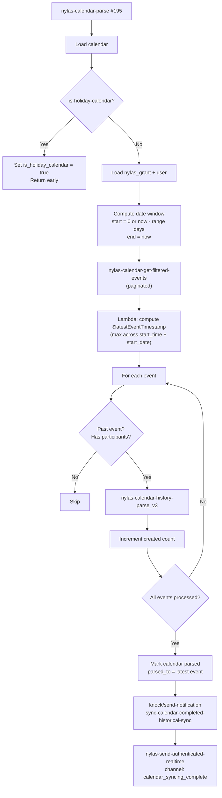

When a user connects a Nylas grant, Orbiter runs a calendar history parse chain that scans every non-holiday calendar on the grant, fetches past events from Nylas, and creates activity records for every meeting participant. The chain also writes `calendar.parsed_to` markers and fires a completion notification through Knock when a calendar finishes.

| Function | ID | Role |
|----------|----|------|
| `mvp/activity/calendar-history-parse` | #2502 | Master orchestrator — fans out one call per calendar, then rolls up per-contact activity timestamps |
| `mvp/nylas/nylas-calendar-parse` | #195 | Per-calendar parse — holiday guard, date window, per-event worker, completion notification |
| `nylas/is-holiday-calendar` | #2209 | Holiday detector — matches 23 patterns across 11 languages + specific holidays |
| `nylas/nylas-calendar-get-filtered-events` | #1978 | Nylas API wrapper — paginated event fetch with full filter pass-through |
| `mvp/nylas/nylas-calendar-history-parse_v3` | #2208 | Per-event worker — creates `event` + `calendar_event_activity` rows, resolves participants |
| `nylas/latest-my-activity` | #2483 | Post-parse rollup — recomputes `last_activity_at` on every touched `my_person` and `user.oldest_activity` |

---

## calendar-history-parse — #2502

```text
mvp/activity/calendar-history-parse — #2502
```

The top-level entry point for the historical calendar parse. Called once per Nylas grant. Loads the grant, iterates every calendar linked to it, delegates each to `nylas-calendar-parse`, then runs the final per-contact rollup via `latest-my-activity`. The `historical_parse.events` status marker transitions from `processing` on entry to `complete` on exit.

### Input

| Field | Type | Required | Description |
|-------|------|----------|-------------|
| `grant_id` | text | Yes | Nylas grant ID for the account whose calendars should be parsed |

### Step-by-Step Flow

<Steps>
  <Step title="Resolve Nylas grant">
    Loads the `nylas_grant` row by `grant_id`. Returns `"No nylas grant found"` early if the lookup is empty.
  </Step>

  <Step title="Mark historical_parse as processing">
    Updates `historical_parse` where `nylas_grant_id == $nylas_grant.id`, setting `events: "processing"`. This is the entry-side marker so any observer of the table can tell a parse is in flight.
  </Step>

  <Step title="Query calendars on this grant">
    `db.query calendar WHERE grant_id == $input.grant_id` returns every calendar row the user has connected through this grant — primary, secondary, shared, read-only.
  </Step>

  <Step title="Per-calendar fan-out">
    `foreach` the calendar list, calling **`mvp/nylas/nylas-calendar-parse`** (#195) with `{ grant_id, calendar_id: $item.id, range: $nylas_grant.timerange }`. Each call is wrapped in its own `try_catch` — if one calendar fails, the error is logged to `log_crash` (with `grant_id`, `calendar_id`, `calendar_external_id`, `calendar_name`) and the loop continues to the next calendar.
  </Step>

  <Step title="Post-parse rollup">
    Calls **`nylas/latest-my-activity`** (#2483) to recompute `last_activity_at` on every `my_person` the user has touched, and `user.oldest_activity` on the user row.
  </Step>

  <Step title="Query oldest activity for historical_parse.oldest_parse">
    Runs `db.query activity WHERE user_id == $nylas_grant.user_id ORDER BY activity_timestamp ASC LIMIT 1` to find the user's oldest activity timestamp. This is used only to populate `historical_parse.oldest_parse`; the `user.oldest_activity` column is owned by `#2483`.
  </Step>

  <Step title="Mark historical_parse as complete">
    Updates `historical_parse` to `events: "complete"` and `oldest_parse: $oldest_activity.activity_timestamp`.
  </Step>
</Steps>

### Error Handling

The per-calendar loop is wrapped in an inner `try_catch` so one bad calendar doesn't abort the entire grant's backfill — each failure is logged to `log_crash` with full context, and the loop continues. The rest of the function has no top-level try/catch; unhandled errors (e.g. a malformed grant row) will bubble up and leave `historical_parse.events = "processing"` stuck.

### Dependencies

| Function Called | Purpose |
|----------------|---------|
| `mvp/nylas/nylas-calendar-parse` | Per-calendar parse (called once per calendar on the grant) |
| `nylas/latest-my-activity` | Post-parse rollup of `last_activity_at` and `oldest_activity` |

---

## nylas-calendar-parse — #195

```text
mvp/nylas/nylas-calendar-parse — #195
```

Per-calendar orchestrator. Called by `#2502` once per calendar on the grant. Runs the holiday-calendar guard, resolves the Nylas grant and user, computes a date window, fetches past events via `nylas-calendar-get-filtered-events`, delegates each event to the per-event worker, then writes completion markers and publishes notifications.

This is explicitly a **historical backfill** — the foreach loop skips future events (realtime events are handled by the `event.created` Nylas webhook).

### Input

| Field | Type | Required | Description |
|-------|------|----------|-------------|
| `grant_id` | text | Yes | Nylas grant ID |
| `calendar_id` | int | Yes | Orbiter `calendar.id` (integer PK — NOT the Nylas external_id) |
| `range` | int | No | Number of days to look back. Empty or `0` = full history (epoch to now). |

### Step-by-Step Flow

<Steps>
  <Step title="Load calendar">
    `db.get calendar` by Orbiter PK. Pulls `external_id` and `name` for the holiday check and the completion notification.
  </Step>

  <Step title="Holiday-calendar guard">
    Calls **`nylas/is-holiday-calendar`** (#2209) with the calendar's `external_id` and `name`. If it returns true, sets `calendar.is_holiday_calendar = true` on the row and returns `"Calendar is a Holiday Calendar"` early — no events are fetched or processed.
  </Step>

  <Step title="Resolve Nylas grant + user">
    `db.get nylas_grant` by `grant_id`, joining the `user` table via addon to pull `user.settings.working_timezone`. Returns `"No nylas grant found"` if the grant lookup is empty.
  </Step>

  <Step title="Compute date window">
    - **endDate:** `now` in UTC milliseconds (future events are skipped in the foreach anyway)
    - **startDate (no range):** `0` (epoch) — true full history
    - **startDate (range provided):** `now - range days` computed in the user's working timezone, in milliseconds
  </Step>

  <Step title="Fetch events from Nylas">
    Calls **`nylas/nylas-calendar-get-filtered-events`** (#1978) with the grant_id, the calendar's `external_id` (NOT the Orbiter PK), and the start/end window.
  </Step>

  <Step title="Compute latest event timestamp">
    Runs a JavaScript lambda over the event list to find the maximum event timestamp across both timed events (`when.start_time` in epoch seconds) and all-day events (`when.start_date` as an ISO date string). Result is stored as `$latestEventTimestamp` in epoch seconds, or null if no events were returned.
  </Step>

  <Step title="Foreach event — delegate to per-event worker">
    For each event:
    1. Skip if `when.start_time > now` (future timed event)
    2. Skip if `when.start_date > now` (future all-day event)
    3. Skip if `participants` is empty
    4. Call **`mvp/nylas/nylas-calendar-history-parse_v3`** (#2208) with `{ grant_id, event }`
    5. If the worker returns truthy (meaning a new event was created, not a duplicate), increment `$event_created_count`

    Each worker call is wrapped in `try_catch` — per-event failures are logged to `log_crash` with the `event_id` and `event_title`, and the loop continues.
  </Step>

  <Step title="Mark calendar as parsed">
    Updates the `calendar` row: `parsed: true`, `parsed_to: $latestEventTimestamp * 1000` (converted to milliseconds for storage), and `updated_at: now`.
  </Step>

  <Step title="Send completion notification via Knock">
    Calls `mvp/knock/send-notification` with key `sync-calendar-completed-historical-sync`, passing `calendars_name`, `email_address`, `events_count`, and `provider_logo` (currently null — the archive lookup that populated it is disabled dead code). Recipient is the user's UUID.
  </Step>

  <Step title="Publish realtime completion message">
    Calls `nylas/nylas-send-authenticated-realtime` on channel `calendar_syncing_complete` with message `"Calendar Parsing Complete"`. Frontend subscribes to this to update sync-status UI.
  </Step>
</Steps>

### Error Handling

Per-event worker calls are individually wrapped in `try_catch`; bad events are logged and skipped. The holiday guard has its own early return. The rest of the function has no top-level try/catch — an error outside the foreach will abort before the completion block runs, leaving `calendar.parsed = false` and no notification sent.

### Dependencies

| Function Called | Purpose |
|----------------|---------|
| `nylas/is-holiday-calendar` | Returns true for holiday / read-only calendars that should be skipped |
| `nylas/nylas-calendar-get-filtered-events` | Fetches events from Nylas with cursor-based pagination |
| `mvp/nylas/nylas-calendar-history-parse_v3` | Per-event worker — creates event + activity rows |
| `mvp/knock/send-notification` | Fires the `sync-calendar-completed-historical-sync` workflow |
| `nylas/nylas-send-authenticated-realtime` | Publishes realtime status message on `calendar_syncing_complete` channel |

### Pipeline Diagram



---

## is-holiday-calendar — #2209

```text
nylas/is-holiday-calendar — #2209
```

Detects calendars that should be skipped during historical parse because they contain holidays, observances, or other read-only imports rather than personal meetings. Matches against a pattern list covering 11 languages plus specific holiday names.

### Input

| Field | Type | Required | Description |
|-------|------|----------|-------------|
| `calendar_external_id` | text | No | Nylas external_id of the calendar |
| `calendar_name` | text | No | Display name of the calendar |

### Step-by-Step Flow

<Steps>
  <Step title="Initialize result as false">
    Starts with `$isHoliday = false`. The function only flips to true if at least one pattern matches.
  </Step>

  <Step title="Iterate the pattern list">
    Loops over 23 patterns: English (`holiday`, `observance`, `birthdays`, `weather`), German (`feiertage`), French (`jours fériés`, `fériés`, `fêtes`), Italian (`festività`, `festivi`), Spanish/Portuguese (`festivos`, `feriados`), Japanese (`祝日`), Chinese (`节假日`, `節假日`), Korean (`공휴일`), Russian (`праздники`), Arabic (`عطلات`), plus specific holidays (`christmas`, `easter`, `ramadan`, `diwali`, `chinese new year`, `lunar new year`, `thanksgiving`).
  </Step>

  <Step title="Match against both fields (case-insensitive)">
    For each pattern, runs `|icontains` against BOTH `calendar_external_id` and `calendar_name`. If either match hits, sets `$isHoliday = true` and continues looping (no early exit, but subsequent matches are no-ops).
  </Step>

  <Step title="Return">
    Responds with the boolean `$isHoliday`.
  </Step>
</Steps>

### Error Handling

None required — the function is pure and does no I/O. If neither input is provided, it trivially returns false.

### Dependencies

None.

---

## nylas-calendar-get-filtered-events — #1978

```text
nylas/nylas-calendar-get-filtered-events — #1978
```

Nylas API wrapper. Fetches every event for a calendar inside a date window, paginating via Nylas v3's cursor-based `next_cursor`. Returns a flat list of event objects.

### Input

| Field | Type | Required | Description |
|-------|------|----------|-------------|
| `grant_id` | text | Yes | Nylas grant ID |
| `calendar_id` | text | Yes | **Nylas `external_id`** of the calendar — NOT the Orbiter PK |
| `start_date` | timestamp | Yes | Window lower bound in milliseconds |
| `end_date` | timestamp | Yes | Window upper bound in milliseconds |

### Step-by-Step Flow

<Steps>
  <Step title="Load Nylas API keys">
    Calls `mvp/nylas/get-nylas-keys` to fetch the API key.
  </Step>

  <Step title="First page request">
    `GET https://api.us.nylas.com/v3/grants/{grant_id}/events` with params `calendar_id`, `limit=200`, `start=$start_date/1000`, `end=$end_date/1000`. Timeout 30 seconds.
  </Step>

  <Step title="First page status check">
    If the first-page response status is not 200, logs the failure to `log_crash` with `grant_id`, `calendar_id`, `status`, and `body`, then returns an empty list.
  </Step>

  <Step title="Initialize accumulators">
    Sets `$nylasResponseData` to the first page's `response.result.data` and `$cursor` to `response.result.next_cursor`.
  </Step>

  <Step title="Pagination loop">
    `while $cursor != null`:
    1. Issue the same `GET /v3/grants/{grant_id}/events` call, re-passing `calendar_id`, `limit=200`, `start`, `end`, AND `page_token=$cursor` (filters are re-sent on every page to be explicit about the window)
    2. Check `response.status` — if non-200, log to `log_crash` and null the cursor to break the loop (returns whatever partial data was collected)
    3. Concatenate the new page's events into `$nylasResponseData` via `var.update` + `merge`
    4. Update `$cursor` from the new response's `next_cursor`
  </Step>

  <Step title="Return accumulated list">
    Responds with the flat `$nylasResponseData` list.
  </Step>
</Steps>

### Error Handling

Every API request is followed by a status check. Non-200 responses are logged to `log_crash` with full context; on the first page the function returns an empty list, on subsequent pages it breaks the loop and returns whatever pages were collected successfully. Paginated requests carry an explicit 30-second timeout to prevent hangs.

### Dependencies

| Function Called | Purpose |
|----------------|---------|
| `mvp/nylas/get-nylas-keys` | Fetches the Nylas API key for authorization |

<Note>
The endpoint hostname is hardcoded to `api.us.nylas.com`. EU-region Nylas tenants will fail. Fixing this requires extending `get-nylas-keys` to return a region host — deferred for a future pass.
</Note>

---

## nylas-calendar-history-parse_v3 — #2208

```text
mvp/nylas/nylas-calendar-history-parse_v3 — #2208
```

The per-event worker. Called once per event by `nylas-calendar-parse`. For a single event, creates an `event` row (with an idempotency guard), optionally resolves or lazy-creates a `master_event` for recurring series, then loops over every participant and creates a `calendar_event_activity` row linked to the participant's `my_person`.

Previously had four near-duplicate branches for organizer/attendee × exists/new master_person. Collapsed to a single linear path with per-participant `try_catch` so one bad participant doesn't abort the whole event.

### Input

| Field | Type | Required | Description |
|-------|------|----------|-------------|
| `grant_id` | text | Yes | Nylas grant ID (used to load `nylas_grant` for the user_id + email_account) |
| `event` | json | Yes | The full event object as returned by the Nylas v3 calendar API |

### Step-by-Step Flow

<Steps>
  <Step title="Load Nylas keys + grant + calendar">
    Fetches the API keys via `mvp/nylas/get-nylas-keys`, loads `nylas_grant` by `grant_id`, and loads `calendar` by matching `event.calendar_id` against `calendar.external_id`.
  </Step>

  <Step title="Idempotency guard — has this event already been processed?">
    Queries `event WHERE external_id == $input.event.id AND calendar_id == $calendar.id`. If a row exists, returns `false` (nothing new was created). Otherwise sets `$created_record = true` and proceeds.
  </Step>

  <Step title="Resolve or lazy-create master_event (recurring series only)">
    If the event has a `master_event_id`:
    1. Look up `master_event` by `external_id == $input.event.master_event_id`.
    2. If not found, call Nylas `GET /v3/grants/{grant_id}/events/{master_event_id}` to fetch the master event, then `db.add master_event` with title/start/end/provider/url/recurrence populated.
    3. If found, reuse the existing master_event row.

    For one-off (non-recurring) events, `$master_event = { id: null }`.
  </Step>

  <Step title="Count participants">
    `$participant_count = $input.event.participants|count`. Nylas v3 includes the organizer in `event.participants`, so the raw count is correct with no adjustment.
  </Step>

  <Step title="Create event row">
    Inserts a new row into `event` with fields from the Nylas event object: `title`, `description`, `external_id`, `start`, `end` (both handled with a ternary that falls back from `when.start_time` to `when.start_date` for all-day events), `master_event_id`, `calendar_id`, `provider`, `url`, `organize: false`, `event_data` (full Nylas event for debugging), `deleted_at: null`.
  </Step>

  <Step title="Foreach participant — compute type, skip self, resolve identity">
    For each participant, wrapped in `try_catch`:
    1. **Determine participant type:** `$isOrganizer = $participant.email == $input.event.organizer.email`. Sets `$participantType = 5` (organizer) or `6` (attendee) and `$cardDescriptor = "You hosted a meeting"` or `"Meeting participant"`.
    2. **Self-skip for non-organizer grant owner:** If the participant is NOT the organizer but matches `$nylas_grant.email_account`, `continue` to the next participant (avoids creating a self-activity for meetings the user was invited to). The organizer branch still processes the grant owner — "user hosted their own meeting" is valid.
    3. **Identity resolution:** Calls `mvp/identity/check-identity-email` with the participant's email and `user_id`. If a `master_person_id` comes back, use it. If not, compose a fallback name from the email local-part (split on `@`, first piece, `.` → ` `, capitalize), run it through `mvp/format/name-format`, then call `mvp/get-add/master-person` to create the record.
  </Step>

  <Step title="Shared tail — load, copy, activity, rollup, set primary email">
    Runs for every participant regardless of whether their master_person was pre-existing or just created:
    1. Load the `master_person` row (output `id, name`)
    2. Call `mvp/my/copy-to-my-person` to ensure a `my_person` row exists for this user + contact, returning `my_person_id`
    3. Insert `calendar_event_activity` with `activity_type_id`, `card_descriptor`, `activity_timestamp` (event start), `grant_id`, `event_id`, `interlocutor_email` (actually the `master_email_id` FK, despite the column name), `participant_count`, and `data_source_id: 23`
    4. Update `my_person`: `last_calendar_event_activity_id = $activity.id` and `last_activity_at = $eventTime` (but **not** `last_email_activity_id` — that's owned by the email pipeline and no longer clobbered by the calendar flow)
    5. Call `mvp/email/set-primary-email_v2` to refresh primary email linkage for this contact
  </Step>

  <Step title="Catch per-participant errors">
    If anything in the per-participant block throws, the error is logged to `log_crash` with `grant_id`, `event_id`, `participant_email`, and `is_organizer`. The foreach continues to the next participant.
  </Step>

  <Step title="Return created flag">
    Responds with `$created_record` — `true` if a new event row was created, `false` if the idempotency guard caught a duplicate.
  </Step>
</Steps>

### Error Handling

The event-row creation and master_event resolution have no top-level try/catch — if those fail, the whole worker call aborts and `#195` catches it at the per-event level. The participant loop wraps each iteration in its own `try_catch` so one bad participant (e.g. a malformed email, a downstream crash in `get-add/master-person`) logs to `log_crash` and continues rather than losing all remaining participants for the event.

### Dependencies

| Function Called | Purpose |
|----------------|---------|
| `mvp/nylas/get-nylas-keys` | Nylas API key for the master_event lookup call |
| `mvp/identity/check-identity-email` | Looks up an existing master_person by email |
| `mvp/format/name-format` | Splits a display name into first/last |
| `mvp/get-add/master-person` | Creates a master_person when the identity lookup misses |
| `mvp/my/copy-to-my-person` | Ensures a `my_person` row exists for this user + master_person |
| `mvp/email/set-primary-email_v2` | Refreshes primary email linkage after activity creation |

---

## latest-my-activity — #2483

```text
nylas/latest-my-activity — #2483
```

Post-parse rollup. Called by `#2502` at the end of the chain. Recomputes `last_activity_at` + `last_activity_id` on every `my_person` the user has touched (across both email and calendar activity), and recomputes `user.oldest_activity`.

Uses a single-query + lambda aggregation pattern rather than N+1 queries per contact.

### Input

| Field | Type | Required | Description |
|-------|------|----------|-------------|
| `user_id` | int | Yes | User whose activity rollup should be recomputed |

### Step-by-Step Flow

<Steps>
  <Step title="Single aggregate query">
    `db.query activity WHERE user_id == $input.user_id AND activity_type_id <= 6` returns every "human interaction" activity row for the user (`activity_type_id <= 6` filters to email in/out/cc/bcc and meeting host/attendee, excluding system-generated types 7+). Output is `[{my_person_id, activity_timestamp, id}, ...]`.
  </Step>

  <Step title="Lambda: group by max per my_person">
    Runs a JavaScript lambda over the activity list to build a `Map<my_person_id, {max_ts, max_id}>`. Converts to an array of `{my_person_id, max_ts, max_id}` objects. This replaces the old pattern of running one additional query per distinct contact.
  </Step>

  <Step title="Foreach per-contact update">
    For each entry in the lambda output, wrapped in `try_catch`:
    1. Load the `my_person` row (output `id, last_activity_at`)
    2. If the computed `max_ts` is greater than the stored `last_activity_at`, update `my_person` with `last_activity_at = max_ts` and `last_activity_id = max_id`
    3. On any failure, log to `log_crash` with the `my_person_id` and continue the loop
  </Step>

  <Step title="Query oldest activity timestamp">
    `db.query activity WHERE user_id == $input.user_id AND activity_type_id <= 6 ORDER BY activity_timestamp ASC LIMIT 1`. Uses the same `<= 6` filter as the per-contact rollup for consistency.
  </Step>

  <Step title="Update user.oldest_activity (with null guard)">
    If the oldest-activity query returned a non-null timestamp, updates the `user` row with `oldest_activity` and `updated_at: now`. If the user has zero matching activity rows, skips the update rather than writing null.
  </Step>
</Steps>

### Error Handling

The per-contact update loop wraps each iteration in its own `try_catch` so a single bad `my_person` row (e.g. one that was deleted mid-rollup) doesn't abort the whole rollup. The oldest-activity write is gated on a null guard. The outer function has no top-level try/catch — a malformed initial query would bubble up to the caller.

### Dependencies

None. Pure database operations + one lambda.

---

## Full Pipeline Diagram

Shows how all six functions connect within the overall calendar history parse and rollup flow.

```mermaid
graph TD
    subgraph "#2502 calendar-history-parse"
        CH_START["Start"] --> CH_GRANT["Load nylas_grant"]
        CH_GRANT --> CH_MARK_P["Mark historical_parse processing"]
        CH_MARK_P --> CH_CAL["Query all calendars on grant"]
        CH_CAL --> CH_LOOP["For each calendar"]
        CH_LOOP --> CH_PARSE["nylas-calendar-parse (#195)"]
        CH_LOOP -->|"on error"| CH_LOG["log_crash per-calendar"]
        CH_PARSE --> CH_DONE{"All done?"}
        CH_DONE -->|No| CH_LOOP
        CH_DONE -->|Yes| CH_ROLLUP["latest-my-activity (#2483)"]
        CH_ROLLUP --> CH_OLDEST["Query oldest activity"]
        CH_OLDEST --> CH_MARK_C["Mark historical_parse complete"]
    end

    subgraph "#195 nylas-calendar-parse"
        CP_START["Start"] --> CP_LOAD["Load calendar"]
        CP_LOAD --> CP_HOL{"is-holiday-calendar (#2209)?"}
        CP_HOL -->|Yes| CP_SKIP["Set is_holiday_calendar<br/>Return early"]
        CP_HOL -->|No| CP_GRANT["Load nylas_grant + user"]
        CP_GRANT --> CP_WIN["Compute date window"]
        CP_WIN --> CP_FETCH["get-filtered-events (#1978)"]
        CP_FETCH --> CP_LATEST["Lambda: latestEventTimestamp"]
        CP_LATEST --> CP_EVT["For each past event"]
        CP_EVT --> CP_WORKER["history-parse_v3 (#2208)"]
        CP_EVT -->|"on error"| CP_LOG["log_crash per-event"]
        CP_WORKER --> CP_MARK["Mark calendar parsed<br/>parsed_to = latest event"]
        CP_MARK --> CP_KNOCK["knock send-notification"]
        CP_KNOCK --> CP_REAL["send-authenticated-realtime"]
    end

    subgraph "#1978 nylas-calendar-get-filtered-events"
        GF_START["Start"] --> GF_KEYS["get-nylas-keys"]
        GF_KEYS --> GF_P1["First page request"]
        GF_P1 --> GF_STATUS{"Status 200?"}
        GF_STATUS -->|No| GF_FAIL["log_crash + return []"]
        GF_STATUS -->|Yes| GF_ACC["Init accumulator"]
        GF_ACC --> GF_LOOP{"cursor != null?"}
        GF_LOOP -->|Yes| GF_PAGE["Next page request"]
        GF_PAGE --> GF_PSTAT{"Status 200?"}
        GF_PSTAT -->|No| GF_PFAIL["log_crash + break"]
        GF_PSTAT -->|Yes| GF_MERGE["merge page into accumulator"]
        GF_MERGE --> GF_LOOP
        GF_LOOP -->|No| GF_RET["Return accumulated list"]
    end

    subgraph "#2208 history-parse_v3"
        W_START["Start"] --> W_LOAD["Load keys + grant + calendar"]
        W_LOAD --> W_DUP{"Event already exists?"}
        W_DUP -->|Yes| W_RETF["Return false"]
        W_DUP -->|No| W_MASTER["Resolve/create master_event"]
        W_MASTER --> W_EVENT["Create event row"]
        W_EVENT --> W_PART["For each participant"]
        W_PART --> W_TYPE["Compute type + descriptor"]
        W_TYPE --> W_SELF{"Self + non-organizer?"}
        W_SELF -->|Yes| W_SKIP["Continue"]
        W_SELF -->|No| W_CHECK["check-identity-email"]
        W_CHECK --> W_EXISTS{"master_person exists?"}
        W_EXISTS -->|Yes| W_TAIL
        W_EXISTS -->|No| W_CREATE["format + get-add/master-person"]
        W_CREATE --> W_TAIL["Load master_person<br/>copy-to-my-person<br/>add calendar_event_activity<br/>update my_person<br/>set-primary-email_v2"]
        W_TAIL --> W_PART
        W_PART -->|"on error"| W_LOG["log_crash per-participant"]
    end

    subgraph "#2483 latest-my-activity"
        LA_START["Start"] --> LA_QUERY["Query all activity (type <= 6)"]
        LA_QUERY --> LA_LAMBDA["Lambda: group by my_person<br/>keep max timestamp"]
        LA_LAMBDA --> LA_LOOP["For each contact"]
        LA_LOOP --> LA_GET["Load my_person"]
        LA_GET --> LA_NEWER{"New ts > stored ts?"}
        LA_NEWER -->|Yes| LA_EDIT["Edit my_person"]
        LA_NEWER -->|No| LA_NEXT["Next"]
        LA_EDIT --> LA_NEXT
        LA_NEXT --> LA_LOOP
        LA_LOOP -->|Done| LA_OLDEST["Query oldest activity (type <= 6)"]
        LA_OLDEST --> LA_GUARD{"Non-null?"}
        LA_GUARD -->|Yes| LA_USER["Edit user.oldest_activity"]
        LA_GUARD -->|No| LA_SKIP["Skip write"]
    end
```


