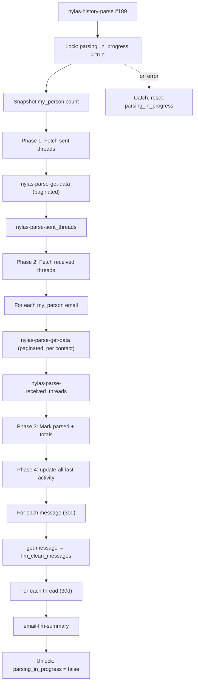

# Historical Log & Parse

When a user connects an email account, Orbiter runs two pipelines:

1. **History Parse** — scans sent and received threads, creates activity records, cleans message bodies, and generates AI summaries.
2. **Account Import** — scans sent threads and calendar events to discover new contacts and populate the `email_account_import` table.

| Function | ID | Role |
|----------|----|------|
| `mvp/activity/nylas-history-parse` | #189 | Master orchestrator — parses threads, creates activities, runs AI |
| `mvp/import/email-account` | #4638 | Contact import — discovers emails from threads + calendar events |
| `mvp/activity/add-email-account-record` | #12539 | Gatekeeper — validates and inserts a single import record |

---

## `mvp/activity/nylas-history-parse` (ID #189)

The master orchestrator for historical email parsing. Called once per Nylas grant when a user connects an email account or triggers a re-sync. Fetches all sent and received threads, creates activity records, cleans message bodies via LLM, and generates per-thread AI summaries.

### Input

| Field | Type | Required | Description |
|-------|------|----------|-------------|
| `grant_id` | text | Yes | Nylas grant ID for the email account to parse |
| `time_range` | int | No | Number of days to look back. `0` or empty = full history |

### Step-by-Step Flow

<Steps>
  <Step title="Resolve timestamp">
    If `time_range` is greater than 0, computes a UTC midnight timestamp N days ago (in epoch seconds). Otherwise sets timestamp to `null` for a full-history parse.
  </Step>

  <Step title="Resolve Nylas grant + user">
    Looks up the `nylas_grant` record by `grant_id`. Joins the `user` table via addon to pull the user's `clerk_id` (needed for notifications).
  </Step>

  <Step title="Lock the grant">
    Sets `parsing_in_progress: true` on the `nylas_grant` record. This prevents concurrent parses for the same account. The entire remaining logic is wrapped in a try/catch that resets this flag on failure.
  </Step>

  <Step title="Snapshot pre-parse contact count">
    Counts existing `my_person` records for this user. Used at the end to calculate how many new contacts were added.
  </Step>

  <Step title="Phase 1: Fetch sent threads">
    Pages through the Nylas API via **`mvp/activity/nylas-parse-get-data`**, passing the user's email account and timestamp filter. Each page of thread data is merged into a `$sent_threads` accumulator.

    Pagination continues via `next_cursor` until all pages are exhausted.
  </Step>

  <Step title="Phase 1: Process sent threads">
    If any sent threads were collected, delegates to **`mvp/activity/nylas-parse-sent_threads`** which creates `email_activity` records, resolves participants to `my_person` contacts, and links threads to activities.
  </Step>

  <Step title="Phase 2: Fetch received threads (per contact)">
    Queries all `my_person` records for this user, including their linked `master_email` addresses. For each contact's email address, pages through Nylas to find threads where that contact sent mail to this grant.

    Each contact's fetch is wrapped in a try/catch — a failed Nylas call for one contact skips to the next without aborting the parse.

    **Sub-function called:** `mvp/activity/nylas-parse-get-data` (per email, paginated)
  </Step>

  <Step title="Phase 2: Process received threads">
    If any received threads were collected, delegates to **`mvp/activity/nylas-parse-received_threads`** which creates inbound `email_activity` records and links them to the correct `my_person` contacts.
  </Step>

  <Step title="Phase 3: Mark grant as parsed">
    Updates the `nylas_grant` record: sets `oldest_sync` to now, `parsed: true`, and `parsing_in_progress: false`.
  </Step>

  <Step title="Phase 3: Calculate totals">
    Computes `emails_count` (sum of sent + received thread counts) and `totalPersonsAdded` (post-parse `my_person` count minus pre-parse snapshot).
  </Step>

  <Step title="Phase 4: Update last-activity timestamps">
    Calls **`mvp/activity/update-all-last-activity`** to recalculate `last_activity_at` on every `my_person` record for this user, based on the newly created activity records.
  </Step>

  <Step title="Phase 4: Clean message bodies (last 30 days)">
    Queries `email_activity` for messages within the last 30 days. Extracts unique `message_id` values and filters out drafts (IDs starting with `r`).

    For each message:
    1. Fetches the full message body from Nylas via **`api/nylas/get-message`**
    2. Sends it through **`clean-convo/llm_clean_messages`** to strip signatures, quoted replies, and formatting artifacts

    Each message is wrapped in try/catch — failures skip to the next message.
  </Step>

  <Step title="Phase 4: Generate AI thread summaries (last 30 days)">
    Extracts unique `thread_id` values from the same recent activity query. For each thread, calls **`mvp/activity/email-llm-summary`** to generate an AI-powered conversation summary.

    Each thread is wrapped in try/catch — failures skip to the next thread.
  </Step>

  <Step title="Phase 5: Notifications (disabled)">
    A Knock notification (`sync-email-completed-historical-sync`) is defined but currently disabled. When re-enabled, it will notify the user with the email account, person count, and email count.
  </Step>
</Steps>

### Error Handling

The entire pipeline (Phases 1–5) is wrapped in a top-level try/catch. If any unhandled error occurs, the catch block resets `parsing_in_progress: false` on the `nylas_grant` record to prevent permanent grant locks.

### Dependencies

| Function Called | Purpose |
|----------------|---------|
| `mvp/activity/nylas-parse-get-data` | Fetches one page of thread data from Nylas |
| `mvp/activity/nylas-parse-sent_threads` | Processes sent threads into `email_activity` records |
| `mvp/activity/nylas-parse-received_threads` | Processes received threads into `email_activity` records |
| `mvp/activity/update-all-last-activity` | Recalculates `last_activity_at` on all `my_person` records |
| `api/nylas/get-message` | Fetches a single message body from Nylas |
| `clean-convo/llm_clean_messages` | LLM-based message body cleaning |
| `mvp/activity/email-llm-summary` | LLM-based thread summary generation |

### Pipeline Diagram

---

## `mvp/import/email-account` (ID #4638)

The top-level orchestrator. Called once per Nylas grant to import all discoverable contacts into `email_account_import`.

### Input

| Field | Type | Description |
|-------|------|-------------|
| `grant_id` | text | Nylas grant ID for the email account to scan |

### Step-by-Step Flow

<Steps>
  <Step title="Load marketing prefixes">
    Queries the `marketing_prefix` table and flattens the result into a simple array of prefix strings (e.g. `["noreply", "newsletter", "support"]`). This array is passed to every downstream call so marketing emails are filtered consistently.
  </Step>

  <Step title="Resolve the Nylas grant">
    Looks up the `nylas_grant` record by `grant_id`. Joins the `user` table via addon to pull user settings including `working_timezone`. These settings are used for timestamp math throughout the function.
  </Step>

  <Step title="Scan sent threads — last 30 days">
    Calculates a UTC timestamp for 30 days ago at midnight, then pages through the Nylas API via `mvp/activity/nylas-parse-get-data`.

    For each page of results:
    1. **Lambda dedup** — A JavaScript lambda normalizes emails to lowercase, removes the user's own email, and deduplicates within the page.
    2. **Quick reject** — Skips emails containing `+`, `=`, or `unsubscribe` (obvious non-human addresses).
    3. **Delegate to gatekeeper** — Calls `mvp/activity/add-email-account-record` with `last_30_days: true`, passing the marketing prefix array for full filtering.

    Pagination continues via `next_cursor` until all pages are exhausted.
  </Step>

  <Step title="Scan sent threads — full history">
    Sets the timestamp filter to `null` (no lower bound) and repeats the same paging + dedup + gatekeeper pattern. The only difference is `last_30_days: false` on each call.
  </Step>

  <Step title="Scan calendar events — last 30 days to +6 months">
    Looks up the user's primary `calendar` record by `external_id` matching their email account. Calls `nylas/nylas-calendar-get-filtered-events` for the window from 30 days ago through 6 months into the future.

    Extracts all participant emails, deduplicates, removes the user's own address, then calls `add-email-account-record` for each with `last_30_days: false`.
  </Step>

  <Step title="Scan calendar events — older than 30 days">
    Same pattern but for the window from epoch (0) through 30 days ago. Calls `add-email-account-record` for each participant with `last_30_days: false`.
  </Step>
</Steps>

### Dependencies

| Function Called | Purpose |
|----------------|---------|
| `mvp/activity/nylas-parse-get-data` | Fetches one page of sent-thread participants from Nylas |
| `mvp/activity/add-email-account-record` | Validates and inserts a single contact |
| `nylas/nylas-calendar-get-filtered-events` | Fetches calendar event participants for a date range |

---

## `mvp/activity/add-email-account-record` (ID #12539)

The single-record gatekeeper. Decides whether an email address should be imported and, if so, inserts it into `email_account_import`.

### Input

| Field | Type | Description |
|-------|------|-------------|
| `email_address` | email | The email to evaluate |
| `user_id` | int | Owning user ID |
| `grant_id` | text | Nylas grant ID the email was discovered from |
| `name` | text (nullable) | Display name if available from Nylas |
| `last_30_days` | bool | Whether the email was found in the last-30-day window |
| `prefix_array` | text[] | Marketing prefixes to filter against |

### Step-by-Step Flow

<Steps>
  <Step title="Guard: empty email">
    If `email_address` is empty or null, returns `"exists"` immediately. Prevents unnecessary DB queries.
  </Step>

  <Step title="Check master_email">
    Queries `master_email` by `email_address`. If a record exists, the contact is already known to Orbiter — returns `"exists"`.
  </Step>

  <Step title="Check email_account_import">
    Queries `email_account_import` for a matching `user_id + email` pair. If found, this address was already imported for this user — returns `"exists"`.
  </Step>

  <Step title="Marketing prefix filter">
    Extracts the local part of the email (everything before `@`) and checks:
    - Is it in the `prefix_array` from the `marketing_prefix` table?
    - Does it contain `+` or `=`?
    - Does the full address contain `unsubscribe`?

    If any check matches, returns `"marketing"` and skips the insert.
  </Step>

  <Step title="Insert record">
    Adds a new row to `email_account_import` with `created_at`, `user_id`, `grant_id`, `name`, `email`, and `last_30_days`. Returns `"added"`.
  </Step>
</Steps>

### Return Values

| Value | Meaning |
|-------|---------|
| `"exists"` | Already in `master_email` or `email_account_import` (or empty input) |
| `"marketing"` | Filtered out as a marketing/automated address |
| `"added"` | Successfully inserted into `email_account_import` |

---

## Table: `email_account_import` (ID #599)

| Column | Type | Description |
|--------|------|-------------|
| `id` | int | Primary key |
| `created_at` | timestamp | Row creation time |
| `user_id` | int | FK to `user` table |
| `grant_id` | text | Nylas grant ID the contact was discovered from |
| `name` | text (nullable) | Display name from email headers |
| `email` | email | The discovered email address |
| `last_30_days` | bool | `true` if found in the 30-day sent window |
| `email_signature` | json | Reserved for future use |
| `processing` | bool | Processing flag for downstream consumers |

---

## Full Pipeline Diagram

Shows how all three functions connect within the overall historical parse and import flow.

```mermaid
graph TD
    subgraph "#189 nylas-history-parse"
        HP_START["Start"] --> HP_LOCK["Lock grant"]
        HP_LOCK --> HP_SENT["Fetch sent threads (paginated)"]
        HP_SENT --> HP_SENT_PROC["nylas-parse-sent_threads"]
        HP_SENT_PROC --> HP_RECV["Fetch received threads (per contact)"]
        HP_RECV --> HP_RECV_PROC["nylas-parse-received_threads"]
        HP_RECV_PROC --> HP_MARK["Mark parsed + totals"]
        HP_MARK --> HP_ACTIVITY["update-all-last-activity"]
        HP_ACTIVITY --> HP_CLEAN["Clean messages via LLM (30d)"]
        HP_CLEAN --> HP_SUMMARY["AI thread summaries (30d)"]
        HP_SUMMARY --> HP_UNLOCK["Unlock grant"]
    end

    subgraph "#4638 import/email-account"
        IM_START["Start"] --> IM_PREFIX["Load marketing_prefix"]
        IM_PREFIX --> IM_GRANT["Resolve nylas_grant"]
        IM_GRANT --> IM_30D["Sent threads: 30 days"]
        IM_GRANT --> IM_FULL["Sent threads: full history"]
        IM_GRANT --> IM_CAL1["Calendar: -30d to +6mo"]
        IM_GRANT --> IM_CAL2["Calendar: older than 30d"]
        IM_30D --> IM_DEDUP["Lambda dedup + quick reject"]
        IM_FULL --> IM_DEDUP
        IM_CAL1 --> IM_GATE["add-email-account-record"]
        IM_CAL2 --> IM_GATE
        IM_DEDUP --> IM_GATE
    end

    subgraph "#12539 add-email-account-record"
        GK_START["Receive email"] --> GK_EMPTY{Empty?}
        GK_EMPTY -->|Yes| GK_SKIP["Return 'exists'"]
        GK_EMPTY -->|No| GK_MASTER{In master_email?}
        GK_MASTER -->|Yes| GK_SKIP
        GK_MASTER -->|No| GK_IMPORT{Already imported?}
        GK_IMPORT -->|Yes| GK_SKIP
        GK_IMPORT -->|No| GK_MKTG{Marketing prefix?}
        GK_MKTG -->|Yes| GK_MKTG_SKIP["Return 'marketing'"]
        GK_MKTG -->|No| GK_INSERT["INSERT → email_account_import"]
        GK_INSERT --> GK_ADDED["Return 'added'"]
    end
```

