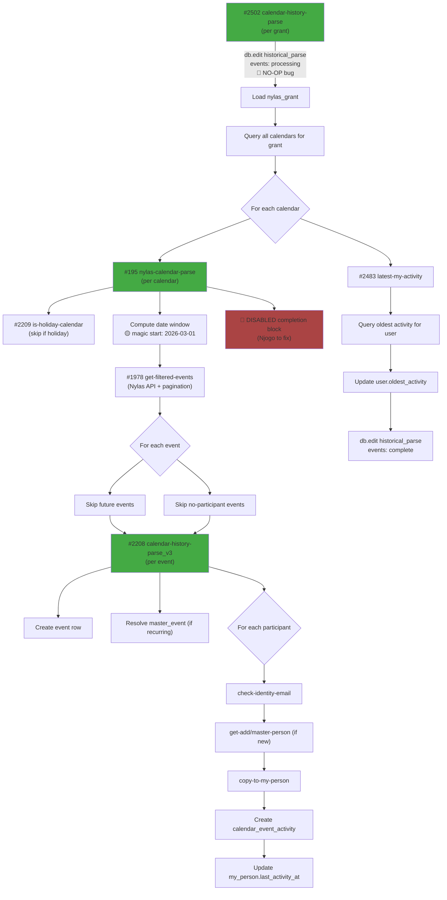

Orbiter's historical calendar parse is a six-function chain that runs once per Nylas grant. It fetches every past calendar event on every one of the user's connected calendars, creates `event` + `calendar_event_activity` rows for each attendee, and (in theory) rolls up the user's `oldest_activity` timestamp at the end.

This page walks the chain in call order, documents what each function actually does today, and flags every QA finding inline so the next person touching this code can see exactly what's broken before they touch it.

<Warning>
**Multiple functions in this chain are tagged `needs refactor!` and/or `maybe depreciated??` in Xano.** Several contain disabled code blocks, hardcoded magic numbers, and O(N²) query loops. Read the QA findings on each function before assuming anything works. Three of the six functions have critical bugs that make end-of-chain effects (notifications, status marking, progress timestamps) fail silently.
</Warning>

## The chain at a glance

| # | Function | Xano ID | Role |
|---|---|---|---|
| 1 | `mvp/activity/calendar-history-parse` | **#2502** | Top-level orchestrator called per grant. Fans out to one `nylas-calendar-parse` call per calendar on the grant, then rolls up activity timestamps. 🔴 tagged `needs refactor!` + `maybe depreciated??` |
| 2 | `mvp/nylas/nylas-calendar-parse` | **#195** | Per-calendar parse. Holiday-calendar guard, date window computation, fetches events from Nylas, iterates past events, delegates each to the per-event worker. |
| 3 | `nylas/is-holiday-calendar` | **#2209** | Holiday-calendar detector. Returns `true` if the calendar's external_id or name contains "holiday" (case-insensitive). |
| 4 | `nylas/nylas-calendar-get-filtered-events` | **#1978** | Nylas API wrapper. Fetches events for a calendar inside a date window with cursor-based pagination. |
| 5 | `mvp/nylas/nylas-calendar-history-parse_v3` | **#2208** | Per-event worker. Creates `event` + `calendar_event_activity` rows, resolves each participant to a master_person + my_person, updates last_activity. 🔴 tagged `maybe depreciated??` |
| 6 | `nylas/latest-my-activity` | **#2483** | Post-parse rollup. Recomputes `last_activity_at` on every my_person touched, and `oldest_activity` on the user row. |

## Full flow diagram



---

## #2502 — `mvp/activity/calendar-history-parse` (top-level)

```text
mvp/activity/calendar-history-parse — #2502
tags: needs refactor!, maybe depreciated??
```

The entry point. Called once per Nylas grant to kick off a full historical calendar parse across every calendar the grant has access to.

### Inputs

| Field | Type | Required | Description |
|-------|------|----------|-------------|
| `grant_id` | text | No (but effectively yes — hard-required by downstream lookups) | Nylas grant ID to parse |

### Step-by-step flow

<Steps>
  <Step title="Mark historical_parse as 'processing' 🔴 BROKEN">
    Calls `db.edit historical_parse` with `field_name: "nylas_grant_id"`, `field_value: "nylas_grant.id"` (a **literal string**, not a variable reference) and `data: { events: "processing" }`. This is a no-op — see [Finding 1](#2502-finding-1) below.
  </Step>
  <Step title="Load nylas_grant">
    Inside a `group { stack { } }` block, loads the `nylas_grant` row by `grant_id`. The `$nylas_grant` variable is then referenced throughout the rest of the function — but outside the group's scope. See [Finding 3](#2502-finding-3).
  </Step>
  <Step title="Query all calendars on this grant">
    Runs `db.query calendar WHERE grant_id == $input.grant_id` to get every calendar row the user has connected through this grant.
  </Step>
  <Step title="Fan out to per-calendar parse">
    `foreach` the calendar list, calling `mvp/nylas/nylas-calendar-parse` (#195) with `{ grant_id, calendar_id: $item.id, range: $nylas_grant.timerange }`. No try/catch — see [Finding 2](#2502-finding-2).
  </Step>
  <Step title="Rollup per-contact activity">
    Calls `nylas/latest-my-activity` (#2483) to recompute `last_activity_at` on every `my_person` the user has, and `oldest_activity` on the user row.
  </Step>
  <Step title="Query oldest activity timestamp">
    Runs `db.query activity WHERE user_id == $nylas_grant.user_id ORDER BY activity_timestamp ASC LIMIT 1`. Saves the oldest activity timestamp.
  </Step>
  <Step title="Update user.oldest_activity">
    Writes the oldest activity timestamp back to the `user` row. (This is **redundant** — #2483 already did the same write. See [Finding 4](#2502-finding-4).)
  </Step>
  <Step title="Mark historical_parse as 'complete'">
    Writes `{ events: "complete", oldest_parse: $oldest_activity.activity_timestamp }` to `historical_parse` WHERE `nylas_grant_id == $nylas_grant.id`. This one uses the correct variable reference (unlike the "processing" write at the start).
  </Step>
</Steps>

### QA findings for #2502

<Note id="2502-finding-1">
**🔴 Finding 1 — "processing" marker is a no-op (string-literal bug + variable-ordering bug)**

```xanoscript
db.edit historical_parse {
  field_name = "nylas_grant_id"
  field_value = "nylas_grant.id"  // ← literal string, not a variable
  data = {events: "processing"}
}
```

Two problems compound:
1. `field_value` is the literal string `"nylas_grant.id"`, not `$nylas_grant.id`. It will never match any row.
2. Even if it were fixed to `$nylas_grant.id`, the variable isn't loaded until the group block **below** this line. So the reference would be undefined at this point in the stack.

Consequence: the `historical_parse.events = "processing"` status marker **never gets written**. Anything downstream that reads the row to tell whether a parse is in progress sees stale data. The "complete" write at the end of the function does work (it correctly uses `$nylas_grant.id` and runs after the variable is loaded) so you eventually see `events: "complete"` — but you can't tell from the DB whether a parse is running or just hasn't been triggered yet.

**Fix:** Move the `db.get nylas_grant` to the top of the function (before the "processing" write), then change `field_value = "nylas_grant.id"` to `field_value = $nylas_grant.id`.
</Note>

<Note id="2502-finding-2">
**🔴 Finding 2 — No try/catch around the fan-out loop**

The `foreach ($calendar)` loop that calls #195 is bare — no try/catch. If any single calendar parse throws (and #195 has its own error-handling gaps, see its QA section), the entire fan-out aborts. Subsequent calendars are never processed, the rollup call (#2483) never runs, and `historical_parse.events = "complete"` is never written. The grant ends up in limbo: some calendars parsed, no rollup, no completion marker.

**Fix:** Wrap each `function.run` call in its own `try_catch` and write any caught errors to `log_crash` with the calendar id. Continue the loop on failure.
</Note>

<Note id="2502-finding-3">
**🟡 Finding 3 — `$nylas_grant` scoping is fragile**

`$nylas_grant` is declared inside a `group { stack { ... } }` block but referenced later outside that block (`nylas/latest-my-activity { user_id: $nylas_grant.user_id }`, `db.edit user { field_value: $nylas_grant.user_id }`, etc.). XanoScript does appear to leak group-scoped vars to the outer stack based on how other Orbiter functions rely on the same pattern, but it's brittle and hard to read.

**Fix:** Declare `$nylas_grant` at the top of the outer stack, not inside the group. The group is only needed for grouping the fan-out loop visually, and it's obscuring scope.
</Note>

<Note id="2502-finding-4">
**🟡 Finding 4 — Duplicate `oldest_activity` write**

`#2483 nylas/latest-my-activity` already writes `user.oldest_activity` at the end of its own stack. Then this function queries the oldest activity AGAIN and writes it AGAIN to the user row. Both writes should produce the same value, so it's not incorrect — just wasted DB work.

**Fix:** Delete the duplicate query + user edit. Let #2483 own the rollup writes.
</Note>

<Note>
**🟡 Finding 5 — `grant_id` typed optional but hard-required**

`grant_id` input is declared `text grant_id? filters=trim` (optional), but the first real logic (`db.get nylas_grant`) uses it as the lookup key. Without a guard, a call without `grant_id` would silently load the wrong row or fail obscurely.

**Fix:** Remove the `?` on the input, or add an early-return guard if `grant_id` is empty.
</Note>

---

## #195 — `mvp/nylas/nylas-calendar-parse` (per-calendar)

```text
mvp/nylas/nylas-calendar-parse — #195
tags: nylas - calendar - parse, ncr - approve
```

Per-calendar orchestrator. Called by #2502 once per calendar on the grant. Runs the holiday-calendar guard, computes a date window, fetches past events from Nylas, and delegates each event to the per-event worker (#2208).

### Inputs

| Field | Type | Required | Description |
|-------|------|----------|-------------|
| `grant_id` | text | Yes | Nylas grant ID |
| `calendar_id` | int | No (but hard-required by code) | Orbiter `calendar.id` (integer PK, NOT the Nylas external_id) |
| `range` | int | No | Number of days to look back. If empty → hardcoded magic start date, see Finding 3. |

### Step-by-step flow

<Steps>
  <Step title="Load calendar">
    `db.get calendar` by Orbiter PK.
  </Step>
  <Step title="Holiday-calendar guard">
    Calls `nylas/is-holiday-calendar` (#2209) with the calendar's `external_id` and `name`. If it returns true, sets `calendar.is_holiday_calendar = true` and returns `"Calendar is a Holiday Calendar"` early.
  </Step>
  <Step title="Load Nylas grant + user">
    `db.get nylas_grant` by `grant_id`, with a user addon pulling `user.settings.working_timezone`. Returns `"No nylas grant found"` if missing.
  </Step>
  <Step title="Compute date window 🟡">
    <ul>
      <li><strong>endDate:</strong> `now|to_seconds:"UTC"|multiply:1000|!transform_timestamp:"+ 30 days":"UTC"`. The `!transform_timestamp` piece is **disabled**, so effective `endDate = now` (ms). See [Finding 2](#195-finding-2).</li>
      <li><strong>startDate (no range):</strong> Hardcoded magic number `1772323200 * 1000` ms = **2026-03-01 UTC**. See [Finding 3](#195-finding-3).</li>
      <li><strong>startDate (with range):</strong> `now - range days` computed in the user's working timezone.</li>
    </ul>
  </Step>
  <Step title="Fetch events from Nylas">
    Calls `nylas/nylas-calendar-get-filtered-events` (#1978) with `grant_id`, `calendar.external_id`, `start_date`, `end_date`.
  </Step>
  <Step title="Compute $firstEventTimestamp 🔴">
    ```xanoscript
    $events|get:"when.start_time":null|sort:"":"itext":true|first
    ```
    Misnamed, mis-sorted, and drops all-day events. See [Finding 4](#195-finding-4). (Only matters if the completion block is re-enabled — currently it isn't.)
  </Step>
  <Step title="Foreach event">
    For each event:
    <ul>
      <li>Skip if `when.start_time > now` (timed future event)</li>
      <li>Skip if `when.start_date > now` (all-day future event)</li>
      <li>Skip if `participants` is empty</li>
      <li>Otherwise call `mvp/nylas/nylas-calendar-history-parse_v3` (#2208) with the event</li>
      <li>Increment `$event_created_count` if the worker returns truthy</li>
    </ul>
    No try/catch around the worker call. See [Finding 6](#195-finding-6).
  </Step>
  <Step title="Completion block 🔴 DISABLED">
    Everything that marks the calendar as parsed, sends the completion notification, and publishes the realtime message is **entirely disabled** (`!group` + `!db.edit` + `!function.run`). See [Finding 1](#195-finding-1).
  </Step>
</Steps>

### QA findings for #195

<Note id="195-finding-1">
**🔴 Finding 1 — Entire completion block disabled (`// Njogo to fix`)**

```xanoscript
// Njogo to fix
!group {
  stack {
    !db.edit calendar { ... parsed: true, parsed_to: $firstEventTimestamp|multiply:1000 ... }
    !function.run "mvp/nylas/archive/new-user-accounts" { ... }
    !function.run "mvp/knock/send-notification" {
      key: "sync-calendar-completed-historical-sync"
      ...
    }
    !function.run "nylas/nylas-send-authenticated-realtime" {
      channel: "calendar_syncing_complete"
      ...
    }
  }
}
```

Every statement in this block is prefixed with `!`, which disables it in XanoScript. Impact:
- **`calendar.parsed` is never set to `true`** — no way to tell from the DB whether a calendar has been parsed
- **`calendar.parsed_to` is never written** — no progress marker
- **The Knock notification (`sync-calendar-completed-historical-sync`) never fires** — user never sees "your calendar sync finished"
- **The realtime message on `calendar_syncing_complete` never fires** — frontend can't update its UI when sync completes

The `// Njogo to fix` comment suggests this was flagged for someone and never resolved.

**Fix:** Re-enable the block, but first fix Finding 4 (`$firstEventTimestamp` is wrong). Then verify the three downstream functions still work as expected.
</Note>

<Note id="195-finding-2">
**🟡 Finding 2 — `$endDate` has a disabled filter**

```xanoscript
var $endDate {
  value = now|to_seconds:"UTC"|multiply:1000|!transform_timestamp:"+ 30 days":"UTC"
}
```

The `!transform_timestamp` is disabled, making effective `endDate = now` (ms). Two interpretations:
- **Intentional:** Since the foreach loop already skips future events (`start_time > now → continue`), fetching +30 days of upcoming events would be wasted work. Whoever disabled this was being efficient.
- **Unintentional:** Someone was mid-edit and left it broken.

Either way: **the function is a pure historical backfill**. Future events are never touched here (they're handled by the realtime Nylas `event.created` webhook).

**Fix:** Either delete the `!transform_timestamp` piece entirely (make it clear that endDate is literally "now") or re-enable it if upcoming events should be pre-created. Decide based on whether the realtime webhook is reliable enough.
</Note>

<Note id="195-finding-3">
**🟡 Finding 3 — Default start date is a hardcoded magic number**

```xanoscript
var $startDate {
  value = 1772323200|multiply:1000
}
```

`1772323200` seconds since epoch = **2026-03-01 00:00:00 UTC**. If `#2502` calls #195 without a `range` (i.e. `$nylas_grant.timerange` is null), the scan starts from March 1, 2026 — **not from epoch, not from the user's signup, not from "forever"**. Anyone expecting "full history" gets silently truncated.

Possible origin stories: a launch-date cutoff, a test value that got committed, a project-specific start window. No comment in the source explains it. Zero references to 1772323200 elsewhere in the workspace as far as the audit went.

**Fix:** Either (a) move to an env var (`$env.historical_parse_start_epoch`), (b) change the default to `0` (epoch) and document that "no range = full history", or (c) document WHY 2026-03-01 is the cutoff in a header comment. Current state is a footgun.
</Note>

<Note id="195-finding-4">
**🔴 Finding 4 — `$firstEventTimestamp` is wrong in three ways**

```xanoscript
var $firstEventTimestamp {
  value = $events|get:"when.start_time":null|sort:"":"itext":true|first
}
```

1. **`itext` is case-insensitive TEXT sort, applied to numeric epoch timestamps.** For 10-digit epoch seconds (currently ~1.7 billion), lexicographic sort happens to match numeric sort, so it works by accident — until year 2286 when epoch hits 11 digits. Should be `num` sort or just plain asc/desc on numbers.
2. **`true` means reverse sort**, so `|first` returns the **latest** timestamp, not the earliest. The variable name `$firstEventTimestamp` is the opposite of what it actually holds.
3. **`get:"when.start_time"` drops all-day events**, which use `when.start_date` (a date string like `"2026-04-10"`), not `when.start_time` (epoch seconds). So the sort list only contains timed events; all-day meetings are ignored.

Since this variable is only consumed inside the **disabled** completion block ([Finding 1](#195-finding-1)), none of this matters in production today — but if the completion block is re-enabled, `calendar.parsed_to` will be wrong (set to the latest timed event's start_time, missing any later all-day events).

**Fix:** Rename to `$latestEventTimestamp`, fix the sort to `num`, and merge both `start_time` and `start_date` into the sort input.
</Note>

<Note>
**🟡 Finding 5 — `calendar_id` typed optional but hard-required**

```xanoscript
input {
  text grant_id filters=trim
  int calendar_id?          // ← optional
  int? range?
}
```

`calendar_id?` is marked optional, but the first statement is `db.get calendar { field_value = $input.calendar_id }`. Without a calendar_id the lookup either errors or tries to load calendar ID 0. Undefined behavior for a missing input.

**Fix:** Remove the `?`, or add a guard returning a clear error.
</Note>

<Note id="195-finding-6">
**🟡 Finding 6 — No try/catch around per-event worker**

```xanoscript
foreach ($events) {
  each as $event {
    // ... skip checks ...
    function.run "mvp/nylas/nylas-calendar-history-parse_v3" {
      input = {grant_id: $input.grant_id, event: $event}
    } as $created
    // ...
  }
}
```

If #2208 throws on any single event, the entire calendar's foreach aborts. No log, no continue, no partial-completion signal. The user sees some events processed, then silence.

Compare to the sibling email-history parse (#189 `nylas-history-parse`) which wraps per-contact and per-message calls in try/catch. This one doesn't.

**Fix:** Wrap the worker call in `try_catch`, log to `log_crash` with `grant_id + event.id`, continue on failure.
</Note>

---

## #2209 — `nylas/is-holiday-calendar`

```text
nylas/is-holiday-calendar — #2209
tags: nylas - calendar - parse
```

Trivial helper — returns `true` if either the calendar's external_id or name contains the literal substring `"holiday"` (case-insensitive).

### Inputs

| Field | Type | Description |
|-------|------|-------------|
| `calendar_external_id` | text | Nylas external_id |
| `calendar_name` | text | Display name of the calendar |

### Full body

```xanoscript
var $isHoliday { value = false }
if (calendar_external_id|icontains:"holiday" OR calendar_name|icontains:"holiday") {
  $isHoliday = true
}
response = $isHoliday
```

### QA findings for #2209

<Note>
**🟡 Finding 1 — Weak detection heuristic**

Only matches the literal English substring `"holiday"`. Will miss:
- Localized calendar names: `"Feiertage"` (German), `"Jours fériés"` (French), `"Festivi"` (Italian), `"祝日"` (Japanese), `"Праздники"` (Russian)
- Holiday-specific calendars that don't contain the word "holiday": `"US Federal Observances"`, `"Christmas 2026"`, `"Ramadan"`, `"Diwali"`, `"Chinese New Year"`
- Provider-specific names: Outlook uses `"United States holidays"` which matches, but also `"Birthdays"`, `"Contacts' Birthdays"`, and `"Weather"` which don't but are similarly low-value to parse

**Fix:** Either (a) maintain a regex list covering known non-productivity calendars in multiple languages, or (b) pattern-match against Nylas calendar metadata (some providers expose a `read_only` or `is_owned_calendar: false` flag) rather than on the name string.
</Note>

<Note>
**🟢 Correct in practice today** — `icontains` is the right filter (case-insensitive), and the function is pure/idempotent/cheap. For an English-speaking user base with default-named holiday calendars, it works. It's just brittle.
</Note>

---

## #1978 — `nylas/nylas-calendar-get-filtered-events`

```text
nylas/nylas-calendar-get-filtered-events — #1978
tags: nylas - calendar - parse, requires-nylas-auth
```

Nylas API wrapper. Fetches all events for a calendar inside a date window, paginating via Nylas's cursor-based `next_cursor`.

### Inputs

| Field | Type | Description |
|-------|------|-------------|
| `grant_id` | text | Nylas grant ID |
| `calendar_id` | text | Nylas external_id of the calendar (note: NOT the Orbiter PK) |
| `start_date` | timestamp (ms) | Window lower bound |
| `end_date` | timestamp (ms) | Window upper bound |

### Step-by-step flow

<Steps>
  <Step title="Load Nylas API keys">
    Calls `mvp/nylas/get-nylas-keys` to get the API key.
  </Step>
  <Step title="First page request">
    `GET https://api.us.nylas.com/v3/grants/{grant_id}/events` with params `calendar_id`, `limit=100`, `start=$start_date/1000`, `end=$end_date/1000`. Saves `data` and `next_cursor`.
  </Step>
  <Step title="Pagination loop">
    `while $cursor != null`: makes follow-up requests with `calendar_id`, `limit=200` (notice — different from first page!), `page_token=$cursor`. Pushes each page's data onto the accumulator. Updates `$cursor` from the new response.
  </Step>
</Steps>

### QA findings for #1978

<Note>
**🔴 Finding 1 — Paginated requests don't include the date filter**

The first request passes `start` and `end`. The pagination loop passes only `page_token` + `calendar_id` + `limit`. Two possibilities:
- **Nylas v3 preserves filters across paginated requests by `page_token`** (likely — most cursor-based APIs do). In that case this is fine.
- **Nylas v3 requires the filters on every page.** If so, pages 2+ return events **outside the intended date window**, silently polluting the result set.

The fact that this function has been running in production without complaints suggests option 1, but there's no documentation in the source or a comment confirming which it is. Worth verifying against Nylas docs and adding a comment.

**Fix:** Add a comment referencing Nylas docs confirming the behavior. If option 2 is actually true, pass `start` and `end` on paginated requests too.
</Note>

<Note>
**🔴 Finding 2 — Inconsistent page size between first and subsequent requests**

```
First request:     limit = 100
Paginated request: limit = 200
```

No comment explaining the difference. Either the first `100` is wrong (missed optimization) or the `200` is wrong (risk of hitting Nylas rate limits on larger calendars). Either way, inconsistent.

**Fix:** Pick one page size and use it consistently. Nylas v3 documented maximum for `/v3/grants/{grant_id}/events` is `limit=200`, so standardize on `200`.
</Note>

<Note>
**🔴 Finding 3 — `array.push` may be wrapping pages into nested arrays**

```xanoscript
array.push $nylasResponseData {
  value = $paginatedApi.response.result.data
}
```

`$paginatedApi.response.result.data` is a **list of events**, not a single event. `array.push` adds its argument as a single element, which means the accumulator ends up as `[event, event, event, [event, event, ...]]` — a list of events from page 1 followed by a nested list of all subsequent pages as one element.

If XanoScript's `array.push` flattens list arguments, this works. If it doesn't, the consumer (#195's `foreach ($events)`) iterates over a mix of event objects and one nested list, causing the foreach body to misread one of its iterations.

**Fix:** Use `var.update $nylasResponseData { value = $nylasResponseData|merge:$paginatedApi.response.result.data }` to concatenate lists cleanly. Verify the current behavior in the Xano UI before shipping the fix.
</Note>

<Note>
**🟡 Finding 4 — No timeout on paginated requests**

```
First request:     timeout = 30
Paginated request: (no timeout specified)
```

If Nylas hangs on page 3 of 50, the function hangs indefinitely. First-page requests have a 30s timeout that protects against this, but follow-ups don't.

**Fix:** Add `timeout = 30` to the paginated request block.
</Note>

<Note>
**🟡 Finding 5 — Hardcoded US region endpoint**

```
url = "https://api.us.nylas.com/v3/grants/%s/events"|sprintf:$input.grant_id
```

The `us.nylas.com` hostname is baked in. EU-region Nylas tenants would fail. Orbiter's production may be US-only today, but this is a latent gotcha for any future EU expansion.

**Fix:** Either pull the region from `get-nylas-keys` response (add a `region` or `api_host` field), or move to `$env.nylas_api_host`.
</Note>

<Note>
**🟡 Finding 6 — No error handling**

If Nylas returns a 5xx mid-pagination, the accumulator has partial data and the function silently returns whatever it has. No retry, no log, no exception. Callers assume the returned list is complete.

**Fix:** Check `$paginatedApi.response.status` on every request; log + throw on 5xx, retry with exponential backoff on 429.
</Note>

---

## #2208 — `mvp/nylas/nylas-calendar-history-parse_v3` (per-event worker)

```text
mvp/nylas/nylas-calendar-history-parse_v3 — #2208
tags: nylas - calendar - parse, ncr - approve, requires-nylas-auth, maybe depreciated??
```

The biggest function in the chain. Called once per event by #195. For a single event, creates an `event` row, optionally creates/resolves the recurring `master_event`, then loops over every participant and creates a `calendar_event_activity` row linked to the participant's `my_person`. Handles both "participant already known" and "participant is brand new" branches for both organizer and attendee.

### Inputs

| Field | Type | Description |
|-------|------|-------------|
| `grant_id` | text | Nylas grant ID |
| `event` | json | The full event object from Nylas |

### Step-by-step flow

<Steps>
  <Step title="Load Nylas keys + grant + calendar">
    Loads API keys, `nylas_grant` by `grant_id`, and `calendar` by `event.calendar_id` (matching on `calendar.external_id`).
  </Step>
  <Step title="Duplicate-event guard">
    Queries `event` WHERE `external_id == $input.event.id AND calendar_id == $calendar.id`. If found, returns `false` (already processed). Otherwise sets `$created_record = true`.
  </Step>
  <Step title="Resolve or create master_event (recurring events only)">
    If the event has a `master_event_id`:
    1. Look up `master_event` by `external_id == $input.event.master_event_id`.
    2. If not found: call Nylas `GET /v3/grants/{grant_id}/events/{master_event_id}` to fetch the master, then `db.add master_event` with title/start/end/provider/url/recurrence.
    3. If found: reuse the existing master_event.
    Otherwise (one-off event): `$master_event = { id: null }`.
  </Step>
  <Step title="Count participants 🟡">
    `$participant_count = $input.event.participants|count|!add:1`. The `!add:1` is a disabled filter. See [Finding 2](#2208-finding-2).
  </Step>
  <Step title="Create event row (two near-duplicate branches)">
    If the organizer's email icontains `"calendar.google"`, creates an `event` row with `description: ""` (empty). Otherwise creates an `event` row with `description: $input.event.description`. See [Finding 3](#2208-finding-3).

    Both branches set the same fields: title, external_id, start, end, master_event_id, calendar_id, provider, url, organize (always false), event_data, deleted_at.
  </Step>
  <Step title="Foreach participant — four near-duplicate branches 🔴">
    For each participant, decides:
    - **Is this participant the organizer?** → `$participantType = 5`, card text `"You hosted a meeting"`
    - **Otherwise** → `$participantType = 6`, card text `"Participant in a meeting"` (or `"Meeting participant"` — both strings appear in the source)

    Then, inside each of those two branches, another split:
    - **Does master_person already exist?** (via `mvp/identity/check-identity-email`) → get master_person, copy_to_my_person, create `calendar_event_activity`, update `my_person.last_activity_at`, call `set-primary-email_v2`
    - **Doesn't exist?** → fake a name from the email local-part, call `mvp/format/name-format`, call `mvp/get-add/master-person`, then same tail as above

    The resulting structure is **four near-identical code paths** (organizer-exists / organizer-new / participant-exists / participant-new), roughly 150 lines of copy-paste. See [Finding 1](#2208-finding-1).
  </Step>
</Steps>

### QA findings for #2208

<Note id="2208-finding-1">
**🔴 Finding 1 — Four near-identical branches, ~150 lines of copy-paste**

The organizer-vs-attendee split is only a small difference (different `activity_type_id` and `card_descriptor` string), and the exists-vs-new split is a small prefix that resolves a master_person. Everything after that is **verbatim the same**: `db.get master_person`, `copy-to-my-person`, `db.add calendar_event_activity`, `db.edit my_person`, `set-primary-email_v2`.

Worse: the strings have already drifted in subtle ways. The participant-exists branch has `"Participant in a meeting"` as the card descriptor, but the participant-new branch has `"Meeting participant"`. Same situation — different text. A user looking at the activity card on two different contacts will see different wording for the same event.

**Fix:** Extract the "given a master_person + participant_type + card_descriptor, log the activity" tail into its own helper function and call it from all four branches. Or collapse to two branches (exists vs new) with a single `$cardDescriptor` variable computed from `$participantType` at the top.
</Note>

<Note id="2208-finding-2">
**🔴 Finding 2 — `$participant_count` has a disabled `!add:1` filter**

```xanoscript
var $participant_count {
  value = $input.event.participants|count|!add:1
}
```

The `!add:1` is disabled, so `$participant_count = participants|count`. Clearly someone was trying to add 1 for the organizer or correct an off-by-one. Without a comment, we don't know which — and the stored value may be wrong.

**Fix:** Decide whether the organizer counts as a participant and make it explicit. If the organizer IS in `participants`, remove the disabled `+1`. If not, enable the `+1` and add a comment.
</Note>

<Note id="2208-finding-3">
**🟡 Finding 3 — Google calendar events have description blanked out**

```xanoscript
if ($input.event.organizer.email|icontains:"calendar.google") {
  db.add event { ... description: "", ... }
}
else {
  db.add event { ... description: $input.event|get:"description":null, ... }
}
```

Google calendar events get `description: ""` unconditionally. Non-Google events get the actual description. No comment explaining why.

This looks like a workaround for Google calendar event descriptions being full of HTML (`<br>`, embedded Meet links, etc.) that the UI doesn't want to render. But silently dropping ALL description content for the entire Google ecosystem is a heavy hammer — the user loses meeting notes, agendas, links, everything.

**Fix:** Either (a) preserve the description and strip HTML downstream, (b) document WHY this is empty with a comment, or (c) move to a provider-specific formatter that cleans the HTML but keeps the text.
</Note>

<Note>
**🟡 Finding 4 — `$activityTimestamp` is computed but never used**

```xanoscript
var $activityTimestamp {
  value = $input.event.created_at|to_int|multiply:1000
}
```

Dead code. The var is assigned but never referenced in the rest of the function. Likely a leftover from an earlier version.

**Fix:** Delete it.
</Note>

<Note>
**🟡 Finding 5 — `interlocutor_email` stores a `master_email_id` integer**

```xanoscript
interlocutor_email: $identityEmail|get:"master_email_id":null
```

The column is called `interlocutor_email` but the value stored is `master_email_id` — an integer foreign key, not an email string. The naming is misleading and will trip up anyone reading the DB schema cold.

**Fix:** Rename the column to `interlocutor_master_email_id`, or if it's supposed to be the actual email string, fix the value source.
</Note>

<Note>
**🟡 Finding 6 — No self-skip on participant == grant owner**

If the grant owner is listed as a non-organizer participant (e.g. invited to their own meeting by someone else), the function still creates a `calendar_event_activity` linking them to their own `my_person`. This probably creates a self-activity row the frontend will never usefully display.

**Fix:** Add an early-continue: `if ($participant.email == $nylas_grant.email_account) continue` inside the participant loop, except maybe preserve it in the organizer case where it's semantically correct ("user hosted a meeting they're in").
</Note>

<Note>
**🟡 Finding 7 — `last_email_activity_id` gets clobbered to null**

Every `db.edit my_person` inside this function writes:
```xanoscript
data = {
  last_email_activity_id: null    // ← always null
  last_calendar_event_activity_id: $activity.id
  last_activity_at: $eventTime
}
```

Why is `last_email_activity_id` being set to `null`? That destroys the linkage to the most recent email activity on this contact, even if the email activity is MORE recent than the calendar event being processed. This is a data-loss bug.

**Fix:** Remove the `last_email_activity_id: null` line. The email pipeline already maintains that field.
</Note>

<Note>
**🟡 Finding 8 — No try/catch**

The function has no top-level or per-participant try/catch. If any single `db.add` or `function.run` fails, the entire event processing aborts mid-way through the participant loop, leaving a partial set of `calendar_event_activity` rows and a `event` row with no linked activities for the remaining participants.

**Fix:** Wrap the participant loop body in a try_catch and log failures per-participant to `log_crash`.
</Note>

<Note>
**🟢 Positive — Duplicate event detection is clean**

The `db.query event WHERE external_id == $input.event.id AND calendar_id == $calendar.id` check before creating is good idempotency — re-running the parse on the same calendar won't create duplicate event rows.
</Note>

<Note>
**🟢 Positive — Recurring event master lookup**

The lazy-create pattern for `master_event` (check the DB first, then fetch from Nylas on miss) correctly handles recurring-event series without making redundant API calls.
</Note>

<Note>
**🟢 Positive — Identity resolution via `check-identity-email`**

Using `mvp/identity/check-identity-email` before creating a master_person prevents duplicate person creation for known contacts. This is the correct pattern and matches how the email pipeline (#189) resolves identities.
</Note>

---

## #2483 — `nylas/latest-my-activity` (post-parse rollup)

```text
nylas/latest-my-activity — #2483
```

Called by #2502 at the end of the chain. Recomputes `last_activity_at` for every `my_person` the user has touched, then recomputes `user.oldest_activity`.

### Inputs

| Field | Type | Description |
|-------|------|-------------|
| `user_id` | int | User whose activity rollup to recompute |

### Step-by-step flow

<Steps>
  <Step title="Query all activity rows for user">
    `db.query activity WHERE user_id == $input.user_id AND activity_type_id <= 6`. Returns all activity rows (as a list of `{my_person_id: X}`).
  </Step>
  <Step title="Flatten + dedupe to list of unique my_person_ids">
    `$activity|flatten|unique:""`. See [Finding 3](#2483-finding-3).
  </Step>
  <Step title="Foreach unique my_person_id (O(N²) loop)">
    For each unique my_person_id:
    1. Query `activity WHERE my_person_id == $item AND activity_type_id <= 6 ORDER BY activity_timestamp DESC LIMIT 1`
    2. Load the `my_person` row
    3. If the queried latest timestamp is newer than the stored `last_activity_at`, update it
  </Step>
  <Step title="Query oldest activity for user">
    `db.query activity WHERE user_id == $input.user_id ORDER BY activity_timestamp ASC LIMIT 1`. Note: this query does NOT have the `activity_type_id <= 6` filter that the first query has.
  </Step>
  <Step title="Update user.oldest_activity">
    `db.edit user { oldest_activity: $oldest_activity_timestamp.activity_timestamp }`.
  </Step>
</Steps>

### QA findings for #2483

<Note id="2483-finding-1">
**🔴 Finding 1 — O(N²) query pattern**

For a user with N distinct contacts, this function runs `1 + N` queries in the worst case:
- 1 `db.query` to get all activity rows
- Then N queries (one per unique `my_person_id`) to get each contact's latest activity
- Plus N `db.get my_person` calls
- Plus up to N `db.edit my_person` calls

For a heavy user with 2,000 distinct contacts this is ~6,000 DB operations. For a light user with 50 contacts it's ~150. Neither is catastrophic, but the pattern scales linearly with contact count and could block the completion of the historical parse for multi-thousand-contact users for many seconds or minutes.

**Fix:** Replace with a single aggregate query:
```sql
UPDATE my_person mp
SET last_activity_at = a.max_ts,
    last_activity_id = a.max_id
FROM (
  SELECT my_person_id, MAX(activity_timestamp) AS max_ts, ...
  FROM activity
  WHERE user_id = $input.user_id AND activity_type_id <= 6
  GROUP BY my_person_id
) a
WHERE mp.id = a.my_person_id AND a.max_ts > mp.last_activity_at
```
Or equivalent in XanoScript's raw SQL mode.
</Note>

<Note id="2483-finding-2">
**🟡 Finding 2 — Magic number `activity_type_id <= 6`**

```xanoscript
where = $db.activity.user_id == $input.user_id && $db.activity.activity_type_id <= 6
```

The filter on `activity_type_id <= 6` is hardcoded. Presumably this excludes system-generated activities with IDs 7+. No comment, no enum reference.

**Fix:** Either (a) use a named enum/constant, (b) store a bool column like `is_user_facing` on activity_type and filter on that, or (c) at minimum add a comment: `// activity types 1-6 = human interactions (email in/out/cc/bcc, meeting host/attendee)`.
</Note>

<Note id="2483-finding-3">
**🟡 Finding 3 — `flatten` semantics are ambiguous here**

```xanoscript
var.update $activity {
  value = $activity|flatten|unique:""
}
```

`$activity` at this point is a list of `{my_person_id: X}` objects (because the prior query specifies `output = ["my_person_id"]`). `flatten` on a list of objects either:
- Extracts the values into a flat scalar list `[X, Y, Z, ...]`, OR
- Does nothing because there's nothing to flatten at the object level

The subsequent `$item` reference (`db.query WHERE my_person_id == $item`) suggests the first interpretation — `$item` is expected to be a scalar my_person_id. If `flatten` doesn't actually do that, `$item` ends up as an object and the WHERE clause compares an integer column to an object, which either errors or returns zero rows.

**Fix:** Replace with an explicit lambda:
```xanoscript
api.lambda {
  code = "return [...new Set(($var.activity || []).map(a => a.my_person_id).filter(x => x != null))];"
} as $activity
```
Or at minimum test what `flatten|unique` currently does and add a comment confirming the expected shape.
</Note>

<Note>
**🟡 Finding 4 — Inconsistent filter between the two queries**

The first query filters on `activity_type_id <= 6`. The "oldest activity" query at the end does NOT apply the same filter — it queries ALL activity rows for the user regardless of type. So `user.oldest_activity` is set from the oldest row of any type, but `my_person.last_activity_at` is set from only rows of type 1-6. Inconsistent.

**Fix:** Apply `activity_type_id <= 6` to both queries, or document why they differ.
</Note>

<Note>
**🟡 Finding 5 — No null guard on oldest_activity write**

If the user has zero activity rows, `$oldest_activity_timestamp` is empty/null. The subsequent `db.edit user { oldest_activity: $oldest_activity_timestamp.activity_timestamp }` writes null to the column. Probably fine if the column is nullable, but worth documenting.

**Fix:** Add an early return or guard if there's no activity.
</Note>

<Note>
**🟡 Finding 6 — No try/catch**

If any single my_person update throws, the foreach aborts mid-loop. The remaining contacts are left with stale `last_activity_at`. And `user.oldest_activity` is never updated.

**Fix:** Wrap the loop body and the trailing user-update block in try_catches with log_crash writes.
</Note>

---

## Consolidated QA summary

| Finding | Function | Severity | Summary |
|---|---|---|---|
| 2502-1 | #2502 | 🔴 | "processing" marker is a string-literal no-op AND references a variable before it's loaded |
| 2502-2 | #2502 | 🔴 | No try/catch around the per-calendar fan-out loop |
| 2502-3 | #2502 | 🟡 | `$nylas_grant` scoping leaks out of a `group { stack { } }` block — fragile |
| 2502-4 | #2502 | 🟡 | Duplicate `oldest_activity` write (also done by #2483) |
| 2502-5 | #2502 | 🟡 | `grant_id` input typed optional but hard-required by code |
| 195-1 | #195 | 🔴 | Entire completion block disabled (`// Njogo to fix`): calendar.parsed, notifications, realtime |
| 195-2 | #195 | 🟡 | `$endDate` has disabled `transform_timestamp` — effectively `now` instead of `now + 30d` |
| 195-3 | #195 | 🟡 | Default start date is hardcoded magic number `1772323200` = 2026-03-01 UTC |
| 195-4 | #195 | 🔴 | `$firstEventTimestamp` misnamed + wrong sort + drops all-day events |
| 195-5 | #195 | 🟡 | `calendar_id` typed optional but hard-required |
| 195-6 | #195 | 🟡 | No try/catch around per-event worker call |
| 2209-1 | #2209 | 🟡 | Holiday detection is a weak English-only substring match |
| 1978-1 | #1978 | 🔴 | Paginated requests don't include `start`/`end` filter params — may pollute results |
| 1978-2 | #1978 | 🔴 | Inconsistent page size: first=100, paginated=200 |
| 1978-3 | #1978 | 🔴 | `array.push` may be nesting page data as a single element |
| 1978-4 | #1978 | 🟡 | No timeout on paginated requests |
| 1978-5 | #1978 | 🟡 | Hardcoded `api.us.nylas.com` — no EU support |
| 1978-6 | #1978 | 🟡 | No error handling on Nylas API failures during pagination |
| 2208-1 | #2208 | 🔴 | Four near-identical branches, ~150 lines of copy-paste, with string drift between them |
| 2208-2 | #2208 | 🔴 | `$participant_count` has disabled `!add:1` — off-by-one or dead code |
| 2208-3 | #2208 | 🟡 | Google calendar events get `description: ""` (silently drops all meeting descriptions) |
| 2208-4 | #2208 | 🟡 | `$activityTimestamp` dead code |
| 2208-5 | #2208 | 🟡 | `interlocutor_email` column stores a `master_email_id` integer — misleading name |
| 2208-6 | #2208 | 🟡 | No self-skip when participant is the grant owner |
| 2208-7 | #2208 | 🟡 | `last_email_activity_id` clobbered to null on every write — data loss bug |
| 2208-8 | #2208 | 🟡 | No try/catch |
| 2483-1 | #2483 | 🔴 | O(N²) query pattern — 1 + N queries for N contacts |
| 2483-2 | #2483 | 🟡 | Magic number `activity_type_id <= 6` with no comment or enum |
| 2483-3 | #2483 | 🟡 | `flatten` semantics on list-of-objects are ambiguous — `$item` may not be a scalar |
| 2483-4 | #2483 | 🟡 | Inconsistent filter between per-contact query and oldest-activity query |
| 2483-5 | #2483 | 🟡 | No null guard on `oldest_activity` write when user has no activity |
| 2483-6 | #2483 | 🟡 | No try/catch |

**Totals:** 12 🔴 critical findings, 20 🟡 minor findings across 6 functions.

**The most impactful single fix** is re-enabling #195's completion block (Finding 195-1) — without it, users never get a "sync complete" signal and the calendar is never marked parsed. Second-most impactful is fixing #2208's four-branch duplication (Finding 2208-1) — it's the biggest maintenance liability and is already showing string drift. Third is #2502's broken "processing" marker (Finding 2502-1) — which means no one can tell from the DB whether a parse is running.

---

## Related

- [Historical Log & Parse — Email](/guides/log-parse/historical/email) — the companion page with the email-side chain (#189, #2140, #2152, #4638, #10517, #12539)
- [Nylas webhooks](/guides/log-parse/index) — realtime calendar event handlers (`event.created`, `event.updated`, `event.deleted`) which are the current source of truth for go-forward calendar data while this historical chain sits in limbo
- [FalkorDB compatibility](/guides/cyphers/known#falkordb-compatibility-read-this-before-writing-cypher) — separately, the Known cypher layer has its own "silently failing" story that this QA pass is the calendar-side mirror of
