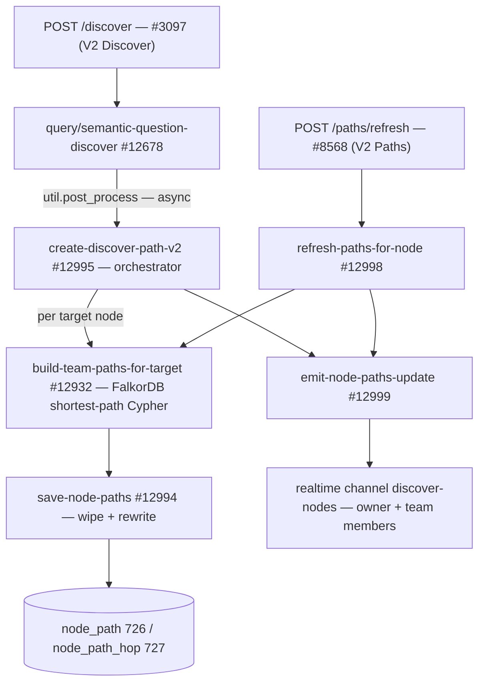

This page documents the **paths pipeline** in Xano workspace 3 (`OrbiterV2`) — the system that answers "**how am I (or my team) connected to this entity?**" for every node a Discover run surfaces. For each entity referenced by a discover (response nodes, context nodes, and per-question nodes), the pipeline computes the shortest **non-geographic** path through the FalkorDB knowledge graph from each team member's `master_person` node, persists the result in the normalized `node_path` / `node_path_hop` tables, and streams per-row realtime updates so the UI can render relationship trails as they land.

<Note>
  **v2 is the current pipeline.** The original v1 orchestrator (`mvp/paths/create-discover-path` **#12931**) wrote a `team_paths` JSON blob onto each `discover_*_node` row's `paths` column. v2 replaced that with the relational `node_path` \+ `node_path_hop` tables, per-row `paths_processing` flags, and realtime pushes. #12931 has **no remaining callers**; the `paths` JSON columns on the four node tables are legacy remnants that v2 never writes.
</Note>

## Architecture



## Components

| Function | ID | Role |
| --- | --- | --- |
| `mvp/paths/create-discover-path-v2` | #12995 | Orchestrator — resolves path sources, walks all four `discover_*_node` tables for the discover, and drives compute → save → emit per row |
| `mvp/paths/build-team-paths-for-target` | #12932 | Pathfinding — builds and runs the FalkorDB shortest-path Cypher for one target, returns the `team_paths` array (sorted by `total_weight` ascending) |
| `mvp/paths/save-node-paths` | #12994 | Persistence — idempotent wipe-and-rewrite of `node_path` \+ `node_path_hop` for one `(user_id, target_node_uuid)` pair |
| `mvp/paths/emit-node-paths-update` | #12999 | Delivery — flips the row's `paths_processing` back to `false` and broadcasts the saved paths on the `discover-nodes` realtime channel |
| `mvp/paths/refresh-paths-for-node` | #12998 | Single-node re-compute within a discover (user-triggered via `POST /paths/refresh`) |
| `mvp/paths/create-discover-path` | #12931 | **Legacy v1** — JSON-on-row writer; superseded, no callers |

## Entry points

1. **Discover runs (the main path).** `POST /discover` **#3097** (V2 Discover group) runs `query/semantic-question-discover` **#12678**, which — inside its `util.post_process` block, after the discover answer is persisted and the processing flags are cleared — kicks off `create-discover-path-v2` #12995 **asynchronously**. One call covers both the new-discover case and the follow-up-question case, because #12995 walks discover-direct _and_ question-scoped rows for the given `discover_id`.
2. **Manual refresh.** `POST /paths/refresh` **#8568** (the **V2 Paths** API group's only endpoint, `auth = user`, owner-only precondition) → `refresh-paths-for-node` #12998 for one `(discover_id, node_uuid)`.
3. **Collections — wired but disabled.** `collection-questions` **#8007** contains a `!function.run` (disabled) call to #12995, so collection questions currently do **not** compute paths; `collections/discover` **#8730** likewise copies discover context nodes into collections **without** paths columns.

## What `create-discover-path-v2` (#12995) does, step by step

1. **Load the discover** (`discover` 564 → `id`, `user_id`, `team_id[]`) with an addon chain `user → master_person` to get the owner's `node_uuid`, `name`, `avatar`.
2. **Build the team roster** — for each `team_id`, query `team_member` 614 with the same `user → master_person` addon chain.
3. **Build the source list `$paths`** — owner first, then team members, deduped by `master_person_id` (a lambda). A second lambda builds `$source_team_map` (`node_uuid → team_id`, owner → `0`).
4. **Stamp the discover** — `db.edit discover` sets `path_keys` to the source roster, so the FE knows whose paths to expect.
5. **Walk the four node tables** — `discover_response_node` 567 and `discover_context_node` 572 by `discover_id`; then every `discover_question` 566 and its `discover_question_context_node` 592 \+ `discover_question_response_node` 565 rows. For each row:
   - Extract the **target uuid**: first non-null of `person_node_uuid` → `company_node_uuid` → `funding_round_uuid` → `film_tv_uuid` → `film_tv_award_uuid` → `live_event_node_uuid` (rows with none are skipped).
   - Set the row's `paths_processing = true`.
   - `build-team-paths-for-target` #12932 → `team_paths`.
   - Enrich each entry with its `team_id` from `$source_team_map` (owner = `0`).
   - `save-node-paths` #12994 (persists under the **discover owner's** `user_id`).
   - `emit-node-paths-update` #12999 (flips the flag back and broadcasts).
6. **Respond** with per-table result summaries (`row_id`, `target_node_uuid`, `team_paths`, `save_result`).

## The pathfinding Cypher (#12932)

`build-team-paths-for-target` assembles the query in a lambda (sources are the owner \+ team `node_uuid`s, minus the target itself) and runs it through `mvp/falkor/send-cypher`:

```cypher
MATCH (target:Entity {uuid: '<target_node_uuid>'})
MATCH (source:Entity)
WHERE source.uuid IN ['<owner uuid>', '<member uuid>', …]
MATCH p = (source)-[*1..4]-(target)
WHERE NONE(node IN nodes(p)[1..-1] WHERE node['display_label'] IN
        ['City', 'Region', 'Country', 'State', 'Continent', 'Location'])
  AND NONE(rel IN relationships(p) WHERE type(rel) IN
        ['LOCATED_IN', 'IN_REGION', 'IN_CITY', 'IN_COUNTRY', 'IN_STATE',
         'HEADQUARTERED_IN', 'HEADQUARTERS_IN', 'BASED_IN', 'LIVES_IN',
         'BORN_IN', 'FROM_LOCATION', 'HAS_LOCATION', 'HAS_EXPERTISE'])
WITH source, p, length(p) AS hops
ORDER BY hops ASC
WITH source, head(collect(p)) AS p
RETURN
  source['uuid'] AS source_uuid,
  length(p) AS hops_count,
  [node IN nodes(p) | {node_uuid: node['uuid'], name: node['name'],
    display_label: node['display_label'], avatar: node['avatar'], logo: node['logo']}] AS path_nodes,
  [rel IN relationships(p) | {type: type(rel), weight: rel['weight'],
    description: coalesce(rel['description'], rel['fact'])}] AS edges,
  reduce(total = 0, rel IN relationships(p) | total + coalesce(rel['weight'], 0)) AS total_weight
```

Key properties:

- **Undirected, 1–4 hops**, shortest path per source (fewest hops wins; `head(collect(p))` after `ORDER BY hops ASC`).
- **Geo and shared-expertise exclusion** — intermediate nodes may not be geographic (`City`/`Region`/`Country`/`State`/`Continent`/`Location`), and no edge on the path may be a location edge or `HAS_EXPERTISE` — so neither "you both live in LA" nor "you both list the same expertise" counts as a connection.
- **`total_weight` = sum of edge weights — lower is closer** (see [Edge Weights](/guides/ontology/edge-weights)); a post-processing lambda zips `path_nodes` \+ `edges` into `hops` and sorts the final array by `total_weight` ascending.

Output shape (one entry per source, unreachable sources keep `path: null`):

```json
[
  {
    "master_person_id": 123,
    "node_uuid": "<source uuid>",
    "name": "Mark Pederson",
    "avatar": "https://…",
    "team_id": 0,
    "path": {
      "hops_count": 2,
      "total_weight": 35,
      "hops": [
        {
          "from": { "node_uuid": "…", "name": "…", "display_label": "Person", "avatar": "…", "logo": null },
          "to":   { "node_uuid": "…", "name": "…", "display_label": "Company", "avatar": null, "logo": "…" },
          "edge": { "type": "WORKS_AT", "weight": 15, "description": "…" }
        }
      ]
    }
  }
]
```

(`team_id` is added by the orchestrator from `$source_team_map`, not by #12932 itself.)

## Persistence — `save-node-paths` (#12994)

Idempotent **wipe-and-rewrite** keyed on `(user_id, target_node_uuid)`: existing `node_path` rows for the pair are deleted (each with a `db.bulk.delete` of its `node_path_hop` children), then one `node_path` row per reachable source is inserted with its ordered hops. Entries with `path: null` or zero hops are **not** persisted — absence of a row means "no path found". Team members' paths are stored under the **discover owner's** `user_id`, with the member's team preserved in `node_path.team_id`.

### `node_path` — table 726

| Column | Type | Notes |
| --- | --- | --- |
| `id` | int | PK |
| `user_id` | int | The discover owner the path set belongs to |
| `team_id` | int | Source's team (`0` = the owner themself) |
| `source_node_uuid` | text | The team member's `master_person` graph node |
| `target_node_uuid` | text | The entity the discover surfaced |
| `hops_count` | int | Path length |
| `total_weight` | int | Sum of edge weights — lower = closer |
| `created_at` / `updated_at` | timestamp |  |

### `node_path_hop` — table 727

| Column | Type | Notes |
| --- | --- | --- |
| `id` | int | PK |
| `node_path_id` | int | FK → `node_path` |
| `hop_index` | int | 0-based position along the path |
| `from_node_uuid` / `to_node_uuid` | text | Hop endpoints |
| `edge_type` | text | e.g. `WORKS_AT`, `INVESTED_IN` |
| `edge_weight` | int |  |
| `edge_description` | text | `coalesce(description, fact)` from the graph edge |
| `created_at` | timestamp |  |

`save-node-paths` #12994 is the **only writer** of both tables; nothing else edits or deletes them outside its wipe.

## Realtime delivery — `emit-node-paths-update` (#12999)

Called once per processed row. It:

1. Flips that row's `paths_processing` to `false` on whichever of the four `discover_*_node` tables it lives in.
2. Queries `node_path` twice — `target_node_uuid = person_node_uuid` and `= company_node_uuid` (both scoped to the discover owner's `user_id`, sorted `total_weight desc`) — with the `node_path_hop:node_path_id` addon plus `master_person` 139 / `master_company` 142 addons hydrating every hop endpoint, source, and target.
3. Broadcasts on the **`discover-nodes`** channel (`mvp/realtime/send-realtime`, type `Update`) to the discover owner **plus every member of every team the discover is shared with**:

```json
{
  "discover_id": 42,
  "table": "discover_response_node",
  "row_id": 1234,
  "discover_question_id": null,
  "paths_processing": false,
  "paths_to_person": [ /* node_path rows + hydrated node_path_hops */ ],
  "paths_to_company": [ /* same shape */ ]
}
```

The FE patches the matching row by `(table, row_id)`.

## Refreshing a single node — #12998 / `POST /paths/refresh` #8568

`refresh-paths-for-node` re-computes one target inside one discover: it resolves the owner \+ team sources exactly like #12995, marks **every row that references the `node_uuid`** (matched across the uuid columns of all four node tables) `paths_processing = true`, runs **one** `build-team-paths-for-target` → `save-node-paths` for the target, then calls the emit helper once per affected row. The endpoint requires auth and rejects callers who don't own the discover.

## How the FE reads paths

- **Realtime** — the `discover-nodes` payloads above patch rows in place as paths land.
- **On load** — `GET /discover-nodes` **#3068** and `GET /discover-context-nodes` **#3070** (V2 Discover) hydrate each row's paths via the `node_paths:node_uuid:user_id` addon with the nested `node_path_hop:node_path_id` \+ `master_person`/`master_company` addons — the same shape as the realtime payload.

## Tables read & written

| Table | ID | Role |
| --- | --- | --- |
| `discover` | 564 | Read for owner \+ `team_id[]`; **updated** — `path_keys` set to the source roster |
| `team_member` | 614 | Source roster (one row per team member) |
| `user` | 125 | Joins user → master\_person |
| `master_person` | 139 | Supplies source `node_uuid`/`name`/`avatar`; hydration addon on reads |
| `master_company` | 142 | Hydration addon on reads (hop endpoints that are companies) |
| `discover_question` | 566 | Enumerates per-question node rows |
| `discover_response_node` | 567 | **Updated** — `paths_processing` flag |
| `discover_context_node` | 572 | **Updated** — `paths_processing` flag |
| `discover_question_context_node` | 592 | **Updated** — `paths_processing` flag |
| `discover_question_response_node` | 565 | **Updated** — `paths_processing` flag |
| **`node_path`** | 726 | **Written** — one row per (source → target) path |
| **`node_path_hop`** | 727 | **Written** — one row per hop, ordered by `hop_index` |

## Notes for developers

- **Music nodes are not path targets yet.** The target-uuid extraction covers person / company / funding-round / film-TV / award / live-event columns; the `music_group_uuid` / `music_artist_uuid` / `music_recording_uuid` columns on `discover_question_context_node` are ignored by #12995.
- **Collections don't compute paths** — the #8007 call to #12995 is present but disabled (`!function.run`); enable it there if collection questions should get trails.
- **Ownership model** — all rows are keyed to the discover owner's `user_id`, not each member's; a member's own discovers get their own rows. `node_path.team_id` records which team a source came from.
- **Weights sort ascending** — `total_weight` uses the [lower-is-closer convention](/guides/ontology/edge-weights); the strongest trail is the smallest number.
- Older comments reference an endpoint `#8558` returning this shape — it no longer exists; #3068/#3070 \+ the realtime payload are the read surfaces.