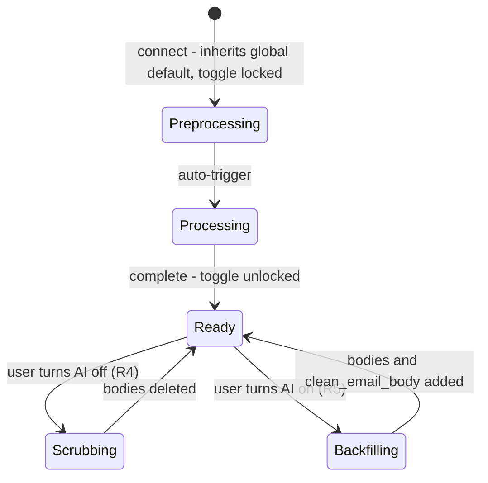

This page anchors a fresh-lens review of all AI processing for email. Before redesigning anything, this is the complete inventory of what exists today: every Xano function that runs an LLM against email content, the deterministic neighbors around them, where their output lands, and what triggers them.

<Info>
  Surveyed 2026-07-22 from the live XanoScript bodies in workspace `3`. Each section's *Existing functions* subsection and the at-a-glance table record current behavior (reference only); the Requirements section is the forward-looking spec for the rebuild. The full summarizer prompt lives on [Email Pipeline → LLM System Prompts](/guides/enrichment/email/llm-system-prompts); the Mem0 suite has its own deep reference at [mem0 Functions](/guides/open-work/mem0/functions).
</Info>

<Note>
  **Changes applied 2026-07-22 during this review:** removed the hardcoded Nylas key from #10518 (published \+ byte-verified). `clean-convo/llm_clean_messages` was deleted as deprecated and then restored the same day — it now lives at **#13269** with a byte-identical body (the original #2363 id and its Xano version history are unrecoverable), and the #189 per-message clean loop was restored byte-exact. Also applied 2026-07-22: a forward-exclusion guard in the signature parsers (deterministic truncation at forward markers plus a prompt rule, see R6), and the signature monolith #4645 was retired — deleted, with its call site removed from parse helper #12773. The split pair #10518/#10519 is the single signature implementation. The scheduling_link dedup gap was closed the same day (email_address column \+ unique index; #10519/#10517 updated).
</Note>

## Terminology

Shared vocabulary for this page — requirements and design discussions use these terms exactly.

| Term | Meaning |
|---|---|
| `clean_email_body` | An LLM-cleaned email body — no salutation, no signature. |
| `Global AI Email Toggle` | The single **Enable AI Features** toggle at the top of the account-connection UI. The default state for AI email processing (default: true). See R1. |
| `Per Account AI Email Toggle` | The toggle on each connected email account row. Initialized to mirror the Global AI Email Toggle at connect time; overridable per account, and the override wins for that account. See R1/R3. |
| `AI Processing Depth` | A system-based parameter — not changeable by the user. Default: **90 days**. The depth of email bodies within which each message is cleaned and each thread is summarized. |
| `preprocessing` | Creating the import and email count tables. |
| `processing` | Looping through the import table and adding and updating the people in the graph and creating contacts for the user. |

## Requirements

Forward-looking spec for the rebuild, numbered for reference. The per-section *Existing functions* references below are the as-is baseline.

### R1 — AI Features toggles: global default + per-account override

- A single **Enable AI Features** toggle sits at the top of the user account interface where accounts are connected. **Default: true.** It is the global *default state* for AI email processing, not a hard switch.
- When an email account is connected, the account inherits the global state at that moment; once the account appears in the UI, it carries its **own toggle, initialized to mirror that inherited state** and overridable per account (the override wins for that account).
- **State is captured at connect time.** The captured state governs the entire import; changing the global toggle never affects an in-flight import.
- **A Global flip affects future connections only.** Existing accounts' Per Account AI Email Toggles never change implicitly — changing an existing account is always an explicit per-account action.
- Backing today: the per-account toggle maps to `nylas_grant.ai_enabled`. The global default is new — a user-level setting.

### R2 — Import pipeline: what the AI state changes

An email account import runs in two stages, as defined in [Terminology](#terminology): **preprocessing** (create the import and email count tables), then **processing** (loop the import table, add and update people in the graph). **Processing is triggered automatically when preprocessing finishes.**

The account's captured AI state changes only the body-related work, and all of it happens during preprocessing:

| AI state at connect | Preprocessing | Processing |
|---|---|---|
| **On** (default) | Email bodies are saved; every message within the **AI Processing Depth** (default 90 days) is cleaned to a `clean_email_body` and every thread within the depth is summarized; signatures are extracted. | Unchanged — graph work is AI-independent. |
| **Off** | No email bodies are saved, no emails are cleaned, no signatures are extracted. | Unchanged — graph work is AI-independent. |

### R3 — Toggle lifecycle and locking

The per-account toggle is **locked** from the moment the account connects until processing completes — rendered **disabled with a status label** ("finishing import…", "scrubbing…", "backfilling…"), never hidden — the user has no chance to diverge from the inherited default mid-import. Only once processing is complete is the toggle presented, and the user may reverse the choice:

- **On → off** triggers the scrub API (R4).
- **Off → on** triggers the backfill API (R5).

The same lock applies while R4 or R5 runs: the toggle is locked whenever any body-mutating job — import, scrub, or backfill — is running for the account. **Hard requirement:** one per-account job lock (at most one body-mutating job runs at a time per account), and every job is idempotent and resumable after failure.



### R4 — AI-off scrub API

Turning AI features **off** on a completed account is not just a flag flip: a **separate, dedicated scrub/delete API** runs immediately and deletes, for that account, **every `clean_email_body` and every saved raw email body**.

Success criterion: after the scrub, the account's stored data is indistinguishable from an account originally imported with AI off.

**Scope:** the scrub deletes **user-scoped artifacts only** — raw bodies, `clean_email_body`, the signature JSON on import records, thread summaries, and account-derived Mem0 memories. Signature-derived enrichment already written to shared person/company records (work rows, links, phone, companies) is not touched.

### R5 — AI-on backfill API

The reverse path: the account was imported and processed with AI **off** (email events exist, but no bodies were saved), and the user then turns AI **on**. A **separate backfill API** works from the **existing email events** for that account and **adds** the raw email body and `clean_email_body` for each.

**Scope: full AI-on parity, bounded by the AI Processing Depth (default 90 days).** For each email event within the depth, the backfill adds the raw body and `clean_email_body`, runs signature extraction, and generates thread summaries — everything AI-on preprocessing would have produced.

Success criterion: after the backfill, the account is indistinguishable from an account originally imported with AI on. Backfill is necessarily best-effort — messages deleted upstream since the import cannot be re-fetched.

### R6 — Forwarded emails are excluded from signature extraction

Signature parsing must never read a signature from inside forwarded content: an email forwarded by the contact carries someone else's signature in the forward block, and attributing it to the contact writes wrong data onto person records. Each message is truncated at the first forward marker before any model call, and the model is instructed to return `signature_found: false` rather than use a forwarded signature. (Already enforced in the current system — #4645/#10518.)

### R7 — Signature extraction lives on the user side; JSON stored on import records

Signature extraction runs on the user side as part of the user's own import pipeline, and the extracted signature JSON is stored on the user's **import (input) records** — not on shared person records. Today it lands in `person_enrich_data.email_signature`, which is shared across users; that moves. This makes signature data account-scoped, so the R4 scrub can delete it cleanly.

**Booking-link table:** a signature's `calendar_url` (booking links only — calendar-*event* links are rejected by the prompt) lands in `scheduling_link` (table 601): `master_person_id` → `master_person`, plus `scheduling_url`. It is person-scoped shared enrichment, so it survives the R4 scrub. Dedup key: **`email_address`** — only one signature is ever extracted per email address, so one booking link per address. Closed 2026-07-22: an `email_address` column and unique index were added to the table, #10519 exists-checks by address before insert and stores it, and caller #10517 passes the address through. This write happens in the **processing** phase.

### R8 — Email tone saved on import records, joined at contact creation

The sent-email tone profile is saved to a **field on the import table** record during the import. Later, during **processing**, when the contact is created for the user, the tone is saved to the **email tone join table** (today `email_draft_tone`, keyed by `contacts_id`). Same pattern as R7: capture user-side onto import records first, apply to the durable join table at contact-creation time. (As-is today: the tone stage lives inside the Mem0 extractor #13149 as an optional `run_email_tone` pass that writes `email_draft_tone` directly.)

### R9 — Unified thread AI pass

All thread-level AI work — summaries, Mem0 memory extraction, and tone harvesting — runs as **one pass per thread**, not per contact:

- **Unit of work: the thread.** One pass produces the summary (in-window), memory candidates for **every resolvable participant** with per-subject attribution (a thread with two contacts yields memories for both from a single process), and sent-sample harvesting for tone corpora.
- **Thread ledger.** Per `(grant_id, thread_id)`: latest message id \+ message count, stage stamps (`summarized_at`, `memories_extracted_at`, `tone_harvested_at`), and prompt/model versions. A thread re-enters the pass only when its message set changes or a prompt/model version bumps. Mem0's hash / `run_id` duplicate checks remain the last line of defense, not the first.
- **Transcript source: staged bodies.** The pass reads the import store (raw bodies \+ `clean_email_body`), never Nylas. Nylas is touched only by the lazy full-history deep pass and, later, the deferred webhook path.
- **Depth split.** In-window threads (within the AI Processing Depth): the summary call also emits a `memory_worthy` flag \+ reason, replacing the standalone prefilter; extraction runs only on worthy threads. Out-of-window threads (full history): no summary; deterministic cleaning of staged raw bodies feeding the cheap prefilter → extract chain.
- **Memory triggers.** Extraction runs automatically within the AI Processing Depth as part of the import. A contact's **full history** extracts lazily the first time that contact's memories are opened; the ledger prevents rework.
- **Capture-then-apply sequencing.** Preprocessing stages everything user-side: per-address artifacts on the **import table** (signature JSON per R7, tone per R8); per-thread artifacts on the **email_events / thread ledger** (summary, `memory_worthy`, candidates keyed `(thread_id, participant_email)`). Processing creates or resolves each contact from its import record and **only then** sends that address's candidates to Mem0 with the real `contacts_id` \+ `master_person_id` (`participant_email` carried in metadata). Mem0 is never written before the contact exists, and the R4 scrub deletes staged candidates like any other user-side artifact.

<Warning>
  **MEM0 IS NEVER TOUCHED BEFORE THE PROCESSING STAGE.** No Mem0 API call of any kind happens during preprocessing — no writes, no reads, no provisional records. Preprocessing only **stages candidates locally**. The first and only Mem0 interaction is the send at contact **create-or-resolve** during processing, with the real `contacts_id` \+ `master_person_id`.

  **Where they're staged:** as candidate records on the **email_events / thread ledger** side, keyed `(thread_id, participant_email)`. A memory about multiple participants fans out to one staged record per attributed participant, sharing one `canonical_memory_hash`. Illustrative shape — two staged memories from one thread (exact columns land in the AlloyDB schema-design pass):

  ```json
  [
    {
      "thread_id": "19e4c1a919f3b12c",
      "participant_email": "jason@diamondbros.com",
      "memory": "Jason Diamond agreed to a larger team demo of Orbiter after the May meeting.",
      "category": "meeting_commitment",
      "confidence": 0.95,
      "event_date": "2026-05-26",
      "canonical_memory_hash": "sha256:2f92dd61…",
      "status": "staged",
      "sent_at": null,
      "mem0_memory_id": null
    },
    {
      "thread_id": "19e4c1a919f3b12c",
      "participant_email": "josh@diamondbros.com",
      "memory": "Jason and Josh Diamond attended the Orbiter team demo on 2026-05-20.",
      "category": "meeting_history",
      "confidence": 1,
      "event_date": "2026-05-20",
      "canonical_memory_hash": "sha256:8a41c07b…",
      "status": "staged",
      "sent_at": null,
      "mem0_memory_id": null
    }
  ]
  ```

  The second memory is a shared one — Jason's copy is a separate staged record with the **same** `canonical_memory_hash` and his `participant_email`. At contact create-or-resolve, the record's `status` flips to `sent`, `sent_at` and `mem0_memory_id` are recorded, and the memory is written to Mem0 with `contacts_id` \+ `master_person_id` (`participant_email` carried in metadata).
</Warning>

<Note>
  Early Mem0 writes under provisional email\+user keys were considered and rejected: the contact read path is `contacts_id`-keyed (early writes are unreadable until patched), patching costs the same number of API calls as sending at creation, and addresses that never become contacts would leave orphan memories. Open implementation detail: candidate staging as explicit rows keyed `(thread_id, participant_email)` (leaning) vs. a JSON array on the event record.
</Note>

<Note>
  **Schema design prerequisite:** the `import table`, `email_events` / thread ledger, and candidate-staging shapes must be checked and planned against the **existing tables in AlloyDB** before anything is built — extend what the Go side already has rather than minting parallel shapes. Starting points: the Log \& Parse 2.0 [`email_account_import` contract](/guides/open-work/log-parse-refactor/process-email-account-import) and the [Backend Refactor Tables](/guides/open-work/backend-refactor-tables) target shapes. This pass is also where the deferred Terminology definitions (`import table`, `email count tables`, `email_events`) get pinned.
</Note>

<Info>
  **Deliberately out of scope for now: the live webhook path** (new mail arriving after import). It gets scoped only after this import-side rebuild is deployed and tested.
</Info>

## Signature extraction

### Existing functions — for reference only

| ID | Function | Job | Model (all via OpenRouter) | Runs today from |
| --- | --- | --- | --- | --- |
| 10518 | `mvp/signature/email-signature-email-import` | Fetch \+ LLM-parse signature only, stateless | `moonshotai/kimi-k2.6` | account import, first-time contacts (async) |
| 10519 | `mvp/signature/email-signature-process-only` | Apply a stored signature JSON (no LLM) | — | import/historical follow-up |

The split-stage pair is the single implementation: #10518 is the stateless fetch\+parse half for the import pipeline (its caller #10517 persists the JSON); #10519 is the enrich half that consumes stored JSON later. The former monolith #4645 (fetch → parse → store → enrich in one call, wired to inbound parse helper #12773) duplicated both halves and was retired 2026-07-22 — deleted, call site removed; inbound signature extraction returns with the deferred webhook path, via this same pair. The LLM parser truncates every message at the first forward marker (`Forwarded message`, `Begin forwarded message:`, entity-encoded `From:` headers) before the model call and carry an explicit prompt rule — a forwarded email's inner signature is never attributed to the contact.

**Current model (#10518):**

```text
moonshotai/kimi-k2.6
```

**Current system prompt (#10518 — includes the R6 forward rule; `{{$var.body}}` is the extracted message content):**

<Accordion title="Full system prompt — click to expand">

```text
Extract email signature contact info. Return ONLY valid JSON.

## Output Schema
{"signature_found":bool,"name":str|null,"title":str|null,"company":str|null,"company_website":str|null,"company_domain":str|null,"phone":{"e164":str,"local":str,"country_calling_code":str}|null,"person_social_links":[],"company_social_links":[],"calendar_url":str|null}

## Rules
- **Signature location**: After sign-offs (Best, Thanks, Regards, Cheers, etc.) near end of email
- **name**: Sender's full name from signature block. IGNORE greeting names ("Hi John" = recipient)
- **title**: Job title (CEO, VP Sales, Founder, etc.). Often separated by "|" or "-" from company
- **company**: Organization name, usually paired with title
- **company_website**: URL matching company domain from ---LINKS--- or text
- **company_domain**: Clean domain extracted from company_website
  - Remove protocol (http://, https://)
  - Remove www. prefix
  - Remove trailing slashes and paths
  - Example: "http://www.grantdrivegroup.com/" → "grantdrivegroup.com"
  - Return null if no company_website found
- **phone**: When found, format as object with three properties:
  - **e164**: International E164 format starting with + (e.g., "+16462959070")
  - **local**: Country-specific display format (e.g., "(646) 295-9070" for US)
  - **country_calling_code**: The country code with + prefix (e.g., "+1", "+44", "+972")
  - Extract from any phone with/without labels (Mobile:, Cell:, Tel:, M:, P:)
  - Process ANY input format (spaces, hyphens, parentheses, dots, plus signs)
  - Strip all non-numeric characters except leading plus
  - Identify country code through pattern matching
  - Apply country-specific formatting rules:
    - US/Canada (+1): (XXX) XXX-XXXX
    - UK (+44): 0XXXX XXXXXX or 0XX XXXX XXXX
    - Germany (+49): 0XXX XXXXXXXX
    - France (+33): 0X XX XX XX XX
    - Japan (+81): 0XX-XXXX-XXXX
    - Australia (+61): 0X XXXX XXXX
    - Israel (+972): 0XX-XXX-XXXX
  - Default to US (+1) for ambiguous 10-digit numbers
  - Return null if invalid (<7 or >15 digits, invalid country code)
- **person_social_links**: Array of PERSONAL social media URLs from ---LINKS---:
  - LinkedIn: linkedin.com/in/[username]
  - Twitter/X: twitter.com/[handle] or x.com/[handle] (individual accounts)
  - Facebook: facebook.com/[username] or facebook.com/people/[name]
  - Instagram: instagram.com/[username] (personal accounts)
  - YouTube: youtube.com/@[username] (personal channels)
- **company_social_links**: Array of COMPANY/ORGANIZATION social media URLs from ---LINKS---:
  - LinkedIn: linkedin.com/company/[name]
  - Twitter/X: twitter.com/[handle] or x.com/[handle] (company accounts)
  - Facebook: facebook.com/[company] or facebook.com/pages/[company]
  - Instagram: instagram.com/[company] (business accounts)
  - YouTube: youtube.com/c/[company] or youtube.com/channel/[id] (company channels)
- **calendar_url**: CALENDAR: URL from ---LINKS--- — ONLY booking links, NOT event links. Booking links let you schedule (calendly.com/username, cal.com/username). Event links are for specific meetings (contain /events/, /booking/, /scheduled/) — IGNORE those.

## Social Link Classification
- LinkedIn: /in/ = person, /company/ = company
- Facebook: /people/ = person, /pages/ or /business/ = company
- YouTube: /@username = person, /c/ or /channel/ = company
- Twitter/Instagram: Use context (matches sender name = person, matches company name = company)
- When ambiguous: Default to person_social_links

## Return signature_found: false when:
- Automated/transactional emails (invoices, receipts, notifications, shipping)
- No personal signature block exists
- Only company branding, no personal contact info

## Edge Cases
- Reply chains: Extract ONLY the first/top signature (the sender's), ignore quoted signatures
- Forwarded emails: NEVER extract a signature from inside forwarded content (after "Forwarded message", "Begin forwarded message", or "Original Message" markers) - that signature belongs to someone else. If the only signature is inside forwarded content, return signature_found: false
- "Sent from iPhone/Superhuman": Not a real signature, look for actual contact block above it
- Multiple names: The signature name comes AFTER the sign-off, not in the body
- Partial signatures: Extract what's available, null for missing fields
- Calendar event links: Links like calendly.com/events/xxx are NOT booking links — return null for calendar_url

## Do NOT:
- Hallucinate or infer missing info
- Extract from email disclaimers/legal text
- Return empty strings (use null)

## Example Outputs

US Number:
{"signature_found":true,"name":"John Smith","title":"CEO","company":"Acme Corp","company_website":"https://www.acme.com","company_domain":"acme.com","phone":{"e164":"+16462959070","local":"(646) 295-9070","country_calling_code":"+1"},"person_social_links":["https://linkedin.com/in/johnsmith"],"company_social_links":["https://linkedin.com/company/acme-corp"],"calendar_url":"https://calendly.com/jsmith"}

Israeli Number:
{"signature_found":true,"name":"David Cohen","title":"Director","company":"Tech Israel","company_website":"https://www.techisrael.com","company_domain":"techisrael.com","phone":{"e164":"+972524664917","local":"052-466-4917","country_calling_code":"+972"},"person_social_links":[],"company_social_links":[],"calendar_url":null}

RESPOND WITH ONLY RAW JSON. NO MARKDOWN. NO BACKTICKS. NO EXPLANATION.
START WITH { END WITH }

INPUT:
{{$var.body}}
```

</Accordion>

<Card icon="cloud-arrow-up">
  ```text
  mvp/signature/email-signature-email-import — 10518
  ```

  **Stateless fetch \+ parse half** for the email-account-import flow. Same Nylas fetch and byte-identical kimi-k2 prompt as #4645, hardened with a whole-body `try_catch` (returns `{}` on failure) and a 180s LLM timeout for bulk runs. No DB reads/writes, no processed marker — the header comment claiming one is stale; the caller persists the result.
</Card>

<Card icon="wrench">
  ```text
  mvp/signature/email-signature-process-only — 10519
  ```

  **Enrich half, no LLM.** Takes `master_person_id`, reads the stored `person_enrich_data.email_signature`, skips when `processed: true` or `signature_found: false`, applies the same enrichment writes as #4645 (phone, links, `scheduling_link` — without the dedup check — and the company/work block), then stamps `processed: true` back onto the JSON.
</Card>

<Card icon="database">
  ```text
  scheduling_link — 601
  ```

  **Booking-link table (person-scoped, shared).** Where the enrich half writes a parsed signature's `calendar_url`: `master_person_id` (→ `master_person`) \+ `scheduling_url`. The prompt admits booking links only (calendar-*event* links return null). Unique by **`email_address`** (added 2026-07-22 — one signature per email address): #10519 exists-checks by address before insert and stores the source address, with #10517 passing it through. Legacy rows predate the column (null address). Used in the **processing** phase.
</Card>

## Body cleaning (clean-convo family)

### Existing functions — for reference only

| ID | Function | Job | Model (all via OpenRouter) | Runs today from |
| --- | --- | --- | --- | --- |
| 13269 | `clean-convo/llm_clean_messages` | Route to a cleaner, store `clean_message` | none — delegates | historical parse #189 (recreated 2026-07-22; was #2363) |
| 4647 | `clean-convo/clean-email-body` | Clean one email body (reply/plain) | `openai/gpt-5-nano` | via #13269 |
| 12648 | `clean-convo/clean-email-body-forward` | Clean a forwarded email body | `openai/gpt-5-nano` | via #13269 — forward branch never actually routed, see observations |

Three functions. The two cleaners are pure transform-and-return — all storage happens in the orchestrator, which was briefly deleted during this review and recreated byte-identical as #13269 (it was #2363 at survey time; Xano ids are not restorable). Both cleaners run a deterministic JS pre-clean first (quoted-reply chains, signature markers, mobile sign-offs, tracking images, legal disclaimers, empty containers) and then send the survivor to the LLM for a final polish.

<Card icon="play">
  ```text
  clean-convo/llm_clean_messages — 13269
  ```

  **Entry point \+ writer** (recreated 2026-07-22, originally #2363). Takes `body`, `message_id`, `user_id`. A lambda checks for forward markers (`---------- Forwarded message ----------`, `Begin forwarded message:`) and routes to the forward cleaner or the base cleaner, then writes the returned string onto **every** `email_activity` row matching `(user_id, message_id)` as `clean_message`. Returns `"success"`. No LLM of its own, no processed-guard — every call recleans.
</Card>

<Card icon="cloud-arrow-up">
  ```text
  clean-convo/clean-email-body — 4647
  ```

  **Base cleaner.** Regex pre-clean lambda (Apple/Gmail signature blocks, `On … wrote:` headers, blockquotes, `display:none` divs, trailing sign-off divs, 3\+ `br` collapse, `[No message content]` fallback), then `openai/gpt-5-nano` — temperature 0, `max_tokens` 8192, reasoning effort minimal, `data_collection: deny`. Static system prompt (cacheable prefix) with the body as the user message; 11 ordered cleanup tasks plus 7 few-shot examples; output is flattened single-`div` HTML. Returns the LLM string, stores nothing, no error handling on the call.
</Card>

<Card icon="cloud-arrow-up">
  ```text
  clean-convo/clean-email-body-forward — 12648
  ```

  **Forward variant — standalone near-clone of #4647**, not a wrapper. Pre-clean splits on the earliest forward marker, strips `From/Date/Subject/To/Cc:` header lines from the forwarded content, and scrubs the forwarder's own note above the marker into `new_text` — which is then discarded (only `cleaned_body` reaches the LLM). Identical LLM config to #4647 with a forwarded-email framing and 3 few-shot examples.
</Card>

## Email Thread Summary & mem0 Memories

### Existing functions — for reference only

| ID | Function | Job | Model (all via OpenRouter) | Runs today from |
| --- | --- | --- | --- | --- |
| 12644 | `mvp/activity/email-llm-summary` | Thread → summary/bullets/sentiment/actions JSON | `google/gemini-3.1-flash-lite-preview` | historical parse #189 only — live webhook chain no longer calls it |
| 13149 | `mem0/create-memories-from-contact-id-v2` | Email threads \+ calendar → private Mem0 memories | `deepseek/deepseek-v4-flash` (\+ `anthropic/claude-opus-4.8` tone stage) | user-triggered, dry-run default |
| 13146 | `mem0/create-memories-from-contact-id` | Same plus inline graph-edge stage | same | user-triggered — source of the v2 split |
| 13145 | `mem0/create-memories-from-email-threads-v2` | Legacy combined graph \+ email \+ tone | `deepseek/deepseek-v4-flash` | superseded |

**What calls #12644 today, and when:** the only live caller (verified 2026-07-22 against the function bodies) is the historical import — `mvp/activity/nylas-history-parse` (#189), Phase 4. After a grant's sent/received threads are parsed, #189 collects that user's `email_activity` rows from the **last 30 days**, de-dupes their `thread_id`s (draft IDs stripped), and calls #12644 once per unique thread inside a skip-on-failure loop, upserting `email_ai_summary` per `(grant_id, thread_id)` — re-running refreshes the summary. The `message.created` webhook chain no longer dispatches it, so no summaries are generated for ongoing mail today.

**Raw Nylas, not cleaned bodies:** the summarizer does **not** read stored `clean_message` / cleaned email bodies. It re-fetches up to 50 messages for the thread **directly from Nylas** and cleans the raw response with its own inline lambda (HTML/script/tracking strip, quoted-reply and signature cuts) before YAML-encoding the transcript into the prompt. Every summary is therefore a fresh Nylas fetch plus an independent re-clean, even when cleaned bodies already exist for those same messages (First-pass observations, items 4–5).

<Card icon="play">
  ```text
  mvp/activity/email-llm-summary — 12644
  ```

  **The email AI summary.** Takes `email_thread_id` \+ `grant_id`, pulls up to 50 messages for the thread straight from Nylas, cleans them with its **own inline lambda** (it does not reuse the clean-convo cleaners or stored `clean_message`), YAML-encodes the transcript into the `// v1` prompt, and calls `google/gemini-3.1-flash-lite-preview` — temperature 0.1, `max_tokens` 600, `response_format: json_object`, `data_collection: deny`. Output schema: `summary` (one sentence, ≤15 words), `bullet_points` (5–8), `sentiment` (`positive`/`negative`/`mixed`/null), `action_items` (`[Name] — commitment`). A second lambda regex-extracts deduped links and merges them in.

  Upserts `email_ai_summary` keyed on `(grant_id, thread_id)` — idempotent per thread, refreshed on every call. Full prompt: [Email Pipeline → LLM System Prompts](/guides/enrichment/email/llm-system-prompts).
</Card>

#### Email → Mem0 memory extraction

The current writer, after the 2026-06-27 scope split (deep reference: [mem0 Functions](/guides/open-work/mem0/functions), design doc: [Memories from Email Threads](/guides/open-work/mem0/memories-from-email-threads)):

<Card icon="play">
  ```text
  mem0/create-memories-from-contact-id-v2 — 13149
  ```

  **Current private-contact writer.** For one `contacts` row: scans the mailbox owner's Nylas threads with that contact, cleans transcripts with an inline deterministic lambda, prefilters with `deepseek/deepseek-v4-flash` (high-recall noise check, non-authoritative), extracts durable English-only memories with `deepseek/deepseek-v4-flash` (strict JSON, ≤5 candidates per thread, confidence ≥0.75, CJK suppression), then adds `calendar_event` memories. Writes to the owner's private Mem0 scope (`user.workos_id`) with `master_person_id` metadata; `infer=false`, hash-based duplicate checks, dry-run by default.

  Optional stage: `run_email_tone=true` builds a per-contact sent-email voice profile with `anthropic/claude-opus-4.8` and upserts `email_draft_tone` — the reusable tone profile for drafting. No graph/Cypher stage.
</Card>

Legacy chain and non-email relatives:

| Function | ID | Status |
| --- | --- | --- |
| `mem0/create-memories-from-email-threads-v2` | 13145 | Legacy combined graph \+ email \+ tone per contact; superseded by the #13148/#13149 split |
| `mem0/create-memories-from-email-threads-v1` | 13077 | Original v1 experiment (subject-focused memories); superseded |
| `mem0/create-master-person-memories` | 13148 | Graph edges → shared master-person scope — no email content |
| `mem0/get-contacts-memories` | 13147 | Combined read path (private \+ shared, date-sorted) |
| `mem0/delete-master-person-memories` / `delete-contact-memories` / `delete-all-memories` | 13150 / 13151 / 13152 | QA cleanup helpers |

## Deterministic neighbors (no LLM)

Functions that sit in the same email flows but decide without a model — plus the hidden cleaners:

| Function | ID | What it actually does |
| --- | --- | --- |
| `mvp/email/detect-marketing-email` | 12835 | Pure JS heuristics on the **address only**: `unsubscribe` substring, hardcoded ESP domain list (customer.io, sendgrid.net, mailchimp.com, …), machine-generated local-part patterns. Never sees the body. |
| `mvp/nylas/enrich-messages` | 12649 | Pure join/decorator: annotates Nylas messages with `master_email`/`master_person` identity, swaps attachment rows, and attaches stored `clean_message` for display. |
| `mvp/email/classify-email_v2` | 2756 | Table lookups only: `email_provider` (consumer domains) → `marketing_prefix` → `master_company` by domain. Returns personal/work classification. Despite its description it never creates a company. |
| Inline cleaning lambdas | — | #12644 and the Mem0 extractors each carry their **own** deterministic HTML/quote/signature strippers, separate from the clean-convo family and from the shared extraction lambda in #4645/#10518. |

## Where the output lands

| Store | Written by | Read by |
| --- | --- | --- |
| `email_activity.clean_message` (table 597) | #13269 after each cleaner run, called from the #189 historical-parse clean loop | `mvp/nylas/enrich-messages` #12649 for inbox display; merge logic |
| `activity.clean_message` (table 218) | carried per the merge spec — writer not confirmed in this sweep | merge logic |
| `email_activity.temp_email_body` | raw body staged at parse time | signature parsing on first contact |
| `email_ai_summary` | #12644 upsert keyed `(grant_id, thread_id)` — today only called from #189 (historical parse) | EmailSummary endpoints (Go backend) |
| `person_enrich_data.email_signature` | #4645 directly; #10518 via its caller | #10519 enrich pass |
| `email_draft_tone` | tone stage inside #13146/#13149 (#13145 legacy) | email drafting features |
| Mem0 (external API) | #13149 and predecessors, `infer=false` | `mem0/get-contacts-memories` #13147 |

## Trigger map — where these run today

- **Live inbound mail:** the `message.created` webhook (#180) helper filters drafts/spam/promotions and creates activity rows — but as of 2026-07-22 the live bodies of #180, #190, and parse-from/to/cc contain no LLM dispatch at all: the async clean/summary kickoff documented on [Message Created](/guides/log-parse/message-created) is no longer in the code (that page is stale).
- **First-time email address:** retired 2026-07-22 — the parse helper's Branch C no longer fires signature extraction (#4645 deleted; call site removed from #12773). Inbound signature extraction returns with the deferred webhook path, via the #10518/#10519 pair. The [Parse](/guides/log-parse/parse) page predates this.
- **Historical import:** `mvp/activity/nylas-history-parse` (#189) runs an AI stage per recent message (`get-message` → `llm_clean_messages` #13269) and an AI summary per unique recent thread (#12644). The account-import path fires #10518 for newly added contacts and #10519 to apply stored signatures. See [Historical](/guides/log-parse/historical).
- **Log & Parse 2.0 (planned Go refactor):** AI-enabled accounts LLM-clean staged bodies into `email_activity.clean_message` during import, one `email_ai_summary` upsert per thread reusing #12644 semantics, #10518 fired async for first-time contacts. See [Process Email Account Import](/guides/open-work/log-parse-refactor/process-email-account-import).
- **User-triggered:** the Mem0 extractors (#13149 current) run on demand per contact, dry-run by default.

## First-pass observations

Verified while reading the live bodies for this inventory. The hardcoded-key item was actioned on 2026-07-22; the rest feed the review:

1. **Five separate cleaning implementations**: the two clean-convo LLM cleaners (each with its own JS pre-clean), #12644's inline lambda, the Mem0 extractors' inline lambda, and the shared extraction lambda duplicated in #4645/#10518. The Mem0 design doc already flags consolidating on one shared cleaner.
2. **#13269's forward routing is dead code** — the detect lambda reads `$var.body` where only `$input.body` exists, so `is_forward` is always false, every message routes to the base cleaner, and #12648 never actually runs.
3. **#13269 has no processed-guard** — every invocation re-runs the LLM clean and overwrites `clean_message` on all matching rows.
4. **#12644 returns the pre-write row** — first-ever run returns empty, re-runs return the previous summary. It also fetches `ai_enabled` without checking it and has no try/catch around the Nylas or OpenRouter calls.
5. **#12644 re-fetches and re-cleans from Nylas** on every summary even where `clean_message` was already stored — cleaned output is not reused across features.
6. **Resolved — #4645 retired (2026-07-22):** signature prompt and enrichment logic are now single-sourced in the split pair. Carry-over closed 2026-07-22: #10519 now dedupes `scheduling_link` by `email_address` (unique index added).
7. **Resolved by #4645's retirement:** the processed-marker mismatch is gone — #10519's `processed: true` guard is the only marker.
8. **Resolved — hardcoded Nylas key removed from #10518 (2026-07-22, byte-verified).** The literal sat in a disabled debug block; it remains visible in Xano version history, so rotating the key is still recommended.
9. **Moot — #4645 retired.** (It enriched even when `signature_found: false`; #10519 guards correctly.)
10. **#2756's no-match branch mis-computes `company_domain`** (returns the split array, not the domain string), and its header claim of creating companies is stale.
11. **Prompt-example leakage in `scheduling_link`:** 6 of 17 live rows carry the prompt's own example URL (`calendly.com/jsmith`) across six different people — the model echoed the few-shot example as a real `calendar_url`. The 6 junk rows were deleted 2026-07-22 (11 legitimate rows remain); the rebuild's prompt should use obviously-fake example values or ban example echo outright.
12. **The log-parse docs are stale on AI dispatch:** the live `message.created` chain (#180/#190/parse-from/to/cc) no longer contains the async clean/summary kickoff those pages document — the AI stage lives in the historical parse #189 today.

## Next

The fresh-lens review starts from this inventory: which of these jobs survive, where cleaning should live (import-time per the Log & Parse 2.0 `ai_enabled` plan vs. on-demand), whether one shared cleaner replaces the five implementations, and what the model lineup should be. Nothing is decided on this page yet.