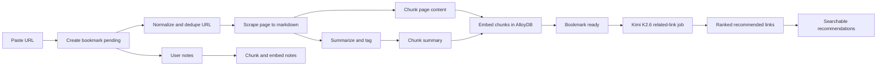
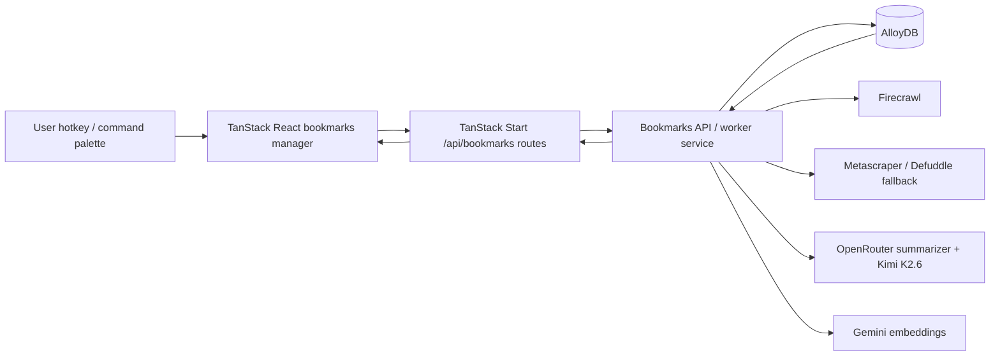

<Info>
  **Status:** Scoping + first-pass build plan - draft v0.3. This page is still not approved for execution; the build plan is included so AlloyDB and TanStack/React work can be reviewed before implementation.
</Info>

## Dark mode mockups

<Frame caption="Collapsed capture modal - minimal paste field with expand affordance.">
  
</Frame>

<Frame caption="Expanded bookmarks modal - search, recent bookmarks, notes, copy actions, and related-link recommendations.">
  
</Frame>

## Scope iteration loops

These are the lenses used for this scoping pass:

1. **Power-user capture and recall** - make saving, copying, annotating, and finding links feel fast enough for a serious media or technology professional who saves many links while researching.
2. **AlloyDB data and retrieval** - define the new tables and semantic retrieval model as AlloyDB-first.
3. **AI research acceleration** - turn a saved bookmark into the start of a research trail by summarizing it, vectorizing it, and launching a related-link discovery job that returns the best next links to read.

## Workshop decisions

- **Related-link discovery trigger:** Kimi K2.6 related-link discovery should run automatically for every saved bookmark. It must never block capture; it starts in the background after the first scrape/summarization pass or after the best available metadata has been captured.
- **Copy action:** The copy-link icon copies the bookmark's canonical URL only. No copy menu or alternate formats in the current scope.
- **Notes:** Notes are simple freeform plain text in the current scope. Each bookmark can have unlimited notes, and every note is vectorized for semantic search.
- **Capture surfaces:** Current scope is Orbiter-native capture only: global hotkey and command palette. Browser extension, share sheet, and public/API capture are later enhancements.
- **Scraper posture:** Firecrawl is the primary scraper because Orbiter already uses it extensively. The scope still includes fallback extraction for failed/low-quality scrapes, likely Jina Reader or custom Playwright depending on failure mode.

## Open-source leverage scan

The best reuse path is not to adopt a full bookmark manager. It is to compose proven extraction and metadata pieces around Orbiter's own UX, AlloyDB schema, and AI pipeline.

### Strong candidates

| Repo | Use here | Notes |
| --- | --- | --- |
| [Firecrawl](https://github.com/firecrawl/firecrawl) | Primary scrape-to-markdown path | Already used extensively by Orbiter. Good fit for the main scrape job; license is AGPL for the open-source project, so prefer existing hosted/API usage or confirm license posture before embedding code. |
| [Metascraper](https://github.com/microlinkhq/metascraper) | Hero image, title, author, date, publisher, logo/favicon, URL normalization fallback | MIT. Strong candidate for the "card thumbnail / hero image" fallback layer because it has dedicated packages for image, logo, title, description, date, publisher, URL, Readability, and Defuddle connectors. |
| [Defuddle](https://github.com/kepano/defuddle) | Content/metadata fallback after Firecrawl, especially for Markdown and hero image extraction | MIT. Useful as a fallback evaluator because it returns cleaned content plus metadata including title, author, description, favicon, image, language, published date, site, and word count. Treat as an extraction fallback, not the primary scraper. |
| [Mozilla Readability](https://github.com/mozilla/readability) | Conservative article extraction fallback | Useful baseline for article-like pages. Less focused on rich card metadata than Metascraper/Defuddle, but battle-tested for reader-mode style extraction. |
| [linkding](https://github.com/sissbruecker/linkding) | UX/product reference for fast bookmark capture, tags, notes, browser extensions, title/description/icon fetching | MIT. Good reference app, but Orbiter's AI-first workflow and AlloyDB vector model are different enough that this should be inspiration, not adopted architecture. |

### Reference-only candidates

| Repo | Why look | Caution |
| --- | --- | --- |
| [Karakeep](https://github.com/karakeep-app/karakeep) | Closest open-source product reference for "bookmark everything" with links, notes, images, automatic title/description/image fetching, full-text search, and AI tagging/summarization | AGPL. Treat as product/UX inspiration only unless legal confirms code reuse is acceptable. |
| [Shiori](https://github.com/go-shiori/shiori) | Simple Go bookmark manager; useful for import/export, minimal bookmark data modeling, and reader-mode references | Reference only unless its implementation choices map cleanly to Orbiter's stack. |
| [SingleFile](https://github.com/gildas-lormeau/SingleFile) | Later archival/snapshot idea: preserve full pages as single HTML files | Useful for future "archive a page" scope, not needed for the first capture/search/recommendation loop. |
| [Browserless](https://github.com/browserless/browserless) | Headless browser service for screenshots or rendered HTML when all extraction fails | Licensing is SSPL/commercial for proprietary use. If we need screenshot fallback, first consider an internal Playwright service before adopting Browserless. |

### Hero image extraction posture

Card thumbnails should be selected by confidence, not by one hard-coded source:

1. Use Firecrawl/metadata output first when it provides a high-confidence page image.
2. Run Metascraper against the fetched HTML as the first metadata fallback for `image`, `logo`, `publisher`, `title`, `description`, and canonical URL.
3. Run Defuddle as a content/metadata fallback when Firecrawl output is thin or low quality.
4. If no meaningful hero image exists, fall back to domain logo/favicon rather than inventing an image.
5. Use a rendered screenshot fallback only for pages where a thumbnail materially helps recognition and no useful `og:image`/metadata image exists.

Suggested data additions for the current `bookmark` row:

| Column | Type | Notes |
| --- | --- | --- |
| `hero_image_url` | text | Best card thumbnail candidate after Firecrawl + metadata fallback. |
| `hero_image_source` | enum | `firecrawl`, `open_graph`, `schema_org`, `metascraper`, `defuddle`, `screenshot`, `favicon`, `manual`. |
| `hero_image_confidence` | numeric | 0-1 score for ranking image candidates. |
| `screenshot_url` | text | Optional rendered screenshot fallback, not the default thumbnail. |

## Product thesis

A bookmark is not just a URL. For the target user, it is a marker in a research process: "this is worth remembering, using, citing, sharing, or returning to later."

Orbiter should treat that motion as the start of an AI-assisted research workflow. When a power user saves a link, the system should:

- Preserve the canonical link so it can be opened, copied, and shared later.
- Read the page and create a useful summary without slowing down capture.
- Let the user attach unlimited notes, observations, quotes, and follow-up thoughts.
- Make the original page, the AI summary, and every note semantically searchable.
- Suggest ranked related links that help the user go deeper on the same subject.

The first version should feel less like "read it later" and more like a private research memory system that happens to start with a bookmark.

## ICP and usage posture

The customer is a serious, smart media and technology power user. They are saving articles, docs, papers, product pages, essays, analyst posts, GitHub repos, launch pages, and competitor references while moving quickly.

Design implications:

- **Capture must be nearly invisible.** If the user is in flow, saving a link should take one or two keystrokes and should never wait for scraping or LLM work.
- **Recall must tolerate vague memory.** The user may remember the concept, argument, company, feature, quote, or personal note, not the title or exact URL.
- **Annotations are first-class.** A personal note may be more important than the page itself, so notes need their own storage, editing, and vectorization.
- **Every row needs utility actions.** Open, copy link, add note, inspect summary, and trigger related research should be available without hunting.
- **AI should reduce manual research chores.** The system should surface the next best links, not just produce another summary the user has to manage.

## Core experience

<Steps>
  <Step title="Invoke">
    Global hotkey or command palette -> **Bookmarks**. Opens a small capture modal. If the clipboard contains a URL, pre-fill it so the default action is press <kbd>Enter</kbd>.
  </Step>
  <Step title="Save instantly">
    Paste or confirm a link. Orbiter immediately creates a `bookmark` row with `status = pending` and returns control to the user. Scraping, summarization, embeddings, and related-link discovery run in the background.
  </Step>
  <Step title="Copy and share">
    Every bookmark row includes a copy-link icon button. Clicking it copies the canonical URL to the clipboard for pasting into email, Slack, docs, notes, or another research tool.
  </Step>
  <Step title="Add notes">
    Each bookmark has a plain text note field. The user can add as many notes as they want. Notes are timestamped, editable, attached to the bookmark, and vectorized so they appear in semantic search results alongside page content.
  </Step>
  <Step title="Search everything">
    Expanding the modal reveals the bookmark library with one search box across URLs, titles, AI descriptions, summaries, scraped markdown chunks, user notes, tags, and related-link recommendations.
  </Step>
  <Step title="Go deeper">
    For every saved bookmark, Orbiter automatically starts a Kimi K2.6 related-link discovery job in the background. The output is not a full research report; it is a ranked list of the best links the user should inspect next.
  </Step>
</Steps>

## Capture and recall UX scope

The capture surface should stay small, but the expanded surface should support real research work.

### Capture mode

- URL input, prefilled from clipboard when possible.
- Optional note field below the URL for "why I saved this" or immediate context.
- Enter saves; the modal can close or stay open depending on user preference.
- Optimistic save creates the bookmark immediately, then background statuses fill in.
- Duplicate canonical URLs surface the existing bookmark and let the user append a new note.
- Current scope starts with global hotkey and command palette only; browser extension/share/API capture are not part of this pass.

### Expanded library mode

- Single search field across all bookmark material.
- Results grouped by bookmark, with match evidence showing whether the hit came from the title, summary, page chunk, user note, or recommended related link.
- Keyboard-first navigation for opening, copying, adding a note, archiving, and re-running enrichment.
- Fast filters for domain, tag, status, unread/needs-review, has notes, and has related links.
- Bookmark detail drawer for summary, notes, source metadata, related links, and enrichment status.

### Row actions

Every bookmark result should expose:

| Action | Purpose |
| --- | --- |
| Open link | Visit the canonical URL. |
| Copy link icon | Copy canonical URL to clipboard for sharing or pasting elsewhere. |
| Add note | Append a new note without leaving the search/list context. |
| View notes | Inspect all notes attached to the bookmark. |
| Re-scrape | Refresh page content when the source changes. |
| Find related links | Manually re-run or queue the Kimi related-link job. |
| Archive | Hide without deleting. |

## AI processing pipeline



<Steps>
  <Step title="Normalize and dedupe">
    Canonicalize the URL, resolve redirects when practical, strip tracking parameters, and compute a canonical URL key. If the user already saved the link, show the existing bookmark and append any new note.
  </Step>
  <Step title="Scrape to markdown">
    Fetch the page and convert it to clean markdown. Firecrawl is the primary extraction path. If Firecrawl fails, returns low-quality content, or cannot handle the page shape, fall back to another extractor such as Jina Reader or custom Playwright. Capture title, author, domain, favicon, image, language, published date when available, word count, and extraction source.
  </Step>
  <Step title="Summarize">
    Generate a concise description, summary, key points, suggested tags, and "why this may matter" framing. The output should help the user decide whether to reopen the source.
  </Step>
  <Step title="Vectorize content and notes">
    Chunk scraped markdown, summaries, and user notes into a unified AlloyDB vector table. Search should retrieve both source content and personal annotations.
  </Step>
  <Step title="Find related links">
    Once the bookmark has a stable summary and topic profile, automatically start a Kimi K2.6 related-link job that searches for better, deeper, adjacent, primary, or counterpoint sources.
  </Step>
</Steps>

## AlloyDB data model

All new persistence and retrieval for this feature should be modeled in AlloyDB.

### `bookmark` - core saved link

One row per saved canonical URL per user.

| Column | Type | Notes |
| --- | --- | --- |
| `id` | uuid (pk) | Bookmark id. |
| `user_id` | int | Owner. |
| `canonical_url` | text | Normalized URL used for dedupe and copy/share. |
| `original_url` | text | Exactly what the user pasted. |
| `domain` | text | Host/domain for grouping and filters. |
| `title` | text | Scraped or generated title. |
| `description` | text | AI one-liner. |
| `summary` | text | AI summary. |
| `why_it_matters` | text | Short AI-generated research value framing. |
| `author` | text | Nullable. |
| `published_at` | timestamp | Nullable. |
| `favicon_url` | text | Nullable. |
| `og_image_url` | text | Nullable. |
| `hero_image_url` | text | Best thumbnail/card image chosen from Firecrawl, metadata, favicon, or screenshot fallback. |
| `hero_image_source` | enum | `firecrawl`, `open_graph`, `schema_org`, `metascraper`, `defuddle`, `screenshot`, `favicon`, `manual`. |
| `hero_image_confidence` | numeric | 0-1 score for image candidate quality. |
| `screenshot_url` | text | Optional rendered screenshot fallback. |
| `lang` | text | Nullable. |
| `word_count` | int | Nullable. |
| `reading_minutes` | int | Derived. |
| `status` | enum | `pending`, `scraping`, `summarizing`, `embedding`, `ready`, `failed`. |
| `related_status` | enum | `not_started`, `queued`, `running`, `ready`, `failed`. |
| `source` | enum | `hotkey`, `command_palette`. |
| `content_hash` | text | Dedupe/change detection for scraped content. |
| `last_scraped_at` | timestamp | Nullable. |
| `last_related_at` | timestamp | Nullable. |
| `archived_at` | timestamp | Nullable. |
| `created_at` / `updated_at` | timestamp | Standard timestamps. |

Suggested constraints and indexes:

- Unique per user on `(user_id, canonical_url)` for dedupe.
- B-tree indexes on `(user_id, created_at desc)`, `(user_id, domain)`, `(user_id, status)`, and `(user_id, related_status)`.

### `bookmark_content` - scraped source content

Large page content kept out of the hot bookmark row.

| Column | Type | Notes |
| --- | --- | --- |
| `id` | uuid (pk) | |
| `bookmark_id` | uuid | FK to `bookmark`. |
| `user_id` | int | Denormalized for filtering. |
| `markdown` | text | Clean scraped markdown. |
| `plain_text` | text | Optional extracted text for search/chunking. |
| `scrape_source` | enum | `firecrawl`, `jina`, `exa`, `custom_playwright`, `manual`. |
| `http_status` | int | Nullable. |
| `content_hash` | text | Matches bookmark when current. |
| `byte_size` | int | Storage/cost visibility. |
| `extraction_metadata` | jsonb | Raw metadata from scraper. |
| `scraped_at` | timestamp | |

### `bookmark_note` - unlimited freeform user notes

Each note is attached to one bookmark. Notes are first-class searchable content, not a blob on the bookmark.

| Column | Type | Notes |
| --- | --- | --- |
| `id` | uuid (pk) | |
| `bookmark_id` | uuid | FK to `bookmark`. |
| `user_id` | int | Owner. |
| `note_text` | text | User-authored plain text note. |
| `archived_at` | timestamp | Nullable. |
| `created_at` / `updated_at` | timestamp | |

Suggested indexes:

- `(user_id, bookmark_id, created_at desc)` for bookmark detail.
- Full-text index on `note_text` for hybrid search.

### `bookmark_vector_chunk` - unified semantic search chunks

One vector table for all searchable bookmark material: page markdown, AI summary, notes, and related-link descriptions.

| Column | Type | Notes |
| --- | --- | --- |
| `id` | uuid (pk) | |
| `bookmark_id` | uuid | FK to `bookmark`. |
| `user_id` | int | Required pre-filter for private search. |
| `source_type` | enum | `page`, `summary`, `note`, `related_link`. |
| `source_id` | uuid | Points to `bookmark_content`, `bookmark_note`, or `bookmark_recommended_link`. |
| `chunk_index` | int | Order within the source. |
| `chunk_text` | text | Text embedded. |
| `token_count` | int | Nullable. |
| `embedding` | vector(3072) | Gemini embedding dimension if using `google/gemini-embedding-001`. |
| `embedding_model` | text | Model id for re-embed tracking. |
| `metadata` | jsonb | Source-specific info such as heading, source offsets, or link rank. |
| `created_at` | timestamp | |

Suggested retrieval posture:

- Use AlloyDB vector search with a hard `user_id` pre-filter.
- Collapse chunk results to distinct bookmarks, but retain matched chunks as evidence.
- Combine vector score with keyword match, recency, note matches, and user interaction signals.

### `tag` and `bookmark_tag` - AI and manual labels

| Table | Columns |
| --- | --- |
| `tag` | `id`, `user_id`, `name`, `created_at` |
| `bookmark_tag` | `bookmark_id`, `tag_id`, `source` enum `ai`, `manual`, `system` |

Tags are useful for filters, but semantic search should not depend on perfect tagging.

### `bookmark_related_job` - related-link discovery runs

Tracks each Kimi K2.6 related-link discovery attempt.

| Column | Type | Notes |
| --- | --- | --- |
| `id` | uuid (pk) | |
| `bookmark_id` | uuid | FK to `bookmark`. |
| `user_id` | int | Owner. |
| `model` | text | Kimi K2.6 model id or configured alias. |
| `prompt_version` | text | Track prompt changes. |
| `status` | enum | `queued`, `running`, `ready`, `failed`, `cancelled`. |
| `input_summary_hash` | text | Detect whether the bookmark changed. |
| `search_queries` | jsonb | Queries or agent tasks used. |
| `error` | text | Nullable. |
| `started_at` / `completed_at` | timestamp | Nullable. |
| `created_at` | timestamp | |

### `bookmark_recommended_link` - ranked next links

The output of related-link discovery. These are candidates, not automatically saved bookmarks.

| Column | Type | Notes |
| --- | --- | --- |
| `id` | uuid (pk) | |
| `bookmark_id` | uuid | The source bookmark. |
| `related_job_id` | uuid | FK to `bookmark_related_job`. |
| `user_id` | int | Owner. |
| `rank` | int | Ordered recommendation. |
| `url` | text | Candidate link. |
| `canonical_url` | text | Normalized candidate URL. |
| `domain` | text | Host/domain. |
| `title` | text | Candidate title. |
| `description` | text | Short explanation of the source. |
| `why_relevant` | text | Why this is useful given the original bookmark. |
| `novelty_angle` | text | What new angle it adds. |
| `source_type` | enum | `primary`, `analysis`, `documentation`, `paper`, `repo`, `news`, `opinion`, `counterpoint`, `other`. |
| `relevance_score` | numeric | 0-1. |
| `credibility_score` | numeric | 0-1. |
| `novelty_score` | numeric | 0-1. |
| `already_saved_bookmark_id` | uuid | Nullable, if user already saved it. |
| `selected_at` | timestamp | Nullable, when user chooses to save/open from recommendations. |
| `created_at` | timestamp | |

Recommended links can also be embedded into `bookmark_vector_chunk` as `source_type = related_link`, so a later semantic search for the topic can surface both the original bookmark and the recommended research trail.

### `bookmark_collection` - optional organization layer

Manual folders and smart collections are useful later, but they should not be required for capture.

| Table | Columns |
| --- | --- |
| `bookmark_collection` | `id`, `user_id`, `name`, `is_smart`, `rule` jsonb, `created_at` |
| `bookmark_collection_item` | `collection_id`, `bookmark_id`, `added_at` |

## Search design

Search should answer "where did I save or write something about this?" even when the query does not match the title.

<Steps>
  <Step title="Embed the query">
    Embed the user's query using the same embedding model used for bookmark chunks.
  </Step>
  <Step title="Retrieve private chunks">
    Run vector search over `bookmark_vector_chunk` with `WHERE user_id = $me`. Include `source_type` in the result so the UI can show whether the hit came from page text, summary, note, or related link.
  </Step>
  <Step title="Blend with keyword signals">
    Add keyword/full-text matches from bookmark title, URL/domain, summary, note text, tags, and recommended-link titles.
  </Step>
  <Step title="Group by bookmark">
    Collapse chunks to bookmark-level results, preserving best matched evidence and allowing multiple hit types per bookmark.
  </Step>
  <Step title="Rank for research utility">
    Rank with semantic score, exact keyword match, note match boost, recency, user-opened/saved behavior, and whether related links exist.
  </Step>
</Steps>

Important search behaviors:

- A note-only match should still return the parent bookmark.
- A related-link match should return the source bookmark and show the recommended link as the evidence.
- Search should support "things I saved about..." as well as short conceptual queries.
- Tags and collections are filters, not the core recall mechanism.

## Kimi K2.6 related-link discovery

After a bookmark is saved, scraped, summarized, and embedded, Orbiter should start a related-link discovery job. The goal is to return ranked links the user should inspect next, not a full research memo.

The job should use:

- Original canonical URL and domain.
- Scraped title, description, summary, key points, and extracted topics.
- Optional user note context, especially "why I saved this."
- Existing saved bookmarks on similar topics, to avoid recommending duplicates.
- Search/web access through the configured research provider or agent tooling.

The result should be a ranked list of links with short reasons. The user can open, copy, ignore, or save any recommendation as a new bookmark.

### Draft system prompt

```text
You are Orbiter's Related Research Link Swarm Coordinator for a serious media and technology power user.

Your task is to start from one saved bookmark and return the best ranked links the user should inspect next.

Do not write a deep research report. Do not summarize the whole topic at length. Do not produce generic background. Your final output is a ranked list of URLs with concise reasons.

You may internally coordinate a swarm of specialist agents:

1. Topic Mapper - infer the core subject, claims, entities, technologies, companies, products, and open questions from the saved bookmark.
2. Primary Source Scout - find official sources, docs, papers, repos, regulatory filings, product pages, or source material that deepen the original bookmark.
3. Expert Analysis Scout - find high-signal analysis from credible media, analysts, engineers, founders, researchers, or practitioners.
4. Counterpoint Scout - find useful dissent, limitations, criticism, failure modes, or alternative explanations.
5. Duplicate and Quality Reviewer - remove duplicates, canonicalize URLs, reject SEO spam, reject shallow summaries of the same source, and check whether a link is already represented in the user's saved library.
6. Ranker - rank the remaining links by relevance, credibility, novelty, actionability, and usefulness for follow-up research.

Inputs:
- saved_url: {{canonical_url}}
- title: {{title}}
- domain: {{domain}}
- ai_description: {{description}}
- ai_summary: {{summary}}
- key_points: {{key_points}}
- user_notes: {{user_notes}}
- existing_related_saved_links: {{existing_related_saved_links}}
- max_results: {{max_results}}

Ranking criteria:
- Relevance: directly helps the user understand, verify, extend, or act on the saved bookmark.
- Credibility: prefer primary sources, original research, official docs, reputable publications, expert practitioners, and source material.
- Novelty: adds something materially new beyond the saved bookmark.
- Specificity: avoid broad generic explainers unless they are unusually authoritative.
- Actionability: the user should know why this link is worth opening next.
- Non-duplication: avoid recommending the same article, syndicated copies, shallow rewrites, or links already saved by the user unless the existing saved link is the best source.

Return valid JSON only with this shape:

{
  "topic_profile": {
    "one_sentence_topic": "...",
    "main_entities": ["..."],
    "research_angles": ["..."]
  },
  "ranked_links": [
    {
      "rank": 1,
      "title": "...",
      "url": "https://...",
      "canonical_url": "https://...",
      "domain": "...",
      "source_type": "primary | analysis | documentation | paper | repo | news | opinion | counterpoint | other",
      "why_relevant": "...",
      "novelty_angle": "...",
      "credibility_note": "...",
      "relevance_score": 0.0,
      "credibility_score": 0.0,
      "novelty_score": 0.0,
      "already_saved": false,
      "already_saved_bookmark_id": null
    }
  ],
  "rejected_links": [
    {
      "url": "https://...",
      "reason": "duplicate | low_quality | off_topic | inaccessible | already_saved | other"
    }
  ],
  "suggested_followup_queries": ["..."]
}

Return between 5 and {{max_results}} ranked links. If fewer than 5 high-quality links exist, return fewer and explain why in suggested_followup_queries. Be strict: a short list of excellent links is better than a long list of weak links.
```

## Service and model choices

| Concern | Proposed | Status |
| --- | --- | --- |
| Summarization LLM | `deepseek/deepseek-v4-flash` via OpenRouter with reasoning disabled and a token cap | current preference |
| Related-link discovery | Kimi K2.6 via OpenRouter or configured research runtime, automatic for every saved bookmark | decided trigger; runtime open |
| Embeddings | `google/gemini-embedding-001` (3072-dim) via `vectors/create-gemini-vectors` #13114 | reuse existing |
| Vector store | AlloyDB / pgvector or AlloyDB vector search | required |
| Scraper to markdown | Firecrawl primary, fallback to Jina Reader or custom Playwright for failed/low-quality extraction | decided posture |
| Pipeline runtime | Background job/queue that does not block capture | confirm later |
| Realtime updates | websocket or short poll on bookmark status and related-link status | open |
| Frontend | `orbiter-frontend` global hotkey, command-palette entry, modal, expanded library, detail drawer | scope target |

## First-pass build plan

<Warning>
  **Plan only - do not build yet.** This is the first implementation sequence for AlloyDB + `orbiter-frontend` (TanStack Start / React). It is intentionally detailed enough to execute later, but this page is still scoping/planning until approved.
</Warning>

### Architecture shape



Browser code never talks directly to AlloyDB, Firecrawl, OpenRouter, or Gemini. The React surface calls same-origin TanStack Start API routes; those routes authenticate the user and call the bookmarks backend service, which owns AlloyDB reads/writes, jobs, scraping, LLM calls, embedding, and retry logic.

### Phase map

| Phase | Ships | Depends on | Main risk reduced |
| --- | --- | --- | --- |
| **P0 Contracts + migration plan** | Ratified API contracts, DTOs, feature flag, migration list | Current scope approval | Prevents frontend/backend drift. |
| **P1 AlloyDB foundation** | Tables, scalar indexes, sqlc/query layer, user-owned reads | P0 | Data model and dedupe are real before UI polish. |
| **P2 Capture API + collapsed modal** | Hotkey/command opens minimal paste modal; optimistic save returns `pending` bookmark | P1 | Proves the core capture loop. |
| **P3 Enrichment worker** | Firecrawl scrape, metadata/hero image fallback, summary, notes/content embeddings | P2 | Turns saved URLs into searchable research memory. |
| **P4 Expanded library + search** | Recent list, thumbnails, detail pane, copy URL, notes, hybrid search | P3 | Makes recall useful for power users. |
| **P5 Related-link discovery** | Automatic Kimi K2.6 jobs and ranked related links | P3/P4 | Adds the AI-first research acceleration loop. |
| **P6 Hardening + launch gate** | Observability, retries, limits, QA fixtures, performance checks | P2-P5 | Makes it safe to ship. |

### P0 - Contracts and boundaries

> **Standalone value:** backend and frontend can build in parallel against the same contract without guessing.

<Steps>
  <Step title="Confirm the current decisions">
    Treat the workshop decisions above as source-of-truth: automatic Kimi related-link jobs for every bookmark, URL-only copy icon, simple freeform notes, global hotkey + command palette capture only, Firecrawl primary with fallback extraction, and AlloyDB-only persistence.
  </Step>
  <Step title="Define wire DTOs">
    Create a contract document before code: `Bookmark`, `BookmarkContent`, `BookmarkNote`, `BookmarkSearchResult`, `BookmarkRecommendedLink`, `BookmarkStatus`, `RelatedStatus`, and `BookmarkJobStatus`. Mirror these later as Zod schemas in `src/features/bookmarks/schemas/`.
  </Step>
  <Step title="Choose the API ownership">
    Default plan: TanStack Start routes under `/api/bookmarks/*` authenticate the browser request and forward to a bookmarks backend service. The backend service owns AlloyDB, Firecrawl, OpenRouter, Gemini, and Kimi credentials. Avoid client-exposed secrets and avoid direct browser-to-AlloyDB access.
  </Step>
  <Step title="Add a feature flag">
    Plan a `VITE_AI_FIRST_BOOKMARKS` client flag and matching server-side enablement so the modal and command can ship disabled. Do not expose the feature to all users until P6 exits.
  </Step>
</Steps>

Exit evidence:

- Contract examples exist for capture, duplicate save, pending bookmark, ready bookmark, failed scrape, note-only match, semantic match, and related-link-ready result.
- The contract defines how WorkOS identity maps to Orbiter `user.id` before any table writes occur.
- The feature flag name and rollout posture are decided.

### P1 - AlloyDB foundation

> **Standalone value:** AlloyDB can store, retrieve, dedupe, and update bookmark records before any frontend depends on it.

<Steps>
  <Step title="Create the migration set">
    Add additive AlloyDB migrations for the bookmark feature. Follow the existing migrations guidance: migrations are append-only, DDL lives in migration files, vector extension setup is explicit, and ScaNN indexes wait until there is enough data to justify them.
  </Step>
  <Step title="Create core tables">
    Create the scoped tables from the data model: `bookmark`, `bookmark_content`, `bookmark_note`, `bookmark_vector_chunk`, `tag`, `bookmark_tag`, `bookmark_related_job`, `bookmark_recommended_link`, and optional `bookmark_collection` / `bookmark_collection_item` only if we decide collections are in first build.
  </Step>
  <Step title="Add scalar indexes first">
    Add unique `(user_id, canonical_url)` on `bookmark`; btrees on `(user_id, created_at desc)`, `(user_id, domain)`, `(user_id, status)`, `(user_id, related_status)`, `(user_id, bookmark_id, created_at desc)` for notes, and `(bookmark_id, rank)` for recommended links.
  </Step>
  <Step title="Add vector columns without premature ScaNN">
    Add `bookmark_vector_chunk.embedding vector(3072)` for Gemini embeddings. Do not add the ScaNN index in the first migration if the table is empty; per existing AlloyDB migration guidance, add ScaNN later in a dedicated index migration once row count and query shape are real.
  </Step>
  <Step title="Implement repository/query layer">
    Add typed queries for create bookmark, get by id, get by canonical URL, list recent, update enrichment status, upsert content, create note, create chunks, search chunks, create related job, and upsert recommended links. Every query must require `user_id` unless it is an internal job claim/update by bookmark id.
  </Step>
  <Step title="Build a seed fixture">
    Create a small local/dev seed path with 5-10 bookmarks, notes, hero images, and related-link rows so the frontend can develop without waiting for Firecrawl/LLM runs.
  </Step>
</Steps>

Exit evidence:

- Migrations apply locally and against AlloyDB through the approved migration path.
- Dedupe works on `(user_id, canonical_url)`.
- Recent-list and bookmark-detail reads return only the authenticated user's rows.
- Vector chunk writes succeed with `vector(3072)` even before a vector index exists.

### P2 - Capture API and collapsed TanStack/React modal

> **Standalone value:** a user can press the bookmark shortcut, paste a URL, save instantly, and see a pending bookmark.

Backend/API work:

- `POST /api/bookmarks` - capture a URL and optional freeform note; normalize enough to dedupe; return a `pending` bookmark immediately.
- `GET /api/bookmarks/recent` - return recent bookmarks for the expanded modal.
- `GET /api/bookmarks/:id` - return detail.
- `POST /api/bookmarks/:id/notes` - append a freeform note and queue note embedding.
- `POST /api/bookmarks/:id/jobs/rescrape` - later/manual re-scrape hook, can be feature-disabled initially.

TanStack/React work in `orbiter-frontend`:

- Create `src/features/bookmarks/{api,components,hooks,schemas,types}`.
- Add Zod schemas for API responses in `src/features/bookmarks/schemas/bookmark.ts`.
- Add React Query hooks: `useCreateBookmark`, `useRecentBookmarks`, `useBookmark`, `useAddBookmarkNote`, `useBookmarkSearch`.
- Add `BookmarksManager` as a lazy global manager in `src/routes/_authed.tsx`, matching `NotesManager`, `CollectionsManager`, and `EmailComposerManager`.
- Add a command palette action in `src/features/command-palette/constants/commands.tsx` that posts `{ target: "BookmarksManager", data: { action: "open" } }`.
- Add a dedicated global hotkey in the command hotkey layer once the exact shortcut is chosen.
- Build `BookmarkCaptureModal`: one URL input, optional note field only after expansion or on a subtle secondary affordance, Enter-to-save, clipboard prefill when allowed, Escape close, and an expand icon.
- Use optimistic React Query cache insertion so the row appears as `pending` before enrichment starts.

Exit evidence:

- With the feature flag on, command palette opens the collapsed modal.
- Paste + Enter creates a pending bookmark without waiting for scraping.
- Duplicate URL returns the existing bookmark and appends the new note if provided.
- The copy icon is not needed in collapsed mode; URL-only copy arrives with list rows in P4.

### P3 - Enrichment worker and searchable memory

> **Standalone value:** pending bookmarks become ready records with metadata, hero image, markdown, summaries, notes, and embeddings.

<Steps>
  <Step title="Queue enrichment on capture">
    After `POST /api/bookmarks` commits the row, enqueue scrape/summarize/embed work. The queue can be Cloud Tasks, a database-backed job table, or the existing backend job framework; it must not block capture.
  </Step>
  <Step title="Normalize and scrape">
    Resolve the canonical URL, remove tracking params, call Firecrawl, and persist `bookmark_content`. If Firecrawl fails or content quality is low, run the selected fallback path: Metascraper for metadata/hero image and Defuddle or custom Playwright for content extraction.
  </Step>
  <Step title="Select hero image">
    Choose `hero_image_url` by confidence: Firecrawl metadata first, then Open Graph/schema image via Metascraper, then Defuddle metadata, then favicon/logo, then screenshot only when useful.
  </Step>
  <Step title="Summarize">
    Run `deepseek/deepseek-v4-flash` with reasoning disabled and a token cap. Persist `description`, `summary`, `why_it_matters`, key points, and suggested tags.
  </Step>
  <Step title="Chunk and embed">
    First-pass assumption: page-structure-aware markdown chunks with fixed max size and overlap. If the chunking workshop changes that decision, update this phase before build. Embed page chunks, summary chunks, notes, and later related-link descriptions into `bookmark_vector_chunk`.
  </Step>
  <Step title="Update statuses">
    Move `status` through `scraping -> summarizing -> embedding -> ready`; write `failed` plus an error string on unrecoverable failure. A bookmark with failed enrichment still keeps its URL and notes.
  </Step>
</Steps>

Exit evidence:

- A real URL creates markdown, metadata, hero image, summary, and chunks.
- A note added after capture is embedded and searchable.
- Failed scrape keeps the bookmark usable and exposes retry status.
- All provider calls are traceable by bookmark id and job id.

### P4 - Expanded modal, recent list, notes, copy, and search

> **Standalone value:** a power user can recall saved links, copy a URL, add notes, and inspect AI-generated context.

TanStack/React components:

- `BookmarksExpandedModal` - wide modal shell with search field, recent list, and detail pane.
- `BookmarkRow` - stable row height, thumbnail/hero image, title, description, domain, status, URL-only copy icon, add-note button, and related-link status.
- `BookmarkDetailPane` - summary, why-it-matters, notes, source metadata, and related links.
- `BookmarkNoteComposer` - plain text, Enter/Cmd+Enter save behavior to decide during implementation, optimistic append.
- `BookmarkSearchInput` - debounced query, loading state, and clear button.

API/search behavior:

- Empty search returns recent bookmarks.
- Text search first calls hybrid search: exact title/domain/url/summary/note/recommended-link keyword match plus vector retrieval when an embedding exists.
- Results group by bookmark and preserve evidence snippets with `source_type`: `page`, `summary`, `note`, or `related_link`.
- Copy icon uses `navigator.clipboard.writeText(bookmark.canonical_url)` only.

Exit evidence:

- Expanded modal matches the dark-mode mockup direction without nested cards or marketing layout.
- Recent rows show hero image fallback correctly.
- Search can find a bookmark by note-only text.
- Copy URL produces a toast and writes only the canonical URL.
- React Query invalidation keeps capture, note creation, status polling, and search results coherent.

### P5 - Automatic related-link discovery

> **Standalone value:** every saved bookmark gets a ranked "what to read next" trail.

<Steps>
  <Step title="Queue Kimi after first understanding">
    When the bookmark reaches `ready` or has the best available metadata after a degraded scrape, enqueue a `bookmark_related_job` automatically. This happens for every saved bookmark per the workshop decision.
  </Step>
  <Step title="Build the Kimi prompt runner">
    Use the draft system prompt above with structured JSON output. Inputs include canonical URL, title, domain, description, summary, key points, user notes, and existing similar saved links for duplicate avoidance.
  </Step>
  <Step title="Persist ranked links">
    Write `bookmark_recommended_link` rows with rank, canonical URL, title, source type, relevance/credibility/novelty scores, `already_saved_bookmark_id` when applicable, and rejection reasons for audit/debug.
  </Step>
  <Step title="Embed recommendation text">
    Embed each accepted recommendation's title, description, `why_relevant`, and `novelty_angle` as `source_type = related_link` chunks so future search can surface research trails.
  </Step>
  <Step title="Render status and results">
    Show `queued`, `running`, `ready`, and `failed` states in the detail pane and row badge. Let the user open, copy, ignore, or save a recommended link as a new bookmark later.
  </Step>
</Steps>

Exit evidence:

- Every ready bookmark gets a related job unless blocked by an explicit cost/kill switch.
- Related links are ranked, deduped, and persisted.
- Search can return a bookmark because one of its related links matched the query.
- A failed related job does not mark the bookmark itself failed.

### P6 - Hardening, observability, and launch gate

> **Standalone value:** the feature is safe to expose beyond internal testing.

Hardening checklist:

- Add cost guardrails for Firecrawl, summarization, embeddings, and Kimi jobs.
- Add retry/backoff/timeouts for scrape, summarize, embed, and related-link jobs.
- Add provider-level error categories: timeout, auth/config missing, low-quality scrape, blocked/paywalled, invalid JSON, embedding failure, duplicate.
- Add Sentry capture and structured logs keyed by `bookmark_id`, `job_id`, `user_id`, provider, status, and latency.
- Add frontend tests for collapsed modal, optimistic save, duplicate save, copy URL, note add, expanded search, and failed states.
- Add backend tests for dedupe, user isolation, job idempotency, status transitions, and vector-search query shape.
- Add manual QA fixtures: normal article, docs page, GitHub repo, PDF-like page if supported, blocked/paywalled page, duplicate URL, page with no hero image, and note-only match.
- Add a kill switch for related-link jobs independent of capture/search.

Launch gate:

- Feature flag defaults off.
- Internal allowlist only for first pass.
- Capture and recent-list latency are acceptable with enrichment disabled.
- Enrichment backlog drains without blocking user capture.
- No provider secret is present in browser bundles.
- Network inspection proves a user cannot fetch another user's bookmarks by id.

### Frontend file plan

| File / folder | Planned role |
| --- | --- |
| `src/features/bookmarks/schemas/bookmark.ts` | Zod DTOs and inferred TS types. |
| `src/features/bookmarks/api/use-create-bookmark.ts` | Optimistic capture mutation. |
| `src/features/bookmarks/api/use-recent-bookmarks.ts` | Recent list query. |
| `src/features/bookmarks/api/use-bookmark-search.ts` | Debounced search query hook. |
| `src/features/bookmarks/api/use-add-bookmark-note.ts` | Optimistic freeform note mutation. |
| `src/features/bookmarks/components/bookmarks-manager.tsx` | Global manager listening for `window.postMessage` open/close/expand actions. |
| `src/features/bookmarks/components/bookmark-capture-modal.tsx` | Minimal collapsed paste modal. |
| `src/features/bookmarks/components/bookmarks-expanded-modal.tsx` | Expanded modal shell. |
| `src/features/bookmarks/components/bookmark-row.tsx` | Recent/search row with thumbnail, title, description, copy icon, note icon, related badge. |
| `src/features/bookmarks/components/bookmark-detail-pane.tsx` | Summary, notes, metadata, related links. |
| `src/features/bookmarks/hooks/use-bookmarks-hotkey.ts` | Dedicated global hotkey once the shortcut is chosen. |
| `src/routes/_authed.tsx` | Lazy-mount `BookmarksManager` with existing global managers. |
| `src/features/command-palette/constants/commands.tsx` | Add Bookmarks action. |
| `src/routes/api/bookmarks*.ts` | Same-origin TanStack Start API routes that authenticate and forward to backend service. |

### Backend/API endpoint plan

| Endpoint | Purpose |
| --- | --- |
| `POST /api/bookmarks` | Capture URL, optional note, dedupe, return pending bookmark. |
| `GET /api/bookmarks/recent` | Recent bookmarks for expanded modal. |
| `GET /api/bookmarks/search?q=` | Hybrid keyword/vector search. |
| `GET /api/bookmarks/:id` | Detail pane payload. |
| `POST /api/bookmarks/:id/notes` | Add freeform note and queue embedding. |
| `PATCH /api/bookmarks/:id/notes/:noteId` | Edit note text and re-embed. |
| `DELETE /api/bookmarks/:id/notes/:noteId` | Archive note. |
| `POST /api/bookmarks/:id/jobs/rescrape` | Manual retry/re-scrape. |
| `POST /api/bookmarks/:id/jobs/related` | Manual re-run for related links; automatic path uses internal queue. |
| `POST /internal/bookmark-jobs/:jobId/run` | Worker-only job execution endpoint, if using Cloud Tasks. |

### Decisions still needed before execution

- Exact global hotkey.
- Final chunking strategy and chunk size/overlap.
- Queue runtime: Cloud Tasks, database-backed queue, or existing job framework.
- Whether the backend service is new Cloud Run or an extension of an existing AlloyDB service.
- Whether `bookmark_collection` ships in first build or remains later.
- Polling vs realtime for `pending -> ready` and related-link status updates.
- Spend limits for automatic Kimi jobs.

## Ideas to fold in

These are candidates, not commitments:

- **Save with intent** - optional one-line note at capture time: "why am I saving this?"
- **Ask my bookmarks** - RAG over saved pages, notes, and recommended links.
- **Research trail view** - show the original bookmark plus AI-recommended next links as a small map/list of what to read next.
- **Auto-collections** - cluster bookmarks by topic, domain, company, technology, or theme without requiring manual filing.
- **Duplicate and near-duplicate detection** - canonical URL plus content hash and semantic similarity.
- **Freshness checks** - detect changed pages, dead links, moved docs, or stale references.
- **Quote/highlight capture** - later enhancement for saving selected page text or highlights as richer annotations.
- **Source quality hints** - flag primary source, opinion, news, docs, paper, repo, vendor page, or low-confidence source.
- **Inbox review queue** - bookmarks whose AI summary or related links are ready but not yet reviewed.
- **Personal research memory** - use notes and past saves to tune future related-link rankings for the user's interests.
- **More capture surfaces** - browser extension, share sheet, email-to-bookmark, and API capture can come later once the native workflow is proven.

## Open questions to workshop

1. **Chunking** - fixed-size chunks, semantic chunks, or page-structure-aware chunks; what size/overlap works best for article and note recall?
2. **Related-link scheduling details** - since Kimi K2.6 runs automatically for every saved bookmark, what retry, backoff, timeout, and daily/monthly spend limits should apply?
3. **Research provider/tooling** - what search/browser tools does the Kimi job actually have, and what is the canonical model id/config alias?
4. **Ranking weights** - how much should recommendations favor primary sources, expert analysis, novelty, recency, or counterpoints?
5. **Privacy** - private per user always, or later support team/shared bookmark spaces?
6. **Cost guardrails** - per-user daily/monthly limits for scraping, summarization, embedding, and related-link discovery?
7. **Storage limits** - keep all markdown in AlloyDB text, or add a later overflow/archive strategy for extremely large pages and PDFs?
8. **Review workflow** - should related links remain suggestions until explicitly saved, or can trusted recommendations auto-create draft bookmarks?

## Scope slices

- **Core capture and recall:** hotkey/modal, paste URL, optimistic save, copy-link icon, scrape to markdown, summary, expanded list, basic status updates.
- **Personal research memory:** unlimited notes, note embeddings, unified semantic search across page content, summaries, notes, tags, and related-link descriptions.
- **AI research acceleration:** Kimi K2.6 related-link discovery, ranked recommendations, duplicate rejection, save/open/copy actions on recommended links.
- **Power-user refinement:** keyboard-first workflows, smart filters, source quality labels, inbox review queue, freshness checks, and ask-my-bookmarks.

<Note>
  The build plan above is a first pass. Do not execute it until the remaining decisions are worked through and the plan is approved.
</Note>
