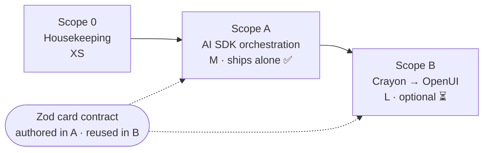
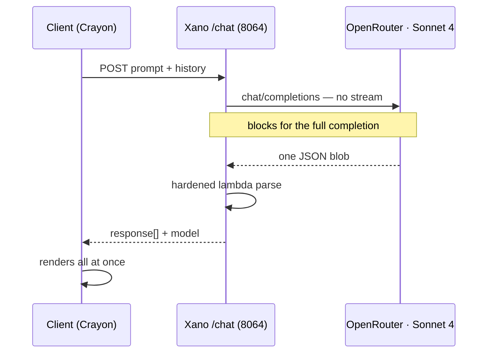
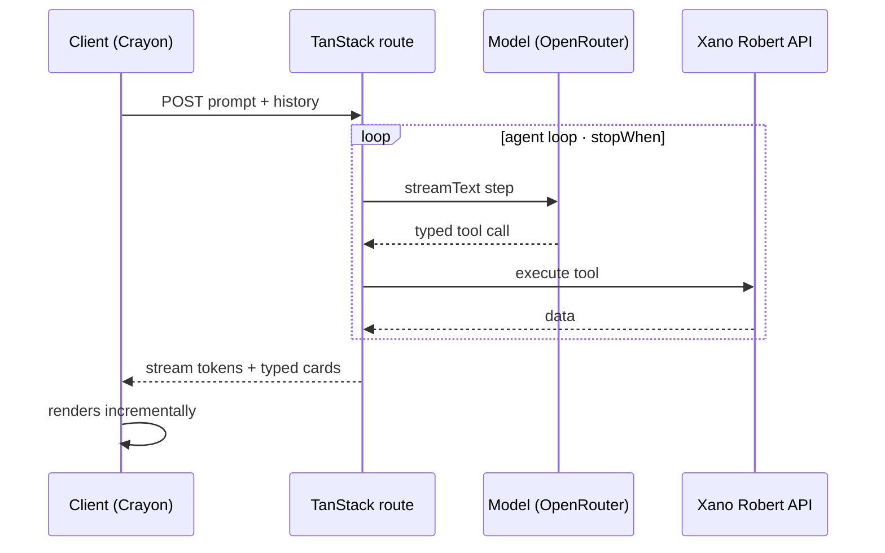
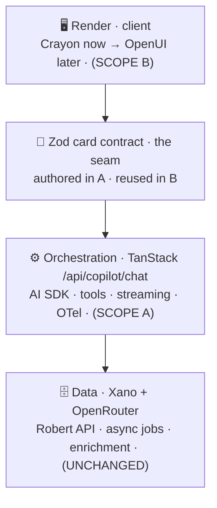

<Info>
**Progress snapshot - June 26, 2026.** Scope A is implemented locally on the `ai-sdk-chat` branch: the TanStack Start `/api/copilot/chat` route, AI SDK route contracts, Crayon SSE bridge, typed history/tool wrappers, feature flag, and smoke test are in place. Existing Xano endpoints were left unchanged, and no new Xano endpoint was needed; the "AI SDK" API group remains the reserved home for any additive Xano work. Verification so far: targeted unit/contract tests passed, `git diff --check` is clean, the disabled-feature smoke test passed, and production Vite client/SSR builds completed before Nitro packaging was paused due local memory pressure. The live-outcomes detour is understood as an auth/user-row mapping issue: the frontend was calling the live Xano data source, but the current login resolved to a live user id that did not own the older non-draft outcomes.
</Info>

<Info>
**TL;DR** — Move the copilot's AI brain out of Xano into a streaming [Vercel AI SDK](https://ai-sdk.dev/) agent loop in a TanStack Start server route (**Scope A**), then *optionally* swap the Crayon renderer for [OpenUI](https://github.com/thesysdev/openui) (**Scope B**). The two scopes share exactly one artifact — a renderer-agnostic **Zod card contract** — so Scope A ships and stands on its own, and Scope B can wait.
</Info>

## What this is

The copilot today works, but the audit below found two real weaknesses: it does **not stream** (it's a blocking one-shot LLM call), and its model↔UI contract is **untyped** (a hardened lambda parses hand-prompted JSON). This page documents the verified current state and a two-phase plan to fix both without a risky big-bang rewrite.

It also corrects two common misconceptions that came up while scoping: we are **not** paying for Thesys **C1**, and we are **not** using **OpenUI**. See [Current state](#current-state-verified).

## At a glance

Two phases, joined by one artifact — the Zod card contract authored in Scope A and reused in Scope B.



<CardGroup cols={2}>
  <Card title="Scope A — Orchestration" icon="bolt">
    **Effort: M · ships alone.** Move the AI brain into a streaming AI SDK agent loop in a TanStack route. Wins: real streaming, typed tools, typed card outputs, a multi-step agent loop, observability. Renderer stays Crayon.
  </Card>
  <Card title="Scope B — Renderer" icon="paintbrush">
    **Effort: L · optional / later.** Swap Crayon for OpenUI, reusing the Scope-A Zod schemas. Wins: component-level streaming, ~67% fewer UI tokens, end-to-end types. Defer until OpenUI nears 1.0.
  </Card>
</CardGroup>

## Current state (verified)

The live chat path:

| Layer | What runs today |
| --- | --- |
| **Client** | `orbiter-frontend` (TanStack Start). Copilot posts to Xano via `copilotFetch('/chat')`. Renders with the **Crayon SDK** (`@crayonai/react-core` `processStreamedMessage` + 18 template cards). ~2,200-LOC orchestrator in `copilot-app.tsx`, plus voice (Gradium/ElevenLabs) and persistence. |
| **Backend** | Xano **Robert API** (`Bd_dCiOz`, id 1261), endpoint **`/chat` (api id 8064)**. Builds a mode-aware system prompt from the `copilot_config` table + injected memory/person/network context. |
| **Model** | Calls **OpenRouter → `anthropic/claude-sonnet-4`** (key `$env.openRouter`). Prompts the model to return template JSON. |
| **Parse** | A "hardened" `api.lambda` strips code-fences and `JSON.parse`s the result into `{response: [...]}` (the `hardened-parser` tag). |
| **Render** | The `{name, templateProps}` items map to the 18 registered Crayon templates. |

The decisive snippet from the live Xano `/chat` function:

```xanoscript
api.request {
  url    = "https://openrouter.ai/api/v1/chat/completions"   // OpenRouter, not Thesys
  method = "POST"
  params = ...|set:"model":"anthropic/claude-sonnet-4"
  headers = [ "Authorization: Bearer "|concat:$env.openRouter, ... ]
}
// ...
response = { response: $responseItems, model: $model_used }   // $model_used = "anthropic/claude-sonnet-4"
```

### Key facts

- **No paid C1.** There is no call to `api.thesys.dev` in the live path. Generative UI = *Claude (via OpenRouter) prompted to emit Crayon template JSON → Crayon renders it*.
- **No streaming.** The OpenRouter call has no `stream: true` — Xano blocks for the full completion, parses, then returns a JSON blob. Any "typing" effect is client-side.
- **No OpenUI.** `@openuidev/*` is absent from `package.json`, `src/`, `node_modules`, and `pnpm-lock.yaml`.
- **On Claude Sonnet 4**, not the current Sonnet — a cheap quality/cost bump is just a string change in that function.
- **Already installed, unused:** `@thesysai/genui-sdk` (dead). **Already installed, useful:** `ai@^6`, `@ai-sdk/react`, `@ai-sdk/openai`. If we keep OpenRouter in Scope A, add `@openrouter/ai-sdk-provider`; that is one small provider dependency, not a new renderer/framework.

### The three Thesys products (so the names stop colliding)

| Product | Role | Using it? |
| --- | --- | --- |
| **C1** | Hosted GenUI *model* (paid, `api.thesys.dev`) | No |
| **Crayon SDK** | Client *renderer* (`@crayonai/*`) | **Yes** — copilot + outcomes-canvas + leverage-loops-canvas |
| **OpenUI** | Open-source *renderer* successor (`@openuidev/*`) | No |

## Why move to the AI SDK

The AI SDK competes with the **Xano `/chat` orchestration**, not with Crayon. The 18 cards are just React and survive either way. Mapping its wins onto the verified pain points:

| Pain today | With the AI SDK |
| --- | --- |
| Blocking one-shot JSON call | Real token streaming (`streamText`) |
| Untyped contract + hardened-lambda parser | Zod-validated tool schemas and card-output schemas; model retries on mismatch |
| Orchestration split between a Xano prompt and a 2,200-LOC client state machine | A real multi-step agent loop (`stopWhen`) with typed tools |
| Model choice buried in XanoScript | One-line model routing / fallback / prompt-caching |
| Tracing model calls in Xano is hard (Arize is a stub) | Built-in OpenTelemetry → Langfuse/Braintrust |

<Note>
**Xano is not being replaced.** Data, auth, FalkorDB, the async generation jobs (`/generate-*` + `/process-status` polling), and the enrichment pipelines all stay. The AI SDK only owns the *interactive chat turn*; its tools call back into the existing Robert API endpoints for data.
</Note>

## The chat turn: today vs. target

**Today** — one blocking call. Xano waits for the full completion, parses it, then returns a JSON blob; the UI paints all at once.



**Target (Scope A)** — a streaming agent loop. The model interleaves typed tool calls (executed against Xano) and streams tokens and cards back as they are produced.



## Architecture: two scopes, one seam



Stream flows up (server → seam → client); tool calls flow down (server → Xano). The **Zod card contract** is the single coupling between the two scopes: Scope A authors it as the agent's typed card output and validates every card before emitting Crayon SSE; Scope B re-consumes the *same schemas* as OpenUI components. Nothing else crosses the boundary — which is what makes them independent, shippable scopes.

<CardGroup cols={2}>
  <Card title="Stays in Xano" icon="database">
    Data, auth, FalkorDB, the async generation jobs (`/generate-*` + `/process-status` polling), and the enrichment pipelines. The agent's tools call these for data.
  </Card>
  <Card title="Moves to the AI SDK route" icon="arrow-right-arrow-left">
    Chat reasoning, the multi-step tool loop, model routing, the system prompts, streaming, and telemetry.
  </Card>
</CardGroup>

## Scope 0 — Housekeeping

<Tip>Effort: **XS**. Clears stale cruft so the migration isn't fighting ghosts.</Tip>

- Delete/fix the C1 section in `src/features/copilot/README.md` — it documents an `api/server/chat.ts` that does not exist (leftover `orbiter-copilot-demo` docs).
- Remove the unused `@thesysai/genui-sdk` dependency. **Keep** `ai`, `@ai-sdk/react`, `@ai-sdk/openai`. Add `@openrouter/ai-sdk-provider` if we keep OpenRouter as the router; otherwise switch the sample and implementation to an already-installed direct provider.

## Scope A — Orchestration (AI SDK)

<Tip>Effort: **M**. Renderer stays Crayon. This is a complete, shippable win on its own.</Tip>

**Objective:** Replace the blocking Xano `/chat` with a streaming AI SDK agent loop in a TanStack server route. Author the Zod card contract. Add observability.

### The seam — `copilot/contracts/cards.ts`

One Zod schema per card (the 18). This file *is* the contract reused by Scope B. TypeScript types infer from it, and the Scope-A route uses it to validate every model-emitted card before anything reaches Crayon.

```ts
import { z } from "zod";

export const ContactCard = z.object({
  masterPersonId: z.number(),
  name: z.string(),
  title: z.string().optional(),
  company: z.string().optional(),
  avatarUrl: z.string().optional(),
});

export const LeverageLoopCard = z.object({
  personName: z.string(),
  reason: z.string(),
  connectionType: z.string(),
  actions: z.array(z.object({ action: z.string(), description: z.string() })).optional(),
});

// ...one per registered template: outcome_card, meeting_prep_card,
// question_card, button_group, serendipity_card, etc.

export const CARD_CONTRACT = { contact_card: ContactCard, leverage_loop_card: LeverageLoopCard /* ... */ };

export const CardEnvelope = z.discriminatedUnion("name", [
  z.object({ name: z.literal("contact_card"), templateProps: ContactCard }),
  z.object({ name: z.literal("leverage_loop_card"), templateProps: LeverageLoopCard }),
  // ...one envelope per card
]);

export type CardEnvelope = z.infer<typeof CardEnvelope>;
```

### The route — `routes/api/copilot/chat.ts`

```ts
import { createServerFileRoute } from "@tanstack/react-start/server";
import { streamText, tool, stepCountIs } from "ai";
import { createOpenRouter } from "@openrouter/ai-sdk-provider"; // keep OpenRouter; or @ai-sdk/anthropic
import { z } from "zod";
import { env } from "@/env";
import { CardEnvelope, CARD_CONTRACT } from "@/features/copilot/contracts/cards";
import { COPILOT_SYSTEM } from "@/features/copilot/server/prompts"; // moved out of Xano

const openrouter = createOpenRouter({ apiKey: env.OPENROUTER_API_KEY });

function validateCard(card: unknown) {
  return CardEnvelope.parse(card);
}

export const ServerRoute = createServerFileRoute("/api/copilot/chat").methods({
  POST: async ({ request }) => {
    const { prompt, history, master_person_id, mode } = await request.json();
    const xanoToken = request.headers.get("authorization") ?? ""; // forward the user's Xano auth
    const xano = makeRobertClient(xanoToken);                      // server-side copilotFetch

    const result = streamText({
      model: openrouter("anthropic/claude-sonnet-4"),  // trivially bumpable to a newer Sonnet
      stopWhen: stepCountIs(6),                         // real multi-step loop
      system: COPILOT_SYSTEM[mode],
      messages: [...history, { role: "user", content: prompt }],
      tools: {
        searchPersons: tool({
          description: "Search the user network or wider universe for people.",
          inputSchema: z.object({ q: z.string(), scope: z.enum(["network", "universe"]).default("network") }),
          execute: ({ q, scope }) => xano(`/search?q=${encodeURIComponent(q)}&mode=${scope}`),
        }),
        getPersonContext: tool({
          description: "Enriched context (bio, expertise, company) for a person.",
          inputSchema: z.object({ master_person_id: z.number() }),
          execute: ({ master_person_id }) => xano(`/person-context/${master_person_id}`),
        }),
        getConnectionPath: tool({
          description: "2nd/3rd-degree warm-intro path to a target.",
          inputSchema: z.object({ target_master_person_id: z.number() }),
          execute: ({ target_master_person_id }) =>
            xano(`/connection-path?target_master_person_id=${target_master_person_id}`),
        }),
        emitCard: tool({
          description: `Emit exactly one UI card. Valid names: ${Object.keys(CARD_CONTRACT).join(", ")}`,
          inputSchema: CardEnvelope,
          execute: (card) => validateCard(card), // parsed card is what the adapter streams as event: tpl
        }),
        // ...meeting-prep, memory, triggerGeneration — each wraps an existing Robert API endpoint
      },
      experimental_telemetry: { isEnabled: true, functionId: `copilot-${mode}` }, // OTel → Langfuse/Braintrust
    });

    // Crayon-specific adapter: re-emit as the event:text / event:tpl SSE the client already parses.
    // This adapter is the ONLY Crayon-coupled server code — it is what Scope B swaps.
    return toCrayonSSE(result);
  },
});
```

### The client change (~10 lines)

In the copilot's `onProcessMessage`, repoint `processMessage` at the new route. The visible Crayon shell, 18 templates, voice controls, and CSS stay; the response assembly work moves server-side.

```ts
const response = await fetch("/api/copilot/chat", {
  method: "POST",
  headers: { "Content-Type": "application/json", Authorization: `Bearer ${xanoToken}` },
  body: JSON.stringify({ prompt, history, master_person_id, mode }),
});
await processStreamedMessage({ response, createMessage, updateMessage, deleteMessage }); // unchanged
```

### Responsibility split

| Responsibility | Scope A target |
| --- | --- |
| History shaping | Move into the TanStack route so the server controls model context and token limits. |
| User/assistant persistence | Move into the route via existing `/conversations/{id}/messages` endpoints or a small server helper. |
| Template/card validation | Move into `cards.ts` + `emitCard`; reject or retry malformed cards before SSE. |
| Crayon SSE encoding | Move into `toCrayonSSE(result)`, the only Crayon-coupled server adapter. |
| Client shell | Keep `CrayonChat`, response templates, voice controls, composer UI, and styles in the client. |
| Client-only enrichments/fallbacks | Either formalize as server tools/cards or keep explicitly as temporary client compatibility shims; do not leave them implicit. |

### Boundaries

| In scope | Explicitly out |
| --- | --- |
| `cards.ts` contract; `/api/copilot/chat` route; typed data tools over Robert API; typed `emitCard`; per-mode prompts moved to `prompts.ts`; `toCrayonSSE` adapter; auth forwarding; persistence via existing `/conversations/{id}/messages` | Any renderer change. Crayon shell, 18 cards, voice controls, composer UI, CSS all stay. |

**Exit criteria:** all 4 modes served by the route, **token-streaming**, Crayon renders them, card outputs Zod-validated (retire the hardened lambda), traces flowing, Xano demoted to data/tools.

**Main risk:** an added client→server→Xano hop per tool call (watch latency); prompt parity when moving prompts out of Xano; preserving the current client-side enrichment/fallback behavior without quietly duplicating logic.

### Rollout

<Steps>
  <Step title="Pilot default Chat">
    Stand up the route with ~3 data tools behind a flag; repoint only the `default` mode. Keep Xano `/chat` for everything else. Rollback = repoint to Xano.
  </Step>
  <Step title="Validate">
    Check agent-loop quality, latency (the new hop), and that Crayon output matches today. Turn on telemetry.
  </Step>
  <Step title="Roll mode-by-mode">
    Migrate `leverage` → `meeting` → `outcome`, each with mode-specific tools/prompt, behind the same flag.
  </Step>
</Steps>

## Scope B — Renderer (Crayon → OpenUI)

<Tip>Effort: **L**. Orchestration stays the Scope-A route. Optional / later.</Tip>

**Objective:** Replace Crayon with [OpenUI](https://github.com/thesysdev/openui) across all 3 surfaces, **reusing the Scope-A Zod schemas verbatim**.

<Warning>
OpenUI is young: `@openuidev/react-lang` is at **v0.2.6** and `@openuidev/react-ui` is at **v0.11.9** (both still pre-1.0). It does **not** require C1: a Zod-defined component library auto-generates the system prompt for *any* OpenAI-compatible model (Claude via OpenRouter is fine). Its wins map onto our exact gaps — **streaming-first rendering** and **~67% fewer tokens than JSON** (Lang v0.5) — but betting the most central surface on a pre-1.0 renderer stack is the reason this is the *second* scope, ideally once it nears 1.0.
</Warning>

<CardGroup cols={2}>
  <Card title="Crayon — today" icon="layer-group">
    The renderer you ship now (`@crayonai/*`, MIT). Model emits **template JSON**; cards arrive whole; props are untyped from the backend's view. Battle-tested across 3 surfaces.
  </Card>
  <Card title="OpenUI — Scope B" icon="bolt">
    The successor renderer (`@openuidev/react-lang` 0.2.x + `@openuidev/react-ui` 0.11.x, MIT). Model emits **OpenUI Lang** — streams component-by-component, ~67% fewer tokens, Zod-typed end to end. Pre-1.0.
  </Card>
</CardGroup>

### The reuse payoff — `copilot/openui/library.ts`

```tsx
import { defineComponent, createLibrary } from "@openuidev/react-lang";
import { ContactCard as ContactCardSchema } from "@/features/copilot/contracts/cards"; // SAME schema from Scope A

const ContactCard = defineComponent({
  name: "contact_card",
  props: ContactCardSchema,                 // ← reused, not rewritten
  render: (p) => <ContactCardView {...p} />, // ← the existing card body ports over
});

export const library = createLibrary({ ContactCard /* ...the other 17 */ });
```

### Boundaries

| In scope | Explicitly out |
| --- | --- |
| `defineComponent` per card (props = Scope-A schemas); swap server adapter `toCrayonSSE` → OpenUI Lang encoder (the "how to emit UI" prompt is now auto-generated from the schemas); replace `CrayonChat`/`useThreadManager`/`processStreamedMessage` with `@openuidev/react-lang` / `@openuidev/react-ui` primitives; rebuild the voice composer mount; re-theme the 76KB `.crayon-*` CSS onto OpenUI; migrate all 3 surfaces; remove `@crayonai/*` | The agent loop, tools, model, and Xano — none move. |

**Exit criteria:** 3 surfaces on OpenUI, **component-level streaming**, Zod type-safe end-to-end, voice + theming at parity, Crayon removed.

**Main risk:** OpenUI 0.2.x API churn; no drop-in chat shell (build on headless primitives); voice + CSS re-work is the bulk of the effort.

## Dependency & sequencing

The only coupling between scopes is `cards.ts`. Therefore:

- **Scope A ships independently** and is a full win (streaming + typed tools + observability, zero Thesys).
- **Scope B is optional and deferrable** — trigger it when OpenUI matures or when you're already touching that UI.
- **Do not do Scope B first.** OpenUI can't stream a backend that doesn't stream — the blocking behavior lives in Xano `/chat`, so streaming must be fixed at the orchestration layer (Scope A) regardless of renderer. Scope A also authors the Zod schemas OpenUI wants, making a later Scope B cheaper.

The clean end-state is **AI SDK (orchestration) + OpenUI (render)** — both streaming-first and Zod-typed, no C1, no Crayon.

## Alternatives considered: Mastra

<Note>
We weighed the TS agent-framework field against the bare AI SDK for orchestration. Only one is worth keeping on the shelf — **[Mastra](https://mastra.ai/)** — and even then *not for this copilot*. The rest either can't beat the SDK they wrap (VoltAgent, OpenAI Agents SDK) or break the `cards.ts` Zod seam (LangGraph.js; anything Python — a separate service can't import the contract). Python frameworks (Google ADK, CrewAI, Pydantic AI, LangGraph-py) are structurally disqualified for the same reason: a non-TS service would re-author the 18 cards as Pydantic and hand-sync them — the exact drift Scope A exists to kill.
</Note>

Mastra is a TS-native agent framework built **on top of** the Vercel AI SDK, not a replacement for it (Apache-2.0 core; AI SDK v6–compatible since Mastra 1.0). It reuses `@openrouter/ai-sdk-provider`, `streamText`, and `toUIMessageStreamResponse()`, so it inherits our exact OpenRouter routing, Zod typing, and Crayon-compatible stream — meaning adopting it later would **not** throw away Scope A. What it *adds* is orchestration: suspendable/resumable workflows, persistent agent memory + semantic recall, RAG, evals-as-primitives, multi-agent networks, and a local dev playground. That added surface is the whole question — it earns its weight only when you have orchestration to manage.

<CardGroup cols={2}>
  <Card title="Interview / copilot agents — overkill" icon="circle-xmark">
    A single chat agent + a handful of Zod tools + one `streamText` loop. The bare AI SDK already covers streaming, typed tools, the card seam, and OTel. Mastra here is unused weight (extra runtime; leans toward a standalone Hono server) for zero capability gained.
  </Card>
  <Card title="Suggestion agent — plausible fit" icon="circle-check">
    A heavier, proactive agent (multi-step reasoning, its own memory, possibly sub-agents and RAG over our corpus) is Mastra's wheelhouse. If the suggestion agent outgrows a single loop, layering Mastra *on the same AI SDK* is the natural escalation — not a Python framework, not LangGraph.
  </Card>
</CardGroup>

### When the suggestion agent would justify Mastra

Reach for Mastra (on top of the AI SDK, not instead of it) once any of these become real for the suggestion agent:

- **Multi-agent networks** — a supervisor + specialized sub-agents beyond a single `stopWhen` loop.
- **Suspendable / resumable workflows** — steps that survive restarts or exceed serverless timeouts (true crash-durability still needs Inngest/Temporal underneath).
- **Persistent agent memory / semantic recall** beyond what Xano stores.
- **Evals-as-primitives** to systematically grade suggestion quality.
- **RAG over our own corpus** instead of always round-tripping to Xano/FalkorDB.

Until then it's weight, not leverage.

<Tip>
**Net:** bare AI SDK for the copilot / interview agents; keep Mastra in reserve for the suggestion agent if its orchestration grows. Because Mastra wraps the AI SDK rather than replacing it, that's a later additive choice — the Scope A work below stands either way.
</Tip>

## Open decisions

| Decision | Default / recommendation |
| --- | --- |
| Keep OpenRouter vs go direct to Anthropic | Keep OpenRouter (`@openrouter/ai-sdk-provider`) for routing flexibility; `@ai-sdk/anthropic` is the alternative |
| Bump model off Sonnet 4 | Yes — bump to current Sonnet when convenient (one string in the route / Xano fn) |
| Observability sink | Langfuse or Braintrust via OpenTelemetry; closes the Arize-stub gap |
| Card emission shape | Model emits cards as typed tool outputs validated by `cards.ts` (interleave prose + multiple cards) |

## References

- Vercel AI SDK — [ai-sdk.dev](https://ai-sdk.dev/) (v6; TanStack Start is a first-class target)
- Mastra — [mastra.ai](https://mastra.ai/) (Apache-2.0; built on the AI SDK; the "alternatives considered" candidate for the suggestion agent)
- OpenUI — [repo](https://github.com/thesysdev/openui) · Thesys [docs](https://docs.thesys.dev/)
- Live chat backend — Xano workspace 3, Robert API (`Bd_dCiOz`, id 1261), `/chat` **api id 8064**
- Frontend — `orbiter-frontend/src/features/copilot/` (`copilot-app.tsx`, `lib/xano-copilot.ts`); rendering also used in `outcomes-canvas.tsx`, `leverage-loops-canvas.tsx`
- Crayon reference — the `crayon-sdk` Claude Code skill (Crayon vs C1 vs OpenUI ecosystem notes)
