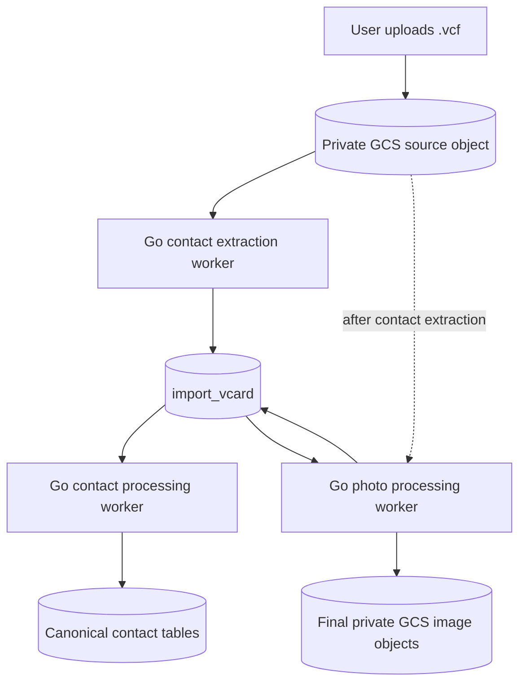

**Status: open work / build from scratch in Go.** The Apple vCard importer uses three asynchronous lanes: store the original upload once, stream its contacts into PostgreSQL staging, then independently process contact data and embedded photos. Photo extraction must not add per-image upload latency to the initial import.

<Note>
  This is a new Go implementation. It does not call or reuse the existing Xano function. The extraction phase should preserve source fidelity and avoid making contact-merge or image-promotion decisions. Normalization, validation, deduplication, canonical contact writes, and final GCS image creation belong in downstream workers.
</Note>

## Import flow



The request handler streams the upload directly to a private GCS staging object and returns an `import_id`. Workers then read that object through `io.Reader`; the complete file never needs to live in application memory. Each `BEGIN:VCARD ... END:VCARD` block becomes one row in `import_vcard`, and every row from the same uploaded file shares the `import_id`.

## Import control record

The staging rows need an import-level control record so the processing worker can distinguish a complete upload from one that stopped halfway through extraction. Use `vcf_imports.id` as `import_vcard.import_id`.

### `vcf_imports`

| Field | PostgreSQL type | Required | Purpose |
| --- | --- | --- | --- |
| `id` | `uuid` | yes | Import identifier generated by the Go upload handler. |
| `user_id` | `bigint` | yes | User who owns the import. |
| `source_filename` | text | yes | Original filename shown to the user. |
| `source_object_key` | text | yes | Generated object-storage key for the original `.vcf`. |
| `status` | text | yes | `uploaded`, `extracting`, `extracted`, `processing`, `completed`, or `failed`. |
| `total_records` | integer | yes | Number of `VCARD` records discovered. Default `0`. |
| `extracted_records` | integer | yes | Rows staged successfully. Default `0`. |
| `warning_records` | integer | yes | Staged rows with parser warnings. Default `0`. |
| `failed_records` | integer | yes | Records that could not be staged. Default `0`. |
| `processed_records` | integer | yes | Rows processed into canonical contacts. Default `0`. |
| `photo_status` | text | yes | Import-level image state: `none`, `pending`, `processing`, `completed`, or `partial_failed`. |
| `photo_records` | integer | yes | Contacts containing at least one `PHOTO`. Default `0`. |
| `processed_photo_records` | integer | yes | Photo-bearing contacts whose image work completed. Default `0`. |
| `failed_photo_records` | integer | yes | Photo-bearing contacts whose image work exhausted retries. Default `0`. |
| `error_summary` | `jsonb` | yes | Import-level errors without full contact payloads. Default `[]`. |
| `extraction_completed_at` | `timestamptz` | no | Set only after EOF and the final staging commit. |
| `processing_completed_at` | `timestamptz` | no | Set after every eligible staging row settles. |
| `photo_processing_completed_at` | `timestamptz` | no | Set after every photo-bearing row is `ready` or permanently `failed`. |
| `source_delete_after` | `timestamptz` | no | Earliest time the private source VCF may be deleted. |
| `source_deleted_at` | `timestamptz` | no | Actual deletion time for the source object. |
| `created_at` | `timestamptz` | generated | Import creation time. |
| `updated_at` | `timestamptz` | generated | Last lifecycle update. |

<Info>
  The second phase may only claim rows whose parent import has `status = extracted`. Commit the last staging batch and the transition to `extracted` in the same database transaction.
</Info>

## Staging table

### `import_vcard`

| Field | PostgreSQL type | Required | Purpose |
| --- | --- | --- | --- |
| `id` | `bigint` identity | generated | Primary key. |
| `created_at` | `timestamptz` | generated | Time the row was extracted. |
| `updated_at` | `timestamptz` | generated | Last modification time. |
| `user_id` | `bigint` | yes | User who owns the uploaded contacts. |
| `import_id` | `uuid` | yes | Stable identifier shared by every row from one upload. Generated by the Go upload handler. |
| `record_index` | integer | yes | Zero- or one-based position of the vCard within the uploaded file. |
| `vcard_version` | text | no | Source version, such as `3.0` or `4.0`. |
| `producer_id` | text | no | Unmodified producer identifier from `PRODID`. |
| `formatted_name` | text | no | Display name from `FN`. |
| `first_name` | text | no | Given-name component of `N`. |
| `middle_name` | text | no | Additional-name component of `N`. |
| `last_name` | text | no | Family-name component of `N`. |
| `name_prefix` | text | no | Honorific or prefix, such as `Dr.`. |
| `name_suffix` | text | no | Suffix, such as `Jr.` or `III`. |
| `nickname` | text | no | Value from `NICKNAME`. |
| `organization` | text | no | Unmodified structured organization value from `ORG`; split organization units during processing. |
| `job_title` | text | no | Job title from `TITLE`. |
| `birthday_raw` | text | no | Unmodified `BDAY` value; validate it during processing. |
| `birthday_omit_year` | boolean | yes | Apple `X-APPLE-OMIT-YEAR` state from the `BDAY` parameters. Default `false`. |
| `note` | text | no | Contact note from `NOTE`. |
| `apple_show_as` | text | no | Apple display mode from `X-ABSHOWAS`, such as `COMPANY`. |
| `emails` | `jsonb` | yes | All email values, type parameters, and preference state. Default `[]`. |
| `phones` | `jsonb` | yes | All phone values, type parameters, and preference state. Default `[]`. |
| `addresses` | `jsonb` | yes | All structured `ADR` values and parameters. Default `[]`. |
| `urls` | `jsonb` | yes | All `URL` values and parameters. Default `[]`. |
| `social_profiles` | `jsonb` | yes | All `X-SOCIALPROFILE` values, types, user IDs, display names, groups, and raw parameters. Default `[]`. |
| `categories` | `text[]` | yes | Categories attached to the vCard. Default `{}`. |
| `has_photo` | boolean | yes | Whether the vCard contains a `PHOTO`. Default `false`. |
| `photo_status` | text | yes | `none`, `pending`, `processing`, `ready`, or `failed`. Default `none`. |
| `photo_metadata` | `jsonb` | yes | Source group, ordinal, encoding, declared type, parameters, and optional URI—never the base64 payload. Default `{}`. |
| `photo_object_key` | text | no | Final private GCS object key after deferred image processing. |
| `photo_url` | text | no | Final image URL when persisted rather than derived from `photo_object_key`. |
| `photo_media_type` | text | no | Media type detected from decoded bytes, such as `image/jpeg`. |
| `photo_attempts` | integer | yes | Number of times the photo row has been claimed. Default `0`. |
| `photo_locked_at` | `timestamptz` | no | Start of the current photo-worker lease. |
| `photo_locked_by` | text | no | Stable identifier for the photo worker holding the lease. |
| `photo_next_attempt_at` | `timestamptz` | no | Earliest retry time after a transient failure. |
| `photo_error` | text | no | Bounded, non-PII image-processing error detail. |
| `photo_processed_at` | `timestamptz` | no | Time the final image object was successfully committed. |
| `sensitive_content_config_raw` | text | no | Unmodified base64 value from `VND-63-SENSITIVE-CONTENT-CONFIG`. |
| `custom_properties` | `jsonb` | yes | Lossless list of properties without a first-class destination. Default `[]`. |
| `raw_vcard` | text | no | Original individual vCard block, excluding large embedded photo data. |
| `record_hash` | text | yes | SHA-256 of a deterministic representation of the source record. |
| `parse_status` | text | yes | `extracted`, `warning`, or `failed`. |
| `parse_warnings` | `jsonb` | yes | Structured nonfatal extraction issues. Default `[]`. |
| `processing_status` | text | yes | `pending`, `processing`, `processed`, or `failed`. |
| `processing_attempts` | integer | yes | Claim count for retry and dead-letter decisions. Default `0`. |
| `processing_locked_at` | `timestamptz` | no | Time the current worker lease began. |
| `processing_locked_by` | text | no | Stable worker or job identifier holding the lease. |
| `next_attempt_at` | `timestamptz` | no | Earliest time a failed row may be retried. |
| `processing_error` | text | no | Error from the second-phase processor. |
| `processed_contact_id` | `bigint` | no | Canonical contact created or matched by the processor. |
| `processed_at` | `timestamptz` | no | Time second-phase processing completed. |

<Warning>
  Do not store base64 photo data or decoded JPEG bytes in PostgreSQL. During contact extraction, mark the row `has_photo = true`, set `photo_status = pending`, capture only bounded metadata, and drain the folded photo property without materializing it. The original private VCF is the durable source until deferred image processing finishes.
</Warning>

## Fast photo storage strategy

The fastest reliable request path performs **one object upload and zero per-photo uploads**. The JPEGs remain embedded in the original VCF until a downstream worker is ready to create final image objects.

### Upload request

1. Generate `import_id` and insert the `vcf_imports` row.
2. Generate a private object key; never derive it from the user-supplied filename.
3. Stream the request body into GCS with a configured byte limit.
4. Close the GCS writer successfully before setting the import to `uploaded` and enqueueing extraction.
5. Return the `import_id`; contact extraction continues asynchronously from the stored object.

```text
vcard-imports/{user_id}/{import_id}/original.vcf
```

Upload first, then parse through a new GCS reader. This intentionally adds a sequential GCS read but guarantees that a complete, retryable source exists even if the parser or worker crashes. A request-path `io.TeeReader` couples source durability to parser behavior and should only be introduced if measurements prove the extra read is a problem.

### Contact extraction

The extractor reads the private source object once and populates `import_vcard`. For a `PHOTO` content line it should:

1. Set `has_photo = true` and `photo_status = pending`.
2. Save only the group, ordinal, `ENCODING`, declared `TYPE`, ordered parameters, and optional URI in `photo_metadata`.
3. Drain folded base64 continuation lines without joining, decoding, or storing them.
4. Continue parsing the next vCard property.

```json
{
  "has_photo": true,
  "photo_status": "pending",
  "photo_metadata": {
    "group": null,
    "ordinal": 0,
    "encoding": "b",
    "declared_type": "JPEG",
    "parameters": [
      {"name": "ENCODING", "value": "b"},
      {"name": "TYPE", "value": "JPEG"}
    ]
  },
  "photo_object_key": null,
  "photo_url": null
}
```

The current `Mark_vCard.vcf` contains 722 contacts: 46 have an embedded base64 photo and 676 do not. Forty-five photos declare `TYPE=JPEG`; one is base64-encoded without a declared type. The downstream worker must therefore inspect decoded bytes instead of trusting the source parameter.

### Deferred Go photo worker

Run image processing after contact processing has produced `processed_contact_id`. Claim photo-bearing rows in deterministic `record_index` order, but read the source VCF **once per import**, not once per contact.

For every `PHOTO` found during that pass:

1. Match it to `import_vcard` by `(import_id, record_index)` and photo ordinal.
2. Unfold the physical lines as a streaming reader.
3. Decode with `base64.NewDecoder`; never create one complete base64 string.
4. Enforce the decoded-byte limit while reading.
5. Buffer only enough leading bytes for content sniffing, then allowlist the detected media type.
6. Stream the decoded bytes to a deterministic private GCS object while calculating SHA-256.
7. Close the GCS writer before setting `photo_status = ready` and publishing the object key or URL.

```text
contact-images/{user_id}/{processed_contact_id}/vcard-{import_id}-{record_index}.jpg
```

The core streaming shape is:

```go
decoded := base64.NewDecoder(base64.StdEncoding, photoValueReader)
limited := io.LimitReader(decoded, maxPhotoBytes+1)

prefix := make([]byte, 512)
n, readErr := io.ReadFull(limited, prefix)
if readErr != nil && readErr != io.ErrUnexpectedEOF {
    return readErr
}

mediaType := http.DetectContentType(prefix[:n])
if !allowedImageType(mediaType) {
    return ErrUnsupportedPhotoType
}

source := io.MultiReader(bytes.NewReader(prefix[:n]), limited)
hash := sha256.New()
objectWriter.ContentType = mediaType

written, err := io.CopyBuffer(
    objectWriter,
    io.TeeReader(source, hash),
    copyBuffer,
)
```

After the copy, reject `written > maxPhotoBytes`, close the object writer, and only then commit `photo_object_key`, `photo_media_type`, `photo_processed_at`, and `photo_status = ready`. A failed or partial GCS write must never produce a ready database row.

<Info>
  Prefer storing the private `photo_object_key` and deriving an authenticated or CDN URL at read time. If `photo_url` is persisted, write it only after the final object exists. Do not make the staging bucket or source VCF public.
</Info>

### Idempotency and retries

- Use a deterministic final object key or a GCS generation precondition so retrying a job cannot create duplicate images.
- Claim rows with a short database lease, increment `photo_attempts`, and use `photo_next_attempt_at` for exponential backoff.
- Reclaim rows left `processing` past the lease timeout.
- Mark permanent validation failures `failed`, retain a bounded `photo_error`, and increment `vcf_imports.failed_photo_records`.
- Keep contact `processing_status` separate from `photo_status`; an image failure must not roll back an otherwise valid contact import.
- Set the import-level `photo_status = completed` only when every photo-bearing row is `ready`; use `partial_failed` when terminal failures remain.

### Source retention

The source VCF is the only copy of pending image data, so it cannot be deleted while retryable photo rows remain.

- Set `source_delete_after` only after contact extraction has completed and every photo row is `ready` or permanently `failed`.
- Start with a 30-day retention window after photo processing settles.
- Delete through a controlled cleanup job that records `source_deleted_at`.
- Use a bucket lifecycle age rule only as a backstop; its minimum age must exceed the maximum worker retry and incident-recovery window.
- Never retry photo processing after `source_deleted_at` without requiring the user to upload the VCF again.

## Repeatable field shapes

Emails, phones, addresses, URLs, and social profiles can each appear more than once. Preserve them as object lists instead of creating numbered columns such as `phone_1` and `phone_2`.

```json
{
  "emails": [
    {
      "group": "item1",
      "raw_value": "jane@example.com",
      "value": "jane@example.com",
      "types": ["internet", "home"],
      "preferred": true,
      "label": "Other",
      "parameters": [
        {"name": "type", "value": "INTERNET"},
        {"name": "type", "value": "HOME"},
        {"name": "type", "value": "pref"}
      ]
    }
  ],
  "phones": [
    {
      "group": null,
      "raw_value": "+14155550123",
      "value": "+14155550123",
      "types": ["cell", "voice"],
      "preferred": true,
      "label": null,
      "parameters": [
        {"name": "type", "value": "CELL"},
        {"name": "type", "value": "VOICE"},
        {"name": "type", "value": "pref"}
      ]
    }
  ]
}
```

Keep phone numbers and birthdays in their source form during extraction. The processor can later produce E.164 phone numbers, validated dates, normalized email addresses, and canonical type labels without losing the imported value.

### Address object

The vCard `ADR` property is ordered as `PO box;extended;street;locality;region;postal code;country`. Store both the original value and its extracted components.

```json
{
  "group": "item1",
  "raw_value": ";;123 Main St;New York;NY;10001;USA",
  "value": ";;123 Main St;New York;NY;10001;USA",
  "types": ["home"],
  "preferred": false,
  "label": null,
  "apple_country_code": "us",
  "parameters": [
    {"name": "type", "value": "HOME"}
  ],
  "po_box": null,
  "extended": null,
  "street": "123 Main St",
  "city": "New York",
  "region": "NY",
  "postal_code": "10001",
  "country": "USA"
}
```

Apple grouped properties must be joined by their group prefix. For example, `item1.EMAIL` plus `item1.X-ABLabel` becomes one email object with `group = item1` and its decoded `label`; `item1.ADR` plus `item1.X-ABADR` becomes one address object with `apple_country_code`.

### Social profile object

```json
{
  "group": null,
  "raw_value": "x-apple:U0123456789",
  "value": "x-apple:U0123456789",
  "type": "slack",
  "user_id": "U0123456789",
  "display_name": "Example Person",
  "parameters": [
    {"name": "type", "value": "Slack"},
    {"name": "x-userid", "value": "U0123456789"},
    {"name": "x-displayname", "value": "Example Person"}
  ]
}
```

### Custom property object

`custom_properties` is the lossless compatibility lane for future or vendor-specific fields that are not yet represented by a first-class column. It must be a list because a property can repeat.

```json
{
  "group": "item3",
  "name": "X-EXAMPLE",
  "raw_name": "X-Example",
  "raw_value": "unmodified source value",
  "value": "decoded source value",
  "parameters": [
    {"name": "TYPE", "value": "work"}
  ]
}
```

## `Mark_vCard.vcf` coverage audit

The current source file contains **722 vCard 3.0 records** and 18 distinct property names. Every observed property and parameter now has an explicit destination in `import_vcard`.

| Source property | Occurrences | `import_vcard` destination | Mapping notes |
| --- | ---: | --- | --- |
| `VERSION` | 722 | `vcard_version` | Every current record is `3.0`. |
| `PRODID` | 722 | `producer_id` | Preserve the full producer string. |
| `N` | 722 | Name columns | Split as family, given, additional, prefix, suffix while retaining `raw_vcard`. |
| `FN` | 720 | `formatted_name` | Nullable because two source records omit it. |
| `ORG` | 561 | `organization` | Preserve the structured raw value; split units in phase two. |
| `TITLE` | 156 | `job_title` | Decode vCard escaping after parsing. |
| `BDAY` | 2 | `birthday_raw`, `birthday_omit_year` | Map `X-APPLE-OMIT-YEAR` to the boolean; do not treat Apple's placeholder year as a known birth year. |
| `NOTE` | 8 | `note` | Preserve decoded text; raw source remains recoverable. |
| `EMAIL` | 610 | `emails[]` | Preserve group, value, repeated `TYPE` parameters, preference, and joined Apple label. |
| `TEL` | 242 | `phones[]` | Preserve group, unnormalized value, all `TYPE` values, preference, and joined Apple label. |
| `ADR` | 59 | `addresses[]` | Preserve group, raw value, all structured components, types, preference, label, and Apple country code. |
| `URL` | 4 | `urls[]` | Preserve group, raw value, all `TYPE` values, preference, and joined Apple label. |
| `PHOTO` | 46 | `has_photo`, `photo_status`, `photo_metadata`; later `photo_object_key`, `photo_media_type`, `photo_url` | During extraction, retain metadata only and leave the image embedded in the private source VCF. The deferred worker decodes and uploads it. |
| `X-SOCIALPROFILE` | 21 | `social_profiles[]` | Preserve `TYPE`, `X-USERID`, `X-DISPLAYNAME`, group, raw URI, and decoded value. |
| `X-ABLABEL` | 5 | Matching repeatable object's `label` | Join to `EMAIL`, `TEL`, `ADR`, or `URL` by the shared `itemN` group; retain unmatched labels in `custom_properties`. |
| `X-ABADR` | 3 | Matching `addresses[].apple_country_code` | Join to `ADR` by the shared `itemN` group; retain an unmatched value in `custom_properties`. |
| `X-ABSHOWAS` | 27 | `apple_show_as` | Current value is `COMPANY`. |
| `VND-63-SENSITIVE-CONTENT-CONFIG` | 8 | `sensitive_content_config_raw` | Preserve the base64 Apple binary-plist payload without decoding it during extraction. |

Observed parameters are also covered: `TYPE` maps to each repeatable object's ordered `parameters`, normalized `types`, and `preferred`; `PHOTO.ENCODING` maps to `photo_metadata.encoding`; `BDAY.X-APPLE-OMIT-YEAR` maps to `birthday_omit_year`; and social-profile `X-USERID` / `X-DISPLAYNAME` map to the corresponding social-profile fields.

<Note>
  No parsed content line may be silently dropped. If a future upload introduces a property or parameter that is not in the explicit mapping registry, append its complete group, name, ordered parameters, raw value, and decoded value to `custom_properties` and add an `unknown_property` parse warning. This makes the importer forward-compatible without blocking the upload.
</Note>

## Constraints and indexes

Add these constraints after creating the table:

| Definition | Purpose |
| --- | --- |
| Unique `(user_id, import_id, record_index)` | Prevents the same source record from being staged twice. |
| Index `(user_id, import_id)` | Fetches one user's complete upload efficiently. |
| Index `(import_id, processing_status, next_attempt_at)` | Supports batch workers claiming eligible pending records. |
| Index `(import_id, photo_status, photo_next_attempt_at)` | Supports deferred photo claims and retries. |
| Index `(user_id, record_hash)` | Supports idempotency and duplicate review. |

`record_hash` should not automatically decide that two people are the same. Use it to detect an exact replay of an extracted record; semantic contact matching belongs in the second phase.

## Go developer notes

### Stream the input

- Parse from an `io.Reader`; do not load the complete upload into memory.
- Accept both CRLF and LF input. Treat an unterminated final physical line as valid input if the record otherwise closes correctly.
- Read physical lines first, then unfold them. A physical line beginning with a single space or tab continues the previous content line; remove that first whitespace character while joining.
- Do not rely on the default `bufio.Scanner` token limit after unfolding. A base64 `PHOTO` becomes one very large logical content line. Use a buffered reader or explicitly configured bounds.
- Maintain an incremental SHA-256 while reading each record. For `record_hash`, normalize line endings to `\n`, preserve property order and values, and include the folded photo payload while draining it; do not retain that payload in the staging row.
- Insert staging rows in bounded batches. After EOF, commit the final rows and change `vcf_imports.status` to `extracted` atomically.

### Parse content lines carefully

A content line has the general shape `[group.]NAME;PARAM=VALUE:property value`. The parser must not use a plain `strings.Split` for the whole line.

- Treat property names, parameter names, and standard type tokens as case-insensitive.
- Find delimiters with an escape- and quote-aware scanner. Colons, semicolons, and commas may occur in quoted parameters or escaped values.
- Support repeated parameters. Apple commonly emits values such as `EMAIL;type=INTERNET;type=HOME;type=pref:` rather than one combined `TYPE` parameter.
- Preserve the optional group prefix. Apple uses grouped properties such as `item1.TEL` together with `item1.X-ABLabel` to attach a custom label to the phone number.
- Decode vCard escapes only after structural splitting: `\\n` or `\\N`, `\\,`, `\\;`, and `\\\\`.
- Parse `N` in the order `family;given;additional;prefix;suffix` and `ADR` in the order `PO box;extended;street;locality;region;postal code;country`.
- Preserve unknown properties and every `X-*` property in `custom_properties`, including their group, parameters, raw value, and decoded value.
- Keep source values during extraction. Unicode normalization, phone formatting, lowercasing emails, and date validation belong in phase two.

### Apple and legacy compatibility

- Apple vCard 3.0 exports may use lowercase parameter names, repeated `type` parameters, folded base64 photos, and nonstandard `X-AB*` properties.
- Recognize `ENCODING=b` and `ENCODING=BASE64` as deferred-photo metadata. The contact extractor drains the payload without decoding it; only the photo worker streams decoded bytes to final object storage and enforces the decoded-byte limit.
- A `PHOTO` value may also be a URI. Preserve it in `photo_metadata` but do not fetch it during extraction; deferring remote retrieval avoids server-side request forgery and keeps phase one deterministic. Any later remote fetch requires an explicit allowlist and network policy.
- Support vCard 3.0 and 4.0 directly. If vCard 2.1 is accepted, add explicit handling for quoted-printable values and declared character sets; do not silently interpret unknown encodings as UTF-8.
- An invalid optional property should normally produce a structured warning, not discard the entire contact. Missing `BEGIN:VCARD`, missing `END:VCARD`, or exceeding a safety limit is a record-level failure.

### Resource and security limits

Make all limits configuration values and return specific error codes when one is exceeded:

| Limit | Why it matters |
| --- | --- |
| Upload bytes | Prevents unbounded object and parser work. |
| Contacts per upload | Protects database and worker capacity. |
| Physical line bytes | Bounds malformed inputs before unfolding. |
| Logical property bytes | Bounds extremely large unfolded values. |
| Properties per contact | Prevents pathological records. |
| Decoded photo bytes | Enforced by the photo worker to prevent base64 expansion and image bombs. |
| Warning count per contact | Keeps error payloads bounded. |

Never build an object key or local path directly from `source_filename`; retain the filename only as display metadata. Keep the original VCF and final images private, sniff decoded image bytes, allowlist accepted image types, and do not trust the vCard `TYPE` parameter alone.

Contacts are sensitive user data. Logs and traces should contain `user_id`, `import_id`, `record_index`, status, timings, byte counts, and error codes—but not names, emails, phone numbers, addresses, `raw_vcard`, or decoded photo bytes.

### Concurrency and retries

- Make extraction idempotent with the unique `(user_id, import_id, record_index)` constraint. A retry may safely use `INSERT ... ON CONFLICT DO NOTHING` and then verify the stored `record_hash`.
- Claim processing rows in a short transaction with `FOR UPDATE SKIP LOCKED`, set the lease fields, and commit before doing slower normalization or matching work.
- Increment `processing_attempts` on every claim. Use exponential backoff through `next_attempt_at` and define a maximum-attempt dead-letter policy.
- Reclaim `processing` rows whose `processing_locked_at` is older than the worker lease duration. A crashed Go process must not leave a contact permanently stuck.
- Make the canonical write and the staging-row completion update one transaction when both live in the same PostgreSQL database.
- Pass `context.Context` through upload, object-storage, database, and worker calls, and stop cleanly on cancellation without marking a partial import as extracted.

### Suggested package boundaries

```text
internal/vcard/
  reader.go       # physical lines, unfolding, BEGIN/END record boundaries
  contentline.go  # group, property, parameters, and value parsing
  decode.go       # escaping, quoted-printable, charset, and base64 handling
  card.go         # parsed source model
  limits.go       # parser and media safety limits

internal/contactimport/
  upload.go       # import row and original-object creation
  extract.go      # vCard -> staging rows
  process.go      # staging rows -> canonical contacts
  photo_worker.go # one-pass deferred photo extraction and final GCS writes
  repository.go   # transactions, batch insert, claims, leases, and retries
```

Keep the source parser independent of database models. That allows parser fixtures and fuzz tests to run without PostgreSQL and avoids mixing vCard decoding with contact-matching policy.

### Test coverage

- Use table-driven golden tests for synthetic vCard 2.1, 3.0, and 4.0 fixtures.
- Include CRLF and LF files, folded fields, escaped separators, quoted parameters, repeated `TYPE`, grouped `itemN` properties, multiple emails/phones/addresses, Unicode names, quoted-printable text, and base64 photos.
- Add malformed and boundary fixtures for missing terminators, invalid base64, oversized values, excessive properties, and unsupported encodings.
- Verify contact extraction never decodes or persists photo payloads and still computes deterministic record hashes.
- Test one-pass photo processing for zero, one, and many photos; missing declared types; decoded-size overflow; content-type mismatch; partial GCS writes; idempotent retries; and source deletion.
- Fuzz the physical-line reader, content-line parser, unescape logic, and structured `N`/`ADR` splitting. A random input must never panic or allocate beyond configured limits.
- Run worker tests with duplicate deliveries, concurrent claims, expired leases, cancellation, and failure between the canonical write and staging update.
- Do not commit a real user's exported vCard as a test fixture. Build synthetic fixtures with nonproduction names and contact details.

## Processing rules

Only start second-phase processing after extraction for the entire `import_id` has completed successfully or the user has accepted any row-level warnings.

The processor should:

1. Claim eligible `pending` rows in bounded batches, increment `processing_attempts`, and set the processing lease.
2. Normalize names, emails, phone numbers, addresses, URLs, and dates.
3. Match or create the canonical person/contact.
4. Write repeatable fields to the appropriate canonical facet tables.
5. Set `processed_contact_id`, `processed_at`, and `processing_status = processed`.
6. On failure, set `processing_status = failed` and retain a useful `processing_error` for retry.

Contact completion and photo completion are independent. `vcf_imports.status = completed` means the core contact import settled; `vcf_imports.photo_status` separately reports whether deferred images are pending, complete, or partially failed.
