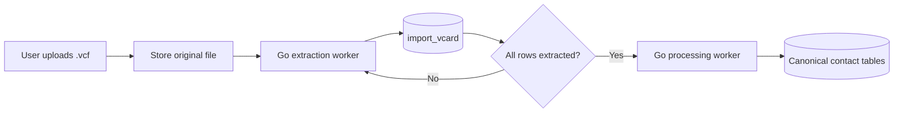

**Status: open work / build from scratch in Go.** The Apple vCard importer uses two separate phases: first a Go extractor streams every contact from an uploaded `.vcf` file into PostgreSQL staging, then a separate Go processor converts the completed import into canonical contact records.

<Note>
  This is a new Go implementation. It does not call or reuse the existing Xano function. The extraction phase should preserve source fidelity and avoid making contact-merge decisions. Normalization, validation, deduplication, and writes to canonical contact tables belong in the processing phase.
</Note>

## Import flow



Each `BEGIN:VCARD ... END:VCARD` block becomes one row in `import_vcard`. Every row from the same uploaded file shares an `import_id`.

## Import control record

The staging rows need an import-level control record so the processing worker can distinguish a complete upload from one that stopped halfway through extraction. Use `vcf_imports.id` as `import_vcard.import_id`.

### `vcf_imports`

| Field | PostgreSQL type | Required | Purpose |
| --- | --- | --- | --- |
| `id` | `uuid` | yes | Import identifier generated by the Go upload handler. |
| `user_id` | `bigint` | yes | User who owns the import. |
| `source_filename` | text | yes | Original filename shown to the user. |
| `source_object_key` | text | yes | Generated object-storage key for the original `.vcf`. |
| `status` | text | yes | `uploaded`, `extracting`, `extracted`, `processing`, `completed`, or `failed`. |
| `total_records` | integer | yes | Number of `VCARD` records discovered. Default `0`. |
| `extracted_records` | integer | yes | Rows staged successfully. Default `0`. |
| `warning_records` | integer | yes | Staged rows with parser warnings. Default `0`. |
| `failed_records` | integer | yes | Records that could not be staged. Default `0`. |
| `processed_records` | integer | yes | Rows processed into canonical contacts. Default `0`. |
| `error_summary` | `jsonb` | yes | Import-level errors without full contact payloads. Default `[]`. |
| `extraction_completed_at` | `timestamptz` | no | Set only after EOF and the final staging commit. |
| `processing_completed_at` | `timestamptz` | no | Set after every eligible staging row settles. |
| `created_at` | `timestamptz` | generated | Import creation time. |
| `updated_at` | `timestamptz` | generated | Last lifecycle update. |

<Info>
  The second phase may only claim rows whose parent import has `status = extracted`. Commit the last staging batch and the transition to `extracted` in the same database transaction.
</Info>

## Staging table

### `import_vcard`

| Field | PostgreSQL type | Required | Purpose |
| --- | --- | --- | --- |
| `id` | `bigint` identity | generated | Primary key. |
| `created_at` | `timestamptz` | generated | Time the row was extracted. |
| `updated_at` | `timestamptz` | generated | Last modification time. |
| `user_id` | `bigint` | yes | User who owns the uploaded contacts. |
| `import_id` | `uuid` | yes | Stable identifier shared by every row from one upload. Generated by the Go upload handler. |
| `record_index` | integer | yes | Zero- or one-based position of the vCard within the uploaded file. |
| `source_filename` | text | yes | Original filename shown to the user. |
| `source_object_key` | text | yes | Object-storage key for the original uploaded `.vcf`. |
| `vcard_version` | text | no | Source version, such as `3.0` or `4.0`. |
| `formatted_name` | text | no | Display name from `FN`. |
| `first_name` | text | no | Given-name component of `N`. |
| `middle_name` | text | no | Additional-name component of `N`. |
| `last_name` | text | no | Family-name component of `N`. |
| `name_prefix` | text | no | Honorific or prefix, such as `Dr.`. |
| `name_suffix` | text | no | Suffix, such as `Jr.` or `III`. |
| `nickname` | text | no | Value from `NICKNAME`. |
| `organization` | text | no | Organization value from `ORG`. |
| `job_title` | text | no | Job title from `TITLE`. |
| `birthday_raw` | text | no | Unmodified `BDAY` value; validate it during processing. |
| `note` | text | no | Contact note from `NOTE`. |
| `emails` | `jsonb` | yes | All email values, type parameters, and preference state. Default `[]`. |
| `phones` | `jsonb` | yes | All phone values, type parameters, and preference state. Default `[]`. |
| `addresses` | `jsonb` | yes | All structured `ADR` values and parameters. Default `[]`. |
| `urls` | `jsonb` | yes | All `URL` values and parameters. Default `[]`. |
| `categories` | `text[]` | yes | Categories attached to the vCard. Default `{}`. |
| `photo_object_key` | text | no | Object-storage key for the decoded contact image. |
| `photo_media_type` | text | no | MIME type such as `image/jpeg`. |
| `custom_properties` | `jsonb` | yes | Unrecognized and `X-*` properties. Default `{}`. |
| `raw_vcard` | text | no | Original individual vCard block, excluding large embedded photo data. |
| `record_hash` | text | yes | SHA-256 of a deterministic representation of the source record. |
| `parse_status` | text | yes | `extracted`, `warning`, or `failed`. |
| `parse_warnings` | `jsonb` | yes | Structured nonfatal extraction issues. Default `[]`. |
| `processing_status` | text | yes | `pending`, `processing`, `processed`, or `failed`. |
| `processing_attempts` | integer | yes | Claim count for retry and dead-letter decisions. Default `0`. |
| `processing_locked_at` | `timestamptz` | no | Time the current worker lease began. |
| `processing_locked_by` | text | no | Stable worker or job identifier holding the lease. |
| `next_attempt_at` | `timestamptz` | no | Earliest time a failed row may be retried. |
| `processing_error` | text | no | Error from the second-phase processor. |
| `processed_contact_id` | `bigint` | no | Canonical contact created or matched by the processor. |
| `processed_at` | `timestamptz` | no | Time second-phase processing completed. |

<Warning>
  Do not store an embedded base64 `PHOTO` value in both `raw_vcard` and PostgreSQL. Apple exports can contain large folded image payloads. Store the original uploaded `.vcf` once, stream each decoded contact photo to object storage, save its key in `photo_object_key`, and omit the photo body from the per-contact raw text.
</Warning>

## Repeatable field shapes

Emails, phones, addresses, and URLs can each appear more than once. Preserve them as object lists instead of creating numbered columns such as `phone_1` and `phone_2`.

```json
{
  "emails": [
    {
      "value": "jane@example.com",
      "types": ["internet", "home"],
      "preferred": true
    }
  ],
  "phones": [
    {
      "value": "+14155550123",
      "types": ["cell", "voice"],
      "preferred": true
    }
  ]
}
```

Keep phone numbers and birthdays in their source form during extraction. The processor can later produce E.164 phone numbers, validated dates, normalized email addresses, and canonical type labels without losing the imported value.

### Address object

The vCard `ADR` property is ordered as `PO box;extended;street;locality;region;postal code;country`. Store both the original value and its extracted components.

```json
{
  "value": ";;123 Main St;New York;NY;10001;USA",
  "types": ["home"],
  "preferred": false,
  "po_box": null,
  "extended": null,
  "street": "123 Main St",
  "city": "New York",
  "region": "NY",
  "postal_code": "10001",
  "country": "USA"
}
```

## Constraints and indexes

Add these constraints after creating the table:

| Definition | Purpose |
| --- | --- |
| Unique `(user_id, import_id, record_index)` | Prevents the same source record from being staged twice. |
| Index `(user_id, import_id)` | Fetches one user's complete upload efficiently. |
| Index `(import_id, processing_status, next_attempt_at)` | Supports batch workers claiming eligible pending records. |
| Index `(user_id, record_hash)` | Supports idempotency and duplicate review. |

`record_hash` should not automatically decide that two people are the same. Use it to detect an exact replay of an extracted record; semantic contact matching belongs in the second phase.

## Go developer notes

### Stream the input

- Parse from an `io.Reader`; do not load the complete upload into memory.
- Accept both CRLF and LF input. Treat an unterminated final physical line as valid input if the record otherwise closes correctly.
- Read physical lines first, then unfold them. A physical line beginning with a single space or tab continues the previous content line; remove that first whitespace character while joining.
- Do not rely on the default `bufio.Scanner` token limit after unfolding. A base64 `PHOTO` becomes one very large logical content line. Use a buffered reader or explicitly configured bounds.
- Maintain an incremental SHA-256 while reading each record. For `record_hash`, unfold the record, normalize line endings to `\n`, preserve property order and values, and include the photo payload before sending the decoded image to object storage.
- Insert staging rows in bounded batches. After EOF, commit the final rows and change `vcf_imports.status` to `extracted` atomically.

### Parse content lines carefully

A content line has the general shape `[group.]NAME;PARAM=VALUE:property value`. The parser must not use a plain `strings.Split` for the whole line.

- Treat property names, parameter names, and standard type tokens as case-insensitive.
- Find delimiters with an escape- and quote-aware scanner. Colons, semicolons, and commas may occur in quoted parameters or escaped values.
- Support repeated parameters. Apple commonly emits values such as `EMAIL;type=INTERNET;type=HOME;type=pref:` rather than one combined `TYPE` parameter.
- Preserve the optional group prefix. Apple uses grouped properties such as `item1.TEL` together with `item1.X-ABLabel` to attach a custom label to the phone number.
- Decode vCard escapes only after structural splitting: `\\n` or `\\N`, `\\,`, `\\;`, and `\\\\`.
- Parse `N` in the order `family;given;additional;prefix;suffix` and `ADR` in the order `PO box;extended;street;locality;region;postal code;country`.
- Preserve unknown properties and every `X-*` property in `custom_properties`, including their group, parameters, raw value, and decoded value.
- Keep source values during extraction. Unicode normalization, phone formatting, lowercasing emails, and date validation belong in phase two.

### Apple and legacy compatibility

- Apple vCard 3.0 exports may use lowercase parameter names, repeated `type` parameters, folded base64 photos, and nonstandard `X-AB*` properties.
- Recognize `ENCODING=b` and `ENCODING=BASE64` for photos. Stream decoded bytes to object storage and calculate a byte limit while decoding.
- A `PHOTO` value may also be a URI. Do not fetch remote photo or URL values during extraction; retaining the URI avoids server-side request forgery and keeps phase one deterministic.
- Support vCard 3.0 and 4.0 directly. If vCard 2.1 is accepted, add explicit handling for quoted-printable values and declared character sets; do not silently interpret unknown encodings as UTF-8.
- An invalid optional property should normally produce a structured warning, not discard the entire contact. Missing `BEGIN:VCARD`, missing `END:VCARD`, or exceeding a safety limit is a record-level failure.

### Resource and security limits

Make all limits configuration values and return specific error codes when one is exceeded:

| Limit | Why it matters |
| --- | --- |
| Upload bytes | Prevents unbounded object and parser work. |
| Contacts per upload | Protects database and worker capacity. |
| Physical line bytes | Bounds malformed inputs before unfolding. |
| Logical property bytes | Bounds extremely large unfolded values. |
| Properties per contact | Prevents pathological records. |
| Decoded photo bytes | Prevents base64 expansion and image bombs. |
| Warning count per contact | Keeps error payloads bounded. |

Never build an object key or local path directly from `source_filename`; retain the filename only as display metadata. Sniff decoded image bytes, allowlist accepted image types, and do not trust the vCard `TYPE` parameter alone.

Contacts are sensitive user data. Logs and traces should contain `user_id`, `import_id`, `record_index`, status, timings, byte counts, and error codes—but not names, emails, phone numbers, addresses, `raw_vcard`, or decoded photo bytes.

### Concurrency and retries

- Make extraction idempotent with the unique `(user_id, import_id, record_index)` constraint. A retry may safely use `INSERT ... ON CONFLICT DO NOTHING` and then verify the stored `record_hash`.
- Claim processing rows in a short transaction with `FOR UPDATE SKIP LOCKED`, set the lease fields, and commit before doing slower normalization or matching work.
- Increment `processing_attempts` on every claim. Use exponential backoff through `next_attempt_at` and define a maximum-attempt dead-letter policy.
- Reclaim `processing` rows whose `processing_locked_at` is older than the worker lease duration. A crashed Go process must not leave a contact permanently stuck.
- Make the canonical write and the staging-row completion update one transaction when both live in the same PostgreSQL database.
- Pass `context.Context` through upload, object-storage, database, and worker calls, and stop cleanly on cancellation without marking a partial import as extracted.

### Suggested package boundaries

```text
internal/vcard/
  reader.go       # physical lines, unfolding, BEGIN/END record boundaries
  contentline.go  # group, property, parameters, and value parsing
  decode.go       # escaping, quoted-printable, charset, and base64 handling
  card.go         # parsed source model
  limits.go       # parser and media safety limits

internal/contactimport/
  upload.go       # import row and original-object creation
  extract.go      # vCard -> staging rows
  process.go      # staging rows -> canonical contacts
  repository.go   # transactions, batch insert, claims, leases, and retries
```

Keep the source parser independent of database models. That allows parser fixtures and fuzz tests to run without PostgreSQL and avoids mixing vCard decoding with contact-matching policy.

### Test coverage

- Use table-driven golden tests for synthetic vCard 2.1, 3.0, and 4.0 fixtures.
- Include CRLF and LF files, folded fields, escaped separators, quoted parameters, repeated `TYPE`, grouped `itemN` properties, multiple emails/phones/addresses, Unicode names, quoted-printable text, and base64 photos.
- Add malformed and boundary fixtures for missing terminators, invalid base64, oversized values, excessive properties, and unsupported encodings.
- Fuzz the physical-line reader, content-line parser, unescape logic, and structured `N`/`ADR` splitting. A random input must never panic or allocate beyond configured limits.
- Run worker tests with duplicate deliveries, concurrent claims, expired leases, cancellation, and failure between the canonical write and staging update.
- Do not commit a real user's exported vCard as a test fixture. Build synthetic fixtures with nonproduction names and contact details.

## Processing rules

Only start second-phase processing after extraction for the entire `import_id` has completed successfully or the user has accepted any row-level warnings.

The processor should:

1. Claim eligible `pending` rows in bounded batches, increment `processing_attempts`, and set the processing lease.
2. Normalize names, emails, phone numbers, addresses, URLs, and dates.
3. Match or create the canonical person/contact.
4. Write repeatable fields to the appropriate canonical facet tables.
5. Set `processed_contact_id`, `processed_at`, and `processing_status = processed`.
6. On failure, set `processing_status = failed` and retain a useful `processing_error` for retry.
