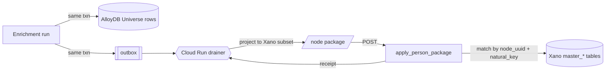

Design reference for the **Orbiter Universe to Orbiter backend** table refactor: the target **Universe (AlloyDB)** shape for each table and the matching **Orbiter backend (Xano)** projection, each shown as its own table with one example record. Sample data: a person facet set for _Jane Doe @ Acme Robotics_ (parent `node_uuid a3f9c2e1…`) and a film entity, _The Matrix_ (`tt0133093`).

<Note>
  **Sync model: projection-with-lock.** The Universe (AlloyDB) is the source of truth; the Orbiter backend (Xano) is a downstream projection. Each enrichment run ships a per-node package. The Orbiter side upserts every child row keyed on `(node_uuid, natural_key)`, skips any row flagged `locked` (user hand-edit), and no-ops when `content_hash` is unchanged.
</Note>

## Identity model

Every Universe row carries **two** identifiers, doing different jobs:

| Column | Type | Generated by | Purpose |
| --- | --- | --- | --- |
| `id` | `bigint` identity | Postgres, automatically on insert (`GENERATED ALWAYS AS IDENTITY`) | physical primary key, fast local joins. **Per-system** — a Universe `id` never crosses into Xano |
| `node_uuid` | `uuid` | once at node creation (`gen_random_uuid()` or the graph layer) | the canonical **Universe = graph** identity, shared across AlloyDB, FalkorDB, and the Xano projection |

Which `node_uuid` a row carries depends on whether the thing is a **graph node**:

- **Entities / nodes** — `master_person`, `master_company`, `film_tv`, `film_tv_award` — carry their **own** `node_uuid`.
- **Attribute facets** — `master_email`, `master_phone`, `master_link`, `master_address` — are _not_ nodes; they carry the **parent entity's** `node_uuid` (one column replaces both `master_person_id` and `master_company_id`) and are identified by `(node_uuid, natural_key)`.

Rule of thumb: _is it a graph node?_ then it gets its own `node_uuid`; _is it a plain attribute of a node?_ then it carries the parent's. `film_tv_award` is both — a node (own `node_uuid`) **and** an edge-like link that references the film's and the person's `node_uuid`s.

### Column tags

- **Universe-only** — enrichment internals that stay in AlloyDB and are _not_ projected: `confidence`, `peak_confidence`, `evidence`, `first_seen_at`, `last_seen_at`, `geohash`, `match_embedding`, `embedding`. (`id` is also effectively per-system — same column name in Xano, different value space.)
- **Added to Orbiter** — four sync-machinery columns added to every Xano table: `natural_key`, `content_hash`, `source_run_id`, `locked` (plus optional `place_id` on addresses).
- Everything else is **shared** — including `node_uuid` (entities already carry it in Xano; facet tables would need it added, or resolved on apply).

---

## Entity tables

Nodes with their own `node_uuid`. `id` stays a `bigint` identity PK.

### film\_tv

Xano table `film_tv` (#395) — the master entity for a film/TV title; it **already carries `node_uuid`**, so it follows the same pattern as person/company. Natural key = the IMDB id parsed from `imdb_url` (e.g. `tt0133093`). On the AlloyDB port, Xano "list" fields become `text[]` and `json` fields become `jsonb`.

#### Universe (AlloyDB)

| id | node\_uuid | natural\_key | title | type | year | imdb\_url | image\_url | tagline | description | genres | countries | languages | imdb\_rating | running\_time | mpaa\_rating | directors | writers | official\_site | markdown | json | source | enriched\_at | cascade\_depth | enrich\_success | embedding | content\_hash | source\_run\_id | locked |
| --- | --- | --- | --- | --- | --- | --- | --- | --- | --- | --- | --- | --- | --- | --- | --- | --- | --- | --- | --- | --- | --- | --- | --- | --- | --- | --- | --- | --- |
| 1 | `b2f4a6c8-1d3e-4f5a-9b7c-0e2d4f6a8c10` | `tt0133093` | The Matrix | movie | 1999 | `https://www.imdb.com/title/tt0133093/` | `https://m.media-amazon.com/...M5.jpg` | Welcome to the Real World | A hacker discovers reality is a simulation. | `{Action,Sci-Fi}` | `{USA}` | `{English}` | 8.7 | 136 min | R | `[{"name":"Lana Wachowski"},{"name":"Lilly Wachowski"}]` | `[{"name":"Lana Wachowski"}]` | `[{"url":"https://..."}]` | `# The Matrix ...` | `{...}` | imdb | 2026-06-15T10:00Z | 0 | true | `[0.02, 0.04, ...]` | `sha256:9ac1b3` | `enr_2026_07_08_film` | false |

#### Orbiter backend (Xano)

| id | created\_at | updated\_at | node\_uuid | image\_url | title | imdb\_url | type | tagline | description | genres | year | imdb\_rating | running\_time | mpaa\_rating | writers | countries | languages | official\_site | directors | markdown | json | source | enriched\_at | cascade\_depth | enrich\_success | natural\_key | content\_hash | source\_run\_id | locked |
| --- | --- | --- | --- | --- | --- | --- | --- | --- | --- | --- | --- | --- | --- | --- | --- | --- | --- | --- | --- | --- | --- | --- | --- | --- | --- | --- | --- | --- | --- |
| 4021 | 2026-06-15T10:00Z | 2026-07-08T14:03Z | `b2f4a6c8-1d3e-4f5a-9b7c-0e2d4f6a8c10` | `https://m.media-amazon.com/...M5.jpg` | The Matrix | `https://www.imdb.com/title/tt0133093/` | movie | Welcome to the Real World | A hacker discovers reality is a simulation. | `{Action,Sci-Fi}` | 1999 | 8.7 | 136 min | R | `[{"name":"Lana Wachowski"}]` | `{USA}` | `{English}` | `[{"url":"https://..."}]` | `[{"name":"Lana Wachowski"},{"name":"Lilly Wachowski"}]` | `# The Matrix ...` | `{...}` | imdb | 2026-06-15T10:00Z | 0 | true | `tt0133093` | `sha256:9ac1b3` | `enr_2026_07_08_film` | false |

### film\_tv\_award

Xano table `film_tv_award` (#396). An award is its **own** node _and_ links a film to a person. In Xano it links by integer FKs (`film_tv_id`, `imdb_person_id`); in the Universe it links by `node_uuid`, and the projection maps those back to the Xano ids. Natural key = a hash of the award identity (`project_imdb_url` \+ year \+ type \+ description).

#### Universe (AlloyDB)

| id | node\_uuid | film\_node\_uuid | person\_node\_uuid | year | award\_type | award\_description | nominee\_or\_winner | shared\_with | project\_title | project\_imdb\_url | natural\_key | content\_hash | source\_run\_id | locked |
| --- | --- | --- | --- | --- | --- | --- | --- | --- | --- | --- | --- | --- | --- | --- |
| 1 | `c3a5b7d9-2e4f-4a6b-8c0d-1f3a5b7d9e20` | `b2f4a6c8-1d3e-4f5a-9b7c-0e2d4f6a8c10` | `e5f7a9c1-3b5d-4e7f-9a1b-2c4d6e8f0a30` | 2000 | Academy Award | Best Film Editing | winner | `{}` | The Matrix | `https://www.imdb.com/title/tt0133093/` | `sha256:4b8e2a` | `sha256:1c2d3e` | `enr_2026_07_08_film` | false |

#### Orbiter backend (Xano)

| id | created\_at | node\_uuid | year | award\_type | award\_description | nominee\_or\_winner | shared\_with | film\_tv\_id | project\_title | project\_imdb\_url | imdb\_person\_id | natural\_key | content\_hash | source\_run\_id | locked | |-|-|-|-|-|-|-|-|-|-|-|-|-|-|-|-|-| | 90210 | 2026-06-15T10:05Z | `c3a5b7d9-2e4f-4a6b-8c0d-1f3a5b7d9e20` | 2000 | Academy Award | Best Film Editing | winner | `{}` | 4021 | The Matrix | `https://www.imdb.com/title/tt0133093/` | 771 | `sha256:4b8e2a` | `sha256:1c2d3e` | `enr_2026_07_08_film` | false |

---

## Facet tables

Attributes of a person/company node — no own `node_uuid`. Each carries the **parent** `node_uuid` and is keyed on `(node_uuid, natural_key)`. The Orbiter tables are unchanged from today's Xano schema plus the four sync columns.

### master\_email

Xano table `master_email` (#155). Natural key = the normalized `email_address` (Xano already lower-cases and trims it).

#### Universe (AlloyDB)

| id | node\_uuid | email\_address | email\_type | full\_name | active\_status | share\_publicly | connected\_only | orbiter\_verified | data\_source\_id | source | natural\_key | content\_hash | confidence | peak\_confidence | evidence | first\_seen\_at | last\_seen\_at | source\_run\_id | created\_at | updated\_at |
| --- | --- | --- | --- | --- | --- | --- | --- | --- | --- | --- | --- | --- | --- | --- | --- | --- | --- | --- | --- | --- |
| 1 | `a3f9c2e1-6b04-4d8e-8f12-77b0e5c4de84` | `jane.doe@acmerobotics.com` | work | Jane Doe | true | false | false | false | 91 | pdl | `jane.doe@acmerobotics.com` | `sha256:7b21f0` | 0.92 | 0.92 | `[{"src":91}]` | 2026-05-01T09:12Z | 2026-07-08T14:03Z | `enr_2026_07_08_abc` | 2026-05-01T09:12Z | 2026-07-08T14:03Z |

#### Orbiter backend (Xano)

| id | created\_at | updated\_at | master\_person\_id | master\_company\_id | email\_address | email\_type | full\_name | active\_status | share\_publicly | connected\_only | orbiter\_verified | data\_source\_id | created\_by\_user\_id | source | natural\_key | content\_hash | source\_run\_id | locked | |-|-|-|-|-|-|-|-|-|-|-|-|-|-|-|-|-|-|-|-| | 55012 | 2026-05-01T09:12Z | 2026-07-08T14:03Z | 84213 | null | `jane.doe@acmerobotics.com` | work | Jane Doe | true | false | false | false | 91 | null | pdl | `jane.doe@acmerobotics.com` | `sha256:7b21f0` | `enr_2026_07_08_abc` | false |

### master\_phone

Xano table `master_phone` (#151). Pieces stored separately; the Universe computes **E.164** once as `natural_key`.

#### Universe (AlloyDB)

| id | node\_uuid | first\_name | last\_name | phone\_number | country\_calling\_code | local\_display\_phone | phone\_extension | phone\_type | connected\_only | orbiter\_verified | data\_source\_id | source | natural\_key | content\_hash | confidence | peak\_confidence | evidence | first\_seen\_at | last\_seen\_at | source\_run\_id |
| --- | --- | --- | --- | --- | --- | --- | --- | --- | --- | --- | --- | --- | --- | --- | --- | --- | --- | --- | --- | --- |
| 1 | `a3f9c2e1-6b04-4d8e-8f12-77b0e5c4de84` | Jane | Doe | 4155551234 | 1 | (415) 555-1234 | null | mobile | true | false | 94 | enrich\_layer | `+14155551234` | `sha256:c40a9d` | 0.81 | 0.81 | `[{"src":94}]` | 2026-05-01T09:12Z | 2026-07-08T14:03Z | `enr_2026_07_08_abc` |

#### Orbiter backend (Xano)

| id | created\_at | updated\_at | master\_person\_id | master\_company\_id | first\_name | last\_name | phone\_number | country\_calling\_code | local\_display\_phone | phone\_extension | phone\_type | connected\_only | orbiter\_verified | data\_source\_id | created\_by\_user\_id | source | natural\_key | content\_hash | source\_run\_id | locked | |-|-|-|-|-|-|-|-|-|-|-|-|-|-|-|-|-|-|-|-|-|-| | 33188 | 2026-05-01T09:12Z | 2026-07-08T14:03Z | 84213 | null | Jane | Doe | 4155551234 | 1 | (415) 555-1234 | null | mobile | true | false | 94 | null | enrich\_layer | `+14155551234` | `sha256:c40a9d` | `enr_2026_07_08_abc` | false |

### master\_link

Xano table `master_link` (#166). Natural key = canonical URL (lower-case host, drop scheme, `www.`, trailing slash, and `utm_*`).

#### Universe (AlloyDB)

| id | node\_uuid | service | service\_label | icon\_url | link\_url | profile | data\_source\_id | source | natural\_key | content\_hash | confidence | evidence | first\_seen\_at | last\_seen\_at | source\_run\_id |
| --- | --- | --- | --- | --- | --- | --- | --- | --- | --- | --- | --- | --- | --- | --- | --- |
| 1 | `a3f9c2e1-6b04-4d8e-8f12-77b0e5c4de84` | linkedin | LinkedIn | `https://cdn.orbiter.io/icons/linkedin.svg` | `https://www.linkedin.com/in/janedoe/` | true | 101 | exa | `linkedin.com/in/janedoe` | `sha256:1f8e3c` | 0.99 | `[{"src":101}]` | 2026-05-01T09:12Z | 2026-07-08T14:03Z | `enr_2026_07_08_abc` |

#### Orbiter backend (Xano)

| id | created\_at | updated\_at | master\_person\_id | master\_company\_id | service | service\_label | icon\_url | link\_url | data\_source\_id | created\_by\_user\_id | profile | source | natural\_key | content\_hash | source\_run\_id | locked | |-|-|-|-|-|-|-|-|-|-|-|-|-|-|-|-|-|-| | 71204 | 2026-05-01T09:12Z | 2026-07-08T14:03Z | 84213 | null | linkedin | LinkedIn | `https://cdn.orbiter.io/icons/linkedin.svg` | `https://www.linkedin.com/in/janedoe/` | 101 | null | true | exa | `linkedin.com/in/janedoe` | `sha256:1f8e3c` | `enr_2026_07_08_abc` | false |

### master\_address

Xano table `master_address` (#164). Natural key = geocoder `place_id` **or** a hash of the normalized components:

```text
raw        500 Terry A Francois Blvd, San Francisco, CA 94158, USA
canonical  us|94158|ca|san francisco|500 terry a francois blvd|
key        sha256(canonical) = b7d1a2...        (or place_id = ChIJ2eUgeAK6j4AR...)
```

`geohash` and `match_embedding` live in the Universe **only**, as fuzzy candidate-finders for a merge-review queue — never as the key.

#### Universe (AlloyDB)

| id | node\_uuid | address\_label | formatted\_address | unit | number | address\_line\_1 | address\_line\_2 | city | state\_region | region\_code | postal\_code | country | country\_code | latitude | longitude | timezone | mailing\_address | connected\_only | data\_source\_id | source | natural\_key | place\_id | geohash | match\_embedding | content\_hash | confidence | evidence | first\_seen\_at | last\_seen\_at | source\_run\_id |
| --- | --- | --- | --- | --- | --- | --- | --- | --- | --- | --- | --- | --- | --- | --- | --- | --- | --- | --- | --- | --- | --- | --- | --- | --- | --- | --- | --- | --- | --- | --- |
| 1 | `a3f9c2e1-6b04-4d8e-8f12-77b0e5c4de84` | HQ | 500 Terry A Francois Blvd, San Francisco, CA 94158, USA | null | 500 | Terry A Francois Blvd | null | San Francisco | California | CA | 94158 | United States | US | 37.7706 | -122.3892 | `America/Los_Angeles` | true | false | 78 | base\_company\_enrich | `sha256:b7d1a2` | `ChIJ2eUgeAK6j4AR` | `9q8yyk8y` | `[0.01, 0.02, ...]` | `sha256:e3aa71` | 0.88 | `[{"src":78}]` | 2026-05-01T09:12Z | 2026-07-08T14:03Z | `enr_2026_07_08_abc` |

#### Orbiter backend (Xano)

| id | created\_at | updated\_at | master\_company\_id | master\_person\_id | address\_label | formatted\_address | unit | number | address\_line\_1 | address\_line\_2 | city | state\_region | region\_code | postal\_code | country | country\_code | connected\_only | mailing\_address | data\_source\_id | longitude | latitude | timezone | path\_triples\_added | created\_by\_user\_id | source | natural\_key | place\_id | content\_hash | source\_run\_id | locked | |-|-|-|-|-|-|-|-|-|-|-|-|-|-|-|-|-|-|-|-|-|-|-|-|-|-|-|-|-|-|-|-| | 20933 | 2026-05-01T09:12Z | 2026-07-08T14:03Z | null | 84213 | HQ | 500 Terry A Francois Blvd, San Francisco, CA 94158, USA | null | 500 | Terry A Francois Blvd | null | San Francisco | California | CA | 94158 | United States | US | false | true | 78 | -122.3892 | 37.7706 | `America/Los_Angeles` | false | null | base\_company\_enrich | `sha256:b7d1a2` | `ChIJ2eUgeAK6j4AR` | `sha256:e3aa71` | `enr_2026_07_08_abc` | false |

---

## How the sync works

The enrichment engine never writes to Xano directly. Each completed node is shipped as a **package** and applied by a single transactional endpoint on the Orbiter backend.



<Steps>
  <Step title="Enrich + enqueue — one AlloyDB transaction">
    The run writes/updates the node's Universe rows and inserts an `outbox` row `(node_uuid, run_id)` in the **same** Postgres transaction. A crash can never half-sync.
  </Step>
  <Step title="Drain + build the package">
    A Cloud Run drainer polls the outbox, reads the node's current Universe rows, and **projects** them down to the Xano subset (shared columns \+ the four sync columns) — one envelope per node.
  </Step>
  <Step title="POST /enrichment/apply_person_package">
    The drainer sends the envelope. On `2xx` it marks the outbox row done; on error it retries (at-least-once delivery).
  </Step>
  <Step title="Resolve parent + reconcile — one Xano transaction">
    The endpoint resolves the parent by `node_uuid` (Xano's `master_person` / `master_company` / `film_tv` already carry it), then reconciles each collection by `natural_key` (rules below), wrapped in a single DB transaction — all-or-nothing per node.
  </Step>
  <Step title="Return a receipt">
    The response reports created / updated / soft-deleted / skipped counts plus any conflicts, so the drainer can log and alert.
  </Step>
</Steps>

### Reconcile rules

Per collection, for each row keyed on `(node_uuid, natural_key)`:

| Situation | Action |
| --- | --- |
| In package, row exists, **not**`locked` | **Update** in place |
| In package, row exists, `locked = true` | **Skip** — user hand-edit wins |
| In package, no matching row | **Insert** |
| `content_hash` unchanged vs stored | **Skip** — idempotent no-op |
| Row exists, absent from package, `authoritative = true` | **Soft-delete** (`active_status = false`) |
| Row exists, absent from package, `authoritative = false` | **Leave** — additive merge |

`authoritative` is a per-collection flag on the envelope: `true` means "this is the complete set for this node, reconcile deletes"; `false` means "merge these in, touch nothing else."

## Sync package example

One envelope for Jane Doe, keyed on the parent `node_uuid`. Universe-only fields like `confidence` ride along so the Orbiter side _can_ store them if wanted, but only the shared \+ sync columns are actually written.

```json
{
  "schema_version": "1.0",
  "run_id": "enr_2026_07_08_abc",
  "generated_at": "2026-07-08T14:03:00Z",
  "node": {
    "node_uuid": "a3f9c2e1-6b04-4d8e-8f12-77b0e5c4de84",
    "kind": "person"
  },
  "collections": {
    "emails": {
      "authoritative": true,
      "rows": [
        {
          "natural_key": "jane.doe@acmerobotics.com",
          "content_hash": "sha256:7b21f0",
          "email_address": "jane.doe@acmerobotics.com",
          "email_type": "work",
          "full_name": "Jane Doe",
          "active_status": true,
          "data_source_id": 91,
          "source": "pdl",
          "confidence": 0.92
        }
      ]
    },
    "phones": {
      "authoritative": true,
      "rows": [
        {
          "natural_key": "+14155551234",
          "content_hash": "sha256:c40a9d",
          "phone_number": "4155551234",
          "country_calling_code": "1",
          "local_display_phone": "(415) 555-1234",
          "phone_type": "mobile",
          "first_name": "Jane",
          "last_name": "Doe",
          "connected_only": true,
          "data_source_id": 94,
          "source": "enrich_layer",
          "confidence": 0.81
        }
      ]
    },
    "links": {
      "authoritative": true,
      "rows": [
        {
          "natural_key": "linkedin.com/in/janedoe",
          "content_hash": "sha256:1f8e3c",
          "service": "linkedin",
          "service_label": "LinkedIn",
          "icon_url": "https://cdn.orbiter.io/icons/linkedin.svg",
          "link_url": "https://www.linkedin.com/in/janedoe/",
          "profile": true,
          "data_source_id": 101,
          "source": "exa",
          "confidence": 0.99
        }
      ]
    },
    "addresses": {
      "authoritative": false,
      "rows": [
        {
          "natural_key": "sha256:b7d1a2",
          "place_id": "ChIJ2eUgeAK6j4AR",
          "content_hash": "sha256:e3aa71",
          "address_label": "HQ",
          "formatted_address": "500 Terry A Francois Blvd, San Francisco, CA 94158, USA",
          "number": "500",
          "address_line_1": "Terry A Francois Blvd",
          "city": "San Francisco",
          "state_region": "California",
          "region_code": "CA",
          "postal_code": "94158",
          "country": "United States",
          "country_code": "US",
          "latitude": "37.7706",
          "longitude": "-122.3892",
          "timezone": "America/Los_Angeles",
          "mailing_address": true,
          "data_source_id": 78,
          "source": "base_company_enrich",
          "confidence": 0.88
        }
      ]
    }
  }
}
```

Entity nodes (`film_tv`, `film_tv_award`) ship the same way — a package whose `node` block _is_ the entity, its attribute columns projected directly and any child collections (e.g. awards) nested underneath.

## Apply: request then response

**Request** — `POST /enrichment/apply_person_package` with the envelope above.

**Response** — a receipt. Here `emails` and `phones` were new inserts, `links` was an update, and `addresses` was an unchanged no-op (`content_hash` matched):

```json
{
  "run_id": "enr_2026_07_08_abc",
  "node_uuid": "a3f9c2e1-6b04-4d8e-8f12-77b0e5c4de84",
  "applied": {
    "emails":    { "created": 1, "updated": 0, "soft_deleted": 0, "skipped": 0 },
    "phones":    { "created": 1, "updated": 0, "soft_deleted": 0, "skipped": 0 },
    "links":     { "created": 0, "updated": 1, "soft_deleted": 0, "skipped": 0 },
    "addresses": { "created": 0, "updated": 0, "soft_deleted": 0, "skipped": 1 }
  },
  "conflicts": [],
  "locked_skipped": []
}
```

<Note>
  **Idempotency \+ the lock loop.** Re-delivering the same `run_id` is safe — every row whose `content_hash` matches the stored value is skipped (lands in `skipped`), so retries never duplicate. When a user edits a row in the app, set `locked = true`; the apply step then never overwrites it. The clean v2 is to feed that user edit back into AlloyDB as top-tier evidence, so the master re-resolves to the user's value and the next package reaffirms it — at which point the lock becomes optional.
</Note>

## Still open

- **Confirm `node_uuid` is globally stable in the Universe.** Prior notes flag that Xano's `node_uuid` can _repoint per datasource_ — in the source of truth it must be globally unique, or one Universe `node_uuid` maps to several Xano rows.
- **Facet `node_uuid` on the Xano side.** Facet tables key on `master_person_id` today, not `node_uuid`. Either add `node_uuid` to the Xano facet tables, or have the apply endpoint resolve `node_uuid → master_person_id` via `master_person` before matching.
- **Address key:** decide `place_id` (needs a geocode step) vs. component hash.
- **Next artifacts:** AlloyDB `CREATE TABLE` DDL (entities \+ facets, `bigint` identity PKs, native `uuid` / `text[]` / `jsonb`), `ALTER TABLE` adding the four sync columns on the Xano side, and the `apply_person_package` endpoint contract.