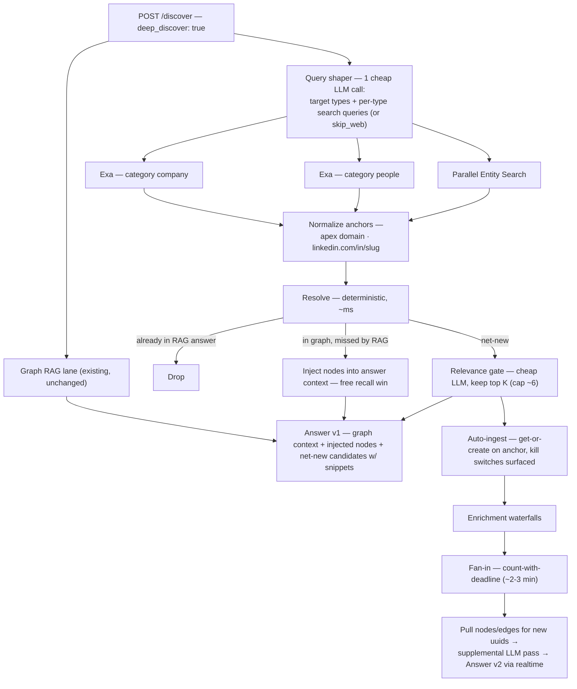

**Status: scope locked 2026-08-18; Phase 0 test harness LIVE in Xano** — function `deep_discover/test_search` #13373 + log table `deep_discover_test_run` 785 (workspace 3). Nothing user-facing is deployed. This page was scoped from scratch on its merits — it shares the anchor contract and resolution discipline with [Discover Deep Research](/guides/open-work/discover-deep-research) (the Kimi K2.6 swarm plan), but it is a different animal: that plan is a minutes-long research swarm triggered on a Discover *miss*; Deep Discover is a **seconds-long entity-search pass that runs in parallel with graph RAG on every query where the user opts in**. The swarm remains the escalation tier ("research deeper"), not the v1.

## The shape of the feature

When a user selects **Deep Discover** on a Discover query, the query runs down two lanes at once:

1. The existing graph-RAG lane — Cypher context from the Universe graph, LLM answer — unchanged.
2. A web lane — the same natural-language query goes to entity-search APIs that return **companies with domains and people with LinkedIn URLs**, in seconds.

Web results are deduped against the graph lane deterministically (domain / LinkedIn slug are exact keys). Whatever survives is relevant *and* net-new: it renders as entity cards, auto-ingests through the existing entry points, enriches through the waterfalls, and a supplemental LLM pass folds the newly-landed nodes and edges back into the answer.

## The problem, decomposed

1. **Discover an entity set from an arbitrary NL query** — in seconds, because it runs parallel to graph RAG on an interactive request.
2. **Return anchors, not prose** — a company is a name + apex domain; a person is a LinkedIn URL. An entity without its anchor can't be deduped or ingested, so it doesn't exist.
3. **Dedupe deterministically** against the Universe result — no LLM needed; anchors are exact keys.
4. **Ingest → enrich → re-query** is inherently async (enrichment takes minutes), so the answer is two-phase no matter which tool wins.

That framing decides the provider question almost by itself: this isn't "web search," it's **entity search**, and as of 2026 two providers sell exactly that primitive.

## Provider verdict

Surveyed 2026-08-18. Pricing and latency figures checked against vendor pages the same day.

| Provider | Latency | Cost / query | Output shape | Verdict |
| --- | --- | --- | --- | --- |
| **Parallel.ai Entity Search** (FindAll API) | < 3 s, synchronous | $0.005 per request (100 results included) | Structured people + companies from a plain-language description — purpose-built for exactly this task | ✅ **Primary.** Spec-match. Risk: public beta, 30-day breaking-change notice — keep behind an adapter |
| **Exa** (category `company` / `people`) | ~1 s | $7 / 1k searches (× 2 categories ≈ $0.014 / query) | The result URL *is* the anchor (homepage → domain, `linkedin.com/in` → person); 1B+ LinkedIn profiles, 50M+ companies indexed | ✅ **Primary.** NL-native neural search, stable API, already integrated at Orbiter |
| **Serper.dev** | 1–2 s | $0.30–1.00 / 1k | Raw Google SERP — needs `site:linkedin.com/in` query engineering + an extraction pass | 🔧 **Gap-filler only** — e.g. one targeted query to find the LinkedIn URL for a person surfaced without one |
| **Firecrawl /search** | 2–5 s | ~$0.02–0.03 | Search + full page content | ❌ Skip — its differentiator is *content*, but discovery only needs anchors; the enrichment waterfalls already own content |
| **Kimi K2.6 swarm** | minutes | $0.10–0.50 | Multi-hop research, highest reasoning quality | ⏫ Wrong latency class for the parallel pass; right *escalation tier*. It is orchestration, not an index — it would call Exa/Serper underneath anyway |
| Tavily / Linkup / Perplexity Sonar | ~1 s | ~$0.005–0.01 | Answers-with-citations (prose-shaped) | ❌ Wrong output shape for anchor-first work |
| Exa Websets | minutes | ~$0.06 / verified result | Verified entity lists with per-criteria reasoning | ❌ Too slow/expensive for the parallel pass; right shape for a future heavyweight mode |

**Decision: run Exa and Parallel Entity Search concurrently and union the results.** Combined cost ≈ $0.02/query — cheap enough that picking one is a false economy. They are independent indexes; union maximizes recall, and since dedupe is deterministic on anchors, merging is free. Recall is what matters — graph RAG already covers precision for entities the graph knows. The Phase-0 harness produces the side-by-side evidence to revisit this if one engine clearly dominates.

## Architecture

Three design points that make this good rather than merely functional:

1. **The middle resolve bucket is a free win.** A web result already in the graph but *missed by graph RAG* is a semantic-recall failure fixed for $0 — inject those nodes straight into the answer context. The web pass doubles as a recall booster for our own graph.
2. **Answer v1 does not wait for enrichment.** Name + domain + the engine's own snippet is enough for the LLM to say "Also relevant: Acme (acme.com) — building X," with the card marked *enriching*. Relevance shows immediately; graph context arrives as an appended v2, not a rewrite.
3. **Fan-in by count-with-deadline.** Each ingested entity's enrichment completion decrements a counter; the last one — or a ~2–3 minute deadline — fires the re-query with whatever has landed. Stragglers upgrade their cards silently afterward.

**Latency budget:** shaper ~0.4 s + engine fan-out 1–3 s + resolve ~ms + relevance gate ~0.7 s ≈ **3–5 s** — the same class as the graph-RAG + LLM lane, so the web lane lands with or just behind answer v1.

## Entity-type registry — extensibility is configuration

The pipeline never names an entity type in code. A registry table carries one row per type; every stage reads it. v1 ships two rows; adding movies, music, events, or podcasts later is one row + one adapter each, with zero pipeline changes.

| Registry column | company (v1) | person (v1) | film_tv (later) | music_* (later) |
| --- | --- | --- | --- | --- |
| **Anchor** | apex domain | LinkedIn URL | IMDb title URL (`tt<digits>`) | MusicBrainz MBID |
| **Normalizer** | strip www/paths, lowercase | `/in/<slug>` lowercase | canonical `imdb.com/title/tt…/` | URL → bare MBID |
| **Discovery adapter** | Parallel + Exa (`company`) | Parallel + Exa (`people`) | TMDB `/discover` + `external_ids` (Serper `site:imdb.com/title` fallback) — **prototyped in the Phase-0 harness** | MusicBrainz API |
| **Graph probe** | company domain ladder | person LinkedIn lookup | `Film_TV(imdb_url)` | `Entity(mbid)` |
| **Ingest entry point** | company get-or-create | person get-or-create | title seed (open question) | MBID get-or-create gates |
| **Kill switch** | per-type | per-type | per-type | per-type |

The **query shaper is the routing brain**: its prompt lists whatever types the registry holds, and it returns `target_types` per query. "AI movies directed by women since 2020" routes to TMDB only — extended types never inflate cost on queries that don't need them, and company/people queries never pay a movie-lookup tax.

A structural note that makes later types *easier*, not harder: people and companies live in the open web (fuzzy, no canonical namespace — hence the entity-search APIs and a relevance gate), but movies and music live in **closed canonical namespaces** served by authoritative structured APIs. MusicBrainz is free and open (public rate limit ~1 req/s; mirror the DB if volume matters). TMDB returns IMDb IDs but its free tier is **non-commercial only** — the commercial license is the one caveat to clear before shipping movies.

## Ingest policy

Selecting Deep Discover is the user's consent to grow their Universe, so v1 auto-ingests — with discipline:

- **Only exact-anchored entities** that pass the relevance gate; **capped at ~6–8 per query** (the cap is the cost lever — enrichment, not search, dominates per-query cost).
- **Anchor liveness first:** one HEAD request per anchor URL before ingest; dead or redirecting anchors demote to leads. Kills the fabricated-URL failure mode for pennies.
- **Anchorless candidates become lead cards** — shown, never auto-written.
- **Kill switches surface in the UI** ("company creation is paused") rather than failing silently.

## Cost envelope

| Stage | Cost / query |
| --- | --- |
| Shaper + relevance gate (flash-class LLM) | ~$0.003 |
| Exa × 2 + Parallel Entity Search | ~$0.02 |
| Answer-v2 supplemental pass | ~$0.02 |
| **Search-side total** | **≈ $0.04** |
| Enrichment of net-new entities | dominant — bounded by the ingest cap K |

Wants a per-user daily quota from day one, same as every spend-bearing pipeline.

## Storage (planned)

| Table | One row per | Load-bearing columns |
| --- | --- | --- |
| `deep_discover_job` | opted-in query | `discover_id`, `user_id`, phase status, shaper output, raw engine payloads, per-stage timings + cost, `error` |
| `deep_discover_candidate` | candidate entity | `job_id`, `type`, `name`, anchors JSON, snippet, `source_engines`, resolution bucket (`in_answer / in_graph / net_new / lead`), relevance score, ingest status, created ids |

Raw engine payloads are kept deliberately: engine-quality analysis runs off production traffic, not synthetic tests.

## Phase 0 — the search test harness (LIVE)

Before any graph wiring, a standalone Xano harness answers the only genuinely open question: **how good are the engines at turning a natural-language Discover query into anchored entities?** No graph RAG, no dedupe, no ingest — query in, entities out, everything logged. Built 2026-08-18: function `deep_discover/test_search` #13373, log table `deep_discover_test_run` 785, run it from Run & Debug or `xano function run "deep_discover/test_search" -w 3 -d 'query=…'`.

- **Function `deep_discover/test_search`** + thin API endpoint. Inputs: `query` (text), `engines` (default `["exa","parallel"]`), `per_engine_results` (default 10), `use_shaper` (default true).
- **Stage 1 — shaper:** one OpenRouter flash-class call → `{target_types, company_query, people_query}` (or pass-through when `use_shaper` is false, to measure what the shaper is worth).
- **Stage 2 — fan-out:** Exa `category: company` + Exa `category: people` + Parallel Entity Search (beta, `PARALLEL_API_KEY`; the adapter reports `blocked: no key` until the account exists, then lights up with no code change).
- **Stage 3 — normalize + union:** apex-domain and LinkedIn-slug normalization, cross-engine merge on anchor, `source_engines` recorded per entity.
- **Output + log:** per-engine raw counts, the unioned entity list, per-stage timings, estimated cost; every run lands in `deep_discover_test_run` so golden-query comparisons run over accumulated real traffic.

The harness now also prototypes the production pipeline's later stages: target_types lane routing, the flash-lite relevance gate (scores attached, nothing dropped), Serper domain gap-fill for LinkedIn-anchored companies (5/5 upgrade rate on first run), and the first registry extension — a film_tv lane (shaper emits structured genre/year filters; TMDB discover → IMDb anchors via `external_ids`, env `TMDB_KEY`, with a Serper IMDb fallback that ran 10/10 IMDb-anchored 2026 horror titles at $0.004 before any TMDB key existed).

Early smoke results (runs 2–3, 2026-08-18): both engines live; ~36 union entities per query, 19/19 people LinkedIn-anchored, ~$0.025/run, 3–7 s sequential (production would parallelize the fan-out). Two normalize lessons already banked: aggregator hosts (linkedin.com, crunchbase.com, …) must never become company domain anchors — `linkedin.com/company/<slug>` is its own anchor kind — and the shaper must always emit a complementary non-empty `people_query`. Most striking: **zero cross-engine overlap** on smoke queries — Exa and Parallel returned fully disjoint entity sets, which is the empirical case for the union decision.

Exit criteria: 15–20 golden Discover-style queries with graded results — anchored-entity yield, relevance precision, anchor correctness (domain resolves, LinkedIn live), latency, cost — deciding union-vs-single-engine and the default K.

## Build order

1. **Phase 0 — engine harness** (above). Exit: graded golden-query results.
2. **Phase 1 — discovery branch, shadow mode.** Shaper → fan-out → normalize → resolve → relevance gate; registry table + adapter interface ships here with its two v1 rows; no writes. Exit: reviewable candidate sets on real queries.
3. **Phase 2 — surface.** Answer-v1 integration, entity cards (rendered from registry hints), realtime phases.
4. **Phase 3 — ingest + fan-in + answer v2.** Capped auto-ingest, liveness checks, kill-switch surfacing, deadline fan-in, supplemental pass.
5. **Phase 4 — hardening.** Quotas, telemetry into the model-audit tooling, golden-query regression; then the Kimi swarm escalation tier as its own follow-on (see [Discover Deep Research](/guides/open-work/discover-deep-research)).

## Open decisions

- **Union both engines vs. pick one** — recommendation is union; Phase-0 data can overturn it.
- **Net-new ingest cap** — 6 or 8?
- **Answer-v2 shape** — appended "update" block (recommended) vs. full regenerated answer.
- **Leads in v1** — cards that evaporate, or a persistent leads inbox?
- **Flag naming** — reuse the existing `deep_research` boolean on `POST /discover` or mint `deep_discover` alongside it.
- **Film titles** — standalone title seed vs. via-people only (inherited from the swarm plan; blocks the film_tv registry row, not v1).

## References

- [Parallel Entity Search docs](https://docs.parallel.ai/findall-api/entity-search) · [launch note](https://parallel.ai/blog/entity-search-company) — sub-3-s synchronous, $0.005/request, public beta (checked 2026-08-18)
- [Exa pricing](https://exa.ai/pricing) — $7/1k standard search, $1/1k contents (checked 2026-08-18)
- [Serper.dev](https://serper.dev/) — $0.30–1.00/1k prepaid credits
- [Discover Deep Research](/guides/open-work/discover-deep-research) — the Kimi K2.6 swarm plan; shares the anchor contract and resolution ladder, remains the escalation tier
