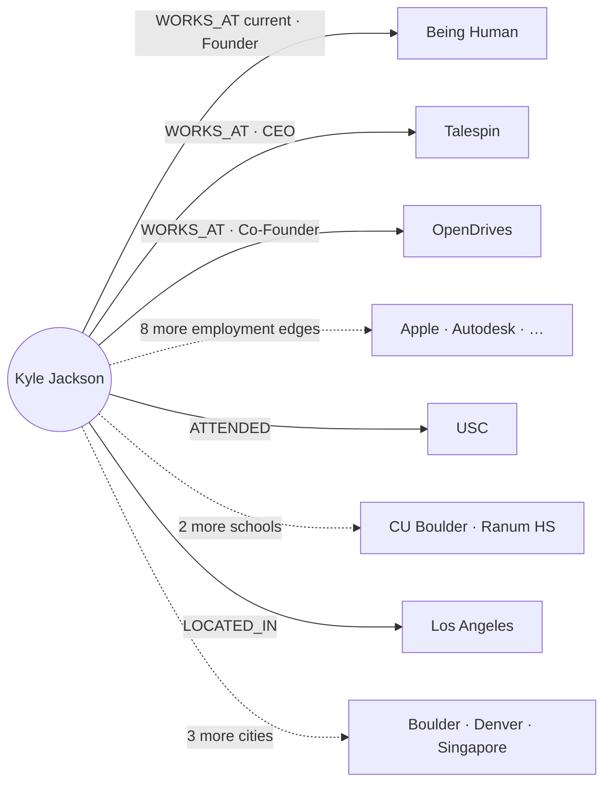

<Info>
**What nodes & edges exist in the user graph?**

**Nodes** — every node carries a direct edge to the user's person node (the user-rooted star rule):

- **User** — the user's own person node, dual-labeled `:Person:User`
- **Person** — contact stubs (`node_uuid`)
- **Company** — followed/employer stubs (`node_uuid`)
- **School** — education stubs (`node_uuid`; company-family in the Universe ontology)
- **City** — the user's own location stubs (sign-up 1-hop ride-along)
- **Note** — user-authored, text in-node
- **File** — `:Document` stubs (bytes in GCS)
- **Collected entities** — any Universe type (e.g., `Film_TV` for a movie title) entering via Collections, carried by a `COLLECTED` edge

**Relationship edges** (User → …):

| Edge | Target | Nature |
|---|---|---|
| `KNOWS` | Person | Evidence-based; **two fields**: `strength` (higher=stronger) + derived traversal `weight` (25–60, lower=stronger) |
| `CONNECTED_ON_ORBITER` | Person | Declared platform fact (both are Orbiter users; share-eligibility) |
| `CONNECTED_ON_LINKEDIN` | Person | Declared platform fact (imported 1st-degree) |
| `FOLLOWS` | Company | Derived per the FOLLOWS gate |
| `WORKS_AT` / `FOUNDED` / other person→company edges | Company | User's own **full employment & founder history** — all 1-hop Universe edges copy at sign-up; the `current` flag distinguishes present roles |
| `ATTENDED` | School | User's own education (sign-up copy) |
| `LOCATED_IN` | City | User's own locations (sign-up 1-hop ride-along) |
| `COLLECTED` | Any entity | Collection membership — own or shared-in collection (`collection_id`, `added_at`, `source: own \| shared_collection`, `shared_by?`) |

Declared `CONNECTED_ON_*` edges are binary facts and coexist with KNOWS on the same pair — KNOWS is the relationship spine, carrying `strength` + derived `weight` per the [ground-truth ladder](/guides/ontology/edges#user-graph-edges). A LinkedIn import creates **all three**: the person stub, `CONNECTED_ON_LINKEDIN`, and a KNOWS edge initialized at `origination_source: linkedin_import` — **strength 15 / weight ≈55** (people connect on LinkedIn without actually knowing each other). Once real interaction accrues, the nightly scoring pass recomputes strength — and the LinkedIn connection then contributes a small **corroboration factor** to the formula.

**Content edges** (User → …): `CREATED` → Note · `RECEIVED` → Note (shared in) · `UPLOADED` → File (manual) · `SAVED` → File (auto-captured from email)

**Context edges** (leaf → leaf): `ABOUT`: Note → Person | Company · `ATTACHED_TO`: File → Person | Company

**Collections note:** **any** entity in a collection the user created — *or in a collection shared with the user* — enters the user graph with a `COLLECTED` edge (a movie title in a shared collection adds that `Film_TV` node). Collection sharing is the one receive-path that *does* add entities; contrast shared notes, whose subjects stay lazy. The Collection itself is an AlloyDB construct (`collection_id` on the edge), promotable to a graph node later if collections ever need graph-side identity.

<Card icon="diagram-project">

**Projects** *(not deployed yet)*

- **Project node** — stub: `project_id`, name, short description; AlloyDB system of record; `kind: "project"` row in the files search index
- `(User)-[:OWNS {created_at}]->(Project)` — the star edge
- `(Project)-[:INVOLVES {role, status, added_at}]->(Person | Company)` — one edge type with a `role` property (`target`, `champion`, `advisor`, `candidate`, …) and a `status` enum (`active | won | lost | parked`), not an edge type per role
- `(Project)-[:PART_OF]->(Project)` — sub-projects
- On deploy, `ABOUT` and `ATTACHED_TO` gain **Project** as a target — notes and files attach to projects like any other entity

</Card>
</Info>


<Note>
**Future scope — user-defined edges.** Users will be able to **manually add edges and create custom edge types** in their own graph — for example adding `RELATED_TO` or `MARRIED_TO` to a family member, or defining a totally custom edge type. These edges exist **only in the user's graph** — never written to Universe or an org graph — privacy by physical placement, same as everything else in the private tier. When specced, they join the [edge & weight ground truth](/guides/ontology/edges#user-graph-edges).
</Note>

<Tip>
**When are nodes added to the user graph?**

Nodes and edges are created **only** through these entry points:

1. **New user sign-up** — **all of the user's own 1-hop Universe edges copy** (full employment & founder history via WORKS_AT/FOUNDED/etc. with the `current` flag, education via ATTENDED, locations via LOCATED_IN, plus imported/connected people); **expertise nodes are the one exclusion** (they stay Universe-side).
2. **Clicking ADD on a person or company in the UI** → CREATE-CONTACT-PERSON / CREATE-CONTACT-COMPANY.
3. **Connecting with another Orbiter user in the app** → CREATE-CONTACT-PERSON + `CONNECTED_ON_ORBITER`.
4. **LinkedIn connections import** → stub + `CONNECTED_ON_LINKEDIN` + weakest-weight KNOWS.
5. **Contacts import** (vCard / CSV / …) → CREATE-CONTACT-PERSON / CREATE-CONTACT-COMPANY (imported org fields create the company too).
6. **Email webhook** — email **sent by** the user: add the recipient if they don't exist; email **sent to** the user: never creates — only checks for an existing contact to update interaction counts.
7. **Calendar webhook** — meeting participation (attended/accepted, small-meeting cap) creates the participants, per the FOLLOWS-gate decision.
8. **FOLLOWS derivation** — contacts currently at a company cross the seeding threshold → the company node + FOLLOWS edge appear automatically.
9. **Attaching a note** to a person or company (manual-add intent if the entity isn't present yet).
10. **Attaching a file** to a person or company (same intent rule).
11. **An email attachment is parsed** → File node with its edge to the person the email was from/to.
12. **Collections** — **any** entity placed in a user's collection, *or arriving in a collection shared with the user*, is added with a `COLLECTED` edge (a movie title in a shared collection adds that `Film_TV` node).
</Tip>

## How nodes enter a user graph

Two primary modules add nodes to a user graph:

- **CREATE-CONTACT-PERSON** — the sole way a person node enters. Triggered by user intent: outbound email (via the three-tier lookup / GET-ADD), **meeting participation** (attended/accepted calendar event, small-meeting cap applies — see the FOLLOWS gate decision), a vCard/CSV/LinkedIn import, or a manual add. Creates the person stub + `(User)-[KNOWS]->(Person)` + the membership row + the mem0 kickoff. KNOWS initializes per the origination ladder (user_add 100/25 · email/calendar 75/≈34 · orbiter_connect 50/≈43 · linkedin_import 15/≈55 — strength/weight) — plus the matching `CONNECTED_ON_*` platform edge on connect/import paths.
- **CREATE-CONTACT-COMPANY** — the sole way a company node enters. Triggered by the **derived FOLLOWS rule** (see the FOLLOWS gate decision — contacts currently at the company cross the threshold), a manual add or import, or the user's own enrichment (below). Creates the company stub + `(User)-[FOLLOWS]->(Company)` — or `WORKS_AT` when it is the user's own employer.

**The user-rooted star rule:** every node in a user graph has a **direct edge to the user's person node** — people via KNOWS/CONNECTED_ON_*, companies via FOLLOWS/WORKS_AT, schools via ATTENDED, notes via CREATED/RECEIVED, files via UPLOADED/SAVED (projects, when deployed, via OWNS). Leaf-to-leaf *context* edges (a note ABOUT a person, a document ATTACHED_TO a person) are allowed between nodes already in the star; no node exists without its user edge. The full inventory is the schema box at the top of this page.

### The user's own enrichment — worked example: Kyle Jackson signs up

When the user's own person node completes enrichment, **all of their 1-hop Universe edges copy into their graph** — full employment and founder history, education, and locations, as stubs with the respective edges. **The one exclusion is expertise** (Domain/SubDomainExpertise stay Universe-side, readable at compose time).

Real data: [Kyle Jackson](/guides/enrichment/waterfall/qa-smoke-tests/kyle-jackson) is the fully-enriched QA smoke-test person. His Universe node carries **11 WORKS_AT edges**, **3 ATTENDED edges**, and **4 LOCATED_IN edges**. On signup, all of it materializes:

```cypher
(Kyle)-[:WORKS_AT {current: true, title: "Founder"}]->(:Company {name: "Being Human"})
(Kyle)-[:WORKS_AT {current: false, title: "Chief Executive Officer"}]->(:Company {name: "Talespin"})
(Kyle)-[:WORKS_AT {current: false, title: "Co-Founder"}]->(:Company {name: "OpenDrives"})
// … 8 more employment edges: Tunnel, Apple, Autodesk, Cornerstone OnDemand,
//   Siren Studios, East End Studios, GoDigital Distribution, Waterfront Film Fund
(Kyle)-[:ATTENDED]->(:School {name: "University of Southern California"})
(Kyle)-[:ATTENDED]->(:School {name: "University of Colorado Boulder"})
(Kyle)-[:ATTENDED]->(:School {name: "Iver C. Ranum High School"})
(Kyle)-[:LOCATED_IN]->(:City {name: "Los Angeles"})
// … 3 more: Boulder, Denver, Singapore
```



Day-one graph: **19 nodes, 18 edges** (Kyle + 11 companies + 3 schools + 4 cities). What stays behind: his 7 DomainExpertise / 10 SubDomainExpertise nodes — the one exclusion. The point of copying the full history: every one of these stubs joins the **anchor set**, so alma-mater paths ("you and this founder both attended USC"), former-colleague paths ("you overlapped at Apple"), and geography context all start from Kyle's own graph like every other anchor. From there the star grows through the entry points above — his first outbound email adds a KNOWS person, his first note adds a Note node ABOUT its subject.

## Pathfinding on three graphs — the pitch

<Info>
**Decided 2026-08-08.** This page is the build scope for the layered graph architecture. User graphs hold **only** the private layer — KNOWS/FOLLOWS edges, relationship strength, notes, files — as thin stubs keyed by `node_uuid`; all public topology stays in Universe and reads compose the layers. An **organization graph** is the optional middle tier, queried only in company mode. Composed path queries were validated at interactive latency on the live graph 2026-08-08. Target stack: **GCP / Go / AlloyDB**.
</Info>

**Every pathfinding system before us had to pick a poison.**

- **One big shared graph** (LinkedIn-style): paths are computed over declared connections — but "connected" is meaningless. The graph doesn't know that you email Richard weekly and haven't spoken to 400 other "connections" in a decade. And every user's private relationship data has to live in the shared graph, guarded only by permission filters — a privacy incident waiting to happen.
- **Per-user graph copies** (the multi-tenant default): each user gets their own slice of the world graph. Private and fast — but every path is confined to whatever slice got copied, the slice goes stale the moment the world changes, and keeping tens of thousands of copies in sync is a permanent, expensive engineering tax.

**We split the graph the way reality is split — into three layers of trust.**

- **Your user graph** holds the one thing only you have: **who you actually know, and how well** — evidence-based relationship strength computed from real interactions, plus your notes, files, and context. Nothing else.
- **Your organization graph** *(optional — active in company mode)* holds the relationship capital your team shares: colleagues' contacts surfaced as **derived strength signals** — "Sarah has a strong relationship with this person" — never their raw email or calendar. Private to the org, invisible outside it.
- **The universe graph** holds the one thing no individual or company has: **the entire public professional world**, growing and self-enriching around the clock.

A path search composes whichever layers the mode grants. In **personal mode**: hop one comes from your private graph, every hop after runs across the **full, live universe graph**. In **company mode**, the private prefix widens — paths can start *you → colleague → colleague's contact* through the org graph's shared edges before handing off to universe — and every result is synthesized across all three layers, deduplicated by universal ID. Ranking blends it all: your relationship strength on your hops, your colleague's strength on theirs (with an ask-for-intro step built into the path), and everything Orbiter knows about the world for the rest.

**Why that wins:**

1. **Zero staleness.** The moment our enrichment engine learns Grady joined Orbiter, that edge is usable in *every user's* next path query. No sync pipeline, no propagation delay, no per-user copies drifting out of date. Most systems ship paths over yesterday's graph; we ship paths over *right now's*.

2. **Full coverage.** Copied-graph systems can only route through edges that made it into your copy. Our searches traverse everything — so we find the path through the co-worker, the co-investor, the shared board seat that a bounded copy would never contain.

3. **Paths that convert, not just connect.** Anyone can compute degrees of separation. We compute *warm* paths: the first hop is scored on real interaction evidence — who will actually reply, actually make the intro. That signal exists nowhere in a public graph, and it's the difference between a path and an introduction.

4. **Privacy by architecture, not by policy.** Your relationships, notes, and relationship strength physically live in your graph and are never written to the shared one. There is no query that can leak them, no permission bug that can expose them — the isolation is structural.

5. **Compounding network effects at flat cost.** Every improvement to the universe graph — every enrichment run, every new data source — instantly upgrades every user's pathfinding, without touching a single user graph. Intelligence scales once, benefits everyone; user graphs stay tiny and fast forever.

6. **Team reach without pooled data.** Flip to company mode and your anchor set multiplies by your whole org's shared network — enterprise-scale reach — while every layer keeps its own store: personal stays personal, org stays org, public stays public. Switching modes switches *which graphs the query reads*, never where data lives. A colleague leaving the org means their shared edges leave the org graph — nothing to claw back from anyone else's copy.

**One sentence:** we compute paths the way trust actually works — *your* relationships first, your *team's* when you're working as a team, the world's freshest knowledge for every hop after, ranked by who will actually pick up the phone.

## The decision

<Card icon="circle-check">

**The reference model is adopted: user graphs hold only the private layer; shared topology is never copied** *(decided 2026-08-08)*

- **User graph** = a private star: thin stub nodes keyed by `node_uuid` (person and company), the user's KNOWS / FOLLOWS / WORKS_AT edges with evidence-based relationship strength, and private overlays (notes, files, Known-model state). Nothing shared is ever copied in.
- **Organization graph** = the optional middle tier, queried only in company mode: colleagues' shared edges exposed as derived strength signals, never raw data.
- **Universe graph** = the sole holder of public topology. New universe edges become visible to every user's next query the moment they are written — there is nothing to propagate.
- **Reads compose the layers**: the private prefix resolves in the user (and, in company mode, org) graph; remaining hops run over the live universe graph; results merge app-side, deduplicated by `node_uuid`, ranked by blending per-tier weights.

Consequences: the edge fan-out problem that originally motivated this page is designed away — no copies exist to refresh. The only surviving propagation is a small **merge/node-event channel** (Universe merges must repoint stubs and private edges via the loser → winner mapping, delivered reliably). CREATE-CONTACTS shrinks to: create stub + KNOWS edge + membership row + mem0 kickoff.

*History: earlier revisions of this page analyzed the fan-out problem under the copy model (outbox → Pub/Sub → membership resolver → per-user apply). That analysis is preserved in git history; it dissolved with this decision.*

</Card>

<Card icon="circle-check">

**FOLLOWS seeding gate: derived from contacts; intent enters the system exactly once** *(decided 2026-08-08)*

Automatic company FOLLOWS is a **derived edge over the user's existing contacts, never a direct ingestion pipeline**:

- **Intent events** — the only ways a person becomes a KNOWS contact: (1) the user **sends** an email to them *(existing outbound-only rule)*; (2) the user **has a meeting with them** — attended/accepted a calendar event where they were a participant *(new — the second intent event)*. Passive inbound — received and never replied to, invites never accepted — seeds nothing, ever.
- **Seeding rule**: company C earns `(User)-[FOLLOWS]->(C)` when the user's KNOWS contacts include **≥1 person currently at C with relationship strength above the floor, or ≥2 people currently at C at any strength** *(launch defaults — tunable)*. "Currently at" resolves via Universe `WORKS_AT`.
- **Strength**: aggregated from the contributing contacts' relationship strengths; recomputed as contacts are added or churn.
- **Pollution-proof by construction**: newsletters and no-reply senders never become KNOWS contacts, so their companies never earn FOLLOWS; freemail domains resolve to no company; role addresses are already filtered at the person gate. No blocklists, no bulk-sender heuristics — one intent gate covers the whole system.
- **Removal is never automatic**: contacts changing jobs lowers strength but doesn't delete the edge; a user dismissing a FOLLOWS sets a suppressed flag (no re-add except by manual follow).
- **Large-meeting cap** *(sub-point, default ~8 external participants)*: bigger events don't create per-person contacts — prevents webinar attendee spray. Exact cap tunable.

Worked example — the one that motivated the rule: the user has sent emails to and had meetings with people at NVIDIA → those people are KNOWS contacts → NVIDIA earns FOLLOWS with strength aggregated from those relationships. An NVIDIA that only ever emailed *at* the user earns nothing.

</Card>

<Card icon="circle-check">

**Organization-tier governance: employer container, mailbox-provenance contribution, identity-visible, details-via-holder** *(decided 2026-08-08)*

The org graph is an **employer container** — membership in the workspace is membership in the graph; there are no pairwise sharing agreements.

- **Contribution — the mailbox-provenance rule.** A contact contributes to the org graph **only when the relationship is evidenced through the member's connected work mailbox** (the one on the org's domain). Personal-mailbox relationships never contribute, regardless of strength. A member who hasn't connected an org-domain mailbox contributes **nothing**. The boundary is data provenance — no opt-in switch to remember.
- **What a shared edge carries**: that the member knows person X, the member's **identity** ("Sarah knows X"), a **materialized derived strength score**, and current-employer context. **Never**: raw email/calendar, notes, documents, mem0 content, or interaction details.
- **Per-contact visibility enum: `visible | private`** (`ask_first` reserved for a possible future anonymous-until-consent state). `private` excludes the contact from team/org search entirely. No tag-level rules at launch.
- **Where shared contacts surface — full rolodex, details via holder.** Org-shared contacts appear as first-class results in teammates' searches with the path indication ("via Sarah") — but **contact details (emails, phones, …) are not shared**; reaching the person goes through the holder (ask-for-intro).
- **Scores are materialized, never resolved at read time.** The contributor's Known recompute pushes updated scalars to their org edges. This is the one sanctioned copy in the architecture: *private → org copies derived scalars only, push-updated by the owner; org → anywhere, never.* An org query never reads a private graph.
- **Leaver revocation**: every org edge is tagged `contributor_user_id`; departure deletes by tag, immediately and completely — org data is read at compose time and never materialized into anyone else's graph, so there are no copies to claw back. The leaver's private graph was never pooled; they walk away whole. **Carve-out** *(decided 2026-08-08)*: notes **explicitly shared to the team persist** after the contributor departs — deliberate sharing is a gift to the team, unlike automatic derived-signal edges, which delete by tag. (Interplay with full account deletion / right-to-erasure is tracked on the parent page.)
- **Mode is per-query context, not a data state.** Company mode adds the org graph to the planner's sources (user + org + universe), extends the anchor set with org-shared edges, labels results by tier, and attaches ask-for-intro to via-colleague paths. Personal mode never reads the org graph.
- **Admin surface — minimal.** Admins manage membership and see aggregate stats; no raw-data view, no ability to override a member's per-contact exclusions.

</Card>

<Card icon="circle-check">

**Universe read SLO, private-first degradation, and the read-service failure contract** *(decided 2026-08-08)*

- **Deployment separation.** The private tiers (user + org graphs) run on their **own FalkorDB deployment**, separate from Universe. The workloads differ completely (tens of thousands of tiny write-light star graphs vs one dense enrichment-write-heavy graph), and the isolation is what makes degraded mode real — a Universe incident can never take the private tier with it.
- **Private-first degradation ladder.** Universe unreachable or circuit breaker open → cards render from Backend projections + the private graphs (including in-node note text), contact list and org rolodex stay fully functional; paths, Discover, and public-context RAG disable gracefully with an honest banner. A Universe blip degrades network search — it never becomes a product outage.
- **Replica-first reads.** At least one Universe read replica from day one; the read service routes path/Discover queries replica-first (seconds of replication lag is irrelevant to path quality); the primary is reserved for enrichment writes.
- **Launch defaults** *(tunable)*: composed-read availability target **99.9%**; per-tier latency budgets — user graph 50ms, org graph 100ms, Universe 300ms for connection checks / 1.5s for path searches; circuit breaker trips to the ladder on sustained breach.
- **Server-side timeouts are non-negotiable.** Every Universe query sets FalkorDB's query-level `TIMEOUT` — client-side timeouts do not kill a running server-side query, and one runaway can starve the shared instance.
- **This also closes the read-service merge contract**: precedence (Universe wins public properties, user graph wins private), dedupe on `node_uuid`, per-tier budgets + breaker, and **every response labels its provenance** — results carry their tier, and degraded responses state what's missing rather than failing or silently thinning.

</Card>

<Card icon="circle-check">

**Event retention: validate-at-login is the mechanism; retention is ops convenience** *(decided 2026-08-08)*

- **Outbox event rows live 90 days** *(launch default, tunable)* — ample for the live pipeline, the nightly reconcile, and incident replay.
- **Warm graphs** consume merge/node events in near-real-time via the channel; the nightly reconcile backstops.
- **Cold graphs repair at login**: one indexed query validates all of the user's stub `node_uuid`s against the `node_registry` mirror; any miss resolves loser → winner in the **permanent merge log** and repoints. Bounded by the user's graph size, not elapsed time — works even if every event row has been purged, and self-heals any warm-path delivery that ever slipped.
- **The merge log is never pruned** — it is the recovery root (reaffirming the parent-page decision).

</Card>

<Card icon="circle-check">

**Closing decisions: membership write ordering and the hot-node tripwire** *(decided 2026-08-08)*

- **Membership write ordering.** The `user_contact` membership row commits **in the same AlloyDB transaction as the contact row, before any graph write** — the AlloyDB-first pattern used everywhere else in this design. The merge/node-event resolver and org-tier resolution can never miss a user mid-add; a crash between the AlloyDB commit and the graph write is healed by the idempotent stub `MERGE` on retry and the nightly reconcile.
- **Hot-node tripwire.** Celebrity-class targets are a re-benchmark trigger, not a launch design problem: re-run the path benchmark when **Universe crosses ~500k nodes or any path target's degree exceeds ~1,000**, whichever comes first. Until then the read service enforces **traversal frontier caps** on path queries. On trip, the options are tighter caps, precomputed neighborhoods for high-degree nodes, or a dedicated celebrity-node policy.

</Card>

## Notes

**The model** *(decided 2026-08-08)*: notes are **nodes, not edges** — the test being that an edge connects exactly two things and has no independent lifecycle, while a note can have multiple subjects, its own timeline, and many siblings per contact. Notes **carry their text in the node** (~2KB cap, truncation flag beyond): most notes are short, and in-node text makes "everything I know about X" a single 1-hop traversal with no hydration round-trip. AlloyDB remains the **system of record** (edit UI, exports, backups); the node text is a denormalized copy — write AlloyDB in the transaction, idempotent `MERGE` upsert keyed on `note_id`, nightly reconcile heals drift. **Embeddings never enter the graph**: notes join the shared **files search index** in AlloyDB (locked standard: gemini-embedding-001 · 3072 · cosine · ScaNN — a vector is ~40× the note it embeds), as single-chunk rows carrying `kind: note`, `source_id`, and the `entity_uuids` of their subjects, so "search my notes about Sam" is a filtered vector query.

### Flow — Mark creates a note on Knock.app

1. **Intent check**: if Knock.app is not yet in Mark's graph, creating a note on it is **manual-add intent** — CREATE-CONTACT-COMPANY runs first: `(Mark)-[:FOLLOWS {source: "note_created", created_at}]->(Knock.app)`.
2. **AlloyDB**: the notes row is written (system of record), transaction-first.
3. **User graph**:

```cypher
(Mark)-[:CREATED {created_at}]->(:Note {note_id, text: "Met the founders at the AI infra dinner…",
        visibility: "private", created_at, updated_at})
(:Note)-[:ABOUT {created_at}]->(:Company {node_uuid: knock_uuid})   // Knock.app stub
```

4. **Files index**: one row — `kind: note`, `source_id: note_id`, `entity_uuids: [knock_uuid]`, embedding.

A note about a *meeting* works identically with two ABOUT edges — one per participant.

### Flow — Mark shares the note

Sharing is **explicit** and comes in two scopes. In both, AlloyDB's `note_shares` table is the ACL truth, and the owner's node flips `visibility`.

**Direct share to a connected user (Sarah):**

```cypher
// Mark's graph — visibility property updates, nothing else changes
(:Note {note_id, visibility: "shared_direct", …})

// Sarah's graph — she receives a holder node with denormalized text
(Sarah)-[:RECEIVED {from_user_uuid: mark_uuid, shared_at}]->(:Note {note_id,
        text, origin: "shared", entity_uuids: [knock_uuid], created_at, updated_at})
```

- **Edits propagate**: Mark's future edits fan out by `note_id`-keyed `MERGE` to every holder's graph (the share list is small and known from `note_shares`).
- **Receiving is not entity intent**: if Knock.app is *not* in Sarah's graph, no company stub and no FOLLOWS is created — her note node carries `entity_uuids` as a property, and the ABOUT edge **materializes lazily** if Knock.app ever enters her graph through her own intent. Compose-time reads still resolve the company from Universe by uuid.
- Sarah gets her own files-index row, so the note is in *her* search.

**Team share (company mode):** **one** note node is written to the **org graph** — not N copies into members' graphs:

```cypher
// org graph
(:Note {note_id, text, contributor_user_id: mark_uuid, shared_at})
      -[:ABOUT]->(:Company {node_uuid: knock_uuid})   // org-graph stub, created if absent, contributor-tagged
```

Members see it in company mode because the org graph is a query source — the reference principle again: shared once, read by all, no copies to reconcile. Explicit team-sharing is the sanctioned exception to the org tier's "derived signals only" rule: the user chose to give the team this content. **And it outlives the sharer** *(decided 2026-08-08)*: team-shared notes persist after the contributor leaves the org — attribution intact — unlike their automatic derived-signal edges, which delete on departure.

## Files

**The model** *(decided 2026-08-08)*: a file is a **Document node carrying id + name + mime + a short generated description** — traversal-time context and RAG summaries without touching bytes. Bytes live in **GCS**; metadata in AlloyDB; extracted text lands **chunked** in the shared files search index (`kind: document`, `source_id: doc_id`, `entity_uuids`).

### Flow — Mark uploads a file and attaches it to Knock.app

1. **Intent check**: attaching to an entity not yet in the graph is manual-add intent — CREATE-CONTACT-* runs first (same rule as notes).
2. **GCS**: bytes stored. **AlloyDB**: documents row. **Index**: chunked extracted-text rows.
3. **User graph**:

```cypher
(Mark)-[:UPLOADED {source: "manual", uploaded_at}]
      ->(:Document {doc_id, name: "knock-pitch.pdf", mime: "application/pdf",
                    description: "Seed pitch deck, 18 slides, GTM focus", content_hash})
      -[:ATTACHED_TO {attached_at}]->(:Company {node_uuid: knock_uuid})
```

### Flow — an email attachment from Sam Seely is parsed and saved

The log-parse pipeline extracts qualifying attachments automatically. The gate is the intent system again: **auto-capture only from senders who are already KNOWS contacts** — an attachment from an unknown inbound sender saves nothing, ever. Launch-default filters *(tunable)*: document-type mime allowlist (pdf, docx, xlsx, pptx, …), minimum size, no inline images. **Dedupe by `content_hash` per user** — the same attachment re-sent creates no new node (a new ATTACHED_TO edge only if it arrives in the context of a different entity).

```cypher
(Mark)-[:SAVED {source: "email_attachment", interaction_id, saved_at}]
      ->(:Document {doc_id, name: "knock-overview.pdf", mime: "application/pdf",
                    description: "Company overview one-pager", origin: "email", content_hash})
      -[:ATTACHED_TO {via: "email_attachment", attached_at}]->(:Person {node_uuid: sam_uuid})
```

The provenance is legible in the edge types alone: `UPLOADED` = the user placed it; `SAVED` = the system captured it from an interaction, with the `interaction_id` linking back to the exact email. Both satisfy the star rule (direct user edge) and both land in the files index the same way.

### Edge-type summary

| Edge | From → To | Key properties |
|---|---|---|
| `CREATED` | User → Note | `created_at` |
| `RECEIVED` | User → Note (shared in) | `from_user_uuid`, `shared_at` |
| `ABOUT` | Note → Person/Company | `created_at` (lazily materialized for received notes) |
| `UPLOADED` | User → Document | `source: "manual"`, `uploaded_at` |
| `SAVED` | User → Document | `source: "email_attachment"`, `interaction_id`, `saved_at` |
| `ATTACHED_TO` | Document → Person/Company | `via`, `attached_at` |

## Worked example — Discover search to connection paths

Discover search: **"what is Knock.app"**, people filter open. Mark has emailed with Sam Seely, so his user graph holds `(Mark)-[KNOWS]->(Sam)` — and that is Sam's *only* edge in Mark's graph.

<Steps>
<Step title="Universe resolves the company and its people">
"Knock.app" → the Knock company node plus its people via WORKS_AT / founder edges — this is where Sam Seely enters the result, with his `node_uuid`. The user graph contributes nothing here; Sam's employment at Knock lives only in Universe.
</Step>
<Step title="Connection check against the user graph">
For each person in the result, the read service asks the user graph one cheap question: `MATCH (me)-[k:KNOWS]->(p {uuid: $uuid})`. For Sam: **direct hit → short-circuit.** The path is *Mark —KNOWS→ Sam*, one hop, carrying Mark's private relationship strength. No traversal, no Universe path search needed for the connection itself.
</Step>
<Step title="Merge and dedupe by node_uuid">
Sam appears in both streams — "Knock C-suite" from Universe, "your contact" from the user graph. Same universal ID → one card: public facts (founder, title, Knock.app) from Universe, private overlay (KNOWS, strength, last-emailed, notes) from the user graph. This composition is also what renders the 1st-degree badge.
</Step>
</Steps>

**When there is no direct hit** — say Knock's other co-founder, whom Mark doesn't know — the same read pattern continues one step further: the service takes Mark's full anchor set (every `node_uuid` he has KNOWS/FOLLOWS/WORKS_AT edges to) and asks Universe for the shortest connection from that person back to any anchor. Result: *"reachable via Sam — you know him, they founded Knock together."* In **company mode** the connection check also consults the org graph, so "your colleague Sarah knows them (strong)" surfaces as an ask-for-intro path. Same merge, third source.

<Note>
**The invariant this example depends on:** the KNOWS edge and Universe's Sam must carry the **same `node_uuid`**. GET-ADD guarantees this at contact creation; the merge/node-event channel (Scope item 4) guarantees it *stays* true when Universe later merges a stub into a canonical person. A missed repoint would show Sam as "not connected" in Discover while he still sits in the contact list — the one silent failure mode this architecture must defend.
</Note>

## Query execution model *(decided 2026-08-08)*

Every search-driven read runs the same pipeline: **vectorize the query once → dispatch one scoped search per granted tier in parallel → await all → merge & dedupe by `node_uuid` → calculate paths over the merged candidates.**

Worked example — **Katelyn** is a member of two orgs, **GrantDriveGroup** and **Orbiter.io**. Her mode selects the source set:

- **Company mode** — she searches *"Founders Collective"* → **four searches in parallel**: her user graph, the **GrantDriveGroup org graph**, the **Orbiter.io org graph**, and Universe — *all* orgs she belongs to, not just the active one. Await all → merge & dedupe by `node_uuid` → compute paths from the merged candidate set.
- **Personal mode (her "personal org")** — the same search → **two searches in parallel**: her user graph and Universe. Await both → merge & dedupe → paths.

Rules the pipeline pins down:

- **Company mode searches ALL member orgs** *(decided 2026-08-08 — supersedes the brief one-org rule)*: N org graphs + user graph + Universe, N+2 parallel searches. Mode-scoping was never a security boundary — membership is (a leaver's tier vanishes with their membership) — and the best warm path must never hide behind a mode toggle. Two conditions keep it clean: **every result carries org-of-origin provenance** ("via Sarah *(GrantDriveGroup)*"), and **intro requests route inside the holding org** regardless of where the search ran. The active org boosts ranking; it no longer filters. *(Optional future valve, not built at launch: an org-admin flag "discoverable from members' other contexts," default on.)*
- **Await-all is bounded**, not open-ended: each tier runs under its latency budget from the SLO decision (user 50ms · org 100ms · Universe 300ms / 1.5s) — org graphs are small and parallel, so N orgs still fit the org-tier budget — and a tier that breaches degrades per the private-first ladder, with tier-provenance labels saying what's missing.
- **Paths come last**: path calculation (anchor decomposition) runs over the *merged, deduped* candidate set, so a hit found in any tier can be a path target, and hits found in multiple tiers are one candidate with composed public + private + org context.

<Note>
**Implementation note — what physically serves each tier's vector search.** The Universe search uses the existing in-graph vector index on `:Entity` (name embeddings — live today). For the private tiers, per-stub name embeddings would cost ~12KB per stub per user at the locked 3072-dim standard (hundreds of GB across tens of thousands of tenant graphs) — so the private-tier searches are served by **`node_uuid` intersection against the Universe hits** (her stubs reference the same ids Universe just matched) plus the **user-scoped AlloyDB files index** (notes/files content, already decided). The contract above — N parallel scoped searches, await, merge — is unchanged; only the index behind each tier differs.
</Note>

### Path stitching and the anchor set

**Neither graph ever produces a path — the read service assembles it at the shared `node_uuid`**: hop 1 from the private tier's anchor set, continuation segments computed target-out in Universe, concatenated at the join uuid. The full mechanics — the Ian Andes worked case, the stitching algorithm, and the **anchor set** specification (what it is, where it lives, and every trigger that writes it) — live on the dedicated **[Pathfinding](/guides/open-work/edge-sync/pathfinding)** sub-page.

## Verified constraints

Verified against FalkorDB docs/tracker and Google Cloud docs, 2026-08-07. These bound the design.

| # | Fact | Consequence |
|---|---|---|
| 1 | FalkorDB has **no triggers, no CDC, no event hooks**. Keyspace notifications never fire on `GRAPH.QUERY` writes ([issue #1514](https://github.com/FalkorDB/FalkorDB/issues/1514)). | Change capture lives in **our own write path** — the merge/node-event channel is fed by the graph-writer service, never by the database. |
| 2 | **No cross-graph Cypher** — one query targets exactly one graph ([multigraph article](https://www.falkordb.com/news-updates/multigraph-topology-isolation-linear-scale/)). | Layer composition is an application-layer concern: the read service issues per-graph queries and merges. |
| 3 | Concurrency is a **per-graph reader-writer lock**: writes to the same graph serialize FIFO; operations on different graphs run in parallel up to `THREAD_COUNT` ([concurrency docs](https://docs.falkordb.com/design/concurrency.html)). Multi-tenancy at &gt;10k graphs is the endorsed pattern. | Tens of thousands of small user graphs are operationally sound; the shared Universe graph is the only contention point and is read-dominated. |
| 4 | Membership ("which users hold node X") must be answered **relationally, never by querying graphs**. | The `user_contact(user_id, node_uuid)` table, indexed both directions, drives merge repointing and org-tier resolution. |
| 5 | AlloyDB supports logical decoding, but Datastream only delivers to BigQuery/GCS, and an abandoned replication slot **retains WAL indefinitely** (disk-fill risk). | The merge/node-event channel uses a **transactional outbox** (`FOR UPDATE SKIP LOCKED` relay), not CDC. |
| 6 | Pub/Sub and Cloud Tasks are at-least-once; dead-letter counts are best-effort. | All graph writes in the event channel are **idempotent** (`MERGE` keyed on stable ids); a nightly reconciliation job is the backstop. |

## Scope to build

1. **User-graph provisioning and schema.** Per-user FalkorDB graphs (net-new — see current state): thin stub nodes carrying `node_uuid` + entity type, KNOWS / FOLLOWS / WORKS_AT / ATTENDED edges with strength properties, Note and Document stub nodes with CREATED/ABOUT and UPLOADED/ATTACHED_TO edges, all under the user-rooted star rule. Graph naming + per-user ACLs (the existing `user:<workos_id>:*` keyspace convention and the tech-debt ACL work fold in here).

2. **Graph composition read service (Go).** The front door for every card, path, Discover, and RAG read, implementing the query execution model above: mode-aware source selection (personal = user + Universe, 2 parallel searches; company = user + **all member org graphs** + Universe, N+2 parallel, org-of-origin provenance on every result, intro requests routed inside the holding org), bounded await-all under per-tier budgets, direct-hit short-circuit, merge with `node_uuid` dedupe and per-tier precedence (Universe wins public properties, user graph wins private), path calculation over the merged candidates, blended ranking, per-tier degraded modes with provenance labels. Every Universe query carries a **server-side timeout** so a runaway query can never degrade the shared graph.

3. **CREATE-CONTACT-PERSON / CREATE-CONTACT-COMPANY.** The two node entry points (see "How nodes enter a user graph"): stub + user edge + membership row (+ mem0 kickoff on the person side) — idempotent on `(user_id, node_uuid)`, with the **membership row committing in the same AlloyDB transaction as the contact row, before any graph write**. No subgraph copy exists; the flow is identical for brand-new and fully-enriched people. Includes the self-enrichment hook that materializes the user's current companies and education, and the manual-intent triggers (note creation / file attach on a Universe entity).

4. **Merge/node-event channel.** Transactional outbox in AlloyDB written by the Universe graph-writer (merge and node-lifecycle events only, 90-day retention) → Go relay (`FOR UPDATE SKIP LOCKED`) → repoint workers that update affected user/org graphs via the membership index, applying the loser → winner mapping. Nightly Cloud Scheduler → Cloud Run reconciliation sweep for warm graphs; **validate-stubs-at-login** for cold graphs (registry check → permanent merge log → repoint).

5. **Organization graph tier.** Company-mode second private tier per the governance decision: mailbox-provenance contribution filter, org-edge upserts carrying identity + materialized strength (pushed from the contributor's Known recompute), the `visible | private` per-contact enum, full-rolodex search surfacing with details-via-holder, `contributor_user_id`-tagged edges with delete-on-departure, workspace-membership admin. *Governance decided 2026-08-08 — buildable.*

6. **FOLLOWS company-contact flow.** The derived-edge recompute: on contact create/update (or employer change from Universe), evaluate the seeding rule for the contact's current company and upsert/restrengthen the FOLLOWS edge; meeting-participation contact creation with the small-meeting cap; the suppressed flag. *Gate decided 2026-08-08 — buildable.*

7. **Universe read scaling.** Per the SLO decision: the separate private-tier FalkorDB deployment, at least one Universe read replica with replica-first routing, the circuit breaker + per-tier latency budgets in the read service, server-side query timeouts everywhere, and traversal frontier caps on path queries with the hot-node tripwire (re-benchmark at ~500k Universe nodes or target degree > 1,000).

## Current state (migration notes)

Verified against the live Xano workspace 2026-08-07:

- There are **no per-user FalkorDB graphs today** — everything lives in the single `live` graph (one row in `environmental_variables_falkordb`, table 508); per-user graph naming is net-new.
- All Xano → FalkorDB traffic funnels through `mvp/falkor/send-cypher` (fn 2815) and its variants; ~25 edge-composing functions call it. The Go graph-writer service inherits this single-choke-point shape — which is what makes the outbox reliable.
- The current "add person" flow (`POST /my-persons` → fn 1855) inserts membership rows only — it performs **zero graph writes**. The user-graph layer is entirely net-new.
- Membership is already relational: `contacts` (table 128: `user_id` + `master_person_id`, indexed both directions) and `my_company` (table 149). The AlloyDB `user_contact` table keyed by `node_uuid` is the successor of this shape. `node_registry` (758) holds 106 rows today — not a usable mirror yet.

Because the user-graph layer, composition service, and event channel are all net-new, they can be designed as one coherent Go system from day one — there is no legacy sync behavior to migrate.

## Remaining decisions

**Every question this page opened is now decided** *(as of 2026-08-08)* — the struck list below is kept as the record.

- ~~**Organization-graph tier governance.**~~ **Decided 2026-08-08** — employer container, mailbox-provenance rule, identity-visible with `visible | private` enum, full rolodex with details-via-holder, materialized scores, delete-by-contributor on departure; see the Decision card.
- ~~**FOLLOWS seeding gate.**~~ **Decided 2026-08-08** — derived from contacts, meetings added as the second intent event; see the Decision card. Residual tunables: strength floor, contact-count threshold, large-meeting cap.
- ~~**Read-service merge contract details.**~~ **Decided 2026-08-08** — closed by the SLO/degradation decision: private-first ladder defines the degraded modes; every response carries tier provenance and degraded responses state what's missing.
- ~~**Universe read SLO / degraded mode.**~~ **Decided 2026-08-08** — separate private-tier deployment, private-first ladder, replica-first reads, 99.9% target with per-tier budgets; see the Decision card.
- ~~**Hot-node query cost.**~~ **Decided 2026-08-08** — frontier caps at launch; re-benchmark tripwire at ~500k Universe nodes or target degree > 1,000; see the closing-decisions card.
- ~~**Merge/node-event retention.**~~ **Decided 2026-08-08** — validate-at-login for cold graphs + 90-day event retention; see the Decision card.
- ~~**Team-shared notes on leaver.**~~ **Decided 2026-08-08 — persist-for-team**: explicitly team-shared notes survive the contributor's departure; automatic derived-signal edges still delete by tag.
- ~~**Membership index write timing.**~~ **Decided 2026-08-08** — membership row commits in the same AlloyDB transaction as the contact row, before any graph write; see the closing-decisions card.
- ~~**Notes/documents model confirmation.**~~ **Locked 2026-08-08** — fully specified in the Notes and Files sections (flows, edge types, properties, sharing mechanics).

## Related work

- [Universe &lt;&gt; Backend Sync](/guides/open-work/universe-backend-sync) — the parent design page; its fan-out, copy-vs-reference, and tier-3 pending-state questions are resolved by the decision here
- [Orbiter Universe Standalone](/guides/open-work/orbiter-univers-standalone) — Decision 5's hybrid read model, which this architecture implements
- [Contacts Interaction Log](/guides/open-work/contacts-interaction-log) — the existing AlloyDB-table + Go-cron pattern the reconciliation job mirrors
