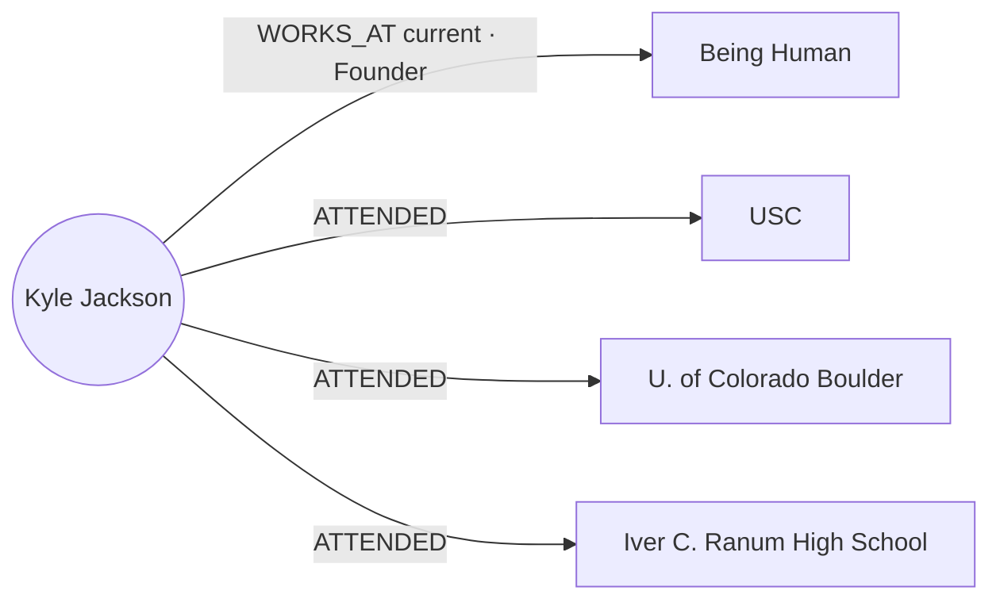

## Pathfinding on three graphs — the pitch

<Info>
**Decided 2026-08-08.** This page is the build scope for the layered graph architecture. User graphs hold **only** the private layer — KNOWS/FOLLOWS edges, relationship strength, notes, files — as thin stubs keyed by `node_uuid`; all public topology stays in Universe and reads compose the layers. An **organization graph** is the optional middle tier, queried only in company mode. Composed path queries were validated at interactive latency on the live graph 2026-08-08. Target stack: **GCP / Go / AlloyDB**.
</Info>

**Every pathfinding system before us had to pick a poison.**

- **One big shared graph** (LinkedIn-style): paths are computed over declared connections — but "connected" is meaningless. The graph doesn't know that you email Richard weekly and haven't spoken to 400 other "connections" in a decade. And every user's private relationship data has to live in the shared graph, guarded only by permission filters — a privacy incident waiting to happen.
- **Per-user graph copies** (the multi-tenant default): each user gets their own slice of the world graph. Private and fast — but every path is confined to whatever slice got copied, the slice goes stale the moment the world changes, and keeping tens of thousands of copies in sync is a permanent, expensive engineering tax.

**We split the graph the way reality is split — into three layers of trust.**

- **Your user graph** holds the one thing only you have: **who you actually know, and how well** — evidence-based relationship strength computed from real interactions, plus your notes, files, and context. Nothing else.
- **Your organization graph** *(optional — active in company mode)* holds the relationship capital your team shares: colleagues' contacts surfaced as **derived strength signals** — "Sarah has a strong relationship with this person" — never their raw email or calendar. Private to the org, invisible outside it.
- **The universe graph** holds the one thing no individual or company has: **the entire public professional world**, growing and self-enriching around the clock.

A path search composes whichever layers the mode grants. In **personal mode**: hop one comes from your private graph, every hop after runs across the **full, live universe graph**. In **company mode**, the private prefix widens — paths can start *you → colleague → colleague's contact* through the org graph's shared edges before handing off to universe — and every result is synthesized across all three layers, deduplicated by universal ID. Ranking blends it all: your relationship strength on your hops, your colleague's strength on theirs (with an ask-for-intro step built into the path), and everything Orbiter knows about the world for the rest.

**Why that wins:**

1. **Zero staleness.** The moment our enrichment engine learns Grady joined Orbiter, that edge is usable in *every user's* next path query. No sync pipeline, no propagation delay, no per-user copies drifting out of date. Most systems ship paths over yesterday's graph; we ship paths over *right now's*.

2. **Full coverage.** Copied-graph systems can only route through edges that made it into your copy. Our searches traverse everything — so we find the path through the co-worker, the co-investor, the shared board seat that a bounded copy would never contain.

3. **Paths that convert, not just connect.** Anyone can compute degrees of separation. We compute *warm* paths: the first hop is scored on real interaction evidence — who will actually reply, actually make the intro. That signal exists nowhere in a public graph, and it's the difference between a path and an introduction.

4. **Privacy by architecture, not by policy.** Your relationships, notes, and relationship strength physically live in your graph and are never written to the shared one. There is no query that can leak them, no permission bug that can expose them — the isolation is structural.

5. **Compounding network effects at flat cost.** Every improvement to the universe graph — every enrichment run, every new data source — instantly upgrades every user's pathfinding, without touching a single user graph. Intelligence scales once, benefits everyone; user graphs stay tiny and fast forever.

6. **Team reach without pooled data.** Flip to company mode and your anchor set multiplies by your whole org's shared network — enterprise-scale reach — while every layer keeps its own store: personal stays personal, org stays org, public stays public. Switching modes switches *which graphs the query reads*, never where data lives. A colleague leaving the org means their shared edges leave the org graph — nothing to claw back from anyone else's copy.

**One sentence:** we compute paths the way trust actually works — *your* relationships first, your *team's* when you're working as a team, the world's freshest knowledge for every hop after, ranked by who will actually pick up the phone.

## The decision

<Card icon="circle-check">

**The reference model is adopted: user graphs hold only the private layer; shared topology is never copied** *(decided 2026-08-08)*

- **User graph** = a private star: thin stub nodes keyed by `node_uuid` (person and company), the user's KNOWS / FOLLOWS / WORKS_AT edges with evidence-based relationship strength, and private overlays (notes, files, Known-model state). Nothing shared is ever copied in.
- **Organization graph** = the optional middle tier, queried only in company mode: colleagues' shared edges exposed as derived strength signals, never raw data.
- **Universe graph** = the sole holder of public topology. New universe edges become visible to every user's next query the moment they are written — there is nothing to propagate.
- **Reads compose the layers**: the private prefix resolves in the user (and, in company mode, org) graph; remaining hops run over the live universe graph; results merge app-side, deduplicated by `node_uuid`, ranked by blending per-tier weights.

Consequences: the edge fan-out problem that originally motivated this page is designed away — no copies exist to refresh. The only surviving propagation is a small **merge/node-event channel** (Universe merges must repoint stubs and private edges via the loser → winner mapping, delivered reliably). CREATE-CONTACTS shrinks to: create stub + KNOWS edge + membership row + mem0 kickoff.

*History: earlier revisions of this page analyzed the fan-out problem under the copy model (outbox → Pub/Sub → membership resolver → per-user apply). That analysis is preserved in git history; it dissolved with this decision.*

</Card>

<Card icon="circle-check">

**FOLLOWS seeding gate: derived from contacts; intent enters the system exactly once** *(decided 2026-08-08)*

Automatic company FOLLOWS is a **derived edge over the user's existing contacts, never a direct ingestion pipeline**:

- **Intent events** — the only ways a person becomes a KNOWS contact: (1) the user **sends** an email to them *(existing outbound-only rule)*; (2) the user **has a meeting with them** — attended/accepted a calendar event where they were a participant *(new — the second intent event)*. Passive inbound — received and never replied to, invites never accepted — seeds nothing, ever.
- **Seeding rule**: company C earns `(User)-[FOLLOWS]->(C)` when the user's KNOWS contacts include **≥1 person currently at C with relationship strength above the floor, or ≥2 people currently at C at any strength** *(launch defaults — tunable)*. "Currently at" resolves via Universe `WORKS_AT`.
- **Strength**: aggregated from the contributing contacts' relationship strengths; recomputed as contacts are added or churn.
- **Pollution-proof by construction**: newsletters and no-reply senders never become KNOWS contacts, so their companies never earn FOLLOWS; freemail domains resolve to no company; role addresses are already filtered at the person gate. No blocklists, no bulk-sender heuristics — one intent gate covers the whole system.
- **Removal is never automatic**: contacts changing jobs lowers strength but doesn't delete the edge; a user dismissing a FOLLOWS sets a suppressed flag (no re-add except by manual follow).
- **Large-meeting cap** *(sub-point, default ~8 external participants)*: bigger events don't create per-person contacts — prevents webinar attendee spray. Exact cap tunable.

Worked example — the one that motivated the rule: the user has sent emails to and had meetings with people at NVIDIA → those people are KNOWS contacts → NVIDIA earns FOLLOWS with strength aggregated from those relationships. An NVIDIA that only ever emailed *at* the user earns nothing.

</Card>

## How nodes enter a user graph

Two entry points — and only two — add nodes to a user graph:

- **CREATE-CONTACT-PERSON** — the sole way a person node enters. Triggered by user intent: outbound email (via the three-tier lookup / GET-ADD), **meeting participation** (attended/accepted calendar event, small-meeting cap applies — see the FOLLOWS gate decision), a vCard/CSV/LinkedIn import, or a manual add. Creates the person stub + `(User)-[KNOWS]->(Person)` + the membership row + the mem0 kickoff.
- **CREATE-CONTACT-COMPANY** — the sole way a company node enters. Triggered by the **derived FOLLOWS rule** (see the FOLLOWS gate decision — contacts currently at the company cross the threshold), a manual add or import, or the user's own enrichment (below). Creates the company stub + `(User)-[FOLLOWS]->(Company)` — or `WORKS_AT` when it is the user's own employer.

**The user-rooted star rule:** every node in a user graph has a **direct edge to the user's person node** — people via KNOWS, companies via FOLLOWS/WORKS_AT, schools via ATTENDED, notes via CREATED, documents via UPLOADED. Leaf-to-leaf *context* edges (a note ABOUT a person, a document ATTACHED_TO a person) are allowed between nodes already in the star; no node exists without its user edge.

### The user's own enrichment — worked example: Kyle Jackson signs up

When the user's own person node completes enrichment, their professional core lands in their graph automatically: every **current** company (present employment, not historical) and their education, as stubs with the respective edges.

Real data: [Kyle Jackson](/guides/enrichment/waterfall/qa-smoke-tests/kyle-jackson) is the fully-enriched QA smoke-test person. His Universe node carries **11 WORKS_AT edges** (Being Human, Talespin, OpenDrives, Tunnel, Apple, Autodesk, Cornerstone OnDemand, Siren Studios, East End Studios, GoDigital Distribution, Waterfront Film Fund) and **3 ATTENDED edges**. On signup, self-enrichment materializes exactly this into his user graph — one current company, three schools, four edges:

```cypher
(Kyle)-[:WORKS_AT {current: true, title: "Founder"}]->(:Company {name: "Being Human"})
(Kyle)-[:ATTENDED]->(:School {name: "University of Southern California"})
(Kyle)-[:ATTENDED]->(:School {name: "University of Colorado Boulder"})
(Kyle)-[:ATTENDED]->(:School {name: "Iver C. Ranum High School"})
```



Everything else stays in Universe, readable at compose time but never materialized: the ten historical employers, and his 7 DomainExpertise / 10 SubDomainExpertise nodes. Day-one graph: **5 nodes, 4 edges.** The point of materializing the current core: these stubs join the **anchor set**, so alma-mater paths ("you and this founder both attended USC") and colleague paths start from Kyle's own graph like every other anchor. From there the star grows through the entry points above — his first outbound email adds a KNOWS person, his first note adds a Note node ABOUT its subject.

### Notes and documents — nodes, not edges *(updated 2026-08-08 — note text in-node per workshop; confirm to lock)*

The test: **an edge connects exactly two things and has no independent lifecycle; anything with its own identity, its own timeline, or more than one subject is a node.** A note about a meeting with two people has two subjects; a note is created, edited, and deleted independently of the relationship it describes; one contact can carry many notes. So:

```cypher
(User)-[:CREATED]->(:Note {note_id, text, created_at, updated_at})-[:ABOUT]->(Person | Company)
(User)-[:UPLOADED]->(:Document {doc_id, name, mime, description})-[:ATTACHED_TO]->(Person | Company)
```

**Notes carry their text in the node.** Most notes are short (hundreds of bytes); even a power user's notes cost single-digit megabytes of graph memory, and in exchange the most common retrieval — "everything I know about Sam" — returns usable content in one 1-hop traversal with no hydration round-trip. Node text is capped (~2KB, truncation flag beyond); AlloyDB remains the **system of record** (edit UI, exports, backups) and the node text is a denormalized copy: write AlloyDB in the transaction, idempotent `MERGE` upsert of the node keyed on `note_id`, nightly reconcile heals drift.

**Embeddings do not go in the graph — notes join the files search index** *(decided 2026-08-08)*. The locked embedding standard (gemini-embedding-001 · 3072 · cosine · AlloyDB ScaNN) puts all content vectors in AlloyDB — at 3072 dims a vector is ~12KB, roughly 40× the note it embeds. Notes and documents share **one search index**: the files/documents embedding table in AlloyDB, where documents land as chunked extracted-text rows and notes as single-chunk rows. Each row carries a `kind` discriminator (`note` | `document`), a `source_id` (`note_id` / `doc_id`) for hydration from the right home, and the `entity_uuids` from its ABOUT/ATTACHED_TO edges — so "search my notes about Sam" is a filtered vector query, not a post-join. The notes table remains system of record for text; a note edit re-embeds and upserts its index row. One query surface covers "search across my notes and files"; results map back into the graph by `source_id`.

**Documents are id + description only.** Name, mime, and a short generated description on the node (traversal-time context and RAG summaries without touching bytes); bytes in GCS; extracted text chunked into the shared search index above.

## Worked example — Discover search to connection paths

Discover search: **"what is Knock.app"**, people filter open. Mark has emailed with Sam Seely, so his user graph holds `(Mark)-[KNOWS]->(Sam)` — and that is Sam's *only* edge in Mark's graph.

<Steps>
<Step title="Universe resolves the company and its people">
"Knock.app" → the Knock company node plus its people via WORKS_AT / founder edges — this is where Sam Seely enters the result, with his `node_uuid`. The user graph contributes nothing here; Sam's employment at Knock lives only in Universe.
</Step>
<Step title="Connection check against the user graph">
For each person in the result, the read service asks the user graph one cheap question: `MATCH (me)-[k:KNOWS]->(p {uuid: $uuid})`. For Sam: **direct hit → short-circuit.** The path is *Mark —KNOWS→ Sam*, one hop, carrying Mark's private relationship strength. No traversal, no Universe path search needed for the connection itself.
</Step>
<Step title="Merge and dedupe by node_uuid">
Sam appears in both streams — "Knock C-suite" from Universe, "your contact" from the user graph. Same universal ID → one card: public facts (founder, title, Knock.app) from Universe, private overlay (KNOWS, strength, last-emailed, notes) from the user graph. This composition is also what renders the 1st-degree badge.
</Step>
</Steps>

**When there is no direct hit** — say Knock's other co-founder, whom Mark doesn't know — the same read pattern continues one step further: the service takes Mark's full anchor set (every `node_uuid` he has KNOWS/FOLLOWS/WORKS_AT edges to) and asks Universe for the shortest connection from that person back to any anchor. Result: *"reachable via Sam — you know him, they founded Knock together."* In **company mode** the connection check also consults the org graph, so "your colleague Sarah knows them (strong)" surfaces as an ask-for-intro path. Same merge, third source.

<Note>
**The invariant this example depends on:** the KNOWS edge and Universe's Sam must carry the **same `node_uuid`**. GET-ADD guarantees this at contact creation; the merge/node-event channel (Scope item 4) guarantees it *stays* true when Universe later merges a stub into a canonical person. A missed repoint would show Sam as "not connected" in Discover while he still sits in the contact list — the one silent failure mode this architecture must defend.
</Note>

## Verified constraints

Verified against FalkorDB docs/tracker and Google Cloud docs, 2026-08-07. These bound the design.

| # | Fact | Consequence |
|---|---|---|
| 1 | FalkorDB has **no triggers, no CDC, no event hooks**. Keyspace notifications never fire on `GRAPH.QUERY` writes ([issue #1514](https://github.com/FalkorDB/FalkorDB/issues/1514)). | Change capture lives in **our own write path** — the merge/node-event channel is fed by the graph-writer service, never by the database. |
| 2 | **No cross-graph Cypher** — one query targets exactly one graph ([multigraph article](https://www.falkordb.com/news-updates/multigraph-topology-isolation-linear-scale/)). | Layer composition is an application-layer concern: the read service issues per-graph queries and merges. |
| 3 | Concurrency is a **per-graph reader-writer lock**: writes to the same graph serialize FIFO; operations on different graphs run in parallel up to `THREAD_COUNT` ([concurrency docs](https://docs.falkordb.com/design/concurrency.html)). Multi-tenancy at &gt;10k graphs is the endorsed pattern. | Tens of thousands of small user graphs are operationally sound; the shared Universe graph is the only contention point and is read-dominated. |
| 4 | Membership ("which users hold node X") must be answered **relationally, never by querying graphs**. | The `user_contact(user_id, node_uuid)` table, indexed both directions, drives merge repointing and org-tier resolution. |
| 5 | AlloyDB supports logical decoding, but Datastream only delivers to BigQuery/GCS, and an abandoned replication slot **retains WAL indefinitely** (disk-fill risk). | The merge/node-event channel uses a **transactional outbox** (`FOR UPDATE SKIP LOCKED` relay), not CDC. |
| 6 | Pub/Sub and Cloud Tasks are at-least-once; dead-letter counts are best-effort. | All graph writes in the event channel are **idempotent** (`MERGE` keyed on stable ids); a nightly reconciliation job is the backstop. |

## Scope to build

1. **User-graph provisioning and schema.** Per-user FalkorDB graphs (net-new — see current state): thin stub nodes carrying `node_uuid` + entity type, KNOWS / FOLLOWS / WORKS_AT / ATTENDED edges with strength properties, Note and Document stub nodes with CREATED/ABOUT and UPLOADED/ATTACHED_TO edges, all under the user-rooted star rule. Graph naming + per-user ACLs (the existing `user:<workos_id>:*` keyspace convention and the tech-debt ACL work fold in here).

2. **Graph composition read service (Go).** The front door for every card, path, Discover, and RAG read: mode-aware source selection (personal = user + Universe; company = user + org + Universe), direct-hit short-circuit, anchor-decomposition path queries against Universe, app-side merge with `node_uuid` dedupe and per-tier precedence (Universe wins public properties, user graph wins private), blended ranking, per-tier degraded modes. Every Universe query carries a **server-side timeout** so a runaway query can never degrade the shared graph.

3. **CREATE-CONTACT-PERSON / CREATE-CONTACT-COMPANY.** The two node entry points (see "How nodes enter a user graph"): stub + user edge + membership row (+ mem0 kickoff on the person side) — idempotent on `(user_id, node_uuid)`. No subgraph copy exists; the flow is identical for brand-new and fully-enriched people. Includes the self-enrichment hook that materializes the user's current companies and education.

4. **Merge/node-event channel.** Transactional outbox in AlloyDB written by the Universe graph-writer (merge and node-lifecycle events only) → Go relay (`FOR UPDATE SKIP LOCKED`) → repoint workers that update affected user/org graphs via the membership index, applying the loser → winner mapping. Nightly Cloud Scheduler → Cloud Run reconciliation sweep; registry-miss → merge-log lookup as the recovery path.

5. **Organization graph tier.** Company-mode second private tier: org-shared edges as derived strength signals, membership management, leaver revocation. *Gated on the org-tier governance decisions below.*

6. **FOLLOWS company-contact flow.** The derived-edge recompute: on contact create/update (or employer change from Universe), evaluate the seeding rule for the contact's current company and upsert/restrengthen the FOLLOWS edge; meeting-participation contact creation with the small-meeting cap; the suppressed flag. *Gate decided 2026-08-08 — buildable.*

7. **Universe read scaling.** Read replicas for the Universe instance, hot-snippet caches for degraded mode, and the celebrity-node query policy as the graph grows.

## Current state (migration notes)

Verified against the live Xano workspace 2026-08-07:

- There are **no per-user FalkorDB graphs today** — everything lives in the single `live` graph (one row in `environmental_variables_falkordb`, table 508); per-user graph naming is net-new.
- All Xano → FalkorDB traffic funnels through `mvp/falkor/send-cypher` (fn 2815) and its variants; ~25 edge-composing functions call it. The Go graph-writer service inherits this single-choke-point shape — which is what makes the outbox reliable.
- The current "add person" flow (`POST /my-persons` → fn 1855) inserts membership rows only — it performs **zero graph writes**. The user-graph layer is entirely net-new.
- Membership is already relational: `contacts` (table 128: `user_id` + `master_person_id`, indexed both directions) and `my_company` (table 149). The AlloyDB `user_contact` table keyed by `node_uuid` is the successor of this shape. `node_registry` (758) holds 106 rows today — not a usable mirror yet.

Because the user-graph layer, composition service, and event channel are all net-new, they can be designed as one coherent Go system from day one — there is no legacy sync behavior to migrate.

## Remaining decisions

- **Organization-graph tier governance.** Sharing semantics into the org graph (opt-in vs automatic, derived-strength-only), leaver revocation, the mode-switch query contract, and whether org-graph edges carry materialized strength scores or resolve the colleague's score at read time. Gates scope item 5.
- ~~**FOLLOWS seeding gate.**~~ **Decided 2026-08-08** — derived from contacts, meetings added as the second intent event; see the Decision card. Residual tunables: strength floor, contact-count threshold, large-meeting cap.
- **Read-service merge contract details.** Precedence rule and dedupe key are set (Universe wins public, user wins private; `node_uuid`); remaining: the per-tier degraded modes and how partial results are labeled to the UI.
- **Universe read SLO / degraded mode.** Universe is a hard availability dependency for every read. Define the SLO, replica strategy, and hot-snippet cache behavior.
- **Hot-node query cost.** A very-high-degree target makes the composed path query's traversal frontier large. Re-benchmark as Universe grows; define frontier caps or precomputation for celebrity-class nodes.
- **Merge/node-event retention.** Retention must cover the oldest dormant user's catch-up cursor, or the registry-miss → merge-log recovery path is the defined fallback.
- **Membership index write timing.** `user_contact` drives merge repointing and org-tier resolution — it must be written transactionally with (or reliably before) stub creation.
- **Notes/documents model confirmation.** The amended model above (nodes not edges; note text in-node with AlloyDB as system of record; vectors in AlloyDB ScaNN per the locked embedding standard; documents as id + description) — confirm, then it moves into the Decision card.

## Related work

- [Universe &lt;&gt; Backend Sync](/guides/open-work/universe-backend-sync) — the parent design page; its fan-out, copy-vs-reference, and tier-3 pending-state questions are resolved by the decision here
- [Orbiter Universe Standalone](/guides/open-work/orbiter-univers-standalone) — Decision 5's hybrid read model, which this architecture implements
- [Contacts Interaction Log](/guides/open-work/contacts-interaction-log) — the existing AlloyDB-table + Go-cron pattern the reconciliation job mirrors
