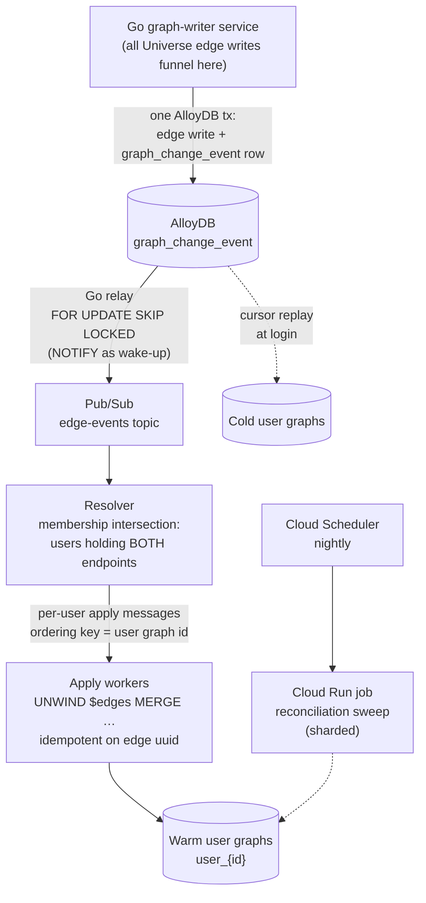

## Pathfinding on three graphs — the pitch

<Info>
**Decided 2026-08-08** — see the Decisions section below. User graphs hold **only** the private layer — KNOWS/FOLLOWS edges, relationship strength, notes, files — as thin stubs keyed by `node_uuid`; all public topology stays in Universe and path queries compose the layers at read time. An **organization graph** is the optional middle tier, queried only in company mode. The fan-out machinery below shrinks to a merge/node-event channel; the options analysis is retained as the decision record. Composed path queries were validated at interactive latency on the live graph 2026-08-08.
</Info>

**Every pathfinding system before us had to pick a poison.**

- **One big shared graph** (LinkedIn-style): paths are computed over declared connections — but "connected" is meaningless. The graph doesn't know that you email Richard weekly and haven't spoken to 400 other "connections" in a decade. And every user's private relationship data has to live in the shared graph, guarded only by permission filters — a privacy incident waiting to happen.
- **Per-user graph copies** (the multi-tenant default): each user gets their own slice of the world graph. Private and fast — but every path is confined to whatever slice got copied, the slice goes stale the moment the world changes, and keeping tens of thousands of copies in sync is a permanent, expensive engineering tax.

**We split the graph the way reality is split — into three layers of trust.**

- **Your user graph** holds the one thing only you have: **who you actually know, and how well** — evidence-based relationship strength computed from real interactions, plus your notes, files, and context. Nothing else.
- **Your organization graph** *(optional — active in company mode)* holds the relationship capital your team shares: colleagues' contacts surfaced as **derived strength signals** — "Sarah has a strong relationship with this person" — never their raw email or calendar. Private to the org, invisible outside it.
- **The universe graph** holds the one thing no individual or company has: **the entire public professional world**, growing and self-enriching around the clock.

A path search composes whichever layers the mode grants. In **personal mode**: hop one comes from your private graph, every hop after runs across the **full, live universe graph**. In **company mode**, the private prefix widens — paths can start *you → colleague → colleague's contact* through the org graph's shared edges before handing off to universe — and every result is synthesized across all three layers, deduplicated by universal ID. Ranking blends it all: your relationship strength on your hops, your colleague's strength on theirs (with an ask-for-intro step built into the path), and everything Orbiter knows about the world for the rest.

**Why that wins:**

1. **Zero staleness.** The moment our enrichment engine learns Grady joined Orbiter, that edge is usable in *every user's* next path query. No sync pipeline, no propagation delay, no per-user copies drifting out of date. Most systems ship paths over yesterday's graph; we ship paths over *right now's*.

2. **Full coverage.** Copied-graph systems can only route through edges that made it into your copy. Our searches traverse everything — so we find the path through the co-worker, the co-investor, the shared board seat that a bounded copy would never contain.

3. **Paths that convert, not just connect.** Anyone can compute degrees of separation. We compute *warm* paths: the first hop is scored on real interaction evidence — who will actually reply, actually make the intro. That signal exists nowhere in a public graph, and it's the difference between a path and an introduction.

4. **Privacy by architecture, not by policy.** Your relationships, notes, and relationship strength physically live in your graph and are never written to the shared one. There is no query that can leak them, no permission bug that can expose them — the isolation is structural.

5. **Compounding network effects at flat cost.** Every improvement to the universe graph — every enrichment run, every new data source — instantly upgrades every user's pathfinding, without touching a single user graph. Intelligence scales once, benefits everyone; user graphs stay tiny and fast forever.

6. **Team reach without pooled data.** Flip to company mode and your anchor set multiplies by your whole org's shared network — enterprise-scale reach — while every layer keeps its own store: personal stays personal, org stays org, public stays public. Switching modes switches *which graphs the query reads*, never where data lives. A colleague leaving the org means their shared edges leave the org graph — nothing to claw back from anyone else's copy.

**One sentence:** we compute paths the way trust actually works — *your* relationships first, your *team's* when you're working as a team, the world's freshest knowledge for every hop after, ranked by who will actually pick up the phone.

## Purpose

Working page for the **Universe → user-graph edge fan-out** problem. It answers the "Enrichment-update fan-out to user graphs" open question on [Universe &lt;&gt; Backend Sync](/guides/open-work/universe-backend-sync) and takes a position on the "copy vs reference" question there.

Status: **copy-vs-reference DECIDED 2026-08-08** *(see Decisions)* — the reference model is adopted; the fan-out analysis below is retained as the decision record. The machinery described here targets **GCP / Go / AlloyDB — not Xano**.

## The problem

User graphs copy nodes from the Universe graph. Copied nodes carry the universal identifiers (`node_uuid`, plus `master_person_id` / `master_company_id`) that key into both Universe and Backend tables.

Universe keeps growing after the copy. Example: Grady Anderson and Orbiter exist as nodes in Universe **and** in user Njogu's graph. Enrichment later creates a new `(Grady)-[WORKS_AT]->(Orbiter)` edge in Universe. Njogu's graph — and every other user graph holding both nodes — is now stale.

Constraints:

- Tens of thousands of user graphs; any given node pair exists in an unknown subset of them.
- An edge is only meaningful in a user graph when **both** endpoints are present there.
- Users keep adding people over time, so "which graphs hold node X" changes continuously.

## Verified constraints

These were verified against FalkorDB docs/tracker and Google Cloud docs on 2026-08-07. They bound every option below.

| # | Fact | Consequence |
|---|---|---|
| 1 | FalkorDB has **no triggers, no CDC, no event hooks**. Keyspace notifications never fire on `GRAPH.QUERY` writes ([issue #1514](https://github.com/FalkorDB/FalkorDB/issues/1514); the unmerged PR #1515 would add a key-level "graph dirty" flag only, and PR #1631 shows emitting from the write thread crashes Redis 8.x). | Change capture must live in **our own write path**. "A function triggered by edge creation" can only mean our writer service, never the database. |
| 2 | **No cross-graph Cypher** — one query targets exactly one graph ([multigraph article](https://www.falkordb.com/news-updates/multigraph-topology-isolation-linear-scale/)). `GRAPH.COPY` clones whole graphs into a must-not-exist key — no subset copy, no merge-into-existing. | A reference model pays an app-layer two-query merge on every read. Incremental propagation must be per-edge `MERGE`, not a graph primitive. |
| 3 | Concurrency is a **per-graph reader-writer lock**: writes to the same graph serialize FIFO; writes to different graphs run in parallel up to `THREAD_COUNT` ([concurrency docs](https://docs.falkordb.com/design/concurrency.html)). Multi-tenancy at &gt;10k graphs is the endorsed pattern. | Fan-out writes across thousands of user graphs parallelize well. The engine is not the bottleneck; orchestration is. Use one parameterized `UNWIND $edges … MERGE` template so the plan cache is shared across all graphs. |
| 4 | Membership ("which users hold node X") must be answered **relationally, never by querying graphs**. Asking 40,000 graphs per edge event is 40,000 queries; an indexed AlloyDB join table answers it in one. | A `user_contact(user_id, node_uuid)` table indexed in both directions is the load-bearing piece of the whole design. The both-endpoints check is one query with two joins. |
| 5 | AlloyDB supports logical decoding (`alloydb.logical_decoding`, pgoutput/wal2json) and Datastream accepts AlloyDB as a CDC source — but Datastream only delivers to BigQuery/GCS, and a self-managed replication slot that goes abandoned **retains WAL indefinitely** (disk-fill outage risk on the source database). | CDC is possible but is not the safest backbone when we own every write path. The transactional outbox gives the same guarantee without slot-lifecycle risk. |
| 6 | Pub/Sub ordering keys guarantee order per key at ≤1 MBps/key; exactly-once applies to pull subscribers only; dead-letter delivery counts are best-effort. Cloud Tasks adds per-queue rate caps (500/s) and task-name dedup (~24h), but is capped at 1,000 queues/region. | Every layer is at-least-once. Graph writes must be **idempotent** (`MERGE` on edge `uuid`). Shard users across a fixed queue set — never queue-per-user. |

## Options considered

| # | Option | Verdict |
|---|---|---|
| 1 | Synchronous fan-out inline at edge creation | Rejected |
| 2 | Transactional outbox → async fan-out | **Recommended core** |
| 3 | CDC / WAL-tailing from AlloyDB | Possible, strictly worse than 2 |
| 4 | Cron-only batch reconciliation | Backstop yes, primary no |
| 5 | Lazy catch-up on read (login sync) | **Recommended companion** |
| 6 | Reference, don't copy | Eliminates the problem for whatever is referenced — see prerequisite decision |

### 1. Synchronous inline fan-out

The edge-creating service resolves affected users and writes all their graphs before returning. Immediately consistent, but enrichment creates edges in bulk, a popular node pair can touch thousands of graphs, and one slow or failed tenant write blocks or poisons the Universe write. No failure isolation, no retry story. Rejected.

### 2. Transactional outbox → async fan-out (recommended core)

Every Universe edge write also inserts a `graph_change_event` row **in the same AlloyDB transaction** — event type (`create` / `update` / `delete` / `merge`), edge `uuid`, both endpoint `node_uuid`s, a per-node sequence number. A small Go relay polls with `FOR UPDATE SKIP LOCKED` and publishes to Pub/Sub; a resolver runs the membership-intersection query and emits one apply message per affected user; apply workers run the idempotent `MERGE`.

Delivery is guaranteed (the event commits or the edge doesn't), freshness is seconds-level, tenant failures are isolated and retryable, and replays are no-ops because `MERGE` keys on the edge `uuid`.

`LISTEN/NOTIFY` works on AlloyDB as a latency-killing wake-up signal for the relay — but requires a session-mode connection (transaction-mode pooling does not support `LISTEN`), and the poller remains the source of truth.

### 3. CDC / WAL-tailing

Tail `pgoutput` from Go (`jackc/pglogrepl`) so nobody can forget the outbox row. The price is the worst failure mode in the design: an abandoned replication slot fills the source database's disk. Since all edge writes will funnel through our own Go graph-writer service anyway, the outbox delivers the same guarantee without that risk. Skip for v1; revisit only if write paths ever multiply beyond our control.

### 4. Cron-only reconciliation

Cloud Scheduler → Cloud Run job walks a watermark over `graph_change_event` (or diffs Universe edges directly), recomputes membership, applies in shards. Simplest possible system, trivially self-healing — but freshness equals the cron period, and every sweep re-pays membership computation for the whole window. Defensible as the *only* mechanism only if next-day freshness is acceptable product behavior.

As a **nightly backstop under option 2 it is non-negotiable**: it is what makes at-least-once delivery and best-effort DLQ semantics acceptable, and it catches anything a bug ever drops. Cloud Run jobs support 7-day timeouts and 10,000 parallel tasks — one job array-sharded over user partitions fits easily.

### 5. Lazy catch-up on read (recommended companion)

Keep a `last_applied_event_seq` cursor per user graph. When a user's session opens (or their graph is next loaded), replay all events past their cursor where both endpoints are in their membership set.

This is the answer to the "tens of thousands of users" number: most of those graphs belong to people who won't log in this week. Combined with option 2 it becomes the cost optimizer — **eager fan-out only to warm graphs (active in the last N days), cursor catch-up for cold ones** — so write amplification tracks *active* users, not registered users. The outbox event log is exactly the replay source; this is nearly free to add.

### 6. Reference, don't copy

Don't sync shared edges at all: the user graph holds only user-private data (KNOWS edges, notes, Known-model state) plus node stubs; shared Universe edges are read live through a gateway and merged app-side. Eliminates fan-out, storage multiplication, staleness, and merge-repointing for everything referenced. The price is constraint 2: every read pays a two-query app-layer merge. See the prerequisite decision below — this is not either/or.

## Recommended architecture

1. **Outbox** — Universe edge write + `graph_change_event` row in one AlloyDB transaction: event type, edge `uuid`, both endpoint `node_uuid`s, per-node sequence number.
2. **Relay** — Go poller, `FOR UPDATE SKIP LOCKED` (two replicas for HA), `NOTIFY` wake-up on a dedicated session-mode connection. Publishes to Pub/Sub.
3. **Resolver** — one indexed AlloyDB query: intersection of the membership sets for the two endpoints. Emits one apply message per user holding both, ordering key = user graph ID.
4. **Apply workers** — batched `UNWIND $edges AS e MATCH (a {uuid: e.src}), (b {uuid: e.dst}) MERGE (a)-[r:REL {uuid: e.uuid}]->(b) SET …` per user graph. Insert a Cloud Tasks stage (hashed task names `hash(edge_uuid:user_id)`, sharded queue set) only if FalkorDB needs rate protection or storm dedup.
5. **Warm/cold split** — eager fan-out only to graphs active in the last N days; cold graphs catch up at login via the per-graph cursor over the event log.
6. **Reconciliation** — nightly Cloud Scheduler → Cloud Run job diffs and repairs in shards. This backstop is what makes at-least-once acceptable everywhere else.

## Required regardless of option

<Card icon="rotate-left">

**Add-time edge backfill — the mirror of this whole page**

The fan-out handles "edge created after both nodes were copied." The mirror case: a user adds Grady *after* the Grady↔Orbiter edge already exists. CREATE-CONTACTS must therefore also copy all Universe edges between the incoming node and nodes **already in that user's graph** (one query: Universe edges where the other endpoint is in the user's membership set). Without this, fan-out keeps existing users fresh while every late adder is permanently missing edges. Same membership machinery run in reverse — build them together.

</Card>

<Card icon="code-merge">

**Both-endpoints semantics**

User holds Grady but not Orbiter: default is skip (no dangling endpoints). Decide explicitly whether any edge types instead *pull in* the missing node as a stub — that changes the resolver from an intersection to a union with side effects.

</Card>

<Card icon="clock-rotate-left">

**Updates, deletes, and merges ride the same log**

Edge property updates (`description`, `valid_from` / `valid_to` invalidations), deletions, and Universe merge events (which must repoint copies via the loser → winner merge log) are all event types on `graph_change_event`. The per-node sequence number also resolves the push-vs-merge ordering race flagged on [Universe &lt;&gt; Backend Sync](/guides/open-work/universe-backend-sync).

</Card>

<Card icon="fire">

**The hot-node problem**

Fan-out cost per edge = users holding both endpoints. For typical contacts that is small. For a celebrity node held by 5,000 users, one enrichment run touching them means 5,000 × edges written. Mitigations: batch per user graph (one `UNWIND` per user per relay cycle, not per edge), and consider routing very-high-degree public entities to the reference model — a per-node-type or per-degree policy rather than one global answer.

</Card>

## Prerequisite decision: copy narrowly, reference broadly

Two pages currently hold positions in deliberate tension:

- [Universe &lt;&gt; Backend Sync](/guides/open-work/universe-backend-sync): CREATE-CONTACTS **copies** the person's nodes/edges into the user's graph — which makes fan-out mandatory (this page).
- [Orbiter Universe Standalone](/guides/open-work/orbiter-univers-standalone) Decision 5: user graphs use a **hybrid read model** — App-backend projections for stable fields, a Universe graph gateway for live paths and public context, hot snippets materialized into local caches only when needed — explicitly *without* copying the whole public graph per tenant.

These reconcile into the recommended posture: **copy narrowly, reference broadly.** Copy into user graphs only what the product must traverse locally and fast (the contact's immediate neighborhood, edges feeding Known scoring); read the long tail through the gateway. The outbox pipeline then only fans out the *copied* slice — which shrinks the hot-node problem and the storage bill proportionally. The narrower the copy boundary, the cheaper every part of this page gets, so **draw that boundary first**.

## Current state (migration notes)

Verified against the live Xano workspace 2026-08-07:

- There are **no per-user FalkorDB graphs today** — everything lives in the single `live` graph (one row in `environmental_variables_falkordb`, table 508); per-user graph naming is net-new.
- All Xano → FalkorDB traffic funnels through `mvp/falkor/send-cypher` (fn 2815) and its variants; ~25 edge-composing functions call it. The Go graph-writer service inherits this single-choke-point shape — which is exactly what makes the outbox reliable.
- The current "add person" flow (`POST /my-persons` → fn 1855) inserts membership rows only — it performs **zero graph writes**. Subgraph copy machinery is entirely net-new.
- Membership is already relational: `contacts` (table 128: `user_id` + `master_person_id`, indexed both directions) and `my_company` (table 149). The AlloyDB `user_contact` table keyed by `node_uuid` is the successor of this shape. `node_registry` (758) holds 106 rows today — not a usable mirror yet.

Because copy machinery, per-user graphs, and fan-out are all net-new, they can be designed as one coherent Go service from day one — there is no legacy sync behavior to migrate.

## Decisions

<Card icon="circle-check">

**The reference model is adopted: user graphs hold only the private layer; shared topology is never copied** *(decided 2026-08-08)*

The copy-vs-reference question — this page's reason for existing — is resolved in favor of reference. Concretely:

- **User graph** = a private star: thin stub nodes keyed by `node_uuid` (person and company), the user's KNOWS / FOLLOWS / WORKS_AT edges with evidence-based relationship strength, and private overlays (notes, files, Known-model state). Nothing shared is ever copied in.
- **Organization graph** = the optional middle tier, queried only in company mode: colleagues' shared edges exposed as derived strength signals, never raw data.
- **Universe graph** = the sole holder of public topology. New universe edges become visible to every user's next query the moment they are written — there is nothing to propagate.
- **Reads compose the layers**: the private prefix resolves in the user (and, in company mode, org) graph; remaining hops run over the live universe graph; results merge app-side, deduplicated by `node_uuid`, ranked by blending per-tier weights.

Consequences:

- **The edge fan-out problem this page opened with is designed away** — no copies exist to refresh. Options 1–5 below are retained as the decision record; the outbox architecture survives only as a small **merge/node-event channel** (universe merges must still repoint stubs and private edges via the loser → winner mapping, delivered reliably).
- **CREATE-CONTACTS shrinks** to: create stub + KNOWS edge + membership row + mem0 kickoff. The "tier-3 with nothing to copy" pending-state question on [Universe &lt;&gt; Backend Sync](/guides/open-work/universe-backend-sync) dissolves — there is never a subgraph copy.
- **Validation**: composed anchor-decomposition path queries were benchmarked on the live graph 2026-08-08 and meet interactive latency at realistic contact-list sizes; implementation notes are held privately pending IP filing.

</Card>

## Open questions

- **Organization-graph tier** *(added 2026-08-08)*. Company mode adds the org graph as a third query source. To define: sharing semantics into the org graph (opt-in vs automatic, derived-strength-only), leaver revocation (removing a departed member's shared edges), the mode-switch query contract, and whether org-graph edges carry their own materialized strength scores or resolve the colleague's score at read time.
- **FOLLOWS seeding gate** *(added 2026-08-08)*. Company FOLLOWS edges are proposed to seed from interactions with people at a domain — but person-contact creation is decided **outbound-only**, and inbound-driven FOLLOWS would re-open the spam/newsletter pollution that rule closed. Define the gate: interaction threshold, outbound-only vs accepted-calendar-invite intent, role-domain blocklist.
- **Read-service merge contract** *(added 2026-08-08)*. The app-side composition layer needs a decided precedence rule (universe wins public properties, user graph wins private ones), the dedupe key (`node_uuid`), and the degraded mode when a tier is unavailable.
- **Universe read SLO / degraded mode** *(added 2026-08-08)*. Under the reference model Universe is a hard availability dependency for every card, path, and RAG read. Define the SLO, read-replica strategy, and the hot-snippet cache that serves stale-but-usable results when Universe is unreachable.
- **Hot-node query cost** *(reframed 2026-08-08 — was "hot-node policy")*. The write-side version (fan-out amplification on entities held by thousands of users) dissolved with the reference model. The read-side version survives: a very-high-degree target makes the composed path query's traversal frontier large. Re-benchmark as Universe grows; define frontier caps or precomputation for celebrity-class nodes.
- **Merge/node-event retention** *(reframed 2026-08-08 — was "event retention")*. The event log now carries only merge/node events, but offline users still need reliable catch-up: retention must cover the oldest dormant user's cursor, or define the registry-miss → merge-log recovery fallback as the backstop.
- **Membership index consistency** *(reduced scope 2026-08-08)*. `user_contact` no longer gates edge fan-out, but it still drives merge repointing and org-tier resolution — it must be written transactionally with (or reliably before) stub creation.
- ~~**Copy-boundary definition.**~~ **Decided 2026-08-08** — the boundary is "nothing shared is copied"; see Decisions.
- ~~**Warm/cold threshold.**~~ **Dissolved 2026-08-08** — no eager fan-out to user graphs exists under the reference model.
- ~~**Stub pull-in edge types.**~~ **Dissolved 2026-08-08** — stubs exist only for actual contacts/follows; shared edges are read from Universe, never materialized.

## Related work

- [Universe &lt;&gt; Backend Sync](/guides/open-work/universe-backend-sync) — the parent workshop; this page answers its fan-out open question
- [Orbiter Universe Standalone](/guides/open-work/orbiter-univers-standalone) — Decision 5's hybrid read model is the "reference broadly" half of the posture here
- [Contacts Interaction Log](/guides/open-work/contacts-interaction-log) — the existing AlloyDB-table + Go-cron pattern this page's reconciliation job mirrors
