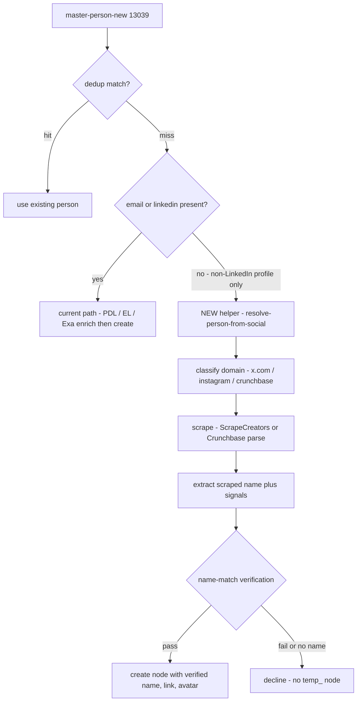

<Info>
  **SCOPE / EXPLORATION ONLY — nothing is built.** This page explores a possible modification to the current `get-add/master-person-new` (#13039) flow. **No Xano changes have been made.** It exists so Mark can decide whether/how to build it; only then does it become a build plan (or a [Universe-rebuild](/guides/open-work/orbiter-univers-standalone/enrichment-gcp-migration) spec item).
</Info>

## The problem today

When `get-add/master-person-new` (#13039) is called with **only a non-LinkedIn profile URL** (x.com / Instagram / Crunchbase), **no email, no LinkedIn**, and the person doesn't already exist, the current behavior is (verified by tracing the live XanoScript):

- `$linkedinUrl` is found only via `array.find links icontains "linkedin.com"` (line 182) → stays empty.
- Both dedup passes miss → no match.
- **All identity enrichment no-ops** — PDL is called with empty params, and Enrich Layer / Exa / FullEnrich are all LinkedIn-or-email gated (`cascade-person-data` #13037), so none fire.
- No name resolves → the **temp-name fallback** fires (lines 1519–1543): `name = "temp_" + crypto.randomUUID().substring(0,12)`. The handle is **never** parsed into a name.
- A `master_person` is created **unconditionally** (line 1606) with `name = temp_<hash>`, `linkedin_url = null`; the URL is saved as a `master_link`; the run is **logged as success**.

<Warning>
  Net result: a **junk-named, enrichment-less node** seeds the graph from a bare social handle, and nothing flags it as low-quality. This is exactly the _"Verify master\_person creation from a non-LinkedIn profile URL"_ item on the [migration freeze checklist](/guides/open-work/orbiter-univers-standalone/enrichment-gcp-migration).
</Warning>

## The proposed flow

Branch off #13039 at the **dedup-miss / pre-create** point and hand off to a new worker — call it **`resolve-person-from-social`** (proposed) — that **scrapes the profile to reveal a real name, verifies it, and only then creates the node**. If no name can be confidently resolved, it **declines** instead of minting a `temp_` record.

### Trigger condition

After `match-master-person` (#13038) returns no match, route to the helper instead of the temp-name create **when all of these hold**:

- `email` is empty, **and**
- `$linkedinUrl` is empty (no `linkedin.com` in `links[]`), **and**
- there is **≥1 non-LinkedIn profile link** present (`x.com` / `instagram.com` / `crunchbase.com` / …), **and**
- dedup found no existing record.

### Helper steps

<Steps>
  <Step title="Classify the profile domain">
    Reuse the domain classifier already in `create-master-link` (#2541) — it normalizes `twitter.com → x.com` and branches on `x.com` / `instagram.com` / `crunchbase.com` / etc.
  </Step>
  <Step title="Scrape to reveal identity">
    Call the provider that returns a **name** for that domain:

    | Domain | Provider call | Returns a name? |
    | --- | --- | --- |
    | `x.com` | ScrapeCreators `/v1/twitter/profile` (as in `scrape-twitter-person` #2106) | ✅ `legacy.name` / `screen_name` |
    | `instagram.com` | ScrapeCreators `/instagram/profile` | ⚠️ name is in `user.full_name`, but current `scrape-instagram` (#2108) **only reads avatar \+ bio links** — the helper must read `full_name` |
    | `crunchbase.com` | Firecrawl \+ `parse-cb-person` (#2677, LLM extractor) | ✅ structured `name`, title, org, linkedin/twitter |
  </Step>
  <Step title="Extract the candidate name + corroborating signals">
    Pull `scraped_name` plus any supporting identity signals the scrape exposes (bio, current org, location, cross-links to other profiles).
  </Step>
  <Step title="Name-match verification gate (the crux)">
    Normalize both sides via `name-format` (#2649), then compare. **Only proceed if the match passes.**

    - **Baseline matcher (reuse):** the bidirectional substring-containment lambda inside `resolve-temp-name` (#12890) — normalize to alpha-lowercase, require `input.includes(out) || out.includes(input)`.
    - **Build-new (recommended):** a real fuzzy comparator (Levenshtein/Jaro) or a small LLM judge — **no fuzzy name matcher exists today.**
  </Step>
  <Step title="Create — or decline">
    - **Pass** → create the `master_person` with the **verified real name** (not `temp_`), write the social `master_link`, attach the avatar via `replace-avatar` (#237), and continue into the normal node-creation \+ downstream dispatch.
    - **Fail / no resolvable name** → **do not create a `temp_` node.** Return a structured `unresolved` signal (reject / queue-for-review / skip — see open decision below).
  </Step>
</Steps>

## The name-match gate — key open decision

The crux is **what the scraped name is matched _against_.** Two modes:

| Mode | When | Match | Trade-off |
| --- | --- | --- | --- |
| **A — strict (recommended)** | caller passed a `full_name` alongside the URL | scraped name **vs caller-provided expected name** | Highest precision; only works when a name was supplied |
| **B — corroboration** | no expected name supplied | scraped name must look like a **real human name** (not a brand/handle) **and** be corroborated across signals (e.g. a 2nd linked profile agrees) | Enables the pure-URL case, but weaker guarantee |

**Recommendation:** _require a name to proceed._ If there's neither a caller-provided name nor a confidently-resolved real name, **decline** rather than create — that's the whole point of removing the `temp_` path.

## Reuse vs. build-new

Grounded in a read-only audit of workspace 3:

| Already exists — reuse | Genuinely build-new |
| --- | --- |
| **ScrapeCreators** integration (repo-wide): Twitter `#2106`, Instagram `#2108`, LinkedIn `#12556`, YouTube `#12670` | The **name-match verification gate** (no fuzzy matcher today) |
| **Crunchbase** person scrape → name: `parse-person-page#2760` → `parse-cb-person#2677` | The **cutover branch** in `#13039` (no-email/no-linkedin \+ non-LinkedIn profile → helper) |
| `name-format#2649` (name normalizer) | The new worker **`resolve-person-from-social`** |
| `replace-avatar#237` (source-priority avatar) | **Extend `scrape-instagram` `#2108`** to read `user.full_name` (it ignores name today) |
| Containment-match pattern in `resolve-temp-name#12890`; domain classifier in `create-master-link#2541` | "Decline / queue-for-review" handling for the no-name case |

## What changes vs. today

|  | Today (#13039) | Proposed |
| --- | --- | --- |
| Name | `temp_<hash>` placeholder | Verified real name, or **no node** |
| Identity enrichment | None (all LinkedIn/email-gated) | Social/Crunchbase scrape reveals identity |
| Junk nodes | Created \+ logged as success | **Declined** when unresolved |
| Avatar | Best-effort async only | Attached on the verified-create path |

## Open questions / decisions

- **Name source for the gate** — Mode A (caller-provided) vs Mode B (corroboration) vs both.
- **Matcher** — reuse containment (`#12890`) vs build a fuzzy comparator vs an LLM judge; and the pass threshold.
- **On fail** — hard reject, queue-for-review, or create with a `low_confidence` flag?
- **Domain scope for v1** — `x.com`, `instagram.com`, `crunchbase.com`. (Note: **facebook** has no scraper today; **TikTok/Threads** wrappers exist but aren't wired into `create-master-link`; **YouTube** `#12670` exists.)
- **Does this also apply when a name _is_ provided** (verify-before-create) **or only the no-name case?**
- **Where to build it** — a pre-migration Xano change, or a behavior in the [Universe Go rebuild](/guides/open-work/orbiter-univers-standalone/enrichment-gcp-migration)? Given the parity-first / hard-freeze stance, **scoping now and building it in the Go rebuild** avoids adding to the frozen Xano baseline.

## Not building this

This page is scope-only; **no Xano modifications were made**. Next step: Mark picks Mode A/B \+ the fail behavior, and this becomes a build plan (or a Universe-rebuild spec item).

## Reference

- **Current behavior trace:** `get-add/master-person-new` `#13039` (temp-name branch lines 1519–1543; create line 1606; LinkedIn-only URL detect line 182), `cascade-person-data` `#13037` (enrichment gating), `match-master-person` `#13038`, `create-master-link` `#2541`.
- **Scrape/identity infra:** `scrape-twitter-person` `#2106`, `scrape-instagram` `#2108`, `parse-cb-person` `#2677`, `name-format` `#2649`, `resolve-temp-name` `#12890`, `replace-avatar` `#237`.
- **Related:** [Enrichment GCP Migration](/guides/open-work/orbiter-univers-standalone/enrichment-gcp-migration) · [Person waterfall](/guides/enrichment/waterfall/person-waterfall) · [Person enrichment cascade](/guides/open-work/person-enrichment-cascade)