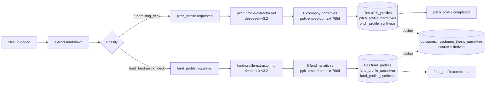

Orbiter Backend now runs two separate profile pipelines for uploaded decks. A deck raising a round **for a company** flows through the existing pitch profile pipeline; a deck raising **a fund** from limited partners flows through a new fund profile pipeline with its own tables, prompt, narrative dimensions and vectors. Both produce 768-dimension vectors in the same embedding space as `outcomes.investment_thesis_narratives`, so either can be scored against investor theses.

This page is the reference for tuning that scoring in Universe: what each pipeline stores, how the six fund dimensions map onto the six thesis dimensions, the starting weights, and the two match APIs.

<Check>
  **Shipped to dev (2026-09-04).** orbiter-backend [#181](https://github.com/Orbiterio/orbiter-backend/pull/181) and [#182](https://github.com/Orbiterio/orbiter-backend/pull/182) are merged and deployed for [ORBIT-1852](https://linear.app/orbiter-io/issue/ORBIT-1852/optimize-pitch-profile-for-funds). Migration `files_011_fund_profiles` is applied; the four dev fund decks have been rebuilt through the new pipeline (4 of 4 completed, 6 narratives each). Scoring is expected to move to Universe; the `fund-thesis-match` endpoint documented below stays in the backend as the reference implementation to port from. `outcomes.investment_theses*` is unchanged.
</Check>

## Why two pipelines

The company extractor was run against four fund decks uploaded to dev (Star51 Capital, Citrine Venture Fund, NOEMIS Ventures II, Kaleidoscope Fund I). Almost nothing a fund deck says has a column on `files.pitch_profiles`:

| Fund deck content | What the company schema did with it |
|---|---|
| Target size, hard cap, first close, committed to date | Only the target landed, in `raise_amount_usd` |
| Management fee, carry, GP commit, fund life, investment period, minimum LP commitment, capital-call schedule | Dropped |
| Fund number and vintage (Fund I, Fund II) | `raise_stage` on 2 of 4 decks, otherwise null |
| Portfolio construction: number of companies, first-check size, target ownership, entry valuation, reserve ratio | `target_check_size_*` on 2 of 4, semantically inverted (on a company deck that column is the check the company wants to receive); `use_of_capital` polluted |
| Track record: prior fund MOIC, DPI, TVPI, IRR, exits, uprounds | Dropped |
| GP team, advisory board, venture partners | GPs only, in `founder_names` |
| Sector, stage, geography thesis | `industries` correct; `sector` came back as the literal string "Venture Capital" on 3 of 4 |
| Anchor LPs, service providers, sourcing platform | Dropped; `notable_customers` filled with portfolio companies' customers |

ARR, MRR, customer count, GTM model and team size were null on every fund deck. The six company narratives read acceptably only because the LLM improvised with no fund guidance.

## Pipeline



The file itself completes as soon as classification and chunk embedding finish. The profile runs as its own Pub/Sub message so an LLM failure retries only the profile, never the extraction.

### Classification

`assets/prompts/files-classifier.md` gained one label. The classifier (`openai/gpt-5-nano`, `FILES_CLASSIFIER_MODEL`) now distinguishes:

```text
fund_fundraising_deck (pitch deck raising capital for a fund - not a company - from investors)
fundraising_deck      (pitch deck raising capital from investors)
```

On the four dev fund decks plus the Orbiter company deck the classifier returned 5 of 5 correct. The Go enum lives in `internal/features/files/classify/classifier.go` as `FileTypeFundFundraisingDeck`.

### Routing

`internal/features/files/service_worker.go`:

```go
switch ft {
case classify.FileTypeFundraisingDeck:
    err = s.publishPitchProfileRequest(ctx, evt.FileID)
case classify.FileTypeFundFundraisingDeck:
    err = s.publishFundProfileRequest(ctx, evt.FileID)
}
```

## Tables

Both pipelines use the same three-layer shape: an entity row of structured filters, one narrative row per dimension carrying the vector, and a synthesis stub. No `CHECK` constraints on enum-like columns; `status`, `dimension` and `source` are validated in Go.

### Layer 1: entity row

| | `files.pitch_profiles` (company) | `files.fund_profiles` (fund) |
|---|---|---|
| Identity | `company_name`, `sector`, `industries`, `stage`, `founded_year`, `headquarters`, `country_code` | `fund_name`, `gp_firm_name`, `fund_number`, `vintage_year`, `fund_type`, `headquarters`, `country_code` |
| Thesis | `industries` | `industries`, `stage_focus`, `geography` |
| Raise | `raise_amount_usd`, `raise_stage`, `target_check_size_min/max/sweet_spot` (checks the company wants) | `target_fund_size_usd`, `hard_cap_usd`, `committed_to_date_usd`, `first_close_date`, `final_close_target_date` |
| Terms | | `management_fee_pct`, `carried_interest_pct`, `gp_commitment_pct`, `fund_life_years`, `investment_period_years`, `min_lp_commitment_usd`, `capital_call_schedule` |
| Portfolio construction | | `target_portfolio_count`, `check_size_min/max/sweet_spot_usd` (checks the fund writes), `target_ownership_min/max_pct`, `reserve_ratio_pct`, `leads_rounds` |
| Traction | `arr_usd`, `mrr_usd`, `customer_count`, `runway_months`, `growth_rate_pct` | `prior_funds` (array of `{name, vintage_year, size_usd, investments_count, moic, dpi, tvpi, irr_pct, exits_count, notes}`), `notable_exits`, `notable_portfolio_companies` |
| Team | `team_size`, `founder_names` | `gp_names`, `team_size`, `advisory_board`, `venture_partners` |
| Business | `gtm_model`, `business_model_type`, `use_of_capital`, `prior_investors`, `notable_customers`, `tailwinds` | `anchor_lps`, `service_providers` |
| Provenance | `deck_quality_score`, `source_url`, `deck_version`, `deck_date`, `data_sources`, `last_validated_date` | same |
| State | `status`, `error`, `attempts`, `last_attempt_at`, timestamps | same |

`industries`, `stage_focus` and `geography` on `fund_profiles` are named identically to the same columns on `outcomes.investment_theses` so the thesis-side filter logic applies symmetrically.

### Layer 2: narratives

Identical shape on both sides:

```sql
id                UUID PRIMARY KEY,
profile_id        UUID NOT NULL REFERENCES files.<pitch|fund>_profiles(id) ON DELETE CASCADE,
dimension         TEXT NOT NULL,
source            TEXT NOT NULL DEFAULT 'declared',
narrative         TEXT NOT NULL,
embedding         vector(768) NOT NULL,
model_id          TEXT NOT NULL,      -- pplx-embed-context-v1
model_dimensions  INT  NOT NULL,      -- 768
UNIQUE (profile_id, dimension, source)
```

Six rows per profile. All six narratives are embedded in one contextualized request, so each vector is aware of the other five. The embedding width is shared through `FILES_PITCH_PROFILE_EMBEDDING_DIMENSIONS` (768) so pitch, fund and thesis vectors stay comparable.

### Layer 3: synthesis

Stub rows only, keyed by `profile_id`. `fund_profile_synthesis` has `fund_summary`, `lp_fit_notes`, `risk_flags`, `confidence_scores`; nothing writes them yet.

## Narrative dimensions

The fund pipeline uses fund-native names. They are not renamed company dimensions; each asks a different question of the deck. The right-hand column is the thesis dimension whose **derived** narrative answers the same question about an investor, and is the join key the match uses.

| Fund dimension | What the narrative covers | Maps to thesis dimension | Company equivalent |
|---|---|---|---|
| `gp_track_record` | Who the GPs are, prior operating and investing roles, exits founded or led, prior funds managed, advisory board, venture partners | `founder_fit` | `founder_fit` |
| `fund_thesis` | What the fund invests in and why now: sectors, stages, geographies, the market view, the kind of founder targeted | `problem_market` | `problem_market` |
| `sourcing_edge` | How the fund sees and wins deals first: proprietary platforms, anchor partnerships, brand, network, inbound engines | `competitive_moat` | `competitive_moat` |
| `performance_momentum` | Prior fund MOIC / DPI / TVPI / IRR, exits, markups, uprounds, follow-on raised, capital already committed, first-close status | `traction_momentum` | `traction_momentum` |
| `fund_economics` | Terms offered to LPs: target and hard cap, fee, carry, GP commit, fund life, investment period, minimum commitment, call schedule, co-invest rights | `business_model` | `business_model` |
| `portfolio_strategy` | Number of investments, first-check size, entry valuation, target ownership, reserves, lead posture, post-investment support, liquidity strategy, next-fund plans | `expansion_roadmap` | `expansion_roadmap` |

Dimension labels are only join keys. What makes a fund vector comparable to a thesis vector is the shared embedding model (`pplx-embed-context`, 768 dimensions), not the label. Universe can compare any fund dimension against any thesis dimension if a different pairing scores better; the table above is the starting pairing.

## Extraction prompt

`assets/prompts/fund-profile-extractor.md`, hot-reloaded on every call. Model is `FILES_FUND_PROFILE_EXTRACTOR_MODEL` (default `deepseek/deepseek-v3.2`, same as the company extractor). Rules that differ from the company prompt:

- The subject is the fund and its GP; portfolio companies appear only as evidence.
- Percentages are plain numbers (`2.5% fee` becomes `2.5`; `80/20 carry` becomes `20`). Multiples are plain numbers (`3.2x MOIC` becomes `3.2`).
- `check_size_*` and `target_ownership_*` describe the fund's first check **into** companies; the LP side is `min_lp_commitment_usd`.
- Term tables and "Fund Summary" / "Investment Terms" slides are read row by row. A count range uses the midpoint (`20-30 companies` becomes `25`).
- `service_providers` includes only roles the deck names; `deck_quality_score` is 0 to 100.

Go-side `normalize()` in `fundprofile/extractor.go` guards three things seen live:

- A quality score outside 0 to 100 is dropped (deepseek returned `-75` and `-1` for two of four decks on the first run).
- Provider roles with an empty value are removed (unnamed roles came back as `""`).
- A missing `fund_name` is derived as `<gp_firm_name> Fund <roman numeral>` (the Star51 deck names the firm and "Fund I" but never the vehicle, so one dev run landed with a null name). An extracted name is never overwritten.

## Events

Both `requested` events carry only the file id; the markdown is already on the row.

```json fund_profile.requested
{ "file_id": "01a06287-4fd4-7552-aaa8-106b3e1a3815" }
```

`fund_profile.completed` carries the Layer 1 row so a webhook consumer can upsert without calling back. Narratives and vectors are excluded. Abbreviated:

```json fund_profile.completed
{
  "profile_id": "01a0a2c1-9b0e-7f3a-8e2d-4c1b2a3d4e5f",
  "file_id": "01a06287-4fd4-7552-aaa8-106b3e1a3815",
  "completed_at": "2026-09-04T13:42:10Z",
  "classification": "fund_fundraising_deck",
  "fund_name": "NOEMIS Ventures II, LP",
  "gp_firm_name": "NOEMIS Ventures GP II, LLC",
  "fund_number": 2,
  "vintage_year": 2023,
  "fund_type": "venture",
  "industries": ["FinTech", "Marketplaces", "AI / Machine Learning"],
  "stage_focus": ["pre_seed", "seed"],
  "target_fund_size_usd": 50000000,
  "management_fee_pct": 2.5,
  "carried_interest_pct": 20,
  "gp_commitment_pct": 1,
  "fund_life_years": 10,
  "investment_period_years": 5,
  "min_lp_commitment_usd": 1000000,
  "target_portfolio_count": 30,
  "check_size_min_usd": 500000,
  "check_size_max_usd": 2000000,
  "check_size_sweet_spot_usd": 1000000,
  "target_ownership_min_pct": 10,
  "target_ownership_max_pct": 20,
  "leads_rounds": true,
  "gp_names": ["Simeon Iheagwam"],
  "prior_funds": [
    { "name": "Pilot Fund", "vintage_year": 2016, "investments_count": 11, "moic": 3.2, "dpi": 0.3, "exits_count": 4 },
    { "name": "Fund I", "vintage_year": 2021, "investments_count": 21, "moic": 1.41 }
  ],
  "anchor_lps": ["Plex Capital", "Silicon Valley Bank", "Alphabet", "Foot Locker, Inc."],
  "service_providers": { "bank": "Silicon Valley Bank", "fund_admin": "Carta", "legal": "Cooley" },
  "deck_quality_score": 75,
  "narrative_count": 6
}
```

Both `completed` events are on the webhooks allow-list (`webhookspub.EventTypes`, `fanOutEvents`).

## Matching

Both match queries have the same structure: pull the profile's six `declared` vectors, cosine-compare each against the paired thesis dimension's `derived` vector for every `completed` thesis, blend into a weighted composite, filter, sort, cap at `top_n`. Cosine similarity is `1 - (a <=> b)` in pgvector.

### Weights

| Thesis dimension | Company match weight | Fund dimension | Fund match weight |
|---|---|---|---|
| `founder_fit` | 0.30 | `gp_track_record` | 0.20 |
| `problem_market` | 0.20 | `fund_thesis` | **0.45** |
| `competitive_moat` | 0.15 | `sourcing_edge` | 0.10 |
| `traction_momentum` | 0.15 | `performance_momentum` | 0.15 |
| `business_model` | 0.12 | `fund_economics` | 0.03 |
| `expansion_roadmap` | 0.08 | `portfolio_strategy` | 0.07 |

The company weights are the v1 spec. The fund weights are a first guess, not yet validated against live scores, chosen on two arguments: an investor's sector, stage and geography focus is the strongest predictor of interest in a fund, so `fund_thesis` dominates; fee and carry terms have no analogue in a portfolio-derived thesis, so `fund_economics` barely counts.

Where they live in the backend: SQL literals in `internal/features/outcomes/vectorsearch/queries/match_fund.sql` and mirrored constants in `fund_types.go` (`FundWeight*`). A unit test asserts they sum to 1.0. Change both together.

### Fund match SQL (core)

```sql
WITH fund AS (
    SELECT dimension, embedding
    FROM files.fund_profile_narratives
    WHERE profile_id = $1 AND source = 'declared'
),
gp AS (  -- gp_track_record -> founder_fit
    SELECT n.thesis_id, 1 - (n.embedding <=> f.embedding) AS s
    FROM outcomes.investment_thesis_narratives n
    JOIN fund f ON f.dimension = 'gp_track_record'
    WHERE n.dimension = 'founder_fit' AND n.source = 'derived'
),
th AS (  -- fund_thesis -> problem_market
    SELECT n.thesis_id, 1 - (n.embedding <=> f.embedding) AS s
    FROM outcomes.investment_thesis_narratives n
    JOIN fund f ON f.dimension = 'fund_thesis'
    WHERE n.dimension = 'problem_market' AND n.source = 'derived'
),
-- se (sourcing_edge -> competitive_moat), pf (performance_momentum -> traction_momentum),
-- ec (fund_economics -> business_model), ps (portfolio_strategy -> expansion_roadmap) follow the same shape
SELECT
    t.id AS thesis_id, t.company_id, t.person_id, t.firm_name, t.investor_type, t.data_source,
    gp.s AS gp_track_record_score, th.s AS fund_thesis_score, se.s AS sourcing_edge_score,
    pf.s AS performance_momentum_score, ec.s AS fund_economics_score, ps.s AS portfolio_strategy_score,
    (th.s * 0.45 + gp.s * 0.20 + pf.s * 0.15 + se.s * 0.10 + ps.s * 0.07 + ec.s * 0.03) AS composite_score
FROM outcomes.investment_theses t
JOIN gp ON gp.thesis_id = t.id
JOIN th ON th.thesis_id = t.id
JOIN se ON se.thesis_id = t.id
JOIN pf ON pf.thesis_id = t.id
JOIN ec ON ec.thesis_id = t.id
JOIN ps ON ps.thesis_id = t.id
WHERE t.status = 'completed'
  AND (cardinality($2::text[]) = 0 OR EXISTS (SELECT 1 FROM jsonb_array_elements_text(t.stage_focus) s WHERE LOWER(s) = ANY ($2)))
  AND (cardinality($3::text[]) = 0 OR EXISTS (SELECT 1 FROM jsonb_array_elements_text(t.geography) g WHERE LOWER(g) = ANY ($3)))
  AND (cardinality($4::text[]) = 0 OR LOWER(COALESCE(t.investor_type, '')) = ANY ($4))
ORDER BY composite_score DESC
LIMIT $5;
```

The company query (`match.sql`, `MatchPitchAgainstDerivedTheses`) is the same with `files.pitch_profile_narratives`, identical dimension names on both sides, the company weights, and no `investor_type` filter.

### Filters

| Filter | Company match | Fund match | Semantics |
|---|---|---|---|
| `stage_focus` | yes | yes | case-insensitive any-of against `investment_theses.stage_focus` |
| `geography` | yes | yes | case-insensitive any-of against `investment_theses.geography` |
| `investor_type` | no | yes | case-insensitive any-of against `investment_theses.investor_type` |

`investor_type` is the lever for restricting fund matches to investor kinds that commit to funds. Dev thesis universe as of 2026-09-04: 101 `angel`, 54 `vc_fund`, 7 `corporate_vc`, 3 `other`, 2 `syndicate`. There are no `family_office` or `fund_of_funds` theses yet, so true fund-to-LP fit is a data gap, not a schema gap.

## APIs

Both endpoints are `POST`, unauthenticated (`security: []`), under `/v1/outcomes/vector-search/`. Responses use the standard envelope. `top_n` is clamped to `[1, 200]` and defaults to `50`. A profile with fewer than six declared narratives returns `422`; a profile with none returns `404`.

Base URLs: `http://localhost:8080/v1` (local), `https://orbiter-backend-cprh6jsjpa-uc.a.run.app/v1` (staging).

### Company: `investment-thesis-match`

<CodeGroup>

```bash cURL
curl -X POST https://orbiter-backend-cprh6jsjpa-uc.a.run.app/v1/outcomes/vector-search/investment-thesis-match \
  -H "Content-Type: application/json" \
  -d '{
    "pitch_profile_id": "019ff5ff-15c0-7ec2-93c7-8818497d38c1",
    "top_n": 25,
    "filters": {
      "stage_focus": ["seed", "series_a"],
      "geography": ["US"]
    }
  }'
```

```json 200
{
  "data": {
    "matches": [
      {
        "thesis_id": "019fa1b2-3c4d-7e5f-8a6b-7c8d9e0f1a2b",
        "master_company_id": 48213,
        "master_person_id": null,
        "firm_name": "Crosslink Capital",
        "investor_type": "vc_fund",
        "scores": {
          "founder_fit": 0.71,
          "problem_market": 0.83,
          "competitive_moat": 0.66,
          "traction_momentum": 0.74,
          "business_model": 0.69,
          "expansion_roadmap": 0.61
        },
        "composite_score": 0.7249,
        "environment": "live"
      }
    ],
    "pitch_profile_id": "019ff5ff-15c0-7ec2-93c7-8818497d38c1",
    "total_evaluated": 165
  },
  "error": null,
  "meta": { "requestId": "c9f6f5a2-0e27-4d1e-9d3d-6f1e2b3c4d5e" }
}
```

</CodeGroup>

### Fund: `fund-thesis-match`

<CodeGroup>

```bash cURL
curl -X POST https://orbiter-backend-cprh6jsjpa-uc.a.run.app/v1/outcomes/vector-search/fund-thesis-match \
  -H "Content-Type: application/json" \
  -d '{
    "fund_profile_id": "01a0a2c1-9b0e-7f3a-8e2d-4c1b2a3d4e5f",
    "top_n": 25,
    "filters": {
      "stage_focus": ["pre_seed", "seed"],
      "geography": ["US"],
      "investor_type": ["vc_fund", "corporate_vc", "family_office"]
    }
  }'
```

```json 200
{
  "data": {
    "matches": [
      {
        "thesis_id": "019fa1b2-3c4d-7e5f-8a6b-7c8d9e0f1a2b",
        "master_company_id": 48213,
        "master_person_id": null,
        "firm_name": "Fin Capital",
        "investor_type": "vc_fund",
        "scores": {
          "gp_track_record": 0.62,
          "fund_thesis": 0.86,
          "sourcing_edge": 0.58,
          "performance_momentum": 0.67,
          "fund_economics": 0.41,
          "portfolio_strategy": 0.55
        },
        "composite_score": 0.7333,
        "environment": "live"
      }
    ],
    "fund_profile_id": "01a0a2c1-9b0e-7f3a-8e2d-4c1b2a3d4e5f",
    "total_evaluated": 165
  },
  "error": null,
  "meta": { "requestId": "d0a7b6c3-1f38-4e2f-8e4e-7a2f3c4d5e6f" }
}
```

</CodeGroup>

Each `scores` key is the fund-native dimension; its value is the cosine similarity to the thesis dimension it maps onto (`fund_thesis` is the similarity to the investor's `problem_market` derived narrative, and so on). `composite_score` is the weighted blend. `total_evaluated` is the pre-filter universe of completed theses.

## Tuning guide for Universe

1. **Solve the hub problem before touching weights.** The first dev run shows a handful of broad-thesis investors ranking near the top for every fund. Options: normalise each thesis's similarity against its distribution across many queries (z-score per thesis), penalise theses whose derived narratives are short or generic, or require a minimum `fund_thesis` score before ranking.
2. **Read the per-dimension scores, not just the composite.** A match that ranks high on `gp_track_record` alone may be an angel whose `founder_fit` narrative is long and generic. If that pattern shows up across many results, lower that weight.
3. **`fund_economics` is confirmed noise.** An investor's `business_model` derived narrative describes the GTM patterns of their portfolio companies; a fund's fee and carry terms have nothing to say to it. The dev run shows it flat at 0.32 to 0.45 across every result. Drop its weight to zero and give the 0.03 to `fund_thesis`.
4. **`fund_thesis` versus `problem_market` is the pairing to trust first.** Sector, stage and geography language is where the two sides actually talk about the same thing, and it is the only dimension with real spread in the dev run.
5. **Consider the declared thesis too.** The backend matches only against `source = 'derived'` (what the investor's portfolio reveals). For funds, an investor's `declared` narrative (what they say they look for) may be the better target for `fund_thesis`, since LP-style investors describe their mandate more than they reveal it through deals.
6. **Use `investor_type` before touching weights.** If fund results are dominated by angels who never write fund commitments, the fix is a filter, not a weight.
7. **Structured boosts are not in v1.** `fund_profiles.industries`, `stage_focus` and `geography` are named to match the thesis columns so an exact-overlap boost on top of cosine is a small addition once the ordering from cosine alone has been reviewed.
8. **Try alternative pairings.** Because labels are just join keys, Universe can test `performance_momentum` against `founder_fit` (repeat-exit operators) or `sourcing_edge` against `problem_market` without any backend change.

## First real match scores (dev)

`fund-thesis-match` run against dev for all four fund profiles on 2026-09-04, 167 completed theses evaluated, no filters, `top_n` 8. Composite and per-dimension cosine similarities; per-dimension columns are labelled by the fund dimension (each is the similarity to the thesis dimension it maps onto).

| Fund | # | Investor | Type | Composite | thesis | gp | perf | src | port | econ |
|---|---|---|---|---|---|---|---|---|---|---|
| NOEMIS II | 1 | Infinite Club Angel Fund | angel | 0.565 | 0.620 | 0.512 | 0.604 | 0.457 | 0.489 | 0.420 |
| | 2 | Genius Ventures | vc_fund | 0.561 | 0.589 | 0.558 | 0.580 | 0.497 | 0.524 | 0.372 |
| | 3 | Together Fund | vc_fund | 0.559 | 0.592 | 0.580 | 0.566 | 0.515 | 0.425 | 0.348 |
| | 8 | Union Square Ventures | vc_fund | 0.547 | 0.586 | 0.570 | 0.547 | 0.465 | 0.420 | 0.375 |
| Star51 | 1 | Genius Ventures | vc_fund | 0.576 | 0.589 | 0.619 | 0.526 | 0.575 | 0.548 | 0.406 |
| | 2 | Together Fund | vc_fund | 0.564 | 0.581 | 0.621 | 0.499 | 0.520 | 0.556 | 0.414 |
| | 3 | STIC Ventures | vc_fund | 0.554 | 0.564 | 0.584 | 0.518 | 0.537 | 0.555 | 0.448 |
| Citrine | 1 | Top Down Ventures | vc_fund | 0.568 | 0.624 | 0.561 | 0.483 | 0.555 | 0.513 | 0.363 |
| | 2 | Jay Mandelbaum | angel | 0.559 | 0.627 | 0.530 | 0.483 | 0.523 | 0.493 | 0.393 |
| | 6 | Coinbase Ventures | corporate_vc | 0.542 | 0.588 | 0.542 | 0.459 | 0.515 | 0.531 | 0.390 |
| Kaleidoscope | 1 | Infinite Club Angel Fund | angel | 0.584 | 0.653 | 0.515 | 0.591 | 0.508 | 0.487 | 0.451 |
| | 2 | Together Fund | vc_fund | 0.575 | 0.596 | 0.603 | 0.560 | 0.548 | 0.514 | 0.396 |
| | 3 | FinestLove VC | vc_fund | 0.568 | 0.613 | 0.535 | 0.574 | 0.519 | 0.481 | 0.452 |

What the numbers say:

- **`fund_thesis` is the discriminating dimension.** It has the widest spread (0.53 to 0.65) and drives the ordering, as the weights intend.
- **`fund_economics` is noise.** Flat and low (0.32 to 0.45) on every result for every fund. Its weight can go to zero; the score is still returned for inspection.
- **Composites are compressed** (0.53 to 0.58). Ordering is meaningful; absolute values are not.
- **Generic theses are hubs.** Genius Ventures, Together Fund, TIIN Capital and Infinite Club Angel Fund appear in the top 8 for all four funds regardless of sector. Broad derived narratives score well against everything. No reweighting fixes an investor who scores 0.6 against every fund; this is the first thing to solve in Universe (see the tuning guide).
- **Angels dominate Kaleidoscope's list**, which the `investor_type` filter addresses directly. There are no `family_office` or `fund_of_funds` theses to filter to yet.

## Live extraction results (dev decks)

Run with the final prompt against the stored markdown of the four dev fund decks. Times are the extractor call only. The same fields landed through the deployed pipeline when the decks were rebuilt in dev.

| Deck | Fund / cap | Terms | Portfolio construction | Track record captured |
|---|---|---|---|---|
| NOEMIS Ventures II (32s) | $50M target | 2.5% / 20%, 1% GP commit, 10y life, 5y IP, $1M min | 30 deals, $500k to $2M, $1M sweet spot, 10 to 20% ownership, leads | Pilot Fund 2016: 11 inv, 3.2x MOIC, 0.3x DPI, 4 exits; Fund I 2021: 21 inv, 1.41x; 5 named exits; 23 portfolio cos; anchors Alphabet, SVB, Foot Locker, Plex |
| Star51 Capital (41s) | $100M target, $200M hard cap, $50M committed, first close 2026-04-01 | 2.5% / 20%, $100k min, 25% called year 1 | not stated in deck | Corindus $11B exit to Siemens; anchors Mayo Clinic + medtech strategic; geography USA / Europe / Israel |
| Kaleidoscope Fund I | $30M target, $50M hard cap | 2% / 20%, 10y life, 5y IP, $250k min, calls 40 / 40 / 15 | $500k to $2M, 4 to 20% ownership, leads | prior FNDR Fund; 8 service providers |
| Citrine Venture Fund | $50M target, $65M hard cap, 2025 vintage | 2.15% / 20%, 10y life | 25 target companies (midpoint of 20 to 30), 10 to 20% ownership | prior Foxe Capital $100M (2024); exits Lemonade, Rize |

The same four decks under the company extractor produced `sector = "Venture Capital"`, nulls for every traction column, and none of the terms or track-record fields above.

## Backend reference

| Concern | Location |
|---|---|
| Migration | `migrations/20260904131100_files_011_fund_profiles.sql` |
| Classifier label | `assets/prompts/files-classifier.md`, `internal/features/files/classify/classifier.go` |
| Extractor prompt | `assets/prompts/fund-profile-extractor.md` |
| Package | `internal/features/files/fundprofile/` (`types.go`, `extractor.go`, `embedder.go`, `repo.go`, `service.go`, `payload.go`) |
| sqlc queries | `internal/features/files/queries/fund_profiles.sql` |
| Events | `internal/features/files/filespub/events.go`, `fund_profile_events.go` |
| Worker wiring | `internal/features/files/service_worker.go`, `service_fundprofile.go`, `worker.go`, `service_events.go` |
| App composition | `internal/app/clients.go` (`newFundProfileService`), `platform.go`, `wire_files.go`, `wire_worker.go` |
| Config | `FILES_FUND_PROFILE_EXTRACTOR_MODEL`, `FILES_FUND_PROFILE_EXTRACTOR_PROMPT_PATH` in `internal/platform/config/config.go`, `.env.example` |
| Match query | `internal/features/outcomes/vectorsearch/queries/match_fund.sql` |
| Match service and types | `internal/features/outcomes/vectorsearch/fund_service.go`, `fund_repo.go`, `fund_types.go`, `handler.go` |
| OpenAPI | `api/outcomes.openapi.yaml` (`FundThesisMatch*` schemas), `api/openapi.yaml` |
| Webhooks allow-list | `internal/features/webhooks/webhookspub/events.go`, `worker.go` |
| Rebuild helper | `scripts/republish-fund-profile-requests.sh <file_id> ...` publishes `fund_profile.requested`; the service skips a completed profile, so delete the `fund_profiles` row first to force a re-run |
| API reference | API Reference tab → Orbiter Backend → Outcomes → `POST /outcomes/vector-search/fund-thesis-match` (generated from the synced OpenAPI spec) |

## Open items

- Build theses for LP-type investors (`family_office`, `fund_of_funds`) so `investor_type` filtering has something to select. Needs investor context from Xano posted to `POST /v1/outcomes/investment-thesis/build`.
- Tune in Universe from the dev scores above: hub normalisation first, then `fund_economics` to zero.
- Longer term: an LP-side thesis (fund-size appetite, emerging-manager appetite, vintage preference) as a new `outcomes` table, so fund-to-LP fit can use structured terms rather than only narrative similarity. Additive; leaves `investment_theses` unchanged.
